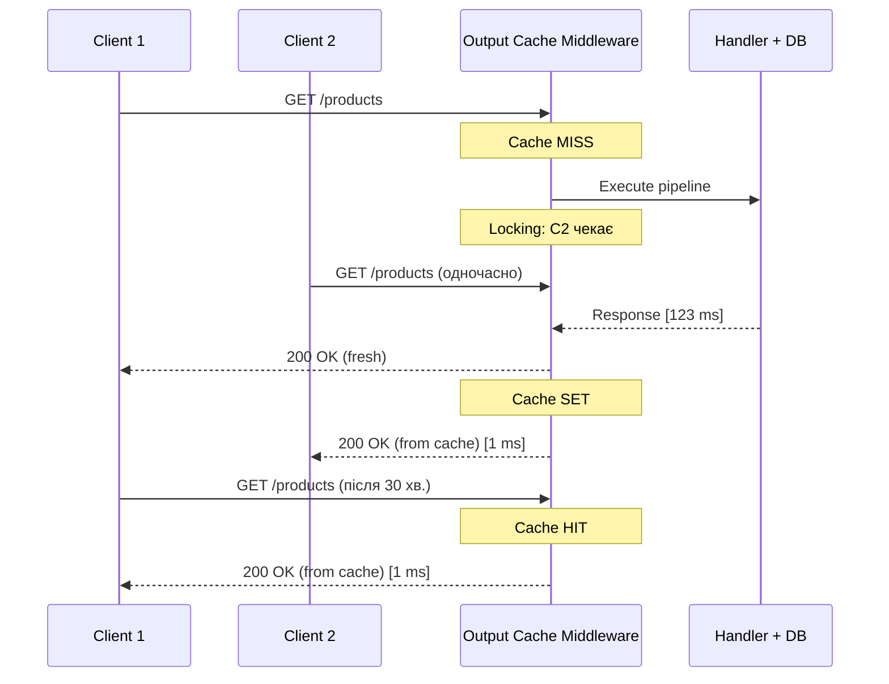

# Output Cache: серверний кеш HTTP-відповідей (.NET 7+)

Output Cache — найновіший і найфункціональніший механізм кешування HTTP-відповідей в ASP.NET Core, введений у .NET 7. Він kешує **готові HTTP-відповіді** на сервері: весь pipeline (middleware, routing, handler, serialization) виконується один раз, результат зберігається, і наступні ідентичні запити отримують збережену відповідь без повторного виконання pipeline.

На відміну від Response Cache (що покладається на браузер/CDN):
- **Output Cache** — серверний контроль. Ви знаєте точно що і скільки кешується.
- Підтримує кешування **авторизованих запитів** (Response Cache не може).
- Підтримує **програмну інвалідацію** через теги (`EvictByTagAsync`).
- Дозволяє **vary by будь-чого**: query params, route values, headers, cookies, custom logic.
- Має вбудований **locking** — тільки один запит виконує pipeline при cache miss (захист від Cache Stampede на рівні HTTP).

::mermaid



::

---

## Реєстрація і початкове налаштування

```csharp [Program.cs]
builder.Services.AddOutputCache(options =>
{
    // ─── Базова політика: застосовується до ВСІХ ендпоінтів ────
    // (але можна перевизначити для конкретних)
    options.AddBasePolicy(policy => policy
        .Expire(TimeSpan.FromSeconds(10))
        .With(ctx => ctx.HttpContext.Request.Method == HttpMethods.Get));
    // AddBasePolicy: кешуємо тільки GET-запити, 10 секунд

    // ─── Іменовані політики ─────────────────────────────────────

    // Список товарів — 30 хвилин, vary by query params, тег для інвалідації
    options.AddPolicy("products-list", policy => policy
        .Expire(TimeSpan.FromMinutes(30))
        .SetVaryByQuery("page", "pageSize", "search", "category", "sortBy")
        .Tag("products", "catalog"));

    // Деталі товару — 1 година, vary by id у маршруті
    options.AddPolicy("product-detail", policy => policy
        .Expire(TimeSpan.FromHours(1))
        .SetVaryByRouteValue("id")
        .Tag("products"));

    // Публічні дані що рідко змінюються (категорії, конфігурації)
    options.AddPolicy("static-data", policy => policy
        .Expire(TimeSpan.FromHours(24))
        .Tag("static"));

    // Авторизований контент — vary by Authorization header
    options.AddPolicy("authenticated", policy => policy
        .Expire(TimeSpan.FromMinutes(5))
        .SetVaryByHeader(HeaderNames.Authorization)
        .Tag("user-data"));

    // Без кешування — для мутуючих ендпоінтів
    options.AddPolicy("no-cache", policy => policy.NoStore());
});

var app = builder.Build();

// ВАЖЛИВО: UseOutputCache ПЕРЕД MapGet/MapPost
app.UseOutputCache();
```

---

## Застосування до ендпоінтів

### Через іменовану політику

```csharp [Features/Products/ProductEndpoints.cs]
var products = app.MapGroup("/products").WithTags("Products");

// Іменована політика — стисло і перевикористовувано
products.MapGet("/", async (ProductService svc, CancellationToken ct) =>
    Results.Ok(await svc.GetAllAsync(ct)))
    .CacheOutput("products-list");

products.MapGet("/{id:int}", async (int id, ProductService svc, CancellationToken ct) =>
{
    var product = await svc.GetByIdAsync(id, ct);
    return product is null ? Results.NotFound() : Results.Ok(product);
})
.CacheOutput("product-detail");
```

### Через inline-політику

```csharp
// Inline — для унікальних, одноразових налаштувань
products.MapGet("/featured", async (ProductService svc, CancellationToken ct) =>
    Results.Ok(await svc.GetFeaturedAsync(ct)))
    .CacheOutput(policy => policy
        .Expire(TimeSpan.FromMinutes(15))
        .Tag("products", "featured")
        .SetVaryByQuery("limit"));

// Зовсім без кешу
products.MapPost("/", async (CreateProductRequest req, ProductService svc, CancellationToken ct) =>
{
    var product = await svc.CreateAsync(req, ct);
    return Results.Created($"/products/{product.Id}", product);
})
.CacheOutput("no-cache");
```

---

## SetVaryBy: ключ кешу — деталі

Output Cache зберігає **окремий запис** для кожної унікальної комбінації Vary-значень. Ось усі способи:

### SetVaryByQuery — по параметрах запиту

```csharp
policy.SetVaryByQuery("page", "pageSize");
// /products?page=1&pageSize=10 → Ключ 1
// /products?page=2&pageSize=10 → Ключ 2
// /products?page=1&pageSize=20 → Ключ 3
// /products?page=1&pageSize=10&search=coffee → Ключ 4 (search не у Vary → ігнорується!)

// Всі параметри:
policy.SetVaryByQuery("*");
// /products?a=1&b=2 → Ключ A
// /products?a=1&b=3 → Ключ B
```

### SetVaryByRouteValue — по параметрах маршруту

```csharp
policy.SetVaryByRouteValue("id");
// /products/1 → Ключ 1
// /products/2 → Ключ 2
// /products/999 → Ключ 3

policy.SetVaryByRouteValue("category", "id");
// /categories/electronics/products/42 → Ключ (electronics, 42)
```

### SetVaryByHeader — по заголовках запиту

```csharp
// Vary by Accept-Language — окремий кеш для кожної мови
policy.SetVaryByHeader(HeaderNames.AcceptLanguage);
// Accept-Language: uk-UA → Ключ 1
// Accept-Language: en-US → Ключ 2

// Vary by Authorization — ОКРЕМИЙ кеш для кожного токена
policy.SetVaryByHeader(HeaderNames.Authorization);
// Authorization: Bearer token-user-1 → Ключ 1
// Authorization: Bearer token-user-2 → Ключ 2

// Кілька заголовків:
policy.SetVaryByHeader(HeaderNames.AcceptLanguage, HeaderNames.Authorization);
```

### SetVaryByValue — власна логіка vary

Найгнучкіший варіант: ви самі вирішуєте яке значення включити в ключ кешу:

```csharp
policy.SetVaryByValue(ctx =>
{
    // Vary by User ID (не весь токен — лише ID)
    var userId = ctx.HttpContext.User.FindFirst("sub")?.Value ?? "anonymous";
    return new ValueTask<string>(userId);
});

// Vary by роль
policy.SetVaryByValue(ctx =>
{
    var role = ctx.HttpContext.User.IsInRole("Admin") ? "admin" : "user";
    return new ValueTask<string>(role);
});

// Vary by тип пристрою (mobile vs desktop)
policy.SetVaryByValue(ctx =>
{
    var ua = ctx.HttpContext.Request.Headers.UserAgent.ToString();
    var isMobile = ua.Contains("Mobile", StringComparison.OrdinalIgnoreCase);
    return new ValueTask<string>(isMobile ? "mobile" : "desktop");
});
```

---

## Теги і програмна інвалідація

Теги — найважливіша функція Output Cache для реального застосування. Кожен запис кешу може мати кілька тегів, і `EvictByTagAsync` видаляє всі записи з певним тегом одним викликом.

```csharp [Services/ProductService.cs]
public class ProductService
{
    private readonly AppDbContext _db;
    private readonly IOutputCacheStore _cacheStore; // DI через constructor
    private readonly ILogger<ProductService> _logger;

    public ProductService(
        AppDbContext db,
        IOutputCacheStore cacheStore,
        ILogger<ProductService> logger)
    {
        _db = db;
        _cacheStore = cacheStore;
        _logger = logger;
    }

    public async Task<Product> CreateAsync(CreateProductRequest req, CancellationToken ct)
    {
        var product = new Product { Name = req.Name, Price = req.Price };
        _db.Products.Add(product);
        await _db.SaveChangesAsync(ct);

        // Інвалідуємо "products" — видаляє:
        // - GET /products (список)
        // - GET /products?page=1&pageSize=10
        // - GET /products?search=coffee
        // - GET /products/featured
        // - ВСЕ що промарковано тегом "products"
        await _cacheStore.EvictByTagAsync("products", ct);

        _logger.LogInformation(
            "Product [{Id}] created. Cache tag 'products' evicted.", product.Id);

        return product;
    }

    public async Task<bool> UpdateAsync(int id, UpdateProductRequest req, CancellationToken ct)
    {
        var product = await _db.Products.FindAsync([id], ct);
        if (product is null) return false;

        product.Name = req.Name;
        product.Price = req.Price;
        await _db.SaveChangesAsync(ct);

        // Видаляємо список (змінився) + конкретний товар (змінився)
        await _cacheStore.EvictByTagAsync("products", ct);
        // Якщо при реєстрації використовували тег $"product:{id}":
        // await _cacheStore.EvictByTagAsync($"product:{id}", ct);

        return true;
    }

    public async Task<bool> DeleteAsync(int id, CancellationToken ct)
    {
        var product = await _db.Products.FindAsync([id], ct);
        if (product is null) return false;

        _db.Products.Remove(product);
        await _db.SaveChangesAsync(ct);

        await _cacheStore.EvictByTagAsync("products", ct);

        return true;
    }
}
```

### Теги у налаштуваннях ендпоінтів

```csharp
// Тег у Policy
options.AddPolicy("products-list", policy => policy
    .Tag("products", "catalog")); // Два теги: products і catalog

// Тег inline
.CacheOutput(policy => policy
    .Tag("products")
    .Tag($"product:{id}")); // Динамічний тег з ID товару

// Тег з wildcard-стилем
.CacheOutput(policy => policy
    .Tag("products")
    .Tag("products:list")); // Для групування
```

### Endpoint ручної інвалідації (для адмінів)

```csharp [Features/Admin/AdminEndpoints.cs]
app.MapPost("/admin/cache/invalidate/{tag}", async (
    string tag,
    IOutputCacheStore store,
    CancellationToken ct) =>
{
    await store.EvictByTagAsync(tag, ct);
    return Results.Ok(new { message = $"Tag '{tag}' invalidated" });
})
.RequireAuthorization("AdminRole")
.CacheOutput("no-cache");  // Сама ця операція не кешується

// Інвалідація кількох тегів одразу
app.MapPost("/admin/cache/invalidate", async (
    string[] tags,
    IOutputCacheStore store,
    CancellationToken ct) =>
{
    await Task.WhenAll(tags.Select(t => store.EvictByTagAsync(t, ct).AsTask()));
    return Results.Ok(new { message = $"{tags.Length} tags invalidated" });
})
.RequireAuthorization("AdminRole")
.CacheOutput("no-cache");
```

---

## Кешування авторизованих запитів

Унікальна перевага Output Cache над Response Cache. Профіль користувача, персоналізовані налаштування — все можна кешувати за допомогою `SetVaryByHeader(Authorization)` або `SetVaryByValue`:

```csharp [Program.cs — Policy]
options.AddPolicy("user-profile", policy => policy
    .Expire(TimeSpan.FromMinutes(5))
    // Кожен унікальний Bearer token → окремий запис кешу
    .SetVaryByHeader(HeaderNames.Authorization)
    .Tag("user-profiles")
    .With(ctx =>
    {
        // Кешуємо тільки для автентифікованих
        return ctx.HttpContext.User.Identity?.IsAuthenticated == true;
    }));
```

```csharp [Features/Users/UserEndpoints.cs]
app.MapGet("/profile", async (
    HttpContext ctx,
    UserService svc,
    CancellationToken ct) =>
{
    var userId = ctx.User.FindFirst("sub")!.Value;
    var profile = await svc.GetProfileAsync(userId, ct);
    return Results.Ok(profile);
})
.RequireAuthorization()
.CacheOutput("user-profile");
```

```csharp [Services/UserService.cs — Інвалідація при оновленні профілю]
public async Task UpdateProfileAsync(
    string userId,
    UpdateProfileRequest req,
    IOutputCacheStore store,
    CancellationToken ct)
{
    // Оновлюємо профіль
    var user = await _db.Users.FindAsync([userId], ct);
    user!.DisplayName = req.DisplayName;
    await _db.SaveChangesAsync(ct);

    // Інвалідуємо кеш профілів (всі токени цього користувача)
    // Потрібен тег прив'язаний до userId:
    await store.EvictByTagAsync($"user:{userId}", ct);
    // Але тег з userId треба встановлювати при кешуванні!
}
```

Для тегу прив'язаного до userId — потрібна власна IOutputCachePolicy (бо tag у moment кешування залежить від Identity):

```csharp [Policies/UserProfilePolicy.cs]
public class UserProfilePolicy : IOutputCachePolicy
{
    public ValueTask CacheRequestAsync(
        OutputCacheContext context,
        CancellationToken cancellationToken)
    {
        var isAuth = context.HttpContext.User.Identity?.IsAuthenticated == true;
        context.EnableOutputCaching = isAuth;
        context.AllowCacheLookup = isAuth;
        context.AllowCacheStorage = isAuth;
        context.AllowLocking = true;
        return ValueTask.CompletedTask;
    }

    public ValueTask ServeFromCacheAsync(
        OutputCacheContext context,
        CancellationToken cancellationToken)
        => ValueTask.CompletedTask;

    public ValueTask ServeResponseAsync(
        OutputCacheContext context,
        CancellationToken cancellationToken)
    {
        var userId = context.HttpContext.User.FindFirst("sub")?.Value;
        if (userId is not null)
        {
            // Тег залежить від userId — додаємо при збереженні
            context.Tags.Add($"user:{userId}");
            context.Tags.Add("user-profiles"); // Загальний тег для bulk invalidation
        }

        context.ResponseExpirationTimeSpan = TimeSpan.FromMinutes(5);
        return ValueTask.CompletedTask;
    }
}
```

Реєстрація:

```csharp [Program.cs]
options.AddPolicy("user-profile", new UserProfilePolicy());
```

---

## Locking: вбудований захист від Cache Stampede

Output Cache має вбудований механізм блокування (`AllowLocking = true` за замовчуванням). При cache miss тільки **один** запит виконує pipeline, решта чекають на результат:

```csharp
policy.AllowLocking(true);  // За замовчуванням true — не потрібно вказувати явно

// Вимкнути locking (якщо дорогі операції небезпечні для паралельного виконання)
// Наприклад: streaming операції, файлові операції
policy.AllowLocking(false);
```

Порівняйте з `IMemoryCache`: там потрібен `SemaphoreSlim` вручну. Output Cache — автоматично.

---

## Redis store для multi-instance розгортання

За замовчуванням Output Cache зберігає відповіді в in-process пам'яті — як `IMemoryCache`, кожен сервер має свій незалежний кеш. Для multi-instance — потрібен Redis store:

```bash
dotnet add package Microsoft.AspNetCore.OutputCaching.StackExchangeRedis
```

```csharp [Program.cs]
builder.Services.AddStackExchangeRedisOutputCache(options =>
{
    options.Configuration = builder.Configuration.GetConnectionString("Redis");
    options.InstanceName = "OutputCache:";
});

builder.Services.AddOutputCache(options =>
{
    // Налаштування політик — без змін
    options.AddPolicy("products-list", policy => policy
        .Expire(TimeSpan.FromMinutes(30))
        .SetVaryByQuery("page", "pageSize")
        .Tag("products"));
});
```

При Redis store — кеш HTTP-відповідей (весь HTTP body у байтах) зберігається в Redis. `EvictByTagAsync` також використовує Redis для пошуку і видалення.

::tip
Redis store для Output Cache зберігає значно **більше даних** ніж `IDistributedCache` при однаковому трафіку: кожна унікальна комбінація Vary-параметрів = окремий запис у Redis, і записи можуть бути великими (весь JSON body). Слідкуйте за `redis-cli INFO memory` у production.
::

---

## Умовне кешування через .With()

Метод `.With()` дозволяє задати умову — кешувати тільки якщо вона виконана:

```csharp
options.AddPolicy("conditional", policy => policy
    .Expire(TimeSpan.FromMinutes(30))
    .Tag("products")
    // Кешуємо тільки GET і HEAD
    .With(ctx => ctx.HttpContext.Request.Method is HttpMethods.Get or HttpMethods.Head)
    // І тільки якщо немає заголовка No-Cache від клієнта
    .With(ctx => !ctx.HttpContext.Request.Headers.CacheControl
        .ToString().Contains("no-cache"))
    // І тільки якщо запит не від адміна
    .With(ctx => !ctx.HttpContext.User.IsInRole("Admin")));
```

---

## Цілковитий Program.cs: продакшн-конфігурація

```csharp [Program.cs]
using Microsoft.AspNetCore.OutputCaching;
using Microsoft.Net.Http.Headers;
using ShopApi.Features.Products;
using ShopApi.Features.Admin;
using ShopApi.Policies;

var builder = WebApplication.CreateBuilder(args);

// ─── Output Cache ──────────────────────────────────────────────
if (builder.Environment.IsProduction())
{
    // Production: Redis store (multi-instance)
    builder.Services.AddStackExchangeRedisOutputCache(opts =>
    {
        opts.Configuration = builder.Configuration.GetConnectionString("Redis");
        opts.InstanceName = "OC:";
    });
}
else
{
    // Development: in-memory store (без Redis)
    builder.Services.AddOutputCache();
}

builder.Services.AddOutputCache(options =>
{
    // Базова: кешуємо тільки GET, 10 секунд
    options.AddBasePolicy(policy => policy
        .Expire(TimeSpan.FromSeconds(10))
        .With(ctx => ctx.HttpContext.Request.Method == HttpMethods.Get));

    // Публічний каталог — 30 хвилин
    options.AddPolicy("catalog", policy => policy
        .Expire(TimeSpan.FromMinutes(30))
        .SetVaryByQuery("page", "pageSize", "search", "category", "sortBy", "order")
        .Tag("products", "catalog"));

    // Деталі товару — 1 година
    options.AddPolicy("product", policy => policy
        .Expire(TimeSpan.FromHours(1))
        .SetVaryByRouteValue("id")
        .Tag("products"));

    // Профіль користувача — 5 хвилин
    options.AddPolicy("profile", new UserProfilePolicy());

    // Статичні дані — 24 години
    options.AddPolicy("static", policy => policy
        .Expire(TimeSpan.FromHours(24))
        .Tag("static"));

    // Без кешу
    options.AddPolicy("none", policy => policy.NoStore());
});

// ─── Сервіси ──────────────────────────────────────────────────
builder.Services.AddDbContext<AppDbContext>(opts =>
    opts.UseNpgsql(builder.Configuration.GetConnectionString("Default")));
builder.Services.AddScoped<ProductService>();
builder.Services.AddAuthentication().AddJwtBearer();
builder.Services.AddAuthorization();

var app = builder.Build();

// ─── Middleware (порядок важливий) ────────────────────────────
app.UseAuthentication();
app.UseAuthorization();
app.UseOutputCache(); // Після auth, перед endpoints

// ─── Endpoints ────────────────────────────────────────────────

// --- Каталог (публічний) ---
app.MapGet("/products", async (ProductService svc, CancellationToken ct) =>
    Results.Ok(await svc.GetAllAsync(ct)))
    .CacheOutput("catalog");

app.MapGet("/products/{id:int}", async (int id, ProductService svc, CancellationToken ct) =>
{
    var p = await svc.GetByIdAsync(id, ct);
    return p is null ? Results.NotFound() : Results.Ok(p);
})
.CacheOutput("product");

app.MapGet("/categories", async (CategoryService svc, CancellationToken ct) =>
    Results.Ok(await svc.GetAllAsync(ct)))
    .CacheOutput("static");

// --- Мутуючі ендпоінти (без кешу) ---
app.MapPost("/products", async (
    CreateProductRequest req, ProductService svc, CancellationToken ct) =>
{
    var p = await svc.CreateAsync(req, ct);
    return Results.Created($"/products/{p.Id}", p);
})
.RequireAuthorization()
.CacheOutput("none");

app.MapPut("/products/{id:int}", async (
    int id, UpdateProductRequest req, ProductService svc, CancellationToken ct) =>
{
    var ok = await svc.UpdateAsync(id, req, ct);
    return ok ? Results.Ok() : Results.NotFound();
})
.RequireAuthorization()
.CacheOutput("none");

// --- Авторизований контент ---
app.MapGet("/profile", async (HttpContext ctx, UserService svc, CancellationToken ct) =>
{
    var userId = ctx.User.FindFirst("sub")!.Value;
    return Results.Ok(await svc.GetProfileAsync(userId, ct));
})
.RequireAuthorization()
.CacheOutput("profile");

// --- Адмін: ручна інвалідація ---
app.MapGroup("/admin")
    .RequireAuthorization("AdminRole")
    .MapPost("/cache/invalidate/{tag}", async (
        string tag, IOutputCacheStore store, CancellationToken ct) =>
    {
        await store.EvictByTagAsync(tag, ct);
        return Results.Ok(new { evicted = tag });
    })
    .CacheOutput("none");

app.Run();
```

---

## Тестування через .http файл

```http
### Перший запит — pipeline виконується (~50 мс)
GET http://localhost:5000/products?page=1&pageSize=10

### Другий запит — Output Cache HIT (<1 мс)
GET http://localhost:5000/products?page=1&pageSize=10

### Інші параметри — окремий запис кешу
GET http://localhost:5000/products?page=2&pageSize=10

### Після оновлення — кеш інвалідовано
PUT http://localhost:5000/products/1
Content-Type: application/json
Authorization: Bearer {{admin_token}}

{ "name": "Updated", "price": 199.99 }

### Список після PUT — знову MISS (кеш інвалідовано)
GET http://localhost:5000/products?page=1&pageSize=10

### Ручна інвалідація
POST http://localhost:5000/admin/cache/invalidate/products
Authorization: Bearer {{admin_token}}

### Профіль — авторизований
GET http://localhost:5000/profile
Authorization: Bearer {{user1_token}}

### Той самий профіль — cache HIT
GET http://localhost:5000/profile
Authorization: Bearer {{user1_token}}

### Інший користувач — cache MISS (інший токен)
GET http://localhost:5000/profile
Authorization: Bearer {{user2_token}}
```

---

## Діагностика: X-Cache заголовки

Output Cache автоматично додає заголовки до відповіді:

```
HTTP/1.1 200 OK
X-Output-Cache-Status: Miss  ← pipeline виконано
Content-Type: application/json

HTTP/1.1 200 OK
X-Output-Cache-Status: Hit   ← з кешу (без виконання pipeline)
Age: 125                     ← секунди у кеші
```

Якщо цих заголовків немає — Output Cache не застосувався (перевірте порядок middleware і умови `.With()`).

---

## Практичні завдання

### Рівень 1 — Базовий

**Завдання 1.1.** Налаштуйте Output Cache для ShopApi. Переконайтесь що при першому GET `/products` у відповіді є `X-Output-Cache-Status: Miss`, при повторному — `Hit`. Додайте `Tag("products")` і після `PUT /products/1` перевірте що наступний GET повертає `Miss` (кеш інвалідовано).

**Завдання 1.2.** Налаштуйте `SetVaryByQuery` для сторінкування: `/products?page=1&pageSize=10` і `/products?page=2&pageSize=10` повинні мати **окремі** записи кешу. При цьому `/products?page=1&pageSize=10&unknownParam=abc` повинен повертати **той самий** кеш що і без `unknownParam` (невказані в Vary параметри ігноруються).

### Рівень 2 — Логіка

**Завдання 2.1.** Реалізуйте `UserProfilePolicy` з наданого прикладу. Налаштуйте теги `$"user:{userId}"`. Перевірте:
- Дві різні сесії (два Bearer токени для одного userId) → один і той самий кеш
- Після `PUT /profile` → `EvictByTagAsync($"user:{userId}")` → наступний GET повертає Miss

Підказка: для різних токенів одного userId використовуйте `SetVaryByValue(ctx => userId)` замість `SetVaryByHeader(Authorization)`.

**Завдання 2.2.** Реалізуйте endpoint `GET /admin/cache/status` що повертає список всіх кешованих записів (ключів) у Output Cache. Для in-process store: перегляньте чи є публічний API. Для Redis store: `redis-cli KEYS "OC:*"`.

### Рівень 3 — Архітектура

**Завдання 3.1.** Перейдіть на **Redis Output Cache store** (`AddStackExchangeRedisOutputCache`). Перевірте через `redis-cli MONITOR` що:
1. При GET з cache miss — ключ створюється в Redis
2. При GET з cache hit — ключ читається з Redis (GET команда)
3. При `EvictByTagAsync` — ключі видаляються (DEL команди)
4. Після перезапуску сервера — кеш залишається (Redis персистентний)

Порівняйте latency in-memory vs Redis Output Cache через `Stopwatch`.
