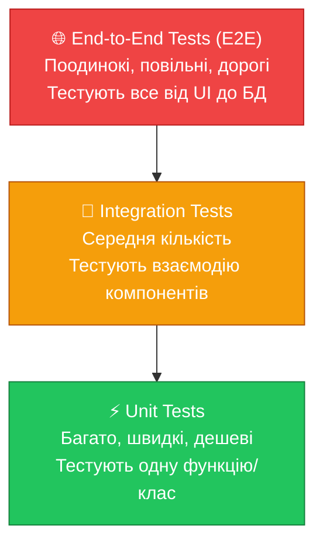
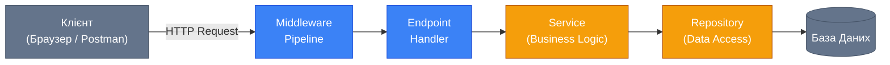

# Вступ до тестування програмного забезпечення

::note
Цей розділ відкриває нову велику тему — автоматизоване тестування. Якщо ви ніколи не писали тести, не хвилюйтеся: ми починаємо з абсолютного нуля і поступово підіймемося до тестування реальних ASP.NET застосунків.
::

## 1. Проблема: Ціна помилки зростає з часом

Уявіть, що ви будуєте будинок. Якщо під час проектування ви допустилися помилки у кресленнях — виправити її коштує копійки: поправив олівцем і все. Якщо помилку виявили під час заливки фундаменту — вже потрібен час і кошти на демонтаж та переробку. А якщо помилку знайшли вже після повної забудови — мова про знесення та відбудову, мільйонні витрати.

У розробці програмного забезпечення діє абсолютно аналогічний закон.

Дослідження IBM Systems Sciences Institute встановило, що **вартість виправлення помилки, знайденої на продакшені, в 30-100 разів вища**, ніж якби ту саму помилку знайшли під час написання коду. Чому так?

- На **стадії кодування** — розробник просто виправляє рядок коду.
- На **стадії тестування** (вручну) — QA знаходить баг, пише звіт, розробник відкладає нове завдання, шукає причину, виправляє, QA ретестує. Мінімум день.
- На **продакшені** — сотні користувачів стикаються з проблемою, підтримка отримує тікети, розробник розслідує в умовах стресу та нестачі часу, потрібен екстрений деплой. Пошкоджена репутація.

::premium-alert{type="warning" title="Помилка без тестів живе довше"}
Без автоматизованих тестів ви дізнаєтеся про помилку лише тоді, коли на неї наткнеться людина — або QA, або кінцевий користувач. Чим пізніше — тим дорожче.
::

**Автоматизовані тести** — це код, який перевіряє інший код. Вони дозволяють машині шукати помилки замість людини, і робити це миттєво та невтомно.

## 2. Що таке автоматизований тест?

Автоматизований тест (automated test) — це окрема програма (або функція), яка:

1. **Готує** (Arrange) певний стан системи або об'єкта.
2. **Виконує** (Act) конкретну дію або виклик функції.
3. **Перевіряє** (Assert) чи є результат очікуваним.

Якщо результат не збігається з очікуваним — тест «червоніє» (fails) і ви миттєво знаєте про поломку.

Цей патерн із трьох кроків настільки фундаментальний, що отримав власну назву — **AAA (Arrange, Act, Assert)**. Ви зустрінете його у кожному прикладі тесту в цьому курсі.

```csharp [Приклад простого тесту]
// Arrange — готуємо дані
var calculator = new Calculator();
var a = 5;
var b = 3;

// Act — виконуємо дію
var result = calculator.Add(a, b);

// Assert — перевіряємо результат
Assert.Equal(8, result);
```

На перший погляд здається, що це зайва робота — адже можна просто запустити застосунок і перевірити вручну. Але цей тест виконується за мілісекунди, може запускатися тисячі разів на день і ніколи не забуде перевірити граничний випадок.

## 3. Піраміда тестування (Testing Pyramid)

Не всі тести однакові. Існує три основні рівні, і вони утворюють класичну **піраміду тестування** (Testing Pyramid), яку описав Майк Кон у книзі «Succeeding with Agile» (2009).

::mermaid



::

Піраміда означає, що **основу вашого тестового покриття мають складати unit-тести** — їх повинно бути найбільше. Вгору по піраміді кількість тестів зменшується, але кожен тест охоплює більший обсяг функціоналу.

::card-group

::card{title="⚡ Unit Tests (Модульні)" icon="i-lucide-zap"}

Тестують **одну ізольовану одиницю** коду — метод, клас, функцію.

- Виконуються за мілісекунди
- Не потребують бази даних, мережі, файлової системи
- Кількість: сотні і тисячі
- **Зона відповідальності**: «Чи правильно працює мій метод?»

::

::card{title="🔗 Integration Tests (Інтеграційні)" icon="i-lucide-link"}

Тестують **взаємодію між декількома компонентами** — сервіс + репозиторій, контролер + БД.

- Виконуються секунди
- Можуть потребувати БД (тестова, in-memory або контейнер)
- Кількість: десятки
- **Зона відповідальності**: «Чи правильно компоненти спілкуються між собою?»

::

::card{title="🌐 E2E Tests (Наскрізні)" icon="i-lucide-globe"}

Тестують **весь стек** — від UI до бази даних, як реальний користувач.

- Виконуються хвилини
- Потребують повноцінного розгорнутого стека
- Кількість: одиниці (ключові сценарії)
- **Зона відповідальності**: «Чи коректно вся система працює разом?»

::

::

У цьому курсі ми найбільше зосередимося на **Unit** та **Integration** тестах — саме вони дають найкращий баланс між вартістю написання та цінністю для проєкту.

## 4. Ключова термінологія

Перш ніж рухатися далі, необхідно закласти міцний термінологічний фундамент. Ці терміни ви зустрінете в кожній дискусії про тестування.

::accordion
::accordion-item{label="SUT (System Under Test)" icon="i-lucide-target"}
**СУТ (Система під Тестом)** — об'єкт або фрагмент коду, який ми безпосередньо тестуємо. Наприклад, якщо ми тестуємо метод `CalculateTax()` класу `TaxService`, то `TaxService` і є нашим SUT. Чітке позначення SUT у тесті робить його зрозумілішим.
::
::accordion-item{label="Test Double (Тестовий дублер)" icon="i-lucide-copy"}
Загальна назва для будь-якого «підробленого» об'єкта, який ми використовуємо замість реального в тестах. Включає Stub, Mock, Fake. Аналогія: у кіно є каскадер, який замість актора виконує небезпечні трюки — він є «дублером» актора.
::
::accordion-item{label="Stub (Заглушка)" icon="i-lucide-plug"}
Найпростіший тестовий дублер. Повертає заздалегідь визначені відповіді на виклики. Наприклад, `stubbedRepository.GetUser(1)` завжди повертає одного й того самого User з тестовими даними. Stub **не перевіряє**, чи були зроблені певні виклики.
::
::accordion-item{label="Mock (Мок)" icon="i-lucide-shield-check"}
«Розумна» версія Stub. Mock — це тестовий дублер, який додатково **відстежує та перевіряє взаємодії**. Наприклад, Mock може перевірити, що метод `SendEmail()` був викликаний рівно один раз з певними параметрами. Якщо виклику не було — тест провалиться.
::
::accordion-item{label="Fake (Підробка)" icon="i-lucide-database"}
Повноцінна, але спрощена реалізація компонента. Наприклад, InMemoryRepository — це повноцінний репозиторій, але замість реальної БД він зберігає дані у словнику в пам'яті. Fake зазвичай використовують для заміни важких інфраструктурних компонентів (БД, файлова система).
::
::accordion-item{label="Test Coverage (Покриття)" icon="i-lucide-percent"}
Відсоток коду, який виконується під час запуску тестів. 80% coverage означає, що 80% рядків вашого production-коду «торкнуться» тести. Це метрика, але не ціль сама по собі — 100% coverage не гарантує відсутність помилок.
::
::accordion-item{label="Regression (Регресія)" icon="i-lucide-alert-triangle"}
Ситуація, коли зміни в одній частині коду ненавмисно «зламали» іншу частину, яка раніше працювала коректно. Автоматизовані тести — це найнадійніший захист від регресій: після будь-яких змін ви запускаєте всі тести та миттєво бачите, що «поламалося».
::
::

## 5. Навіщо тести в реальному ASP.NET проєкті?

Студенти часто запитують: «Чи обов'язково писати тести? Адже можна просто запустити Postman і перевірити вручну!». Це правомірне питання, і воно заслуговує на чесну відповідь.

**Ручне тестування через Postman — це тест**, і він цінний. Але він має фундаментальний недолік: **він одноразовий і не масштабується**.

Уявіть такий сценарій: у вас є ASP.NET API з 50 ендпоінтами. Ви вносите зміни у middleware-компонент авторизації. Щоб переконатися, що нічого не зламалося, вам потрібно вручну перевірити всі 50 ендпоінтів у різних сценаріях (авторизований / неавторизований / неправильний JWT-токен). Це займе кілька годин роботи. І так — при кожній наступній зміні.

Автоматизовані тести вирішують цю задачу за **секунди** при кожному `git push` або через CI/CD пайплайн.

::tabs
::tabs-item{label="Без тестів"}
```
Цикл змін без тестів:
1. Написав код
2. Запустив локально, перевірив 2-3 кейси вручну
3. Відправив на ревʼю
4. Задеплоїли на стейджінг
5. QA вручну регресить (2-8 годин)
6. Знайшов баг
7. Виправив, повтор з кроку 3

⏱ Середня тривалість циклу: 1-3 дні
```
::
::tabs-item{label="З тестами"}
```
Цикл змін з тестами:
1. Написав код
2. Написав тест, що підтверджує коректну роботу
3. Запустив: dotnet test (10 секунд, 500 тестів)
4. Всі ✅ — відправив на ревʼю
5. CI/CD автоматично запускає тести
6. Задеплоїли (тести пройшли — є впевненість)

⏱ Середня тривалість циклу: декілька годин
```
::
::

## 6. Що ми тестуємо в ASP.NET Minimal API?

У контексті ASP.NET застосунку різні частини системи потребують різних підходів до тестування.

::mermaid



::

| Компонент | Тип тесту | Що перевіряємо |
|---|---|---|
| **Service** (бізнес-логіка) | Unit Test | Правильність алгоритмів, розрахунків, валідацій |
| **Repository** | Integration Test | Правильність SQL-запитів до тестової БД |
| **Endpoint Handler** | Integration Test | HTTP-статус, JSON-відповідь, маршрутизацію |
| **Весь стек** | E2E Test | Реальний сценарій користувача |

## 7. Дорожня карта цього розділу

Ми будемо рухатися від простого до складного, і кожен крок буде логічно виростати з попереднього.

::steps

### Крок 1: xUnit — основи тестового фреймворку

Познайомимося з xUnit — стандартним фреймворком для тестування в .NET. Навчимося писати перші тести з `[Fact]` та `[Theory]`.

### Крок 2: TDD — методологія написання коду через тести

Засвоїмо підхід Test-Driven Development: спочатку тест — потім код. Це змінить те, як ви думаєте про розробку.

### Крок 3: Moq — ізоляція залежностей

Дізнаємося, як тестувати класи у повній ізоляції від зовнішніх систем (БД, email-сервіс тощо) за допомогою бібліотеки Moq.

### Крок 4: Integration Testing — WebApplicationFactory

Навчимося підіймати справжній ASP.NET тестовий сервер у пам'яті та надсилати реальні HTTP-запити у тестах.

### Крок 5: Тестування Minimal API ендпоінтів

Застосуємо всі знання до реальних кейсів: тестуватимемо авторизацію, валідацію і повний ланцюжок обробки запитів.

::

## 8. Резюме

У цьому вступному розділі ми заклали концептуальний фундамент:

- **Тестування — це інвестиція**, а не накладні витрати. Чим раніше знайдена помилка, тим дешевше її виправити.
- **Піраміда тестування** допомагає знайти правильний баланс: багато unit-тестів, менше integration, ще менше E2E.
- **AAA-патерн** (Arrange-Act-Assert) — універсальна структура будь-якого тесту.
- Ми знаємо ключову термінологію: SUT, Mock, Stub, Fake, Test Coverage, Regression.

Тепер ми готові перейти до практики і написати наші перші реальні тести мовою C#.

---

## Практичні завдання

::accordion
::accordion-item{label="Рівень 1: Розуміння концепцій" icon="i-lucide-circle-help"}

**Завдання 1.1 — Класифікація тестів.**
Для кожного з наведених сценаріїв визначте тип тесту (Unit, Integration або E2E) та обґрунтуйте свій вибір:

1. Тест перевіряє, що метод `CalculateDiscount(100, 0.1m)` повертає `90m`.
2. Тест запускає повний застосунок, відкриває браузер, авторизується через UI та перевіряє, що на головній сторінці є вітальне повідомлення.
3. Тест перевіряє, що `POST /api/orders` зберігає замовлення в тестовій базі даних і повертає HTTP 201.

**Завдання 1.2 — Термінологія.**
Поясніть своїми словами різницю між `Mock` та `Stub`. Наведіть конкретний приклад, коли слід використовувати кожен.

::
::accordion-item{label="Рівень 2: Аналіз коду" icon="i-lucide-code"}

**Завдання 2.1 — Знайдіть помилку.**
Нижче наведений код тесту має порушення AAA-патерну. Знайдіть і виправте його:

```csharp
[Fact]
public void ShouldCalculateCorrectly()
{
    var calc = new Calculator();
    Assert.Equal(10, calc.Add(4, 6)); // Перевірка 1
    var result = calc.Multiply(3, 4);
    Assert.Equal(12, result); // Перевірка 2
}
```

*Підказка: що саме порушило принцип «один тест — одна перевірка»?*

**Завдання 2.2 — Визначте SUT.**
Для наступного тесту визначте, що є SUT, що є Test Double, і що перевіряє Assert:

```csharp
[Fact]
public async Task SendWelcomeEmail_WhenUserRegisters_CallsEmailServiceOnce()
{
    var mockEmailService = new Mock<IEmailService>();
    var userService = new UserService(mockEmailService.Object);

    await userService.RegisterAsync("test@example.com");

    mockEmailService.Verify(s => s.SendAsync(It.IsAny<string>(), It.IsAny<string>()), Times.Once);
}
```

::
::accordion-item{label="Рівень 3: Проєктування" icon="i-lucide-layout-dashboard"}

**Завдання 3.1 — Тестова стратегія.**
Уявіть, що ви розробляєте ASP.NET Minimal API для інтернет-магазину з такими компонентами:
- `ProductService` — розраховує ціни з урахуванням знижок
- `OrderRepository` — зберігає замовлення в PostgreSQL
- `EmailNotificationService` — надсилає email через SendGrid

Складіть **тестову стратегію** у вигляді таблиці: вкажіть для кожного компонента тип тесту, що саме ви будете тестувати та який підхід до ізоляції застосуєте (реальна БД, InMemory, Mock).

**Завдання 3.2 — Порочний порочний монолiт.**
Вам дісталася спадковість: ASP.NET-проєкт без жодного тесту, де весь код знаходиться в методах контролерів (`ProductsController` — 2000 рядків). Описіть покроковий план впровадження тестів у такий проєкт, починаючи від найбільш критичних і ризикованих частин.

::
::
