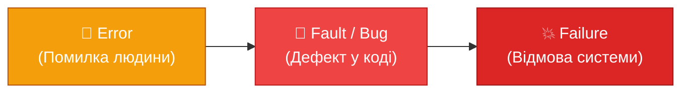

# Що таке тестування? Від інтуїції до науки

## Три катастрофи, які змінили індустрію

Є дата, яку ніколи не забудуть в Європейському космічному агентстві: **4 червня 1996 року**. Ракета Ariane 5 стартувала з космодрому Куру у Французькій Гвіані, і через 37 секунд після запуску самознищилась разом із вантажем вартістю понад **500 мільйонів доларів**. Причина? Дрібна помилка переповнення цілого числа (integer overflow) у коді системи навігації, який був перенесений без змін з попередньої ракети Ariane 4 — але ніхто не перевірив, чи коректно він працює в нових умовах з іншими числовими діапазонами.

::note
Офіційний звіт розслідування прямо зазначив: "The failure was caused by complete loss of guidance and attitude information... This was caused by a software exception." Звіт є публічним і досі читається як моральна притча про те, що відбувається, коли ніхто не контролює критичні припущення в коді.
::

Ще більш моторошну картину демонструє **радіаційна машина Therac-25**, що використовувалась у 1980-х для лікування раку. Через race condition у програмному коді — ситуацію, що виникала лише при дуже швидкому введенні команд операторами — машина подавала дози радіації у сотні разів більші за норму. Щонайменше шість пацієнтів загинули або отримали смертельні дози. Розробники вважали систему безпечною, бо "вже тестували" — але тестували ізольовано, без урахування реальних сценаріїв взаємодії.

І якщо ці приклади видаються далекими від повсякденного комерційного розробника, ось свіжіший: **Knight Capital Group**, 2012 рік. Фінансова компанія розгорнула нову торгову систему і забула деактивувати старий код у виробничому середовищі. За **45 хвилин** автоматизована система виконала мільйони хибних ордерів і втратила **440 мільйонів доларів**. Компанія збанкрутувала. Причина — відсутність інтеграційного тестування розгортання.

Ці три приклади об'єднує одне: **не брак часу, а брак культури верифікації**. Тестування не проводилось або проводилось недостатньо. І це коштувало людських життів та мільярдів доларів.

Тепер поставте собі просте запитання: **як ви знаєте, що ваш код працює?**

Якщо відповідь — "просто бачу логіку", "запустив раз і подивився" або "ніхто ще не скаржився" — то ця стаття — саме для вас. Якщо відповідь — "у мене є тести" — ця стаття поглибить ваше розуміння того, що саме ви робите і навіщо.

## Академічне визначення: що таке тестування насправді

Більшість розробників під словом "тестування" розуміють щось на зразок "запустити програму і подивитися, чи не падає". Це інтуїтивно правильний, але надзвичайно неповний погляд. Спробуємо дати точніше визначення.

**IEEE Std 829** — стандарт документації тестування програмного забезпечення — визначає тестування як:

> "The process of operating a system or component under specified conditions, observing or recording the results, and making an evaluation of some aspect of the system or component."

**ISTQB (International Software Testing Qualifications Board)** — найбільша у світі організація з сертифікації тестувальників — дає таке визначення:

> "Software testing is a set of activities to discover defects and evaluate the quality of software artifacts. These activities are planned and performed by means of a set of techniques and practices."

Розберемо обидва визначення. По-перше, **тестування — це процес**, а не одноразова дія. Це систематична, повторювана діяльність з чіткими кроками. По-друге, **умови мають бути специфіковані** — тобто ми маємо знати, що саме вводимо, і що саме очікуємо на виході. По-третє, **результати необхідно оцінювати** — порівнювати фактичну поведінку системи з очікуваною.

Цей останній пункт — ключовий. Тестування без чіткого визначення **очікуваного результату** — це не тестування. Це спостереження.

::tip
Практична формула тестування: **Тест = Вхідні умови + Дія + Очікуваний результат + Спостережуваний результат + Порівняння**. Якщо будь-який з цих елементів відсутній, ви не тестуєте — ви просто виконуєте код.
::

## Тестування vs Debugging: критична різниця

Це одна з найпоширеніших концептуальних плутанин серед початківців. Розглянемо її детально.

**Тестування** — це процес **знаходження** того, що щось не так. Ми виконуємо систему з певними вхідними даними і спостерігаємо, чи поводиться вона відповідно до специфікації.

**Debugging (налагодження)** — це процес **виправлення** вже знайденої проблеми. Ми знаємо, що є баг (або підозрюємо, де він), і намагаємося локалізувати та усунути його.

::card-group

::card{title="🔍 Тестування" icon="i-lucide-search"}
- Систематичний процес виявлення дефектів
- Виконується за визначеними тест-кейсами
- Може виконуватись без знання внутрішньої реалізації
- Результат: знайдено / не знайдено дефект
- Хто: тестувальник, розробник, автоматизована система

::

::card{title="🔧 Debugging" icon="i-lucide-wrench"}
- Аналітичний процес локалізації та виправлення дефекту
- Виконується після виявлення симптому
- Вимагає знання коду та інструментів відладки
- Результат: виправлений код
- Хто: розробник

::

::

Метафора: уявіть, що ваш автомобіль не запускається. **Тестування** — це коли механік перевіряє акумулятор, перевіряє запалення, перевіряє паливо, щоб **знайти** проблему. **Debugging** — це коли він вже знає, що проблема у свічках запалення, і **замінює** їх.

Ця різниця важлива, бо вони вимагають різних навичок, різного мислення і часто — різних людей. Автор коду зазвичай чудово справляється з debugging, але є поганим тестувальником власного коду. Чому — поговоримо далі.

## Поппер і наукова фальсифікація: філософська основа тестування

Тестування ПЗ має глибокий зв'язок з філософією науки, зокрема з роботами Карла Поппера. Поппер сформулював принцип **фальсифікованості** (falsifiability): наукова теорія є правдивою не тоді, коли ми знаходимо підтвердження їй, а тоді, коли ми **не можемо її спростувати** попри спроби.

Перенесемо це на ПЗ. **Ми не можемо довести, що програма повністю правильна** — бо кількість можливих вхідних комбінацій для будь-якої нетривіальної програми є практично нескінченною. Ми можемо лише намагатися **спростувати** її правильність — і якщо нам не вдається, то підвищується наша довіра до системи.

Саме тому **Едсгер Дейкстра** — один із засновників теоретичної інформатики — сказав:

> "Program testing can be used to show the presence of bugs, but never to show their absence."

Це здається песимістичним, але насправді є надзвичайно точним і важливим для практика. Дейкстра не говорить, що тестування безглузде. Він говорить, що тестування дає **часткові гарантії** у межах того, що ми перевірили, і що необхідно розуміти ці межі.

Це означає: добре продумані тести значно підвищують довіру до коду. Погано продумані тести дають хибне відчуття безпеки. Відмінність — у якості та повноті тест-кейсів, про які ми поговоримо детально в [статті про аналіз тестових умов](/csharp/aspnet/testing/what-to-test).

## Чому не тестують: міти та реальні причини

Якщо тестування настільки важливе, чому так багато команд уникає його або робить поверхово? Давайте розберемо найпоширеніші аргументи.

### Міт 1: "Немає часу на тести"

Це, мабуть, найчастіший аргумент. Дедлайн завтра, фіча потрібна тепер, тести можна написати потім.

Проблема в тому, що "потім" ніколи не настає. **Технічний борг (technical debt)** — термін, запроваджений Вардом Каннінгемом — це метафора для "позики" в майбутнього себе. Ми беремо у борг час зараз, але потім платимо з відсотками. Без тестів кожна нова зміна стає ризикованою, рефакторинг — небезпечним, а час на ручну перевірку з кожним спринтом зростає.

IBM Research провела дослідження вартості виправлення дефекту на різних стадіях розробки. Результати:

| Стадія виявлення дефекту | Відносна вартість виправлення |
|--------------------------|-------------------------------|
| Під час написання коду   | 1×                            |
| Під час code review      | 5×                            |
| Під час тестування QA    | 10×                           |
| У бета-версії у клієнтів | 50×                           |
| У продакшні              | 100×                          |

Таким чином, "зекономлений" час на тестах — це потенційно 100-кратне збільшення вартості виправлення дефектів у продакшні. Це не економія часу. Це відкладена катастрофа.

### Міт 2: "Код очевидний, і без тестів"

Когнітивний упередженість (cognitive bias), відома як **ілюзія прозорості (illusion of transparency)**, змушує нас думати, що те, що зрозуміло нам — зрозуміло всім, і те, що правильно зараз — буде правильно завжди.

Код, написаний сьогодні, через три місяці буде "чужим кодом" навіть для автора. А третя особа, що читає цей код, не має ваших поточних ментальних моделей. Тести документують поведінку коду у вигляді виконуваних специфікацій.

### Міт 3: "У нас є QA, вони протестують"

Виокремлення тестування у відповідальність окремої команди (QA) — застарілий підхід. У сучасних agile-командах якість є відповідальністю всієї команди. QA-інженери виконують інші, складніші функції: exploratory testing, тестування продуктивності, безпеки, UX — але не можуть і не повинні замінювати автоматизоване тестування від розробника.

### Міт 4: "Тести заважають рефакторингу"

Часткова правда, яку часто розуміють неправильно. **Погано написані тести** — ті, що тісно прив'язані до реалізації, а не до поведінки — справді заважають рефакторингу та стають тягарем. **Добре написані тести** — ті, що перевіряють поведінку через публічний інтерфейс — роблять рефакторинг безпечним і навіть спонукають до нього.

::caution
"Немає часу на тести" майже завжди перетворюється на "немає часу виправляти баги в продакшні о 3 ночі". Вибір завжди є, але наслідки — різні.
::

## Якість програмного забезпечення: що ми взагалі перевіряємо?

Щоб зрозуміти, що таке тестування, потрібно зрозуміти, що таке якість ПЗ. Міжнародний стандарт **ISO/IEC 25010:2011** визначає модель якості, яка охоплює дві великі групи характеристик.

### Якість продукту (Product Quality)

::accordion
::accordion-item{label="Функційна придатність (Functional Suitability)" icon="i-lucide-check-circle"}
Ступінь відповідності функцій продукту специфікованим і неявним потребам. Включає: функційну повноту, коректність та доречність. Приклад: чи правильно рахується знижка? Чи зберігається замовлення до бази даних?
::
::accordion-item{label="Продуктивність (Performance Efficiency)" icon="i-lucide-zap"}
Поведінка системи щодо використання ресурсів за заданих умов: час відповіді, пропускна здатність, використання пам'яті та CPU. Приклад: чи відповідає API за 200мс при 1000 RPS?
::
::accordion-item{label="Сумісність (Compatibility)" icon="i-lucide-plug"}
Ступінь, до якого продукт може обмінюватися інформацією з іншими системами. Включає: сумісність (coexistence) та взаємодію (interoperability).
::
::accordion-item{label="Зручність використання (Usability)" icon="i-lucide-users"}
Ступінь, до якого продукт може використовуватись певними користувачами для досягнення цілей ефективно, результативно та задоволено.
::
::accordion-item{label="Надійність (Reliability)" icon="i-lucide-shield"}
Ступінь виконання функцій за заданих умов протягом певного часу. Включає: зрілість, доступність, відмовостійкість, відновлюваність.
::
::accordion-item{label="Безпека (Security)" icon="i-lucide-lock"}
Ступінь захисту інформації та даних, щоб вони могли читатися/оброблятись лише тими, хто має відповідні права.
::
::accordion-item{label="Підтримуваність (Maintainability)" icon="i-lucide-wrench"}
Ступінь ефективності та результативності зміни продукту: зрозумілість, модульність, повторне використання, тестованість (testability).
::
::accordion-item{label="Переносимість (Portability)" icon="i-lucide-move"}
Ступінь ефективності та результативності переносу продукту з одного обладнання, ПЗ або операційного середовища до іншого.
::
::

### Верифікація vs Валідація: ключова різниця

У тестуванні існує фундаментальна, але часто заплутана пара понять:

**Верифікація (Verification)** відповідає на питання: **"Чи правильно ми будуємо продукт?"** Тобто — чи відповідає артефакт своїй специфікації. Це static testing: рев'ю коду, аналіз документації, статичний аналіз.

**Валідація (Validation)** відповідає на питання: **"Чи правильний продукт ми будуємо?"** Тобто — чи відповідає продукт реальним потребам замовника та кінцевих користувачів. Це dynamic testing: реальне виконання системи.

::tip
Класична метафора: верифікація — це перевірити, що будинок побудований згідно з кресленням. Валідація — це перевірити, що кресленик описав саме той будинок, який хотів замовник. Обидві перевірки необхідні, бо можна ідеально побудувати зовсім не той будинок.
::

## Таксономія дефектів: розуміємо, що шукаємо

Щоб ефективно тестувати, потрібно чітко розрізняти поняття, які часто використовуються як синоніми, але означають різні речі.

### Error → Fault → Failure: ланцюжок

::mermaid

::

- **Error (Помилка)** — це **людська дія або бездіяльність**, що призводить до неправильного результату. Наприклад, розробник неправильно зрозумів вимогу і написав код, що рахує знижку від повної ціни замість ціни після вирахування податку.

- **Fault / Bug (Дефект)** — це **дефект у артефакті** (коді, документації, конфігурації), що виник внаслідок помилки. Це конкретний рядок коду або відсутня умова: `discount = price * 0.1` замість `discount = priceAfterTax * 0.1`.

- **Failure (Відмова)** — це **відхилення системи від очікуваної поведінки** під час виконання. Це те, що бачить користувач або тест: "Ціна після знижки неправильна".

Важливо: **не кожен дефект призводить до відмови**. Баг може роками "спати" в коді і ніколи не виявитися, якщо не виникне відповідних умов. Саме тому тестування вимагає систематичного підходу, а не просто "запустити і подивитись".

### Класифікація дефектів

::tabs
::tabs-item{label="За типом"}
- **Синтаксичні**: помилки компілятора, опечатки
- **Логічні**: неправильна умова, помилковий алгоритм
- **Runtime**: NullReferenceException, переповнення буферу
- **Продуктивності**: повільні запити, memory leaks
- **Безпеки**: SQL Injection, XSS, незахищені ендпоінти
::
::tabs-item{label="За джерелом"}
- **Requirements defect**: неправильно специфікована вимога
- **Design defect**: помилка в архітектурі або дизайні
- **Code defect**: помилка в реалізації
- **Test defect**: помилка в самих тестах (хибнопозитивний результат)
- **Data defect**: некоректні тестові або виробничі дані
::
::tabs-item{label="За серйозністю"}
- **Critical**: система не може використовуватись взагалі
- **Major**: функціональність значно порушена
- **Minor**: незначний вплив, є workaround
- **Trivial**: косметичні проблеми, що не впливають на роботу
::
::

### Ефект Пестициду (Pesticide Paradox)

Один із фундаментальних принципів тестування, сформульований Борисом Бейзером:

> "Якщо одні й ті самі тести застосовуються знову і знову, вони врешті-решт перестають знаходити нові баги, так само як пестицид перестає вбивати комах, якщо застосовувати його надто часто."

Комахи виробляють стійкість до пестициду. "Баги" теж, у певному сенсі: якщо ви не оновлюєте та не розширюєте свої тести, вони перестають бути ефективними. Код еволюціонує, нові функції додаються, краєві випадки від'являються — а старі тести залишаються покривати лише вже перевірені сценарії.

Практичне наслідок: тестовий набір (test suite) потребує регулярного рев'ю та розширення. Додавання тесту для кожного виявленого в продакшні дефекту — хороша практика.

## Психологія тестування: чому автор не може тестувати власний код

Це один з найважливіших, але найменш обговорюваних аспектів тестування. Кілька психологічних механізмів роблять самотестування неефективним.

### Confirmation Bias (Упередженість підтвердження)

Людський мозок схильний **шукати підтвердження** власних переконань, а не спростування. Коли розробник тестує власний код, він несвідомо конструює тест-кейси, які він вже знає мають спрацювати — уникаючи крайніх випадків, що можуть виявити проблему.

### Внутрішня ментальна модель

Коли ви пишете код, у вас формується детальна **ментальна модель** того, як він має працювати. Коли ви "вручну тестуєте" цей код, ви використовуєте ту саму модель — тому автоматично уникаєте сценаріїв, що виходять за її межі. Зовнішній тестувальник не має цієї моделі і тому буде перевіряти речі, які вам не спали б на думку.

### Assumption Blindness (Сліпота припущень)

Розробник знає, що для збереження замовлення потрібно спочатку авторизуватись. Тому він ніколи не перевірить, що станеться, якщо викликати ендпоінт без токена — бо "і так зрозуміло". Тестувальник — перевірить. І знайде вразливість безпеки.

::note
Принцип незалежного тестування (ISTQB): ступінь незалежності підвищує ефективність знаходження дефектів. Крайні значення незалежності: сам розробник → розробник з тієї ж команди → розробник з іншої команди → окремий тестувальник → зовнішня QA-компанія.
::

Це не означає, що розробники не повинні писати тести. Навпаки — **одиничні тести (unit tests) є відповідальністю розробника**. Але вони мають бути систематичними та охоплювати крайні випадки, про які легко забути. Автоматизовані тести — це спосіб подолати cognitive bias, зафіксувавши очікувану поведінку у вигляді коду.

## Тестування як процес: ISTQB фундаментальна модель

ISTQB визначає тестування як структурований процес, що складається з кількох взаємопов'язаних видів діяльності.

::steps

### Планування тестування (Test Planning)

Визначення стратегії, цілей, ресурсів та часових рамок тестування. Артефакт: **Test Plan** — документ, що описує scope, підходи, інфраструктуру та критерії входу/виходу.

Ключові питання: що тестуємо? як? якими інструментами? хто відповідальний? коли починаємо та зупиняємось?

### Аналіз тестування (Test Analysis)

Аналіз бази тестування (специфікацій, user stories, архітектурних документів, коду) для виявлення **тестових умов (test conditions)** — всього, що можна і потрібно перевірити.

Приклад тестових умов для функції входу: "юзер існує", "пароль правильний", "юзер заблокований", "пароль закінчився", тощо.

### Проєктування тестів (Test Design)

Перетворення тестових умов на **тест-кейси (test cases)**. Кожен тест-кейс має: ID, назву, передумови, кроки, очікуваний результат, дані.

### Реалізація тестів (Test Implementation)

Підготовка тестового середовища, тестових даних, написання автоматизованих тестів, формування **тестових наборів (test suites)**.

### Виконання тестів (Test Execution)

Запуск тестів, запис результатів, порівняння фактичних результатів з очікуваними, звіт про дефекти.

### Завершення тестування (Test Completion)

Аналіз результатів, підготовка фінального звіту, архівація артефактів, ретроспектива: що виявили, що можна покращити в процесі.

::

### Ключові артефакти тестування

| Артефакт | Призначення |
|----------|-------------|
| Test Plan | Стратегія та організація тестування |
| Test Case | Конкретний сценарій перевірки |
| Test Suite | Набір тест-кейсів для певної функціональності |
| Test Run | Результат виконання набору тестів |
| Defect Report | Опис знайденого дефекту |
| Test Summary Report | Підсумок після завершення тестування |

## Коли тестування достатньо? Критерії зупинки

Одне з найважчих питань у тестуванні: **коли зупинитися?** Ми вже знаємо від Дейкстри, що довести відсутність усіх багів неможливо. Тож тестування — це завжди баланс між якістю та ресурсами.

ISTQB визначає кілька типових **критеріїв зупинки (exit criteria)**:

- Досягнуто певного рівня покриття тестами (Branch coverage ≥ 80%)
- Виконано весь запланований обсяг тестів
- Не знайдено критичних або major дефектів протягом певного часу
- Залишкові дефекти мають прийнятний рівень ризику
- Дедлайн, ресурси або бюджет вичерпані (реальний світ)

### 100% покриття — це міф чи мета?

**100% code coverage** — одна з найбільш неправильно зрозумілих метрик у тестуванні. Розвінчаємо кілька помилок.

**Помилка 1: 100% coverage = відсутність багів.** Хибно. Coverage означає, що рядки/гілки коду були виконані хоч раз. Але виконання ≠ коректна поведінка. Ви можете виконати рядок з неправильними вхідними даними, що не виявлять баг.

**Помилка 2: 100% coverage є реалістичною метою.** У реальних проєктах 100% coverage майже недосяжно і часто недоцільно. Деякі частини коду (error handlers для системних помилок, legacy код) дуже складно покрити. Ексерт-консенсус: 70-80% coverage є хорошою ціллю для більшості проєктів.

**Помилка 3: більше coverage = кращі тести.** Можна мати 100% coverage з тестами, що нічого не перевіряють (без assertions). Coverage — необхідна але не достатня умова якості тестів.

::warning
Ніколи не оптимізуйте код лише для підвищення метрики покриття. Тести, написані виключно для досягнення 100%, зазвичай є беззмістовними "coverage tests" і дають хибне відчуття безпеки.
::

### Mutation Testing: справжній вимір якості тестів

**Mutation Testing (тестування мутацій)** — це техніка, що відповідає на питання: "Чи здатні мої тести знайти баги?" Ідея полягає в тому, що автоматичний інструмент вносить невеликі зміни (мутації) у production код — наприклад, змінює `>` на `>=`, `+` на `-`, видаляє умову — і перевіряє, чи "вбивають" (kill) ці мутації ваші тести.

- **Killed mutant**: тест провалився — мутація виявлена. Добре.
- **Survived mutant**: всі тести пройшли попри мутацію. Погано — ваш код можна зламати і тести цього не помітять.

**Mutation Score = Killed / Total mutants × 100%**

Mutation testing відкриває очі: проєкти з 80% code coverage часто мають лише 40-50% mutation score — тобто половина штучних помилок залишається непоміченою. Ми детально розглянемо Stryker.NET (інструмент для mutation testing у .NET) у [статті про xUnit Advanced](/csharp/aspnet/testing/xunit-advanced).

## Метрики тестування: як вимірювати прогрес

Крім покриття коду, існують інші важливі метрики.

| Метрика | Визначення | Як інтерпретувати |
|---------|------------|-------------------|
| **Defect Density** | Кількість дефектів / Розмір коду (KLOC) | Нижче = якісніший код |
| **Defect Detection Rate** | % дефектів, знайдених тестуванням (не в продакшні) | Вище = ефективніше тестування |
| **Test Pass Rate** | % тестів, що проходять | Нижче 95% — алерт |
| **Flakiness Rate** | % тестів, що нестабільно проходять | Нижче 1% — прийнятно |
| **Mean Time to Detect (MTTD)** | Середній час між появою і виявленням дефекту | Нижче = швидший feedback |
| **Code Coverage** | % коду, покритого тестами | Контекстно важлива |

## Тестування в різних методологіях

::tabs
::tabs-item{label="Waterfall"}

У класичній каскадній моделі тестування є **окремою фазою** після розробки. Це означало запізнілий feedback — дефекти, що виявлялись у фазі тестування, були дорогими у виправленні. Підхід V-Model покращив це, прив'язавши кожну фазу розробки до відповідного рівня тестування.

::
::tabs-item{label="Agile / Scrum"}

У Agile тестування є **безперервним процесом** протягом всього спринту. "Definition of Done" зазвичай включає написання автоматизованих тестів. Розробники та QA-фахівці тісно collaborating.

::
::tabs-item{label="DevOps / CI-CD"}

У DevOps тестування є частиною **CI/CD pipeline**. Кожен commit запускає автоматизований набір тестів. Принцип "fail fast" — якомога раніше виявити проблему. "Shift Left Testing" — переміщення тестування якомога лівіше в процесі розробки.

::
::

## Практичні завдання

::card-group

::card{title="Рівень 1: Розуміння" icon="i-lucide-brain"}

**Завдання 1.1** — Знайдіть та проаналізуйте один реальний інцидент з ПЗ (крім наведених у статті). Визначте: яка була помилка (Error), яким був дефект (Fault) і яка відмова (Failure). Підготуйте короткий звіт (300-400 слів).

**Завдання 1.2** — Для наступного простого методу `int Divide(int a, int b)` дайте відповіді: (а) Чи можна довести, що метод абсолютно правильний? (б) Яка відмова очевидно можлива? (в) Якими мають бути мінімально необхідні тест-кейси?

**Завдання 1.3** — Знайдіть три реальні проєкти з відкритим кодом на GitHub. Перевірте, чи є в них тести, яке покриття вони декларують. Зробіть висновок.

::

::card{title="Рівень 2: Аналіз" icon="i-lucide-bar-chart"}

**Завдання 2.1** — Розгляньте гіпотетичну систему онлайн-банкінгу. Напишіть 10 тестових умов для функції "переказ коштів між рахунками". Для кожної умови вкажіть: це верифікація чи валідація? Яка категорія дефекту може проявитись?

**Завдання 2.2** — Ваша команда перебуває під тиском дедлайну. Менеджер просить "пропустити тести на цей спринт". Підготуйте аргументоване заперечення на основі ROI-таблиці вартості дефектів. Використайте конкретні числа.

**Завдання 2.3** — Для методу `string FormatUserName(string firstName, string lastName, string? middleName, bool formal)` визначте всі тестові умови, класифікуйте їх, і поясніть, чому ефект пестициду буде проявлятись, якщо тестувати лише happy path.

::

::card{title="Рівень 3: Практика" icon="i-lucide-rocket"}

**Завдання 3.1** — Реалізуйте в C# метод `decimal CalculateOrderTotal(IEnumerable<OrderItem> items, string? couponCode, CustomerType customerType)`. Перед реалізацією: (а) напишіть специфікацію у вигляді таблиці вхід/очікуваний результат, (б) після реалізації оцініть якість специфікації — чи покриває вона всі дефекти?

**Завдання 3.2** — Дослідіть будь-який проєкт на C# (свій або open source). Підготуйте "Test Plan" — документ у вільній формі, що відповідає на питання: що тестувати, як, якими інструментами, який критерій зупинки. Мінімум 1 сторінка.

**Завдання 3.3** — Напишіть коротке есе (500-700 слів) на тему: "Де проходить межа між достатнім і надмірним тестуванням?" Використайте матеріал зі статті, але додайте власну позицію з конкретними прикладами та аргументами.

::

::

## Підсумок

::note
**Ключові думки цієї статті:**

- Тестування — це **систематичний процес виявлення дефектів**, а не одноразова перевірка "чи запускається"
- Ми **не можемо довести відсутність багів** (Дейкстра), але можемо підвищити довіру до системи через покриття сценаріїв
- Ланцюжок **Error → Fault → Failure** допомагає розумно класифікувати проблеми
- Вартість виправлення дефекту зростає **до 100 разів** між фазою написання коду та продакшном
- **Тестування ≠ Debugging**: перше знаходить, друге виправляє
- **100% coverage** — не мета і не гарантія якості. **Mutation score** — значно кращий індикатор
- Автор коду є поганим тестувальником власного коду через **cognitive biases**
- Тестування — відповідальність **всієї команди**, а не лише QA
::

Наступний крок — зрозуміти, як організувати тести стратегічно: скільки яких видів тестів писати і чому. Це [Піраміда тестування](/csharp/aspnet/testing/testing-pyramid).
