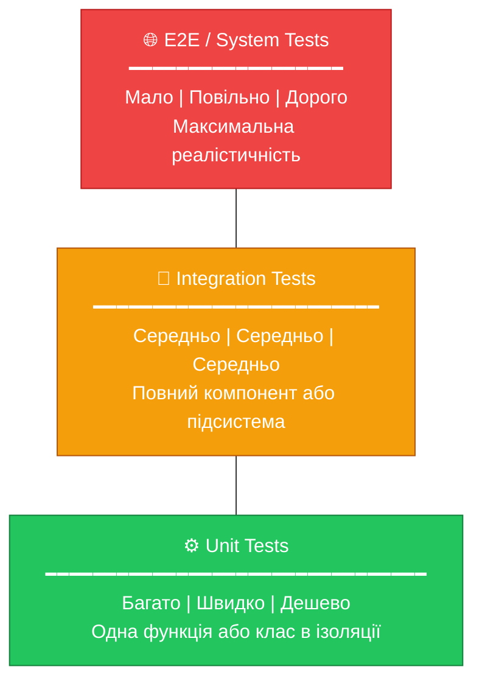
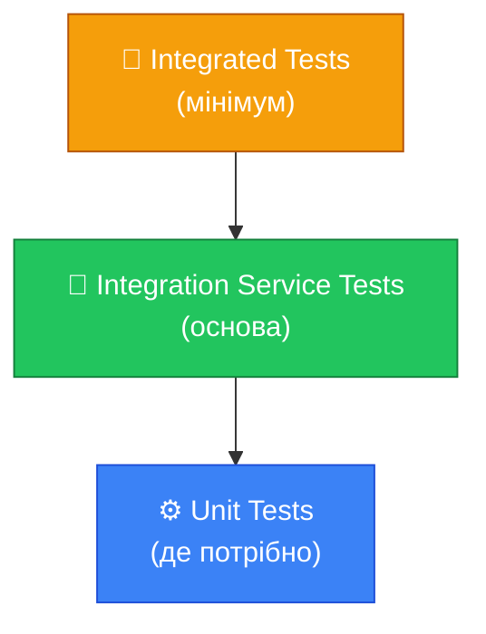
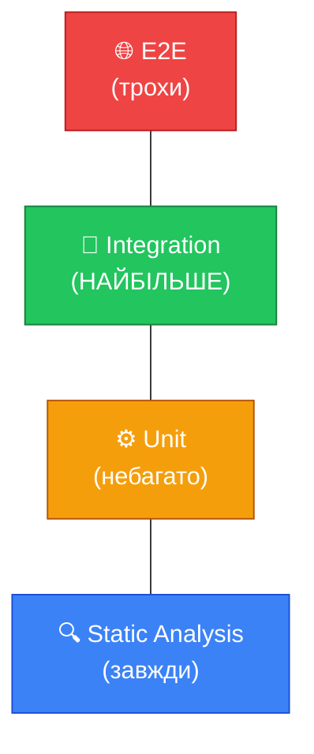
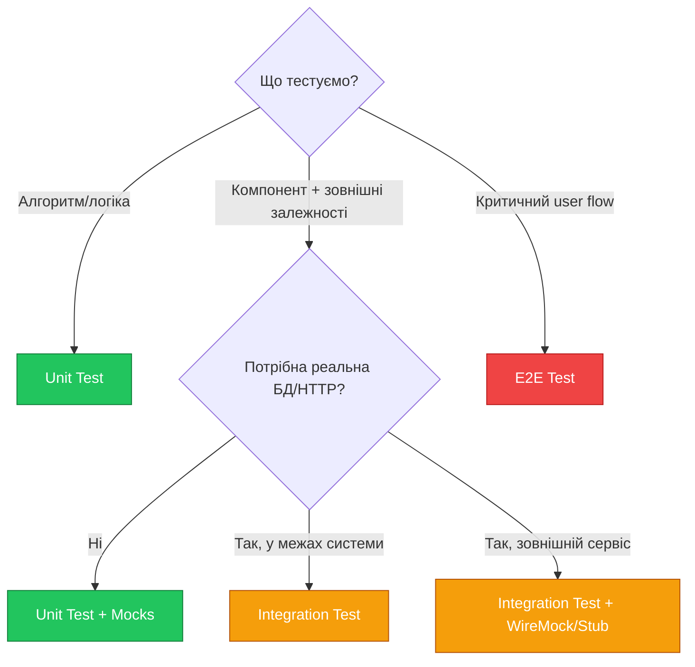
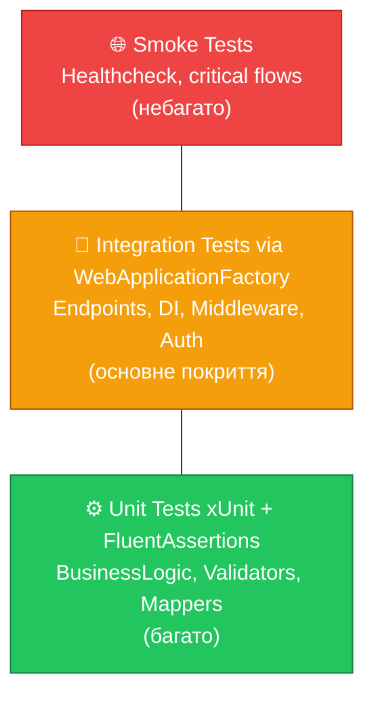

# Піраміда тестування: Стратегія, а не Догма

## Коли E2E-тести стають ворогами

Уявіть команду, що приймає цілком розумне рішення: "Давайте перевіряти нашу систему так, як її перевіряє реальний користувач — натискаємо кнопки, заповнюємо форми, перевіряємо результати". Логічно, правда? Selenium або Playwright, браузер, реальна база даних, реальний сервер.

Через рік у проєкті — 500 Selenium тестів. Повний запуск займає **4 години**. Кожен третій тест час від часу провалюється "просто так" — браузер не відкрився, з'єднання з БД перервалось, елемент не знайшовся через мілісекунду затримки. Розробники перестають запускати тести локально — чекати годину незручно. CI/CD pipeline займає всю ніч. Feedback loop — 8 годин. Команда вже не боїться помилитися в деплої — вони вже бояться тестів.

Це **Ice Cream Cone Anti-Pattern** (анти-патерн морозива): верхня частина важка та дорога (E2E), нижня — легка й порожня (unit). Перевернута піраміда, де найповільніші і найненадійніші тести є основою стратегії.

::note
Флякі тест (flaky test) — тест, що іноді проходить, а іноді провалюється з тими самими вхідними даними. Це гірше за постійно провальний тест, бо розмиває довіру до всього тестового набору. "Ой, він знову впав — мабуть, інфраструктура". Так команди починають ігнорувати провали.
::

Майк Кон у 2009 році описав **піраміду тестування** як антидот до цього анти-патерну. Але перш ніж занурюватись у деталі — розберемось у критеріях, за якими порівнюються рівні тестування.

## Чотири виміри тесту

Будь-який тест можна охарактеризувати по чотирьох ключових аксях.

::card-group

::card{title="⚡ Швидкість (Speed)" icon="i-lucide-zap"}
Скільки часу займає виконання тесту? Unit тест — мілісекунди. Інтеграційний з базою даних — секунди. E2E через браузер — десятки секунд або хвилини.

::

::card{title="💰 Вартість (Cost)" icon="i-lucide-dollar-sign"}
Скільки коштує написати, підтримувати та виконувати? E2E потребують браузера, сервера, бази, мережевих з'єднань. Unit тест — лише компілятора.

::

::card{title="🔒 Ізоляція (Isolation)" icon="i-lucide-lock"}
Чи тест залежить від зовнішніх факторів? Тест з реальною БД залежить від стану бази. Unit тест з mock об'єктами — ні.

::

::card{title="🔄 Зворотний зв'язок (Feedback)" icon="i-lucide-refresh-cw"}
Наскільки зрозуміло, що саме пішло не так? Unit тест точно показує: "ця функція, цей вхід, цей результат". E2E: "десь у пайплайні щось впало".

::

::

## Піраміда Майка Кона: класична модель

::mermaid

::

Принцип простий: **чим нижчий рівень, тим більше тестів і тим швидше вони виконуються**. Чим вищий — тим менше, але більш реалістичних.

Конкретні числа від Mike Cohn: **~70% unit, ~20% integration, ~10% E2E**. Але важливо розуміти: ці пропорції — орієнтир, не закон. Для мікросервісної архітектури, де багато "клею" між сервісами, частка інтеграційних тестів може бути вищою.

## Unit Tests: перший рівень

Unit test (модульний тест) — тест, що перевіряє **найменшу ізольовану одиницю** поведінки системи.

Але що є "одиницею" (unit)? Це один з найбільш дискусійних питань у тестуванні.

- **Найвужче визначення**: один публічний метод одного класу
- **Ширше визначення**: один модуль відповідальності (може включати кілька класів, якщо вони тісно пов'язані логічно)

Мартін Фаулер запропонував терміни **Solitary** та **Sociable** unit tests:

| Тип | Опис | Коли використовувати |
|-----|------|---------------------|
| **Solitary** | Всі залежності замінені моками | Лондонська школа. Перевірка взаємодій |
| **Sociable** | Деякі залежності реальні (value objects, helpers) | Детройтська школа. Перевірка стану |

Про школи тестування — [детальна стаття](/csharp/aspnet/testing/testing-schools).

### Властивості FIRST

Добрий unit test відповідає акроніму **FIRST**:

::accordion
::accordion-item{label="F — Fast (Швидкий)" icon="i-lucide-zap"}
Unit тест має виконуватись за мілісекунди. Якщо тест займає секунди — він, ймовірно, вже не unit: він звертається до бази, мережі або файлової системи.

Практичне правило: якщо 1000 unit тестів займають більше 10 секунд — щось не так.
::
::accordion-item{label="I — Independent (Незалежний)" icon="i-lucide-unlink"}
Тест не повинен залежати від іншого тесту. Результат тесту A не повинен впливати на тест B. Жодного shared mutable state між тестами. Порушення цього принципу — найчастіша причина "флякі" тестів.
::
::accordion-item{label="R — Repeatable (Відтворюваний)" icon="i-lucide-repeat"}
Тест має давати однаковий результат при кожному запуску — в будь-якому середовищі, в будь-який час. Тест, що залежить від поточного часу (`DateTime.Now`), від рандому, від зовнішнього API — не є відтворюваним.
::
::accordion-item{label="S — Self-validating (Самоперевіряючий)" icon="i-lucide-check-square"}
Тест сам знає, чи він пройшов. Немає ручного огляду виводу, немає log файлів, що треба перевіряти. Pass або Fail — чіткий бінарний результат.
::
::accordion-item{label="T — Timely (Своєчасний)" icon="i-lucide-clock"}
У контексті TDD: тест пишеться **до** production коду. В загальному контексті: тест має писатись разом з кодом, а не місяцями пізніше, коли вже незрозуміло, яка поведінка була правильною.
::
::

### Аналогія для unit тесту

Уявіть складний механічний годинник. У ньому сотні шестерень. Unit тест — це коли ви виймаєте **одну шестерню**, кладете на стіл і перевіряєте: чи правильні зуби? чи правильний розмір? чи повертається у правильний бік?

Ви не перевіряєте, чи правильно показує час весь годинник — для цього є інтеграційний тест. Але ви хочете бути впевнені, що кожна шестерня правильна, перш ніж збирати всю систему.

## Integration Tests: другий рівень

Інтеграційний тест (integration test) перевіряє **взаємодію між двома або більше компонентами**. Він відповідає на питання: "Чи правильно ці компоненти спілкуються між собою?"

### Narrow vs Wide Integration Tests (Мартін Фаулер)

Мартін Фаулер розрізняє два підвиди інтеграційних тестів:

**Narrow Integration Test (Вузький)**: тест однієї точки інтеграції з використанням test doubles (заглушок) для всіх інших залежностей. Наприклад, тест репозиторію з реальною базою даних, але з мокованим кешем.

**Wide Integration Test (Широкий)**: тест реального взаємодії між компонентами без заміни залежностей. Наприклад, тест, що перевіряє повний шлях: HTTP запит → контролер → сервіс → репозиторій → BD.

::note
У контексті ASP.NET Minimal API широкий інтеграційний тест через `WebApplicationFactory` — це, власне, те, що ми розглянемо детально у [статті про інтеграційне тестування](/csharp/aspnet/testing/integration-testing). Він запускає весь додаток в пам'яті і дозволяє надсилати реальні HTTP-запити.
::

### Що "склеює" інтеграційні тести?

Інтеграційні тести особливо цінні для виявлення цілого класу помилок, які unit тести пропускають:

- **Помилки конфігурації DI-контейнера**: сервіс зареєстровано з неправильним lifecycle
- **Помилки маппінгу**: AutoMapper неправильно перетворює ViewModelу Entity
- **Помилки в SQL-запитах**: LINQ не транслюється у правильний SQL
- **Помилки в middleware**: аутентифікація або авторизація налаштована неправильно
- **Проблеми серіалізації**: JSON повертається в неправильному форматі

Саме тому навіть при 100% unit test coverage можна мати серйозні баги — якщо немає інтеграційних тестів.

## E2E / System Tests: третій рівень

End-to-End тест (E2E, системний тест) перевіряє **повний потік** від початку до кінця, з позиції кінцевого користувача. Він взаємодіє із системою так, як це робив би реальний користувач: через UI браузера, через мобільний додаток, через публічне API.

### Коли E2E-тести виправдані?

E2E — найдорожчий і найповільніший тип тестів, тому їх кількість має бути мінімальною та стратегічною. Виправдати E2E тест можна, якщо:

1. **Критичний user journey**: реєстрація, авторизація, оформлення замовлення, оплата — шляхи, де провал має катастрофічні наслідки
2. **Тест повного стека**: перевірка, що мікросервісна архітектура працює як ціле
3. **Регресійне тестування після релізу**: "Smoke tests" що перевіряють основну функціональність після деплою

::caution
E2E тести — **не замінник** unit та інтеграційних тестів. Це перевірка на рівні "система жива і найважливіше працює". Деталі покривають нижні рівні.
::

## Еволюція піраміди: сучасні альтернативи

Піраміда Кона — відмінна модель, але вона не єдина і не завжди підходить. Протягом останнього десятиліття з'явились альтернативні концепції.

### Honeycomb Model (Spotify, 2018)

::mermaid

::

Spotify розробив Honeycomb для своєї мікросервісної архітектури. Ключова ідея: **основою є тести одного сервісу в ізоляції** (з реальним HTTP, реальним DI, реальною логікою, але з мокованими зовнішніми сервісами). Unit тести використовуються вибірково для складної логіки. Повноцінні E2E — мінімально.

Причина: для мікросервісів unit тести покривають малу частину ризиків, а E2E між сервісами надто складні. "Service integration tests" — золота середина.

### Testing Trophy (Kent C. Dodds, 2019)

::mermaid

::

Kent C. Dodds (автор React Testing Library) запропонував модель для фронтенд-розробки. Ключова ідея: **інтеграційні тести — основа**, бо вони перевіряють поведінку компонента з точки зору користувача, без прив'язки до реалізації. Плюс додає рівень "Static Analysis" (TypeScript, ESLint) як перший захист.

Незважаючи на фронтенд-контекст, Trinity Corporation застосовна і до бекенду: інтеграційні тести через WebApplicationFactory займають центральне місце.

### Swiss Cheese Model (Адаптація з авіації)

Оригінальна модель швейцарського сиру (Swiss Cheese Model) використовується в авіаційній безпеці і медицині. Ідея: кожен шар захисту має "дірки" (слабкі місця), але якщо шари розташовані правильно, жодна "дірка" не проходить наскрізь через всі шари.

У тестуванні: **жоден рівень тестів не є досконалим**. Unit тести пропустять помилки конфігурації. Інтеграційні пропустять деякі edge cases. E2E пропустять більшість деталей. Але **комбінація кількох рівнів** значно підвищує загальне покриття ризиків.

### Порівняльна таблиця моделей

| Модель | Основа | Для кого | Ключова ідея |
|--------|--------|----------|--------------|
| **Pyramid (Cohn)** | Unit | Класика, будь-які системи | Більше дешевих, менше дорогих |
| **Honeycomb (Spotify)** | Service integration | Мікросервіси | Сервіс як одиниця тестування |
| **Trophy (Dodds)** | Integration | Frontend/React | Поведінка > Реалізація |
| **Swiss Cheese** | Всі шари | Безпека-критичні системи | Шари захисту, що перекриваються |

## Що тестувати на кожному рівні: практична таблиця

| Що тестуємо | Unit | Integration | E2E |
|-------------|------|-------------|-----|
| Бізнес-логіка (алгоритми) | ✅ Основне місце | — | — |
| Трансформація даних | ✅ | — | — |
| Валідація вхідних даних | ✅ | ✅ | — |
| DI-конфігурація | — | ✅ | — |
| Routing та middleware | — | ✅ | — |
| HTTP-серіалізація/десеріалізація | — | ✅ | — |
| SQL-запити (EF Core) | — | ✅ | — |
| Аутентифікація/авторизація | ✅ (логіка) | ✅ (middleware) | ✅ (flow) |
| Критичні user journeys | — | — | ✅ |
| Third-party інтеграції | — | ✅ (stub) | ✅ (real, вибірково) |

## Що мокується (замінюється) на кожному рівні

Мокування (використання test doubles) — інструмент ізоляції. Детально про нього — у [статті про Moq](/csharp/aspnet/testing/mocking-with-moq).

| Рівень | Що РЕАЛЬНО | Що МОКУЄТЬСЯ |
|--------|-----------|--------------|
| **Unit** | Один клас/метод | Всі зовнішні залежності (БД, HTTP, файли, час) |
| **Integration (Narrow)** | Один компонент + БД | Зовнішні HTTP-сервіси, email, SMS |
| **Integration (Wide)** | Весь стек вашого додатку | Зовнішні сервіси (payment gateway, etc.) |
| **E2E** | Весь стек | Може нічого (або лише платіжні системи) |

## Матриця вибору тесту

Алгоритм прийняття рішення: "Який тест мені потрібен?"

::mermaid

::

## Вартість підтримки тестів: реальна матриця

Розробники часто забувають, що тести — це код. Його треба підтримувати при рефакторингу, оновленні залежностей, зміні вимог.

| Аспект | Unit | Integration | E2E |
|--------|------|-------------|-----|
| **Написати** | Дешево (хвилини) | Середньо (години) | Дорого (дні) |
| **Підтримувати** | Дешево | Середньо | Дорого |
| **Debug провалу** | Просто (точне місце) | Середньо | Складно (де саме?) |
| **Run time** | Мілісекунди | Секунди | Хвилини |
| **Flakiness** | Низька | Середня | Висока |
| **Реалізм** | Низький | Середній | Високий |

::tip
Правило вибору: якщо одну і ту ж впевненість можна здобути тестом нижчого рівня — пишіть тест нижчого рівня. Вищий рівень виправданий лише тоді, коли нижчий рівень фізично неможливо застосувати або надає суттєво меншу цінність.
::

## Піраміда в контексті ASP.NET Minimal API

У нашому курсі ми будемо будувати тестову стратегію, що відповідає такій структурі для Minimal API:

::mermaid

::

- **Unit тести** покривають бізнес-логіку, валідатори, маппери, Domain Services — все, що не має зовнішніх залежностей або де залежності легко мокуються.
- **Інтеграційні тести через WebApplicationFactory** покривають ендпоінти, middleware pipeline, серіалізацію, DI-конфігурацію, автентифікацію.
- **Smoke tests** — кілька E2E-тестів для перевірки critical journeys після деплою.

Це відповідає моделі, близькій до Honeycomb: сервіс (наш додаток) як одиниця інтеграційного тесту.

## Практичні завдання

::card-group

::card{title="Рівень 1: Розуміння" icon="i-lucide-brain"}

**Завдання 1.1** — Намалюйте власну "анти-піраміду" (Ice Cream Cone) і поясніть письмово, що відбудеться з командою з 5 розробників за рік, якщо вони слідуватимуть цій стратегії. Конкретно: скільки тестів, скільки часу на запуск, яка продуктивність.

**Завдання 1.2** — Для кожного з 5 сценаріїв нижче оберіть тип тесту (Unit/Integration/E2E) та поясніть чому: (а) перевірка формули розрахунку знижки; (б) перевірка що POST /orders зберігає замовлення в БД; (в) перевірка що юзер може пройти повний flow реєстрації → підтвердження email → вхід → замовлення; (г) перевірка що JWT middleware повертає 401 для неправильного токена; (д) перевірка що LINQ запит генерує правильний SQL.

**Завдання 1.3** — Знайдіть будь-який відкритий .NET проєкт на GitHub. Визначте яку тестову стратегію вони використовують (наскільки це можна зрозуміти). Чи відповідає вона піраміді?

::

::card{title="Рівень 2: Аналіз" icon="i-lucide-bar-chart"}

**Завдання 2.1** — Ваша команда будує e-commerce API. Визначте для кожного компоненту системи (ProductService, OrderRepository, DiscountCalculator, AuthMiddleware, PaymentGatewayClient) оптимальний рівень тестування та обґрунтуйте. Що мокується в кожному випадку?

**Завдання 2.2** — Порівняйте моделі Pyramid та Honeycomb для системи з 5 мікросервісів, де кожен сервіс викликає API двох інших. Яка модель краще підходить та чому? Намалюйте відповідну діаграму.

::

::card{title="Рівень 3: Практика" icon="i-lucide-rocket"}

**Завдання 3.1** — Сплануйте тестову стратегію для реального проєкту. Візьміть будь-який pet project або учбовий проєкт. Створіть документ "Test Strategy" з: (а) вибраною моделлю піраміди, (б) конкретним списком що тестується на якому рівні, (в) інструментами для кожного рівня, (г) цільовим % coverage.

**Завдання 3.2** — Розрахуйте приблизний час виконання повного тестового набору для двох стратегій для системи з 100 функцій: (а) 90% E2E, 10% Unit; (б) 70% Unit, 20% Integration, 10% E2E. Зробіть висновок про продуктивність команди.

::

::

## Підсумок

::note
**Ключові думки цієї статті:**

- **Ice Cream Cone Anti-Pattern** — перевернута піраміда — призводить до повільних, нестабільних тестів
- Піраміда Кона: **70% Unit, 20% Integration, 10% E2E** — орієнтир, не закон
- Кожен рівень характеризується **швидкістю, вартістю, ізоляцією та feedback якістю**
- Unit тести = **FIRST** властивості: Fast, Independent, Repeatable, Self-validating, Timely
- **Solitary vs Sociable** Unit тести — питання школи тестування
- Альтернативи: **Honeycomb** (Spotify) для мікросервісів, **Trophy** (Dodds) для фронтенду
- **Swiss Cheese**: жоден рівень не є ідеальним — потрібні всі шари
- Для ASP.NET Minimal API: **WebApplicationFactory** = ключовий інструмент інтеграційних тестів
::

Наступна стаття відповідає на питання, яке виникає після розуміння піраміди: "Якими конкретно мають бути тести на кожному рівні?" Йдеться про фундаментальну суперечку у тестуванні — [Дві школи: Лондон vs Детройт](/csharp/aspnet/testing/testing-schools).
