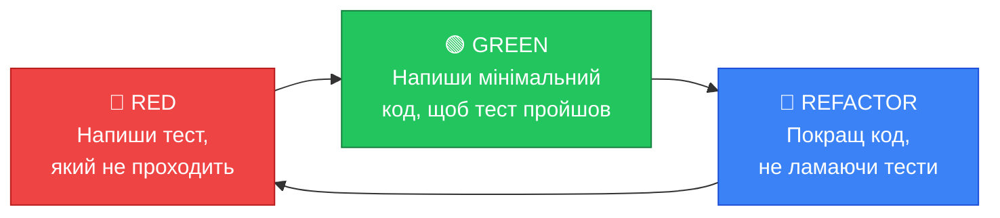

# TDD — Розробка через тести

## 1. Проблема мислення: «Я напишу тест пізніше»

Більшість розробників, коли вперше дізнаються про тестування, думають так: «Звучить розумно. Я напишу код, а потім покрию його тестами». Ця думка здається логічною, але на практиці «пізніше» ніколи не настає.

Чому?

- Коли код вже написаний, тести до нього відчуваються **нудними** — ви вже знаєте, що він «працює».
- Код, написаний без думки про тестування, часто **важко тестувати** — залежності «зашиті» всередину, класи роблять занадто багато.
- Deadline тисне, і тести першими потрапляють під скорочення.

**TDD (Test-Driven Development — Розробка через тести)** — це методологія, яка вирішує цю проблему радикально: вона змушує писати тест **до** написання коду. Не «пізніше», а завжди перед.

## 2. Цикл Red-Green-Refactor

Серцем TDD є нескінченний цикл з трьох кроків:

::mermaid



::

Розберемо кожен крок детально.

### 🔴 RED — Написати тест, який провалюється

Ви починаєте з написання тесту для поведінки, яку ще **не реалізували**. Тест, очевидно, провалиться (бо коду ще немає). Це нормально і навіть **обов'язково**: якщо тест проходить ще до написання коду — тест написаний неправильно.

::caution
Якщо ваш новий тест пройшов одразу, не додаючи нового коду — або ви тестуєте те, що вже існує, або тест написаний помилково і завжди буде проходити (такий тест марний).
::

### 🟢 GREEN — Написати мінімальний код

Ваша єдина мета на цьому кроці — зробити тест зеленим (passing). **Найпростішим можливим способом**. Не найелегантнішим, не «найчистішим» — просто наймінімальнішим. Це дисциплінує вас писати лише той код, який справді потрібний.

### 🔵 REFACTOR — Покращити без змін поведінки

Тепер, коли тести зелені і ви впевнені в коректності коду, ви можете **безстрашно рефакторити** — покращувати структуру, прибирати дублювання, давати кращі назви. Якщо після рефакторингу тести залишаються зеленими — ви нічого не зламали. Це _safety net_ (страхувальна сітка).

## 3. Покроковий приклад: Сервіс реєстрації користувачів

Давайте пройдемо повний TDD-цикл на реальному прикладі. Ми будемо будувати `UserRegistrationService` — сервіс, що реєструє нових користувачів.

Для початку — визначимо інтерфейси, з якими буде працювати наш сервіс:

```csharp [MyApp/Services/Interfaces.cs]
namespace MyApp.Services;

public interface IUserRepository
{
    Task<bool> ExistsAsync(string email);
    Task SaveAsync(User user);
}

public record User(string Email, string HashedPassword, DateTime CreatedAt);
```

Тепер починаємо TDD-цикл.

---

### Ітерація 1: Реєстрація нового користувача

**🔴 RED — Пишемо тест**

```csharp [MyApp.Tests/Services/UserRegistrationServiceTests.cs] showLineNumbers
using MyApp.Services;

namespace MyApp.Tests.Services;

public class UserRegistrationServiceTests
{
    // Поки що просто заглушки — ми наповнимо їх у наступному розділі про Moq
    private readonly IUserRepository _repository = new FakeUserRepository();
    private readonly UserRegistrationService _sut;

    public UserRegistrationServiceTests()
    {
        _sut = new UserRegistrationService(_repository);
    }

    [Fact]
    public async Task RegisterAsync_WithNewEmail_SavesUserToRepository()
    {
        // Arrange
        var email = "new.user@example.com";
        var password = "SecurePass123!";

        // Act
        await _sut.RegisterAsync(email, password);

        // Assert — перевіряємо, що користувач був збережений
        Assert.True(await _repository.ExistsAsync(email));
    }
}

// Проста Fake-реалізація для цього прикладу (замінимо Moq пізніше)
internal class FakeUserRepository : IUserRepository
{
    private readonly HashSet<string> _emails = new();

    public Task<bool> ExistsAsync(string email) =>
        Task.FromResult(_emails.Contains(email));

    public Task SaveAsync(User user)
    {
        _emails.Add(user.Email);
        return Task.CompletedTask;
    }
}
```

Запускаємо `dotnet test` — тест провалиться з помилкою компілятора, бо `UserRegistrationService` ще не існує. Чудово! Ми у 🔴 RED.

::terminal-preview{title="dotnet test" :cursor="false"}
<div class="line"><span class="opacity-40">$</span> <strong class="font-bold">dotnet test</strong></div>
<div class="line"><span class="text-rose-400 font-bold">Build FAILED.</span></div>
<div class="line">  Error <span class="text-rose-400">CS0246</span>: The type or namespace name 'UserRegistrationService' could not be found</div>
<div class="line">  <span class="opacity-40">MyApp.Tests/Services/UserRegistrationServiceTests.cs(10,45)</span></div>
::

**🟢 GREEN — Мінімальна реалізація**

Пишемо **тільки** те, що потрібно, щоб тест пройшов:

```csharp [MyApp/Services/UserRegistrationService.cs] showLineNumbers
namespace MyApp.Services;

public class UserRegistrationService(IUserRepository repository)
{
    public async Task RegisterAsync(string email, string password)
    {
        // Мінімальна реалізація: просто зберігаємо, хешування — пізніше
        var user = new User(email, password, DateTime.UtcNow);
        await repository.SaveAsync(user);
    }
}
```

Запускаємо тест:

::terminal-preview{title="dotnet test" :cursor="false"}
<div class="line"><span class="opacity-40">$</span> <strong class="font-bold">dotnet test</strong></div>
<div class="line"><span class="text-green-400 font-bold">Passed!</span>  - Failed:0, Passed:1, Skipped:0, Total:1</div>
::

Ми у 🟢 GREEN.

---

### Ітерація 2: Спроба реєстрації з існуючим email

Нова поведінка — нова ітерація TDD.

**🔴 RED — Пишемо тест для нового сценарію**

```csharp [MyApp.Tests/Services/UserRegistrationServiceTests.cs — додаємо новий тест]
[Fact]
public async Task RegisterAsync_WithExistingEmail_ThrowsInvalidOperationException()
{
    // Arrange — реєструємо першого користувача
    var email = "existing@example.com";
    await _sut.RegisterAsync(email, "Password123!");

    // Act + Assert — другий виклик з тим самим email має кинути виняток
    await Assert.ThrowsAsync<InvalidOperationException>(
        () => _sut.RegisterAsync(email, "AnotherPass!")
    );
}
```

Запускаємо — тест провалиться, бо поточна реалізація ніколи не кидає виняток. 🔴 RED.

**🟢 GREEN — Додаємо мінімальну перевірку**

```csharp {5-9} [MyApp/Services/UserRegistrationService.cs]
public async Task RegisterAsync(string email, string password)
{
    // Додаємо перевірку існування
    if (await repository.ExistsAsync(email))
    {
        throw new InvalidOperationException(
            $"Користувач з email '{email}' вже зареєстрований.");
    }

    var user = new User(email, password, DateTime.UtcNow);
    await repository.SaveAsync(user);
}
```

Запускаємо — обидва тести зелені. 🟢 GREEN.

---

### Ітерація 3: Хешування паролю

**🔴 RED**

```csharp
[Fact]
public async Task RegisterAsync_WithValidData_StoresHashedPasswordNotPlainText()
{
    // Arrange
    var plainPassword = "MySecretPassword";

    // Act
    await _sut.RegisterAsync("user@test.com", plainPassword);

    // Assert — знаємо, що ExistsAsync повертає true тільки якщо збережeno
    // Потребуємо доступу до збереженого User — розширимо FakeUserRepository
    var savedUser = ((FakeUserRepository)_repository).GetSavedUser("user@test.com");
    Assert.NotEqual(plainPassword, savedUser!.HashedPassword); // Пароль не може бути plain-text
    Assert.NotEmpty(savedUser.HashedPassword);                  // Але і не порожнім
}
```

**🟢 GREEN — Додаємо хешування**

```csharp [MyApp/Services/UserRegistrationService.cs — фінальна версія] showLineNumbers
namespace MyApp.Services;

public class UserRegistrationService(IUserRepository repository)
{
    public async Task RegisterAsync(string email, string password)
    {
        if (await repository.ExistsAsync(email))
            throw new InvalidOperationException($"Email '{email}' вже зайнятий.");

        // Хешуємо пароль перед збереженням
        var hashedPassword = BCrypt.Net.BCrypt.HashPassword(password);
        var user = new User(email, hashedPassword, DateTime.UtcNow);
        await repository.SaveAsync(user);
    }
}
```

**🔵 REFACTOR**

Після 3 ітерацій код чистий, але `FakeUserRepository` отримав метод `GetSavedUser`. Потрібно прибрати зайве та переглянути іменування — але тести залишаться зеленими.

## 4. Переваги TDD для ASP.NET розробника

Студенти часто сумніваються: «Чи не витрачаємо ми більше часу, пишучи тест перед кодом?». Розвіємо цей міф.

::tabs
::tabs-item{label="Кращий дизайн коду"}
Коли ви пишете тест до коду, ви **першим клієнтом** власного API. Ви відразу відчуваєте, чи зручно ним користуватися.

Якщо написати тест складно (багато залежностей, важко ізолювати) — це сигнал, що ваш клас порушує **Single Responsibility Principle**. TDD б'є по руках жорстко зв'язний (tightly-coupled) код.
::
::tabs-item{label="Документація через тести"}
Набір тестів є **виконуваною специфікацією** вашого коду. Нові розробники в команді можуть прочитати тести і зрозуміти _очікувану поведінку_ системи краще, ніж з будь-якого документу Word.

```
RegisterAsync_WithNewEmail_SavesUserToRepository
RegisterAsync_WithExistingEmail_ThrowsInvalidOperationException
RegisterAsync_WithValidData_StoresHashedPasswordNotPlainText
```

Ці назви тестів — це специфікація `UserRegistrationService`.
::
::tabs-item{label="Впевненість при рефакторингу"}
Самий цінний бонус TDD: **страхова сітка при будь-яких змінах**. Ви можете сміливо переписувати внутрішню реалізацію, змінювати алгоритм, оновлювати версію бібліотеки — і якщо всі тести залишаються зеленими, ви нічого не зламали.

Без TDD кожен рефакторинг — це ризик. З TDD — впевнена прогулянка по стабільному ґрунту.
::
::

## 5. TDD у реальному ASP.NET проєкті: Підводні камені

TDD — потужний інструмент, але є ситуації, де його сліпе застосування не дає користі.

::premium-alert{type="warning" title="Коли TDD важко застосовувати?"}
- **UI-компоненти**: тестування візуального відображення (CSS-стилі, анімації) не має сенсу через TDD.
- **Прості CRUD без логіки**: якщо метод просто кидає дані в БД без обробки — цінність unit TDD мінімальна (краще integration-тест).
- **Дослідницький код**: коли ви ще не знаєте, яким буде рішення — спочатку напишіть прототип, а потім покрийте TDD.
::

::premium-alert{type="tip" title="Де TDD дає максимум?"}
- **Бізнес-логіка**: розрахунки, валідації, алгоритми — TDD тут незамінний.
- **Domain Services в ASP.NET**: `PricingService`, `OrderService`, `InvoiceCalculator` — ідеальні кандидати.
- **Парсинг та трансформація даних**: складні перетворення між DTO та доменними моделями.
::

## 6. Резюме

TDD — це не просто «писати тести». Це **зміна мислення** про розробку:

- Ви думаєте про поведінку системи **до** того, як пишете код.
- Ваш код стає більш модульним та тестованим **за конструкцією** (by design).
- Цикл **Red → Green → Refactor** дає впевненість, що кожна зміна перевірена та безпечна.

У наступному розділі ми навчимося ізолювати залежності за допомогою бібліотеки **Moq**, щоб тестувати сервіси у повній ізоляції від баз даних та зовнішніх API.

---

## Практичні завдання

::accordion
::accordion-item{label="Рівень 1: Перший TDD-цикл" icon="i-lucide-play"}

**Завдання 1.1 — Лічильник через TDD.**
Реалізуйте клас `Counter` методом TDD, пройшовши 3 повних цикли Red-Green-Refactor:
1. `Increment()` збільшує значення на 1
2. `Reset()` встановлює значення в 0
3. `DecrementTo(int min)` зменшує, але ніколи не падає нижче за `min`

При виконанні завдання записуйте, яким був ваш код на кожному кроці (Red, Green, Refactor).

::
::accordion-item{label="Рівень 2: Бізнес-логіка через TDD" icon="i-lucide-briefcase"}

**Завдання 2.1 — Сервіс знижок.**
Реалізуйте `DiscountService` методом TDD зі следующими правилами:
- Сума < 100: знижки немає (0%)
- Сума 100-500: знижка 5%
- Сума > 500: знижка 10%
- Негативна сума: кидає `ArgumentException`

Напишіть тест для кожного правила перед реалізацією. Використайте `[Theory]` де це доцільно.

**Завдання 2.2 — Парольна політика.**
Реалізуйте методом TDD `PasswordValidator.Validate(string password)` → `ValidationResult`:
- Мінімум 8 символів
- Обов'язково є хоча б одна цифра
- Обов'язково є хоча б одна велика літера
- Повертає список усіх порушень (не зупиняється на першому)

::
::accordion-item{label="Рівень 3: Повноцінний TDD-проєкт" icon="i-lucide-layers"}

**Завдання 3.1 — Інвентаризаційна система.**
Побудуйте `WarehouseService` через повний TDD-процес (мінімум 5 TDD-ітерацій):
- `AddProduct(string sku, int quantity)` — додати товар
- `RemoveProduct(string sku, int quantity)` — списати (кидає `InsufficientStockException` якщо недостатня кількість)
- `GetStock(string sku)` → `int` — поточні залишки
- `GetLowStockProducts(int threshold)` → список SKU нижче порогу
- `Transfer(string fromSku, string toSku, int quantity)` — переміщення (атомарна операція)

Особлива вимога: **фіксуйте хід TDD** — для кожної ітерації зберігайте назву тесту та мінімальний код, доданий для GREEN.

::
::
