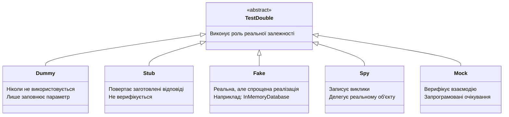

# Дві Школи Тестування: Лондон проти Детройту

## Суперечка, якій вже понад двадцять років

Є речі в програмуванні, про які всі ніби знають і розуміють, але при детальному розгляді виявляється, що люди мають на увазі зовсім різні речі. **Unit testing** — саме такий термін.

Запитайте десятьох досвідчених розробників: "Що таке правильний unit тест?" — і ви отримаєте щонайменше дві принципово різні відповіді. Хтось скаже: "Тест має перевіряти результат — те, що метод повертає або яким є стан системи після виклику". Хтось інший невдоволено знизить плечима: "Ні-ні, тест має перевіряти, як класи взаємодіють між собою — які методи викликаються, з якими аргументами".

Обидві відповіді правильні — але лише в контексті відповідної **школи тестування**.

Ця суперечка виникла в середині 1990-х у спільноті eXtreme Programming (XP). Kent Beck, Ward Cunningham та їхні послідовники сформулювали один підхід. Через десять років у Лондоні Стів Фріман та Нат Прайс розвинули принципово інший. Мартін Фаулер у своїй статті "Mocks Aren't Stubs" (2007) систематизував відмінності і запровадив терміни **Classicist** (або Detroit) та **Mockist** (або London) для позначення цих двох шкіл.

Чому це важливо для вас як практика? Тому що від вибору школи залежить:
- **Як ви проєктуєте** виробничий код (TDD впливає на дизайн)
- **Яку роль відіграють моки** у вашому тестовому наборі
- **Наскільки ваші тести стійкі** до рефакторингу
- **Що саме ви вважаєте "дефектом"** при провалі тесту

Розберемо кожну школу детально, а потім порівняємо їх за ключовими критеріями.

---

## Класична (Детройтська) школа

### Витоки та ідеологія

Класична школа формувалась навколо **Kent Beck** та **Ward Cunningham** — авторів методології eXtreme Programming та засновників культури unit-тестування у промислових масштабах. Ключовим текстом є книга Beck "Test-Driven Development: By Example" (2002) — мабуть, найвпливовіша книга про тестування в histority програмування.

Назва "Детройтська" (іноді "Чикагська" або просто "Classicist") умовна — вона відображає американські корені підходу.

Центральна філософія класичної школи: **тест перевіряє спостережуваний результат**. Нас не цікавить, **яким чином** система дійшла до результату — нас цікавить **що саме** вона повернула або до якого стану прийшла.

Уявіть, що ви перевіряєте, чи правильно каса видає решту. Вам не важливо, чи касир обчислює здачу в умі, чи на калькуляторі, чи запитує в колеги — вам важливо отримати правильну суму. Це і є **State-based testing (перевірка стану)**: ми перевіряємо кінцевий стан системи, а не процес його досягнення.

### Характеристики підходу

**Мінімальне використання моків.** Класична школа не відкидає моки повністю, але використовує їх лише у двох випадках:
1. Зовнішні залежності, що уповільнюють або ускладнюють тести (реальна база даних, зовнішній HTTP-сервіс, файлова система)
2. Залежності, що вносять недетермінізм (системний час, генератор випадкових чисел)

Внутрішні залежності — власні класи та сервіси вашого проєкту — зазвичай **не мокуються**. Якщо `OrderService` залежить від `DiscountCalculator`, класична школа запустить обидва в тесті: реальний `OrderService` з реальним `DiscountCalculator`.

Такі тести Мартін Фаулер називає **Sociable Unit Tests** (товариські модульні тести) — вони "спілкуються" з реальними залежностями всередині системи.

**Inside-Out розробка.** У контексті TDD класична школа рухається **зсередини назовні**: спочатку реалізується доменне ядро (бізнес-логіка, entities, value objects), потім — сервіси, що їх використовують, і нарешті — API або UI поверхня. Кожен шар будується на вже протестованому нижньому шарі.

**Тест прив'язаний до поведінки, не до реалізації.** Якщо ви рефакторите внутрішню реалізацію методу, не змінюючи його публічний контракт — тести залишаться зеленими. Це робить тести стійкими і дає свободу рефакторингу.

### Приклад Детройтського підходу

Розглянемо просту модель: є `ShoppingCart` (кошик покупок), що залежить від `DiscountService` для розрахунку знижок. У Детройтській школі тест виглядав би так:

```csharp
// Детройтська школа: перевіряємо СТАН після дії
public class ShoppingCartTests
{
    [Fact]
    public void AddItem_WhenVipUser_AppliesCorrectDiscount()
    {
        // Arrange
        var discountService = new DiscountService(); // РЕАЛЬНА залежність
        var cart = new ShoppingCart(discountService);
        var user = new User { Type = UserType.Vip };
        var item = new Product { Price = 100m };

        // Act
        cart.AddItem(item, user);

        // Assert — перевіряємо РЕЗУЛЬТАТ (стан кошика)
        Assert.Equal(90m, cart.Total); // 10% знижка для VIP
    }
}
```

Зверніть увагу: `DiscountService` — реальний клас, не мок. Тест перевіряє `cart.Total` — стан об'єкта після операції. Нікому не важливо, скільки разів і як `DiscountService` викликався зсередини — важливо лише те, що кошик містить правильну суму.

Це означає, що тест `ShoppingCartTests` **неявно тестує** і `DiscountService`. Якщо в `DiscountService` є баг, тест `ShoppingCartTests` теж провалиться. Це вважається прийнятним у класичній школі — провал в одному місці може дати кілька провалів, але це нормально, бо аналіз все одно веде до одного місця проблеми.

---

## Лондонська школа

### Витоки та ідеологія

Лондонська школа сформувалась на початку 2000-х у лондонській спільноті eXtreme Programming навколо **Steve Freeman** та **Nat Pryce**. Їхня книга **"Growing Object-Oriented Software, Guided by Tests" (GOOS, 2009)** — маніфест цього підходу. Книга з підзаголовком "Guided by Tests" невипадково — вони буквально будують систему, ведені тестами, крок за кроком, шар за шаром.

Центральна філософія: **тест перевіряє взаємодію та поведінку**. Нас цікавить, чи відбуваються потрібні взаємодії між об'єктами — чи викликаються правильні методи з правильними аргументами.

Повертаємось до аналогії з касою: лондонська школа перевіряла б, чи касир **звернувся до програми розрахунку здачі**, передав їй правильну суму, і звернувся за результатом. Неважливо, яка відповідь — важлива **правильна взаємодія**.

### Моки як інструмент проєктування

У Лондонській школі моки — не просто засіб ізоляції. Вони є **інструментом дизайну**. Коли ви пишете тест, що очікує певні виклики до мок-об'єкта, ви тим самим **специфікуєте API** цього мок-об'єкта. Це сильний feedback про дизайн: якщо для написання тесту вам потрібно моком виконати 20 викликів — це сигнал, що ваш дизайн потребує рефакторингу.

Всі залежності класу — і зовнішні (HTTP, БД), і внутрішні (інші сервіси проєкту) — замінюються моками. Такі тести Фаулер називає **Solitary Unit Tests** (самотні модульні тести).

**Outside-In розробка.** TDD в Лондонській школі рухається **зззовні всередину**: починаємо з acceptance test (high-level test, що описує поведінку з точки зору користувача), потім опускаємось глибше, реалізовуючи один шар за раз. На кожному шарі пишемо unit-тест з моками для нижнього шару, потім реалізовуємо його, і рухаємось далі.

### Приклад Лондонського підходу

```csharp
// Лондонська школа: перевіряємо ВЗАЄМОДІЮ
public class ShoppingCartTests
{
    [Fact]
    public void AddItem_WhenVipUser_CallsDiscountServiceCorrectly()
    {
        // Arrange
        var mockDiscountService = new Mock<IDiscountService>(); // МОК залежності
        mockDiscountService
            .Setup(x => x.CalculateDiscount(It.IsAny<Product>(), UserType.Vip))
            .Returns(10m);

        var cart = new ShoppingCart(mockDiscountService.Object);
        var user = new User { Type = UserType.Vip };
        var item = new Product { Price = 100m };

        // Act
        cart.AddItem(item, user);

        // Assert — перевіряємо ВЗАЄМОДІЮ (чи викликався метод)
        mockDiscountService.Verify(
            x => x.CalculateDiscount(item, UserType.Vip),
            Times.Once
        );
    }
}
```

Тут `IDiscountService` — мок. Ми перевіряємо, чи `ShoppingCart` **правильно взаємодіє** з `DiscountService`: передає правильний продукт і правильний тип користувача. Внутрішня логіка `DiscountService` тестується окремо, у своєму тест-класі.

---

## Повна таксономія Test Doubles (Тестові Замінники)

Мартін Фаулер у статті ["Test Double"](https://martinfowler.com/bliki/TestDouble.html) розробив точну класифікацію об'єктів-замінників (назва запозичена з кіноіндустрії — "stunt double", каскадер). Оригінальна концепція та терміни — від Gerard Meszaros з книги "xUnit Test Patterns" (2007).

Ця таксономія критично важлива, бо у повсякденній мові всі ці об'єкти часто неточно називають "моками" — але це принципово різні речі з різними характеристиками.

::mermaid



::

### Dummy (Манекен)

**Що це:** Об'єкт, що передається як аргумент, але **ніколи не використовується** у ході тесту. Він потрібен лише щоб заповнити сигнатуру методу або конструктора.

**Коли використовувати:** Коли метод або клас вимагає аргументу, але даний тест не перевіряє функціональність, що пов'язана з цим аргументом.

**Приклад:**

```csharp
// Метод вимагає ILogger, але наш тест логування не перевіряє
public class OrderServiceTests
{
    [Fact]
    public void CalculateTotal_WithSingleItem_ReturnsCorrectTotal()
    {
        // Dummy: ILogger потрібен конструктору, але не потрібен для цього тесту
        var dummyLogger = new NullLogger<OrderService>();

        var service = new OrderService(dummyLogger);
        var items = new[] { new OrderItem { Price = 50m, Quantity = 2 } };

        var result = service.CalculateTotal(items);

        Assert.Equal(100m, result);
    }
}
```

`NullLogger<T>` з пакету `Microsoft.Extensions.Logging.Abstractions` — це канонічний Dummy для логерів у .NET. Він нічого не робить — просто виконує контракт `ILogger`.

**Ключова ознака Dummy:** він ніколи не повертає значень, що мають значення для тесту, і ніколи не перевіряється.

---

### Stub (Заглушка)

**Що це:** Об'єкт, що **повертає заздалегідь підготовлені відповіді** на виклики. Він не виконує реальну логіку — лише відповідає на запити з фіксованими даними.

**Коли використовувати:** Коли тестований клас запитує дані у залежності, і нам потрібно контролювати, які дані він отримає. Головна мета — ізолювати тестований клас від зовнішніх даних.

**Різниця з Mock:** Stub **ніколи не верифікується** — ми не перевіряємо, скільки разів його викликали або з якими аргументами. Це просто постачальник даних.

**Приклад:**

```csharp
public class WeatherServiceTests
{
    [Fact]
    public void GetTemperatureAlert_WhenTemperatureAbove35_ReturnsDangerAlert()
    {
        // Stub: повертає фіксовані дані незалежно від аргументів
        var weatherApiStub = new Mock<IWeatherApi>();
        weatherApiStub
            .Setup(x => x.GetCurrentTemperature("Kyiv"))
            .Returns(38.5); // завжди повертає 38.5

        var service = new WeatherService(weatherApiStub.Object);

        var alert = service.GetTemperatureAlert("Kyiv");

        Assert.Equal(AlertLevel.Danger, alert.Level);
        // Ми НЕ перевіряємо скільки разів викликався GetCurrentTemperature
    }
}
```

У цьому прикладі `weatherApiStub` — Stub. Нас цікавить лише результат `GetTemperatureAlert` при певній температурі. Скільки разів викликається `GetCurrentTemperature` — неважливо.

**Ключова ознака Stub:** підготовлені відповіді, відсутність верифікації викликів.

---

### Fake (Підробка)

**Що це:** Об'єкт з **реальною спрощеною реалізацією** функціональності, але не придатною для production. Fake містить власну логіку — це не просто "повернути фіксоване значення", але й не реальна реалізація з усіма деталями.

**Коли використовувати:** Коли реальна реалізація занадто важка (потребує БД, мережі), але мок-версія занадто спрощена і не відображає реальну поведінку.

**Класичні приклади:**
- `InMemoryRepository<T>` — зберігає дані в колекції в пам'яті, а не в БД
- `FakeEmailSender` — записує листи в список замість відправки
- `FakePaymentGateway` — симулює успішні/неуспішні платежі за певними правилами

**Приклад:**

```csharp
// Fake: реальна логіка, але без реальної бази даних
public class InMemoryUserRepository : IUserRepository
{
    private readonly List<User> _users = new();

    public async Task<User?> GetByIdAsync(Guid id)
        => _users.FirstOrDefault(u => u.Id == id);

    public async Task AddAsync(User user)
    {
        if (_users.Any(u => u.Id == user.Id))
            throw new InvalidOperationException("User already exists");
        _users.Add(user);
    }

    public async Task<IEnumerable<User>> GetAllAsync()
        => _users.AsReadOnly();
}

// Використання у тесті
public class UserServiceTests
{
    [Fact]
    public async Task RegisterUser_WithExistingEmail_ThrowsException()
    {
        var fakeRepo = new InMemoryUserRepository(); // Fake
        var service = new UserService(fakeRepo);
        await service.RegisterAsync("test@example.com", "password");

        // Fake перевірить дублювання — так само як реальний репозиторій
        await Assert.ThrowsAsync<DuplicateEmailException>(
            () => service.RegisterAsync("test@example.com", "other")
        );
    }
}
```

Зверніть увагу: `InMemoryUserRepository` містить **реальну логіку перевірки дублікатів** — це не просто "повернути null". Саме це відрізняє Fake від Stub.

Fake — улюблений інструмент **Детройтської школи**: він дозволяє тестувати з реальною поведінкою залежностей, не підіймаючи реальну БД.

**Ключова ознака Fake:** має власну реальну логіку, але спрощену. Не придатний для production (немає persistence, немає транзакцій тощо).

---

### Spy (Шпигун)

**Що це:** Об'єкт, що **записує свої взаємодії** (які методи та з якими аргументами викликались), але при цьому **делегує виклики реальній реалізації**. Це "обгортка" навколо реального об'єкта з додатковим записом взаємодій.

**Коли використовувати:** Коли потрібна реальна поведінка залежності, але також потрібно верифікувати, що взаємодія відбулась. Spy — це гібрид між реальним об'єктом та Mock.

**Приклад:**

```csharp
// Spy через Moq: CallBase = true означає "делегуй реальній реалізації"
public class AuditLogServiceTests
{
    [Fact]
    public void ProcessOrder_Always_LogsAuditEvent()
    {
        // Spy: викликає реальний метод, але записує виклики
        var spyAuditLog = new Mock<IAuditLogService> { CallBase = true };

        var orderProcessor = new OrderProcessor(spyAuditLog.Object);
        orderProcessor.Process(new Order());

        // Верифікуємо, що метод БУЛО викликано
        spyAuditLog.Verify(x => x.Log(It.IsAny<AuditEvent>()), Times.Once);
    }
}
```

У класичній бібліотеці Moq термін "Spy" не використовується явно, але поведінка Spy досягається через `Mock<T>` з `CallBase = true` або через спадкування (`partial mock`).

**Ключова ознака Spy:** реальна поведінка + запис взаємодій. Поєднує риси реального об'єкта та Mock.

---

### Mock (Мок, Імітатор)

**Що це:** Об'єкт з **запрограмованими очікуваннями** щодо того, як він має бути викликаний. Mock **верифікує** після виконання: чи були очікувані методи викликані, скільки разів, з якими аргументами?

**Це і є інструмент Лондонської школи.** Mock центральний для interaction-based testing.

**Відмінність від Stub:** Stub пасивно постачає дані. Mock активно перевіряє, чи правильно з ним взаємодіяли. Stub — постачальник. Mock — контролер.

**Повний приклад з Moq:**

```csharp
public class NotificationServiceTests
{
    [Fact]
    public async Task CreateOrder_Always_SendsConfirmationEmail()
    {
        // Arrange: Mock з очікуваннями
        var mockEmailSender = new Mock<IEmailSender>();
        mockEmailSender
            .Setup(x => x.SendAsync(
                It.Is<string>(email => email.Contains("@")),
                "Order Confirmation",
                It.IsAny<string>()))
            .Returns(Task.CompletedTask);

        var orderService = new OrderService(mockEmailSender.Object);
        var order = new Order { CustomerEmail = "user@example.com" };

        // Act
        await orderService.CreateOrderAsync(order);

        // Assert: верифікуємо ВЗАЄМОДІЮ
        mockEmailSender.Verify(
            x => x.SendAsync("user@example.com", "Order Confirmation", It.IsAny<string>()),
            Times.Once,
            "Email confirmation must be sent exactly once per order"
        );
    }

    [Fact]
    public async Task CreateOrder_WhenEmailFails_StillCreatesOrder()
    {
        // Mock налаштований кидати виключення
        var mockEmailSender = new Mock<IEmailSender>();
        mockEmailSender
            .Setup(x => x.SendAsync(It.IsAny<string>(), It.IsAny<string>(), It.IsAny<string>()))
            .ThrowsAsync(new SmtpException("Connection refused"));

        var orderService = new OrderService(mockEmailSender.Object);

        // Тест перевіряє resilience бізнес-логіки при помилці email
        var result = await orderService.CreateOrderAsync(new Order { CustomerEmail = "u@e.com" });

        Assert.True(result.IsSuccess);
        Assert.Contains("email_failed", result.Warnings);
    }
}
```

**Ключова ознака Mock:** верифікація взаємодій. Тест провалиться, якщо очікуваний метод не був викликаний (або викликаний неправильно).

---

### Зведена таблиця Test Doubles

| Характеристика | Dummy | Stub | Fake | Spy | Mock |
|----------------|-------|------|------|-----|------|
| **Власна логіка** | Ні | Мінімальна | Так | Так | Ні |
| **Повертає дані** | Ні | Завжди | Залежно від логіки | Залежно від реал. | Залежно від Setup |
| **Верифікується** | Ні | Ніколи | Ні | Іноді | Завжди |
| **Делегує реальному** | Ні | Ні | Ні | Так | Ні |
| **Школа** | Обидві | Детройт | Детройт | Обидві | Лондон |
| **Складність** | Мінімальна | Низька | Середня | Середня | Середня |

::tip
У побутовому спілкуванні "мок" часто вживається як загальна назва для будь-якого Test Double. Але при code review або технічній дискусії — важливо використовувати точну термінологію. "Ми мокуємо репозиторій" може означати зовсім різні речі залежно від того, що саме ви робите: повертаєте фіксовані дані (Stub) чи перевіряєте виклики (Mock).
::

---

## State Verification vs Behaviour Verification

Це ключова концептуальна відмінність між школами, яку варто розглянути детально.

### State Verification (Детройт)

**Принцип:** Після виконання дії ми перевіряємо **стан системи** — значення полів, return value, стан залежностей.

```csharp
// State verification
[Fact]
public void TransferMoney_MovesAmountBetweenAccounts()
{
    var sourceAccount = new Account(balance: 1000m);
    var targetAccount = new Account(balance: 200m);

    var bank = new Bank();
    bank.Transfer(sourceAccount, targetAccount, amount: 300m);

    // Перевіряємо СТАН після операції
    Assert.Equal(700m, sourceAccount.Balance);
    Assert.Equal(500m, targetAccount.Balance);
}
```

Чому це краще для цього сценарію? Бо нас цікавить **бізнес-результат** — правильне переміщення грошей. Як саме `Bank.Transfer()` реалізовано всередині — деталь реалізації.

### Behaviour Verification (Лондон)

**Принцип:** Після виконання дії ми перевіряємо **поведінку** — які методи були викликані, з якими параметрами.

```csharp
// Behaviour verification
[Fact]
public void TransferMoney_CallsWithdrawAndDeposit()
{
    var mockSourceAccount = new Mock<IAccount>();
    var mockTargetAccount = new Mock<IAccount>();

    var bank = new Bank();
    bank.Transfer(mockSourceAccount.Object, mockTargetAccount.Object, amount: 300m);

    // Перевіряємо ПОВЕДІНКУ — чи правильно клас взаємодіяв з залежностями
    mockSourceAccount.Verify(x => x.Withdraw(300m), Times.Once);
    mockTargetAccount.Verify(x => x.Deposit(300m), Times.Once);
}
```

Чому це корисно? Бо чітко документує контракт: `Bank.Transfer` **повинен** викликати `Withdraw` і `Deposit`. Якщо хтось рефакторить `Bank.Transfer` і забуде один із кроків — тест впаде.

### Проблема з Behaviour Verification: крихкість

Behaviour verification має серйозний недолік — **крихкість тестів через прив'язку до реалізації**.

Уявіть: розробник рефакторить `Bank.Transfer`, замінюючи окремі виклики `Withdraw` та `Deposit` на єдиний `ExecuteTransaction`. Бізнес-логіка та результат залишились ідентичними — але тест провалиться, бо він перевіряв конкретні внутрішні виклики.

```csharp
// Після рефакторингу — бізнес-логіка не змінилась
public void Transfer(IAccount source, IAccount target, decimal amount)
{
    // Замінили Withdraw + Deposit на єдину транзакцію
    _transactionManager.ExecuteTransaction(source, target, amount);
}

// Але тест ПРОВАЛИТЬСЯ, хоча код правильний!
mockSourceAccount.Verify(x => x.Withdraw(300m), Times.Once); // ❌
mockTargetAccount.Verify(x => x.Deposit(300m), Times.Once);  // ❌
```

Це фундаментальна проблема надмірного застосування Behaviour Verification. Тести стають "детектором змін у реалізації" замість "детектором регресій у поведінці".

::warning
Якщо ваші тести провалюються при кожному рефакторингу навіть без зміни поведінки — ви надмірно використовуєте мокування (over-mocking). Це ознака того, що тести прив'язані до реалізації, а не до контракту.
::

---

## Детальне порівняння шкіл

::tabs
::tabs-item{label="Coupling до реалізації"}

| Аспект | Детройт | Лондон |
|--------|---------|--------|
| **Прив'язаність до реалізації** | Низька — тест незалежний від внутрішніх деталей | Висока — тест перевіряє конкретні виклики |
| **Рефакторинг** | Тест залишається зеленим | Тест може провалитись |
| **Зміна API залежності** | Може не вплинути | Вплине, якщо API використовується |

::
::tabs-item{label="Feedback про дизайн"}

| Аспект | Детройт | Лондон |
|--------|---------|--------|
| **Виявлення design problems** | Слабше — не видно надмірних залежностей | Сильніше — занадто багато MockSetup = поганий дизайн |
| **Coupling між класами** | Не виявляє | Відразу помітно |
| **God Class антипатерн** | Не виявляє | Видно: занадто багато залежностей у конструкторі |

::
::tabs-item{label="Тестова ізоляція"}

| Аспект | Детройт | Лондон |
|--------|---------|--------|
| **Ізоляція тесту** | Слабша — тест залежить від реалізації залежностей | Сильніша — повна ізоляція |
| **Локалізація провалу** | Провал може виникати в кількох тестах | Провал ізольований у одному класі |
| **Швидкість** | Може бути повільніше через реальні залежності | Швидше — все in-memory |

::
::tabs-item{label="Читабельність і обслуговуваність"}

| Аспект | Детройт | Лондон |
|--------|---------|--------|
| **Кількість setup-коду** | Менше | Більше (Mock.Setup для всіх залежностей) |
| **Читабельність тесту** | Вища — зрозуміло що тестується | Нижча — складний setup відволікає |
| **Документаційна цінність** | Висока — описує бізнес-поведінку | Середня — описує реалізаційні деталі |

::

---

## Коли яку школу застосовувати

Практика показує, що більшість досвідчених розробників **не є фанатиками жодної школи**. Вони застосовують обидва підходи, виходячи з контексту.

### Детройтська школа краще підходить для:

**1. Доменна логіка та бізнес-правила (Domain Model)**
Класи, що реалізують бізнес-правила — калькулятори, стратегії ціноутворення, правила валідації — не мають зовнішніх залежностей або залежать від інших domain об'єктів. Тестувати їх з реальними залежностями — природно і безпечно.

```csharp
// Детройт: реальний PricingEngine + реальний TaxCalculator
[Fact]
public void CalculateOrderPrice_WithTaxAndDiscount_ReturnsCorrectTotal()
{
    var pricing = new PricingEngine(new TaxCalculator(), new DiscountEngine());
    var order = CreateTestOrder(items: 3, unitPrice: 100m);

    var result = pricing.Calculate(order, CustomerType.Premium, Region.Ukraine);

    Assert.Equal(270m, result.FinalPrice); // 300 - 10% discount + 0% VAT for Premium
}
```

**2. Алгоритмічний код**
Парсери, конвертори, утиліти — де результат повністю визначається вхідними даними і не залежить від зовнішніх сервісів.

**3. Стабільні API та бібліотеки**
Якщо залежність — стабільна бібліотека з незмінним API (наприклад, `System.Text.Json`) — немає сенсу її мокувати.

**4. Value Objects**
Незмінні об'єкти з логікою (Money, Email, PhoneNumber) — ідеальний кандидат для реального використання в тестах.

---

### Лондонська школа краще підходить для:

**1. Зовнішні сервіси та інфраструктура**
HTTP-клієнти, відправники email/SMS, сервіси платежів — їх завжди замінюємо на моки або стаби.

```csharp
// Лондон: зовнішній Email-сервіс завжди мокується
[Fact]
public async Task RegisterUser_SendsWelcomeEmail()
{
    var mockEmail = new Mock<IEmailService>();
    var service = new UserRegistrationService(mockEmail.Object);

    await service.RegisterAsync(new RegisterUserDto { Email = "new@user.com" });

    mockEmail.Verify(x => x.SendWelcomeEmail("new@user.com"), Times.Once);
}
```

**2. Event-Driven архітектура**
Коли клас публікує події або надсилає команди — верифікація публікації події є важливою частиною контракту.

**3. Команди без return value**
Методи, що нічого не повертають (void/Task), але мають side effects — тут немає "стану" для перевірки, тому верифікація поведінки є єдиним варіантом.

**4. Cross-cutting concerns**
Аудит, логування (перевірка що певна подія залогована), метрики — перевіряємо через мок/spy.

---

## "Mocks Aren't Stubs" — ключові інсайти Фаулера

Стаття Мартіна Фаулера ["Mocks Aren't Stubs"](https://martinfowler.com/articles/mocksArentStubs.html) (оригінал 2004, оновлення 2007) — одна з найважливіших статей про тестування. Якщо ви не читали — прочитайте оригінал. Тут — ключові ідеї.

**Інсайт 1: Терміни "mock" і "stub" — не синоніми.** Фаулер дав точні визначення: Stub постачає дані, Mock верифікує взаємодію. Використання "mock" як загального терміну — джерело плутанини.

**Інсайт 2: Різниця впливає на TDD.** Mockist підхід (Лондон) стимулює думати "як класи співпрацюють" ще до написання коду. Classicist підхід (Детройт) стимулює думати "яку цінність надає клас". Обидва — форми TDD-думання, але ResultUI різний.

**Інсайт 3: Mockist підхід виявляє design problems раніше.** Якщо важко написати тест з моками — можливо, клас має занадто багато залежностей. Це є "design pressure" — тиск на покращення дизайну.

**Інсайт 4: Classicist підхід дає більш стабільні тести.** State-based тести рідше провалюються через рефакторинг внутрішньої реалізації.

**Інсайт 5: Вибір школи — питання контексту.** Фаулер особисто тяжіє до Classicist підходу, але визнає цінність Mockist для певних сценаріїв.

---

## Правило "Don't Mock What You Don't Own"

Це одне з найважливіших практичних правил, що виникло у Лондонській школі.

**Суть:** Не使用 мок бібліотечні класи або API третіх сторін — мокайте лише класи, що ви самі написали та контролюєте.

**Чому?** Мок — це контракт. Коли ви мокуєте сторонню бібліотеку, ви берете на себе відповідальність за те, щоб ваш мок коректно відображав поведінку цієї бібліотеки. Але бібліотека може змінитись — і ваш мок може залишитись неактуальним, а тест зеленим. Ви отримаєте хибне відчуття безпеки.

**Неправильно:**
```csharp
// НЕ мокайте HttpClient напряму — він не ваш
var mockHttpClient = new Mock<HttpClient>(); // ❌ Погано
```

**Правильно:**
```csharp
// Оберніть HttpClient у власну абстракцію і мокайте її
public interface IWeatherApiClient
{
    Task<WeatherDto> GetAsync(string city);
}

// Тепер мокуємо власний клас — "Don't mock what you don't own"
var mockWeatherClient = new Mock<IWeatherApiClient>(); // ✅ Добре
```

Або — альтернативний підхід, де потрібно таки тестувати HTTP-рівень — мокуємо `HttpMessageHandler`, що є внутрішнім компонентом і не є "зовнішнім API":

```csharp
// MockHttpMessageHandler — тестуємо HTTP-рівень правильно
var handler = new MockHttpMessageHandler();
handler.When("https://api.weather.com/*").Respond("application/json", weatherJson);
var httpClient = handler.ToHttpClient();
```

Детально HttpClient тестування розглянемо у [відповідній статті](/csharp/aspnet/testing/httpclient-testing).

---

## Небезпека Over-mocking

**Over-mocking** — надмірне використання моків — є серйозним анти-патерном, незалежно від школи. Ознаки over-mocking:

1. **Тест має більше Mock.Setup рядків, ніж рядків реальної перевірки** — setup перетворився на "специфікацію реалізації"
2. **Зміна приватного методу класу провалює тест** — хоча поведінка Public API не змінилась
3. **Тест не може сказати, що саме перевіряє** — бо setup занадто складний
4. **Refactoring вимагає масових змін у тестах** — ознака крихких тестів

```csharp
// OVER-MOCKING: тест явно описує внутрішню реалізацію
[Fact]
public void ProcessOrder_OverMockedExample()
{
    var mockInventory = new Mock<IInventory>();
    var mockPricing = new Mock<IPricingEngine>();
    var mockTax = new Mock<ITaxCalculator>();
    var mockDiscount = new Mock<IDiscountService>();
    var mockAudit = new Mock<IAuditLog>();
    var mockNotification = new Mock<INotificationService>();
    var mockAnalytics = new Mock<IAnalyticsTracker>();
    // ... ще 5 моків

    mockInventory.Setup(x => x.Reserve(It.IsAny<OrderItem>())).Returns(true);
    mockPricing.Setup(x => x.Calculate(It.IsAny<Order>())).Returns(100m);
    // ... ще 20 рядків Setup

    // А реальний тест — одна строчка
    var result = service.ProcessOrder(order);
    Assert.True(result.IsSuccess);

    // І ще 10 рядків Verify...
    // Це ознака поганого дизайну, а не тестів
}
```

Коли виникає over-mocking — це зазвичай сигнал, що клас порушує **Single Responsibility Principle** і має занадто багато залежностей. Рефакторинг production коду вирішить проблему краще за рефакторинг тестів.

---

## Практичні завдання

::card-group

::card{title="Рівень 1: Розуміння" icon="i-lucide-brain"}

**Завдання 1.1 — Класифікація Test Doubles**

Для кожного з наведених кодових фрагментів визначте тип Test Double (Dummy, Stub, Fake, Spy, Mock) та поясніть свій вибір:

```csharp
// Фрагмент A
var logger = NullLogger<OrderService>.Instance;

// Фрагмент B
var mockRepo = new Mock<IUserRepository>();
mockRepo.Setup(x => x.GetByIdAsync(Guid.NewGuid())).ReturnsAsync(new User());

// Фрагмент C
public class FakeEmailSender : IEmailSender {
    public List<Email> SentEmails { get; } = new();
    public Task SendAsync(Email email) { SentEmails.Add(email); return Task.CompletedTask; }
}

// Фрагмент D
var mockPayment = new Mock<IPaymentGateway>();
mockPayment.Verify(x => x.ChargeAsync(It.IsAny<decimal>()), Times.Once);

// Фрагмент E  
var spyCache = new Mock<ICache> { CallBase = true };
```

**Завдання 1.2** — Прочитайте оригінальну статтю Мартіна Фаулера ["Mocks Aren't Stubs"](https://martinfowler.com/articles/mocksArentStubs.html). Напишіть конспект (250-300 слів): три найважливіші ідеї та їхнє практичне значення.

**Завдання 1.3** — Для методу `ValidateEmail(string email)` напишіть по одному тесту в стилі кожної школи. Чим вони відрізняються? Яку поведінку перевіряє кожен?

::

::card{title="Рівень 2: Логіка" icon="i-lucide-bar-chart"}

**Завдання 2.1 — Детройт vs Лондон у реальному коді**

Дано такий клас:
```csharp
public class InvoiceService
{
    public InvoiceService(
        IInvoiceRepository repo,
        IPdfGenerator pdfGen,
        IEmailSender email,
        IVatCalculator vat)
    { ... }

    public async Task<Invoice> CreateAndSendAsync(OrderDto order)
    {
        var vatAmount = vat.Calculate(order.Total, order.CustomerCountry);
        var invoice = new Invoice(...);
        await repo.SaveAsync(invoice);
        var pdf = pdfGen.Generate(invoice);
        await email.SendAsync(order.CustomerEmail, pdf);
        return invoice;
    }
}
```

Напишіть два повних тести: один у стилі Детройтської школи (з Fake репозиторієм та Fake PDF-генератором), один у стилі Лондонської школи (з Mock для всіх залежностей). Порівняйте: який легше читати? Який легше підтримувати при рефакторингу?

**Завдання 2.2** — Знайдіть у відкритому проєкті на GitHub 3 тести, що використовують Mock або Stub. Визначте: до якої школи вони ближче? Чи є ознаки over-mocking? Що б ви покращили?

::

::card{title="Рівень 3: Архітектура" icon="i-lucide-rocket"}

**Завдання 3.1 — Проєктування через тести (Outside-In)**

Скористайтеся методологією Лондонської школи (Outside-In TDD) для реалізації невеликої фічі: "Користувач може замовити доставку. Система перевіряє наявність товару, розраховує вартість доставки, резервує товар і відправляє підтвердження на email."

Починайте з acceptance test. Опускайтесь вглиб шар за шаром, на кожному шарі пишучи unit-тест з моками для нижнього шару. Реалізуйте всі класи, що виникають у процесі.

**Завдання 3.2 — Рефакторинг тестів**

Дано набір "brittle" тестів — тестів, що прив'язані до реалізації через надмірне мокування. Задача: переписати їх у стилі Детройтської школи, де це доцільно, зберігши при цьому перевірку важливих side effects через Мок/Spy там, де це необхідно. Задокументуйте рішення: що залишилось з Лондонської школи і чому.

::

::

---

## Підсумок

::note
**Ключові думки цієї статті:**

- **Детройтська школа (Classicist)**: перевіряє стан (State Verification), мінімальне мокування, Inside-Out TDD. Тести стійкіші до рефакторингу, вища документаційна цінність.

- **Лондонська школа (Mockist)**: перевіряє взаємодію (Behaviour Verification), моки для всіх залежностей, Outside-In TDD. Сильніший дизайн-тиск, краще виявляє design problems.

- **Таксономія Test Doubles**: Dummy (заповнювач) → Stub (постачальник даних) → Fake (спрощена реалізація) → Spy (записує виклики) → Mock (верифікує взаємодію).

- **State vs Behaviour**: State Verification стійкіша до рефакторингу; Behaviour Verification регресує швидше, але дає кращий дизайн-feedback.

- **Практичне правило**: Детройт для domain logic та алгоритмів, Лондон для зовнішніх сервісів та event-driven коду.

- **"Don't Mock What You Don't Own"**: мокуйте лише власні абстракції, не бібліотечні класи.

- **Over-mocking** — анти-патерн; якщо Setup займає більше рядків, ніж Assert — переглядайте дизайн production коду.
::

Наступна стаття ставить питання, що нерозривно пов'язане зі школами: [TDD та BDD — як тести стають двигуном проєктування](/csharp/aspnet/testing/tdd-and-bdd).
