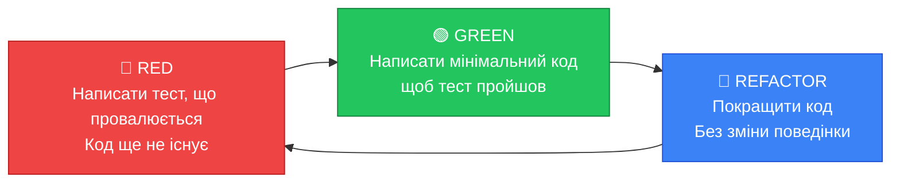

# TDD та BDD: Тести як Дизайн-інструмент

## Парадокс, що зупиняє розробників

Є момент, через який проходить майже кожен, хто вперше чує про Test-Driven Development: **повне нерозуміння**.

"Як я можу написати тест для того, що я ще не написав? Я не знаю, який буде API, які параметри приймає метод, що він повертає. Моя IDE підкреслить все червоним — клас не існує, метод не існує."

Це абсолютно природна реакція. І це — перший і найважливіший міф про TDD, який потрібно розвінчати: **TDD — це не про тести. Це про дизайн**.

Людина, що вперше чує TDD, думає: "Я маю написати тест → потім написати код, щоб тест пройшов". Але досвідчений практик TDD думає інакше: "Я маю **специфікувати** поведінку системи у вигляді виконуваного коду → потім **реалізувати** специфікацію → потім **покращити** реалізацію без зміни специфікації".

Різниця — не семантична. Вона фундаментальна. Тест у TDD — це не контроль якості написаного коду. Це **формалізована специфікація** майбутнього коду, що автоматично верифікується.

::note
Сам Кент Бек, автор TDD, якось написав: "I was finally able to separate in my mind the test-first approach to design from the test-as-safety-net approach to testing. While the latter is valuable (and additive to the former), the driving force for TDD is design."
::

Розберемо всі аспекти TDD крок за кроком — від механіки циклу до глибших концептуальних наслідків. Потім перейдемо до BDD — еволюційного продовження, що додало до TDD мову комунікації з бізнесом.

---

## Механіка TDD: Цикл Red → Green → Refactor

Цикл TDD складається з трьох фаз, що повторюються ітеративно. Кожна ітерація — це маленький крок вперед, від кількох секунд до кількох хвилин.

::mermaid



::

### Фаза RED: Написати тест, що провалюється

На цій фазі ми пишемо тест для **ще не існуючої функціональності**. Тест повинен провалитись — і це нормально, це очікувана поведінка.

Чому важливо дочекатися "червоного"? Якщо тест зелений відразу, це може означати:
- Тест нічого не перевіряє (немає assertion)
- Функціональність вже реалізована (і ми тестуємо вже існуючий код)
- Тест написаний неправильно (перевіряє не те)

**Перший компіляційний провал** — теж вважається "червоним". Якщо ви пишете `calculator.Add(2, 3)` і IDE каже "Calculator не існує" — це вже перший тест, що "провалився". Ви отримали feedback від системи: "такого класу немає, треба створити".

Мислення у фазі RED: "Як **споживач** цього коду, як мені хотілося б його використовувати?" Це природньо веде до API, що зручний у використанні — а не API, що зручний у реалізації.

### Фаза GREEN: Написати мінімальний код

На цій фазі є **єдина мета** — зробити тест зеленим. Будь-якими засобами. Навіть якщо код виглядає жахливо.

Це звучить безвідповідально, але є глибоким методологічним прийомом. Дозволяючи собі писати "брудний" код на цій фазі, ви:
1. Чітко відокремлюєте "зробити щось, що працює" від "зробити добре"
2. Фокусуєтесь на одній задачі (проходження тесту), не відволікаючись на оптимізацію
3. Маєте чіткий сигнал завершення: тест зелений

Крайній прояв цього принципу — так звані **Fake It 'Til You Make It** реалізації:

```csharp
// Тест:
[Fact]
public void Add_TwoPlusThree_ReturnsFive()
{
    var calc = new Calculator();
    Assert.Equal(5, calc.Add(2, 3));
}

// "Брудна" реалізація для GREEN — цілком прийнятна на цьому кроці:
public class Calculator
{
    public int Add(int a, int b) => 5; // hardcoded!
}
```

Так, ми просто повертаємо `5`. Тест зелений. Переходимо до наступного кроку — або пишемо ще один тест, що змусить нас написати справжню реалізацію.

::tip
Цей підхід звучить абсурдно для новачків, але він змушує думати: "Який мінімальний код робить тест зеленим?" Це питання часто виявляє, що тест перевіряє не те — або що одного тесту замало для специфікації.
::

### Фаза REFACTOR: Покращити без зміни поведінки

Це найважливіша і найменш зрозуміла фаза. Рефакторинг (Refactoring) — це **зміна внутрішньої структури коду без зміни його зовнішньої поведінки**.

Саме наявність зелених тестів робить рефакторинг безпечним. Тести — це сітка безпеки, що дозволяє впевнено змінювати код, знаючи, що поведінка не зміниться.

На цій фазі ви:
- Усуваєте дублювання (DRY — Don't Repeat Yourself)
- Перейменовуєте для кращої читабельності
- Виокремлюєте приватні методи, нові класи
- Покращуєте алгоритм без зміни результату
- Усуваєте "брудний" код з фази GREEN

Після рефакторингу — тести знову мають бути зеленими. Якщо щось зламалось — ви змінили поведінку, а не тільки структуру.

---

## Три Закони TDD за Robert C. Martin (Uncle Bob)

У своїй книзі "Clean Code" та у лекціях, Robert C. Martin (Uncle Bob) сформулював **три закони TDD**, що є максимально точним описом дисципліни:

::card-group

::card{title="Перший Закон" icon="i-lucide-scale"}

**Не можна писати production код, поки не написано хоча б один рядок failing unit test.**

Це абсолютна заборона. Ніякого production коду без тесту, що провалюється, — незалежно від того, наскільки "очевидна" реалізація.

::

::card{title="Другий Закон" icon="i-lucide-scale"}

**Не можна писати більше unit test коду, ніж достатньо для провалу. Навіть помилка компіляції є провалом.**

Ви пишете мінімальний тест. Щойно IDE показує помилку або тест "червоний" — ви зупиняєтесь і переходите до GREEN фази.

::

::card{title="Третій Закон" icon="i-lucide-scale"}

**Не можна писати більше production коду, ніж достатньо для проходження поточного failing тесту.**

Ніяких "а заодно зроблю ще це". Тільки рівно стільки коду, скільки потрібно для GREEN. Все інше — через наступний RED тест.

::

::

Три закони разом утворюють дуже жорстку петлю:

```
ТЕСТ ПРОВАЛЮЄТЬСЯ → ПИШУ МІНІМАЛЬНИЙ КОД → ТЕСТ ЗЕЛЕНИЙ →
РЕФАКТОРЮ → ПИШУ НАСТУПНИЙ ТЕСТ → ТЕСТ ПРОВАЛЮЄТЬСЯ → ...
```

Тривалість одного циклу: типово від 30 секунд до 3-5 хвилин. Це **дуже швидка ітерація**. Якщо ви пишете код більше 5 хвилин без запуску тестів — ви порушуєте TDD.

---

## TDD — це дизайн-процес, а не техніка тестування

Це — головне, що потрібно зрозуміти. Розглянемо конкретно, як TDD впливає на якість дизайну.

### Testability як ознака хорошого дизайну

Якщо клас важко протестувати — це **ознака design problem**, не проблема тестів. Важкість тестування сигналізує про:

| Складність тестування | Ймовірна design проблема |
|-----------------------|--------------------------|
| Занадто багато параметрів конструктора | God Class, порушення SRP |
| Потрібно мокувати 7+ залежностей | Занадто тісні зв'язки (tight coupling) |
| Неможливо протестувати без піднятого HTTP-сервера | Логіка змішана з інфраструктурою |
| Тест вимагає конкретної послідовності викликів | Hidden state, side effects |
| Результат залежить від часу запуску | Невидимі залежності (DateTime.Now в коді) |

TDD виявляє ці проблеми **до** написання production коду — бо ви намагаєтесь написати тест і відразу стикаєтесь з "важко тестувати". Це design feedback на найранніше можливому етапі.

### TDD та SOLID принципи

Цікаво простежити, як TDD природньо веде до дотримання SOLID:

**Single Responsibility Principle (SRP):** Клас з єдиною відповідальністю легко тестувати — маленький, зрозумілий контракт. Клас з кількома відповідальностями важко тестувати — занадто багато сценаріїв, занадто багато залежностей.

**Open/Closed Principle (OCP):** TDD стимулює проєктувати розширення через інтерфейси (нові поведінки — нові реалізації інтерфейсу, не зміна коду). Бо зміна існуючого коду вимагає змін у тестах — TDD-розробник це відчуває.

**Liskov Substitution Principle (LSP):** Тести, що перевіряють поведінку через інтерфейс, впадуть, якщо реалізація порушує контракт LSP.

**Interface Segregation Principle (ISP):** Якщо для тесту потрібно мокувати великий інтерфейс з 20 методами (але в тесті використовується 2) — TDD підказує: розбийте інтерфейс на менші.

**Dependency Inversion Principle (DIP):** TDD майже неможливий без DIP. Щоб замінити залежність моком у тесті — залежність має бути абстракцією (інтерфейсом), а не конкретним класом. TDD **примушує** до DIP.

```csharp
// До TDD: залежність від конкретного класу
public class OrderService
{
    private readonly SqlOrderRepository _repo = new SqlOrderRepository(); // ❌ Неможливо мокувати
    // ...
}

// Після TDD: залежність від абстракції (DIP)
public class OrderService
{
    private readonly IOrderRepository _repo; // ✅ Можна мокувати
    public OrderService(IOrderRepository repo) => _repo = repo;
}
```

### Тести як Жива Документація (Living Documentation)

Ще одна потужна властивість TDD: тести, написані у TDD-циклі, описують **очікувану поведінку системи** у вигляді виконуваного коду.

На відміну від документації у вигляді Word-документів або confluence-сторінок:
- Тести **не застарівають**: якщо поведінка змінюється — тест провалюється
- Тести **конкретні**: точно описують вхідні і вихідні дані
- Тести **виконувані**: можна запустити і побачити результат

Хороша назва тесту — це твердження про систему: "При вказаному негативному балансі, клієнту заборонено знімати кошти." Набір таких тверджень формує специфікацію, що завжди актуальна.

---

## Triangulation (Трикутування) у TDD

**Triangulation** — це техніка, що змушує написати більш загальний алгоритм, додаючи ще один тест.

Повернемось до прикладу з Calculator:

```csharp
// Тест 1
[Fact]
public void Add_TwoPlusThree_ReturnsFive()
{
    Assert.Equal(5, new Calculator().Add(2, 3));
}

// Реалізація, що проходить Тест 1 (занадто конкретна):
public int Add(int a, int b) => 5;
```

Додаємо другий тест:

```csharp
// Тест 2 — заставляє нас написати реальну реалізацію
[Fact]
public void Add_OneAndOne_ReturnsTwo()
{
    Assert.Equal(2, new Calculator().Add(1, 1));
}
```

Тепер hardcoded `return 5` не пройде. Ми **вимушені** написати `return a + b`. Додавання другого тесту "трикутувало" нас до правильного алгоритму.

Triangulation — корисна техніка, коли не зрозуміло, як узагальнити алгоритм. Пишіть більше конкретних тест-кейсів, доки правильний алгоритм не стане очевидним.

---

## Baby Steps: принцип найменшого кроку

Один з найважчих аспектів засвоєння TDD — навчитися робити **дуже маленькі кроки**. Природній інстинкт розробника: "Я бачу рішення цілком, дайте я напишу все відразу".

TDD протистоїть цьому. Baby Steps (маленькі кроки) означає:
- Один тест за раз
- Мінімальна зміна коду для зеленого тесту
- Рефакторинг лише після зеленого

Чому це важливо?

**По-перше**, маленькі кроки дозволяють точно знати, де виникла проблема. Якщо тест провалився — ви змінили лише один маленький шматок коду. Причина очевидна.

**По-друге**, маленькі кроки підтримують **фокус**. Ви не намагаєтесь одночасно думати про дизайн, реалізацію та тестування. У фазі RED — тільки специфікація. У фазі GREEN — тільки реалізація. У фазі REFACTOR — тільки покращення.

**По-третє**, маленькі кроки дають постійний потік успіху. Кожен зелений тест — маленька перемога. Це підтримує мотивацію та концентрацію протягом тривалих сесій розробки.

---

## Переваги та критика TDD

### Переваги, підтверджені практикою

**Confidence (Впевненість):** Розгорнути код у production, маючи зелені тести — зовсім інше відчуття, ніж без тестів. Впевненість заснована на доказах, а не на вірі.

**Design Feedback:** TDD дає постійний сигнал про якість дизайну. "Якщо важко написати тест — переглянь дизайн."

**Living Documentation:** Тести документують поведінку краще за будь-яку іншу форму документації.

**Refactoring Safety Net:** Зелені тести — сітка безпеки для рефакторингу. Ви можете сміливо змінювати код, знаючи, що поведінку захищено тестами.

**Менший Debug час:** Дрібні ітерації TDD означають швидше виявлення помилок: ви знаєте, що зламалось на останньому маленькому кроці.

### Критика та справедливі застереження

**Складний legacy код:** TDD важко застосувати до коду, що вже написаний без урахування testability. Прийом "Working Effectively with Legacy Code" (Feathers) тут обов'язковий до вивчення.

**I/O bound операції:** Код, що інтенсивно працює з файловою системою, мережею, базами даних, — важче тестувати в ізоляції. Потрібні більш просунуті техніки (mocking, test containers).

**GUI та UI:** Тестувати User Interface через TDD традиційно важко. MVVM, MVP патерни покращують ситуацію, але не вирішують повністю.

**Крива навчання:** TDD вимагає часу для засвоєння. Перші тижні більшість розробників пишуть повільніше. Після роки практики — швидше і якісніше.

**"Кількість тестів важливіша за їхню якість":** Погана практика TDD може привести до великої кількості тестів, що нічого не перевіряють осмислено. TDD — це дисципліна, а не silver bullet.

---

## Behavior-Driven Development (BDD)

### Звідки виникла BDD

2003 рік. Дан Норт (Dan North) — консультант із Лондона — активно практикував TDD і навчав團�ків. Але щоразу він стикався з тією ж проблемою: **люди не розуміли, що саме тестувати**.

Вони писали тести, що перевіряли реалізаційні деталі, а не поведінку. Вони не знали, де починати і де зупинятись. Сам термін "unit test" плутав — що є "одиницею"?

Норт зрозумів, що проблема — у **мові та фреймінгу**. Якщо замінити "тест" на "специфікацію поведінки", багато питань відпадає самі собою.

Так народилась BDD — "Testing with the narrative glue". Норт хотів, щоб тести були зрозумілі не лише розробникам, а й бізнес-аналітикам, власникам продукту, кінцевим користувачам.

Перша публікація BDD — стаття Норта ["Introducing BDD"](https://dannorth.net/introducing-bdd/) (2006). У ній був представлений **Given-When-Then синтаксис** як спосіб описувати поведінку на природній мові.

### Ubiquitous Language та Domain-Driven Design

BDD нерозривно пов'язана з концепцією **Ubiquitous Language** (єдина мова), що походить з Domain-Driven Design (DDD) Еріка Еванса.

Ubiquitous Language — це спільна словникова база, яку використовують і розробники, і бізнес-фахівці. Замість "ми викликаємо `calculateDiscountPercentage()` з параметром `CustomerType.Premium`" — "ми надаємо Premium-клієнту знижку 10%".

BDD тести написані на Ubiquitous Language:
- Не `Assert.Equal(0.9m, result.Price)` → а `order.Total should be reduced by 10% for Premium customers`
- Не технічні деталі → а бізнес-твердження

Це дозволяє **non-technical stakeholders** читати і розуміти специфікацію, і навіть брати участь у її формуванні.

### Given-When-Then синтаксис

Структура BDD сценарію:

```
Given [передумови — контекст]
When  [дія — що відбувається]
Then  [очікуваний результат — що має відбутись]
```

Приклад для функції знижки:

```
Scenario: Premium customer receives standard discount
  Given a customer with Premium membership
  And  a shopping cart with items totaling 1000 UAH
  When the customer proceeds to checkout
  Then the discount should be 10%
  And  the final total should be 900 UAH
```

Цей формат:
- **Зрозумілий для бізнесу**: продукт-менеджер може прочитати і підтвердити правильність
- **Точний для розробника**: чіткі вхідні умови та очікуваний результат
- **Виконуваний**: може бути перетворений у автоматизований тест

### Gherkin: формальна мова BDD

**Gherkin** — формальна мова для написання BDD специфікацій. Це те, що ви пишете у `.feature` файлах при використанні SpecFlow (C#) або Cucumber (Java/Ruby).

```gherkin
Feature: Shopping Cart Discount

  Background:
    Given the discount rules are:
      | Customer Type | Discount |
      | Standard      | 0%       |
      | Premium       | 10%      |
      | VIP           | 20%      |

  Scenario: Premium customer gets 10% discount
    Given I am a Premium customer
    And my cart contains:
      | Product | Price |
      | Laptop  | 1000  |
      | Mouse   | 100   |
    When I apply the discount
    Then the total should be 990 UAH

  Scenario: VIP customer gets 20% discount
    Given I am a VIP customer
    And my cart total is 500 UAH
    When I apply the discount
    Then the total should be 400 UAH

  Scenario Outline: Various discount scenarios
    Given I am a <type> customer
    And my cart total is <total> UAH
    When I apply the discount
    Then the total should be <expected> UAH

    Examples:
      | type      | total | expected |
      | Standard  | 100   | 100      |
      | Premium   | 100   | 90       |
      | VIP       | 100   | 80       |
```

### BDD ≠ Cucumber/SpecFlow. BDD — підхід до комунікації

Велика помилка: вважати BDD синонімом Cucumber або SpecFlow. **BDD — це підхід до комунікації та специфікації**. Інструменти — лише допоміжні засоби.

Можна практикувати BDD без `.feature` файлів взагалі — просто дотримуючись Given-When-Then структури у звичайних xUnit тестах:

```csharp
[Fact]
public void PremiumCustomer_ShouldReceive10PercentDiscount_WhenCheckingOut()
{
    // Given: a customer with Premium membership
    var customer = new Customer { Type = CustomerType.Premium };

    // And: a shopping cart with items totaling 1000 UAH
    var cart = new ShoppingCart(customer);
    cart.AddItem(new Item { Price = 1000m });

    // When: the customer proceeds to checkout
    var order = cart.Checkout();

    // Then: the discount should be applied
    Assert.Equal(100m, order.Discount);
    Assert.Equal(900m, order.Total);
}
```

Коментарі `// Given`, `// When`, `// Then` — це і є BDD мова, вбудована у звичайний C# тест.

---

## AAA Pattern: Arrange-Act-Assert

**Arrange-Act-Assert (AAA)** — структурний патерн організації тесту, що є C#/.NET варіантом концепції Given-When-Then.

```csharp
[Fact]
public void Test_Scenario_ExpectedResult()
{
    // Arrange — підготовка стану (Given)
    var dependency = new MockDependency();
    var sut = new SystemUnderTest(dependency);
    var input = new TestInput { Value = 42 };

    // Act — виконання дії (When)
    var result = sut.DoSomething(input);

    // Assert — перевірка результату (Then)
    Assert.Equal(expectedValue, result.Value);
    Assert.True(result.IsSuccess);
}
```

### Arrange: підготовка стану

**Arrange** — це фаза підготовки всього необхідного для тесту:
- Створення об'єкта, що тестується (System Under Test, SUT)
- Налаштування залежностей (реальних або mock)
- Підготовка вхідних даних
- Налаштування початкового стану системи

Це найдовша частина тесту — особливо для інтеграційних тестів. Якщо Arrange займає більше 50% коду тесту — варто розглянути Test Data Builder або Object Mother pattern (детально у [статті про патерни тестування](/csharp/aspnet/testing/testing-patterns)).

### Act: виконання дії

**Act** — це **одна** дія, що тестується. Зазвичай один виклик методу.

Якщо тест виконує більше однієї дії в Act — це може бути ознакою того, що тест перевіряє занадто багато:

```csharp
// Потенційна проблема: дві дії в Act
// Act
sut.DoFirst(input);
var result = sut.DoSecond(input); // Що тестуємо: DoFirst чи DoSecond?

// Краще: два окремих тести
[Fact]
public void DoFirst_WithValidInput_Succeeds() { ... }

[Fact]
public void DoSecond_AfterFirstSucceeds_ReturnsExpected() { ... }
```

Виняток: складні інтеграційні сценарії, де є природний потік дій (login → create resource → read resource).

### Assert: перевірка результату

**Assert** — перевірка очікуваного результату. Тут є важливе правило:

**Один тест — одна конкретна причина для провалу.**

Це не означає "один `Assert.Equal`" — але означає, що всі assertion у тесті перевіряють **один аспект поведінки**.

```csharp
// ✅ Добре: всі assertions стосуються одного аспекту — структури відповіді
Assert.Equal(200, response.StatusCode);
Assert.Equal("application/json", response.ContentType);
Assert.NotNull(response.Body);

// ❌ Проблема: assertions про два різних аспекти в одному тесті
Assert.Equal(200, response.StatusCode);       // аспект 1: HTTP статус
Assert.Equal(5, repo.GetAllUsers().Count());   // аспект 2: стан бази даних
// Якщо тест впаде — незрозуміло, де саме проблема
```

### Given-When-Then vs AAA: контекст різний

Обидва патерни описують одну й ту саму структуру, але в різних контекстах:

| Аспект | AAA | Given-When-Then |
|--------|-----|-----------------|
| **Контекст** | Unit тести у коді | BDD специфікації, acceptance tests |
| **Аудиторія** | Розробники | Розробники + Бізнес |
| **Деталізація** | Технічна | Бізнесово-орієнтована |
| **Мова** | Код | Природна мова (Gherkin) або псевдокод |
| **Інструменти** | xUnit, NUnit | SpecFlow, Reqnroll, чисті коментарі |

У практиці C# розробки: **AAA для unit тестів**, **Given-When-Then коментарі** для acceptance/integration тестів де потрібна читабельність для нетехнічних людей.

---

## Конвенції іменування тестів

Назва тесту — це **перша і найважливіша документація** тесту. Коли тест провалюється у CI — перше, що бачить розробник — назву тесту. Вона має відповісти: "Що пішло не так?"

Розглянемо кілька популярних конвенцій.

### Roy Osherove: MethodName_StateUnderTest_ExpectedBehavior

Запропонована Роєм Ошеровим у книзі "The Art of Unit Testing", ця конвенція є однією з найпоширеніших:

```csharp
// Формат: [MethodName]_[StateUnderTest]_[ExpectedBehavior]
public class CalculatorTests
{
    [Fact]
    public void Add_TwoPositiveNumbers_ReturnsCorrectSum() { }

    [Fact]
    public void Add_NegativeAndPositive_ReturnsCorrectSum() { }

    [Fact]
    public void Divide_ByZero_ThrowsDivideByZeroException() { }

    [Fact]
    public void Divide_TwoIntegers_ReturnsDecimalResult() { }
}
```

**Переваги:**
- Структурована та послідовна
- Зрозуміло, що тестується (метод), при яких умовах (стан), що очікується (результат)

**Недоліки:**
- Може ставати довгою та незручною
- Слово "Should" часто відсутнє, що знижує читабельність як специфікації

### BDD-стиль: Should/When

```csharp
// BDD-орієнтоване іменування
public class ShoppingCartShould
{
    [Fact]
    public void ApplyDiscountWhenCustomerIsPremium() { }

    [Fact]
    public void NotAllowNegativeItemQuantity() { }

    [Fact]
    public void ThrowExceptionWhenAddingItemWithZeroPrice() { }
}

// Або через Given-When-Then
public class OrderServiceTests
{
    [Fact]
    public void GivenInsufficientInventory_WhenPlacingOrder_ShouldReturnFailure() { }

    [Fact]
    public void GivenVipUser_WhenApplyingDiscount_ShouldReturn20Percent() { }
}
```

### Лаконічний стиль

Деякі команди (особливо у F# та Haskell спільнотах) використовують просто описові назви без шаблону:

```csharp
[Fact]
public void Premium customers receive 10 percent discount() { }

[Fact]
public void Cannot checkout with empty cart() { }

[Fact]
public void Order total includes all items and taxes() { }
```

Так — у C# не прийнято (пробіли в назвах методів), але в F# та деяких .NET тест-фреймворках це підтримується.

### Кращі практики іменування

::tip
**Золоті правила назви тесту:**
1. **Не скорочуйте** — повна назва краще за незрозуміле скорочення
2. **Описуйте поведінку, не реалізацію** — `CalculatesCorrectDiscount` краще за `CallsDiscountMethod`
3. **Уникайте технічних деталей** — `ReturnsEmptyListWhenNoUsers` краще за `ReturnsNewList`
4. **Включайте умову** — `_WhenUserIsNotFound` або `_WithEmptyCart`
5. **Уникайте тавтологій** — `GetUser_UserExists_ReturnsUser` має тавтологію в назві
::

### Ще одна конвенція: Noun Form (клас тесту як специфікація)

```csharp
// Тест-клас = специфікація класу, що тестується
public class A_calculator
{
    public class when_adding_two_numbers
    {
        [Fact]
        public void should_return_their_sum() { }

        [Fact]
        public void should_not_modify_either_operand() { }
    }

    public class when_dividing_by_zero
    {
        [Fact]
        public void should_throw_DivideByZeroException() { }
    }
}
```

Цей підхід (популярний у RSpec, Jasmine) групує тести ієрархічно — читається майже як prose.

---

## Практичний TDD: покроковий приклад

Розглянемо реальний приклад TDD для простої задачі: **реалізувати FizzBuzz**.

Правила: для чисел кратних 3 → "Fizz", кратних 5 → "Buzz", кратних 15 → "FizzBuzz", всіх інших → саме число.

```csharp
// Крок 1 — RED: перший тест
[Fact]
public void GetValue_ForOne_ReturnsOne()
{
    var fb = new FizzBuzz();
    Assert.Equal("1", fb.GetValue(1));
}
// FizzBuzz не існує → компіляційна помилка → RED ✅

// Крок 2 — GREEN: мінімальна реалізація
public class FizzBuzz
{
    public string GetValue(int n) => n.ToString(); // Найпростіша реалізація
}
// Тест 1 зелений ✅

// Крок 3 — RED: другий тест
[Fact]
public void GetValue_ForThree_ReturnsFizz()
{
    Assert.Equal("Fizz", new FizzBuzz().GetValue(3));
}
// "3".ToString() = "3", а не "Fizz" → RED ✅

// Крок 4 — GREEN
public string GetValue(int n)
{
    if (n % 3 == 0) return "Fizz";
    return n.ToString();
}
// Тести 1 та 2 зелені ✅

// Крок 5 — RED: третій тест
[Fact]
public void GetValue_ForFive_ReturnsBuzz()
{
    Assert.Equal("Buzz", new FizzBuzz().GetValue(5));
}

// Крок 6 — GREEN
public string GetValue(int n)
{
    if (n % 3 == 0) return "Fizz";
    if (n % 5 == 0) return "Buzz";
    return n.ToString();
}

// Крок 7 — RED: четвертий тест (критичний edge case)
[Fact]
public void GetValue_ForFifteen_ReturnsFizzBuzz()
{
    Assert.Equal("FizzBuzz", new FizzBuzz().GetValue(15));
}
// Поточна реалізація поверне "Fizz" для 15 (бо 15%3==0 спрацює першим) → RED ✅

// Крок 8 — GREEN
public string GetValue(int n)
{
    if (n % 15 == 0) return "FizzBuzz"; // FizzBuzz ПЕРЕД Fizz та Buzz!
    if (n % 3 == 0) return "Fizz";
    if (n % 5 == 0) return "Buzz";
    return n.ToString();
}

// Крок 9 — REFACTOR (виглядає непогано, але можна покращити)
public string GetValue(int n)
{
    var result = string.Empty;
    if (n % 3 == 0) result += "Fizz";
    if (n % 5 == 0) result += "Buzz";
    return string.IsNullOrEmpty(result) ? n.ToString() : result;
}
// Всі 4 тести зелені ✅ Рефакторинг не зламав поведінку
```

Зверніть, що **Крок 7** виявив важливий edge case — якщо ми не написали тест для 15 раніше, hardcoded перевірка першого `if` приховала б баг. TDD змусив нас думати про граничний випадок.

---

## Коли TDD важко застосовувати

Важливо чесно говорити про обмеження.

**Виступ проти TDD (справедлива критика):**

**Legacy код:** Код, написаний без урахування testability, часто неможливо протестувати без серйозного рефакторингу. Але рефакторинг без тестів небезпечний. "Chicken-and-egg" проблема. Михайло Федерс (Michael Feathers) у книзі "Working Effectively with Legacy Code" пропонує конкретні техніки виходу з цього сценарію.

**Exploratory coding:** Коли ви досліджуєте незнайому область і не знаєте заздалегідь, яким має бути API — TDD може сповільнити. Спочатку напишіть "spike" (exploration prototype), зрозумійте домен — потім покривайте тестами.

**UI/UX Iterations:** Швидкі візуальні ітерації UI важко вести через TDD. MVVM + BDD acceptance tests — частковий вихід.

**Deadline тиск:** TDD повільніший на початку. Якщо критичний дедлайн — є вибір писати швидко, але потім обов'язково додавати тести ("test after").

---

## Практичні завдання

::card-group

::card{title="Рівень 1: Розуміння" icon="i-lucide-brain"}

**Завдання 1.1** — Поясніть своїми словами (200-250 слів): "Чому TDD — це дизайн-інструмент а не техніка тестування?" Наведіть конкретний приклад, де тест виявив design problem раніше, ніж код був написаний.

**Завдання 1.2** — Дано наступний тест. Визначте: (а) яка фаза AAA де знаходиться? (б) чи є порушення принципу "один тест — одна причина для провалу"? (в) перепишіть тест правильно.

```csharp
[Fact]
public void TestOrder()
{
    var db = new InMemoryDb();
    var repo = new OrderRepository(db);
    var service = new OrderService(repo);
    var order = new Order { Items = new[] { new Item { Price = 100 } } };
    service.CreateOrder(order);
    var result = repo.GetById(order.Id);
    Assert.NotNull(result);
    Assert.Equal(100, result.Total);
    Assert.Equal(OrderStatus.Pending, result.Status);
    Assert.True(result.CreatedAt < DateTime.UtcNow);
}
```

**Завдання 1.3** — Напишіть BDD сценарій на Gherkin для функції: "Банківський переказ. Відправник може переказати суму, якщо на рахунку достатньо коштів. При недостатньому балансі — повернути помилку." Зробіть мінімум 3 сценарії.

::

::card{title="Рівень 2: Логіка" icon="i-lucide-bar-chart"}

**Завдання 2.1 — Повний TDD цикл**

Реалізуйте через TDD (покроково, з документуванням кожної RED-GREEN-REFACTOR ітерації) клас `StringCalculator` з методом `int Add(string numbers)`:
- Порожній рядок → 0
- "1" → 1
- "1,2" → 3
- "1,2,3" → 6
- "1\n2,3" → 6 (підтримка переносу рядка як розділювача)
- "//;\n1;2" → 3 (кастомний розділювач у першому рядку)
- Від'ємні числа → викинути виключення з повідомленням "Negatives not allowed: -1, -2"

Це класична kata для TDD — "String Calculator Kata" (Roy Osherove).

**Завдання 2.2** — Перепишіть один зі своїх existing тестів у BDD стиль (Given-When-Then коментарі) та у Gherkin (**.feature** файл). Порівняйте: що стало зрозуміліше для нетехнічного читача?

::

::card{title="Рівень 3: Архітектура" icon="i-lucide-rocket"}

**Завдання 3.1 — TDD по-справжньому**

Напишіть через TDD невеликий сервіс: "Система нарахування балів лояльності (Loyalty Points):
- При купівлі товару нараховується 1 бал за кожні 10 грн
- Premium клієнти отримують подвійні бали
- Бонусні промокоди додають фіксовану кількість балів
- Баланс балів не може бути від'ємним
- Можна обміняти 100 балів на знижку 50 грн"

Починайте з тесту. Кожен крок документуйте: що тестуємо → чому провалюється → мінімальний код → рефакторинг.

**Завдання 3.2 — BDD від бізнес-вимог до тестів**

Вам дані наступні user stories:
1. "Як Premium клієнт, я хочу отримувати знижку 15% автоматично при кожній покупці"
2. "Як менеджер, я хочу мати можливість заблокувати знижку для конкретного товару"
3. "Як клієнт, я хочу бачити відображення знижки в кошику до підтвердження замовлення"

Перетворіть ці user stories на: (а) Gherkin scenarios, (б) C# тести у стилі BDD, (в) реалізацію через TDD.

::

::

---

## Підсумок

::note
**Ключові думки цієї статті:**

- **TDD — це дизайн-інструмент**, не техніка тестування. Тест у TDD — це формалізована специфікація майбутнього коду.

- **Цикл Red → Green → Refactor**: написати тест що провалюється → мінімальний код → покращити без зміни поведінки. Тривалість ітерації — секунди або хвилини.

- **Три закони Uncle Bob**: failing test перед production кодом; мінімальний тест до першого провалу; мінімальний код до першого зеленого.

- **Testability = хороший дизайн**: якщо важко написати тест — поганий дизайн. TDD природньо веде до SOLID.

- **Triangulation**: додавання нових тестів для узагальнення алгоритму. Baby Steps — принцип мінімальних ітерацій.

- **BDD** (Dan North, 2003): Given-When-Then синтаксис, Ubiquitous Language, Gherkin. BDD — це підхід до комунікації, а не інструмент.

- **AAA Pattern**: Arrange (підготовка) → Act (дія) → Assert (перевірка). Один тест — одна причина для провалу.

- **Іменування тестів**: Roy Osherove (MethodName_State_Expected), BDD-стиль (Should/Given-When-Then). Назва = перша документація.
::

Наступна стаття — практика: [що саме тестувати, як аналізувати тестові умови і розраховувати цикломатичну складність](/csharp/aspnet/testing/what-to-test).
