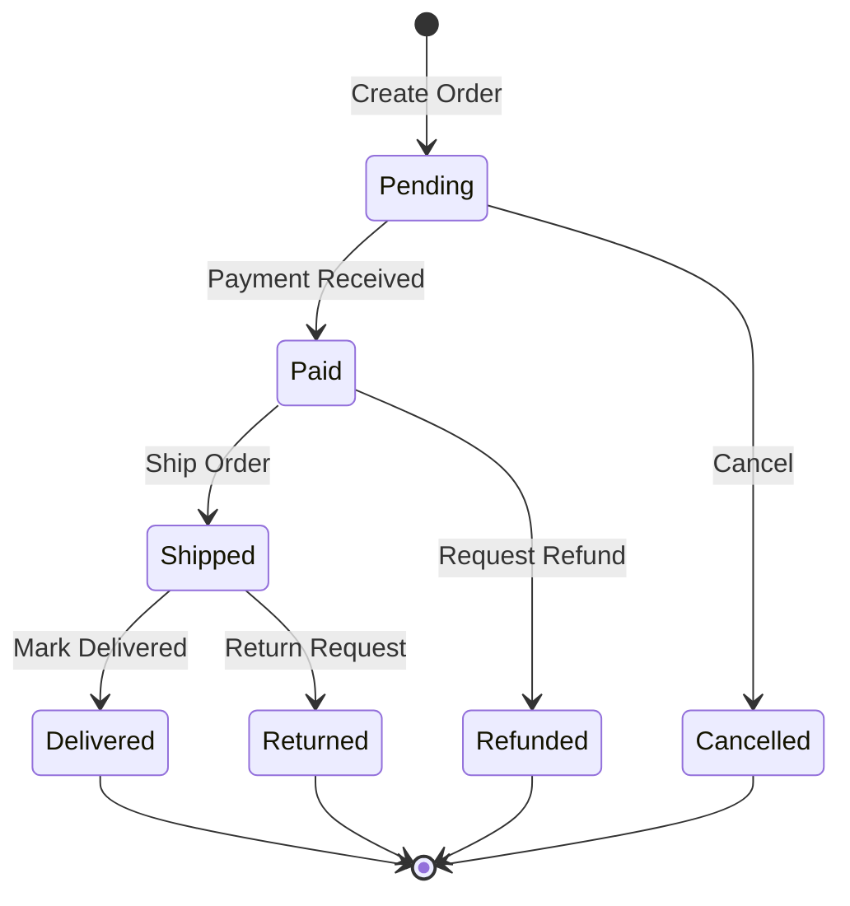
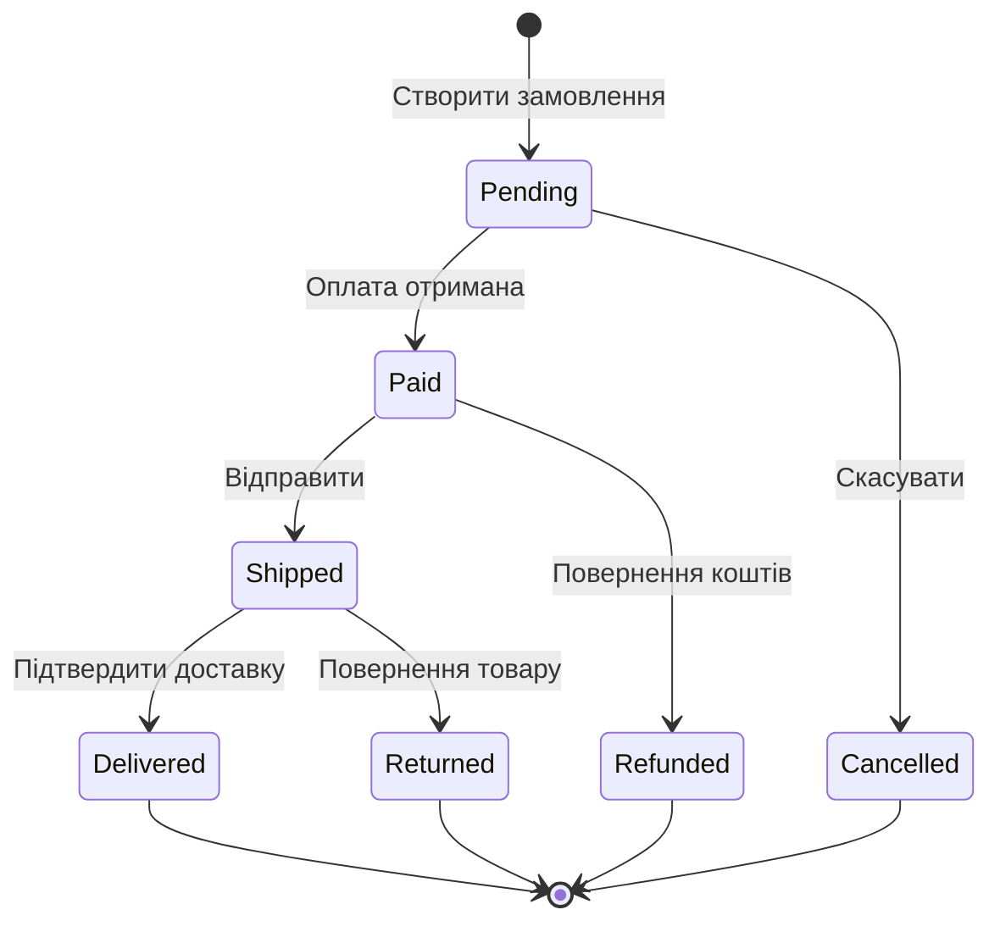

# Що саме тестувати: Техніки аналізу та Цикломатична складність

## Проблема порожнього екрану

Уявіть: вам поставлено задачу написати тести для методу, що обчислює страховий внесок. Ви відкриваєте порожній файл, пишете `[Fact]` та... зависаєте. Що тестувати? Звичайний випадок? А граничний? Скільки тестів достатньо? Чи потрібно перевіряти кожну комбінацію параметрів?

Це — проблема **тест-аналізу**: систематичного визначення того, які саме сценарії необхідно перевірити.

Без методичного підходу тестування перетворюється у випадковий набір перевірок, що покриває те, про що розробник пам'ятає у конкретний момент. Такий підхід дає хибне відчуття безпеки: тести є, але реальні дефекти залишаються непоміченими.

ISTQB визначає два великих класи технік тест-аналізу: **Black-Box** та **White-Box**. Перший не потребує знання внутрішньої реалізації — достатньо специфікації. Другий аналізує внутрішню структуру коду. Ми розглянемо обидва класи детально, і завершимо практичним інструментом — Цикломатичною складністю — що дозволяє математично розрахувати мінімальну кількість тестів для будь-якого методу.

---

## Black-Box техніки: тестуємо поведінку, не реалізацію

Black-Box техніки отримали назву від принципу: **система — це "чорна скринька"**. Ви бачите входи і виходи, але не бачите того, що відбувається всередині. Це дозволяє писати тести ще до написання production коду — лише на основі специфікації.

---

### Техніка 1: Equivalence Partitioning (Розбиття на класи еквівалентності)

#### Теоретична основа

**Equivalence Partitioning (EP)** базується на простому спостереженні: якщо система обробляє певну групу вхідних значень однаково, то для виявлення дефектів достатньо перевірити лише **один представник** групи. Всі інші значення групи поводяться ідентично й не надають нової інформації про дефекти.

Кожна така група — **клас еквівалентності (equivalence class)**. Усі значення всередині класу, з точки зору функції, є "однаковими".

Розбиття вхідних даних на класи еквівалентності виконується для кожного параметра окремо та для їх комбінацій.

#### Валідні та невалідні класи

Важливо розрізняти:
- **Валідні класи**: вхідні дані, що система має обробляти коректно
- **Невалідні класи**: вхідні дані поза очікуваним діапазоном — система мусить їх відхиляти або опрацьовувати спеціальним чином

Тестувати треба обидва типи. Невалідні класи особливо важливі — більшість реальних дефектів виникає саме тут.

#### Практичний приклад: реєстрація користувача

Розглянемо поле "Вік користувача" при реєстрації. Бізнес-правило: "Дозволяється реєстрація для осіб від 18 до 120 років".

**Визначаємо класи еквівалентності:**

| № | Клас | Діапазон | Тип | Представник |
|---|------|----------|-----|-------------|
| 1 | Неповнолітні | age < 18 | Невалідний | 15 |
| 2 | Дорослі (нижня межа) | 18 ≤ age ≤ 120 | Валідний | 25 |
| 3 | Нереалістичний вік | age > 120 | Невалідний | 150 |
| 4 | Нульовий вік | age = 0 | Невалідний | 0 |
| 5 | Від'ємний вік | age < 0 | Невалідний | -5 |

Для перевірки достатньо **5 тестів** (по одному з кожного класу) замість тестування кожного можливого значення 0..200.

```csharp
public class UserRegistrationTests
{
    private readonly RegistrationService _sut = new();

    [Theory]
    [InlineData(15)]   // EP клас 1: неповнолітній
    [InlineData(0)]    // EP клас 4: нульовий вік
    [InlineData(-5)]   // EP клас 5: від'ємний вік
    [InlineData(150)]  // EP клас 3: нереалістичний
    public void RegisterUser_WithInvalidAge_ThrowsValidationException(int age)
    {
        var dto = new RegisterUserDto { Age = age, Email = "test@test.com" };

        var action = () => _sut.Register(dto);

        Assert.Throws<ValidationException>(action);
    }

    [Fact]
    public void RegisterUser_WithValidAge_Succeeds()
    {
        // EP клас 2: валідний дорослий
        var dto = new RegisterUserDto { Age = 25, Email = "test@test.com" };

        var result = _sut.Register(dto);

        Assert.True(result.IsSuccess);
    }
}
```

#### Множинні параметри: декартовий добуток

Коли функція приймає кілька параметрів, кожен має власні класи еквівалентності. Повне тестування — декартовий добуток всіх комбінацій. Це **exponential** зростання кількості тестів.

Приклад: метод `CreateDiscount(CustomerType customerType, decimal orderAmount, string? promoCode)`:
- `customerType`: 3 класи (Standard, Premium, VIP)
- `orderAmount`: 3 класи (< 0, 0-1000, > 1000)
- `promoCode`: 3 класи (null, валідний, невалідний)

Повне покриття: 3 × 3 × 3 = **27 тест-кейсів**. Для більших методів це стає непрактичним.

Рішення: **Pairwise Testing** — замість покриття всіх комбінацій, покривати всі **пари** параметрів. Математично доведено, що більшість дефектів виявляється при взаємодії двох параметрів. Інструменти: PICT (Pairwise Independent Combinatorial Testing) від Microsoft.

---

### Техніка 2: Boundary Value Analysis (Аналіз Граничних Значень)

#### Теоретична основа

**Boundary Value Analysis (BVA)** — розширення EP, що враховує відому статистику: **більшість дефектів кластеризуються на межах класів еквівалентності**. Помилки типу "off-by-one" — `<` замість `<=`, `>` замість `>=`, ітерація до `n` замість `n-1` — зустрічаються у реальному коді набагато частіше, ніж дефекти "в середині" діапазону.

Тому ми не лише тестуємо один представник кожного класу — ми тестуємо **граничні точки** між класами.

#### Чотири типи граничних точок

Для граничного значення між двома класами визначають:

- **On-point** (на межі): значення безпосередньо на межі. Наприклад, для умови `age >= 18`: on-point = 18
- **Off-point** (за межею): найближче значення поза межею. Для `age >= 18`: off-point = 17 (для нижньої межі) або 19 (для умови "менше ніж")
- **In-point** (всередині): значення в середині класу (для підтвердження нормальної роботи)
- **Out-point** (далеко за межею): значення значно за межею (для невалідних класів)

#### Практичний приклад повного BVA

Умова: метод `IsEligibleForCreditCard(int age)` повертає `true` для вікового діапазону **[21, 65]**.

```
Діапазон: [21, 65]
Нижня межа: 21
Верхня межа: 65
```

**BVA аналіз:**

| Точка | Значення | Клас | Очікуваний результат |
|-------|----------|------|---------------------|
| Out-point нижній | 5 | Невалідний | false |
| Off-point нижній | 20 | Невалідний | false |
| **On-point нижній** | **21** | **Валідний** | **true** |
| In-point | 40 | Валідний | true |
| **On-point верхній** | **65** | **Валідний** | **true** |
| Off-point верхній | 66 | Невалідний | false |
| Out-point верхній | 100 | Невалідний | false |

```csharp
[Theory]
[InlineData(5, false)]    // Out-point: далеко за нижньою межею
[InlineData(20, false)]   // Off-point: одразу перед нижньою межею
[InlineData(21, true)]    // On-point: точно нижня межа
[InlineData(40, true)]    // In-point: середина діапазону
[InlineData(65, true)]    // On-point: точно верхня межа
[InlineData(66, false)]   // Off-point: одразу після верхньої межі
[InlineData(100, false)]  // Out-point: далеко за верхньою межею
public void IsEligibleForCreditCard_ReturnsCorrectResult(int age, bool expected)
{
    var result = _creditService.IsEligibleForCreditCard(age);
    Assert.Equal(expected, result);
}
```

#### Чому on-point і off-point так важливі

Найчастіші помилки розробників:

```csharp
// Правильно: age >= 21
if (age >= 21 && age <= 65) return true;

// Помилка #1: строга нерівність (off-by-one):
if (age > 21 && age <= 65) return true;  // 21 поверне false!

// Помилка #2: неправильна верхня межа:
if (age >= 21 && age < 65) return true;  // 65 поверне false!

// Помилка #3: OR замість AND:
if (age >= 21 || age <= 65) return true;  // всі поверне true!
```

Тест з `InlineData(21, true)` виявить Помилку #1. Без цього тесту дефект залишиться непоміченим.

#### BVA для нечислових типів

BVA застосовується не лише до числових діапазонів:

**Рядки:**
- Порожній рядок `""`
- Рядок з одним символом `"a"`
- Максимально допустима довжина — 1 символ (on-point)
- Максимально допустима довжина (on-point)
- Максимально допустима довжина + 1 (off-point)

**Колекції:**
- Порожня колекція `[]`
- Колекція з одним елементом `[x]`
- Максимально допустимий розмір - 1
- Максимально допустимий розмір (on-point)
- Максимально допустимий розмір + 1 (off-point)

**Дати:**
- Перший день місяця / року
- Останній день місяця (28/29/30/31)
- Переведення годинника (DST)
- Leap year (29 лютого)

```csharp
// BVA для рядків: поле "Ім'я користувача" від 3 до 50 символів
[Theory]
[InlineData("")]        // Порожній — невалідний
[InlineData("ab")]      // 2 символи — off-point, невалідний
[InlineData("abc")]     // 3 символи — on-point нижній, валідний
[InlineData("test")]    // 4 символи — in-point, валідний
[InlineData(50chars)]   // 50 символів — on-point верхній, валідний
[InlineData(51chars)]   // 51 символ — off-point, невалідний
public void ValidateUsername_ReturnsCorrectResult(string username, bool expected) { ... }
```

---

### Техніка 3: Decision Table Testing (Таблиця рішень)

#### Теоретична основа

**Decision Table Testing** застосовується, коли бізнес-логіка є **комбінацією кількох умов**, що разом визначають результат. Замість того, щоб описувати логіку словами (що може бути неоднозначним), ми складаємо таблицю: рядки — умови та дії, стовпці — комбінації.

Ця техніка особливо цінна, коли бізнес-правила документовані неповно або суперечливо. Таблиця рішень змушує замовника або аналітика явно визначити кожну комбінацію.

#### Приклад: система знижок інтернет-магазину

Бізнес-правила:
- Якщо клієнт — Premium, він отримує знижку 10%
- Якщо замовлення > 1000 грн, додаткова знижка 5%
- Якщо є промокод, додаткова знижка 15%

Здається, три незалежних правила. Але що якщо **всі три** умови виконуються одночасно? Знижки накладаються? Є максимальна межа? Тільки найбільша застосовується?

Саме для таких ситуацій існує Decision Table. Вона **примушує** явно визначити кожну комбінацію:

| Умова / Результат | C1 | C2 | C3 | C4 | C5 | C6 | C7 | C8 |
|---|---|---|---|---|---|---|---|---|
| Premium клієнт | T | T | T | T | F | F | F | F |
| Замовлення > 1000 | T | T | F | F | T | T | F | F |
| Є промокод | T | F | T | F | T | F | T | F |
| **Загальна знижка** | **?** | **15%** | **25%** | **10%** | **20%** | **5%** | **15%** | **0%** |

Стовпець C1 (всі умови True) — тут потрібно явно вирішити: наприклад, максимум 30% або накопичувально але не більше 25%.

```csharp
// Decision Table → Theory тест
[Theory]
[InlineData(true,  true,  true,  25)]  // C1: все true — домовились на cap 25%
[InlineData(true,  true,  false, 15)]  // C2: Premium + велике замовлення
[InlineData(true,  false, true,  25)]  // C3: Premium + промокод
[InlineData(true,  false, false, 10)]  // C4: тільки Premium
[InlineData(false, true,  true,  20)]  // C5: велике замовлення + промокод
[InlineData(false, true,  false,  5)]  // C6: тільки велике замовлення
[InlineData(false, false, true,  15)]  // C7: тільки промокод
[InlineData(false, false, false,  0)]  // C8: нічого
public void CalculateDiscount_ReturnsCorrectPercentage(
    bool isPremium, bool isLargeOrder, bool hasPromo, int expectedDiscount)
{
    var result = _discountService.Calculate(isPremium, isLargeOrder, hasPromo);
    Assert.Equal(expectedDiscount, result.DiscountPercent);
}
```

#### Скорочені таблиці рішень

Повна таблиця з N умовами має 2^N стовпців. Для 3 умов — 8, для 5 умов — 32, для 10 умов — 1024. Очевидно, це непрактично.

**Скорочена таблиця** об'єднує стовпці, де певні умови є **непринциповими** (don't care). Наприклад, якщо промокод завжди дає 15% незалежно від інших умов:

| Умова | C1 | C2 |
|-------|----|----|
| Є промокод | T | F |
| Premium (неважливо) | — | T/F |
| Замовлення > 1000 (неважливо) | — | T/F |
| Знижка за промокод | 15% | 0% |

Тире ("—") означає "значення цієї умови не впливає на результат у цьому стовпці".

---

### Техніка 4: State Transition Testing (Тестування переходів станів)

#### Теоретична основа

**State Transition Testing** застосовується для систем або об'єктів, що мають **явні стани** і переходять між ними при певних подіях. Для таких систем тести мають перевіряти:
1. Всі коректні переходи (valid transitions)
2. Результатний стан після переходу
3. Недозволені переходи (invalid transitions) — система має їх відхиляти

#### Приклад: стани замовлення в e-commerce



::mermaid



::

З цієї state machine визначаємо тест-кейси:

```csharp
public class OrderStateMachineTests
{
    // Тестуємо всі валідні переходи
    [Fact]
    public void Order_FromPending_CanBePaid()
    {
        var order = Order.Create();
        Assert.Equal(OrderStatus.Pending, order.Status);

        order.MarkAsPaid();
        Assert.Equal(OrderStatus.Paid, order.Status);
    }

    [Fact]
    public void Order_FromPending_CanBeCancelled()
    {
        var order = Order.Create();
        order.Cancel();
        Assert.Equal(OrderStatus.Cancelled, order.Status);
    }

    // Тестуємо НЕВАЛІДНІ переходи
    [Fact]
    public void Order_FromShipped_CannotBeCancelled()
    {
        var order = Order.Create();
        order.MarkAsPaid();
        order.Ship();
        Assert.Equal(OrderStatus.Shipped, order.Status);

        // Невалідний перехід: відправлене замовлення не можна скасувати
        var action = () => order.Cancel();
        Assert.Throws<InvalidOrderStateException>(action);
    }

    [Fact]
    public void Order_FromCancelled_CannotBeShipped()
    {
        var order = Order.Create();
        order.Cancel();

        var action = () => order.Ship();
        Assert.Throws<InvalidOrderStateException>(action);
    }
}
```

**Покриття State Transition Tests:**
- **All States Coverage**: кожен стан досягнутий хоча б раз
- **All Transitions Coverage**: кожен перехід виконаний хоча б раз
- **All Paths Coverage**: всі можливі шляхи через state machine (найдорожче)

---

## White-Box техніки: тестуємо внутрішню структуру

White-Box техніки (також Code Coverage techniques) аналізують **внутрішню структуру коду** — які гілки, шляхи, умови виконані під час тестування.

---

### Statement Coverage (Покриття операторів)

**Statement Coverage** — найпростіша метрика: **кожен рядок коду виконано хоча б раз**.

```csharp
public decimal CalculateTax(decimal income, string country)
{
    if (country == "UA")          // рядок 1
    {
        return income * 0.18m;    // рядок 2
    }
    return income * 0.20m;        // рядок 3
}
```

Для 100% Statement Coverage: достатньо двох тестів — один з `country = "UA"`, один з будь-яким іншим.

**Проблема:** Statement Coverage не відрізняє, яка гілка умови виконалась. Два рядки мають бути виконані, але `if (a && b)` може виконатись лише при `a=true, b=true` — і Statement Coverage буде 100%, хоча гілка `a=true, b=false` не перевірена.

---

### Branch Coverage (Покриття розгалужень)

**Branch Coverage** — потужніша метрика: **кожна гілка коду виконана хоча б раз**.

Для кожного `if/else`, `switch`, тернарного оператора, `while`, `for` — перевіряємо обидві (або всі) гілки.

```csharp
public string GetDiscount(int age, bool isPremium)
{
    // Гілка 1a (true): age >= 18
    // Гілка 1b (false): age < 18
    if (age >= 18)
    {
        // Гілка 2a (true): isPremium
        // Гілка 2b (false): !isPremium
        if (isPremium)
        {
            return "20% discount";  // Шлях: 1a + 2a
        }
        return "10% discount";      // Шлях: 1a + 2b
    }
    return "No discount";           // Шлях: 1b
}
```

Для 100% Branch Coverage: 3 тести (1a+2a, 1a+2b, 1b).

**Чому Branch > Statement?** Розглянемо:

```csharp
decimal result = isPremium ? price * 0.8m : price; // тернарний оператор
```

Statement Coverage: виконати рядок один раз — `.8m` або `price` (але яка гілка невідомо).
Branch Coverage: виконати обидві гілки — з `isPremium=true` та `isPremium=false`.

::note
Більшість сучасних інструментів (Coverlet, dotnet-coverage) вимірюють саме **Branch Coverage**. При цілі "80% coverage" мають на увазі саме branch coverage.
::

---

### Path Coverage (Покриття шляхів)

**Path Coverage** — найповніша, але найдорожча метрика: **кожен унікальний шлях виконання від початку до кінця функції** виконаний хоча б раз.

```csharp
// Ця функція має скільки шляхів?
public string Process(bool a, bool b, bool c)
{
    string result = "";
    if (a) result += "A";         // 2 гілки: a=true / a=false
    if (b) result += "B";         // 2 гілки: b=true / b=false
    if (c) result += "C";         // 2 гілки: c=true / c=false
    return result;
}
```

Кількість шляхів = 2³ = **8**. Для кожної комбінації (A+B+C, A+B, A+C, B+C, A alone, B alone, C alone, пусто).

Якщо умови розташовані **послідовно** (незалежні `if`): шляхи множаться.
Якщо умови **вкладені**: кількість шляхів зростає ще швидше.

Path Coverage практично недосяжна для будь-якого нетривіального коду — тому його замінює Cyclomatic Complexity як практичний компроміс.

---

### Condition Coverage (Покриття умов)

**Condition Coverage** перевіряє, що **кожна елементарна умова** у складному булевому виразі приймала значення `true` та `false` хоча б раз.

```csharp
// Складна умова з двох частин
if (user.IsActive && user.HasVerifiedEmail)
```

Для Condition Coverage: 4 комбінації:
- IsActive=T, HasVerifiedEmail=T
- IsActive=T, HasVerifiedEmail=F
- IsActive=F, HasVerifiedEmail=T
- IsActive=F, HasVerifiedEmail=F

Це важливо, бо Statement/Branch Coverage міг пропустити деякі комбінації через short-circuit evaluation: якщо `IsActive=false`, то `HasVerifiedEmail` ніколи не обчислюється.

---

## Цикломатична складність (Cyclomatic Complexity)

### Математичне визначення

**Cyclomatic Complexity (CC)** — метрика складності програмного коду, запропонована Томасом МакКейбом (Thomas J. McCabe) у 1976 році. Вона вимірює кількість **незалежних лінійних шляхів** через код.

Математична формула базується на **графі потоку управління (Control Flow Graph)**:

```
M = E − N + 2P
```

де:
- **E** (Edges) — кількість дуг (переходів між вузлами)
- **N** (Nodes) — кількість вузлів (операцій)
- **P** (connected components) — кількість компонент зв'язності (зазвичай = 1 для однієї функції)

**Спрощена практична формула**: для більшості програмного коду CC розраховується значно простіше:

```
CC = (кількість розгалужуючих операторів) + 1
```

де "розгалужуючі оператори" — це: `if`, `else if`, `while`, `for`, `foreach`, `case` (у switch), `&&`, `||`, `?:` (тернарний оператор), `??` (null-coalescing).

### Практичний розрахунок у C#

```csharp
public string ClassifyLoan(decimal income, int creditScore, bool hasCollateral)
{
    // +1 за if
    if (income <= 0)
        throw new ArgumentException("Income must be positive");

    // +1 за if
    if (creditScore < 300)
        return "Rejected";

    // +1 за if
    if (creditScore >= 750)
    {
        // +1 за ||
        if (income >= 50000 || hasCollateral)
            return "Premium Rate";
        return "Standard Rate";
    }

    // +1 за if
    if (creditScore >= 600)
    {
        // +1 за &&
        if (income >= 30000 && hasCollateral)
            return "Standard Rate";
        return "Elevated Rate";
    }

    return "High Risk";
}
// CC = 6 + 1 = 7
```

Підраховуємо: `if` (рядок 3) + `if` (рядок 7) + `if` (рядок 11) + `||` (рядок 13) + `if` (рядок 17) + `&&` (рядок 19) = **6 розгалужень** + 1 = **CC = 7**.

**Інтерпретація:** для повного Branch Coverage цього методу потрібно **мінімум 7 тестів**.

### Таблиця ризику Цикломатичної складності

| Значення CC | Рівень ризику | Рекомендація |
|-------------|---------------|--------------|
| 1–10 | 🟢 Низький | Простий, легко тестується |
| 11–20 | 🟡 Помірний | Потрібна увага до покриття |
| 21–50 | 🟠 Високий | Рекомендується рефакторинг |
| >50 | 🔴 Критичний | Практично не тестується без рефакторингу |

::tip
Google's internal engineering guidelines рекомендують: функції з CC > 10 — кандидати на розбиття. Functions with CC > 20 — критичні для рефакторингу незалежно від покриття.
::

### Мінімальна кількість тестів: правило

**Мінімальна кількість тестових сценаріїв для повного Branch Coverage = CC**.

Чому "мінімальна"? Бо CC визначає незалежні шляхи. Кожен тест може покривати один або кілька шляхів. Теоретично CC тестів можуть покрити всі гілки — на практиці потрібно більше, щоб охопити BVA та EP.

**Розширена формула для загальної кількості тестів:**

```
Рекомендована кількість тестів ≈ CC + (кількість граничних значень) + (null/empty cases)
```

Для нашого `ClassifyLoan`:
- CC = 7 (мінімум для Branch Coverage)
- BVA: `income = 0, -1` (межа), `creditScore = 299, 300, 599, 600, 749, 750` (межі між класами) = +8 тестів
- Null/Edge: `hasCollateral = null` → не застосовно (bool), але `income = decimal.MaxValue` → +1
- **Разом: ~16 тестів** для серйозного покриття

```csharp
public class ClassifyLoanTests
{
    private readonly LoanClassifier _sut = new();

    // CC-відповідні тести (7 незалежних шляхів)
    [Theory]
    [InlineData(-1, 700, true, null)]              // Шлях 1: income <= 0 → exception
    [InlineData(10000, 200, false, "Rejected")]    // Шлях 2: creditScore < 300
    [InlineData(60000, 800, true, "Premium Rate")] // Шлях 3: score>=750, income>=50k, collateral
    [InlineData(60000, 800, false, "Premium Rate")]// Шлях 4: score>=750, income>=50k, no collateral
    [InlineData(20000, 800, true, "Premium Rate")] // Шлях 5: score>=750, collateral (income low)
    [InlineData(40000, 650, true, "Standard Rate")]// Шлях 6: 600≤score<750, income>=30k, collateral
    [InlineData(20000, 650, false, "Elevated Rate")]// Шлях 7: 600≤score<750, not enough
    public void ClassifyLoan_AllPaths_CorrectClassification(
        decimal income, int score, bool collateral, string? expected)
    {
        if (expected is null)
        {
            Assert.Throws<ArgumentException>(
                () => _sut.ClassifyLoan(income, score, collateral));
            return;
        }
        var result = _sut.ClassifyLoan(income, score, collateral);
        Assert.Equal(expected, result);
    }

    // BVA тести для граничних значень
    [Theory]
    [InlineData(0, 700, true)]           // BVA: income = 0, межа
    [InlineData(10000, 299, false)]      // BVA: creditScore = 299 (off-point від 300)
    [InlineData(10000, 300, false)]      // BVA: creditScore = 300 (on-point)
    [InlineData(10000, 599, false)]      // BVA: creditScore = 599 (off-point від 600)
    [InlineData(10000, 600, true)]       // BVA: creditScore = 600 (on-point)
    public void ClassifyLoan_BoundaryValues_HandledCorrectly(...) { }
}
```

### Розрахунок CC для класу

CC окремого методу — зрозуміло. Але як оцінити **весь клас**?

**Підходи:**

1. **Сума CC всіх публічних методів**: загальна CC класу. Якщо >100 — клас занадто складний
2. **Максимальна CC серед методів**: якщо будь-який метод > 15 — тривожний сигнал
3. **Середня CC методів**: норма ≤ 5 для добре спроектованих класів

```csharp
// Приклад класу з різними метриками
public class OrderProcessingService
{
    public void ProcessOrder(Order order) { ... }  // CC = 8
    public bool ValidateOrder(Order order) { ... } // CC = 5
    public decimal CalculateTotal(Order order) { } // CC = 3
    private void SendNotification(Order o) { ... } // CC = 2

    // Загальна CC класу (публічні методи): 8 + 5 + 3 = 16
    // Максимальна CC: 8 (ProcessOrder)
    // Середня CC: 5.3
}
```

### Інструменти вимірювання CC в .NET

**1. Visual Studio Built-in (Code Metrics):**
Analyze → Calculate Code Metrics for Solution. Показує CC для кожного методу.

**2. NDepend:**
Комерційний інструмент для глибокого статичного аналізу. CC + coupling metrics + Technical Debt.

**3. dotnet-sonarscanner / SonarQube:**
```bash
dotnet sonarscanner begin /k:"MyProject"
dotnet build
dotnet sonarscanner end
# Результат у SonarQube dashboard включає CC для кожного методу
```

**4. Roslynator / Roslyn Analyzers:**
Попередження компілятора рівня analyzer при перевищенні CC порогу.

**5. Coverlet + ReportGenerator:**
Хоча Coverlet вимірює покриття (не CC), поєднання з Branch Coverage дозволяє перевірити, чи всі шляхи покриті:

```bash
dotnet test --collect:"XPlat Code Coverage"
reportgenerator -reports:"coverage.xml" -targetdir:"coveragereport" -reporttypes:Html
```

---

## Категорії обов'язкових тест-кейсів

Незалежно від техніки аналізу, для будь-якого non-trivial методу необхідно перевірити наступні категорії:

### 1. Happy Path (Успішний шлях)

Нормальна робота з коректними вхідними даними. Зазвичай — найочевидніший тест, що пишуть першим.

```csharp
[Fact]
public void CreateUser_WithValidData_ReturnsSuccessResult()
{
    var dto = new CreateUserDto("John", "Doe", "john@test.com", 25);
    var result = _service.CreateUser(dto);
    Assert.True(result.IsSuccess);
    Assert.NotNull(result.User);
}
```

### 2. Failure Path (Шлях провалу)

Невалідні вхідні дані, відхилені бізнес-правилами. Система має повернути очікувану помилку — не crashed, а controlled failure.

```csharp
[Theory]
[InlineData("")]           // порожній email
[InlineData("not-an-email")]  // неправильний формат
[InlineData("   ")]        // тільки пробіли
public void CreateUser_WithInvalidEmail_ReturnsValidationError(string email)
{
    var dto = new CreateUserDto("John", "Doe", email, 25);
    var result = _service.CreateUser(dto);
    Assert.False(result.IsSuccess);
    Assert.Contains("email", result.Errors.Keys);
}
```

### 3. Boundary Cases (Граничні випадки)

On-point і off-point значення з BVA аналізу.

```csharp
[Theory]
[InlineData(17)]  // off-point: неповнолітній
[InlineData(18)]  // on-point: мінімальний дорослий
[InlineData(120)] // on-point: максимальний вік
[InlineData(121)] // off-point: нереалістичний
public void CreateUser_AgeAtBoundaries_ReturnsCorrectResult(int age) { ... }
```

### 4. Null / Empty / Zero (Нульові значення)

Найчастіша причина `NullReferenceException` та `ArgumentNullException`.

```csharp
[Fact]
public void CreateUser_WithNullDto_ThrowsArgumentNullException()
{
    Assert.Throws<ArgumentNullException>(() => _service.CreateUser(null!));
}

[Fact]
public void GetUsersByIds_WithEmptyList_ReturnsEmptyCollection()
{
    var result = _service.GetUsersByIds(Enumerable.Empty<Guid>());
    Assert.Empty(result);
    // НЕ кидає exception, НЕ повертає null
}
```

### 5. Concurrency (Паралельні виклики)

Для stateful компонентів або компонентів зі shared state.

```csharp
[Fact]
public async Task AddToCart_ConcurrentRequests_DoesNotCorruptState()
{
    var cart = new ShoppingCart();
    var tasks = Enumerable
        .Range(0, 100)
        .Select(_ => Task.Run(() => cart.AddItem(new Item { Price = 1m })));

    await Task.WhenAll(tasks);

    // Перевіряємо, що всі 100 додавань пройшли коректно
    Assert.Equal(100, cart.ItemCount);
    Assert.Equal(100m, cart.Total);
}
```

### 6. Large Input (Великий обсяг)

Для алгоритмів, що обробляють колекції — перевіряємо продуктивність і коректність на великих даних.

```csharp
[Fact]
public void ProcessOrders_WithLargeDataset_CompletesInReasonableTime()
{
    var orders = Enumerable.Range(0, 10_000)
        .Select(i => new Order { Amount = i })
        .ToList();

    var sw = Stopwatch.StartNew();
    var results = _service.ProcessOrders(orders);
    sw.Stop();

    Assert.Equal(10_000, results.Count);
    Assert.True(sw.ElapsedMilliseconds < 1000, "Processing 10k orders should take < 1 second");
}
```

### 7. Side Effects (Побічні ефекти)

Перевіряємо не лише return value, а й побічні ефекти: збереження до БД, відправка email, публікація події.

```csharp
[Fact]
public async Task CreateOrder_WithValidData_PublishesOrderCreatedEvent()
{
    var mockEventBus = new Mock<IEventBus>();
    var service = new OrderService(mockEventBus.Object);

    await service.CreateOrderAsync(new CreateOrderDto());

    mockEventBus.Verify(
        x => x.Publish(It.IsAny<OrderCreatedEvent>()),
        Times.Once
    );
}
```

### Чекліст "7 видів тест-кейсів"

::card-group

::card{title="✅ Happy Path" icon="i-lucide-check-circle"}
Нормальна успішна операція з коректними валідними вхідними даними. Мінімум один тест-кейс.
::

::card{title="❌ Failure Path" icon="i-lucide-x-circle"}
Операція з невалідними даними або в помилковому стані системи. Для кожного бізнес-правила — свій failure test.
::

::card{title="🎯 Boundary" icon="i-lucide-target"}
On-point та off-point для кожного числового, рядкового або колекційного параметра.
::

::card{title="🕳️ Null/Empty" icon="i-lucide-circle-dashed"}
null, "", [], 0 та їх комбінації. Найчастіша причина runtime exceptions.
::

::card{title="⚡ Concurrency" icon="i-lucide-zap"}
Паралельні виклики для stateful компонентів або shared resources.
::

::card{title="📊 Large Input" icon="i-lucide-bar-chart"}
Великі колекції, великі числа, довгі рядки — для перевірки продуктивності та алгоритмічної коректності.
::

::card{title="💥 Side Effects" icon="i-lucide-alert-triangle"}
Перевірка побічних ефектів: збереження до БД, відправка повідомлень, публікація подій.
::

::

---

## Скільки тестів потрібно: практичне правило

Зведемо всі підходи у практичний алгоритм:

::steps

### Розрахуйте CC кожного методу

Порахуйте кількість `if`, `else if`, `while`, `for`, `foreach`, `case`, `&&`, `||`, `?:`, `??` і додайте 1. Це мінімальна кількість тестів для Branch Coverage.

### Застосуйте Equivalence Partitioning

Для кожного параметра визначте валідні та невалідні класи еквівалентності. Одного представника від кожного класу достатньо.

### Застосуйте Boundary Value Analysis

Для кожної межі між класами: on-point і off-point. Це 2 додаткові тести на кожну межу.

### Додайте Null/Empty/Zero тести

Для кожного параметра-посилання — тест з `null`. Для рядків — `""`. Для колекцій — `[]`. Для числових — `0` та від'ємні.

### Перевірте Side Effects

Якщо метод має побічні ефекти (DB, events, email) — окремий тест для кожного побічного ефекту.

### Додайте тести для Happy та Failure paths

Мінімум один happy path та по одному failure test для кожного бізнес-правила відхилення.

::

**Практична оцінка:** для середнього CRUD-методу з 3-5 параметрами та CC = 4-6 → **10-20 тестів** є нормальною і достатньою кількістю.

---

## Практичні завдання

::card-group

::card{title="Рівень 1: Технічний аналіз" icon="i-lucide-brain"}

**Завдання 1.1 — Equivalence Partitioning**

Для методу `ValidatePassword(string password)` з правилами: (а) мінімум 8 символів, (б) максимум 64 символи, (в) обов'язково мати хоча б одну цифру, (г) обов'язково мати хоча б одну велику літеру — визначте всі класи еквівалентності (валідні та невалідні) та по одному представнику для кожного.

**Завдання 1.2 — BVA**

Для методу `CalculateShippingCost(decimal orderTotal)` з правилами:
- `total < 0` → помилка
- `total < 200` → 50 грн доставка
- `200 <= total < 500` → 30 грн доставка
- `total >= 500` → безкоштовна доставка

Визначте всі on-point та off-point значення. Напишіть `[Theory]` тест із `[InlineData]` для всіх граничних точок.

**Завдання 1.3 — Cyclomatic Complexity**

Розрахуйте CC наступного методу і визначте мінімальну кількість тест-кейсів для повного Branch Coverage:

```csharp
public string ProcessPayment(decimal amount, string cardType, bool is3DSVerified)
{
    if (amount <= 0) return "Invalid amount";
    if (cardType == "Visa" || cardType == "Mastercard")
    {
        if (amount > 10000 && !is3DSVerified)
            return "3DS required";
        if (amount > 50000)
            return "Limit exceeded";
        return "Approved";
    }
    if (cardType == "Amex")
    {
        if (!is3DSVerified) return "3DS required for Amex";
        return "Approved";
    }
    return "Unsupported card";
}
```

::

::card{title="Рівень 2: Комбінування технік" icon="i-lucide-bar-chart"}

**Завдання 2.1 — Decision Table**

Система нарахування комісії брокера:
- Якщо обсяг угоди < 10 000 і клієнт новий → комісія 2%
- Якщо обсяг угоди < 10 000 і клієнт постійний → комісія 1.5%
- Якщо обсяг угоди >= 10 000 і клієнт новий → комісія 1.5%
- Якщо обсяг угоди >= 10 000 і клієнт постійний → комісія 1%
- Якщо є промокод → зменшити комісію на 0.5% (але не нижче 0.5%)

Складіть повну Decision Table та напишіть відповідні тести `[Theory]`.

**Завдання 2.2 — State Machine**

Розробіть State Transition Tests для банківського акаунту зі станами: `Active`, `Frozen`, `Closed`. Переходи: (а) Active → Frozen (заморозити); (б) Frozen → Active (розморозити); (в) Active → Closed (закрити); (г) Frozen → Closed (закрити заморожений).

Невалідні переходи: Closed → будь-що; Active → Active (немає переходу в той самий стан).

Напишіть повний набір State Transition Tests.

::

::card{title="Рівень 3: Повний аналіз" icon="i-lucide-rocket"}

**Завдання 3.1 — Повний тест-аналіз**

Дано клас `LoanApplicationService` з методом `EvaluateApplication(LoanApplicationDto dto)` де `LoanApplicationDto` містить: `decimal Income`, `int CreditScore`, `int RequestedAmount`, `int TermMonths`, `bool HasCollateral`, `string? EmploymentType`.

1. Визначте Equivalence Partitioning для кожного поля
2. Визначте Boundary Values для числових полів
3. Складіть Decision Table для комбінацій CreditScore × Income × HasCollateral
4. Розрахуйте CC методу (якщо не маєте коду — оцініть мінімальний CC виходячи зі складності правил)
5. Визначте повний список тест-кейсів з категорій Happy/Failure/Boundary/Null

**Завдання 3.2 — Рефакторинг за CC**

Знайдіть будь-який метод у своєму навчальному чи pet проєкті з CC > 10. Розбийте його на менші методи (Extract Method рефакторинг) таким чином, щоб жоден метод не перевищував CC = 5. Напишіть тести до і після рефакторингу — переконайтесь, що тести залишились зеленими.

::

::

---

## Підсумок

::note
**Ключові думки цієї статті:**

- **Equivalence Partitioning**: групуємо вхідні дані в класи з однаковою поведінкою. Тестуємо один представник від класу — валідного і невалідного.

- **Boundary Value Analysis**: більшість дефектів — на межах класів. On-point (межа), Off-point (одразу за межею) — обов'язкові тест-кейси.

- **Decision Table**: для комплексної бізнес-логіки з кількома умовами. Виявляє неповноту та суперечності в специфікації.

- **State Transition Testing**: для об'єктів зі станами — тестувати всі валідні переходи і відхилення невалідних.

- **Branch Coverage > Statement Coverage**: виконання рядка ≠ перевірка всіх гілок.

- **Cyclomatic Complexity (McCabe)**: CC = кількість розгалужень + 1. Мінімальна кількість тестів для Branch Coverage = CC.

- **Таблиця ризику CC**: 1-10 (низький), 11-20 (помірний), 21-50 (високий), >50 (критичний).

- **7 обов'язкових категорій**: Happy Path, Failure, Boundary, Null/Empty, Concurrency, Large Input, Side Effects.

- **Практична формула**: тестів ≈ CC + BVA boundaries × 2 + null cases.
::

Наступна стаття — перехід до практики: [Тестові фреймворки — навіщо вони і що відбувається під капотом](/csharp/aspnet/testing/test-frameworks).
