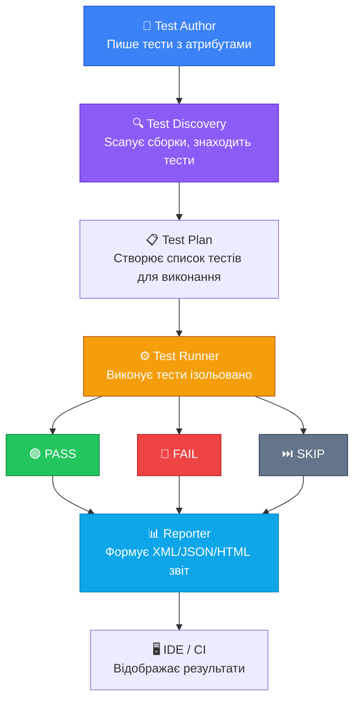

```mermaid
graph TD
    subgraph "Тестовий фреймворк"
        FW["xUnit / NUnit / MSTest\nТест-runner + Discovery + Assertions"]
    end

    subgraph "Assertions"
        FA["FluentAssertions\nЧитабельні assertions"]
        SH["Shouldly\nАльтернатива FluentAssertions"]
    end

    subgraph "Тестові дані"
        AF["AutoFixture\nАвтогенерація об'єктів"]
        BF["Bogus\nRealistic fake data"]
        BL["Fixture Builder\n(власні builder'и)"]
    end

    subgraph "Мокування"
        MQ["Moq\nНайпопулярніший mock-фреймворк"]
        NS["NSubstitute\nЛаконічний синтаксис"]
        FQ["FakeItEasy\nАльтернатива"]
    end

    subgraph "Інфраструктура"
        TC["Testcontainers\nDocker для тестів"]
        WM["WireMock.Net\nHTTP mocking server"]
        RS["Respawn\nDB cleanup"]
    end

    subgraph "Якість тестів"
        CV["Coverlet\nCode Coverage"]
        SR["Stryker.NET\nMutation Testing"]
        RG["ReportGenerator\nHTML Coverage Reports"]
    end

    FW --> FA & SH
    FW --> AF & BF
    FW --> MQ & NS & FQ
    FW --> TC & WM & RS
    FW --> CV & SR

    style FW fill:#3b82f6,stroke:#1d4ed8,color:#ffffff
    style FA fill:#22c55e,stroke:#15803d,color:#ffffff
    style MQ fill:#f59e0b,stroke:#b45309,color:#ffffff
    style TC fill:#8b5cf6,stroke:#6d28d9,color:#ffffff
    style CV fill:#0ea5e9,stroke:#0284c7,color:#ffffff
```

# Тестові Фреймворки: Навіщо вони і що всередині

## Проблема без фреймворку: наївний підхід

Перш ніж розмовляти про тестові фреймворки, давайте поставимо фундаментальне питання: **чи можна взагалі тестувати без фреймворку?**

Технічно — так. Розглянемо, як це виглядало б:

```csharp
public class Calculator
{
    public int Add(int a, int b) => a + b;
    public int Divide(int a, int b) => a / b;
}

// "Тест" без фреймворку
class Program
{
    static void Main()
    {
        var calc = new Calculator();

        // Тест 1
        var result1 = calc.Add(2, 3);
        if (result1 != 5)
            Console.WriteLine($"FAIL: Add(2,3) expected 5, got {result1}");
        else
            Console.WriteLine("PASS: Add(2,3)");

        // Тест 2
        var result2 = calc.Add(-1, 1);
        if (result2 != 0)
            Console.WriteLine($"FAIL: Add(-1,1) expected 0, got {result2}");
        else
            Console.WriteLine("PASS: Add(-1,1)");

        // Тест 3: що станеться при Divide(5, 0)?
        try
        {
            var result3 = calc.Divide(5, 0);
            Console.WriteLine($"FAIL: Divide(5,0) should throw, got {result3}");
        }
        catch (DivideByZeroException)
        {
            Console.WriteLine("PASS: Divide(5,0) throws correctly");
        }
        catch (Exception ex)
        {
            Console.WriteLine($"FAIL: Divide(5,0) threw wrong exception: {ex.GetType().Name}");
        }
    }
}
```

**Запустіть це і отримаєте у консолі:**
```
PASS: Add(2,3)
PASS: Add(-1,1)
PASS: Divide(5,0) throws correctly
```

На перший погляд — працює. Але щойно проєкт зростає, виявляються фундаментальні проблеми цього підходу.

---

## Проблема 1: Відсутність Test Discovery (Виявлення тестів)

У ручному підході розробник сам пише `Main()` і вручну викликає кожен тест. Забув додати виклик — тест не виконується. Ніхто не знає про пропущений тест.

При 500 тестах ця проблема стає катастрофою: хтось додає тест, але забуває зареєструвати його у `Main()`. Система вважає, що всі тести проходять — але частина з них ніколи не запускається.

**Що робить фреймворк:** автоматично **знаходить** усі методи з тестовими атрибутами у всіх сборках і запускає їх без будь-якої ручної реєстрації.

---

## Проблема 2: Відсутність Ізоляції (Isolation)

У нашому `Main()` всі тести виконуються у одному і тому ж просторі та стані. Якщо Тест A створює якийсь singleton або модифікує глобальний стан — Тест B вже виконується в "забрудненому" середовищі.

Крім того: якщо Тест A кидає необроблений exception — `Main()` зупиняється і жоден наступний тест не виконується. Один провал блокує всі інші.

**Що робить фреймворк:** ізолює кожен тест — якщо один падає, інші продовжують виконуватись. Кожен тест отримує свіжий контекст.

---

## Проблема 3: Немає Звітності (Reporting)

Консольний вивід `"PASS: Add(2,3)"` читається добре при 5 тестах. При 1000 — неможливо. Немає підрахунку, немає фільтрації, немає групування по класах, немає деталей провалу (стек трейс, diff між expected та actual).

У CI/CD потрібен структурований XML/JSON звіт, що може бути проаналізований системами як GitHub Actions, Jenkins або Azure DevOps.

**Що робить фреймворк:** генерує структуровані звіти у форматах TRX, JUnit XML, NUnit XML. Показує детальний diff при провалі, групування по класах, час виконання, skipped тести.

---

## Проблема 4: Немає Assertion Library (Бібліотеки стверджень)

Ручна перевірка `if (result != 5) Console.WriteLine("FAIL")` дає дуже бідний feedback. Порівняйте з тим, що видає фреймворк при провалі:

```
Expected: 5
But was:  4
  at MyTests.CalculatorTests.Add_TwoPlusTwo_ReturnsFour()
     in C:\project\Tests\CalculatorTests.cs:line 15
```

А якщо порівнюєте складні об'єкти — без assertion library ви не знаєте, яке САМЕ поле відрізняється.

**Що робить фреймворк:** надає багатий набір assertion методів з інформативними повідомленнями про відмінності.

---

## Проблема 5: Немає Параметризації (Parameterization)

Для перевірки функції з 20 різними вхідними значеннями — у ручному підході 20 копій одного і того ж коду. Зміна логіки — 20 правок.

**Що робить фреймворк:** `[Theory]` + `[InlineData]` — один метод, одна логіка, N наборів даних.

---

## Проблема 6: Немає Setup/Teardown (Підготовки та очистки)

Якщо кожен тест потребує бази даних або файлу — у ручному підході ми або створюємо їх у кожному тесті (дублювання), або один раз (shared state, порушення ізоляції).

**Що робить фреймворк:** lifecycle hooks для ініціалізації та очистки ресурсів на рівні тесту, класу або сборки.

---

## Анатомія тестового фреймворку

Тестовий фреймворк — це набір підсистем, що разом вирішують усі 6 проблем, описаних вище.

::mermaid



::

### Підсистема 1: Test Discovery (Виявлення тестів)

Test Discovery — це процес сканування скомпільованих сборок (.dll файлів) для знаходження тестів. Механізм базується на **рефлексії (Reflection)**: фреймворк перебирає всі типи і методи у сборці, шукаючи ті, що помічені відповідними атрибутами.

```csharp
// Спрощена демонстрація того, що робить Test Discovery
var assembly = Assembly.LoadFrom("MyProject.Tests.dll");

foreach (var type in assembly.GetTypes())
{
    foreach (var method in type.GetMethods())
    {
        // xUnit шукає [Fact] та [Theory]
        if (method.GetCustomAttribute<FactAttribute>() != null ||
            method.GetCustomAttribute<TheoryAttribute>() != null)
        {
            // Знайдено тест — додати до плану виконання
            testPlan.Add(new TestCase(type, method));
        }
    }
}
```

Саме тому тести мають бути `public` — рефлексія не бачить `private` методи за замовчуванням.

### Підсистема 2: Test Runner (Виконавець тестів)

Test Runner виконує кожен тест **ізольовано**:

1. Створює новий екземпляр тест-класу (залежно від фреймворку — раз на клас або раз на тест)
2. Виконує Setup (якщо є)
3. Виконує тестовий метод, перехоплюючи будь-які exceptions
4. Виконує Teardown (якщо є)
5. Фіксує результат: Pass / Fail / Skip

Перехоплення exceptions критично: якщо тест кидає `Assert.Equal` failure (яке є exception для AssertionException), Runner фіксує Fail і продовжує з наступним тестом. Додаток не падає.

### Підсистема 3: Assertion Engine (Двигун стверджень)

Assertion library — це набір статичних методів, що порівнюють actual і expected значення та формують зрозумілі повідомлення при невідповідності.

```csharp
// Внутрішня логіка Assert.Equal
public static void Equal<T>(T expected, T actual)
{
    if (!EqualityComparer<T>.Default.Equals(expected, actual))
    {
        throw new EqualException(
            $"Expected: {FormatValue(expected)}\n" +
            $"Actual:   {FormatValue(actual)}"
        );
    }
}
```

При порівнянні складних об'єктів (без FluentAssertions) стандартна бібліотека покаже лише "not equal" — без деталей. FluentAssertions виконує **deep comparison** і показує, яке конкретне поле/індекс відрізняється.

### Підсистема 4: Reporter (Звітувальник)

Reporter приймає результати виконання і форматує їх:
- **Консоль**: кольоровий вивід ✅/❌ для розробника
- **TRX**: XML формат для Visual Studio та Azure DevOps
- **JUnit XML**: XML формат для Jenkins, GitHub Actions
- **HTML**: людино-читаний звіт з деталями

```bash
# Генерація TRX звіту
dotnet test --logger "trx;LogFileName=results.trx"

# JUnit XML для GitHub Actions
dotnet test --logger "junit;LogFileName=results.xml"

# Стандартний console output
dotnet test --logger "console;verbosity=detailed"
```

---

## Три великих фреймворки в .NET

### Коротка Історія

**NUnit** — найстаріший із трьох, портований з Java (JUnit) на початку 2000-х. Довгий час був стандартом де-факто для .NET тестування. Багатий API, великий community, велика кількість legacy проєктів.

**MSTest** — Microsoft TestFramework, вбудований у Visual Studio з 2005 року. Спочатку повільний і обмежений, суттєво покращений у версії v2 (MSTest.TestFramework). Зараз значно краще, але зберігає деякі архітектурні рішення з минулого.

**xUnit** — найновіший, створений Джеймсом Ньюкірком (James Newkirk) — одним з оригінальних авторів NUnit. xUnit спроектований на основі уроків NUnit і MSTest, з метою виправити їхні архітектурні недоліки. Офіційно обраний Microsoft для тестування .NET Core та .NET 5+.

---

### Детальне порівняння

#### Lifecycle ізоляції: фундаментальна відмінність

Це найважливіша архітектурна відмінність між xUnit та іншими фреймворками.

**NUnit і MSTest:** один екземпляр тест-класу **для всіх тестів** у класі. Тести можуть "бачити" state, що залишився від попереднього тесту.

```csharp
// NUnit / MSTest: ОДИН об'єкт для ВСІХ тестів
[TestFixture] // NUnit
public class OrderServiceTests
{
    private OrderService _service; // Shared між тестами!

    [SetUp]
    public void SetUp()
    {
        _service = new OrderService(); // Викликається перед КОЖНИМ тестом
    }

    [Test]
    public void Test1() { /* використовує _service */ }

    [Test]
    public void Test2() { /* використовує той самий _service */ }
}
```

**xUnit:** **новий екземпляр тест-класу** для кожного тесту. Ізоляція гарантована на рівні архітектури.

```csharp
// xUnit: НОВИЙ об'єкт для КОЖНОГО тесту
public class OrderServiceTests
{
    private readonly OrderService _service;

    // Конструктор = SetUp, викликається перед КОЖНИМ тестом
    public OrderServiceTests()
    {
        _service = new OrderService();
    }

    [Fact]
    public void Test1() { /* отримує свій власний _service */ }

    [Fact]
    public void Test2() { /* отримує НОВИЙ _service, незалежний від Test1 */ }
}
```

Чому xUnit так робить? Щоб **унеможливити** shared state між тестами на архітектурному рівні — навіть якщо розробник хоче його створити. Це запобігає цілому класу "order-dependent" тестів, де тест B залежить від стану, що залишив тест A.

#### Атрибути: синтаксичні відмінності

| Концепція | xUnit | NUnit | MSTest |
|-----------|-------|-------|--------|
| Простий тест | `[Fact]` | `[Test]` | `[TestMethod]` |
| Параметризований тест | `[Theory]` | `[TestCase]` | `[DataRow]` |
| Тест-клас | *(звичайний клас)* | `[TestFixture]` | `[TestClass]` |
| Setup перед тестом | Конструктор | `[SetUp]` | `[TestInitialize]` |
| Teardown після тесту | `IDisposable` | `[TearDown]` | `[TestCleanup]` |
| Setup для всього класу | `IClassFixture<T>` | `[OneTimeSetUp]` | `[ClassInitialize]` |
| Пропуск тесту | `[Fact(Skip="reason")]` | `[Ignore("reason")]` | `[Ignore]` |
| Async тест | `async Task` | `async Task` | `async Task` |

#### Паралелізм: ще одна архітектурна відмінність

**xUnit:** виконує тести паралельно **між тест-класами** за замовчуванням (з'явилось у xUnit 2). Це значно прискорює виконання великих наборів тестів.

**NUnit:** паралелізм є, але потребує явного налаштування через `[Parallelizable]`.

**MSTest:** обмежений паралелізм порівняно з xUnit.

```csharp
// xUnit: контроль паралелізму
// Вимкнути паралелізм для всієї збірки:
[assembly: CollectionBehavior(DisableTestParallelization = true)]

// Об'єднати класи в колекцію (виконуються послідовно між собою):
[Collection("Integration Tests")]
public class DatabaseTests { ... }

[Collection("Integration Tests")]
public class CacheTests { ... }
```

---

### Детальніше про вибір xUnit

Microsoft обрала xUnit як офіційний фреймворк для внутрішнього тестування .NET Platform та рекомендує його у документації. Чому?

**1. Чистіша архітектура ізоляції.** Конструктор = setup, `IDisposable` = teardown — це звичайний C# без магічних атрибутів. Розробники не повинні вивчати окремі атрибути для lifecycle.

**2. Відсутність `[TestFixture]` та `[TestClass]`.** У xUnit будь-який публічний клас з методами `[Fact]`/`[Theory]` є тест-класом. Менше boilerplate коду.

**3. Strict extensibility.** xUnit спроектований для розширення. Власні атрибути, власні runner'и, custom assertion провайдери.

**4. Async-first дизайн.** xUnit підтримує `async Task` тести без додаткових пакетів.

**5. Відкрита розробка.** xUnit активно розвивається open-source спільнотою, швидко отримує нові можливості.

---

## Екосистема тестування .NET: повна картина

Тестовий фреймворк — лиш одна частина. Розглянемо повну екосистему інструментів.

::mermaid



::

### FluentAssertions: читабельні стверджень

**FluentAssertions** — бібліотека, що замінює стандартні `Assert.*` методи на fluent-синтаксис, який читається як природня мова.

```csharp
// Стандартний xUnit — читабельність страждає
Assert.Equal(expected, actual);
Assert.NotNull(result);
Assert.True(result.IsSuccess);
Assert.Contains("error", result.Errors);

// FluentAssertions — читається як специфікація
result.Should().NotBeNull();
result.IsSuccess.Should().BeTrue();
result.Value.Should().Be(expected);
result.Errors.Should().Contain("error");
result.Items.Should().HaveCount(3).And.BeInAscendingOrder();
```

**Перевага при колекціях та об'єктах:**

```csharp
// Порівняння об'єктів: FluentAssertions показує ЯКЕ поле відрізняється
var actual = new User { Name = "John", Age = 25, Email = "wrong@email.com" };
var expected = new User { Name = "John", Age = 25, Email = "correct@email.com" };

// xUnit: "Expected: User { ... }, Actual: User { ... }" — не видно де різниця
Assert.Equal(expected, actual); // ❌ Незрозуміло

// FluentAssertions: "Expected Email to be 'correct@email.com' but found 'wrong@email.com'"
actual.Should().BeEquivalentTo(expected); // ✅ Точно вказує на Email
```

**Перевірка exceptions:**

```csharp
// Стандартний xUnit
var ex = Assert.Throws<InvalidOperationException>(() => service.DoSomething());
Assert.Equal("Expected message", ex.Message);

// FluentAssertions — одна зрозуміла конструкція
Action act = () => service.DoSomething();
act.Should()
   .Throw<InvalidOperationException>()
   .WithMessage("Expected message")
   .And.HaveInnerExceptionOfType<ArgumentException>();

// Для async
Func<Task> asyncAct = async () => await service.DoSomethingAsync();
await asyncAct.Should().ThrowAsync<InvalidOperationException>();
```

**Встановлення:**

```bash
dotnet add package FluentAssertions
```

```xml
<!-- або у .csproj -->
<PackageReference Include="FluentAssertions" Version="6.*" />
```

---

### AutoFixture: автоматична генерація тестових даних

**AutoFixture** вирішує проблему "annoying setup": навіщо вручну заповнювати DTO з 20 полів, якщо вам важливо лише одне?

```csharp
// Без AutoFixture: потрібно заповнити всі поля вручну
var dto = new CreateOrderDto
{
    CustomerId = Guid.NewGuid(),
    Items = new List<OrderItemDto>
    {
        new OrderItemDto { ProductId = Guid.NewGuid(), Quantity = 1, Price = 10m }
    },
    ShippingAddress = new AddressDto
    {
        Street = "Test Street",
        City = "Kyiv",
        Country = "UA",
        PostalCode = "01001"
    },
    PaymentMethod = "card",
    // ... ще 10 полів
};
// Для тесту важливо лише CustomerId, решта — "dummy data"

// З AutoFixture: генерує всі поля автоматично
var fixture = new Fixture();
var dto = fixture.Create<CreateOrderDto>();

// Змінюємо лише те, що важливо для конкретного тесту
dto.CustomerId = specificCustomerId;
```

**AutoData атрибут для xUnit:**

```csharp
using AutoFixture.Xunit2;

public class OrderServiceTests
{
    // AutoFixture генерує dto автоматично!
    [Theory, AutoData]
    public void CreateOrder_WithValidData_ReturnsSuccess(CreateOrderDto dto)
    {
        var result = _service.CreateOrder(dto);
        result.IsSuccess.Should().BeTrue();
    }

    // Customizing + AutoData разом
    [Theory, AutoData]
    public void CreateOrder_WithNegativeAmount_ThrowsException(
        [Frozen] IOrderRepository mockRepo,
        CreateOrderDto dto,
        OrderService sut)  // AutoFixture будує весь граф залежностей!
    {
        dto.Amount = -100; // змінюємо лише важливе поле
        Action act = () => sut.CreateOrder(dto);
        act.Should().Throw<ValidationException>();
    }
}
```

---

### Bogus: реалістичні тестові дані

**Bogus** (портована з JavaScript Faker.js) генерує реалістичні тестові дані: справжні імена, адреси, Email, номери телефонів, IBAN тощо.

```csharp
using Bogus;

// Fluent builder для генерації User
var faker = new Faker<User>()
    .RuleFor(u => u.FirstName, f => f.Name.FirstName())
    .RuleFor(u => u.LastName, f => f.Name.LastName())
    .RuleFor(u => u.Email, (f, u) => f.Internet.Email(u.FirstName, u.LastName))
    .RuleFor(u => u.Phone, f => f.Phone.PhoneNumber("+380 ## ### ####"))
    .RuleFor(u => u.BirthDate, f => f.Date.Past(50, DateTime.Now.AddYears(-18)))
    .RuleFor(u => u.City, f => f.Address.City());

// Генерація одного об'єкта
var user = faker.Generate();

// Генерація 100 об'єктів для bulk тестів
var users = faker.Generate(100);

Console.WriteLine(user.Email); // "john.doe@example.com" — реалістичний email
Console.WriteLine(user.Phone); // "+380 50 123 4567" — реалістичний номер
```

Богатий набір локалів (uk, en, de тощо) та провайдерів: `Commerce` (ціни, назви товарів), `Finance` (IBAN, Bitcoin), `Internet` (IPv4/IPv6, URL), `Lorem` (текст).

---

### Встановлення та базове налаштування проєкту тестів

```bash
# Створення тестового проєкту
dotnet new xunit -n MyProject.Tests

# Додавання посилання на основний проєкт
dotnet add MyProject.Tests reference MyProject

# Необхідні пакети
dotnet add MyProject.Tests package FluentAssertions
dotnet add MyProject.Tests package Moq
dotnet add MyProject.Tests package AutoFixture
dotnet add MyProject.Tests package AutoFixture.Xunit2
dotnet add MyProject.Tests package Bogus
dotnet add MyProject.Tests package Microsoft.NET.Test.Sdk
```

**Типовий `.csproj` тестового проєкту:**

```xml
<Project Sdk="Microsoft.NET.Sdk">

  <PropertyGroup>
    <TargetFramework>net9.0</TargetFramework>
    <ImplicitUsings>enable</ImplicitUsings>
    <Nullable>enable</Nullable>
    <IsPackable>false</IsPackable>
    <!-- Не виводити предостереження про тестовий проєкт -->
    <IsTestProject>true</IsTestProject>
  </PropertyGroup>

  <ItemGroup>
    <!-- Основні пакети тестового фреймворку -->
    <PackageReference Include="Microsoft.NET.Test.Sdk" Version="17.*" />
    <PackageReference Include="xunit" Version="2.*" />
    <PackageReference Include="xunit.runner.visualstudio" Version="2.*" />

    <!-- Assertions -->
    <PackageReference Include="FluentAssertions" Version="6.*" />

    <!-- Mocking -->
    <PackageReference Include="Moq" Version="4.*" />

    <!-- Test data generation -->
    <PackageReference Include="AutoFixture" Version="4.*" />
    <PackageReference Include="AutoFixture.Xunit2" Version="4.*" />
    <PackageReference Include="Bogus" Version="34.*" />

    <!-- Coverage -->
    <PackageReference Include="coverlet.collector" Version="6.*" />
  </ItemGroup>

  <ItemGroup>
    <!-- Посилання на основний проєкт -->
    <ProjectReference Include="..\MyProject\MyProject.csproj" />
  </ItemGroup>

</Project>
```

---

## Запуск тестів: CLI команди

```bash
# Запустити всі тести
dotnet test

# З детальним виводом
dotnet test --verbosity normal

# Запустити конкретний тест-клас
dotnet test --filter "FullyQualifiedName~OrderServiceTests"

# Запустити тест за назвою методу
dotnet test --filter "DisplayName~CreateOrder_WithValidData"

# Запустити тести з певним trait/category
dotnet test --filter "Category=Unit"
dotnet test --filter "Category!=Integration"

# Паралельне виконання (xUnit виконує паралельно за замовчуванням)
# Щоб вимкнути: --configuration option
dotnet test -- xunit.parallelizeAssembly=false

# З coverage
dotnet test --collect:"XPlat Code Coverage"

# З конкретним логером
dotnet test --logger "trx;LogFileName=TestResults.trx"
dotnet test --logger "console;verbosity=detailed"

# Що --no-build корисно в CI
dotnet build
dotnet test --no-build
```

---

## Структура каталогів тестового проєкту

Ефективна організація файлів тестового проєкту важлива для довгострокової підтримуваності.

::code-tree

```plaintext [Solution Structure]
MyProject.sln
├── src/
│   └── MyProject/
│       ├── MyProject.csproj
│       ├── Domain/
│       │   ├── Entities/
│       │   └── Services/
│       ├── Application/
│       │   └── Services/
│       └── Infrastructure/
│           └── Repositories/
└── tests/
    └── MyProject.Tests/
        ├── MyProject.Tests.csproj
        ├── Unit/
        │   ├── Domain/
        │   │   ├── Entities/
        │   │   │   └── OrderTests.cs
        │   │   └── Services/
        │   │       └── DiscountCalculatorTests.cs
        │   └── Application/
        │       └── Services/
        │           └── OrderServiceTests.cs
        ├── Integration/
        │   ├── Repositories/
        │   │   └── OrderRepositoryTests.cs
        │   └── Api/
        │       └── OrderEndpointsTests.cs
        └── Shared/
            ├── Builders/
            │   ├── OrderBuilder.cs
            │   └── UserBuilder.cs
            └── Fixtures/
                └── DatabaseFixture.cs
```

::

**Ключові принципи структури:**

1. **Дзеркальна структура:** тестовий проєкт дзеркалить структуру основного. `Domain/Services/OrderService.cs` → `Unit/Domain/Services/OrderServiceTests.cs`

2. **Розділення Unit/Integration:** окремі директорії для різних рівнів тестів. Можна фільтрувати при запуску: `dotnet test --filter "Unit"`

3. **Shared утиліти:** спільний код (builders, fixtures, helpers) у директорії `Shared/`

---

## Іменування тест-файлів та класів

Конвенція, прийнята у більшості .NET проєктів:

```csharp
// Назва файлу: {ClassName}Tests.cs
// OrderServiceTests.cs

// Назва класу: {ClassName}Tests
public class OrderServiceTests
{
    // Один тест-клас = один production клас
    // Виключення: складний клас може мати кілька тест-класів
    // OrderServiceCreateTests.cs, OrderServiceUpdateTests.cs
}

// Для nested classes (угрупування за методами):
public class OrderServiceTests
{
    public class CreateOrder
    {
        [Fact]
        public void WithValidData_ReturnsSuccess() { }

        [Fact]
        public void WithNullDto_ThrowsArgumentNull() { }
    }

    public class UpdateOrder
    {
        [Fact]
        public void WithNonExistentId_ReturnsNotFound() { }
    }
}
```

---

## Global Usings для тестового проєкту

У .NET 6+ рекомендується використовувати Global Usings, щоб уникнути повторення однакових `using` у кожному файлі:

```csharp
// GlobalUsings.cs у тестовому проєкті
global using Xunit;
global using FluentAssertions;
global using Moq;
global using AutoFixture;
global using AutoFixture.Xunit2;
global using System.Net;
global using Microsoft.Extensions.Logging.Abstractions;
```

---

## Чому не писати тести в тому ж проєкті

Питання, що виникає: навіщо окремий проєкт? Чому не додати тести прямо до основного?

**Причини окремого проєкту:**

1. **Production deployment:** тестовий код не потрапляє у production збірку. Тести, тестові дані та мок-реалізації не мають бути у production executable.

2. **Залежності:** тестовий проєкт може мати залежності (Moq, Bogus), що не потрібні у production.

3. **Build time:** тести компілюються окремо від основного коду. У CI/CD можна збирати та запускати тести паралельно.

4. **Доступ до `internal`:** тестовий проєкт може отримати доступ до `internal` членів через `InternalsVisibleTo`.

```xml
<!-- В основному .csproj -->
<ItemGroup>
  <InternalsVisibleTo Include="MyProject.Tests" />
</ItemGroup>
```

---

## Практичні завдання

::card-group

::card{title="Рівень 1: Основи" icon="i-lucide-brain"}

**Завдання 1.1 — Створення тестового проєкту**

Створіть новий Solution з двома проєктами: `Calculator` (class library) та `Calculator.Tests` (xUnit). Реалізуйте клас `Calculator` з методами `Add`, `Subtract`, `Multiply`, `Divide`. Напишіть по 5 тестів для кожного методу (happy path + failure + boundary). Використовуйте FluentAssertions замість стандартного `Assert`.

**Завдання 1.2 — Порівняння фреймворків**

Для тих самих тестів Calculator напишіть еквівалентну версію у NUnit синтаксисі та MSTest синтаксисі. Порівняйте: як відрізняється Setup, як різниться стиль assertions, як відрізняється параметризація Theory.

**Завдання 1.3 — AutoFixture та Bogus**

Дано клас `UserRegistration` з полями `FirstName`, `LastName`, `Email`, `Phone`, `BirthDate`, `Address`. Напишіть 10 тестів для `UserRegistrationService.Register(UserRegistration dto)`, використовуючи Bogus для генерації реалістичних тестових даних. Для тестів на помилки — явно виставляйте лише неправильне поле.

::

::card{title="Рівень 2: Структура та організація" icon="i-lucide-bar-chart"}

**Завдання 2.1 — Організація великого тест-проєкту**

Маєте e-commerce додаток з класами: `ProductService`, `OrderService`, `CartService`, `PaymentService`, `NotificationService`, `UserService`. Спроектуйте структуру директорій тестового проєкту (Unit + Integration), включаючи `Shared/Builders` для кожного domainмодуля. Не реалізовуйте тести — лише структуру та `[Fact]`-заглушки.

**Завдання 2.2 — Global Usings та налаштування**

Налаштуйте тестовий проєкт із повним набором `GlobalUsings.cs`, `.editorconfig` для конвенцій іменування тестів, та `xunit.runner.json` з налаштуваннями паралелізму. Поясніть кожен параметр.

::

::card{title="Рівень 3: Розуміння під капотом" icon="i-lucide-rocket"}

**Завдання 3.1 — Власний Mini Test Runner**

Реалізуйте спрощений тест-runner, що виконує наступні кроки:
1. Сканує передані сборки через Reflection
2. Знаходить методи з кастомним атрибутом `[MyTest]`
3. Виконує кожен тест ізольовано (новий екземпляр класу)
4. Перехоплює exceptions як failure
5. Виводить Pass/Fail зі статистикою

Це дасть вам глибоке розуміння того, як насправді працює xUnit зсередини.

**Завдання 3.2 — Performance тестів**

Виміряйте час виконання 1000 unit тестів з різними підходами до setup:
- (а) Shared instance (статичне поле)
- (б) Новий instance у конструкторі (xUnit default)
- (в) `IClassFixture<T>` з дорогим ресурсом

Зробіть висновок: коли який підхід виправданий з точки зору швидкості та ізоляції?

::

::

---

## Підсумок

::note
**Ключові думки цієї статті:**

- **Без фреймворку** тестування страждає від 6 фундаментальних проблем: немає Discovery, ізоляції, звітності, assertion library, параметризації, lifecycle hooks.

- **Анатомія фреймворку**: Test Discovery (Reflection) → Test Runner (ізольоване виконання) → Assertion Engine → Reporter (TRX/JUnit/HTML).

- **xUnit vs NUnit vs MSTest**: xUnit — новий екземпляр на кожен тест (сильна ізоляція), конструктор замість `[SetUp]`, паралелізм за замовчуванням. Офіційний вибір Microsoft.

- **FluentAssertions**: `result.Should().Be(expected)` — значно читабельніше, особливо для об'єктів та колекцій.

- **AutoFixture**: автоматична генерація тестових даних для уникнення "annoying setup".

- **Bogus**: реалістичні fake дані (імена, email, телефони, адреси).

- **Структура проєкту**: `tests/Unit/` + `tests/Integration/` + `Shared/Builders/` — дзеркальна структура відносно основного проєкту.

- **CLI**: `dotnet test`, фільтри через `--filter`, coverage через `--collect:"XPlat Code Coverage"`.
::

Наступний крок — глибоке вивчення самого xUnit: атрибути, параметризація, fixtures, паралелізм. [xUnit: Факти, Теорії та Основи](/csharp/aspnet/testing/xunit-basics).
