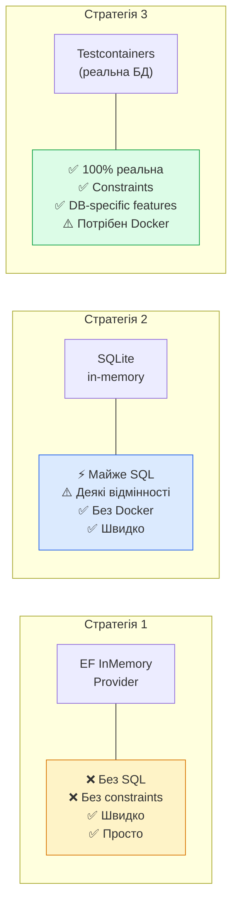

# Тестування Баз Даних: EF Core, SQLite та Testcontainers

## Чому тестування БД — це окрема тема

Коли розробники вперше стикаються з необхідністю протестувати код, що взаємодіє з базою даних, найочевидніше рішення — замокати `IRepository`. І це правильно для unit тестів! Але цього замало.

Розглянемо конкретну ситуацію:

```csharp
public class OrderRepository : IOrderRepository
{
    private readonly AppDbContext _db;

    public OrderRepository(AppDbContext db) => _db = db;

    public async Task<IEnumerable<Order>> GetActiveOrdersWithItemsAsync(Guid customerId)
    {
        return await _db.Orders
            .Where(o => o.CustomerId == customerId && o.Status == OrderStatus.Active)
            .Include(o => o.Items)
            .ThenInclude(i => i.Product)
            .OrderByDescending(o => o.CreatedAt)
            .Take(50)
            .ToListAsync();
    }
}
```

Цей код можна замокати у unit тесті:

```csharp
mockRepo.Setup(x => x.GetActiveOrdersWithItemsAsync(customerId))
    .ReturnsAsync(testOrders);
```

Але що ми **не перевіряємо** при мокуванні:
- Чи правильно EF Core будує SQL-запит?
- Чи правильно відпрацьовує `Include + ThenInclude`?
- Чи спрацюють database-level constraints — наприклад, `UNIQUE`, `NOT NULL`, `CHECK`?
- Чи правильно налаштований маппінг у `OnModelCreating`?
- Чи є проблеми з `N+1 queries`?
- Чи правильно обробляється nullable у PostgreSQL vs SQLite?

Для відповіді на ці питання потрібні **repository тести** — тести, що перевіряють реальну взаємодію з базою даних.

---

## Три стратегії: огляд та порівняння

::mermaid



::

| | EF InMemory | SQLite in-memory | Testcontainers |
|---|---|---|---|
| **Швидкість** | 🚀 Дуже швидко | ⚡ Швидко | 🐌 Повільніше (Docker) |
| **Реалістичність** | ❌ Низька | ⚠️ Середня | ✅ Висока |
| **Constraints** | ❌ Немає | ✅ Basic | ✅ Повні |
| **JSON columns** | ❌ Немає | ❌ Немає | ✅ JSONB |
| **DB-specific SQL** | ❌ Немає | ❌ Немає | ✅ Повна |
| **Потребує Docker** | ❌ | ❌ | ✅ |
| **Підходить для** | Unit тести EF моделей | Integration тести без Docker | Повні integration тести |

---

## Стратегія 1: EF Core InMemory Provider

### Що це і як працює

EF Core InMemory — це спеціальний провайдер, що зберігає дані у пам'яті у вигляді словника C# об'єктів. Він **не генерує SQL** — дані зберігаються як `List<TEntity>`.

### Встановлення

::terminal-preview{title="dotnet add package" :cursor="false"}
<div class="line"><span class="opacity-40">$</span> <strong>dotnet add package Microsoft.EntityFrameworkCore.InMemory</strong></div>
<div class="line"><span class="text-green-400 font-bold">✓</span> Successfully added Microsoft.EntityFrameworkCore.InMemory to MyApp.Tests.csproj</div>
::

### Базове налаштування

```csharp
// AppDbContext.cs
public class AppDbContext : DbContext
{
    public AppDbContext(DbContextOptions<AppDbContext> options) : base(options) { }

    public DbSet<Order> Orders => Set<Order>();
    public DbSet<OrderItem> OrderItems => Set<OrderItem>();
    public DbSet<Customer> Customers => Set<Customer>();

    protected override void OnModelCreating(ModelBuilder modelBuilder)
    {
        modelBuilder.Entity<Order>(entity =>
        {
            entity.HasKey(o => o.Id);
            entity.Property(o => o.Status).IsRequired();
            entity.HasMany(o => o.Items)
                  .WithOne(i => i.Order)
                  .HasForeignKey(i => i.OrderId);
        });
    }
}
```

```csharp
// Хелпер для створення InMemory контексту у тестах
public static class DbContextFactory
{
    public static AppDbContext CreateInMemory(string? dbName = null)
    {
        var options = new DbContextOptionsBuilder<AppDbContext>()
            .UseInMemoryDatabase(dbName ?? Guid.NewGuid().ToString())
            .Options;

        return new AppDbContext(options);
    }
}
```

### Написання тестів з InMemory

```csharp
public class OrderRepositoryInMemoryTests
{
    private readonly AppDbContext _db;
    private readonly OrderRepository _sut;

    public OrderRepositoryInMemoryTests()
    {
        // Унікальна назва БД для кожного тест-класу = ізоляція
        _db = DbContextFactory.CreateInMemory($"TestDb_{Guid.NewGuid()}");
        _sut = new OrderRepository(_db);
    }

    [Fact]
    public async Task GetActiveOrders_ReturnsOnlyActiveForCustomer()
    {
        // Arrange: seed тестових даних
        var customerId = Guid.NewGuid();
        var otherCustomerId = Guid.NewGuid();

        _db.Orders.AddRange(
            new Order { Id = Guid.NewGuid(), CustomerId = customerId, Status = OrderStatus.Active },
            new Order { Id = Guid.NewGuid(), CustomerId = customerId, Status = OrderStatus.Completed }, // інший статус
            new Order { Id = Guid.NewGuid(), CustomerId = otherCustomerId, Status = OrderStatus.Active } // інший клієнт
        );
        await _db.SaveChangesAsync();

        // Act
        var result = await _sut.GetActiveOrdersAsync(customerId);

        // Assert
        result.Should().HaveCount(1);
        result.First().CustomerId.Should().Be(customerId);
        result.First().Status.Should().Be(OrderStatus.Active);
    }

    [Fact]
    public async Task CreateOrder_PersistsAllFields()
    {
        // Arrange
        var order = new Order
        {
            Id = Guid.NewGuid(),
            CustomerId = Guid.NewGuid(),
            Status = OrderStatus.Pending,
            TotalAmount = 1500.50m,
            CreatedAt = DateTime.UtcNow,
            Notes = "Термінова доставка"
        };

        // Act
        await _sut.CreateAsync(order);

        // Assert: перевіряємо через окремий context (уникаємо кешування)
        await using var verificationDb = DbContextFactory.CreateInMemory(_db.Database.GetConnectionString()!);
        // Знову — InMemory: немає рядка підключення, тому беремо дані напряму
        var saved = await _db.Orders.FindAsync(order.Id);
        saved.Should().NotBeNull();
        saved!.TotalAmount.Should().Be(1500.50m);
        saved.Notes.Should().Be("Термінова доставка");
    }

    [Fact]
    public async Task UpdateOrder_ChangesStatus()
    {
        // Arrange
        var order = new Order { Id = Guid.NewGuid(), Status = OrderStatus.Pending };
        _db.Orders.Add(order);
        await _db.SaveChangesAsync();

        // Act
        order.Status = OrderStatus.Confirmed;
        await _sut.UpdateAsync(order);

        // Assert
        var updated = await _db.Orders.FindAsync(order.Id);
        updated!.Status.Should().Be(OrderStatus.Confirmed);
    }
}
```

### Обмеження InMemory Provider

**1. Немає database constraints:**

```csharp
// ❌ InMemory ігнорує UniqueIndex!
modelBuilder.Entity<Customer>()
    .HasIndex(c => c.Email)
    .IsUnique();

// Цей тест ПРОЙДЕ з InMemory, хоча мав би впасти
[Fact]
public async Task EfInMemory_DoesNotEnforceUniqueConstraint()
{
    _db.Customers.AddRange(
        new Customer { Email = "same@email.com" },
        new Customer { Email = "same@email.com" } // дублікат!
    );
    await _db.SaveChangesAsync(); // InMemory: збереже обидва без помилки!
    // PostgreSQL: кине DbUpdateException
}
```

**2. Немає транзакцій:**

```csharp
// InMemory не підтримує реальні транзакції
await using var transaction = await _db.Database.BeginTransactionAsync();
// ... операції ...
await transaction.CommitAsync(); // No-op у InMemory
```

**3. Немає Raw SQL:**

```csharp
// Кине exception у InMemory
var results = await _db.Orders
    .FromSqlRaw("SELECT * FROM Orders WHERE EXTRACT(YEAR FROM CreatedAt) = {0}", 2026)
    .ToListAsync();
```

::note
**Коли використовувати InMemory:** для тестування логіки LINQ-запитів, навігаційних властивостей (Include), маппінгу полів. **Не підходить** для тестування constraints, транзакцій, Raw SQL або DB-specific функцій.
::

---

## Стратегія 2: SQLite in-memory

### Чому SQLite краще за InMemory

SQLite — реальна реляційна база даних. Вона:
- Генерує реальний SQL
- Підтримує `FOREIGN KEY`, `UNIQUE`, `CHECK` constraints
- Підтримує транзакції
- Підтримує багато стандартних SQL функцій

При цьому SQLite може працювати повністю в пам'яті — жодних файлів, жодного зовнішнього сервісу.

**Відмінності від PostgreSQL (важливо знати):**
- Немає `JSONB` column type (є JSON як TEXT)
- Немає `Array` columns
- Немає деяких PostgreSQL-specific функцій (`ILIKE`, `::uuid` cast тощо)
- Числові типи менш суворі
- `DateTime` зберігається як TEXT

### Встановлення

::terminal-preview{title="dotnet add package" :cursor="false"}
<div class="line"><span class="opacity-40">$</span> <strong>dotnet add package Microsoft.EntityFrameworkCore.Sqlite</strong></div>
<div class="line"><span class="text-green-400 font-bold">✓</span> Successfully added Microsoft.EntityFrameworkCore.Sqlite to MyApp.Tests.csproj</div>
::

### Правильне налаштування SQLite in-memory

```csharp
// Хелпер для SQLite в-memory контексту
public static class SqliteDbContextFactory
{
    // ВАЖЛИВО: SQLite in-memory існує лише доки відкрите підключення!
    // Якщо закрити SqliteConnection — база зникне
    public static (AppDbContext Context, SqliteConnection Connection) Create()
    {
        var connection = new SqliteConnection("Data Source=:memory:");
        connection.Open(); // Відкриваємо — і тримаємо відкритим до кінця тесту

        var options = new DbContextOptionsBuilder<AppDbContext>()
            .UseSqlite(connection)
            .EnableSensitiveDataLogging() // Для дебагу у тестах
            .Options;

        var context = new AppDbContext(options);
        context.Database.EnsureCreated(); // Створює схему з OnModelCreating

        return (context, connection);
    }
}
```

### Fixture для SQLite

```csharp
public class SqliteDatabaseFixture : IDisposable
{
    private readonly SqliteConnection _connection;
    public AppDbContext Db { get; }

    public SqliteDatabaseFixture()
    {
        _connection = new SqliteConnection("Data Source=:memory:");
        _connection.Open();

        var options = new DbContextOptionsBuilder<AppDbContext>()
            .UseSqlite(_connection)
            .Options;

        Db = new AppDbContext(options);
        Db.Database.EnsureCreated();
    }

    public void ResetData()
    {
        // Видаляємо дані, зберігаємо схему
        Db.OrderItems.RemoveRange(Db.OrderItems);
        Db.Orders.RemoveRange(Db.Orders);
        Db.Customers.RemoveRange(Db.Customers);
        Db.SaveChanges();
    }

    public void Dispose()
    {
        Db.Dispose();
        _connection.Dispose(); // Закриття підключення = знищення in-memory БД
    }
}
```

### Тести з SQLite

```csharp
public class OrderRepositorySqliteTests : IClassFixture<SqliteDatabaseFixture>
{
    private readonly SqliteDatabaseFixture _fixture;

    public OrderRepositorySqliteTests(SqliteDatabaseFixture fixture)
    {
        _fixture = fixture;
        _fixture.ResetData();
    }

    [Fact]
    public async Task CreateOrder_WithDuplicateId_ThrowsException()
    {
        // SQLite enforcement чого InMemory не робить!
        var orderId = Guid.NewGuid();
        var order1 = new Order { Id = orderId, Status = OrderStatus.Pending };
        var order2 = new Order { Id = orderId, Status = OrderStatus.Active }; // той самий PK

        _fixture.Db.Orders.Add(order1);
        await _fixture.Db.SaveChangesAsync();

        _fixture.Db.Orders.Add(order2);

        // SQLite вже кине помилку дублікату PK
        await Assert.ThrowsAsync<DbUpdateException>(
            () => _fixture.Db.SaveChangesAsync());
    }

    [Fact]
    public async Task GetOrdersWithItems_LoadsNavigationProperties()
    {
        // Arrange: замовлення з позиціями
        var order = new Order
        {
            Id = Guid.NewGuid(),
            Status = OrderStatus.Active,
            Items = new List<OrderItem>
            {
                new OrderItem { Id = Guid.NewGuid(), ProductName = "Laptop", Quantity = 1, UnitPrice = 30000m },
                new OrderItem { Id = Guid.NewGuid(), ProductName = "Mouse", Quantity = 2, UnitPrice = 500m }
            }
        };

        _fixture.Db.Orders.Add(order);
        await _fixture.Db.SaveChangesAsync();
        _fixture.Db.ChangeTracker.Clear(); // Очищаємо кеш трекера

        var repo = new OrderRepository(_fixture.Db);

        // Act: Load з Include
        var result = await repo.GetOrderWithItemsAsync(order.Id);

        // Assert: Navigation property завантажено
        result.Should().NotBeNull();
        result!.Items.Should().HaveCount(2);
        result.Items.Sum(i => i.Quantity * i.UnitPrice).Should().Be(31000m);
    }

    [Fact]
    public async Task DeleteOrder_RemovesCascadeItems()
    {
        // SQLite підтримує CASCADE DELETE (якщо налаштовано у OnModelCreating)
        var order = new Order
        {
            Id = Guid.NewGuid(),
            Items = new List<OrderItem>
            {
                new OrderItem { Id = Guid.NewGuid(), ProductName = "Test" }
            }
        };

        _fixture.Db.Orders.Add(order);
        await _fixture.Db.SaveChangesAsync();
        _fixture.Db.ChangeTracker.Clear();

        // Act
        var repo = new OrderRepository(_fixture.Db);
        await repo.DeleteAsync(order.Id);

        // Assert: Каскадно видалені items
        var remainingItems = await _fixture.Db.OrderItems.CountAsync();
        remainingItems.Should().Be(0);
    }

    [Fact]
    public async Task Transaction_Rollback_DoesNotPersistData()
    {
        // SQLite підтримує транзакції!
        using var transaction = await _fixture.Db.Database.BeginTransactionAsync();

        _fixture.Db.Orders.Add(new Order { Id = Guid.NewGuid(), Status = OrderStatus.Pending });
        await _fixture.Db.SaveChangesAsync();

        await transaction.RollbackAsync(); // Відкотити

        // Assert: даних немає після rollback
        var count = await _fixture.Db.Orders.CountAsync();
        count.Should().Be(0);
    }
}
```

### Обхід обмежень SQLite для PostgreSQL проєктів

Якщо основна БД PostgreSQL, а тести пишуться з SQLite — іноді доводиться вирішувати конфлікти типів:

```csharp
// В AppDbContext: умовний маппінг залежно від провайдера
protected override void OnModelCreating(ModelBuilder modelBuilder)
{
    modelBuilder.Entity<Order>(entity =>
    {
        // PostgreSQL: зберігаємо як jsonb; SQLite: зберігаємо як TEXT
        if (Database.IsNpgsql())
        {
            entity.Property(o => o.Metadata).HasColumnType("jsonb");
        }
        else
        {
            entity.Property(o => o.Metadata).HasColumnType("TEXT");
        }

        // UUID primary keys — SQLite використовує TEXT
        entity.Property(o => o.Id)
              .HasConversion(
                  id => id.ToString(),
                  str => Guid.Parse(str));
    });
}
```

---

## Стратегія 3: Testcontainers

### Концепція: реальна БД у Docker per test run

**Testcontainers** запускає справжній Docker-контейнер з PostgreSQL (або будь-якою іншою БД) безпосередньо з коду тесту. Після завершення тестів контейнер автоматично зупиняється і видаляється.

::terminal-preview{title="dotnet test (with Testcontainers)" :cursor="false"}
<div class="line"><span class="opacity-40">$</span> <strong>dotnet test</strong></div>
<div class="line"></div>
<div class="line"><span class="text-blue-400 font-bold">⚬</span> PostgreSQL Container started (port 5432 → 32768)</div>
<div class="line"><span class="text-blue-400 font-bold">⚬</span> Schema created (migrations applied)</div>
<div class="line"><span class="text-green-400 font-bold">✓</span> Tests running against REAL PostgreSQL</div>
<div class="line"><span class="text-green-400 font-bold">Passed!</span> - Failed: 0, Passed: 28, Skipped: 2</div>
<div class="line"><span class="text-blue-400 font-bold">⚬</span> Container stopped and removed</div>
::

### Встановлення

::terminal-preview{title="dotnet add package Testcontainers" :cursor="false"}
<div class="line"><span class="opacity-40">$</span> <strong>dotnet add package Testcontainers Testcontainers.PostgreSql</strong></div>
<div class="line"><span class="text-green-400 font-bold">✓</span> Successfully added Testcontainers to MyApp.Tests.csproj</div>
<div class="line"><span class="text-green-400 font-bold">✓</span> Successfully added Testcontainers.PostgreSql to MyApp.Tests.csproj</div>
<div class="line"></div>
<div class="line"><span class="opacity-40">$</span> <strong>dotnet add package Testcontainers.MsSql</strong></div>
<div class="line"><span class="text-green-400 font-bold">✓</span> Successfully added Testcontainers.MsSql to MyApp.Tests.csproj</div>
::

### Базова конфігурація

```csharp
public class PostgreSqlFixture : IAsyncLifetime
{
    private readonly PostgreSqlContainer _container;

    public string ConnectionString { get; private set; } = null!;
    public AppDbContext Db { get; private set; } = null!;

    public PostgreSqlFixture()
    {
        _container = new PostgreSqlBuilder()
            .WithImage("postgres:16-alpine")      // Легший образ Alpine
            .WithDatabase("testdb")
            .WithUsername("testuser")
            .WithPassword("testpass")
            .WithCleanUp(true)                    // Видалити контейнер після завершення
            .Build();
    }

    public async Task InitializeAsync()
    {
        // Запускаємо контейнер (займає ~5-15 секунд при першому запуску)
        await _container.StartAsync();

        ConnectionString = _container.GetConnectionString();

        var options = new DbContextOptionsBuilder<AppDbContext>()
            .UseNpgsql(ConnectionString)
            .EnableSensitiveDataLogging()
            .Options;

        Db = new AppDbContext(options);

        // Застосовуємо всі міграції або створюємо схему
        await Db.Database.MigrateAsync();
        // або: await Db.Database.EnsureCreatedAsync();
    }

    public async Task ResetDataAsync()
    {
        // Швидке очищення між тестами (швидше ніж recreate schema)
        await Db.Database.ExecuteSqlRawAsync("""
            TRUNCATE TABLE "OrderItems", "Orders", "Customers"
            RESTART IDENTITY CASCADE;
        """);
    }

    public async Task DisposeAsync()
    {
        await Db.DisposeAsync();
        await _container.DisposeAsync(); // Зупиняє і видаляє контейнер
    }
}
```

### Тести з Testcontainers і реальною PostgreSQL

```csharp
[Collection("PostgreSQL")]
public class OrderRepositoryPostgresTests : IAsyncLifetime
{
    private readonly PostgreSqlFixture _fixture;

    public OrderRepositoryPostgresTests(PostgreSqlFixture fixture)
    {
        _fixture = fixture;
    }

    public async Task InitializeAsync() => await _fixture.ResetDataAsync();
    public Task DisposeAsync() => Task.CompletedTask;

    [Fact]
    public async Task GetOrders_WithJsonbFilter_WorksCorrectly()
    {
        // Тест PostgreSQL-специфічного функціоналу: JSONB queries
        var order = new Order
        {
            Id = Guid.NewGuid(),
            Status = OrderStatus.Active,
            Metadata = """{"source": "web", "campaign": "summer2026"}"""
        };

        _fixture.Db.Orders.Add(order);
        await _fixture.Db.SaveChangesAsync();
        _fixture.Db.ChangeTracker.Clear();

        // PostgreSQL JSONB operator — не працює у SQLite або InMemory
        var result = await _fixture.Db.Orders
            .Where(o => EF.Functions.JsonContains(o.Metadata!, """{"source": "web"}"""))
            .ToListAsync();

        result.Should().HaveCount(1);
        result.First().Id.Should().Be(order.Id);
    }

    [Fact]
    public async Task UniqueEmailConstraint_EnforcedByDatabase()
    {
        // Реальний PostgreSQL UNIQUE constraint
        var customer1 = new Customer { Id = Guid.NewGuid(), Email = "test@example.com" };
        var customer2 = new Customer { Id = Guid.NewGuid(), Email = "test@example.com" }; // дублікат

        _fixture.Db.Customers.Add(customer1);
        await _fixture.Db.SaveChangesAsync();
        _fixture.Db.ChangeTracker.Clear();

        _fixture.Db.Customers.Add(customer2);

        // PostgreSQL кине реальну помилку constraint violation
        var ex = await Assert.ThrowsAsync<DbUpdateException>(
            () => _fixture.Db.SaveChangesAsync());

        ex.InnerException!.Message.Should().Contain("duplicate key");
    }

    [Fact]
    public async Task FullTextSearch_WorksWithPostgres()
    {
        // PostgreSQL full-text search — неможливо перевірити без реальної БД
        var products = new[]
        {
            new Product { Id = Guid.NewGuid(), Name = "MacBook Pro 16 inch" },
            new Product { Id = Guid.NewGuid(), Name = "Dell XPS 15" },
            new Product { Id = Guid.NewGuid(), Name = "MacBook Air M3" },
        };

        _fixture.Db.Products.AddRange(products);
        await _fixture.Db.SaveChangesAsync();
        _fixture.Db.ChangeTracker.Clear();

        // PostgreSQL full-text search через Raw SQL
        var results = await _fixture.Db.Products
            .FromSqlRaw("""
                SELECT * FROM "Products"
                WHERE to_tsvector('english', "Name") @@ plainto_tsquery('english', 'MacBook')
            """)
            .ToListAsync();

        results.Should().HaveCount(2);
        results.All(p => p.Name.Contains("MacBook")).Should().BeTrue();
    }

    [Fact]
    public async Task Transaction_WithConcurrentInserts_HandlesConcurrencyCorrectly()
    {
        // Тест конкурентного доступу — реально тільки з реальною БД
        var sharedId = Guid.NewGuid();

        var insertTasks = Enumerable.Range(0, 10)
            .Select(async i =>
            {
                await using var scope = new ServiceScope(_fixture.ConnectionString);
                var db = scope.GetDbContext();
                try
                {
                    db.Counters.Add(new Counter { SharedId = sharedId, Value = i });
                    await db.SaveChangesAsync();
                    return true;
                }
                catch (DbUpdateException)
                {
                    return false; // Constraint violation — очікувано
                }
            });

        var results = await Task.WhenAll(insertTasks);

        // Рівно один insert має успішно завершитись
        results.Count(r => r).Should().Be(1);
    }
}

// Collection definition
[CollectionDefinition("PostgreSQL")]
public class PostgreSqlCollection : ICollectionFixture<PostgreSqlFixture> { }
```

### Testcontainers з Docker Compose

Для складніших сценаріїв (PostgreSQL + Redis + RabbitMQ разом):

```csharp
public class IntegrationEnvironmentFixture : IAsyncLifetime
{
    private PostgreSqlContainer _postgres = null!;
    private RedisContainer _redis = null!;
    private RabbitMqContainer _rabbit = null!;

    public string PostgresConnectionString { get; private set; } = null!;
    public string RedisConnectionString { get; private set; } = null!;
    public string RabbitMqConnectionString { get; private set; } = null!;

    public async Task InitializeAsync()
    {
        // Запускаємо всі контейнери паралельно
        _postgres = new PostgreSqlBuilder().WithImage("postgres:16-alpine").Build();
        _redis = new RedisBuilder().WithImage("redis:7-alpine").Build();
        _rabbit = new RabbitMqBuilder().WithImage("rabbitmq:3-management-alpine").Build();

        await Task.WhenAll(
            _postgres.StartAsync(),
            _redis.StartAsync(),
            _rabbit.StartAsync()
        );

        PostgresConnectionString = _postgres.GetConnectionString();
        RedisConnectionString = _redis.GetConnectionString();
        RabbitMqConnectionString = _rabbit.GetConnectionString();
    }

    public async Task DisposeAsync()
    {
        await Task.WhenAll(
            _postgres.DisposeAsync().AsTask(),
            _redis.DisposeAsync().AsTask(),
            _rabbit.DisposeAsync().AsTask()
        );
    }
}
```

### Прискорення Testcontainers: Ryuk та Reuse

```csharp
// Reuse: перевикористати контейнер між test runs (не перестворювати)
// УВАГА: лише для локальної розробки, не для CI!
_container = new PostgreSqlBuilder()
    .WithImage("postgres:16-alpine")
    .WithReuse(true)   // Зберігає контейнер після завершення тестів
    .WithLabel("testcontainers.reuse.hash", "my-test-postgres")
    .Build();
```

::terminal-preview{title="export TESTCONTAINERS_RYUK_DISABLED=true" :cursor="false"}
<div class="line"><span class="opacity-40">$</span> <strong>export TESTCONTAINERS_RYUK_DISABLED=true</strong></div>
<div class="line"><span class="text-green-400 font-bold">✓</span> Ryuk disabled (faster local runs)</div>
<div class="line"><span class="text-yellow-400">⚠</span> Remember to keep Ryuk enabled in CI!</div>
::

---

## Вибір стратегії: практичне правило

::steps

### Визначте що ви тестуєте

Якщо тестуєте **бізнес-логіку** (сервіс, що використовує репозиторій) — мокуйте репозиторій і не потрібна реальна БД зовсім.

### Якщо тестуєте сам репозиторій (Repository tests)

Ви хочете перевірити що LINQ-запити, Include, маппінг — все правильно.

### Чи є DB-specific функціонал?

**Ні** (прості CRUD, Include) → SQLite in-memory. Достатньо, швидко, без Docker.

### Чи є PostgreSQL-specific функціонал?

**Так** (JSONB, Full-text search, Array columns, специфічні типи) → Testcontainers. Тільки реальна PostgreSQL.

### Чи важливі database constraints у тестах?

**Так** (UNIQUE, CHECK, FK cascade) → SQLite або Testcontainers. InMemory недостатньо.

### CI/CD вимоги

Немає Docker у CI? → SQLite. Docker доступний → Testcontainers для integration тестів.

::

---

## Builder Pattern для тестових даних з БД

При роботі з реальною БД потрібно зручно створювати тестові дані. Builder Pattern — стандартний підхід:

```csharp
// Builder для Order
public class OrderBuilder
{
    private readonly Order _order = new()
    {
        Id = Guid.NewGuid(),
        Status = OrderStatus.Pending,
        CreatedAt = DateTime.UtcNow,
        TotalAmount = 0m
    };

    private readonly List<OrderItem> _items = new();

    public OrderBuilder WithCustomer(Guid customerId)
    {
        _order.CustomerId = customerId;
        return this;
    }

    public OrderBuilder WithStatus(OrderStatus status)
    {
        _order.Status = status;
        return this;
    }

    public OrderBuilder WithItem(string productName, int quantity, decimal unitPrice)
    {
        _items.Add(new OrderItem
        {
            Id = Guid.NewGuid(),
            OrderId = _order.Id,
            ProductName = productName,
            Quantity = quantity,
            UnitPrice = unitPrice
        });
        _order.TotalAmount += quantity * unitPrice;
        return this;
    }

    public OrderBuilder WithTotalAmount(decimal amount)
    {
        _order.TotalAmount = amount;
        return this;
    }

    public Order Build()
    {
        _order.Items = _items;
        return _order;
    }

    // Persist до БД і повернути збережений об'єкт
    public async Task<Order> PersistAsync(AppDbContext db)
    {
        var order = Build();
        db.Orders.Add(order);
        await db.SaveChangesAsync();
        db.ChangeTracker.Clear(); // Очищаємо трекер — наступний Get буде з БД
        return order;
    }
}

// Використання у тестах
[Fact]
public async Task GetOrderSummary_CalculatesCorrectTotal()
{
    // Читабельне створення тестових даних
    var order = await new OrderBuilder()
        .WithCustomer(_testCustomerId)
        .WithStatus(OrderStatus.Active)
        .WithItem("MacBook Pro", quantity: 1, unitPrice: 80000m)
        .WithItem("Magic Mouse", quantity: 2, unitPrice: 2500m)
        .PersistAsync(_fixture.Db);

    var summary = await _repo.GetSummaryAsync(order.Id);

    summary.TotalAmount.Should().Be(85000m);
    summary.ItemCount.Should().Be(2);
}
```

---

## Respawn: ефективне очищення даних між тестами

**Respawn** — бібліотека для швидкого скидання стану БД між тестами. Вона аналізує схему і генерує оптимальний `DELETE`/`TRUNCATE` порядок з урахуванням FK залежностей.

::terminal-preview{title="dotnet add package" :cursor="false"}
<div class="line"><span class="opacity-40">$</span> <strong>dotnet add package Respawn</strong></div>
<div class="line"><span class="text-green-400 font-bold">✓</span> Successfully added Respawn to MyApp.Tests.csproj</div>
::

```csharp
public class PostgreSqlFixture : IAsyncLifetime
{
    private Respawner _respawner = null!;

    public async Task InitializeAsync()
    {
        // ... запуск контейнера ...

        // Ініціалізація Respawner ПІСЛЯ створення схеми
        await using var conn = new NpgsqlConnection(ConnectionString);
        await conn.OpenAsync();

        _respawner = await Respawner.CreateAsync(conn, new RespawnerOptions
        {
            DbAdapter = DbAdapter.Postgres,
            // Таблиці, що НЕ потрібно очищати між тестами
            TablesToIgnore = new Table[]
            {
                "__EFMigrationsHistory",
                "Countries",      // Reference data
                "Currencies"      // Reference data
            }
        });
    }

    public async Task ResetAsync()
    {
        // Швидко та правильно очищає всі таблиці
        await using var conn = new NpgsqlConnection(ConnectionString);
        await conn.OpenAsync();
        await _respawner.ResetAsync(conn);
    }
}
```

---

## Практичні завдання

::card-group

::card{title="Рівень 1: EF InMemory та SQLite" icon="i-lucide-brain"}

**Завдання 1.1 — InMemory Repository Tests**

Реалізуйте `ProductRepository` з методами: `GetAllAsync`, `GetByIdAsync`, `SearchByNameAsync`, `CreateAsync`, `UpdateAsync`, `DeleteAsync`. Напишіть 10 тестів з EF InMemory. Потім виявіть, які тести будуть давати хибно позитивний результат (InMemory не перевіряє constraints). Задокументуйте їх.

**Завдання 1.2 — SQLite Constraints**

Додайте до `ProductRepository` тести з SQLite in-memory:
- UNIQUE constraint на `Sku`
- FK cascade delete — видалення продукту видаляє `OrderItems`
- `CHECK` constraint — `Price >= 0`
- Транзакція: якщо один з двох InsertAsync кидає — обидва rollback-аються

Порівняйте результати з InMemory тестами.

::

::card{title="Рівень 2: Testcontainers" icon="i-lucide-bar-chart"}

**Завдання 2.1 — PostgreSQL Fixture**

Реалізуйте `PostgreSqlFixture : IAsyncLifetime` для PostgreSQL (або використайте інший доступний containerized database). Налаштуйте:
- Запуск контейнера один раз на колекцію
- Respawn між тестами (або `TRUNCATE ... CASCADE`)
- Паралельна ізоляція: кожен тест-клас отримує свою схему або окрему БД

Напишіть 5 тестів, що перевіряють PostgreSQL-specific функціонал (або просто constraints, якщо немає PostgreSQL).

**Завдання 2.2 — Builder Pattern**

Для вашого домену реалізуйте `OrderBuilder`, `CustomerBuilder`, `ProductBuilder` з fluent API. Кожен builder має метод `PersistAsync(DbContext)`. Напишіть 8 тестів, використовуючи builder'и замість прямого `db.Add(...)`. Порівняйте читабельність до і після.

::

::card{title="Рівень 3: Повна інфраструктура" icon="i-lucide-rocket"}

**Завдання 3.1 — Multi-database Test Suite**

Для одного і того ж набору тестів (`IOrderRepositoryTests`) реалізуйте три реалізації fixture: InMemory, SQLite, Testcontainers. Запустіть одні і ті ж тести проти всіх трьох провайдерів. Задокументуйте, які тести проходять лише у Testcontainers (реальна БД) і чому.

**Завдання 3.2 — Respawn інтеграція**

Встановіть Respawn у ваш Testcontainers fixture. Виміряйте час виконання 50 тестів:
- (а) з `Database.EnsureDeletedAsync + EnsureCreatedAsync` між тестами
- (б) з `TRUNCATE ... CASCADE` між тестами
- (в) з Respawn між тестами

Зробіть висновок щодо продуктивності кожного підходу.

::

::

---

## Підсумок

::note
**Ключові думки цієї статті:**

- **EF InMemory**: без SQL, без constraints, без транзакцій. Підходить тільки для тестування LINQ-логіки та маппінгу. Дає хибно-позитивні результати для constraint-залежного коду.

- **SQLite in-memory**: реальний SQL, базові constraints, транзакції. Підходить для більшості repository тестів без PostgreSQL-специфіки. Тримайте `SqliteConnection` відкритим весь час тесту.

- **Testcontainers**: реальна PostgreSQL у Docker. JSONB, Full-text search, UUID types, всі constraints. Повільніше через Docker startup (~10-15 секунд першого разу). Використовуйте `Reuse` для прискорення локально.

- **Очищення між тестами**: `TRUNCATE ... CASCADE` або **Respawn** — швидше ніж recreate schema. `IAsyncLifetime.InitializeAsync()` тест-класу — зручне місце для виклику reset.

- **Builder Pattern**: читабельне створення тестових даних через `new OrderBuilder().WithStatus().WithItems().PersistAsync(db)`.

- **Де мокувати, де тестувати реально**: сервіс, що використовує репозиторій → мокуйте репозиторій. Сам репозиторій → тестуйте з реальною (або майже реальною) БД.
::

Наступна стаття — [Integration Testing: WebApplicationFactory для Minimal API](/csharp/aspnet/testing/integration-testing).
