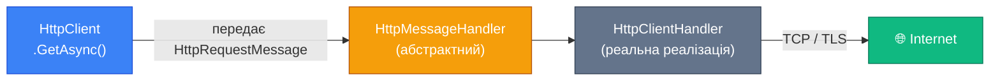
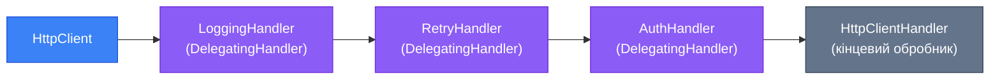

# HttpClient у Тестах Частина 1: Архітектура та MockHttpMessageHandler

Ваш сервіс відправляє запит до платіжного шлюзу Stripe. Або до поштового сервісу SendGrid. Або до корпоративної legacy-системи, яка існує з 2003 року і до якої немає тестового середовища. Як ви протестуєте цей код?

Якщо перша думка — «напишу тест, який справді відправить запит і перевірю відповідь» — зупиніться. Тест, який робить реальні HTTP-запити, має фундаментальні проблеми: він повільний, нестабільний (залежить від мережі та availability стороннього сервісу), коштуватиме вам гроші при кожному запуску CI, залишає сліди у production-системах, і не може симулювати помилки (як перевірити поведінку при 503 Service Unavailable з Stripe?).

Правильний юніт-тест для HTTP-клієнта ізолює мережевий рівень. Він змушує ваш код думати, що відправляє запит у мережу, тоді як насправді запит перехоплюється фейком, який повертає заздалегідь підготовлену відповідь. Щоб зрозуміти, як це реалізувати, потрібно спочатку розібратися з архітектурою `HttpClient` у .NET.

## Чому не можна просто замокати HttpClient

Коли починаючий розробник вперше стикається з необхідністю тестувати HTTP-код, перша інтуїція — скористатися Moq і замокати `HttpClient` напряму. Спойлер: це не вийде.

`HttpClient` — це конкретний клас, а не інтерфейс. У нього є методи `GetAsync`, `PostAsync`, `SendAsync` і так далі. Але ці методи — не `virtual`. Moq працює через успадкування та перевизначення — якщо метод не `virtual`, його не можна замокати стандартними засобами.

Є ще один підхід: обернути `HttpClient` у власний інтерфейс (наприклад, `IHttpService`) і тестувати через нього. Але це означає写 обгортку навколо і так вже утилітарного класу, додавати інтерфейс, реєструвати його у DI — дуже багато шуму заради дуже простої мети.

Правильний механізм ізоляції вбудований у сам `HttpClient` — і називається `HttpMessageHandler`.

## Архітектура HttpClient: Конвеєр Обробників

`HttpClient` — це лише тонка обгортка з зручними методами. Вся реальна робота з мережею відбувається всередині `HttpMessageHandler` — об'єкта, якому `HttpClient` делегує виконання запитів.

::mermaid



::

Конструктор `HttpClient` приймає `HttpMessageHandler` як параметр:

```csharp
// Внутрішньо HttpClient виглядає так (спрощено):
public class HttpClient : HttpMessageInvoker
{
    public HttpClient() : this(new HttpClientHandler()) { }
    
    public HttpClient(HttpMessageHandler handler) : base(handler) { }
    
    public Task<HttpResponseMessage> GetAsync(string requestUri)
    {
        // Делегує до внутрішнього handler.SendAsync(...)
        return SendAsync(new HttpRequestMessage(HttpMethod.Get, requestUri));
    }
}
```

Ключове відкриття: якщо ви передаєте власний `HttpMessageHandler` — ви повністю контролюєте те, що «повертає мережа». Ніякого реального TCP-з'єднання не відбувається.

### DelegatingHandler: Ланцюжки декораторів

Перед тим, як перейти до мокування, варто знати про ще один тип — `DelegatingHandler`. Це абстрактний клас, який обгортає інший `HttpMessageHandler`, утворюючи ланцюжок (Pipeline Pattern / Decorator Pattern):

::mermaid



::

Кожен `DelegatingHandler` може:
- Модифікувати запит до його відправки
- Передати управління далі по ланцюжку через `base.SendAsync(request, cancellationToken)`
- Перехопити та модифікувати відповідь

Власний `DelegatingHandler` виглядає так:

```csharp
public class LoggingHandler : DelegatingHandler
{
    private readonly ILogger<LoggingHandler> _logger;

    public LoggingHandler(ILogger<LoggingHandler> logger)
    {
        _logger = logger;
    }

    protected override async Task<HttpResponseMessage> SendAsync(
        HttpRequestMessage request,
        CancellationToken cancellationToken)
    {
        _logger.LogInformation("Sending {Method} to {Uri}", request.Method, request.RequestUri);
        
        var response = await base.SendAsync(request, cancellationToken); // передаємо далі
        
        _logger.LogInformation("Received {StatusCode} from {Uri}", 
            response.StatusCode, request.RequestUri);
        
        return response;
    }
}
```

## Проблема Socket Exhaustion та IHttpClientFactory

Перш ніж перейти до тестування, розберемо критично важливу архітектурну проблему, яка чекає на вас у production.

### Чому `new HttpClient()` — антипатерн

Здається природним: потрібен клієнт — створюємо його. Але `HttpClient` реалізує `IDisposable`, і більшість розробників вважають, що його треба `Dispose`-ити після кожного використання:

```csharp
// ❌ АНТИПАТЕРН — так робити не можна!
public async Task<Product> GetProductAsync(int id)
{
    using var client = new HttpClient(); // Dispose після кожного запиту
    var response = await client.GetAsync($"https://api.example.com/products/{id}");
    return await response.Content.ReadFromJsonAsync<Product>();
}
```

Це призводить до **socket exhaustion** (виснаження сокетів). Коли `HttpClient` закривається, TCP-з'єднання переходить у стан `TIME_WAIT` і залишається відкритим ще 240 секунд (за специфікацією TCP). Операційна система має обмежену кількість портів. При достатньо великому навантаженні сокети закінчуються, і нові з'єднання неможливо створити.

::warning
**Socket Exhaustion у .NET**: Ця проблема особливо підступна тим, що виявляється лише під навантаженням. У development всe працює ідеально. На production з реальним трафіком — падає через кілька годин або днів. Якщо бачите у логах `SocketException: An attempt was made to access a socket in a way forbidden by its access permissions` — це, швидше за все, socket exhaustion.
::

### Рішення: Зберігати один HttpClient — теж не рішення

Наступна інтуїція — зберігати один статичний `HttpClient` на весь час роботи програми:

```csharp
// ⚠️ КРАЩЕ, АЛЕ ТАКОЖ НЕ ПРАВИЛЬНО
public class ProductService
{
    private static readonly HttpClient _client = new HttpClient(); // Singleton
    
    public async Task<Product> GetProductAsync(int id)
    {
        return await _client.GetFromJsonAsync<Product>($"https://api.example.com/products/{id}");
    }
}
```

Це вирішує socket exhaustion, але створює нову проблему: **ігнорування DNS-змін**. `HttpClient` кешує DNS-записи на весь час свого існування. Якщо IP-адреса `api.example.com` зміниться (наприклад, при failover або деплої), ваш клієнт буде продовжувати звертатися до старої адреси.

### Правильне рішення: IHttpClientFactory

`IHttpClientFactory` — введений у .NET Core 2.1, вирішує обидві проблеми елегантно:

1. **Пулінг HttpMessageHandler**: Factory зберігає пул обробників і перевикористовує їх, уникаючи socket exhaustion.
2. **Оновлення DNS**: Обробники в пулі відживають через певний час (за замовчуванням 2 хвилини) і замінюються новими, захоплюючи оновлені DNS-записи.
3. **Управління lifecycle**: Клієнти, отримані від Factory, можна `Dispose`-ити — вони повернуть обробник у пул, а не знищать його.

Реєстрація в DI (Program.cs):

```csharp
// Named Client
builder.Services.AddHttpClient("PaymentGateway", client =>
{
    client.BaseAddress = new Uri("https://api.stripe.com/v1/");
    client.DefaultRequestHeaders.Add("Accept", "application/json");
    client.Timeout = TimeSpan.FromSeconds(30);
});

// Typed Client (більш чистий підхід)
builder.Services.AddHttpClient<StripePaymentService>(client =>
{
    client.BaseAddress = new Uri("https://api.stripe.com/v1/");
    client.Timeout = TimeSpan.FromSeconds(30);
});
```

**Typed Client** — найчистіший спосіб роботи з `IHttpClientFactory`. Ваш сервіс отримує готовий `HttpClient` через DI:

```csharp
public class StripePaymentService
{
    private readonly HttpClient _httpClient;

    // HttpClient інжектується DI контейнером через IHttpClientFactory
    public StripePaymentService(HttpClient httpClient)
    {
        _httpClient = httpClient;
    }

    public async Task<ChargeResult> ChargeAsync(decimal amount, string currency, string source)
    {
        var formContent = new FormUrlEncodedContent(new[]
        {
            new KeyValuePair<string, string>("amount", ((int)(amount * 100)).ToString()),
            new KeyValuePair<string, string>("currency", currency),
            new KeyValuePair<string, string>("source", source)
        });

        var response = await _httpClient.PostAsync("charges", formContent);
        
        response.EnsureSuccessStatusCode();
        
        return await response.Content.ReadFromJsonAsync<ChargeResult>()
            ?? throw new InvalidOperationException("Empty response from Stripe");
    }
}
```

## Патерн MockHttpMessageHandler

Тепер, коли ми розуміємо архітектуру, повернемося до тестування. Ключ до ізоляції `HttpClient` — підміна `HttpMessageHandler` на фейк у тестах.

### Власний MockHttpMessageHandler

Базова реалізація власного мок-обробника:

```csharp
// Тестовий проєкт: MockHttpMessageHandler.cs
public class MockHttpMessageHandler : HttpMessageHandler
{
    private readonly Func<HttpRequestMessage, HttpResponseMessage> _handler;

    public MockHttpMessageHandler(Func<HttpRequestMessage, HttpResponseMessage> handler)
    {
        _handler = handler;
    }

    // Перевизначаємо єдиний абстрактний метод
    protected override Task<HttpResponseMessage> SendAsync(
        HttpRequestMessage request,
        CancellationToken cancellationToken)
    {
        return Task.FromResult(_handler(request));
    }
    
    // Список всіх отриманих запитів (для assertions)
    public List<HttpRequestMessage> ReceivedRequests { get; } = new();
    
    // Більш просунута версія з трекінгом запитів:
    protected override async Task<HttpResponseMessage> SendAsyncWithTracking(
        HttpRequestMessage request,
        CancellationToken cancellationToken)
    {
        ReceivedRequests.Add(request);
        return await Task.FromResult(_handler(request));
    }
}
```

Використання у тесті:

```csharp
[Fact]
public async Task ChargeAsync_WhenStripeReturnsSuccess_ReturnsChargeResult()
{
    // Arrange
    var expectedCharge = new ChargeResult { Id = "ch_test_123", Status = "succeeded" };
    
    var mockHandler = new MockHttpMessageHandler(request =>
    {
        // Перевіряємо, що запит відправлений на правильний URL
        Assert.Equal(HttpMethod.Post, request.Method);
        Assert.Contains("charges", request.RequestUri!.ToString());
        
        // Повертаємо фейкову відповідь від "Stripe"
        return new HttpResponseMessage(HttpStatusCode.OK)
        {
            Content = new StringContent(
                JsonSerializer.Serialize(expectedCharge),
                Encoding.UTF8,
                "application/json")
        };
    });
    
    // Створюємо HttpClient з нашим мок-обробником
    var client = new HttpClient(mockHandler)
    {
        BaseAddress = new Uri("https://api.stripe.com/v1/")
    };
    
    var service = new StripePaymentService(client);
    
    // Act
    var result = await service.ChargeAsync(amount: 99.99m, currency: "usd", source: "tok_visa");
    
    // Assert
    Assert.Equal("ch_test_123", result.Id);
    Assert.Equal("succeeded", result.Status);
}
```

### Тестування помилкових сценаріїв

Справжня цінність мок-обробника — у здатності симулювати ситуації, які неможливо відтворити з реальним API:

```csharp
[Fact]
public async Task ChargeAsync_WhenStripeReturns429_ThrowsRateLimitException()
{
    // Arrange
    var mockHandler = new MockHttpMessageHandler(_ =>
        new HttpResponseMessage(HttpStatusCode.TooManyRequests)
        {
            Content = new StringContent("""{"error": {"type": "rate_limit_error"}}"""),
            Headers = { RetryAfter = new RetryConditionHeaderValue(TimeSpan.FromSeconds(60)) }
        });
    
    var client = new HttpClient(mockHandler) { BaseAddress = new Uri("https://api.stripe.com/v1/") };
    var service = new StripePaymentService(client);
    
    // Act & Assert
    await Assert.ThrowsAsync<RateLimitException>(() =>
        service.ChargeAsync(99.99m, "usd", "tok_visa"));
}

[Fact]
public async Task ChargeAsync_WhenStripeReturns500_ThrowsPaymentGatewayException()
{
    // Arrange
    var mockHandler = new MockHttpMessageHandler(_ =>
        new HttpResponseMessage(HttpStatusCode.InternalServerError)
        {
            Content = new StringContent("""{"error": {"type": "api_error", "message": "Internal Server Error"}}""")
        });
    
    var client = new HttpClient(mockHandler) { BaseAddress = new Uri("https://api.stripe.com/v1/") };
    var service = new StripePaymentService(client);
    
    // Act & Assert
    var ex = await Assert.ThrowsAsync<PaymentGatewayException>(() =>
        service.ChargeAsync(99.99m, "usd", "tok_visa"));
    
    Assert.Contains("Internal Server Error", ex.Message);
}

[Fact]
public async Task ChargeAsync_WhenNetworkFails_ThrowsHttpRequestException()
{
    // Arrange: симулюємо мережеву помилку (timeout, connection refused)
    var mockHandler = new MockHttpMessageHandler(_ =>
        throw new HttpRequestException("Connection refused", null, HttpStatusCode.ServiceUnavailable));
    
    var client = new HttpClient(mockHandler) { BaseAddress = new Uri("https://api.stripe.com/v1/") };
    var service = new StripePaymentService(client);
    
    // Act & Assert
    await Assert.ThrowsAsync<HttpRequestException>(() =>
        service.ChargeAsync(99.99m, "usd", "tok_visa"));
}
```

## RichardSzalay.MockHttp: Fluent API для Мокування

Власний `MockHttpMessageHandler` — простий та прозорий, але може ставати громіздким при великій кількості тестів. Бібліотека `RichardSzalay.MockHttp` надає більш виразний, fluent-синтаксис, схожий на Moq, але для HTTP.

::terminal-preview{title="dotnet add package" :cursor="false"}
<div class="line"><span class="opacity-40">$</span> <strong>dotnet add package RichardSzalay.MockHttp</strong></div>
<div class="line"><span class="text-green-400 font-bold">✓</span> Successfully added RichardSzalay.MockHttp to MyApp.Tests.csproj</div>
::

### Базовий синтаксис MockHttp

```csharp
using RichardSzalay.MockHttp;

[Fact]
public async Task GetProduct_WhenExists_ReturnsProduct()
{
    // Arrange
    var mockHttp = new MockHttpMessageHandler();
    
    // Налаштовуємо відповідь для конкретного URL
    mockHttp
        .When(HttpMethod.Get, "https://api.example.com/products/42")
        .Respond(
            statusCode: HttpStatusCode.OK,
            mediaType: "application/json",
            content: """{"id": 42, "name": "Widget Pro", "price": 99.99}"""
        );
    
    var client = mockHttp.ToHttpClient();
    client.BaseAddress = new Uri("https://api.example.com/");
    
    var service = new ProductApiService(client);
    
    // Act
    var product = await service.GetProductAsync(42);
    
    // Assert
    Assert.Equal(42, product.Id);
    Assert.Equal("Widget Pro", product.Name);
    
    // Перевіряємо, що запит справді було відправлено
    mockHttp.VerifyNoOutstandingExpectation();
}
```

### Розширені можливості MockHttp

**Матчинг по частині URL (wildcards):**

```csharp
mockHttp
    .When("https://api.example.com/products/*")  // будь-який ID
    .Respond(HttpStatusCode.OK, "application/json", productJson);

// Або регулярний вираз:
mockHttp
    .When(new Regex(@"https://api\.example\.com/products/\d+"))
    .Respond(HttpStatusCode.OK, "application/json", productJson);
```

**Матчинг по заголовках та тілу запиту:**

```csharp
mockHttp
    .When(HttpMethod.Post, "https://api.example.com/orders")
    .WithHeaders("Authorization", "Bearer valid-token")
    .WithJsonContent<CreateOrderRequest>(req => req.CustomerId == 42) // перевірка тіла
    .Respond(HttpStatusCode.Created, "application/json", orderJson);
```

**Порядок матчингу та fallback:**

```csharp
// Перший запит — успіх, другий — помилка (для тестування retry)
var callCount = 0;
mockHttp
    .When("https://api.example.com/flaky-endpoint")
    .Respond(_ =>
    {
        callCount++;
        return callCount == 1
            ? new HttpResponseMessage(HttpStatusCode.ServiceUnavailable)
            : new HttpResponseMessage(HttpStatusCode.OK)
                { Content = JsonContent.Create(new { data = "success" }) };
    });
```

**Перевірка кількості викликів:**

```csharp
// Expect — як Verify у Moq, перевіряє що запит зроблено саме один раз
mockHttp
    .Expect(HttpMethod.Post, "https://api.example.com/orders")
    .Respond(HttpStatusCode.Created, "application/json", orderJson);

// ... код, що має зробити запит ...

// Підтверджуємо: Expect-и викликані, OutstandingExpectations відсутні
mockHttp.VerifyNoOutstandingExpectation();

// Перевіряємо загальну кількість запитів:
Assert.Equal(1, mockHttp.GetMatchCount(requestMatcher));
```

### Порівняння When vs Expect

У MockHttp є принципова різниця між `When` і `Expect`:

| | `When` | `Expect` |
|---|---|---|
| **Поведінка** | Обробляє будь-яку кількість відповідних запитів | Обробляє рівно один запит |
| **Порядок** | Не важливий | Важливий (FIFO) |
| **Перевірка** | Не перевіряє, чи був виклик | `VerifyNoOutstandingExpectation()` кидає виняток, якщо не викликано |
| **Аналогія в Moq** | `Setup()` | `Verify()` |

`When` використовуйте для «загального фону» — відповідей, які можуть викликатися або не викликатися. `Expect` — для assertions: коли хочете впевнитись, що ваш код СПРАВДІ відправив запит.

## Тестування Typed Clients з DI

У реальних проектах `StripePaymentService` не отримує `HttpClient` напряму у конструкторі — він реєструється через `IHttpClientFactory` у DI-контейнері. Як тестувати цю конфігурацію?

### Підхід 1: Прямий inject HttpClient (без DI)

Найпростіший підхід — не захоплювати DI у тестах. Просто передайте `HttpClient` з мок-обробником напряму у конструктор сервісу:

```csharp
[Fact]
public async Task DirectInjection_Works()
{
    var mockHttp = new MockHttpMessageHandler();
    mockHttp.When("*").Respond(HttpStatusCode.OK, "application/json", "{}");
    
    var httpClient = mockHttp.ToHttpClient();
    httpClient.BaseAddress = new Uri("https://api.stripe.com/v1/");
    
    var service = new StripePaymentService(httpClient); // Простий конструктор
    // ...
}
```

Це працює, коли `StripePaymentService` приймає `HttpClient` у конструкторі (Typed Client pattern).

### Підхід 2: Через Microsoft.Extensions.Http у тестах

Якщо хочете протестувати саму DI-регістрацію (заголовки, Base URL, middleware):

```csharp
[Fact]
public async Task HttpClientConfiguration_HasCorrectBaseAddress()
{
    // Arrange: будуємо DI-контейнер як у production, але з мок-обробником
    var mockHttp = new MockHttpMessageHandler();
    mockHttp.When("*").Respond(HttpStatusCode.OK, "application/json", chargeResultJson);
    
    var services = new ServiceCollection();
    
    // Реєструємо так само, як у Program.cs
    services.AddHttpClient<StripePaymentService>(client =>
    {
        client.BaseAddress = new Uri("https://api.stripe.com/v1/");
        client.DefaultRequestHeaders.Add("Stripe-Version", "2023-10-16");
    })
    .ConfigurePrimaryHttpMessageHandler(() => mockHttp); // ← Підміняємо обробник
    
    var provider = services.BuildServiceProvider();
    var service = provider.GetRequiredService<StripePaymentService>();
    
    // Act
    var result = await service.ChargeAsync(99.99m, "usd", "tok_visa");
    
    // Вивчаємо отримані запити — перевіряємо заголовки
    var request = mockHttp.GetMatchedRequests().First();
    Assert.Equal("2023-10-16", request.Headers.GetValues("Stripe-Version").First());
    Assert.Equal("https://api.stripe.com/v1/", service.BaseAddress?.ToString());
}
```

::tip
**`ConfigurePrimaryHttpMessageHandler`** — метод з пакету `Microsoft.Extensions.Http`, який дозволяє підмінити основний обробник у конфігурації Typed Client. Це найчистіший спосіб прокинути мок у DI-stack без зміни production-коду.
::

## Перехоплення та Верифікація Запитів

Один з найважливіших аспектів тестування HTTP-клієнтів — перевірити не лише те, що сервіс отримав правильну відповідь, але й те, що він **відправив правильний запит**. Мокуванням ми контролюємо відповідь, але маємо також верифікувати метод, URL, заголовки та тіло.

```csharp
[Fact]
public async Task ChargeAsync_SendsCorrectRequestToStripe()
{
    // Arrange
    HttpRequestMessage? capturedRequest = null;
    
    var mockHandler = new MockHttpMessageHandler(request =>
    {
        capturedRequest = request; // Захоплюємо запит для перевірки
        return new HttpResponseMessage(HttpStatusCode.OK)
        {
            Content = JsonContent.Create(new ChargeResult { Id = "ch_123", Status = "succeeded" })
        };
    });
    
    var client = new HttpClient(mockHandler) { BaseAddress = new Uri("https://api.stripe.com/v1/") };
    var service = new StripePaymentService(client);
    
    // Act
    await service.ChargeAsync(amount: 9999m, currency: "uah", source: "tok_visa");
    
    // Assert: верифікуємо деталі запиту
    Assert.NotNull(capturedRequest);
    Assert.Equal(HttpMethod.Post, capturedRequest.Method);
    Assert.EndsWith("/charges", capturedRequest.RequestUri!.AbsolutePath);
    
    // Читаємо тіло запиту
    var body = await capturedRequest.Content!.ReadAsStringAsync();
    Assert.Contains("amount=999900", body); // 9999 UAH → 999900 копійок
    Assert.Contains("currency=uah", body);
    Assert.Contains("source=tok_visa", body);
    
    // Перевіряємо заголовки
    Assert.Contains("Bearer", capturedRequest.Headers.Authorization?.ToString() ?? "");
}
```

## Структура Тестового Класу: Builder для HttpClient

При великій кількості тестів, що пов'язані з одним сервісом, варто винести конфігурацію в допоміжний метод або Builder:

```csharp
public class StripePaymentServiceTests
{
    private StripePaymentService CreateService(
        Action<MockHttpMessageHandler> configure,
        out MockHttpMessageHandler mockHttp)
    {
        var handler = new MockHttpMessageHandler();
        configure(handler);
        mockHttp = handler;
        
        var client = handler.ToHttpClient();
        client.BaseAddress = new Uri("https://api.stripe.com/v1/");
        // Додаємо стандартний заголовок авторизації
        client.DefaultRequestHeaders.Authorization =
            new AuthenticationHeaderValue("Bearer", "sk_test_mock_key");
        
        return new StripePaymentService(client);
    }
    
    [Fact]
    public async Task ChargeAsync_Success_ReturnsChargeResult()
    {
        var service = CreateService(
            mock => mock.When("*charges").Respond(HttpStatusCode.OK, 
                "application/json", 
                """{"id":"ch_test","status":"succeeded"}"""),
            out var mock);
        
        var result = await service.ChargeAsync(99m, "usd", "tok_visa");
        
        Assert.Equal("succeeded", result.Status);
        mock.VerifyNoOutstandingExpectation();
    }
    
    [Theory]
    [InlineData(HttpStatusCode.TooManyRequests, typeof(RateLimitException))]
    [InlineData(HttpStatusCode.Unauthorized, typeof(StripeAuthException))]  
    [InlineData(HttpStatusCode.InternalServerError, typeof(PaymentGatewayException))]
    public async Task ChargeAsync_ErrorResponses_ThrowCorrectException(
        HttpStatusCode statusCode, Type expectedExceptionType)
    {
        var service = CreateService(
            mock => mock.When("*charges").Respond(statusCode),
            out _);
        
        await Assert.ThrowsAsync(expectedExceptionType,
            () => service.ChargeAsync(99m, "usd", "tok_visa"));
    }
}
```

---

## Практика

::accordion
::accordion-item{label="⭐ Рівень 1: Базовий MockHttpMessageHandler" icon="i-lucide-star"}

Маєте сервіс `WeatherApiService`, який робить GET запити до `https://api.openweathermap.org/data/2.5/weather?q={city}&appid={apiKey}`:

```csharp
public class WeatherApiService
{
    private readonly HttpClient _httpClient;
    
    public WeatherApiService(HttpClient httpClient)
    {
        _httpClient = httpClient;
    }
    
    public async Task<WeatherData> GetWeatherAsync(string city)
    {
        var response = await _httpClient.GetAsync($"weather?q={city}&appid=test_key");
        response.EnsureSuccessStatusCode();
        return await response.Content.ReadFromJsonAsync<WeatherData>()
            ?? throw new InvalidOperationException("Empty response");
    }
}
```

Напишіть тести:
1. `GetWeatherAsync_WhenApiReturnsSuccess_ReturnsWeatherData` — успішний сценарій
2. `GetWeatherAsync_WhenCityNotFound_Throws404` — симулюємо 404 від API (місто не знайдено)
3. `GetWeatherAsync_WhenApiUnavailable_ThrowsException` — симулюємо 503

Використовуйте власний `MockHttpMessageHandler` (без зовнішніх бібліотек).

::
::accordion-item{label="⭐⭐ Рівень 2: MockHttp з верифікацією запитів" icon="i-lucide-star"}

Маєте сервіс `NotificationService`, що відправляє повідомлення через SendGrid API:

```csharp
public class SendGridNotificationService
{
    private readonly HttpClient _httpClient;
    
    public async Task<bool> SendEmailAsync(string to, string subject, string body)
    {
        var payload = new { personalizations = new[] { new { to = new[] { new { email = to } } } },
                           from = new { email = "noreply@myapp.com" },
                           subject, content = new[] { new { type = "text/plain", value = body } } };
        
        var response = await _httpClient.PostAsJsonAsync("v3/mail/send", payload);
        return response.IsSuccessStatusCode;
    }
}
```

Напишіть тести з `RichardSzalay.MockHttp`:
1. Успішна відправка — перевірте, що POST відправлено на правильний URL
2. Верифікуйте тіло запиту: `to`, `subject`, `from` присутні
3. Перевірте заголовок `Authorization: Bearer {apiKey}`
4. Симуляція тимчасової помилки та повторна успішна спроба

::
::accordion-item{label="⭐⭐⭐ Рівень 3: Typed Client + DI + Polly" icon="i-lucide-star"}

Зареєструйте `StripePaymentService` як Typed Client з:
- Базовою адресою Stripe
- Заголовком `Stripe-Version: 2023-10-16`  
- Polly Retry Policy: 3 спроби при 500/503, exponential backoff

Напишіть тести:
1. Перевірте конфігурацію DI (заголовок Stripe-Version встановлено)
2. Перевірте retry: перший запит → 503, другий → 503, третій → 200. Переконайтесь, що `VerifyNoOutstandingExpectation` проходить (всі 3 спроби зроблено)
3. Перевірте, що після 3 невдалих спроб кидається виняток

**Підказка**: MockHttp + `ConfigurePrimaryHttpMessageHandler` + `AddPolicyHandler`.

::
::

---

У наступній частині ми підіймемося на рівень вище: дізнаємось про **WireMock.Net** — справжній HTTP-сервер у тестах, який ловить помилки навіть на рівні формування URL та заголовків, і навчимось перевіряти resilience-політики Polly.
