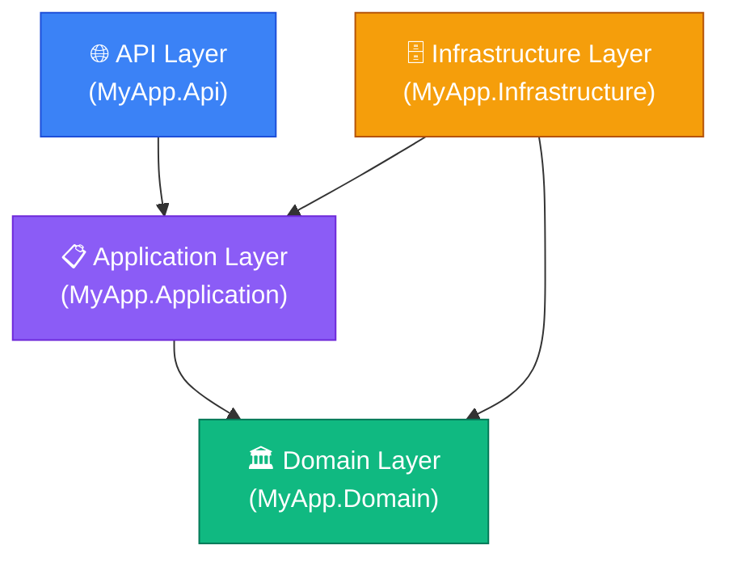

# Тестування Архітектури з NetArchTest

Проходить час. Команда зростає. Юніт-тести пишуться охайно, integration-тести покривають критичні шляхи. Але непомітно відбувається щось інше: один розробник додав пряме звернення до `DbContext` прямо зі шару контролерів «тимчасово». Інший підключив NuGet-пакет з інфраструктурними залежностями прямо в Domain-проєкт «швидко виправити баг». Третій назвав клас `ProductManager` замість `ProductService` — «ну, так зрозуміліше».

Кожна з цих змін — дрібниця. Але через рік вашa Clean Architecture перетворилась на Big Ball of Mud: шари перемішані, залежності йдуть в обидві сторони, і додати новий feature без торкання 5 різних шарів неможливо. **Архітектурна деградація** — одна з найбільш підступних і повільних форм технічного боргу.

Традиційне рішення — code reviews та документація архітектурних рішень. Але люди помиляються, пам'ять хибує, і ніхто не читає документацію. **Automated Architectural Fitness Functions** — це тести, які автоматично перевіряють архітектурні правила при кожному білді. Якщо правило порушене — CI падає.

## Що таке Fitness Functions?

Термін «**Fitness Functions**» ввели Ніл Форд, Ребека Парсонс і Патрік Куа у книзі «Building Evolutionary Architectures». Це автоматизовані перевірки, що захищають якості системи, які важливі для вашої архітектури.

Fitness functions бувають різних видів:
- **Структурні**: перевіряють залежності між компонентами
- **Процесні**: перевіряють дотримання workflows (всі PR проходять code review)
- **Часові**: перевіряють performance характеристики (запит < 200ms)

`NetArchTest` реалізує **структурні** fitness functions: перевіряє залежності між .NET namespace-ами та assembly.

## Встановлення та Основи

::terminal-preview{title="dotnet add package" :cursor="false"}
<div class="line"><span class="opacity-40">$</span> <strong>dotnet add package NetArchTest.Rules</strong></div>
<div class="line"><span class="text-green-400 font-bold">✓</span> Successfully added NetArchTest.Rules to MyApp.Tests.csproj</div>
::

### Як NetArchTest читає код

`NetArchTest` аналізує скомпільовані assembly (DLL-файли), використовуючи reflection та IL-парсинг. Він не читає вихідний код — він читає готові збірки. Це означає, що тести запускаються після компіляції і отримують реальну картину залежностей.

```csharp
using NetArchTest.Rules;

public class ArchitectureTests
{
    // Завантажуємо типи зі всього рішення
    private static readonly Types AllTypes = Types.InCurrentDomain();
    
    // Або з конкретних assembly:
    private static readonly Types DomainTypes = 
        Types.InAssembly(typeof(Domain.Entities.Product).Assembly);
    
    private static readonly Types InfrastructureTypes = 
        Types.InAssembly(typeof(Infrastructure.Data.AppDbContext).Assembly);
    
    private static readonly Types ApplicationTypes =
        Types.InAssembly(typeof(Application.Services.ProductService).Assembly);
}
```

### Базова структура правила

Кожна перевірка NetArchTest складається з трьох частин:

```csharp
var result = Types
    .InAssembly(assembly)           // 1. ЗВІДКИ — вибір assembly або namespace
    .That()                         // 2. ФІЛЬТР — які типи перевіряємо
    .ResideInNamespace("Domain")    //    (опис типів)
    .Should()                       // 3. УМОВА — що повинно бути вірно
    .NotHaveDependencyOn("Infrastructure") // (архітектурне правило)
    .GetResult();                   // Отримуємо результат

// Перевіряємо результат у тесті
Assert.True(result.IsSuccessful, 
    string.Join(Environment.NewLine, result.FailingTypeNames));
```

## Архітектурні Правила для Clean Architecture

Розглянемо типову структуру Clean Architecture проєкту:

::mermaid



::

Ключові правила цієї архітектури:

1. **Domain** не залежить ні від кого
2. **Application** залежить тільки від Domain
3. **Infrastructure** залежить від Application та Domain, але не від API
4. **API** може залежати від всіх (але тільки для DI-реєстрації)

### Правило 1: Domain — незалежний острів

```csharp
[Fact]
public void Domain_ShouldNotDependOnAnyOtherLayer()
{
    var result = Types
        .InAssembly(typeof(Domain.Entities.Product).Assembly)
        .ShouldNot()
        .HaveDependencyOnAny(
            "MyApp.Application",
            "MyApp.Infrastructure",
            "MyApp.Api")
        .GetResult();

    Assert.True(result.IsSuccessful,
        "Domain шар містить залежності на інші шари:\n" +
        string.Join("\n", result.FailingTypeNames ?? Array.Empty<string>()));
}
```

### Правило 2: Application — залежить лише від Domain

```csharp
[Fact]
public void Application_ShouldNotDependOnInfrastructureOrApi()
{
    var result = Types
        .InAssembly(typeof(Application.Services.ProductService).Assembly)
        .ShouldNot()
        .HaveDependencyOnAny("MyApp.Infrastructure", "MyApp.Api")
        .GetResult();

    Assert.True(result.IsSuccessful,
        "Application шар залежить від Infrastructure або Api:\n" +
        string.Join("\n", result.FailingTypeNames ?? Array.Empty<string>()));
}
```

### Правило 3: Заборона на пряме використання DbContext поза Infrastructure

```csharp
[Fact]
public void DbContext_ShouldOnlyBeUsedInInfrastructure()
{
    var result = Types
        .InCurrentDomain()
        .That()
        .DoNotResideInNamespace("MyApp.Infrastructure")
        .And()
        .DoNotResideInNamespace("MyApp.Tests") // виключаємо тести
        .ShouldNot()
        .HaveDependencyOn("Microsoft.EntityFrameworkCore.DbContext")
        .GetResult();

    Assert.True(result.IsSuccessful,
        "DbContext використовується поза Infrastructure шаром:\n" +
        string.Join("\n", result.FailingTypeNames ?? Array.Empty<string>()));
}
```

### Правило 4: Entities — тільки у Domain

```csharp
[Fact]
public void Entities_ShouldResideInDomainNamespace()
{
    // Всі класи-нащадки BaseEntity мають бути в Domain
    var result = Types
        .InCurrentDomain()
        .That()
        .Inherit(typeof(Domain.Common.BaseEntity)) // або ваш базовий клас
        .Should()
        .ResideInNamespace("MyApp.Domain")
        .GetResult();

    Assert.True(result.IsSuccessful,
        "Entity знайдена поза Domain namespace:\n" +
        string.Join("\n", result.FailingTypeNames ?? Array.Empty<string>()));
}
```

## Правила Іменування

Іменування — часто недооцінений аспект архітектури. Консистентні назви допомагають орієнтуватись у коді. NetArchTest дозволяє автоматично перевіряти конвенції іменування.

### Конвенції для Handlers (CQRS/MediatR)

```csharp
[Fact]
public void RequestHandlers_ShouldHaveHandlerSuffix()
{
    var result = Types
        .InAssembly(typeof(Application.Commands.CreateProductCommand).Assembly)
        .That()
        .ImplementInterface(typeof(MediatR.IRequestHandler<,>))
        .Should()
        .HaveNameEndingWith("Handler")
        .GetResult();

    Assert.True(result.IsSuccessful,
        "IRequestHandler реалізації, що не закінчуються на 'Handler':\n" +
        string.Join("\n", result.FailingTypeNames ?? Array.Empty<string>()));
}

[Fact]
public void Queries_ShouldHaveQuerySuffix()
{
    var result = Types
        .InNamespace("MyApp.Application.Queries")
        .Should()
        .HaveNameEndingWith("Query")
        .GetResult();

    Assert.True(result.IsSuccessful,
        "Класи у Queries namespace без суфіксу 'Query':\n" +
        string.Join("\n", result.FailingTypeNames ?? Array.Empty<string>()));
}
```

### Конвенції для Репозиторіїв та Сервісів

```csharp
[Fact]
public void Services_ShouldHaveServiceSuffix()
{
    var result = Types
        .InAssembly(applicationAssembly)
        .That()
        .ImplementInterface(typeof(Application.Interfaces.IService))
        .Should()
        .HaveNameEndingWith("Service")
        .GetResult();

    Assert.True(result.IsSuccessful);
}

[Fact]
public void Repositories_InInfrastructure_ShouldImplementInterface()
{
    // Всі класи з Repository у назві мають реалізовувати IRepository
    var result = Types
        .InAssembly(infrastructureAssembly)
        .That()
        .HaveNameEndingWith("Repository")
        .Should()
        .ImplementInterface(typeof(Domain.Interfaces.IRepository<>))
        .GetResult();

    Assert.True(result.IsSuccessful,
        "Repository без реалізації IRepository:\n" +
        string.Join("\n", result.FailingTypeNames ?? Array.Empty<string>()));
}
```

## Перевірка Sealed та Abstract класів

Деякі архітектурні рішення вимагають певних модифікаторів класів:

```csharp
[Fact]
public void DomainEvents_ShouldBeSealed()
{
    // Domain Events не мають успадковуватись — вони leaf типи
    var result = Types
        .InAssembly(domainAssembly)
        .That()
        .ImplementInterface(typeof(Domain.Events.IDomainEvent))
        .Should()
        .BeSealed()
        .GetResult();

    Assert.True(result.IsSuccessful,
        "DomainEvent не є sealed:\n" +
        string.Join("\n", result.FailingTypeNames ?? Array.Empty<string>()));
}

[Fact]
public void ValueObjects_InDomain_ShouldBeRecords()
{
    // Value Objects краще реалізовувати як record (незмінні)
    var result = Types
        .InAssembly(domainAssembly)
        .That()
        .Inherit(typeof(Domain.Common.ValueObject))
        .Should()
        // Records у C# — це sealed класи з IsRecord=true в reflection
        .BeSealed()
        .GetResult();

    Assert.True(result.IsSuccessful);
}
```

## Перевірка Мінімальних API Ендпоінтів

Для Minimal API можна перевіряти, що всі ендпоінти реалізують певний контракт:

```csharp
[Fact]
public void EndpointGroups_ShouldImplementIEndpointGroup()
{
    // Всі класи-групи ендпоінтів мають реалізовувати інтерфейс
    var result = Types
        .InAssembly(apiAssembly)
        .That()
        .HaveNameEndingWith("Endpoints")
        .Should()
        .ImplementInterface(typeof(Api.Interfaces.IEndpointGroup))
        .GetResult();

    Assert.True(result.IsSuccessful,
        "EndpointGroup без IEndpointGroup інтерфейсу:\n" +
        string.Join("\n", result.FailingTypeNames ?? Array.Empty<string>()));
}

[Fact]
public void Endpoints_ShouldNotDirectlyDependOnDbContext()
{
    // Ендпоінти не мають безпосередньо звертатись до БД
    var result = Types
        .InAssembly(apiAssembly)
        .That()
        .HaveNameEndingWith("Endpoints")
        .ShouldNot()
        .HaveDependencyOn("Microsoft.EntityFrameworkCore")
        .GetResult();

    Assert.True(result.IsSuccessful);
}
```

## Складніші Перевірки з Predicates

Для нестандартних правил NetArchTest надає `Predicate` API:

```csharp
[Fact]
public void PublicClasses_InDomain_ShouldNotHavePublicSetters()
{
    // Value Objects і Entities не повинні мати публічних setters (immutability)
    var failingTypes = Types
        .InAssembly(domainAssembly)
        .That()
        .ArePublic()
        .And()
        .AreClasses()
        .GetTypes()
        .Where(type => type.GetProperties()
            .Any(p => p.SetMethod?.IsPublic == true))
        .ToList();

    Assert.Empty(failingTypes);
}

[Fact]
public void Controllers_ShouldNotExist()
{
    // У Minimal API не має бути класичних MVC-контролерів
    var result = Types
        .InAssembly(apiAssembly)
        .That()
        .Inherit(typeof(Microsoft.AspNetCore.Mvc.ControllerBase))
        .ShouldNot()
        .Exist()
        .GetResult();

    Assert.True(result.IsSuccessful, 
        "Знайдені MVC Controller у Minimal API проєкті. Використовуйте Minimal API.");
}
```

## Повний Набір Архітектурних Тестів

Зберіть всі правила у один виразний тестовий клас:

```csharp
public class ArchitectureFitnessFunctions
{
    // Assembly-and references — завантаження раз для всього класу
    private static readonly Assembly DomainAssembly = 
        typeof(Domain.Entities.Product).Assembly;
    private static readonly Assembly ApplicationAssembly = 
        typeof(Application.Commands.CreateProductCommand).Assembly;
    private static readonly Assembly InfrastructureAssembly = 
        typeof(Infrastructure.Data.AppDbContext).Assembly;
    private static readonly Assembly ApiAssembly = 
        typeof(Api.Program).Assembly;

    // ════════════════════════════════════════════
    // Перевірки ЗАЛЕЖНОСТЕЙ між шарами
    // ════════════════════════════════════════════

    [Fact]
    public void Domain_ShouldNotHaveOutwardDependencies()
    {
        var result = Types.InAssembly(DomainAssembly)
            .ShouldNot()
            .HaveDependencyOnAny(
                "MyApp.Application", 
                "MyApp.Infrastructure", 
                "MyApp.Api",
                "Microsoft.EntityFrameworkCore",
                "Microsoft.Extensions.DependencyInjection")
            .GetResult();

        Assert.True(result.IsSuccessful, FormatFailure("Domain layer dependencies", result));
    }

    [Fact]
    public void Application_ShouldNotDependOnInfrastructureOrPresentation()
    {
        var result = Types.InAssembly(ApplicationAssembly)
            .ShouldNot()
            .HaveDependencyOnAny("MyApp.Infrastructure", "MyApp.Api")
            .GetResult();

        Assert.True(result.IsSuccessful, FormatFailure("Application layer dependencies", result));
    }

    [Fact]
    public void Infrastructure_ShouldNotDependOnApi()
    {
        var result = Types.InAssembly(InfrastructureAssembly)
            .ShouldNot()
            .HaveDependencyOn("MyApp.Api")
            .GetResult();

        Assert.True(result.IsSuccessful, FormatFailure("Infrastructure → Api dependency", result));
    }

    // ════════════════════════════════════════════
    // Конвенції ІМЕНУВАННЯ
    // ════════════════════════════════════════════

    [Fact]
    public void RequestHandlers_ShouldBeNamedXxxHandler()
    {
        var result = Types.InAssembly(ApplicationAssembly)
            .That().ImplementInterface(typeof(MediatR.IRequestHandler<,>))
            .Should().HaveNameEndingWith("Handler")
            .GetResult();

        Assert.True(result.IsSuccessful, FormatFailure("Handler naming convention", result));
    }

    [Fact]
    public void Repositories_ShouldBeNamedXxxRepository()
    {
        var result = Types.InAssembly(InfrastructureAssembly)
            .That().ImplementInterface(typeof(Domain.Interfaces.IRepository<>))
            .Should().HaveNameEndingWith("Repository")
            .GetResult();

        Assert.True(result.IsSuccessful, FormatFailure("Repository naming convention", result));
    }

    // ════════════════════════════════════════════
    // Структурні ОБМЕЖЕННЯ
    // ════════════════════════════════════════════

    [Fact]
    public void DomainEvents_ShouldBeSealed()
    {
        var result = Types.InAssembly(DomainAssembly)
            .That().ImplementInterface(typeof(Domain.Events.IDomainEvent))
            .Should().BeSealed()
            .GetResult();

        Assert.True(result.IsSuccessful, FormatFailure("Domain events sealing", result));
    }

    [Fact]
    public void DomainEntities_ShouldNotHavePublicParameterlessConstructors()
    {
        // Entity має створюватись через фабричний метод або конструктор з параметрами
        var failingTypes = Types.InAssembly(DomainAssembly)
            .That().Inherit(typeof(Domain.Common.BaseEntity))
            .GetTypes()
            .Where(t => t.GetConstructors()
                .Any(c => c.IsPublic && c.GetParameters().Length == 0))
            .ToList();

        Assert.Empty(failingTypes);
    }

    [Fact]
    public void Controllers_ShouldNotExistInMinimalApiProject()
    {
        var result = Types.InAssembly(ApiAssembly)
            .That().Inherit(typeof(Microsoft.AspNetCore.Mvc.ControllerBase))
            .ShouldNot().Exist()
            .GetResult();

        Assert.True(result.IsSuccessful, 
            "Знайдені MVC Controller. Проєкт використовує Minimal API!");
    }

    // ════════════════════════════════════════════
    // Заборонені ЗАЛЕЖНОСТІ
    // ════════════════════════════════════════════

    [Fact]
    public void NoTypeOutsideInfrastructure_ShouldDependOnEntityFramework()
    {
        var result = Types.InCurrentDomain()
            .That()
            .DoNotResideInNamespace("MyApp.Infrastructure")
            .And()
            .DoNotResideInNamespace("MyApp.Tests")
            .ShouldNot()
            .HaveDependencyOn("Microsoft.EntityFrameworkCore")
            .GetResult();

        Assert.True(result.IsSuccessful, FormatFailure("EF Core outside Infrastructure", result));
    }

    // ════════════════════════════════════════════
    // Допоміжний метод для форматування помилок
    // ════════════════════════════════════════════

    private static string FormatFailure(string ruleName, TestResult result)
    {
        var failingTypes = result.FailingTypeNames ?? Array.Empty<string>();
        return $"Порушення правила '{ruleName}':\n  " +
               string.Join("\n  ", failingTypes);
    }
}
```

## Інтеграція у CI/CD Pipeline

Архітектурні тести — це звичайні xUnit-тести. Вони запускаються командою `dotnet test` разом з усіма іншими тестами. Ніякої додаткової конфігурації CI не потрібно.

Але є одна важлива деталь: архітектурні тести можна виокремити в окремий проєкт для кращої організації:

::code-tree

    ```plaintext [MyApp.sln]
    Microsoft Visual Studio Solution File
    ```

    ```csharp [src/MyApp.Domain/MyApp.Domain.csproj]
    <Project Sdk="Microsoft.NET.Sdk">
      <PropertyGroup>
        <TargetFramework>net8.0</TargetFramework>
      </PropertyGroup>
    </Project>
    ```

    ```csharp [src/MyApp.Application/MyApp.Application.csproj]
    <Project Sdk="Microsoft.NET.Sdk">
      <PropertyGroup>
        <TargetFramework>net8.0</TargetFramework>
      </PropertyGroup>
      <ItemGroup>
        <ProjectReference Include="..\MyApp.Domain\MyApp.Domain.csproj" />
      </ItemGroup>
    </Project>
    ```

    ```csharp [src/MyApp.Infrastructure/MyApp.Infrastructure.csproj]
    <Project Sdk="Microsoft.NET.Sdk">
      <PropertyGroup>
        <TargetFramework>net8.0</TargetFramework>
      </PropertyGroup>
    </Project>
    ```

    ```csharp [src/MyApp.Api/MyApp.Api.csproj]
    <Project Sdk="Microsoft.NET.Sdk.Web">
      <PropertyGroup>
        <TargetFramework>net8.0</TargetFramework>
      </PropertyGroup>
    </Project>
    ```

    ```csharp [tests/MyApp.UnitTests/MyApp.UnitTests.csproj]
    <Project Sdk="Microsoft.NET.Sdk">
      <PropertyGroup>
        <TargetFramework>net8.0</TargetFramework>
        <IsPackable>false</IsPackable>
      </PropertyGroup>
    </Project>
    ```

    ```csharp [tests/MyApp.ArchitectureTests/MyApp.ArchitectureTests.csproj]
    <Project Sdk="Microsoft.NET.Sdk">
      <PropertyGroup>
        <TargetFramework>net8.0</TargetFramework>
        <IsPackable>false</IsPackable>
      </PropertyGroup>
      <ItemGroup>
        <PackageReference Include="NetArchTest.Rules" Version="1.3.0" />
      </ItemGroup>
    </Project>
    ```

::

```yaml
# .github/workflows/ci.yml
- name: Run all tests (including architecture)
  run: dotnet test --filter "Category!=Integration" --logger "junit" 

# Або запускати архітектурні тести окремо (швидко, без docker)
- name: Architecture Tests
  run: dotnet test tests/MyApp.ArchitectureTests/ --logger "junit"
```

::tip
**Швидкість**: Архітектурні тести зазвичай виконуються за 1-3 секунди, тому що вони лише аналізують assembly через reflection — не піднімають бази даних, не роблять HTTP-запитів. Їх можна запускати постійно навіть у slow environments.
::

## Поступове Впровадження

Якщо ви додаєте архітектурні тести у вже існуючий проєкт, де є порушення — не намагайтесь виправити все одразу. Стратегія поступового впровадження:

::steps

### Крок 1: Аудит поточного стану

Запустіть перевірки без `Assert` — просто отримайте список порушень:

```csharp
[Fact]
public void AuditReport_CurrentArchitectureViolations()
{
    var result = Types.InAssembly(DomainAssembly)
        .ShouldNot()
        .HaveDependencyOnAny("MyApp.Infrastructure")
        .GetResult();
    
    // Логуємо, але НЕ падаємо — інвентаризація порушень
    _output.WriteLine($"Порушень знайдено: {result.FailingTypeNames?.Count() ?? 0}");
    foreach (var type in result.FailingTypeNames ?? Array.Empty<string>())
    {
        _output.WriteLine($"  - {type}");
    }
    
    // Тест завжди проходить — він призначений для звіту
    Assert.True(true); 
}
```

### Крок 2: Список виключень (Allowlist)

Зафіксуйте поточний список відомих порушень і перевіряйте, що нові не додаються:

```csharp
private static readonly HashSet<string> KnownViolations = new()
{
    "MyApp.Domain.Services.LegacyOrderService", // TODO: виправити в Q2
    "MyApp.Domain.Helpers.DatabaseHelper"       // TODO: перенести в Infrastructure
};

[Fact]
public void Domain_NoNewDependenciesOnInfrastructure()
{
    var result = Types.InAssembly(DomainAssembly)
        .ShouldNot()
        .HaveDependencyOn("MyApp.Infrastructure")
        .GetResult();
    
    var newViolations = (result.FailingTypeNames ?? Array.Empty<string>())
        .Where(t => !KnownViolations.Contains(t))
        .ToList();
    
    Assert.Empty(newViolations); // Нові порушення заборонені
}
```

### Крок 3: Поступове очищення

Виправляйте порушення по одному, видаляючи їх зі списку `KnownViolations`.

### Крок 4: Строгий режим

Коли список empty — переходьте на строгий тест без allowlist.

::

## Архітектурні Тести + Living Documentation

Combine NetArchTest з документацією: ваші тести **є** документацією архітектури. Вони перевіряються автоматично і завжди актуальні — на відміну від Wiki-сторінки, яка може застаріти.

Корисна практика — генерувати звіт архітектурних правил у форматі Markdown як частину CI:

```csharp
// Власний xUnit reporter, що генерує Architecture Decision Record
[Fact]
public void GenerateArchitectureReport()
{
    var rules = new[]
    {
        ("Domain незалежний", DomainIndependenceCheck()),
        ("Application не знає Infrastructure", ApplicationCheck()),
        ("Handlers мають суфікс Handler", HandlerNamingCheck()),
        // ... інші правила
    };
    
    var report = new StringBuilder();
    report.AppendLine("# Architecture Fitness Functions Report");
    report.AppendLine($"Generated: {DateTime.UtcNow:yyyy-MM-dd HH:mm} UTC");
    report.AppendLine();
    
    foreach (var (name, result) in rules)
    {
        var status = result.IsSuccessful ? "✅" : "❌";
        report.AppendLine($"## {status} {name}");
        if (!result.IsSuccessful)
        {
            foreach (var type in result.FailingTypeNames ?? Array.Empty<string>())
                report.AppendLine($"- `{type}`");
        }
    }
    
    File.WriteAllText("architecture-report.md", report.ToString());
    
    // Після генерації звіту — перевіряємо, що всі правила виконані
    Assert.All(rules, r => Assert.True(r.Item2.IsSuccessful, r.Item1));
}
```

---

## Практика

::accordion
::accordion-item{label="⭐ Рівень 1: Базові правила залежностей" icon="i-lucide-star"}

Проаналізуйте структуру вашого Minimal API проєкту:

1. Визначте, які шари у вас є (API, Application, Domain, Infrastructure чи інша організація).
2. Намалюйте схему бажаних залежностей між шарами.
3. Напишіть мінімум 3 тести-перевірки залежностей:
   - Заборона залежностей «вниз» (від нижнього шару до верхнього)
   - Заборона прямого використання `DbContext` поза Infrastructure
   - Один тест на заборонену залежність за вибором
4. Запустіть тести — якщо вони провалюються, задокументуйте порушення (не виправляйте ще).

::
::accordion-item{label="⭐⭐ Рівень 2: Конвенції іменування та структурні обмеження" icon="i-lucide-star"}

Продовжте попередній набір правилами:

1. Усі реалізації `IRequestHandler` мають закінчуватись на `Handler`.
2. Усі реалізації `IRepository<>` мають закінчуватись на `Repository`.
3. Domain Events (класи, що реалізують ваш `IDomainEvent`) мають бути `sealed`.
4. Якщо є Value Objects — перевірте, що вони `sealed` або `record`.
5. Перевірте, що немає `ControllerBase` нащадків у проєкті (для Minimal API).

Виправте знайдені порушення або додайте у список `KnownViolations` з коментарем TODO.

::
::accordion-item{label="⭐⭐⭐ Рівень 3: CI Integration та Living Documentation" icon="i-lucide-star"}

1. Виокремте архітектурні тести в окремий проєкт `MyApp.ArchitectureTests`.
2. Реалізуйте стратегію поступового впровадження: `KnownViolations` allowlist для поточних порушень + строга перевірка нових.
3. Реалізуйте генератор звіту (або використайте xUnit output) — при провалі тест виводить список порушників з namespace.
4. Додайте до GitHub Actions окремий job `architecture-tests`, що запускає лише цей проєкт і публікує звіт як artifact.
5. (Бонус) Напишіть кастомну перевірку: всі Minimal API ендпоінт-групи мають бути в namespace `Api.Endpoints.*` і реалізовувати ваш `IEndpointGroup` інтерфейс.

::
::

---

## Підсумок Курсу

Ми пройшли довгий шлях. Від перших принципів — що таке тест, пірамідa тестування, школи TDD — до практики ізольованого тестування Minimal API з реальною базою даних, автоматизованих колекцій у Postman, ізоляції HTTP-клієнтів через WireMock, та нарешті — архітектурних fitness functions, що не дають вашому коду деградувати.

::card-group

::card{title="📐 Архітектура тестів" icon="i-heroicons-squares-2x2"}

Піраміда тестування, школи TDD/BDD, стратегія «що тестувати» — фундамент, на якому будується все інше.

::

::card{title="🧪 xUnit та Мокування" icon="i-heroicons-beaker"}

Fluent тести з xUnit, ізоляція залежностей через Moq/NSubstitute, тестування бізнес-логіки без зовнішніх залежностей.

::

::card{title="🔗 Інтеграційне тестування" icon="i-heroicons-link"}

WebApplicationFactory, Testcontainers з реальною PostgreSQL, тестування авторизації та middleware.

::

::card{title="🌐 HTTP та Зовнішні сервіси" icon="i-heroicons-globe-alt"}

Postman Professional, MockHttpMessageHandler, WireMock.Net для реального HTTP-стеку, тестування Polly resilience.

::

::card{title="🎨 Якість тестового коду" icon="i-heroicons-paint-brush"}

Test Smells, Object Mother, Test Data Builder, Bogus — інструменти для підтримки тестового коду в чистоті.

::

::card{title="⚡ Просунуті інструменти" icon="i-heroicons-bolt"}

TimeProvider для тестування часу, Verify для snapshot testing, FsCheck для property-based тестів.

::

::

Тестування — це не данина процесу. Це інвестиція, яка окуповується сторицею: впевненість при рефакторингу, швидкий feedback при зміні коду, живa документація поведінки системи. Код без тестів — завжди код у борг.

Вивчайте, практикуйте, і нехай ваші CI-пайплайни завжди залишаються зеленими. 🟢
