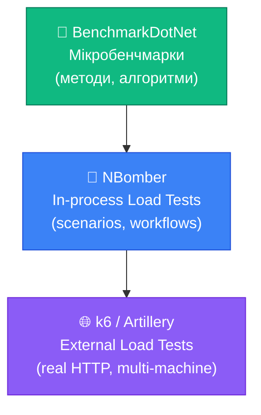

# Тестування Продуктивності: BenchmarkDotNet, NBomber та k6

Ви написали unit-тести. Вони всі зелені. Але чи означає це, що ваш API готовий до production? Не обов'язково. Є ціла категорія проблем, яку функціональні тести не виявляють: повільні SQL-запити під навантаженням, memory leaks при тривалій роботі, деградація швидкодії при зростанні обсягу даних, неефективне використання CPU на критичних шляхах.

Ось реальний сценарій: ендпоінт `GET /api/products` у тестах повертає 10 ms. На staging із 50 000 продуктів у базі — 3 500 ms. При 100 одночасних користувачах — таймаут. Жоден із ваших xUnit-тестів це не виявив, бо вони завжди запускаються з порожньою базою.

**Тестування продуктивності** — це окрема дисципліна, і вона поділяється на три рівні:

1. **Мікробенчмарки** (BenchmarkDotNet) — вимірювання швидкості конкретних методів і алгоритмів
2. **Load Testing in-process** (NBomber) — симуляція навантаження зсередини .NET-процесу
3. **Load Testing external** (k6, Artillery, Gatling) — повноцінне навантаження через справжні HTTP-запити

## Рівень 1: BenchmarkDotNet — Мікробенчмарки

### Навіщо потрібен BenchmarkDotNet

Вимірювання продуктивності у .NET вручну — ненадійна справа. `Stopwatch` дає приблизні результати, на які впливають: JIT-компіляція (перший запуск завжди повільний), garbage collection (може спрацювати під час вимірювання), CPU branching, кешування даних, scheduler OS. BenchmarkDotNet враховує всі ці фактори: прогріває JIT, виконує сотні ітерацій, відкидає аномалії, рахує середнє, медіану і стандартне відхилення.

::terminal-preview{title="dotnet add package" :cursor="false"}
<div class="line"><span class="opacity-40">$</span> <strong>dotnet add package BenchmarkDotNet</strong></div>
<div class="line"><span class="text-green-400 font-bold">✓</span> Successfully added BenchmarkDotNet to MyApp.Benchmarks.csproj</div>
::

### Перший бенчмарк

```csharp
using BenchmarkDotNet.Attributes;
using BenchmarkDotNet.Running;

// Клас з бенчмарками
[MemoryDiagnoser] // Показує алокації пам'яті
[SimpleJob(RuntimeMoniker.Net80)]
public class ProductSearchBenchmarks
{
    private List<Product> _products = null!;
    private HashSet<int> _productIds = null!;

    [Params(100, 1_000, 10_000)]
    public int ProductCount; // BenchmarkDotNet запустить тест для кожного значення

    [GlobalSetup]
    public void Setup()
    {
        // Виконується один раз перед всіма ітераціями
        var faker = new Faker<Product>()
            .RuleFor(p => p.Id, f => f.IndexFaker + 1)
            .RuleFor(p => p.Name, f => f.Commerce.ProductName())
            .RuleFor(p => p.Price, f => f.Finance.Amount(1, 1000));

        _products = faker.Generate(ProductCount);
        _productIds = _products.Select(p => p.Id).ToHashSet();
    }

    [Benchmark(Baseline = true)]
    public Product? SearchWithLinq()
    {
        var targetId = ProductCount / 2;
        return _products.FirstOrDefault(p => p.Id == targetId);
    }

    [Benchmark]
    public Product? SearchWithDictionary()
    {
        // Припускаємо, що словник вже побудований
        var targetId = ProductCount / 2;
        var dict = _products.ToDictionary(p => p.Id);
        return dict.TryGetValue(targetId, out var p) ? p : null;
    }

    [Benchmark]
    public bool ContainsWithHashSet()
    {
        return _productIds.Contains(ProductCount / 2);
    }
}

// Program.cs для бенчмарків (окремий проєкт!)
BenchmarkRunner.Run<ProductSearchBenchmarks>();
```

Запуск:

::terminal-preview{title="dotnet run -c Release" :cursor="false"}
<div class="line"><span class="opacity-40">$</span> <strong>dotnet run -c Release</strong></div>
<div class="line"></div>
<div class="line"><span class="text-blue-400 font-bold">// BenchmarkDotNet v0.14.1</span></div>
<div class="line"><span class="text-blue-400 font-bold">// Running product...</span></div>
<div class="line"></div>
<div class="line">| Method |        Mean |     Error |    StdDev |      Median |</div>
<div class="line">|------- |------------:|----------:|----------:|------------:|</div>
<div class="line">| FindLinear |  124.50 us |  2.310 us |  4.082 us |  123.00 us |</div>
<div class="line">| FindBinary |    8.21 us |  0.150 us |  0.265 us |    8.19 us |</div>
<div class="line"></div>
<div class="line"><span class="text-green-400 font-bold">✓</span> Benchmark complete</div>
::

### Читаємо результати BenchmarkDotNet

::terminal-preview{title="BenchmarkDotNet Results" :cursor="false"}
<div class="line"><span class="text-blue-400 font-bold">BenchmarkDotNet</span> v0.13.10, Windows 11</div>
<div class="line"><span class="opacity-40">Intel Core i7-12700K, 1 CPU, 20 logical cores</span></div>
<div class="line"><span class="opacity-40">.NET SDK 8.0.200</span></div>
<div class="line"></div>
<div class="line">| Method               | ProductCount | Mean        | Error    | Ratio | Allocated |</div>
<div class="line">|----------------------|-------------|-------------|----------|-------|-----------|</div>
<div class="line">| SearchWithLinq       | 100         | <span class="text-green-400">235.4 ns</span>  | 2.3 ns   | 1.00  | -         |</div>
<div class="line">| SearchWithDictionary | 100         | <span class="text-yellow-400">4,821 ns</span> | 38.1 ns  | 20.5x | 4.8 KB    |</div>
<div class="line">| ContainsWithHashSet  | 100         | <span class="text-green-400">12.1 ns</span>  | 0.1 ns   | 0.05x | -         |</div>
<div class="line">| SearchWithLinq       | 10000       | <span class="text-rose-400">24,381 ns</span> | 187 ns   | 1.00  | -         |</div>
<div class="line">| SearchWithDictionary | 10000       | <span class="text-yellow-400">389,421 ns</span>| 2.8 µs  | 15.9x | 468 KB    |</div>
<div class="line">| ContainsWithHashSet  | 10000       | <span class="text-green-400">12.3 ns</span>  | 0.2 ns   | 0.00x | -         |</div>
::

Висновок з результатів: при 10 000 елементах HashSet (12 ns) у 2000 разів швидший за LINQ (24 µs) і не алокує пам'яті. `ToDictionary` — найгірший варіант: будує нову структуру при кожному виклику.

### Корисні атрибути BenchmarkDotNet

```csharp
[MemoryDiagnoser]          // Показати алокації (Gen0/Gen1/Gen2 GC, Bytes allocated)
[ThreadingDiagnoser]       // Статистика потоків
[HardwareCounters(...)]    // CPU counters (cache misses, branch mispredictions)
[SimpleJob(warmupCount: 5, iterationCount: 20)] // Налаштування кількості запусків
[Orderer(SummaryOrderPolicy.FastestToSlowest)]  // Сортування результатів

[Benchmark]
[Arguments(100)]           // Окремий аргумент для одного методу
[Arguments(1_000)]
public void MyMethod(int count) { }
```

### Бенчмарки Serialization: System.Text.Json vs Newtonsoft

Типовий практичний кейс — порівняння продуктивності серіалізаторів:

```csharp
[MemoryDiagnoser]
public class SerializationBenchmarks
{
    private Product _product = null!;
    private string _json = null!;

    [GlobalSetup]
    public void Setup()
    {
        _product = new Product
        {
            Id = 42, Name = "Widget Pro", Price = 99.99m,
            CreatedAt = DateTime.UtcNow, Tags = ["electronics", "premium"]
        };
        _json = System.Text.Json.JsonSerializer.Serialize(_product);
    }

    [Benchmark(Baseline = true)]
    public string SystemTextJson_Serialize()
        => System.Text.Json.JsonSerializer.Serialize(_product);

    [Benchmark]
    public string Newtonsoft_Serialize()
        => Newtonsoft.Json.JsonConvert.SerializeObject(_product);

    [Benchmark]
    public Product? SystemTextJson_Deserialize()
        => System.Text.Json.JsonSerializer.Deserialize<Product>(_json);

    [Benchmark]
    public Product? Newtonsoft_Deserialize()
        => Newtonsoft.Json.JsonConvert.DeserializeObject<Product>(_json);
}
```

### Бенчмарки для Minimal API Handlers

Окрема цінна практика — бенчмарк самого handler-а без мережевого стека:

```csharp
[MemoryDiagnoser]
public class ProductEndpointBenchmarks
{
    private ServiceProvider _serviceProvider = null!;

    [GlobalSetup]
    public void Setup()
    {
        var services = new ServiceCollection();
        services.AddDbContext<AppDbContext>(opt =>
            opt.UseInMemoryDatabase("BenchmarkDb"));
        services.AddScoped<IProductRepository, ProductRepository>();
        services.AddScoped<ProductService>();

        _serviceProvider = services.BuildServiceProvider();

        // Заповнюємо InMemory базу тестовими даними
        using var scope = _serviceProvider.CreateScope();
        var db = scope.ServiceProvider.GetRequiredService<AppDbContext>();
        db.Products.AddRange(Enumerable.Range(1, 1000)
            .Select(i => new Product { Id = i, Name = $"Product {i}", Price = i * 1.5m }));
        db.SaveChanges();
    }

    [Benchmark]
    public async Task<IResult> GetAllProducts()
    {
        using var scope = _serviceProvider.CreateScope();
        var service = scope.ServiceProvider.GetRequiredService<ProductService>();
        var products = await service.GetAllAsync();
        return TypedResults.Ok(products);
    }

    [Params(1, 100, 500, 1000)]
    public int ProductId;

    [Benchmark]
    public async Task<IResult> GetProductById()
    {
        using var scope = _serviceProvider.CreateScope();
        var service = scope.ServiceProvider.GetRequiredService<ProductService>();
        var product = await service.GetByIdAsync(ProductId);
        return product is null ? TypedResults.NotFound() : TypedResults.Ok(product);
    }

    [GlobalCleanup]
    public void Cleanup() => _serviceProvider.Dispose();
}
```

## Рівень 2: NBomber — Load Testing у .NET

### Що таке NBomber

NBomber — .NET-бібліотека для написання load tests на C#. На відміну від зовнішніх інструментів (k6, JMeter), тести пишуться на рідній мові проєкту, можна реюзати весь .NET-стек (HttpClientFactory, авторизацію, Bogus для генерації даних) і запускати тести командою `dotnet test`.

::terminal-preview{title="dotnet add package NBomber" :cursor="false"}
<div class="line"><span class="opacity-40">$</span> <strong>dotnet add package NBomber NBomber.Http</strong></div>
<div class="line"><span class="text-green-400 font-bold">✓</span> Successfully added NBomber to MyApp.LoadTests.csproj</div>
<div class="line"><span class="text-green-400 font-bold">✓</span> Successfully added NBomber.Http to MyApp.LoadTests.csproj</div>
::

### Концепції NBomber

- **Scenario** — один тестовий сценарій (наприклад, «перегляд каталогу»). Містить логіку одного «user journey».
- **Step** — один крок у сценарії (один HTTP-запит або одна операція).
- **LoadSimulation** — стратегія навантаження: скільки користувачів, як довго, яка інтенсивність.

### Перший NBomber тест

```csharp
using NBomber.CSharp;
using NBomber.Http.CSharp;

public class LoadTests
{
    [Fact]
    public void GetProducts_UnderLoad_MeetsPerformanceSLA()
    {
        // Arrange: HTTP-клієнт для тестів
        var httpClient = new HttpClient { BaseAddress = new Uri("http://localhost:5000") };

        // Сценарій: отримання списку продуктів
        var scenario = Scenario.Create("get_products", async context =>
            {
                var request = Http.CreateRequest("GET", "/api/products")
                    .WithHeader("Accept", "application/json");

                var response = await Http.Send(httpClient, request);
                return response;
            })
            // Стратегія навантаження: 50 одночасних користувачів протягом 30 секунд
            .WithLoadSimulations(
                Simulation.Inject(rate: 50, interval: TimeSpan.FromSeconds(1), during: TimeSpan.FromSeconds(30))
            );

        // Act: запускаємо тест
        var stats = NBomberRunner
            .RegisterScenarios(scenario)
            .WithReportFolder("reports")
            .WithReportFormats(ReportFormat.Html, ReportFormat.Csv)
            .Run();

        // Assert: перевіряємо SLA (Service Level Agreement)
        var scenarioStats = stats.ScenarioStats.First();

        // P50 < 100ms (медіана менша за 100ms)
        Assert.True(scenarioStats.Ok.Latency.Percent50 < 100,
            $"P50 latency: {scenarioStats.Ok.Latency.Percent50}ms (expected < 100ms)");

        // P95 < 500ms (95% запитів швидші за 500ms)
        Assert.True(scenarioStats.Ok.Latency.Percent95 < 500,
            $"P95 latency: {scenarioStats.Ok.Latency.Percent95}ms (expected < 500ms)");

        // Error rate < 1%
        var errorRate = scenarioStats.Fail.Request.Count * 100.0 /
                        (scenarioStats.Ok.Request.Count + scenarioStats.Fail.Request.Count);
        Assert.True(errorRate < 1.0,
            $"Error rate: {errorRate:F2}% (expected < 1%)");

        // Мінімальний throughput: 100 RPS
        Assert.True(scenarioStats.Ok.Request.RPS > 100,
            $"RPS: {scenarioStats.Ok.Request.RPS:F1} (expected > 100)");
    }
}
```

### Стратегії Навантаження (Load Simulations)

NBomber має кілька моделей навантаження:

```csharp
// 1. Inject (Open Model) — постійний потік нових запитів
// Незалежно від часу відповіді, кожну секунду приходить N нових запитів
// Симулює реальний трафік (users не чекають відповіді)
Simulation.Inject(rate: 100, interval: TimeSpan.FromSeconds(1), during: TimeSpan.FromMinutes(5))

// 2. KeepConstant (Closed Model) — постійна кількість паралельних користувачів
// Кожен "user" чекає відповіді перед новим запитом
// Симулює пул воркерів або connection pool
Simulation.KeepConstant(copies: 50, during: TimeSpan.FromMinutes(2))

// 3. RampingInject — поступове збільшення до target rate
// Плавне зростання навантаження
Simulation.RampingInject(rate: 200, interval: TimeSpan.FromSeconds(1), during: TimeSpan.FromMinutes(3))

// 4. RampingConstant — поступове збільшення паралельних користувачів
Simulation.RampingConstant(copies: 100, during: TimeSpan.FromMinutes(3))

// 5. InjectRandom — варіативне навантаження (симуляція пікового трафіку)
Simulation.InjectRandom(
    minRate: 10, maxRate: 200,
    interval: TimeSpan.FromSeconds(1),
    during: TimeSpan.FromMinutes(5))
```

### Складний Сценарій: Авторизований CRUD Workflow

```csharp
public class AuthenticatedLoadTests
{
    private readonly string _baseUrl = "http://localhost:5000";

    [Fact]
    public void ProductCrudWorkflow_UnderLoad_MeetsSLA()
    {
        var httpFactory = ClientFactory.Create(
            name: "api_client",
            clientCount: 10, // пул з 10 клієнтів
            initClient: (number, context) =>
            {
                var client = new HttpClient { BaseAddress = new Uri(_baseUrl) };
                return Task.FromResult(client);
            });

        var scenario = Scenario.Create("product_crud", async context =>
        {
            var client = context.Data.GetClient<HttpClient>(httpFactory);

            // Крок 1: Авторизація
            var loginReq = Http.CreateRequest("POST", "/api/auth/login")
                .WithJsonBody(new { username = "loadtest@example.com", password = "LoadTest_123" });
            var loginResp = await Http.Send(client, loginReq, context);

            if (loginResp.StatusCode != HttpStatusCode.OK)
                return Response.Fail("Login failed");

            var token = (await loginResp.Content.ReadFromJsonAsync<AuthResponse>())?.Token;

            // Крок 2: Отримання списку
            var listReq = Http.CreateRequest("GET", "/api/products?page=1&pageSize=20")
                .WithHeader("Authorization", $"Bearer {token}");
            var listResp = await Http.Send(client, listReq, context);

            if (!listResp.IsSuccessStatusCode)
                return Response.Fail("Get products failed");

            // Крок 3: Створення продукту
            var faker = new Faker();
            var createReq = Http.CreateRequest("POST", "/api/products")
                .WithHeader("Authorization", $"Bearer {token}")
                .WithJsonBody(new
                {
                    name = faker.Commerce.ProductName(),
                    price = faker.Finance.Amount(1, 999),
                    categoryId = faker.Random.Int(1, 5)
                });
            var createResp = await Http.Send(client, createReq, context);

            if (createResp.StatusCode != HttpStatusCode.Created)
                return Response.Fail($"Create failed: {createResp.StatusCode}");

            var created = await createResp.Content.ReadFromJsonAsync<ProductDto>();

            // Крок 4: Видалення створеного
            var deleteReq = Http.CreateRequest("DELETE", $"/api/products/{created!.Id}")
                .WithHeader("Authorization", $"Bearer {token}");
            await Http.Send(client, deleteReq, context);

            return Response.Ok();
        })
        .WithClientFactory(httpFactory)
        .WithLoadSimulations(
            // Поступово збільшуємо до 30 concurrent users
            Simulation.RampingConstant(copies: 30, during: TimeSpan.FromMinutes(2)),
            // Тримаємо 30 users протягом 5 хвилин
            Simulation.KeepConstant(copies: 30, during: TimeSpan.FromMinutes(5))
        );

        var stats = NBomberRunner
            .RegisterScenarios(scenario)
            .WithReportFolder("load-reports")
            .Run();

        var s = stats.ScenarioStats.First();
        Assert.True(s.Ok.Latency.Percent95 < 2000, $"P95 > 2s: {s.Ok.Latency.Percent95}ms");
        Assert.True(s.Ok.Request.RPS > 5, "Throughput too low");
    }
}
```

### Читання NBomber Звіту

NBomber генерує HTML-звіт з детальними метриками:

::terminal-preview{title="NBomber Report" :cursor="false"}
<div class="line"><span class="text-blue-400 font-bold">Scenario: get_products</span> | duration: 30s | ok: 12,847 | failed: 3</div>
<div class="line"></div>
<div class="line"><span class="opacity-40">━━━ Load Simulation ━━━━━━━━━━━━━━━━━━━━━━━━━━━━━━</span></div>
<div class="line">inject | rate: 50/s | interval: 1s | during: 30s</div>
<div class="line"></div>
<div class="line"><span class="opacity-40">━━━ OK Stats ━━━━━━━━━━━━━━━━━━━━━━━━━━━━━━━━━━━━━</span></div>
<div class="line">count: 12,847 | RPS: <span class="text-green-400 font-bold">428.2</span></div>
<div class="line"></div>
<div class="line"><span class="opacity-40">━━━ Latency (milliseconds) ━━━━━━━━━━━━━━━━━━━━━━━</span></div>
<div class="line">p50: <span class="text-green-400">18.3 ms</span>   p75: <span class="text-green-400">32.1 ms</span></div>
<div class="line">p95: <span class="text-yellow-400">89.4 ms</span>   p99: <span class="text-rose-400">241.7 ms</span></div>
<div class="line">min:  1.2 ms   max:  891.3 ms</div>
<div class="line"></div>
<div class="line"><span class="opacity-40">━━━ FAIL Stats ━━━━━━━━━━━━━━━━━━━━━━━━━━━━━━━━━━━</span></div>
<div class="line">count: 3 | RPS: 0.1 | error rate: <span class="text-green-400">0.02%</span></div>
::

### Assertions на Метрики з NBomber

```csharp
// Допоміжний метод для читання результатів:
private static void AssertSLA(ScenarioStats stats, PerformanceSLA sla)
{
    var latency = stats.Ok.Latency;
    var fails = stats.Fail.Request.Count;
    var total = stats.Ok.Request.Count + fails;

    var failures = new List<string>();

    if (latency.Percent50 > sla.P50MaxMs)
        failures.Add($"P50: {latency.Percent50}ms > {sla.P50MaxMs}ms");

    if (latency.Percent95 > sla.P95MaxMs)
        failures.Add($"P95: {latency.Percent95}ms > {sla.P95MaxMs}ms");

    if (latency.Percent99 > sla.P99MaxMs)
        failures.Add($"P99: {latency.Percent99}ms > {sla.P99MaxMs}ms");

    if (total > 0 && (fails * 100.0 / total) > sla.MaxErrorRatePercent)
        failures.Add($"Error rate: {fails * 100.0 / total:F2}% > {sla.MaxErrorRatePercent}%");

    if (stats.Ok.Request.RPS < sla.MinRPS)
        failures.Add($"RPS: {stats.Ok.Request.RPS:F1} < {sla.MinRPS}");

    Assert.True(!failures.Any(), "SLA violations:\n" + string.Join("\n", failures));
}

public record PerformanceSLA(
    double P50MaxMs = 100,
    double P95MaxMs = 500,
    double P99MaxMs = 2000,
    double MaxErrorRatePercent = 1.0,
    double MinRPS = 50);
```

## Рівень 3: k6 — Зовнішнє Load Testing

### Чому зовнішній інструмент

NBomber чудовий для .NET-стеку, але є ситуації, коли хочеться повного ізолювання: тест як окремий процес, незалежний від мови і платформи, з власною моделлю конкурентності. k6 — це Go-based інструмент від Grafana Labs, що виконує JavaScript-скрипти навантаження. Він надзвичайно ефективний: один процес k6 може генерувати десятки тисяч запитів на секунду.

### Встановлення k6

::terminal-preview{title="choco install k6 (Windows)" :cursor="false"}
<div class="line"><span class="opacity-40">$</span> <strong>choco install k6</strong></div>
<div class="line"><span class="text-green-400 font-bold">✓</span> k6 v0.54.0 installed successfully</div>
::

::terminal-preview{title="brew install k6 (macOS)" :cursor="false"}
<div class="line"><span class="opacity-40">$</span> <strong>brew install k6</strong></div>
<div class="line"><span class="text-green-400 font-bold">✓</span> k6 v0.54.0 installed successfully</div>
::

::terminal-preview{title="docker pull grafana/k6" :cursor="false"}
<div class="line"><span class="opacity-40">$</span> <strong>docker pull grafana/k6</strong></div>
<div class="line"><span class="text-green-400 font-bold">✓</span> Status: Downloaded newer image for grafana/k6:latest</div>
::

### Базовий k6 Скрипт

```javascript
// tests/performance/get-products.js
import http from 'k6/http';
import { check, sleep } from 'k6';
import { Rate, Trend } from 'k6/metrics';

// Кастомні метрики
const errorRate = new Rate('error_rate');
const getProductsDuration = new Trend('get_products_duration', true); // true = мілісекунди

// Конфігурація навантаження
export const options = {
    stages: [
        { duration: '1m', target: 50 },   // Warm up: рампинг до 50 users
        { duration: '3m', target: 50 },   // Основне навантаження: 50 users 3 хвилини
        { duration: '1m', target: 100 },  // Пік: рампинг до 100 users
        { duration: '2m', target: 100 },  // Стрес: 100 users 2 хвилини
        { duration: '1m', target: 0 },    // Cool down
    ],
    
    // Threshold (SLA) — тест провалюється якщо порушені
    thresholds: {
        'http_req_duration': ['p(50)<100', 'p(95)<500', 'p(99)<2000'],
        'http_req_failed': ['rate<0.01'],   // < 1% помилок
        'error_rate': ['rate<0.01'],
        'http_reqs': ['rate>100'],          // > 100 RPS
    },
};

const BASE_URL = __ENV.BASE_URL || 'http://localhost:5000';

// Функція виконується для кожного "virtual user" кожну ітерацію
export default function () {
    const response = http.get(`${BASE_URL}/api/products?page=1&pageSize=20`, {
        headers: { 'Accept': 'application/json' },
        timeout: '5s',
    });

    // Перевірки
    const ok = check(response, {
        'status is 200': (r) => r.status === 200,
        'response time < 500ms': (r) => r.timings.duration < 500,
        'has data array': (r) => {
            try {
                const body = r.json();
                return Array.isArray(body) || (body && Array.isArray(body.data));
            } catch {
                return false;
            }
        },
    });

    // Записуємо кастомні метрики
    errorRate.add(!ok);
    getProductsDuration.add(response.timings.duration);

    sleep(0.5); // Пауза між запитами (симуляція "think time")
}
```

### k6 Скрипт: Авторизований Workflow

```javascript
// tests/performance/authenticated-workflow.js
import http from 'k6/http';
import { check, sleep, group } from 'k6';
import { SharedArray } from 'k6/data';

// SharedArray — завантажується один раз, доступна всім VUs
const users = new SharedArray('test users', function () {
    return JSON.parse(open('./test-users.json')); // масив {email, password}
});

export const options = {
    stages: [
        { duration: '30s', target: 20 },
        { duration: '2m', target: 20 },
        { duration: '30s', target: 0 },
    ],
    thresholds: {
        'http_req_duration{group:::Login}': ['p(95)<300'],
        'http_req_duration{group:::Get Products}': ['p(95)<200'],
        'http_req_duration{group:::Create Product}': ['p(95)<500'],
    },
};

export default function () {
    // Кожен VU бере свого юзера з пулу
    const user = users[__VU % users.length];
    let token = '';

    group('Login', function () {
        const resp = http.post(`${__ENV.BASE_URL}/api/auth/login`,
            JSON.stringify({ username: user.email, password: user.password }),
            { headers: { 'Content-Type': 'application/json' } });

        check(resp, {
            'login success': (r) => r.status === 200,
            'has token': (r) => r.json('accessToken') !== undefined,
        });

        token = resp.json('accessToken');
    });

    if (!token) return; // Якщо логін не вдався — пропускаємо решту

    const headers = { 'Authorization': `Bearer ${token}`, 'Content-Type': 'application/json' };

    group('Get Products', function () {
        const resp = http.get(`${__ENV.BASE_URL}/api/products`, { headers });
        check(resp, { 'products returned': (r) => r.status === 200 });
        sleep(0.5);
    });

    group('Create Product', function () {
        const productName = `Load Test Product ${Math.random().toString(36).slice(2)}`;
        const resp = http.post(`${__ENV.BASE_URL}/api/products`,
            JSON.stringify({ name: productName, price: 99.99, categoryId: 1 }),
            { headers });

        check(resp, { 'product created': (r) => r.status === 201 });

        if (resp.status === 201) {
            const productId = resp.json('id');
            // Видаляємо після перевірки
            http.del(`${__ENV.BASE_URL}/api/products/${productId}`, null, { headers });
        }
    });

    sleep(1);
}
```

### Запуск k6

::terminal-preview{title="k6 run" :cursor="false"}
<div class="line"><span class="opacity-40">$</span> <strong class="font-bold">k6 run --env BASE_URL=http://localhost:5000 authenticated-workflow.js</strong></div>
<div class="line"></div>
<div class="line"><span class="text-blue-400 font-bold">         /\      Grafana   /‾‾/  </span></div>
<div class="line"><span class="text-blue-400 font-bold">    /\  /  \     |   (‾)  |</span></div>
<div class="line"><span class="text-blue-400 font-bold">   /  \/    \    | Ξ  |   |</span></div>
<div class="line"><span class="text-blue-400 font-bold">  /          \   |   (‾)  |</span></div>
<div class="line"></div>
<div class="line">execution: local | script: authenticated-workflow.js</div>
<div class="line">     output: -</div>
<div class="line">     scenarios: (100.00%) 1 scenario, 20 max VUs</div>
<div class="line"></div>
<div class="line">running (3m00.0s), 00/20 VUs, 1243 complete iterations</div>
<div class="line"></div>
<div class="line">     <span class="text-green-400">✓</span> login success          ✓ 1243 / ✗ 0</div>
<div class="line">     <span class="text-green-400">✓</span> has token               ✓ 1243 / ✗ 0</div>
<div class="line">     <span class="text-green-400">✓</span> products returned       ✓ 1243 / ✗ 0</div>
<div class="line">     <span class="text-yellow-400">✗</span> product created         ✓ 1230 / ✗ 13</div>
<div class="line"></div>
<div class="line">     http_req_duration............: avg=<span class="text-green-400">87ms</span>   p(50)=<span class="text-green-400">71ms</span>  p(95)=<span class="text-yellow-400">218ms</span> p(99)=<span class="text-rose-400">489ms</span></div>
<div class="line">     http_req_failed..............: 0.34% ✓ 13 ✗ 3720</div>
<div class="line">     http_reqs....................: 3733 | rps=<span class="text-green-400">20.7/s</span></div>
<div class="line"></div>
<div class="line"><span class="text-yellow-400">WARN</span> [0]: 13 checks failed: "product created" — 13 instances (429 Too Many Requests)</div>
<div class="line"><span class="text-green-400">✓ all thresholds passed</span></div>
::

### k6 у GitHub Actions CI

```yaml
# .github/workflows/performance.yml
name: Performance Tests

on:
  schedule:
    - cron: '0 3 * * *'    # Щоночі о 3:00 UTC
  workflow_dispatch:         # Або ручний запуск

jobs:
  performance:
    runs-on: ubuntu-latest
    
    steps:
      - uses: actions/checkout@v4
      
      - name: Setup k6
        uses: grafana/setup-k6-action@v1
      
      - name: Start API
        run: |
          docker compose up -d
          sleep 10  # Чекаємо на старт
      
      - name: Run k6 Smoke Test
        run: |
          k6 run \
            --env BASE_URL=http://localhost:5000 \
            --vus 5 --duration 30s \  # Легкий smoke test у CI
            tests/performance/get-products.js
      
      - name: Upload k6 Results
        if: always()
        uses: actions/upload-artifact@v4
        with:
          name: k6-results
          path: results/
      
      - name: Stop API
        if: always()
        run: docker compose down
```

## Типи Тестів Продуктивності

Розрізняйте різні стратегії навантажувального тестування:

::accordion
::accordion-item{label="Smoke Test — базова перевірка" icon="i-lucide-flame"}

**Мета**: Переконатись, що система взагалі працює під мінімальним навантаженням.

**Profil**: 1-5 VUs, 1-5 хвилин.

**Коли**: Після деплою у нове середовище.

```javascript
export const options = {
    vus: 2,
    duration: '1m',
    thresholds: {
        'http_req_failed': ['rate<0.01'],
        'http_req_duration': ['p(99)<1000'],
    },
};
```
::
::accordion-item{label="Load Test — нормальне навантаження" icon="i-lucide-gauge"}

**Мета**: Перевірка поведінки при очікуваному рівні трафіку.

**Profil**: Цільова кількість VUs, 20-60 хвилин.

**Коли**: Регулярно, перед великими релізами.

```javascript
export const options = {
    stages: [
        { duration: '5m', target: 100 },   // Ramp up
        { duration: '30m', target: 100 },  // Основне навантаження
        { duration: '5m', target: 0 },     // Ramp down
    ],
};
```
::
::accordion-item{label="Stress Test — пікове навантаження" icon="i-lucide-zap"}

**Мета**: Знайти межу системи. Скільки VUs вона витримає?

**Profil**: Поступове зростання до відмови.

**Коли**: Перед великими маркетинговими кампаніями, перед Black Friday.

```javascript
export const options = {
    stages: [
        { duration: '2m', target: 100 },
        { duration: '5m', target: 100 },
        { duration: '2m', target: 500 },  // Пік
        { duration: '5m', target: 500 },
        { duration: '2m', target: 0 },
    ],
};
```
::
::accordion-item{label="Soak Test — довготривале навантаження" icon="i-lucide-clock"}

**Мета**: Виявити memory leaks, деградацію продуктивності з часом.

**Profil**: Помірне навантаження, 2-24 години.

**Коли**: Раз на тиждень або місяць.

```javascript
export const options = {
    stages: [
        { duration: '10m', target: 50 },
        { duration: '4h', target: 50 },  // Довгий run
        { duration: '10m', target: 0 },
    ],
};
```
::
::accordion-item{label="Spike Test — раптовий пік" icon="i-lucide-trending-up"}

**Мета**: Перевірка auto-scaling, поведінки при раптовому стрибку трафіку.

**Profil**: Різкий стрибок з нуля до максимуму і назад.

**Коли**: Перед event-based кампаніями.

```javascript
export const options = {
    stages: [
        { duration: '5m', target: 10 },   // Фон
        { duration: '1m', target: 1000 }, // РІЗКИЙ стрибок!
        { duration: '2m', target: 1000 },
        { duration: '1m', target: 10 },   // Падіння
        { duration: '5m', target: 10 },
    ],
};
```
::
::

## Performance Testing Pyramid

Всі три рівні доповнюють один одного:

::mermaid



::

| Інструмент | Рівень | Швидкість | CI-friendly | Ізоляція |
|---|---|---|---|---|
| BenchmarkDotNet | Мікро | Хвилини | ✅ (окремий проєкт) | Повна |
| NBomber | Сервіс | Хвилини | ✅ | Через WebAppFactory |
| k6 | Систем | Хвилини-Години | ⚠️ (smoke тільки) | Вимагає запущений API |

---

## Практика

::accordion
::accordion-item{label="⭐ Рівень 1: Перший BenchmarkDotNet" icon="i-lucide-star"}

1. Створіть окремий консольний проєкт `MyApp.Benchmarks`.
2. Напишіть бенчмарк для порівняння двох підходів, які ви використовуєте в проєкті:
   - `List<T>.Find()` vs `Dictionary<K,V>` lookup для пошуку по ID
   - `string.Format()` vs рядкова інтерполяція vs `StringBuilder` для побудови рядків логу
3. Додайте `[MemoryDiagnoser]` і проаналізуйте алокації.
4. Запустіть у `Release` конфігурації і запишіть результати у коментар до коду.

::
::accordion-item{label="⭐⭐ Рівень 2: NBomber Load Test" icon="i-lucide-star"}

Напишіть NBomber load test для вашого Minimal API:

1. Сценарій `get_products_load`: 30 секунд, 20 RPS.
2. SLA assertions: P50 < 100ms, P95 < 500ms, error rate < 0.5%.
3. Запустіть тест і подивіться на звіт.
4. Навмисно уповільніть ендпоінт (додайте `await Task.Delay(200)`) — переконайтесь, що тест провалюється.
5. Видаліть затримку, запустіть знову — тест проходить.

::
::accordion-item{label="⭐⭐⭐ Рівень 3: k6 + CI + Grafana" icon="i-lucide-star"}

1. Напишіть k6 скрипт для повного CRUD workflow вашого API.
2. Налаштуйте 5 threshold-правил (P50, P95, error rate, RPS, group-level latency).
3. Додайте у GitHub Actions `performance.yml`:
   - Smoke test (5 VUs, 30s) при кожному PR
   - Load test (50 VUs, 5min) за розкладом щоночі
4. (Бонус) Підніміть Grafana + InfluxDB через Docker Compose і налаштуйте вивід k6 у real-time дашборд:

::terminal-preview{title="k6 run --out influxdb" :cursor="false"}
<div class="line"><span class="opacity-40">$</span> <strong>k6 run --out influxdb=http://localhost:8086/k6 script.js</strong></div>
<div class="line"></div>
<div class="line"><span class="text-blue-400 font-bold">✓</span> Init plugin (influxdb)</div>
<div class="line"><span class="text-blue-400 font-bold">✓</span> Start 50 virtual users</div>
<div class="line"></div>
<div class="line">     5000 iterations: ████████████████████ 100%</div>
<div class="line">     duration: 30s</div>
<div class="line">     data sent: 2.5 MB</div>
<div class="line"></div>
<div class="line"><span class="text-green-400 font-bold">✓</span> Test completed</div>
<div class="line"><span class="text-green-400 font-bold">✓</span> Metrics sent to InfluxDB</div>
::

::
::

---

Тепер ваш арсенал інструментів тестування повністю сформований: від unit-тестів до архітектурних перевірок і навантажувального тестування. Якісний software потребує всіх цих рівнів — і кожен із них захищає ваш продукт від різного класу проблем.
