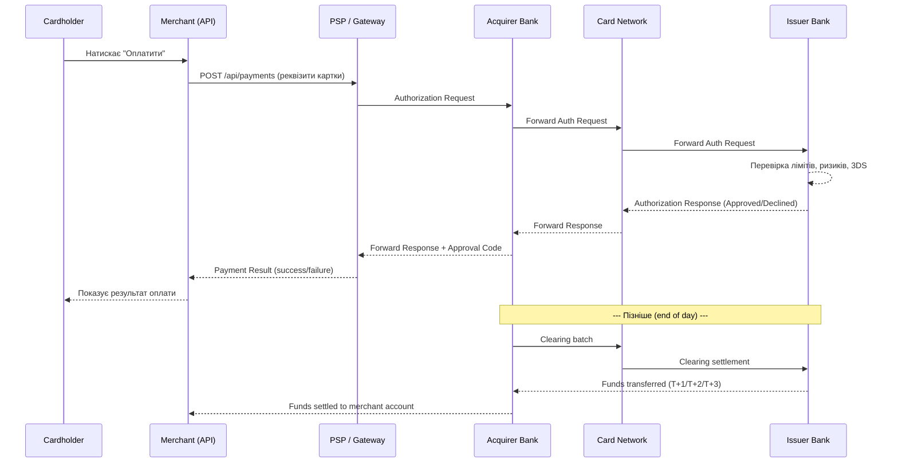

# Основи платіжної інфраструктури

## Що відбувається, коли ви натискаєте «Оплатити»?

Відкрийте будь-який сайт інтернет-магазину, покладіть товар у кошик і натисніть «Оплатити». Для користувача це одна дія — секунда очікування та повідомлення «Оплату успішно здійснено». Але за лаштунками за ці кілька секунд відбувається ціла оркестрація між щонайменше чотирма різними організаціями, кожна з яких виконує свою чітку роль.

Розробники, які вперше стикаються з платіжними інтеграціями, нерідко уявляють це спрощено: «відправляю картку PSP, він знімає гроші, повертає мені підтвердження». Реальність значно складніша, і розуміння цієї складності є **передумовою** для написання надійного, безпечного платіжного коду.

У цій статті ми пройдемо увесь шлях грошей — від моменту введення картки до зарахування коштів на рахунок продавця — і познайомимося з кожним учасником цього процесу.

---

## Учасники платіжного процесу

Платіжна індустрія побудована на **чотирьохсторонній моделі** (four-party model або four-corner model). Її ще називають моделлю Visa/Mastercard, оскільки саме ці мережі popularized її архітектуру.

::card-group

::card{title="Cardholder (власник картки)" icon="i-lucide-user"}

Особа, якій належить платіжна картка. Ініціює транзакцію, вводячи реквізити картки або прикладаючи її до терміналу.

Важливо: cardholder не є клієнтом еквайрингового банку — він є клієнтом банку-емітента.

::

::card{title="Merchant (продавець)" icon="i-lucide-store"}

Підприємство або фізична особа-підприємець, яка приймає платежі за товари чи послуги. Ваш ASP.NET-додаток — це і є система на боці merchant.

Merchant підписує договір із банком-еквайрером або PSP для прийому платежів.

::

::card{title="Issuer / Issuing Bank (банк-емітент)" icon="i-lucide-landmark"}

Банк, який видав картку власнику. Він несе відповідальність за авторизацію платежу: перевіряє ліміти, наявність коштів, ризики шахрайства та ухвалює рішення approve / decline.

Приклади: ПриватБанк, Monobank, ПУМБ — як емітенти для украінських карток.

::

::card{title="Acquirer / Acquiring Bank (банк-еквайрер)" icon="i-lucide-building-2"}

Банк, який обслуговує продавця. Отримує запит на авторизацію від merchant і передає його далі через картограму до банку-емітента.

Після успішної транзакції кошти осідають спочатку у еквайрера, а потім перераховуються на рахунок merchant.

::

::card{title="Card Network / Payment Scheme (картова мережа)" icon="i-lucide-network"}

Інфраструктура, що з'єднує всі банки між собою. Встановлює правила, стандарти та маршрутизує транзакції між емітентом та еквайрером.

Приклади: **Visa**, **Mastercard**, **ПРОСТІР** (українська національна система).

::

::card{title="PSP / Payment Gateway (провайдер платіжних послуг)" icon="i-lucide-zap"}

Посередник між merchant та картовою мережею. Спрощує інтеграцію для розробників: надає API, веб-форми, SDK, обробляє криптографію та дотримання стандартів PCI DSS.

Приклади: **LiqPay**, **Monobank Acquiring**, **Stripe**, **Fondy**, **WayForPay**.

::

::

---

## Різниця між Gateway, Processor та PSP

Ці три терміни часто вживають як синоніми, але між ними є важлива семантична різниця:

| Термін | Роль | Аналог |
|---|---|---|
| **Payment Gateway** | Технічний «міст» між вашим сайтом та процесором. Шифрує та передає дані транзакції. | «Транслятор» |
| **Payment Processor** | Виконує фактичну обробку транзакції між банком-еквайрером та банком-емітентом. | «Виконавець» |
| **PSP (Payment Service Provider)** | Надає комплексну послугу: gateway + processing + acquiring (часто все в одному). | «Підрядник під ключ» |

::note
На практиці більшість сучасних провайдерів (LiqPay, Stripe) є **PSP**: вони поєднують функції gateway та processor і мають власні або партнерські еквайрингові банки. Розробнику достатньо розуміти, що він працює саме з PSP — єдиною точкою відповідальності.
::

---

## Шлях платежу: Authorization → Clearing → Settlement

Платіж — це не одноразова дія, а **процес з трьох фаз**. Розуміння цих фаз критично для коректної реалізації логіки повернень і для роботи з різними статусами транзакцій.

### Фаза 1: Авторизація (Authorization)

Авторизація — це **бронювання** коштів на рахунку власника картки. На цьому етапі гроші ще не перейшли до продавця.

Що відбувається:
1. Cardholder вводить реквізити на вашому сайті
2. PSP шифрує дані та надсилає запит до еквайрера
3. Еквайрер передає запит через картову мережу (Visa/Mastercard) до банку-емітента
4. Банк-емітент перевіряє: ліміти, наявність коштів, ризики шахрайства, 3-D Secure
5. Емітент повертає **Approval Code** або відмову (decline code)
6. Відповідь проходить той самий шлях назад
7. Ваш додаток отримує результат: `approved`/`declined`

::note
Авторизований платіж — це лише **резервування**. Кошти заблоковані на картці, але ще не передані продавцю.
::

### Фаза 2: Клірінг (Clearing)

Клірінг — це **взаєморозрахунок** між банками. Відбувається в кінці операційного дня (batch processing). Еквайрер і емітент обмінюються записами про всі транзакції дня, підтверджуючи, кому скільки перерахувати.

### Фаза 3: Розрахунок (Settlement)

Розрахунок — це **фактичне переміщення грошей**: емітент перераховує кошти еквайреру, еквайрер — продавцю (за вирахуванням комісій). Цей процес займає від 1 до 3 робочих днів (T+1, T+2, T+3).

::mermaid

::

---

## Комісійна модель

Кожна транзакція несе в собі кілька рівнів комісій:

**Interchange Fee (interchange rate)** — основна комісія, яку еквайрер сплачує емітенту. Встановлюється картовими мережами та залежить від типу картки (debit/credit), типу бізнесу, регіону. Зазвичай 0.2–2% від суми транзакції.

**Scheme Fee (Assessment Fee)** — невелика комісія на користь самої картової мережі (Visa/Mastercard). Зазвичай 0.01–0.04%.

**Merchant Discount Rate (MDR)** — загальна ставка, яку продавець сплачує PSP. Включає interchange + scheme fee + маржу PSP. Зазвичай 1.5–3.5% для онлайн-транзакцій.

::note
У стандартній інтеграції розробник не налаштовує комісії — це частина договору з PSP. Але розуміти модель важливо, щоб пояснити фінансовій команді, чому сума settlement завжди менша за суму продажів.
::

---

## Особливості українського ринку

### Регулятор: Національний банк України (НБУ)

Платіжна діяльність в Україні регулюється **НБУ** відповідно до Закону України «Про платіжні послуги» (від 30.06.2021, набрав чинності з 01.08.2022). Усі платіжні установи зобов'язані мати ліцензію НБУ.

### Національна платіжна система ПРОСТІР

**ПРОСТІР** — українська національна платіжна система, запущена 2016 року. Картки ПРОСТІР видаються низкою банків. Особливість: транзакції між картками ПРОСТІР проходять виключно через українські вузли (без Visa/Mastercard), що має значення для розрахунків під час форс-мажорних ситуацій.

### Провайдери, актуальні для українського ринку

::card-group

::card{title="LiqPay" icon="i-simple-icons-privatbank"}

Платіжний сервіс ПриватБанку. Найбільша інтеграційна база в Україні, підтримка ПРОСТІР, Apple Pay, Google Pay, кредит «Оплата частинами».

::

::card{title="Monobank Acquiring" icon="i-lucide-smartphone"}

B2B-продукт Monobank. Простий REST API, підтримка QR-інвойсів, конкурентні тарифи.

::

::card{title="Stripe" icon="i-simple-icons-stripe"}

Міжнародний стандарт. Доступний в Україні після 2022 року (для ФОП та юросіб). Найкраща DX, але потребує реєстрації юридичної особи.

::

::card{title="WayForPay / Fondy" icon="i-lucide-credit-card"}

Незалежні українські PSP. Підтримують широкий спектр методів оплати, актуальні для e-commerce.

::

::

---

## Терміни, які потрібно знати

::accordion
::accordion-item{label="Capture (захоплення коштів)" icon="i-lucide-circle-help"}
Операція, що завершує авторизацію та ініціює переміщення заброньованих коштів. Деякі PSP виконують **pre-authorization + capture** як дві окремі дії (наприклад, для готелів або прокату авто).
::
::accordion-item{label="Void (відміна авторизації)" icon="i-lucide-circle-help"}
Відміна авторизованого (але ще не захопленого) платежу. Не вимагає перерахунку коштів — лише знімає бронь. На відміну від refund, void проводиться того ж дня.
::
::accordion-item{label="Refund (повернення коштів)" icon="i-lucide-circle-help"}
Повернення вже захоплених/розрахованих коштів покупцю. Технічно — це нова зворотня транзакція. Може бути повним або частковим. Займає від 1 до 5 робочих днів для покупця.
::
::accordion-item{label="Chargeback (опротестування)" icon="i-lucide-circle-help"}
Примусове повернення коштів покупцю, ініційоване банком-емітентом. Відбувається, коли покупець оскаржує транзакцію. Для продавця небажане: несе штрафи та ризик втрати партнерства з PSP.
::
::accordion-item{label="Tokenization (токенізація)" icon="i-lucide-circle-help"}
Замінення чутливих даних картки (номер, CVV) на безпечний токен. Токен безцінний для зловмисника, але дозволяє виконувати повторні платежі. Реалізується PSP.
::
::accordion-item{label="3-D Secure (3DS)" icon="i-lucide-circle-help"}
Протокол додаткової автентифікації покупця. Версія 2.x (EMV 3DS) використовує risk-based authentication — часто проходить «непомітно» для користувача. Значно знижує ризик chargeback.
::
::

---

## Практичні завдання

::steps

### Рівень 1: Розуміння понять

**Завдання 1.1**: Намалюйте (вручну або в будь-якому інструменті) схему чотирьохстороннього платіжного процесу для сценарію: купівля піцци на сайті за карткою Monobank (емітент) через Fondy (PSP/еквайрер). Вкажіть усіх учасників та напрямки потоків даних.

**Завдання 1.2**: Знайдіть на сайті НБУ реєстр платіжних установ та перелічіть три компанії, що мають ліцензію на надання платіжних послуг в Україні. [Реєстр НБУ](https://www.bank.gov.ua/ua/payments/payment-system/register)

### Рівень 2: Аналіз та порівняння

**Завдання 2.1**: Порівняйте тарифи LiqPay, Monobank Acquiring та одного українського PSP на ваш вибір для сценарію: інтернет-магазин одягу, середній чек 1500 грн, 200 транзакцій на місяць. Яку суму комісій сплатить продавець за місяць у кожному варіанті?

**Завдання 2.2**: Знайдіть у документації Stripe, які типи карток підтримуються для України. Чи доступний Stripe в режимі live для ФОП на загальній системі оподаткування?

### Рівень 3: Дизайн системи

**Завдання 3.1**: Для уявного SaaS-сервісу (підписки по 500 грн/місяць, 1000 активних підписників на українському ринку) запропонуйте платіжну стратегію. Які PSP обрати, як обробляти невдалі платежі, яким буде flow повторного списання? Обґрунтуйте вибір.

::

---

## Підсумок

Онлайн-платіж — це складна взаємодія між чотирма сторонами (cardholder, merchant, issuer, acquirer) через картову мережу. Розробники зазвичай не взаємодіють напряму з банками — для цього існують PSP (LiqPay, Monobank, Stripe), які абстрагують складність. Платіж проходить три фази: **авторизацію** (бронювання коштів), **клірінг** (міжбанківський взаєморозрахунок) та **розрахунок** (фактичний переказ). Знання цих деталей — фундамент для правильного проєктування платіжних модулів та розуміння статусів транзакцій.
