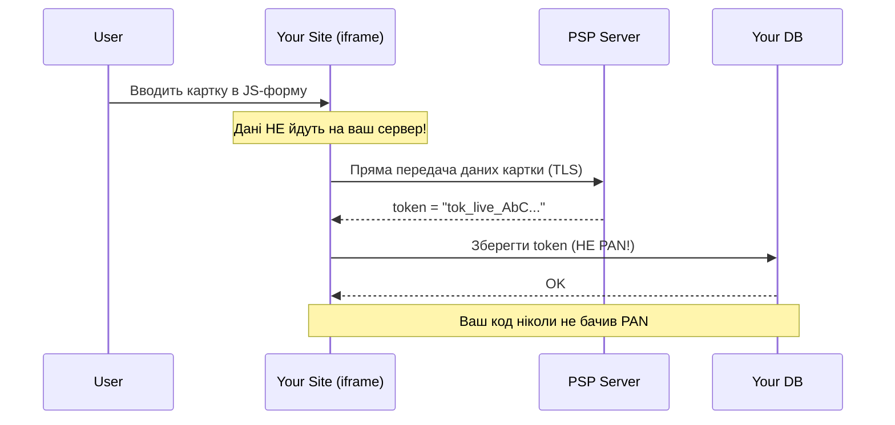

# PCI DSS та безпека платежів

## Найдорожча помилка в кар'єрі розробника

Розробник нового стартапу вирішує «зекономити час» та зберегти номери карток клієнтів у власній базі даних — без шифрування, для «майбутніх повторних покупок». Через рік стається витік. Компанія отримує штраф від Visa/Mastercard у розмірі від $50,000 до $500,000, втрачає право приймати картки та зазнає репутаційної катастрофи.

Це не гіпотетичний сценарій — це реальна модель покарання у платіжній індустрії. Стандарт **PCI DSS** (Payment Card Industry Data Security Standard) існує саме для того, щоб такі ситуації не виникали. І знаємо щось, що полегшить вашу відповідальність: **більшість розробників ніколи не повинні бачити дані карток**.

---

## Що таке PCI DSS

**PCI DSS** (Payment Card Industry Data Security Standard) — це набір вимог безпеки, розроблених спільно Visa, Mastercard, American Express, Discover та JCB у рамках організації **PCI Security Standards Council (PCI SSC)**. Стандарт застосовується до **всіх** організацій, які зберігають, обробляють або передають дані платіжних карток.

Поточна версія — **PCI DSS 4.0** (вийшла у березні 2022 року, обов'язкова з березня 2024 року).

Стандарт складається з **12 основних вимог**, згрупованих у 6 цілей:

| Мета | Вимоги |
|---|---|
| Побудова та підтримка захищеної мережі | 1. Мережеві засоби захисту, 2. Безпечна конфігурація |
| Захист даних власника картки | 3. Захист збережених даних, 4. Шифрування при передачі |
| Управління вразливостями | 5. Захист від шкідливого ПЗ, 6. Безпечна розробка |
| Сильний контроль доступу | 7. Обмеження доступу, 8. Ідентифікація та автентифікація, 9. Фізичний захист |
| Моніторинг та тестування мереж | 10. Логування та моніторинг, 11. Регулярне тестування безпеки |
| Політика інформаційної безпеки | 12. Корпоративна політика безпеки |

::warning
PCI DSS — це не рекомендація. Порушення вимог може призвести до: штрафів від до $100,000/місяць, заборони приймати картки та юридичної відповідальності у разі компрометації даних.
::

---

## Рівні відповідності (Compliance Levels)

Рівень відповідності визначається **обсягом транзакцій** на рік і впливає на те, який тип аудиту потрібен.

| Рівень | Умова (Visa) | Вимога |
|---|---|---|
| **Level 1** | >6 млн транзакцій/рік або компанія після витоку | Щорічний аудит QSA (Qualified Security Assessor) |
| **Level 2** | 1–6 млн транзакцій/рік | Щорічний SAQ + квартальне сканування мережі |
| **Level 3** | 20K–1 млн e-commerce транзакцій/рік | SAQ + квартальне сканування мережі |
| **Level 4** | <20K e-commerce або <1 млн інших | SAQ (самооцінка) |

Більшість стартапів та середніх e-commerce проєктів потрапляють на **рівень 4** — і саме для них найважливіший інструмент — **SAQ (Self-Assessment Questionnaire)**.

### Типи SAQ: яка форма потрібна вам

| Тип SAQ | Сценарій | Кількість питань |
|---|---|---|
| **SAQ-A** | Hosted payment page PSP, ніяких карткових даних взагалі | ~22 |
| **SAQ-A-EP** | Redirect на PSP, але ваш сайт «торкається» payment flow | ~191 |
| **SAQ-B** | Тільки POS-термінали, без електронної комерції | ~41 |
| **SAQ-C** | Payment application через інтернет, без збереження даних | ~160 |
| **SAQ-D** | All others: зберігаєте дані карток або повний API | ~329 |

::tip
**Ціль кожного розробника**: потрапити в **SAQ-A**. Це означає, що ваш додаток взагалі не «торкається» даних карток — вся обробка відбувається на стороні PSP. Як цього досягнути — далі.
::

---

## Принцип «Не торкайся даних карток»

Це найважливіший практичний принцип для розробників. Якщо ваш додаток ніколи не бачить PAN (номер картки), CVV, PIN — більшість вимог PCI DSS просто не застосовуються до вашого коду.

### Три моделі інтеграції за рівнем ризику

::tabs

::tabs-item{label="SAQ-A: Hosted Page (рекомендовано)"}

Користувач перенаправляється на **захищену сторінку PSP** для введення реквізитів. Ваш сервер взагалі не отримує карткових даних.

**Flow:**
1. Ваш бекенд створює сесію оплати через API PSP
2. Користувач перенаправляється на `pay.liqpay.ua` або `stripe.com/checkout`
3. PSP обробляє платіж
4. PSP повертає результат через redirect або webhook

**Переваги:**
- Мінімальна відповідальність (SAQ-A)
- Безпеку підтримує PSP (вони Level 1!)
- Швидка інтеграція

**Недоліки:**
- Менший контроль над UX (branded page PSP)
- Redirect відволікає користувача

::

::tabs-item{label="SAQ-A-EP: Embedded JS Form"}

Форма введення картки відображається **на вашому сайті**, але реалізована JavaScript-бібліотекою PSP. Ваш JS-код не має доступу до введених даних — лише iframe або shadow DOM.

**LiqPay Checkout Widget** — JavaScript-компонент, що вставляється в ваш HTML, але обробляє дані на серверах LiqPay.

**Stripe Elements** — набір pre-built React/JS-компонентів, де введені дані одразу токенізуються на сервері Stripe.

**SAQ-A-EP вимагає додаткової увагу до:**
- Цілісності JS-файлів PSP (Subresource Integrity)
- Content Security Policy (CSP) заголовків
- Відсутності кастомного JS, що зчитує поля форми

::

::tabs-item{label="SAQ-D: Direct API (уникайте)"}

Ваш сервер **напряму отримує** реквізити картки від клієнта (номер PAN, CVV, expiry) та передає їх PSP через API.

**Ніколи не робіть це**, якщо у вас немає:
- Виділеної команди з безпеки
- Повного PCI DSS аудиту Level 1/2
- Юридичного відділу та страховки

**Що означає SAQ-D:**
- 329 питань самооцінки
- Обов'язкове шифрування бази даних
- Термінали для введення PIN — окремий клас вимог

::

::

---

## Токенізація (Tokenization)

**Токенізація** — це заміна чутливих даних (номер картки) на **непрозорий токен**, який безпечно зберігати та передавати. Токен не містить математичного зв'язку з оригінальними даними, тому навіть при витоку токен марний для зловмисника.

```
Реальний PAN:  4111 1111 1111 1111
Токен:         tok_live_AbCxYzQ1r2s3t4u5...
```

PSP зберігають відповідність `токен → PAN` у власній захищеній системі **Token Vault**. Ви отримуєте токен і використовуєте його для:
- Повторних списань (рекурентні платежі)
- Відображення замасковного PAN користувачу (`**** **** **** 1111`)
- Скасування та повернень коштів

**У вашій базі даних** зберігається **лише токен** — НЕ картка. Це ключова різниця.

::mermaid



::

---

## 3-D Secure (3DS)

**3-D Secure** — протокол додаткової автентифікації власника картки. Назва «3-D» відображає трьох учасників: платіжну мережу, банк-емітент та банк-еквайрер.

### Версії 3DS

**3DS 1.0** (застарілий): завжди відображав додатковий екран підтвердження (SMS-код або карткова сторінка банку). Низька конверсія через погану UX.

**3DS 2.x (EMV 3DS)** (сучасний): використовує **risk-based authentication (RBA)**. Банк-емітент аналізує десятки факторів ризику (пристрій, локація, сума, поведінка) та у більшості випадків підтверджує платіж **без втручання користувача** (frictionless flow).

### Frictionless vs Challenge flow

```
Frictionless (80–90% транзакцій):
User → Cart → Pay → ✅ Done (без додаткових дій)

Challenge flow (10–20% транзакцій):
User → Cart → Pay → 📱 SMS/Push від банку → Підтвердження → ✅ Done
```

::tip
3-D Secure захищає продавця від chargeback: якщо 3DS пройдено, відповідальність за шахрайські операції переходить на банк-емітент. Це «liability shift» — важливий фінансовий аргумент на користь 3DS.
::

**Реалізація:** При інтеграції через PSP (LiqPay, Monobank, Stripe) — 3DS обробляється автоматично. Вам потрібно лише коректно обробити `action_url` від PSP, якщо emitted заклик на challenge.

---

## Що можна і не можна зберігати в БД

| Дані | Можна зберігати | Примітка |
|---|---|---|
| PAN (повний номер картки) | ❌ Ніколи | Лише PSP |
| CVV/CVC/CVV2 | ❌ Ніколи навіть тимчасово | Суворо заборонено PCI DSS |
| PIN | ❌ Ніколи | |
| Токен PSP | ✅ Так | Основний ідентифікатор картки |
| Замасковний PAN (`**** 1234`) | ✅ Так | Для відображення в UI |
| Термін дії (MM/YY) | ⚠️ Обережно | Лише разом з токеном, без PAN |
| Ім'я власника | ✅ Так | Не є захищеними даними картки |
| ID транзакції, сума, статус | ✅ Так | Завжди |

---

## Логування: що маскувати

Один з найпоширеніших векторів витоку — **логи**. Розробник додає `_logger.LogInformation($"Payment request: {JsonSerializer.Serialize(request)}")` — і дані картки потрапляють у файли логів.

**Правило:** Ніколи не логуйте об'єкти запитів до PSP без явного маскування.

```csharp [PaymentLoggingHelper.cs]
public static string MaskSensitiveData(string json)
{
    // Маскуємо типові поля карткових даних
    return Regex.Replace(json,
        @"(""card_number""\s*:\s*"")(\d{6})\d+(\d{4})("")",
        "$1$2******$3$4");
}
```

::warning
Сучасні PSP ніколи не передають PAN у відповідях API — лише токени та замасковані значення. Якщо PSP повертає повний номер картки — це червоний прапор.
::

---

## Підсумок

PCI DSS — це не бюрократія, це система захисту, яка evolved під реальні загрози. Для більшості розробників ключовий висновок простий: **делегуйте обробку карткових даних PSP через Hosted Page або Embedded JS Form** (SAQ-A або SAQ-A-EP). Зберігайте лише токени, ніколи не логуйте реквізити. 3-D Secure 2.x позбавляє вас від відповідальності за chargeback і покращує безпеку з мінімальним впливом на конверсію.

## Практичні завдання

::steps

### Рівень 1: Самооцінка

**Завдання 1.1**: Пройдіть онлайн-версію SAQ-A на сайті PCI SSC ([pcisecuritystandards.org](https://www.pcisecuritystandards.org)) та зафіксуйте 5 питань, які здалися вам найважливішими. Що вони перевіряють?

**Завдання 1.2**: Знайдіть у відкритих звітах або новинах реальний кейс витоку платіжних даних (Data Breach). Яка технічна причина? Якого рівня SAQ виявилося недостатньо?

### Рівень 2: Практична безпека

**Завдання 2.1**: Напишіть C#-клас `PaymentDataMasker` з двома методами:
- `MaskPan(string pan)` → повертає `"**** **** **** 1234"` (лише останні 4 цифри)
- `SanitizeLogObject(object request)` → серіалізує об'єкт у JSON, замінюючи значення полів `card_number`, `cvv`, `pin` на `"[MASKED]"`

**Завдання 2.2**: Налаштуйте `Content-Security-Policy` для ASP.NET Minimal API, що дозволяє завантажувати JS лише з `'self'` та `checkout.liqpay.ua`. Де потрібно це налаштувати і чому це важливо для SAQ-A-EP?

### Рівень 3: Архітектурне рішення

**Завдання 3.1**: Спроєктуйте схему БД для зберігання платіжних методів користувача з дотриманням PCI DSS. Таблиця `payment_methods` має зберігати: токен PSP, замасковний PAN, термін дії, ім'я PSP (stripe/liqpay), прапор is_default. Напишіть EF Core entity та пояснення, чому саме такий набір полів.

::

