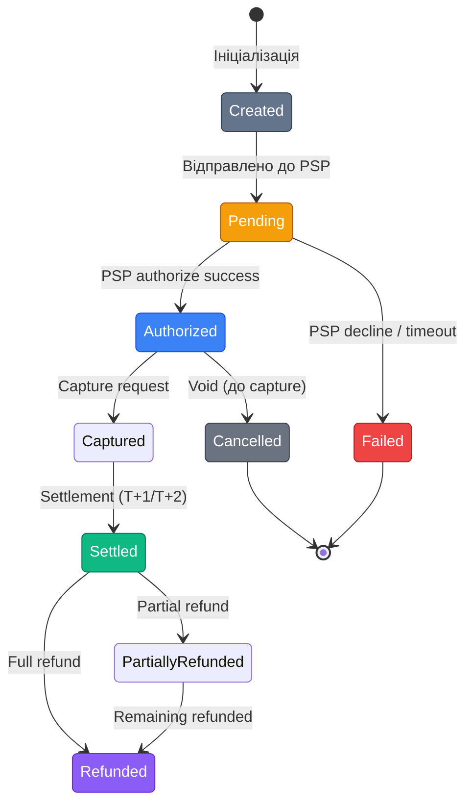

# Архітектура платіжної підсистеми

## Чому платіжний код особливий

Платіжний код відрізняється від решти бізнес-логіки одним критичним фактором: **помилки мають фінансові наслідки**. Подвійне списання, загублений webhook, неправильний статус транзакції — все це може призвести до реальних грошових втрат для бізнесу або клієнта.

Розробники, які проєктують платіжні модулі як звичайні CRUD-контролери, рано чи пізно стикаються з одним з цих сценаріїв:
- Мережева помилка під час виклику PSP: платіж пройшов чи ні?
- PSP надіслав дублікат webhook: кошти будуть повернуті двічі?
- Клієнт натиснув «Оплатити» двічі: дві транзакції залишилися в базі?

У цій статті ми спроєктуємо архітектуру, яка **захищає від цих сценаріїв**.

---

## Domain Model (Доменна модель)

Почнемо з визначення сутностей, з якими працює платіжна підсистема. Ці сутності відповідають реальним бізнес-концепціям, а не таблицям бази даних.

### Order vs Payment vs Transaction

Три поняття, які часто плутають:

**Order (замовлення)** — бізнес-сутність, що описує, що саме купує клієнт. Замовлення існує незалежно від того, чи оплачене воно.

**Payment (платіж)** — намір оплатити конкретне замовлення. Один Order може мати кілька Payment-спроб (перша картка відмовила → спробували другу).

**Transaction (транзакція)** — конкретний технічний запит до PSP. Один Payment зазвичай відповідає одній Transaction, але при повторних спробах їх може бути кілька.

```
Order 1001
  └── Payment (спроба 1): ID=pay_abc → declined
  └── Payment (спроба 2): ID=pay_def → success
        └── Transaction: ID=txn_xyz (авторизація)
        └── Transaction: ID=txn_refund (повернення) ← пізніше
```

### EF Core entities

```csharp [Entities/Payment.cs]
public class Payment
{
    public Guid Id { get; set; }
    public Guid OrderId { get; set; }
    public Order Order { get; set; } = null!;

    public decimal Amount { get; set; }
    public string Currency { get; set; } = "UAH";

    // Провайдер: "liqpay", "monobank", "stripe"
    public string Provider { get; set; } = null!;

    // ID транзакції на стороні PSP
    public string? ProviderTransactionId { get; set; }

    public PaymentStatus Status { get; set; }

    // Зберігаємо raw webhook payload для аудиту
    public string? LastWebhookPayload { get; set; }

    public DateTimeOffset CreatedAt { get; set; }
    public DateTimeOffset UpdatedAt { get; set; }

    // Ключ ідемпотентності
    public string IdempotencyKey { get; set; } = null!;
}
```

Зверніть увагу на кілька важливих деталей цієї моделі:

- `Provider` зберігається як рядок (не enum), що дозволяє легко додавати нових провайдерів без міграцій
- `ProviderTransactionId` — зовнішній ключ від PSP, критичний для пошуку транзакцій при обробці webhook
- `LastWebhookPayload` — зберігаємо сирий payload для аудиту та дебагінгу
- `IdempotencyKey` — унікальний ключ для запобігання дублювань (деталі нижче)

---

## Payment State Machine (Стан-машина платежу)

Платіж — це **не булеве значення** `isPaid: true/false`. Це об'єкт, що проходить через кілька станів, і кожен перехід має правила та тригери.

```csharp [Enums/PaymentStatus.cs]
public enum PaymentStatus
{
    Created,      // Щойно створений, ще не відправлений до PSP
    Pending,      // Відправлений до PSP, очікуємо відповідь
    Authorized,   // Авторизований (кошти зарезервовані)
    Captured,     // Кошти захоплені (для провайдерів з preauth)
    Settled,      // Успішно розрахований
    Failed,       // Відхилений PSP або банком-емітентом
    Cancelled,    // Скасований до авторизації (void)
    Refunded,     // Повернений (повністю)
    PartiallyRefunded // Частково повернений
}
```

::mermaid



::

Важливо: стан-машина має правила переходів. `Settled → Pending` — неможливий перехід. Реалізуйте захист:

```csharp [Services/PaymentStateMachine.cs]
public static class PaymentStateMachine
{
    private static readonly Dictionary<PaymentStatus, HashSet<PaymentStatus>> _validTransitions = new()
    {
        [PaymentStatus.Created]    = [PaymentStatus.Pending],
        [PaymentStatus.Pending]    = [PaymentStatus.Authorized, PaymentStatus.Failed],
        [PaymentStatus.Authorized] = [PaymentStatus.Captured, PaymentStatus.Cancelled],
        [PaymentStatus.Captured]   = [PaymentStatus.Settled],
        [PaymentStatus.Settled]    = [PaymentStatus.Refunded, PaymentStatus.PartiallyRefunded],
        [PaymentStatus.PartiallyRefunded] = [PaymentStatus.Refunded],
    };

    public static bool CanTransition(PaymentStatus from, PaymentStatus to)
        => _validTransitions.TryGetValue(from, out var allowed) && allowed.Contains(to);

    public static void EnsureTransition(PaymentStatus from, PaymentStatus to)
    {
        if (!CanTransition(from, to))
            throw new InvalidOperationException(
                $"Invalid payment state transition: {from} → {to}");
    }
}
```

---

## Ідемпотентність (Idempotency)

Ідемпотентність — властивість операції, яка при повторному виконанні з тими самими параметрами дає той самий результат і не спричиняє нових ефектів.

**Чому це критично для платежів?** Розглянемо сценарій:

1. Клієнт натискає «Оплатити»
2. Ваш сервер надсилає `POST /api/payment` до PSP
3. PSP обробляє платіж — списує кошти
4. Мережева помилка: відповідь від PSP **не дійшла** до вашого сервера
5. Ваш таймаут спрацьовує → помилка 504
6. Клієнт бачить помилку і натискає «Оплатити» ще раз
7. Другий запит → друге списання → **дублікат**

Це не гіпотетичний крайній випадок. Це відбувається при повільних мережах, DDoS, деплоях.

### Idempotency Key (ключ ідемпотентності)

Рішення — унікальний ключ для кожного платежу, що передається PSP та зберігається у вашій БД.

```csharp [Services/PaymentService.cs]
public async Task<Payment> CreatePaymentAsync(CreatePaymentRequest request)
{
    // Генеруємо або використовуємо переданий ключ
    var idempotencyKey = request.IdempotencyKey
        ?? $"order_{request.OrderId}_{Guid.NewGuid():N}";

    // Перевіряємо: чи вже існує платіж з цим ключем?
    var existing = await _db.Payments
        .FirstOrDefaultAsync(p => p.IdempotencyKey == idempotencyKey);

    if (existing is not null)
    {
        // Повертаємо існуючий платіж — ідемпотентна відповідь
        _logger.LogInformation(
            "Idempotent payment request detected. Returning existing payment {PaymentId}",
            existing.Id);
        return existing;
    }

    // Створюємо новий платіж
    var payment = new Payment
    {
        Id = Guid.NewGuid(),
        OrderId = request.OrderId,
        Amount = request.Amount,
        IdempotencyKey = idempotencyKey,
        Status = PaymentStatus.Created,
        CreatedAt = DateTimeOffset.UtcNow
    };

    _db.Payments.Add(payment);
    await _db.SaveChangesAsync();

    return payment;
}
```

Рядок 7–14: перевірка наявності платежу з тим самим ключем. Якщо знайдено — повертаємо без нового запиту до PSP. Це і є ідемпотентність.

---

## Патерн Strategy: підтримка кількох провайдерів

Ваш бізнес може захотіти підтримувати LiqPay для українських клієнтів та Stripe для іноземних. Або переключитися з одного PSP на інший. Патерн **Strategy** дозволяє змінювати логіку без зміни загальної структури.

### Інтерфейс `IPaymentProvider`

```csharp [Abstractions/IPaymentProvider.cs]
public interface IPaymentProvider
{
    // Унікальна назва провайдера: "liqpay", "monobank", "stripe"
    string ProviderName { get; }

    /// <summary>
    /// Ініціює платіж. Повертає URL для redirect або токен форми.
    /// </summary>
    Task<CreatePaymentResult> CreatePaymentAsync(
        PaymentRequest request,
        CancellationToken ct = default);

    /// <summary>
    /// Перевіряє поточний статус транзакції на стороні PSP.
    /// </summary>
    Task<PaymentStatusResult> GetPaymentStatusAsync(
        string providerTransactionId,
        CancellationToken ct = default);

    /// <summary>
    /// Ініціює повернення коштів (повне або часткове).
    /// </summary>
    Task<RefundResult> RefundAsync(
        string providerTransactionId,
        decimal amount,
        CancellationToken ct = default);

    /// <summary>
    /// Верифікує підпис вхідного webhook та парсить payload.
    /// </summary>
    Task<WebhookResult> ProcessWebhookAsync(
        HttpRequest request,
        CancellationToken ct = default);
}
```

### DTOs для провайдерів

```csharp [Abstractions/PaymentDtos.cs]
public record PaymentRequest(
    Guid PaymentId,
    decimal Amount,
    string Currency,
    string Description,
    string ReturnUrl,
    string CallbackUrl,
    string IdempotencyKey
);

public record CreatePaymentResult(
    bool Success,
    string? CheckoutUrl,    // Redirect URL для Hosted Page
    string? FormData,       // Base64 data для embedded форми (LiqPay)
    string? ProviderPaymentId,
    string? ErrorMessage
);

public record PaymentStatusResult(
    bool Success,
    PaymentStatus Status,
    string? ProviderTransactionId,
    string? ErrorMessage
);

public record RefundResult(
    bool Success,
    string? RefundId,
    string? ErrorMessage
);

public record WebhookResult(
    bool IsValid,
    PaymentStatus? NewStatus,
    string? ProviderTransactionId,
    string? ErrorMessage,
    object? RawPayload
);
```

### Реєстрація провайдерів через DI

```csharp [Extensions/PaymentServiceExtensions.cs]
public static IServiceCollection AddPaymentProviders(
    this IServiceCollection services,
    IConfiguration configuration)
{
    services.AddScoped<LiqPayPaymentProvider>();
    services.AddScoped<MonobankPaymentProvider>();
    services.AddScoped<StripePaymentProvider>();

    // Фабрика провайдерів: вибір за назвою
    services.AddScoped<IPaymentProviderFactory, PaymentProviderFactory>();

    return services;
}
```

```csharp [Services/PaymentProviderFactory.cs]
public interface IPaymentProviderFactory
{
    IPaymentProvider GetProvider(string providerName);
}

public class PaymentProviderFactory : IPaymentProviderFactory
{
    private readonly IServiceProvider _serviceProvider;

    public PaymentProviderFactory(IServiceProvider serviceProvider)
        => _serviceProvider = serviceProvider;

    public IPaymentProvider GetProvider(string providerName) =>
        providerName switch
        {
            "liqpay"   => _serviceProvider.GetRequiredService<LiqPayPaymentProvider>(),
            "monobank" => _serviceProvider.GetRequiredService<MonobankPaymentProvider>(),
            "stripe"   => _serviceProvider.GetRequiredService<StripePaymentProvider>(),
            _ => throw new NotSupportedException($"Unknown payment provider: {providerName}")
        };
}
```

### Використання у сервісі

```csharp [Services/PaymentService.cs]
public class PaymentService
{
    private readonly IPaymentProviderFactory _providerFactory;
    private readonly AppDbContext _db;

    public async Task<string> InitiatePaymentAsync(Guid paymentId, string providerName)
    {
        var payment = await _db.Payments.FindAsync(paymentId)
            ?? throw new NotFoundException($"Payment {paymentId} not found");

        // Вибір провайдера без if/switch у бізнес-логіці
        var provider = _providerFactory.GetProvider(providerName);

        var request = new PaymentRequest(
            PaymentId: payment.Id,
            Amount: payment.Amount,
            Currency: payment.Currency,
            Description: $"Замовлення #{payment.OrderId}",
            ReturnUrl: "https://myapp.com/payment/result",
            CallbackUrl: "https://myapp.com/webhooks/payment",
            IdempotencyKey: payment.IdempotencyKey
        );

        var result = await provider.CreatePaymentAsync(request);

        if (!result.Success)
            throw new PaymentException(result.ErrorMessage);

        // Оновлюємо статус та зберігаємо ID від PSP
        payment.Status = PaymentStatus.Pending;
        payment.Provider = providerName;
        payment.ProviderTransactionId = result.ProviderPaymentId;
        payment.UpdatedAt = DateTimeOffset.UtcNow;

        PaymentStateMachine.EnsureTransition(PaymentStatus.Created, PaymentStatus.Pending);
        await _db.SaveChangesAsync();

        return result.CheckoutUrl!;
    }
}
```

---

## Структура проєкту

::code-tree

```csharp [Program.cs]
var builder = WebApplication.CreateBuilder(args);
builder.Services.AddPaymentProviders(builder.Configuration);
// ...
```

```csharp [Abstractions/IPaymentProvider.cs]
public interface IPaymentProvider { ... }
```

```csharp [Abstractions/PaymentDtos.cs]
public record PaymentRequest(...);
```

```csharp [Entities/Payment.cs]
public class Payment { ... }
```

```csharp [Enums/PaymentStatus.cs]
public enum PaymentStatus { ... }
```

```csharp [Services/PaymentService.cs]
public class PaymentService { ... }
```

```csharp [Services/PaymentStateMachine.cs]
public static class PaymentStateMachine { ... }
```

```csharp [Services/PaymentProviderFactory.cs]
public class PaymentProviderFactory : IPaymentProviderFactory { ... }
```

```csharp [Providers/LiqPay/LiqPayPaymentProvider.cs]
public class LiqPayPaymentProvider : IPaymentProvider { ... }
```

```csharp [Providers/Monobank/MonobankPaymentProvider.cs]
public class MonobankPaymentProvider : IPaymentProvider { ... }
```

```csharp [Providers/Stripe/StripePaymentProvider.cs]
public class StripePaymentProvider : IPaymentProvider { ... }
```

```csharp [Endpoints/PaymentEndpoints.cs]
public static class PaymentEndpoints { ... }
```

```csharp [Endpoints/WebhookEndpoints.cs]
public static class WebhookEndpoints { ... }
```

::

---

## Підсумок

Правильна архітектура платіжного модуля базується на трьох стовпах: **доменній моделі** з чітким розділенням Order/Payment/Transaction, **стан-машині платежу** з захищеними переходами між статусами та **ідемпотентності** як запобіжнику дублювань. Патерн Strategy через `IPaymentProvider` дозволяє підключати нових провайдерів без зміни бізнес-логіки. У наступних статтях ми реалізуємо конкретні провайдери на основі цих абстракцій.

## Практичні завдання

::steps

### Рівень 1: Базовий

**Завдання 1.1**: Реалізуйте метод `PaymentStateMachine.EnsureTransition` та напишіть 5 unit-тестів для нього, що перевіряють валідні та невалідні переходи.

**Завдання 1.2**: Доповніть entity `Payment` полями `RefundedAmount` (decimal?) та `FailureReason` (string?). Поясніть, яку інформацію вони зберігають та коли заповнюються.

### Рівень 2: Логіка

**Завдання 2.1**: Реалізуйте `PaymentService.CreatePaymentAsync` повністю, включаючи логіку ідемпотентності, запис у БД та валідацію вхідних даних.

**Завдання 2.2**: Напишіть `IPaymentProvider`-mock (`MockPaymentProvider`), що завжди повертає успішний платіж зі статусом `Settled`. Зареєструйте його в DI лише для `Development`-оточення.

### Рівень 3: Архітектура

**Завдання 3.1**: Розробіть систему **routing'у провайдерів**: якщо сума платежу < 100 грн використовується Monobank, інакше — LiqPay. Для клієнтів з країною отримання `UA` — LiqPay, для решти — Stripe. Реалізуйте `SmartPaymentProviderFactory` з конфігурованими правилами.

::

