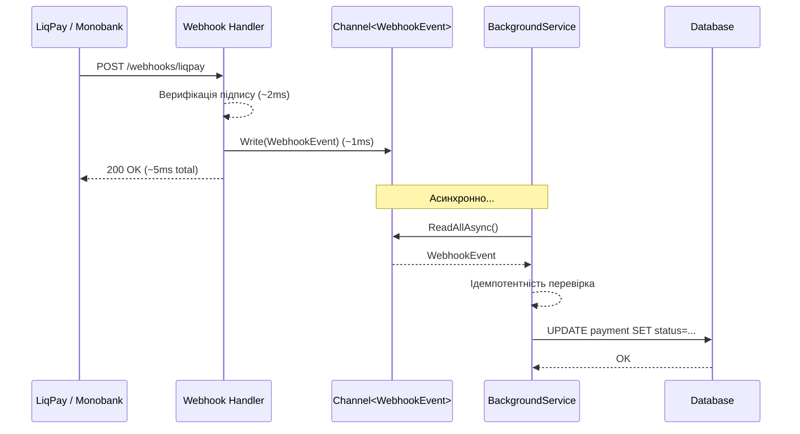

# Webhooks: глибоке занурення

## Чому платежі без webhook — це лотерея

Уявіть: користувач оплатив замовлення через LiqPay. Ваш сервер отримав відповідь «платіж ініційований» і перенаправив клієнта на сторінку «Дякуємо за покупку». Замовлення позначено як «Оплачено».

Але через 30 секунд банк-емітент відхилив транзакцію (insufficient funds стало зрозумілим лише після авторизації). Що тепер? Без webhook ваш сервер **ніколи не дізнається про відмову**.

Це фундаментальна проблема: **платіжна транзакція асинхронна**. Остаточне рішення від банку може прийти через секунди, хвилини, а іноді — через дні (для деяких методів). Webhook — це механізм, яким PSP повідомляє ваш сервер про зміну стану транзакції.

---

## Webhook vs Polling

Існує два підходи до отримання асинхронних даних від зовнішньої системи:

**Polling**: ваш сервер сам регулярно запитує PSP «чи змінився статус?».

```csharp
// Anti-pattern: polling кожні 5 секунд
while (!payment.IsTerminalStatus())
{
    await Task.Delay(5_000);
    var status = await liqPayClient.GetStatusAsync(payment.Id);
    // ...
}
```

**Webhook (Push model)**: PSP сам надсилає HTTP POST на ваш endpoint, коли відбувається подія.

| Критерій | Polling | Webhook |
|---|---|---|
| Затримка отримання | Висока (≥ інтервал) | Дуже низька (1–3 сек) |
| Навантаження на PSP | Висока | Мінімальна |
| Складність реалізації | Низька | Середня |
| Надійність | Висока (self-initiated) | Потребує retry |
| Рекомендованість | ❌ Anti-pattern | ✅ Стандарт |

::tip
**Гібридний підхід**: Webhook — основний механізм, Polling — резервний для «застряглих» транзакцій. Якщо webhook не прийшов протягом N хвилин → активний запит статусу. Це підхід Stripe.
::

---

## Анатомія webhook-запиту

Типовий webhook від платіжного PSP — це HTTP POST-запит:

```http
POST /webhooks/liqpay HTTP/1.1
Host: your-api.com
Content-Type: application/x-www-form-urlencoded
User-Agent: LiqPayAPI
X-Request-ID: abc123

data=eyJ2ZXJzaW9uIjozLCJhY3Rpb24...&signature=AbCdEfGhIj...
```

Кожен PSP має свій формат, але спільні елементи:
- **Унікальний ідентифікатор події**: дозволяє уникнути дублювання
- **Підпис**: криптографічне підтвердження автентичності
- **Event type**: тип події (payment.success, refund.created)
- **Payload**: дані про конкретну транзакцію

---

## Проблема дублікатів та ідемпотентна обробка

PSP надсилають webhook з **гарантією доставки**, але не з гарантією одноразової доставки. Якщо ваш сервер відповів `500` або не відповів — PSP надішле webhook **повторно**. Іноді — кілька разів.

**Наслідок без ідемпотентності**: webhook `payment.success` обробився двічі → замовлення marked as paid двічі → відправлено два підтвердження на email → можливо, видано два ліцензійних ключі.

### Рішення: таблиця оброблених webhook

```csharp [Entities/ProcessedWebhook.cs]
public class ProcessedWebhook
{
    public Guid Id { get; set; }

    // Унікальний ідентифікатор webhook від PSP
    // Для LiqPay: transaction_id
    // Для Monobank: invoiceId + status
    // Для Stripe: event.Id
    public string EventId { get; set; } = null!;

    public string Provider { get; set; } = null!;
    public DateTimeOffset ProcessedAt { get; set; }
}
```

```csharp [Services/WebhookIdempotencyService.cs]
public class WebhookIdempotencyService
{
    private readonly AppDbContext _db;

    public WebhookIdempotencyService(AppDbContext db) => _db = db;

    /// <summary>
    /// Повертає true, якщо webhook вже оброблено. Інакше — записує та повертає false.
    /// </summary>
    public async Task<bool> IsAlreadyProcessedAsync(
        string eventId, string provider, CancellationToken ct = default)
    {
        // Атомарна операція: INSERT OR IGNORE
        var exists = await _db.ProcessedWebhooks
            .AnyAsync(w => w.EventId == eventId && w.Provider == provider, ct);

        if (exists) return true;

        _db.ProcessedWebhooks.Add(new ProcessedWebhook
        {
            Id = Guid.NewGuid(),
            EventId = eventId,
            Provider = provider,
            ProcessedAt = DateTimeOffset.UtcNow
        });

        await _db.SaveChangesAsync(ct);
        return false;
    }
}
```

Використання в webhook-handler:

```csharp
var isAlreadyProcessed = await _idempotencyService
    .IsAlreadyProcessedAsync(transactionId, "liqpay", ct);

if (isAlreadyProcessed)
{
    _logger.LogInformation("Duplicate webhook {TxId} ignored", transactionId);
    return Results.Ok(); // Повертаємо OK — для PSP це нормально
}
```

---

## Retry Policy: що робити при недоступності сервера

PSP retry-поведінка варіюється:

| PSP | Максимум спроб | Інтервал |
|---|---|---|
| LiqPay | До 5 разів | ~5–60 хвилин |
| Monobank | До 5 разів | Exponential backoff |
| Stripe | 3 дні (з backoff) | 1 год → 3 год → 12 год → 24 год → ... |

**Ваша відповідальність**: відповідати `200 OK` якомога швидше і не виконувати важку бізнес-логіку синхронно у handler. 

---

## Channel-based обробка (рекомендований паттерн)

Найнадійніший підхід — **відокремити отримання webhook від його обробки**:

1. Webhook handler приймає запит, верифікує підпис, публікує подію в Channel → `200 OK` (за ~5ms)
2. Background service читає з Channel та виконує бізнес-логіку

```csharp [Services/WebhookChannel.cs]
public record WebhookEvent(
    string Provider,
    string EventId,
    string RawPayload,
    DateTimeOffset ReceivedAt
);

public class WebhookChannel
{
    private readonly Channel<WebhookEvent> _channel =
        Channel.CreateBounded<WebhookEvent>(new BoundedChannelOptions(100)
        {
            FullMode = BoundedChannelFullMode.Wait
        });

    public ChannelWriter<WebhookEvent> Writer => _channel.Writer;
    public ChannelReader<WebhookEvent> Reader => _channel.Reader;
}
```

```csharp [Services/WebhookProcessorService.cs]
public class WebhookProcessorService : BackgroundService
{
    private readonly WebhookChannel _channel;
    private readonly IServiceProvider _services;
    private readonly ILogger<WebhookProcessorService> _logger;

    public WebhookProcessorService(
        WebhookChannel channel,
        IServiceProvider services,
        ILogger<WebhookProcessorService> logger)
    {
        _channel = channel;
        _services = services;
        _logger = logger;
    }

    protected override async Task ExecuteAsync(CancellationToken stoppingToken)
    {
        await foreach (var evt in _channel.Reader.ReadAllAsync(stoppingToken))
        {
            try
            {
                await using var scope = _services.CreateAsyncScope();
                var paymentService = scope.ServiceProvider
                    .GetRequiredService<PaymentService>();

                await paymentService.ProcessWebhookEventAsync(evt);
            }
            catch (Exception ex)
            {
                _logger.LogError(ex,
                    "Error processing webhook event {EventId} from {Provider}",
                    evt.EventId, evt.Provider);
                // Не перекидуємо — продовжуємо читати з Channel
            }
        }
    }
}
```

```csharp [Program.cs]
builder.Services.AddSingleton<WebhookChannel>();
builder.Services.AddHostedService<WebhookProcessorService>();
```

Оновлений webhook handler — тепер публікує в Channel замість прямої обробки:

```csharp [Endpoints/WebhookEndpoints.cs]
private static async Task<IResult> HandleLiqPayWebhook(
    HttpRequest request,
    WebhookChannel channel,
    IOptions<LiqPayOptions> options,
    ILogger<Program> logger,
    CancellationToken ct)
{
    var form = await request.ReadFormAsync(ct);
    var data = form["data"].ToString();
    var signature = form["signature"].ToString();

    if (!LiqPaySignatureHelper.VerifySignature(data, signature, options.Value.PrivateKey))
    {
        logger.LogWarning("Invalid LiqPay webhook signature");
        return Results.Ok(); // Не 400 — щоб LiqPay не retry
    }

    // Публікуємо подію → Background Service обробить
    await channel.Writer.WriteAsync(new WebhookEvent(
        Provider: "liqpay",
        EventId: data, // тимчасово data як ID; краще — transaction_id після decode
        RawPayload: data,
        ReceivedAt: DateTimeOffset.UtcNow
    ), ct);

    // Відповідаємо негайно — важка логіка відбудеться асинхронно
    return Results.Ok();
}
```

::mermaid



::

---

## Безпека webhook endpoint

::card-group

::card{title="Верифікація підпису" icon="i-lucide-shield-check"}

Завжди першочергово. Без неї будь-хто може надіслати фейковий webhook про успішний платіж.

LiqPay: `SHA1`, Monobank: `ECDSA`, Stripe: `HMAC-SHA256`

::

::card{title="IP Whitelist" icon="i-lucide-network"}

Опціонально, але підвищує рівень захисту. LiqPay публікує список своїх IP. Проте IP можуть змінюватися — покладайтеся на підпис як основний захист.

::

::card{title="Timing Attack захист" icon="i-lucide-timer"}

Порівнюйте підписи через `CryptographicOperations.FixedTimeEquals`, а не через звичайне `==`. Звичайне порівняння завершується при першому невідповідному байті → зловмисник може вгадати підпис побайтово.

::

::card{title="Відповідь 200 при помилці підпису" icon="i-lucide-check-circle"}

Якщо повернути `401` — PSP буде retry нескінченно. Повертайте `200` і логуйте alert для команди безпеки.

::

::

---

## Тестування Webhooks

### Ngrok (LiqPay, Monobank)

```bash
ngrok http 5001
# Отримаємо: https://abc123.ngrok-free.app
# Використовуємо як server_url / webHookUrl
```

### Stripe CLI (Stripe)

```bash
# Перенаправляє webhook на локальний сервер без публічного URL
stripe listen --forward-to localhost:5001/webhooks/stripe --events checkout.session.completed,payment_intent.payment_failed

# Симуляція конкретної події вручну
stripe trigger checkout.session.completed
```

### Fake webhook для unit-тестів

```csharp [Tests/FakeWebhookTests.cs]
[Fact]
public async Task LiqPay_Webhook_Should_Update_Payment_Status()
{
    var factory = new WebApplicationFactory<Program>();
    var client = factory.CreateClient();

    // Формуємо валідний LiqPay webhook payload
    var payload = new { order_id = "test-payment-id", status = "success" };
    var data = LiqPaySignatureHelper.EncodeData(payload);
    var signature = LiqPaySignatureHelper.GenerateSignature(data, "test_private_key");

    var content = new FormUrlEncodedContent([
        new("data", data),
        new("signature", signature)
    ]);

    var response = await client.PostAsync("/webhooks/liqpay", content);

    response.StatusCode.Should().Be(HttpStatusCode.OK);
    // Перевіряємо, що статус платежу у БД оновився
}
```

---

## Підсумок

Webhook — це основний механізм отримання фінальних статусів транзакцій. Три ключових практики: **верифікація підпису** (захист від фальшивих webhook), **ідемпотентна обробка** (захист від дублювань) та **Channel-based async обробка** (миттєва відповідь PSP + надійна обробка в фоні). Правильно реалізований webhook-handler — це фундамент надійної платіжної системи.
