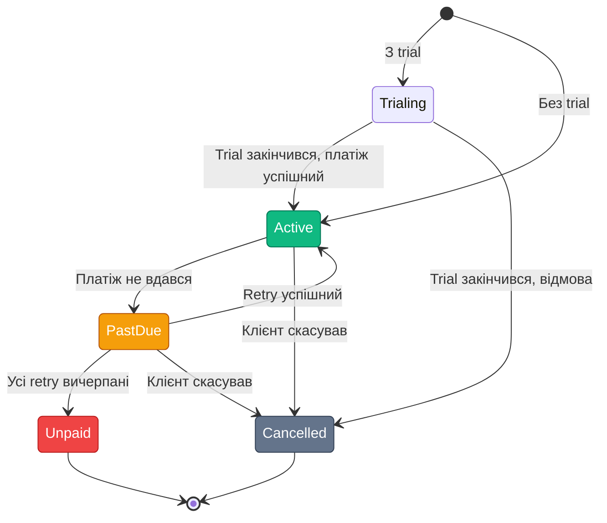

# Підписки та рекурентні платежі

## Чому підписки — найскладніший тип платежів

Разовий платіж — це одна транзакція. Підписка — це **нескінченний цикл** транзакцій, кожна з яких може завершитися успіхом або невдачею, і кожна невдача вимагає окремої стратегії реагування.

За статистикою, **10–20% рекурентних транзакцій** щомісяця завершуються невдачею — прострочена картка, недостатньо коштів, ліміт перевищено. Без правильної системи повторних спроб (dunning) ви втрачаєте революнь кожен місяць.

---

## Ключові концепції

### Customer-Initiated vs Merchant-Initiated Transactions

Перший платіж у підписці — це **CIT (Customer-Initiated Transaction)**: клієнт фізично вводить картку та підтверджує оплату. Банк-емітент може вимагати 3DS. Саме під час CIT картка «прив'язується».

Усі наступні списання — **MIT (Merchant-Initiated Transaction)**: ви ініціюєте платіж без участі клієнта. Банки знають про цей тип і зазвичай дозволяють його без 3DS, але вимагають **SCA exemption reference** — посилання на початкову CIT.

### Токен картки (Payment Method Token)

При першому платежі PSP повертає вам **токен** — зашифрований ідентифікатор збереженої картки. Саме цей токен (а не реквізити!) використовується для всіх наступних MIT.

```
Перший платіж (CIT):
  Клієнт вводить картку → PSP → Токен: "tok_live_AbC..." → Ваша БД

Наступні списання (MIT):
  Ваша система → PSP (з токеном "tok_live_AbC...") → Списання
```

---

## Domain Model для підписок

```csharp [Entities/Subscription.cs]
public class Subscription
{
    public Guid Id { get; set; }
    public Guid UserId { get; set; }

    // Назва плану: "basic", "pro", "enterprise"
    public string Plan { get; set; } = null!;
    public decimal Amount { get; set; }
    public string Currency { get; set; } = "UAH";

    // Токен збереженої картки від PSP
    public string PaymentMethodToken { get; set; } = null!;
    public string Provider { get; set; } = null!; // "liqpay", "stripe"

    public SubscriptionStatus Status { get; set; }

    // Дати billing cycle
    public DateTimeOffset CurrentPeriodStart { get; set; }
    public DateTimeOffset CurrentPeriodEnd { get; set; }
    public DateTimeOffset? CancelledAt { get; set; }
    public DateTimeOffset? TrialEnd { get; set; }

    // Dunning: кількість невдалих спроб поспіль
    public int FailedPaymentAttempts { get; set; }
    public DateTimeOffset? NextRetryAt { get; set; }

    public DateTimeOffset CreatedAt { get; set; }
}

public enum SubscriptionStatus
{
    Trialing,     // Пробний період
    Active,       // Активна
    PastDue,      // Прострочена (платіж не вдався, ще в grace period)
    Cancelled,    // Скасована
    Unpaid        // Не оплачена (після всіх retry)
}
```

::mermaid



::

---

## Billing Cycle та Dunning

**Billing cycle** — регулярний цикл списання (щомісячний, щорічний тощо). Ваша система має планувати майбутні транзакції.

**Dunning** — серія повторних спроб при невдалому платежі та система сходження по ескалації.

Типова стратегія Dunning:

| День після невдачі | Дія |
|---|---|
| 0 | Перша спроба → невдача → статус `PastDue` |
| 1 | Email-нагадування клієнту |
| 3 | Повторна спроба |
| 7 | Email «Ваш доступ буде обмежено» + спроба |
| 15 | Остання спроба |
| 16 | Статус `Unpaid`, обмеження доступу |
| 30 | Статус `Cancelled`, видалення акаунту |

```csharp [Services/SubscriptionBillingService.cs]
public class SubscriptionBillingService : BackgroundService
{
    private readonly IServiceProvider _services;
    private readonly ILogger<SubscriptionBillingService> _logger;

    protected override async Task ExecuteAsync(CancellationToken stoppingToken)
    {
        // Запускаємо щогодини
        using var timer = new PeriodicTimer(TimeSpan.FromHours(1));

        while (await timer.WaitForNextTickAsync(stoppingToken))
        {
            await ProcessDueBillingAsync(stoppingToken);
        }
    }

    private async Task ProcessDueBillingAsync(CancellationToken ct)
    {
        await using var scope = _services.CreateAsyncScope();
        var db = scope.ServiceProvider.GetRequiredService<AppDbContext>();
        var paymentService = scope.ServiceProvider.GetRequiredService<PaymentService>();

        // Знаходимо підписки, у яких сьогодні день списання
        var due = await db.Subscriptions
            .Where(s => s.Status == SubscriptionStatus.Active
                     && s.CurrentPeriodEnd <= DateTimeOffset.UtcNow)
            .ToListAsync(ct);

        foreach (var subscription in due)
        {
            await ChargeSubscriptionAsync(subscription, paymentService, db, ct);
        }

        // Обробляємо підписки у grace period (PastDue) для retry
        var pendingRetry = await db.Subscriptions
            .Where(s => s.Status == SubscriptionStatus.PastDue
                     && s.NextRetryAt <= DateTimeOffset.UtcNow)
            .ToListAsync(ct);

        foreach (var subscription in pendingRetry)
        {
            await RetryFailedPaymentAsync(subscription, paymentService, db, ct);
        }
    }

    private async Task ChargeSubscriptionAsync(
        Subscription subscription,
        PaymentService paymentService,
        AppDbContext db,
        CancellationToken ct)
    {
        try
        {
            _logger.LogInformation(
                "Charging subscription {SubId} for user {UserId}",
                subscription.Id, subscription.UserId);

            // Створюємо MIT-платіж з використанням збереженого токена
            var result = await paymentService.CreateMitPaymentAsync(
                subscription.PaymentMethodToken,
                subscription.Amount,
                subscription.Currency,
                subscription.Provider,
                ct);

            if (result.Success)
            {
                // Оновлюємо billing period
                subscription.CurrentPeriodStart = subscription.CurrentPeriodEnd;
                subscription.CurrentPeriodEnd = subscription.CurrentPeriodEnd.AddMonths(1);
                subscription.FailedPaymentAttempts = 0;
                subscription.Status = SubscriptionStatus.Active;
            }
            else
            {
                HandleFailedCharge(subscription);
            }

            await db.SaveChangesAsync(ct);
        }
        catch (Exception ex)
        {
            _logger.LogError(ex, "Failed to charge subscription {SubId}", subscription.Id);
            HandleFailedCharge(subscription);
            await db.SaveChangesAsync(ct);
        }
    }

    private static void HandleFailedCharge(Subscription subscription)
    {
        subscription.FailedPaymentAttempts++;
        subscription.Status = SubscriptionStatus.PastDue;

        // Розрахунок наступної спроби: exponential backoff
        subscription.NextRetryAt = subscription.FailedPaymentAttempts switch
        {
            1 => DateTimeOffset.UtcNow.AddDays(3),
            2 => DateTimeOffset.UtcNow.AddDays(7),
            3 => DateTimeOffset.UtcNow.AddDays(15),
            _ => null // Більше спроб немає → Unpaid
        };

        if (subscription.NextRetryAt is null)
        {
            subscription.Status = SubscriptionStatus.Unpaid;
        }
    }

    private Task RetryFailedPaymentAsync(
        Subscription subscription,
        PaymentService paymentService,
        AppDbContext db,
        CancellationToken ct)
        => ChargeSubscriptionAsync(subscription, paymentService, db, ct);
}
```

---

## Реалізація підписок через Stripe

Stripe має вбудований Subscriptions API, що бере на себе billing cycle та базовий dunning:

```csharp [Providers/Stripe/StripeSubscriptionProvider.cs]
using Stripe;

public class StripeSubscriptionProvider
{
    private readonly StripeOptions _options;

    public StripeSubscriptionProvider(StripeOptions options)
        => _options = options;

    /// <summary>
    /// Перший крок: зберігаємо картку клієнта (CIT).
    /// Повертає Customer ID та SetupIntent client_secret для фронтенду.
    /// </summary>
    public async Task<(string CustomerId, string ClientSecret)> SetupCustomerAsync(
        string email, CancellationToken ct = default)
    {
        // Створюємо Customer об'єкт у Stripe
        var customerService = new CustomerService();
        var customer = await customerService.CreateAsync(
            new CustomerCreateOptions { Email = email },
            cancellationToken: ct);

        // SetupIntent — для збереження картки без платежу
        var setupIntentService = new SetupIntentService();
        var setupIntent = await setupIntentService.CreateAsync(
            new SetupIntentCreateOptions
            {
                Customer = customer.Id,
                PaymentMethodTypes = ["card"]
            },
            cancellationToken: ct);

        // client_secret передається у фронтенд для Stripe Elements
        return (customer.Id, setupIntent.ClientSecret);
    }

    /// <summary>
    /// Другий крок: активуємо підписку після збереження картки.
    /// </summary>
    public async Task<string> CreateSubscriptionAsync(
        string stripeCustomerId,
        string stripePriceId,
        CancellationToken ct = default)
    {
        var service = new SubscriptionService();
        var subscription = await service.CreateAsync(
            new SubscriptionCreateOptions
            {
                Customer = stripeCustomerId,
                Items = [new SubscriptionItemOptions { Price = stripePriceId }],
                // Автоматично обробляє dunning через Stripe Smart Retries
                CollectionMethod = "charge_automatically",
                PaymentSettings = new SubscriptionPaymentSettingsOptions
                {
                    SaveDefaultPaymentMethod = "on_subscription"
                }
            },
            cancellationToken: ct);

        return subscription.Id;
    }

    /// <summary>
    /// Скасування підписки.
    /// </summary>
    public async Task CancelSubscriptionAsync(
        string stripeSubscriptionId,
        bool immediately = false,
        CancellationToken ct = default)
    {
        var service = new SubscriptionService();

        if (immediately)
        {
            // Негайне скасування
            await service.CancelAsync(stripeSubscriptionId, cancellationToken: ct);
        }
        else
        {
            // Скасування наприкінці поточного billing period
            await service.UpdateAsync(stripeSubscriptionId,
                new SubscriptionUpdateOptions { CancelAtPeriodEnd = true },
                cancellationToken: ct);
        }
    }
}
```

---

## Підсумок

Підписки — це рекурентний платіжний цикл, що вимагає трьох компонентів: **токенізації картки** (від PSP), **ідемпотентного планувальника** (Background Service) та **dunning-системи** (повторні спроби за графіком). Stripe надає готовий Subscriptions API і знімає більшість складності. Для LiqPay та Monobank підписки потрібно реалізовувати вручну через `SubscriptionBillingService`. Вибір підходу залежить від цільового ринку та бюджету на розробку.
