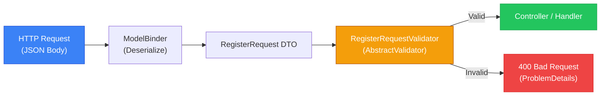

# Валідація з FluentValidation в ASP.NET Core

::note
Уявіть, що ви будуєте реєстраційну форму. Поле `Email` має бути валідним, `Password` — мінімум 8 символів з великою літерою, а `Username` — унікальним у базі даних. З DataAnnotations кожне правило — це окремий атрибут над полем. Але що робити, коли правило залежить від бази даних? Або коли одне поле валідне лише у певному контексті? DataAnnotations починають тріщати по швах саме там, де флексибільність стає критичною.
::

---

## 1. Проблема DataAnnotations

### Коли стандартна валідація не справляється

Більшість ASP.NET Core розробників розпочинають із вбудованої системи валідації через атрибути (DataAnnotations). Ця система проста у вивченні та достатня для базових сценаріїв:

```csharp [Models/RegisterRequest.cs — DataAnnotations підхід]
public class RegisterRequest
{
    [Required]
    [StringLength(50, MinimumLength = 3)]
    public string Username { get; set; } = string.Empty;

    [Required]
    [EmailAddress]
    public string Email { get; set; } = string.Empty;

    [Required]
    [MinLength(8)]
    public string Password { get; set; } = string.Empty;
}
```

На перший погляд це зручно: правила існують прямо біля DTO (Data Transfer Object). Проте з ростом проєкту проявляються серйозні обмеження:

**Проблема 1: Складна умовна логіка**. DataAnnotations не мають вбудованого механізму для взаємозалежних правил. Наприклад: «поле `PromoCode` є обов'язковим лише якщо `OrderType == OrderType.Promotional`». Для цього потрібно реалізовувати `IValidatableObject`, що порушує принцип єдиної відповідальності.

**Проблема 2: Валідація з доступом до БД**. Перевірка унікальності email не може бути реалізована просто через атрибут, бо атрибут не має доступу до `DbContext`. Потрібна окрема логіка в контролері або сервісі.

**Проблема 3: Тестування**. Атрибути важко тестувати в ізоляції. Для перевірки правила доводиться піднімати весь стек валідації або вручну викликати `Validator.TryValidateObject`.

**Проблема 4: Повторне використання**. Якщо однакові правила потрібні для кількох DTO, правила дублюються у вигляді атрибутів на кожному класі.

**Проблема 5: Вбудований синтаксис обмежений**. Немає атрибута для «один з» (`Must be one of [...]`), для regex з читабельним повідомленням, для умовного require тощо.

::tip
FluentValidation вирішує всі ці проблеми через окремий клас-валідатор з плавним API (Fluent API). Правила стають **тестованим кодом**, а не декларативними атрибутами.
::

---

## 2. Знайомство з FluentValidation

### Концепція: Validator як окремий клас

FluentValidation — це бібліотека від [Jeremy Skinner](https://fluentvalidation.net/), яка реалізує патерн **Validator Object**. Замість того, щоб «чіпляти» правила до моделі через атрибути, ви створюєте окремий клас-валідатор, що успадковується від `AbstractValidator<T>`.

::mermaid



::

Ключова ідея: **один клас відповідає за одну задачу**. `RegisterRequest` — це просто DTO без будь-якої логіки. `RegisterRequestValidator` — це валідатор, і тільки валідатор. Це дотримання принципу Single Responsibility (SRP).

### Встановлення

::steps

### Встановлення пакетів

Для інтеграції з ASP.NET Core потрібно два пакети: сам FluentValidation та пакет для автоматичної інтеграції з pipeline.

::code-group

```bash [dotnet CLI]
dotnet add package FluentValidation
dotnet add package FluentValidation.AspNetCore
```

```bash [Package Manager]
Install-Package FluentValidation
Install-Package FluentValidation.AspNetCore
```

::

### Реєстрація в Program.cs

```csharp [Program.cs]
using FluentValidation;

var builder = WebApplication.CreateBuilder(args);

builder.Services.AddControllers();

// Реєструємо всі валідатори з поточного assembly автоматично
builder.Services.AddValidatorsFromAssemblyContaining<Program>();

var app = builder.Build();
app.MapControllers();
app.Run();
```

Метод `AddValidatorsFromAssemblyContaining<T>()` сканує збірку та автоматично реєструє всі класи, що успадковуються від `AbstractValidator<T>`. Це означає, що при додаванні нового валідатора нічого не потрібно змінювати в `Program.cs`.

### Перший валідатор

Створіть директорію `Validators/` і перший файл:

```csharp [Validators/RegisterRequestValidator.cs]
using FluentValidation;

public class RegisterRequestValidator : AbstractValidator<RegisterRequest>
{
    public RegisterRequestValidator()
    {
        RuleFor(x => x.Username)
            .NotEmpty()
            .Length(3, 50);

        RuleFor(x => x.Email)
            .NotEmpty()
            .EmailAddress();

        RuleFor(x => x.Password)
            .NotEmpty()
            .MinimumLength(8);
    }
}
```

::

---

## 3. Основи FluentValidation: Синтаксис ланцюжків

### Структура правила

Кожне правило будується за шаблоном:

```
RuleFor(x => x.PropertyName)
    .ValidatorMethod1()
    .ValidatorMethod2()
    .WithMessage("Кастомне повідомлення")
    .WithName("Людська назва поля");
```

- `RuleFor` — вибирає властивість через лямбда-вираз. Це **strongly-typed**: помилки компіляції при рефакторингу.
- Кожен наступний метод в ланцюжку — це окремий валідатор. Вони виконуються зліва направо.
- `WithMessage` — перевизначає повідомлення про помилку для **останнього** доданого валідатора.
- `WithName` — змінює назву поля у повідомленні (за замовчуванням ім'я властивості).

### Вбудовані валідатори

FluentValidation містить десятки готових валідаторів:

::accordion
::accordion-item{label="Рядкові валідатори" icon="i-lucide-type"}

| Валідатор | Опис |
|---|---|
| `.NotEmpty()` | Не null, не порожній рядок, не whitespace |
| `.NotNull()` | Не null (допускає порожній рядок) |
| `.Empty()` | Має бути порожнім |
| `.Length(min, max)` | Довжина між min та max |
| `.MinimumLength(n)` | Мінімальна довжина |
| `.MaximumLength(n)` | Максимальна довжина |
| `.EmailAddress()` | Валідний email |
| `.Matches(regex)` | Відповідає регулярному виразу |
| `.StartsWith(str)` | Починається з рядка |
| `.EndsWith(str)` | Закінчується рядком |

::
::accordion-item{label="Числові валідатори" icon="i-lucide-hash"}

| Валідатор | Опис |
|---|---|
| `.GreaterThan(n)` | Більше за n (строго) |
| `.GreaterThanOrEqualTo(n)` | Більше або рівне n |
| `.LessThan(n)` | Менше за n (строго) |
| `.LessThanOrEqualTo(n)` | Менше або рівне n |
| `.InclusiveBetween(min, max)` | Між min та max (включно) |
| `.ExclusiveBetween(min, max)` | Між min та max (виключно) |
| `.PrecisionScale(precision, scale, ignoreTrailing)` | Для decimal: точність та масштаб |

::
::accordion-item{label="Колекційні валідатори" icon="i-lucide-list"}

| Валідатор | Опис |
|---|---|
| `.NotEmpty()` | Колекція не порожня |
| `.Must(x => x.Count <= 10)` | Кастомна умова для колекції |
| `.ForEach(rule => ...)` | Правила для кожного елемента |

::
::accordion-item{label="Спільні валідатори" icon="i-lucide-check-circle"}

| Валідатор | Опис |
|---|---|
| `.Equal(value)` | Дорівнює значенню |
| `.NotEqual(value)` | Не дорівнює значенню |
| `.IsInEnum()` | Входить до переліку enum |
| `.Must(predicate)` | Кастомна логіка через лямбда |
| `.MustAsync(asyncPredicate)` | Асинхронна кастомна логіка |

::
::

### Практичний приклад з поясненнями

Розберімо реалістичний валідатор для форми замовлення:

```csharp [Validators/CreateOrderValidator.cs]
public class CreateOrderValidator : AbstractValidator<CreateOrderRequest>
{
    public CreateOrderValidator()
    {
        // Правило 1: CustomerName — обов'язкове, 2-100 символів
        RuleFor(x => x.CustomerName)
            .NotEmpty()
                .WithMessage("Ім'я покупця є обов'язковим.")
            .Length(2, 100)
                .WithMessage("Ім'я має бути від {MinLength} до {MaxLength} символів.");

        // Правило 2: Email — обов'язковий, валідний формат
        RuleFor(x => x.Email)
            .NotEmpty()
                .WithMessage("Email є обов'язковим.")
            .EmailAddress()
                .WithMessage("'{PropertyValue}' не є валідним email.");

        // Правило 3: Кількість товарів — від 1 до 100
        RuleFor(x => x.Quantity)
            .InclusiveBetween(1, 100)
                .WithMessage("Кількість має бути між {From} та {To}.");

        // Правило 4: Ціна — більше нуля, з двома знаками після коми
        RuleFor(x => x.Price)
            .GreaterThan(0)
                .WithMessage("Ціна має бути більшою за нуль.")
            .PrecisionScale(10, 2, false)
                .WithMessage("Ціна має мати не більше 2 знаків після коми.");

        // Правило 5: DeliveryDate — у майбутньому
        RuleFor(x => x.DeliveryDate)
            .GreaterThan(DateTime.UtcNow)
                .WithMessage("Дата доставки має бути в майбутньому.");
    }
}
```

Зверніть увагу на плейсхолдери у повідомленнях. FluentValidation підтримує кілька вбудованих змінних:
- `{PropertyName}` — назва властивості
- `{PropertyValue}` — поточне значення
- `{MinLength}`, `{MaxLength}` — для Length()
- `{From}`, `{To}` — для Between()

---

## 4. Кастомна логіка: `.Must()` та `.MustAsync()`

### Синхронна кастомна логіка

Метод `.Must()` приймає предикат — функцію, яка повертає `bool`. Це відкриває двері для будь-якої логіки без зовнішніх залежностей:

```csharp [Validators/PasswordValidator.cs]
public class ChangePasswordValidator : AbstractValidator<ChangePasswordRequest>
{
    public ChangePasswordValidator()
    {
        RuleFor(x => x.NewPassword)
            .NotEmpty()
            .MinimumLength(8)
            // Перевірка наявності великої літери
            .Must(password => password.Any(char.IsUpper))
                .WithMessage("Пароль має містити хоча б одну велику літеру.")
            // Перевірка наявності цифри
            .Must(password => password.Any(char.IsDigit))
                .WithMessage("Пароль має містити хоча б одну цифру.")
            // Перевірка наявності спецсимволу
            .Must(password => password.Any(c => !char.IsLetterOrDigit(c)))
                .WithMessage("Пароль має містити хоча б один спеціальний символ.");

        // Перевірка, що новий пароль відрізняється від старого
        // Must() може приймати весь об'єкт як другий аргумент
        RuleFor(x => x.NewPassword)
            .Must((request, newPassword) => newPassword != request.OldPassword)
                .WithMessage("Новий пароль не може збігатися зі старим.");
    }
}
```

Ключові деталі:
- Перша форма: `.Must(value => bool)` — перевіряє лише значення поля.
- Друга форма: `.Must((rootObject, value) => bool)` — перевіряє значення у контексті всього об'єкта. Це дозволяє порівнювати поля між собою.

### Асинхронна валідація з БД

Найпотужніший аспект FluentValidation — підтримка асинхронних перевірок. Для перевірки унікальності email у базі даних:

```csharp [Validators/RegisterRequestValidator.cs]
public class RegisterRequestValidator : AbstractValidator<RegisterRequest>
{
    private readonly AppDbContext _db;

    // Валідатор наслідує залежності через конструктор
    public RegisterRequestValidator(AppDbContext db)
    {
        _db = db;

        RuleFor(x => x.Username)
            .NotEmpty()
            .Length(3, 50)
            // Перевірка унікальності username в БД
            .MustAsync(BeUniqueUsernameAsync)
                .WithMessage("Ім'я користувача '{PropertyValue}' вже зайнято.");

        RuleFor(x => x.Email)
            .NotEmpty()
            .EmailAddress()
            // Перевірка унікальності email в БД
            .MustAsync(async (email, cancellationToken) =>
                !await _db.Users.AnyAsync(u => u.Email == email, cancellationToken))
                .WithMessage("Ця електронна адреса вже зареєстрована.");
    }

    // Виносимо логіку в окремий приватний метод для читабельності
    private async Task<bool> BeUniqueUsernameAsync(
        string username,
        CancellationToken cancellationToken)
    {
        return !await _db.Users
            .AnyAsync(u => u.Username == username, cancellationToken);
    }
}
```

Оскільки `AppDbContext` реєструється як `Scoped` сервіс, а FluentValidation реєструє валідатори також як `Scoped` — ін'єкція залежностей працює коректно.

::warning
`.MustAsync()` не спрацює при синхронному виклику `validator.Validate(instance)`. Для асинхронних правил завжди використовуйте `await validator.ValidateAsync(instance)`.
::

---

## 5. Умовна валідація

### `When()` та `Unless()`

Іноді правила потрібно застосовувати лише за певних умов. FluentValidation надає для цього методи `When()` та `Unless()`:

```csharp [Validators/CreateOrderValidator.cs — умовна валідація]
public class CreateOrderValidator : AbstractValidator<CreateOrderRequest>
{
    public CreateOrderValidator()
    {
        // PromoCode валідується лише якщо UsePromo == true
        RuleFor(x => x.PromoCode)
            .NotEmpty()
                .WithMessage("Промокод є обов'язковим при використанні акції.")
            .Length(6, 20)
                .WithMessage("Промокод має бути від 6 до 20 символів.")
            .When(x => x.UsePromo);  // Умова!

        // ShippingAddress є обов'язковим лише для доставки, не для самовивозу
        RuleFor(x => x.ShippingAddress)
            .NotEmpty()
                .WithMessage("Адреса доставки є обов'язковою для кур'єрської доставки.")
            .Unless(x => x.DeliveryMethod == DeliveryMethod.Pickup);

        // CompanyName є обов'язковим лише для юридичних осіб
        RuleFor(x => x.CompanyName)
            .NotEmpty()
                .WithMessage("Назва компанії є обов'язковою для корпоративних замовлень.")
            .When(x => x.CustomerType == CustomerType.Business);
    }
}
```

Методи `When()` та `Unless()` приймають предикат на рівні кореневого об'єкта, що дозволяє приймати складні рішення на основі будь-яких властивостей.

### `RuleSet` для групованої валідації

У складних сценаріях, коли однакова модель валідується по-різному залежно від контексту (наприклад, `Create` vs `Update`), використовуються RuleSets:

```csharp [Validators/ProductValidator.cs — RuleSets]
public class ProductValidator : AbstractValidator<Product>
{
    public ProductValidator()
    {
        // Загальне правило — завжди активне
        RuleFor(x => x.Name)
            .NotEmpty()
            .MaximumLength(200);

        // Правила лише для Create
        RuleSet("Create", () =>
        {
            RuleFor(x => x.Sku)
                .NotEmpty()
                    .WithMessage("SKU є обов'язковим при створенні товару.");
        });

        // Правила лише для Update
        RuleSet("Update", () =>
        {
            RuleFor(x => x.Id)
                .GreaterThan(0)
                    .WithMessage("Невалідний ID для оновлення.");
        });
    }
}
```

```csharp [Controllers/ProductsController.cs — виклик RuleSet]
// Валідація з конкретним RuleSet
var validationResult = await _validator.ValidateAsync(
    product,
    options => options.IncludeRuleSets("Create"),
    cancellationToken);
```

---

## 6. Вкладена валідація та колекції

### Валідація вкладених об'єктів

Якщо DTO містить вкладений об'єкт, для нього також можна визначити окремий валідатор та підключити його через `SetValidator()`:

```csharp [Models/CreateOrderRequest.cs]
public class CreateOrderRequest
{
    public string CustomerName { get; set; } = string.Empty;
    public string Email        { get; set; } = string.Empty;
    public List<OrderItemDto> Items { get; set; } = [];
    public AddressDto? ShippingAddress { get; set; }
}

public class AddressDto
{
    public string Street { get; set; } = string.Empty;
    public string City   { get; set; } = string.Empty;
    public string Zip    { get; set; } = string.Empty;
}

public class OrderItemDto
{
    public int    ProductId { get; set; }
    public int    Quantity  { get; set; }
}
```

```csharp [Validators/AddressDtoValidator.cs]
public class AddressDtoValidator : AbstractValidator<AddressDto>
{
    public AddressDtoValidator()
    {
        RuleFor(x => x.Street).NotEmpty().MaximumLength(200);
        RuleFor(x => x.City).NotEmpty().MaximumLength(100);
        RuleFor(x => x.Zip)
            .NotEmpty()
            .Matches(@"^\d{5}(-\d{4})?$")
                .WithMessage("Zip code має відповідати формату 12345 або 12345-6789.");
    }
}
```

```csharp [Validators/OrderItemDtoValidator.cs]
public class OrderItemDtoValidator : AbstractValidator<OrderItemDto>
{
    public OrderItemDtoValidator()
    {
        RuleFor(x => x.ProductId).GreaterThan(0);
        RuleFor(x => x.Quantity).InclusiveBetween(1, 999);
    }
}
```

```csharp [Validators/CreateOrderValidator.cs — підключення вкладених валідаторів]
public class CreateOrderValidator : AbstractValidator<CreateOrderRequest>
{
    public CreateOrderValidator()
    {
        RuleFor(x => x.CustomerName).NotEmpty().Length(2, 100);
        RuleFor(x => x.Email).NotEmpty().EmailAddress();

        // Валідація вкладеного об'єкта через SetValidator
        RuleFor(x => x.ShippingAddress)
            .NotNull()
                .WithMessage("Адреса доставки є обов'язковою.")
            .SetValidator(new AddressDtoValidator());

        // Валідація кожного елемента колекції через ForEach або RuleForEach
        RuleForEach(x => x.Items)
            .SetValidator(new OrderItemDtoValidator());

        // Додаткове правило для всієї колекції
        RuleFor(x => x.Items)
            .NotEmpty()
                .WithMessage("Замовлення має містити хоча б один товар.")
            .Must(items => items.Count <= 50)
                .WithMessage("В одному замовленні не може бути більше 50 позицій.");
    }
}
```

При валідації `CreateOrderRequest`, FluentValidation автоматично:
1. Валідує поля `CustomerName` та `Email`
2. Перевіряє `ShippingAddress` на null, потім запускає `AddressDtoValidator`
3. Для кожного елементу в `Items` запускає `OrderItemDtoValidator`
4. Перевіряє обмеження на розмір колекції

Помилки вкладених об'єктів мають шлях у вигляді: `ShippingAddress.Street`, `Items[0].Quantity`, що дозволяє точно ідентифікувати джерело помилки на фронтенді.

---

## 7. Кастомні валідатори (Extension Methods)

### Повторно використовувані правила

Якщо одне правило потрібне у кількох валідаторах, його можна винести в extension method:

```csharp [Validators/Extensions/PhoneNumberExtensions.cs]
public static class PhoneValidationExtensions
{
    // Розширення для IRuleBuilder — дозволяє додавати до ланцюжка
    public static IRuleBuilderOptions<T, string> ValidPhoneNumber<T>(
        this IRuleBuilder<T, string> ruleBuilder)
    {
        return ruleBuilder
            .Matches(@"^\+?[1-9]\d{1,14}$")
                .WithMessage("'{PropertyValue}' не є валідним номером телефону у форматі E.164.")
            .MaximumLength(20);
    }

    public static IRuleBuilderOptions<T, string> ValidUkrainianPhone<T>(
        this IRuleBuilder<T, string> ruleBuilder)
    {
        return ruleBuilder
            .Matches(@"^\+380\d{9}$")
                .WithMessage("Номер телефону має бути у форматі +380XXXXXXXXX.");
    }
}
```

Тепер це правило можна використовувати як вбудований метод у будь-якому валідаторі:

```csharp [Validators/UserValidator.cs — використання extension]
public class UserValidator : AbstractValidator<UserDto>
{
    public UserValidator()
    {
        RuleFor(x => x.Phone)
            .NotEmpty()
            .ValidUkrainianPhone();  // Наше розширення!
    }
}
```

### Повністю кастомний валідатор через клас

Для складнішої логіки можна створити клас, що реалізує `IPropertyValidator<T, TProperty>`:

```csharp [Validators/CreditCardValidator.cs]
public class LuhnCreditCardValidator<T> : PropertyValidator<T, string>
{
    public override string Name => "LuhnCreditCardValidator";

    protected override string GetDefaultMessageTemplate(string errorCode)
        => "'{PropertyName}' не є валідним номером кредитної картки.";

    public override bool IsValid(ValidationContext<T> context, string value)
    {
        if (string.IsNullOrWhiteSpace(value)) return false;

        // Алгоритм Луна для перевірки номера картки
        var digits = value.Replace(" ", "").Replace("-", "");
        if (!digits.All(char.IsDigit)) return false;

        int sum = 0;
        bool alternate = false;

        for (int i = digits.Length - 1; i >= 0; i--)
        {
            int digit = digits[i] - '0';
            if (alternate)
            {
                digit *= 2;
                if (digit > 9) digit -= 9;
            }
            sum += digit;
            alternate = !alternate;
        }

        return sum % 10 == 0;
    }
}

// Extension method для зручного використання
public static class CreditCardValidationExtensions
{
    public static IRuleBuilderOptions<T, string> ValidCreditCardNumber<T>(
        this IRuleBuilder<T, string> ruleBuilder)
        => ruleBuilder.SetValidator(new LuhnCreditCardValidator<T>());
}
```

---

## 8. Автоматична інтеграція з ASP.NET Core Pipeline

### Ручна валідація vs автоматична

Існує два підходи до запуску валідації в контролерах.

**Ручна валідація** — явний виклик валідатора всередині ендпоінта:

```csharp [Controllers/UsersController.cs — ручна валідація]
[ApiController]
[Route("api/[controller]")]
public class UsersController : ControllerBase
{
    private readonly IValidator<RegisterRequest> _validator;

    public UsersController(IValidator<RegisterRequest> validator)
    {
        _validator = validator;
    }

    [HttpPost("register")]
    public async Task<IActionResult> Register(
        [FromBody] RegisterRequest request,
        CancellationToken cancellationToken)
    {
        // Явний виклик
        var validationResult = await _validator
            .ValidateAsync(request, cancellationToken);

        if (!validationResult.IsValid)
        {
            // Повертаємо помилки у вигляді словника для фронтенду
            return BadRequest(validationResult.ToDictionary());
        }

        // ... логіка реєстрації
        return Ok();
    }
}
```

**Автоматична валідація** — через middleware або фільтри. Для цього встановлюється пакет `FluentValidation.AspNetCore`:

```csharp [Program.cs — автоматична валідація]
builder.Services.AddControllers();

// Реєструємо валідатори
builder.Services.AddValidatorsFromAssemblyContaining<Program>();

// Підключаємо автоматичну валідацію (замінює ModelState)
// УВАГА: FluentValidation.AspNetCore підтримує цей підхід,
// але команда FluentValidation рекомендує ручну валідацію
// або валідацію через Filters для кращого контролю.
```

::tip
Офіційна рекомендація команди FluentValidation — **ручна валідація** через `IValidator<T>`. Це дає більший контроль над форматом відповіді та є більш явним. Автоматична інтеграція через `AddFluentValidationAutoValidation()` зручна, але може приховувати логіку.
::

### Відповідь з помилками у форматі Problem Details

Для стандартизованих відповідей використовуйте RFC 7807 Problem Details:

```csharp [Filters/ValidationFilter.cs]
using FluentValidation;
using Microsoft.AspNetCore.Mvc;
using Microsoft.AspNetCore.Mvc.Filters;

public class ValidationFilter<T> : IAsyncActionFilter
{
    private readonly IValidator<T> _validator;

    public ValidationFilter(IValidator<T> validator)
    {
        _validator = validator;
    }

    public async Task OnActionExecutionAsync(
        ActionExecutingContext context,
        ActionExecutionDelegate next)
    {
        // Знаходимо аргумент типу T серед параметрів дії
        var argument = context.ActionArguments.Values
            .OfType<T>()
            .FirstOrDefault();

        if (argument is null)
        {
            await next();
            return;
        }

        var validationResult = await _validator.ValidateAsync(argument);

        if (!validationResult.IsValid)
        {
            // Формат Problem Details з вкладеними помилками
            var problemDetails = new ValidationProblemDetails(
                validationResult.ToDictionary())
            {
                Status = StatusCodes.Status400BadRequest,
                Title  = "Помилки валідації",
                Detail = "Одне або більше полів містять недійсні значення."
            };

            context.Result = new BadRequestObjectResult(problemDetails);
        }
        else
        {
            await next();
        }
    }
}
```

---

## 9. Валідація у Minimal API

Для Minimal API, де немає контролерів та фільтрів, рекомендований підхід — ін'єкція `IValidator<T>` безпосередньо в ендпоінт:

```csharp [Program.cs — валідація в Minimal API]
using FluentValidation;

var builder = WebApplication.CreateBuilder(args);

builder.Services.AddValidatorsFromAssemblyContaining<Program>();

var app = builder.Build();

app.MapPost("/api/users", async (
    RegisterRequest request,
    IValidator<RegisterRequest> validator,
    CancellationToken ct) =>
{
    var result = await validator.ValidateAsync(request, ct);

    if (!result.IsValid)
    {
        // Формуємо словник помилок: { "Email": ["Not valid email"] }
        var errors = result.ToDictionary();
        return Results.ValidationProblem(errors);
    }

    // ... логіка створення користувача
    return Results.Created($"/api/users/1", new { message = "Користувача створено." });
});

app.Run();
```

`Results.ValidationProblem()` — вбудований метод Minimal API, що повертає `400 Bad Request` з тілом у форматі `application/problem+json`.

::terminal-preview{title="POST /api/users — відповідь з помилками"}
<div class="line"><span class="opacity-40">HTTP/1.1</span> <span class="text-rose-400 font-bold">400 Bad Request</span></div>
<div class="line"><span class="opacity-40">Content-Type:</span> application/problem+json</div>
<div class="line"></div>
<div class="line">{</div>
<div class="line">&nbsp;&nbsp;<span class="text-blue-400">"type"</span>: <span class="text-green-400">"https://tools.ietf.org/html/rfc9110#section-15.5.1"</span>,</div>
<div class="line">&nbsp;&nbsp;<span class="text-blue-400">"title"</span>: <span class="text-green-400">"One or more validation errors occurred."</span>,</div>
<div class="line">&nbsp;&nbsp;<span class="text-blue-400">"status"</span>: <span class="text-yellow-400">400</span>,</div>
<div class="line">&nbsp;&nbsp;<span class="text-blue-400">"errors"</span>: {</div>
<div class="line">&nbsp;&nbsp;&nbsp;&nbsp;<span class="text-blue-400">"Email"</span>: [<span class="text-green-400">"'Email' не є валідним email."</span>],</div>
<div class="line">&nbsp;&nbsp;&nbsp;&nbsp;<span class="text-blue-400">"Password"</span>: [<span class="text-green-400">"Пароль має містити хоча б одну велику літеру."</span>]</div>
<div class="line">&nbsp;&nbsp;}</div>
<div class="line">}</div>
::

---

## 10. Тестування валідаторів

Одна з головних переваг FluentValidation над DataAnnotations — **тестованість**. Валідатор — це простий клас, який легко тестується без запуску веб-сервера.

### Проста перевірка правила

```csharp [Tests/RegisterRequestValidatorTests.cs]
using FluentValidation.TestHelper;

public class RegisterRequestValidatorTests
{
    private readonly RegisterRequestValidator _validator;

    public RegisterRequestValidatorTests()
    {
        // Для валідаторів без залежностей — просте створення
        _validator = new RegisterRequestValidator();
    }

    [Fact]
    public void Should_have_error_when_email_is_empty()
    {
        var request = new RegisterRequest { Email = "" };
        var result = _validator.TestValidate(request);
        result.ShouldHaveValidationErrorFor(x => x.Email);
    }

    [Fact]
    public void Should_have_error_when_email_is_invalid()
    {
        var request = new RegisterRequest { Email = "not-an-email" };
        var result = _validator.TestValidate(request);
        result.ShouldHaveValidationErrorFor(x => x.Email);
    }

    [Fact]
    public void Should_not_have_error_when_email_is_valid()
    {
        var request = new RegisterRequest { Email = "user@example.com" };
        var result = _validator.TestValidate(request);
        result.ShouldNotHaveValidationErrorFor(x => x.Email);
    }

    [Theory]
    [InlineData("ab")]       // Задовгий (мінімум 3)
    [InlineData("")]         // Порожній
    [InlineData("this_is_way_too_long_username_for_our_system")]  // Занадто довгий
    public void Should_have_error_for_invalid_username(string username)
    {
        var request = new RegisterRequest { Username = username };
        var result = _validator.TestValidate(request);
        result.ShouldHaveValidationErrorFor(x => x.Username);
    }

    [Fact]
    public void Should_pass_for_valid_request()
    {
        var request = new RegisterRequest
        {
            Username = "valid_user",
            Email    = "user@example.com",
            Password = "SecureP@ss1"
        };
        var result = _validator.TestValidate(request);
        result.ShouldNotHaveAnyValidationErrors();
    }
}
```

### Тестування асинхронних правил з моками

Для валідаторів з залежностями (наприклад, `AppDbContext`) використовуємо Moq або NSubstitute:

```csharp [Tests/RegisterRequestValidatorAsyncTests.cs]
using NSubstitute;
using Microsoft.EntityFrameworkCore;

public class RegisterRequestValidatorAsyncTests
{
    [Fact]
    public async Task Should_have_error_when_email_already_exists()
    {
        // Arrange: мокуємо DbContext
        var db = CreateMockDbContext(emailExists: true);
        var validator = new RegisterRequestValidator(db);

        var request = new RegisterRequest
        {
            Username = "newuser",
            Email    = "existing@example.com",
            Password = "SecureP@ss1"
        };

        // Act
        var result = await validator.ValidateAsync(request);

        // Assert
        Assert.False(result.IsValid);
        Assert.Contains(result.Errors,
            e => e.PropertyName == "Email" &&
                 e.ErrorMessage.Contains("вже зареєстрована"));
    }

    private static AppDbContext CreateMockDbContext(bool emailExists)
    {
        // Використання InMemory БД для тестів
        var options = new DbContextOptionsBuilder<AppDbContext>()
            .UseInMemoryDatabase(Guid.NewGuid().ToString())
            .Options;

        var db = new AppDbContext(options);

        if (emailExists)
        {
            db.Users.Add(new AppUser { Email = "existing@example.com" });
            db.SaveChanges();
        }

        return db;
    }
}
```

---

## 11. Локалізація повідомлень

FluentValidation підтримує локалізацію через:
1. Ресурсні файли `.resx`
2. Кастомний `ILanguageManager`

```csharp [Localization/UkrainianLanguageManager.cs]
using FluentValidation.Resources;

public class UkrainianLanguageManager : LanguageManager
{
    public UkrainianLanguageManager()
    {
        // Перевизначаємо вбудовані повідомлення
        AddTranslation("uk", "NotEmptyValidator",
            "'{PropertyName}' не повинно бути порожнім.");
        AddTranslation("uk", "EmailValidator",
            "'{PropertyName}' не є коректною електронною адресою.");
        AddTranslation("uk", "MinimumLengthValidator",
            "'{PropertyName}' повинно бути не менше {MinLength} символів." +
            " Ви ввели {TotalLength}.");
        AddTranslation("uk", "MaximumLengthValidator",
            "'{PropertyName}' не може перевищувати {MaxLength} символів." +
            " Ви ввели {TotalLength}.");
        AddTranslation("uk", "InclusiveBetweenValidator",
            "'{PropertyName}' повинно бути між {From} та {To}." +
            " Ви ввели {PropertyValue}.");
        AddTranslation("uk", "GreaterThanValidator",
            "'{PropertyName}' повинно бути більше '{ComparisonValue}'.");
    }
}
```

```csharp [Program.cs — підключення локалізації]
ValidatorOptions.Global.LanguageManager = new UkrainianLanguageManager();
ValidatorOptions.Global.LanguageManager.Culture = new CultureInfo("uk");
```

---

## 12. Архітектурні ререкомендації

### Де розміщувати валідатори?

У реальних проєктах валідатори найчастіше розміщують поряд із відповідними запитами або командами:

::code-tree

```text [Validators/Users/RegisterRequestValidator.cs]
namespace MyApp.Features.Users;

public class RegisterRequestValidator
    : AbstractValidator<RegisterRequest> { }
```

```text [Features/Users/RegisterRequest.cs]
namespace MyApp.Features.Users;

public record RegisterRequest(
    string Username,
    string Email,
    string Password);
```

```text [Features/Users/RegisterHandler.cs]
namespace MyApp.Features.Users;

public class RegisterHandler { }
```

::

### Стратегія «Fail Fast» vs повна валідація

За замовчуванням FluentValidation перевіряє **всі правила** та збирає всі помилки. Для зміни поведінки:

```csharp [Validators/StrictValidator.cs — Fail Fast]
public class StrictOrderValidator : AbstractValidator<CreateOrderRequest>
{
    public StrictOrderValidator()
    {
        // CASCADE: зупиняємо перевірку цього поля після першої помилки
        RuleFor(x => x.Email)
            .Cascade(CascadeMode.Stop)
            .NotEmpty()
            .EmailAddress()
            .MustAsync(BeUniqueEmailAsync);  // Не дійде, якщо вище є помилки

        // Для всього валідатора:
        // ValidatorOptions.Global.DefaultClassLevelCascadeMode = CascadeMode.Stop;
    }
}
```

Це особливо важливо для асинхронних правил: немає сенсу робити запит до БД для перевірки унікальності email, якщо email вже невалідний за форматом.

---

## Практичні завдання

::accordion
::accordion-item{label="Рівень 1: Базовий валідатор" icon="i-lucide-code"}

**Завдання 1.1.** Створіть DTO `CreateProductRequest` з полями: `Name` (string), `Price` (decimal), `Stock` (int). Напишіть `CreateProductValidator`, що перевіряє:
- `Name` — не порожній, максимум 200 символів
- `Price` — більше нуля
- `Stock` — від 0 до 9999

**Завдання 1.2.** Виправте валідатор нижче — знайдіть помилку:

```csharp
RuleFor(x => x.Age)
    .GreaterThan(18)
    .WithMessage("Вік має бути більше 18.");
// Питання: чи буде 18 проходити валідацію?
```

::
::accordion-item{label="Рівень 2: Умовна валідація" icon="i-lucide-git-branch"}

**Завдання 2.1.** Реалізуйте валідатор для форми доставки:
- `FullName` — завжди обов'язковий
- `Email` — обов'язковий і валідний email
- `Phone` — обов'язковий якщо `NotificationType == NotificationType.Sms`
- `Address.Street` — обов'язковий якщо `DeliveryType == DeliveryType.Courier`

**Завдання 2.2.** Напишіть extension method `ValidPassword<T>()`, що перевіряє: мінімум 8 символів, наявність великої літери, цифри та спецсимволу.

::
::accordion-item{label="Рівень 3: Асинхронна валідація та тести" icon="i-lucide-database"}

**Завдання 3.1.** Реалізуйте `RegistrationValidator` з асинхронною перевіркою унікальності email та username через `IUserRepository` (не `DbContext` напряму). Напишіть unit-тести з mock-репозиторієм для трьох сценаріїв: email унікальний, email зайнятий, username зайнятий.

**Завдання 3.2.** Створіть endpoint `POST /api/products` у Minimal API, що приймає `CreateProductRequest`, запускає валідацію та повертає `Results.ValidationProblem()` при помилках або `Results.Created()` при успіху.

::
::

---

## Резюме

FluentValidation — це не просто альтернатива DataAnnotations, це **зовсім інша філософія валідації**. Замість декларативних атрибутів, розкиданих по полях DTO, ви отримуєте зосереджену, тестовану та гнучку систему:

::card-group

::card{title="Тестованість" icon="i-lucide-test-tube"}

Валідатор — це звичайний клас. Його можна тестувати через `TestValidate()` без підняття веб-сервера.

::

::card{title="Гнучкість" icon="i-lucide-settings-2"}

`.Must()`, `.MustAsync()`, `When()` дозволяють реалізувати будь-яку логіку, включаючи запити до БД та зовнішніх API.

::

::card{title="Повторне використання" icon="i-lucide-repeat"}

Extension methods та кастомні валідатори дозволяють виносити правила та використовувати їх у кількох місцях без дублювання.

::

::card{title="Чистий код" icon="i-lucide-sparkles"}

SRP: модель — це дані, валідатор — це правила. Жодного змішування відповідальностей.

::

::

**Посилання**:
- [Офіційна документація FluentValidation](https://docs.fluentvalidation.net/)
- [FluentValidation на GitHub](https://github.com/FluentValidation/FluentValidation)
- [Інтеграція з ASP.NET Core](https://docs.fluentvalidation.net/en/latest/aspnet.html)
