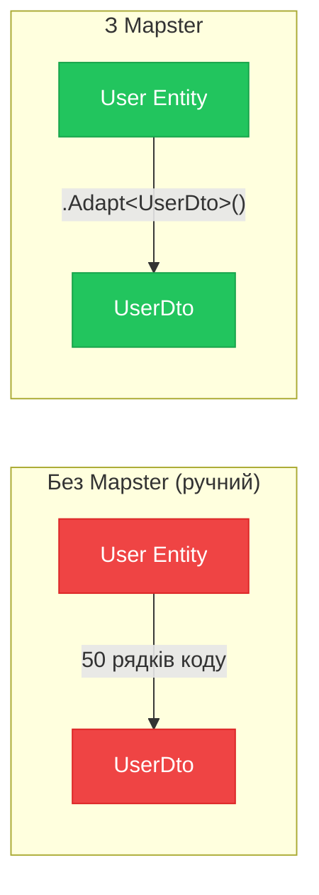

# Маппінг об'єктів з Mapster в ASP.NET Core

::note
Кожен розробник знайомий з «бойлерплейтом маппінгу»: десятки рядків, де `dto.Name = entity.Name`, `dto.Email = entity.Email`... Множте це на кількість DTO у вашому проєкті, і ви отримаєте сотні рядків коду, що не несуть жодної бізнес-цінності. Mapster вирішує цю проблему елегантно, продуктивно та з мінімальною конфігурацією.
::

---

## 1. Проблема ручного маппінгу та AutoMapper

### Чому маппінг взагалі потрібен?

У сучасній архітектурі ASP.NET Core додатків використовуються різні типи об'єктів для різних шарів:

- **Entity** (сутність) — об'єкт, що відображає таблицю в базі даних. Містить навігаційні властивості EF Core, може мати поля типу `PasswordHash`, які не можна повертати клієнту.
- **DTO** (Data Transfer Object) — об'єкт для передачі даних між шарами (наприклад, у HTTP-відповіді). Сформований під потреби клієнта: може мати обчислювані поля, об'єднані поля тощо.
- **Request Model** — об'єкт, що представляє вхідні дані від клієнта. Потрібно перетворити у сутність або команду.

Перетворення між цими типами і є **маппінгом**. Ручний маппінг виглядає так:

```csharp [Ручний маппінг — проблема]
// Кожного разу пишемо вручну
public UserDto ToDto(User user)
{
    return new UserDto
    {
        Id          = user.Id,
        FullName    = $"{user.FirstName} {user.LastName}",
        Email       = user.Email,
        RoleName    = user.Role?.Name ?? "Guest",
        CreatedAt   = user.CreatedAt.ToString("dd.MM.yyyy"),
        // ... і ще 20 полів
    };
}
```

Ручний маппінг має конкретні недоліки:

1. **Монотонна робота**: перекопіювання десятків полів не потребує розуму, але вимагає часу.
2. **Помилки при рефакторингу**: перейменували поле в Entity → забули оновити маппінг → runtime-помилка або неправильні дані.
3. **Дублювання**: якщо є 3 DTO для `User` (детальна, коротка, для адмін-панелі) — три версії однакового коду.

### AutoMapper: чудовий, але…

AutoMapper — найпопулярніша бібліотека для маппінгу в .NET-спільноті. Вона вирішує перелічені проблеми, але має власні недоліки:

::card-group

::card{title="❌ Продуктивність" icon="i-lucide-zap"}
AutoMapper використовує рефлексію та expression trees, що повільніше за ручний код. У hot paths це відчутно.
::

::card{title="❌ Складність конфігурації" icon="i-lucide-settings"}
`CreateMap<Source, Dest>()` вимагає окремого `Profile`-класу. Проєкти з 50+ маппінгами мають складну конфігуацію.
::

::card{title="❌ Магія рефлексії" icon="i-lucide-wand-2"}
Помилки маппінгу проявляються лише в runtime. AutoMapper може «мовчки» пропустити незамапповане поле.
::

::card{title="❌ Breaking changes" icon="i-lucide-alert-triangle"}
Мажорні версії AutoMapper часто містять breaking changes, що ускладнює оновлення.
::

::

### Mapster: швидкий та простий

[Mapster](https://github.com/MapsterMapper/Mapster) — це альтернатива AutoMapper, яка:

- **Швидша**: у бенчмарках Mapster на 5-10x швидший за AutoMapper (для складних об'єктів).
- **Простіша**: мінімальна конфігурація, яку можна писати прямо в класах.
- **TypeSafe**: підтримка Code Generation — маппер компілюється в реальний C# код.
- **Підтримує Minimal Configuration**: більшість маппінгів працюють «з коробки» без конфігурації.

::mermaid



::

---

## 2. Встановлення та базовий маппінг

### Встановлення пакету

::steps

### Встановлення через NuGet

::code-group

```bash [dotnet CLI]
dotnet add package Mapster
dotnet add package Mapster.DependencyInjection
```

```bash [Package Manager]
Install-Package Mapster
Install-Package Mapster.DependencyInjection
```

::

Пакет `Mapster.DependencyInjection` надає розширення для реєстрації у DI контейнері та підтримку сканування конфігурацій.

### Реєстрація в Program.cs

```csharp [Program.cs]
using Mapster;
using MapsterMapper;

var builder = WebApplication.CreateBuilder(args);

// Реєструємо IMapper як Singleton (Mapster безпечний для потоків)
builder.Services.AddMapster();

var app = builder.Build();
```

`AddMapster()` реєструє `IMapper` та `TypeAdapterConfig.GlobalSettings` у DI. `TypeAdapterConfig` — це синглтон, що зберігає всі правила маппінгу.

::

### Базове використання: `.Adapt<T>()`

Найпростіший спосіб — виклик extension method `.Adapt<T>()` безпосередньо на об'єкті:

```csharp [Базовий маппінг — приклад]
// Моделі
public class User
{
    public int    Id        { get; set; }
    public string FirstName { get; set; } = string.Empty;
    public string LastName  { get; set; } = string.Empty;
    public string Email     { get; set; } = string.Empty;
    public string Password  { get; set; } = string.Empty; // Не повертаємо!
    public Role   Role      { get; set; } = null!;
}

public class UserDto
{
    public int    Id       { get; set; }
    public string FullName { get; set; } = string.Empty; // FirstName + LastName
    public string Email    { get; set; } = string.Empty;
    public string RoleName { get; set; } = string.Empty;
}
```

```csharp [Controllers/UsersController.cs — використання Adapt]
[ApiController]
[Route("api/[controller]")]
public class UsersController : ControllerBase
{
    private readonly AppDbContext _db;

    public UsersController(AppDbContext db) => _db = db;

    [HttpGet("{id}")]
    public async Task<ActionResult<UserDto>> GetById(int id)
    {
        var user = await _db.Users
            .Include(u => u.Role)
            .FirstOrDefaultAsync(u => u.Id == id);

        if (user is null) return NotFound();

        // Один рядок замість 10+ рядків ручного маппінгу
        var dto = user.Adapt<UserDto>();

        return Ok(dto);
    }

    [HttpGet]
    public async Task<ActionResult<List<UserDto>>> GetAll()
    {
        var users = await _db.Users
            .Include(u => u.Role)
            .ToListAsync();

        // Маппінг колекцій теж в один рядок
        var dtos = users.Adapt<List<UserDto>>();

        return Ok(dtos);
    }
}
```

За замовчуванням Mapster автоматично маппить поля з однаковими назвами. Це означає, що `Id` та `Email` заповнюються одразу. При цьому поле `Password` **не потрапить** у `UserDto`, оскільки такого поля там немає — це автоматичний захист від витоку даних.

::tip
Mapster підтримує маппінг з PascalCase у camelCase та навпаки автоматично. Також підтримується маппінг між різними примітивними типами (int → string, тощо) якщо це можливо без втрати даних.
::

---

## 3. Конфігурація правил маппінгу

### TypeAdapterConfig: центральна конфігурація

Для складних маппінгів (обчислювані поля, ігнорування, перейменування) використовується `TypeAdapterConfig`:

```csharp [Mappings/UserMappingConfig.cs]
using Mapster;

public class UserMappingConfig : IRegister
{
    public void Register(TypeAdapterConfig config)
    {
        config.NewConfig<User, UserDto>()
            // Обчислюване поле: об'єднання FirstName та LastName
            .Map(dest => dest.FullName,
                 src  => $"{src.FirstName} {src.LastName}")

            // Маппінг з вкладеного об'єкта
            .Map(dest => dest.RoleName,
                 src  => src.Role != null ? src.Role.Name : "Guest")

            // Ігноруємо поле (навіть якщо є збіг за назвою)
            .Ignore(dest => dest.SensitiveField);
    }
}
```

Клас `IRegister` — це контракт Mapster для класів конфігурації. Метод `AddMapster()` автоматично знаходить та реєструє всі `IRegister`-класи з поточної збірки.

### Детальна конфігурація: всі можливості

```csharp [Mappings/OrderMappingConfig.cs]
public class OrderMappingConfig : IRegister
{
    public void Register(TypeAdapterConfig config)
    {
        config.NewConfig<Order, OrderDto>()

            // Map() — відповідність між полями
            .Map(dest => dest.CustomerFullName,
                 src  => $"{src.Customer.FirstName} {src.Customer.LastName}")

            // Map() зі складним виразом
            .Map(dest => dest.TotalFormatted,
                 src  => src.Total.ToString("N2") + " UAH")

            // Map() на основі умови (conditional mapping)
            .Map(dest => dest.StatusLabel,
                 src  => src.Status == OrderStatus.Completed
                     ? "Виконано" : "В обробці")

            // Ignore() — пропускаємо поле при маппінгу
            .Ignore(dest => dest.InternalNotes)

            // IgnoreIf() — ігноруємо поле за умовою
            .IgnoreIf((src, dest) => src.Discount == 0,
                       dest => dest.DiscountLabel)

            // AfterMapping() — виконати дію після маппінгу
            .AfterMapping((src, dest) =>
            {
                dest.Tags = src.Tags?
                    .Select(t => t.Name)
                    .ToList() ?? [];
            })

            // PreserveReference() — уникаємо циклічних посилань
            .PreserveReference(true)

            // ConstructUsing() — кастомний конструктор
            .ConstructUsing(src => new OrderDto(src.Id));
    }
}
```

Кожен метод в ланцюжку конфігурації:
- `.Map(dest, src)` — задає відповідність між полями через лямбда-вирази. Надзвичайно гнучко: будь-який вираз C# допустимий.
- `.Ignore(dest)` — виключає поле з процесу маппінгу (воно залишиться зі значенням за замовчуванням).
- `.IgnoreIf(condition, dest)` — умовне ігнорування на основі стану вхідного або вихідного об'єкта.
- `.AfterMapping(action)` — хук, що виконується після автоматичного маппінгу. Ідеально для складної логіки, яку важко виразити через лямбди.
- `.PreserveReference(true)` — запобігає нескінченній рекурсії при маппінгу графів з циклічними посиланнями (Entity framework lazy loading).

### Маппінг двонаправлений

Нерідко потрібен маппінг у обидва боки: з Entity в DTO та з Request в Entity:

```csharp [Mappings/ProductMappingConfig.cs — двонаправлений маппінг]
public class ProductMappingConfig : IRegister
{
    public void Register(TypeAdapterConfig config)
    {
        // Entity → DTO (для відповідей API)
        config.NewConfig<Product, ProductDto>()
            .Map(dest => dest.CategoryName,
                 src  => src.Category.Name)
            .Map(dest => dest.PriceFormatted,
                 src  => $"₴{src.Price:N2}");

        // CreateRequest → Entity (для створення)
        config.NewConfig<CreateProductRequest, Product>()
            .Ignore(dest => dest.Id)          // Id генерується БД
            .Ignore(dest => dest.CreatedAt)   // Встановлюється сервісом
            .Ignore(dest => dest.Category);   // Навігаційна властивість

        // UpdateRequest → Entity (для оновлення)
        config.NewConfig<UpdateProductRequest, Product>()
            .Ignore(dest => dest.Id)
            .Ignore(dest => dest.CreatedAt)
            .Ignore(dest => dest.Category);
    }
}
```

```csharp [Services/ProductService.cs — використання двонаправленого маппінгу]
public class ProductService
{
    private readonly AppDbContext _db;
    private readonly IMapper _mapper;

    public ProductService(AppDbContext db, IMapper mapper)
    {
        _db = db;
        _mapper = mapper;
    }

    public async Task<ProductDto> CreateAsync(CreateProductRequest request)
    {
        // Request → Entity
        var product = request.Adapt<Product>();
        product.CreatedAt = DateTime.UtcNow;

        _db.Products.Add(product);
        await _db.SaveChangesAsync();

        // Entity → DTO
        return product.Adapt<ProductDto>();
    }

    public async Task<ProductDto?> UpdateAsync(int id, UpdateProductRequest request)
    {
        var product = await _db.Products.FindAsync(id);
        if (product is null) return null;

        // Маппінг поверх існуючого об'єкта (оновлення)
        request.Adapt(product);  // Mapster може оновлювати існуючий об'єкт!

        await _db.SaveChangesAsync();
        return product.Adapt<ProductDto>();
    }
}
```

Зверніть увагу на рядок `request.Adapt(product)`. Це особливість Mapster: маппінг **поверх** існуючого об'єкта, а не створення нового. Це ідеально для операцій оновлення.

---

## 4. Маппінг складних вкладених структур

### Flatten та Unflatten

**Flattening** — перетворення ієрarchічного об'єкта у плоску структуру:

```csharp [Модель — ієрархічна структура]
public class Order
{
    public int      Id       { get; set; }
    public Customer Customer { get; set; } = null!;
    public Address  Address  { get; set; } = null!;
}

public class Customer
{
    public string FirstName { get; set; } = string.Empty;
    public string LastName  { get; set; } = string.Empty;
}

public class Address
{
    public string Street { get; set; } = string.Empty;
    public string City   { get; set; } = string.Empty;
}
```

```csharp [DTO — плоска структура]
public class OrderFlatDto
{
    public int    Id              { get; set; }
    // Mapster автоматично "розгортає" Customer.FirstName → CustomerFirstName
    public string CustomerFirstName { get; set; } = string.Empty;
    public string CustomerLastName  { get; set; } = string.Empty;
    public string AddressStreet     { get; set; } = string.Empty;
    public string AddressCity       { get; set; } = string.Empty;
}
```

Mapster підтримує **автоматичний flattening** за конвенцією назв: поле `CustomerFirstName` у DTO автоматично маппиться з `Customer.FirstName` у джерелі. Нічого налаштовувати не потрібно!

### Маппінг з проєкцією в EF Core (QueryableExtensions)

Mapster чудово інтегрується з EF Core для проєкцій запитів. Замість завантаження всього об'єкта та маппінгу в пам'яті, можна маппити прямо в SQL:

```csharp [Repositories/OrderRepository.cs — проєкція в БД]
using Mapster;

public class OrderRepository
{
    private readonly AppDbContext _db;

    public OrderRepository(AppDbContext db) => _db = db;

    public async Task<List<OrderDto>> GetAllAsync()
    {
        // ProjectToType<T>() генерує SELECT з лише потрібними полями
        // Запит до БД містить лише ті поля, які є в OrderDto
        return await _db.Orders
            .Include(o => o.Customer)
            .ProjectToType<OrderDto>()  // Mapster extension!
            .ToListAsync();
    }

    public async Task<OrderDto?> GetByIdAsync(int id)
    {
        return await _db.Orders
            .Where(o => o.Id == id)
            .ProjectToType<OrderDto>()
            .FirstOrDefaultAsync();
    }
}
```

`ProjectToType<T>()` — це аналог `AutoMapper`'ового `ProjectTo<T>()`. Він аналізує маппінг-конфігурацію та генерує відповідний SQL-запит, де `SELECT` містить лише поля, необхідні для `OrderDto`. Це значно ефективніше за завантаження повного Entity та маппінг в пам'яті.

::warning
`ProjectToType<T>()` не підтримує деякі складні конфігурації маппінгу, які можна зробити через `AfterMapping()` чи `ConstructUsing()`. Якщо Mapster не може транслювати маппінг у SQL, виникне помилка. Перевіряйте роботу проєкцій тестами.
::

---

## 5. IMapper vs статичний .Adapt\<T\>()

Mapster пропонує два підходи до виклику маппера:

### Статичний підхід — `object.Adapt<T>()`

```csharp [Статичний маппінг]
var dto = user.Adapt<UserDto>();
var users = userList.Adapt<List<UserDto>>();
```

Плюси: мінімум коду, ніяких залежностей. Мінуси: складніше тестувати (неможливо замінити мок), прив'язка до глобальної конфігурації.

### Ін'єкційний підхід — `IMapper`

```csharp [DI-маппінг через IMapper]
public class ProductsController : ControllerBase
{
    private readonly IMapper _mapper;

    public ProductsController(IMapper mapper) => _mapper = mapper;

    [HttpGet("{id}")]
    public async Task<ActionResult<ProductDto>> GetById(int id)
    {
        var product = await /* ... */;

        // Через IMapper
        var dto = _mapper.Map<ProductDto>(product);

        return Ok(dto);
    }
}
```

Плюси: `IMapper` можна замінити моком у тестах, залежність явна. Мінуси: потребує ін'єкції.

::tip
Рекомендація: використовуйте **статичний `.Adapt<T>()`** для простих маппінгів у сервісах і репозиторіях. Використовуйте **`IMapper`** там, де важлива тестованість або де маппінг є частиною бізнес-логіки.
::

---

## 6. Code Generation: компіляція маппінгу

Найунікальніша особливість Mapster — **Code Generation**. Замість рефлексії в runtime, Mapster генерує реальний C# код маппінгу під час компіляції (або як Source Generator).

### Налаштування CodeGen

```csharp [MapsterCodeGen.cs — налаштування генерації]
using Mapster;

// Цей файл запускається як консольна утиліта або Source Generator
[assembly: AdaptFrom(typeof(User),    typeof(UserDto))]
[assembly: AdaptTo(typeof(UserDto),   typeof(User))]
[assembly: AdaptTwoWays(typeof(Product), typeof(ProductDto))]
```

Або через окремий клас-конфігуратор:

```csharp [MapsterConfig.cs — конфігурація для CodeGen]
public class MapsterConfig : ICodeGenerationRegister
{
    public void Register(CodeGenerationConfig config)
    {
        config.AdaptTo("[name]Dto")
              .ForType<User>()
              .ForType<Product>()
              .ForType<Order>();

        config.AdaptFrom("[name]Request")
              .ForType<CreateUserRequest>()
              .ForType<UpdateProductRequest>();
    }
}
```

```bash [Генерація коду — CLI]
dotnet mapster -s Models/ -o Generated/
```

Результат — Mapster генерує файл з реальними методами маппінгу:

```csharp [Generated/UserMapper.g.cs — згенерований код]
// <auto-generated>
// Цей файл згенерований Mapster — не редагуйте вручну
// </auto-generated>
public static partial class UserMapper
{
    public static UserDto AdaptToDto(this User p1)
    {
        return p1 == null ? null : new UserDto()
        {
            Id       = p1.Id,
            FullName = string.Concat(p1.FirstName, " ", p1.LastName),
            Email    = p1.Email,
            RoleName = p1.Role != null ? p1.Role.Name : "Guest"
        };
    }

    public static UserDto AdaptTo(this User p1, UserDto p2)
    {
        if (p1 == null) return null;
        UserDto result = p2 ?? new UserDto();
        result.Id       = p1.Id;
        result.FullName = string.Concat(p1.FirstName, " ", p1.LastName);
        result.Email    = p1.Email;
        result.RoleName = p1.Role != null ? p1.Role.Name : "Guest";
        return result;
    }
}
```

Згенерований код — це **звичайний C# без рефлексії**. Він компілюється разом з проєктом, підтримує навігацію у IDE та має продуктивність ідентичну ручному маппінгу.

---

## 7. Порівняння: Mapster vs AutoMapper vs ручний маппінг

| Критерій | Ручний маппінг | AutoMapper | Mapster |
|---|---|---|---|
| **Продуктивність** | ⭐⭐⭐⭐⭐ Найшвидший | ⭐⭐ Повільний | ⭐⭐⭐⭐ Швидкий (CodeGen = ⭐⭐⭐⭐⭐) |
| **Кількість коду** | ❌ Багато бойлерплейту | ✅ Мало | ✅ Мало |
| **Конфігурація** | Немає | Profile-клас | IRegister або атрибути |
| **Тестованість** | ✅ Просто | ⚠️ Потребує налаштування | ✅ Просто через IMapper |
| **Compile-time safety** | ✅ | ❌ Runtime errors | ✅ (з CodeGen) |
| **DI інтеграція** | Немає | ✅ AutoMapper.Extensions.DI | ✅ Mapster.DI |
| **EF Core Projection** | ❌ | ✅ ProjectTo | ✅ ProjectToType |
| **Крива навчання** | Низька | Середня | Низька |
| **Breaking changes** | Немає | Часто | Рідко |

---

## 8. Практичні сценарії

### Сценарій: API з CQRS та Mapster

У CQRS-архітектурі маппінг відбувається на межах шарів:

```csharp [Features/Products/GetProduct/GetProductQuery.cs]
public record GetProductQuery(int Id) : IRequest<ProductDto?>;

public class GetProductHandler : IRequestHandler<GetProductQuery, ProductDto?>
{
    private readonly AppDbContext _db;

    public GetProductHandler(AppDbContext db) => _db = db;

    public async Task<ProductDto?> Handle(
        GetProductQuery query,
        CancellationToken ct)
    {
        // Проєкція одразу на рівні БД-запиту
        return await _db.Products
            .Where(p => p.Id == query.Id)
            .ProjectToType<ProductDto>()
            .FirstOrDefaultAsync(ct);
    }
}
```

```csharp [Features/Products/CreateProduct/CreateProductCommand.cs]
public record CreateProductCommand(
    string Name,
    decimal Price,
    int Stock) : IRequest<ProductDto>;

public class CreateProductHandler
    : IRequestHandler<CreateProductCommand, ProductDto>
{
    private readonly AppDbContext _db;

    public CreateProductHandler(AppDbContext db) => _db = db;

    public async Task<ProductDto> Handle(
        CreateProductCommand command,
        CancellationToken ct)
    {
        // Command → Entity через Adapt
        var product = command.Adapt<Product>();
        product.CreatedAt = DateTime.UtcNow;

        _db.Products.Add(product);
        await _db.SaveChangesAsync(ct);

        // Entity → DTO
        return product.Adapt<ProductDto>();
    }
}
```

### Налаштування для nullable-типів

```csharp [Mappings/GlobalMappingConfig.cs]
public class GlobalMappingConfig : IRegister
{
    public void Register(TypeAdapterConfig config)
    {
        // Глобальні налаштування для всіх маппінгів
        config.Default
            // Не маппити null-поля (зберігати існуюче значення dest)
            .IgnoreNullValues(true)

            // Маппити приватні члени (за наявності)
            .NameMatchingStrategy(NameMatchingStrategy.ConvertSourceMemberName(
                name => name.Replace("_", "")))

            // Шаблон "Shallow Clone" — не клонувати вкладені об'єкти
            .ShallowCopyForSameType(true);
    }
}
```

---

## 9. Тестування маппінгу

### Unit-тести конфігурації маппінгу

```csharp [Tests/MappingTests.cs]
public class MappingTests
{
    private readonly TypeAdapterConfig _config;

    public MappingTests()
    {
        _config = new TypeAdapterConfig();
        // Реєструємо всі конфігурації
        _config.Scan(typeof(UserMappingConfig).Assembly);
    }

    [Fact]
    public void User_ShouldMap_ToUserDto_FullName()
    {
        // Arrange
        var user = new User
        {
            Id        = 1,
            FirstName = "Іван",
            LastName  = "Петренко",
            Email     = "ivan@example.com",
            Role      = new Role { Name = "Admin" }
        };

        // Act
        var dto = user.Adapt<UserDto>(_config);

        // Assert
        Assert.Equal("Іван Петренко", dto.FullName);
        Assert.Equal("Admin", dto.RoleName);
        Assert.Equal(1, dto.Id);
    }

    [Fact]
    public void User_ShouldNot_Include_Password_InDto()
    {
        // Перевіряємо, що sensitive-поля не потрапляють у DTO
        var user = new User
        {
            Password = "super_secret_hash"
        };

        var dto = user.Adapt<UserDto>(_config);

        // UserDto не має поля Password — перевіряємо через рефлексію
        var hasPasswordProperty = typeof(UserDto)
            .GetProperty("Password") != null;

        Assert.False(hasPasswordProperty,
            "UserDto не повинен містити поле Password!");
    }

    [Fact]
    public void CreateRequest_ShouldMap_ToProduct()
    {
        var request = new CreateProductRequest
        {
            Name  = "Кава Colombia",
            Price = 299.99m,
            Stock = 50
        };

        var product = request.Adapt<Product>(_config);

        Assert.Equal("Кава Colombia", product.Name);
        Assert.Equal(299.99m, product.Price);
        Assert.Equal(50, product.Stock);
        Assert.Equal(0, product.Id); // Id не маппиться
    }
}
```

---

## Практичні завдання

::accordion
::accordion-item{label="Рівень 1: Базовий маппінг" icon="i-lucide-code"}

**Завдання 1.1.** Є клас `Article` з полями: `Id`, `Title`, `Content`, `AuthorId`, `PublishedAt`, `ViewCount`. Створіть `ArticleDto` з полями: `Id`, `Title`, `Summary` (перші 200 символів `Content`), `PublishedAt`. Налаштуйте маппінг через `TypeAdapterConfig`.

**Завдання 1.2.** Викличте `.Adapt<ArticleDto>()` у ендпоінті `GET /api/articles/{id}` та поверніть у відповіді.

::
::accordion-item{label="Рівень 2: Складний маппінг" icon="i-lucide-git-branch"}

**Завдання 2.1.** Реалізуйте двонаправлений маппінг для `Category` ↔ `CategoryDto` та встановіть `IRegister`-клас. `Category` має поле `Products` (список), `CategoryDto` має поле `ProductCount` (кількість продуктів). Налаштуйте маппінг для цих полів.

**Завдання 2.2.** Використайте `ProjectToType<CategoryDto>()` у репозиторії для завантаження лише необхідних полів з БД.

::
::accordion-item{label="Рівень 3: Архітектура з Mapster" icon="i-lucide-layers"}

**Завдання 3.1.** Реалізуйте CRUD-сервіс `TagService` з методами `GetAllAsync`, `CreateAsync`, `UpdateAsync`. У кожному методі використовуйте Mapster для маппінгу між `Tag`, `TagDto`, `CreateTagRequest`, `UpdateTagRequest`. Забезпечте, що при `UpdateAsync` поле `CreatedAt` не перезаписується.

**Завдання 3.2.** Напишіть unit-тест, що перевіряє: маппінг `UpdateTagRequest` → `Tag` не перезаписує `Id` та `CreatedAt`.

::
::

---

## Резюме

Mapster — це прагматичний вибір для маппінгу об'єктів у ASP.NET Core:

::card-group

::card{title="Швидкість" icon="i-lucide-zap"}
У 5-10x швидший за AutoMapper завдяки внутрішньому кешуванню та Code Generation.
::

::card{title="Простота" icon="i-lucide-feather"}
Мінімальна конфігурація: 90% маппінгів працюють «з коробки» завдяки конвенції назв.
::

::card{title="EF Core Projection" icon="i-lucide-database"}
`ProjectToType<T>()` переносить маппінг на рівень SQL-запиту для максимальної ефективності.
::

::card{title="Code Generation" icon="i-lucide-code-2"}
Опціональна генерація C#-коду — нуль рефлексії в runtime, повна підтримка IDE.
::

::

**Посилання**:
- [Офіційна документація Mapster](https://github.com/MapsterMapper/Mapster/wiki)
- [Mapster Benchmarks](https://github.com/MapsterMapper/Mapster#performance)
- [Mapster Code Generation](https://github.com/MapsterMapper/Mapster/wiki/Code-generation)
