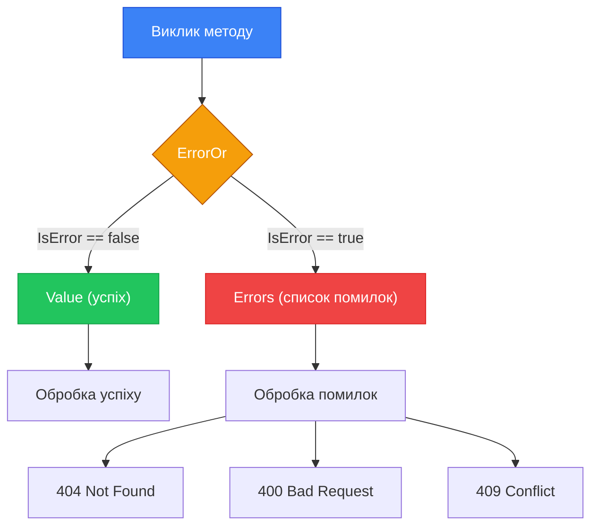

# Обробка помилок з ErrorOr та Result Pattern в ASP.NET Core

::note
Уявіть функцію `GetUserById(int id)`. Що вона повертає, якщо користувача не знайдено? Кидає `NotFoundException`? Повертає `null`? Обидва підходи мають серйозні недоліки: виключення — дорогі (вартість стеку викликів), а `null` — «мовчазна» помилка, яку легко забути перевірити. Result Pattern пропонує третій шлях: **явне повернення результату або помилки**.
::

---

## 1. Проблема виключень для бізнес-логіки

### Виключення — не для бізнес-потоку

Виключення (exceptions) в C# спроєктовані для **виняткових ситуацій** — несподіваних стану системи: відсутність диску, мережева помилка, null reference у місці, де це неможливо. Це не те саме, що «користувач не знайдений» або «недостатньо коштів на рахунку».

Коли розробники використовують виключення для бізнес-логіки, виникають проблеми:

**Проблема 1: Продуктивність**. Створення виключення вимагає захоплення стеку викликів (`StackTrace`). На гарячих шляхах (hot paths) це дорого. У .NET 8 тест показує: кидання та перехоплення виключення — ~3000x повільніше, ніж повернення значення.

**Проблема 2: Приховані потоки управління**. Коли ви бачите виклик `var user = await _userService.GetAsync(id)`, неочевидно, які виключення може кинути цей метод. Сигнатура метода не розкриває можливих «сценаріїв помилок».

**Проблема 3: Складність обробки у контролерах**. Типовий паттерн з виключеннями:

```csharp [Типовий підхід з виключеннями — проблема]
[HttpGet("{id}")]
public async Task<ActionResult<UserDto>> GetUser(int id)
{
    try
    {
        var user = await _userService.GetByIdAsync(id);
        return Ok(user.Adapt<UserDto>());
    }
    catch (NotFoundException ex)
    {
        return NotFound(new { error = ex.Message });
    }
    catch (ForbiddenException ex)
    {
        return Forbid();
    }
    catch (ValidationException ex)
    {
        return BadRequest(new { errors = ex.Errors });
    }
    // Що ще може впасти? Ніколи не знаєш...
}
```

Кожен ендпоінт стає огортким з `try/catch`. Це не масштабується.

### Result Pattern: явна семантика

**Result Pattern** (патерн результату) — підхід, де функція явно повертає або успішний результат, або об'єкт помилки. Сигнатура функції розповідає про можливі сценарії:

```csharp [Сигнатура з Result Pattern — явна]
// Ясно: може повернути User або помилку
Task<ErrorOr<User>> GetByIdAsync(int id);

// Ясно: може повернути список або помилку
Task<ErrorOr<List<User>>> GetAllAsync();

// Ясно: може повернути нічого або помилку
Task<ErrorOr<Deleted>> DeleteAsync(int id);
```

::mermaid



::

---

## 2. Бібліотека ErrorOr

### Встановлення

[ErrorOr](https://github.com/amantinband/error-or) — бібліотека від Amichai Mantinband, яка реалізує Result Pattern ідіоматично для C#:

::code-group

```bash [dotnet CLI]
dotnet add package ErrorOr
```

```bash [Package Manager]
Install-Package ErrorOr
```

::

### Структура ErrorOr\<T\>

`ErrorOr<T>` — це discriminated union (тип-об'єднання) між `T` (успіх) та `List<Error>` (помилки):

```csharp [Внутрішня структура ErrorOr — концептуально]
// Спрощена структура для розуміння:
public readonly struct ErrorOr<TValue>
{
    private readonly TValue?     _value;
    private readonly List<Error>? _errors;

    // Чи є помилки?
    public bool IsError => _errors is not null;

    // Успішне значення (кидає виключення якщо IsError == true)
    public TValue Value => IsError
        ? throw new InvalidOperationException("Cannot access Value when IsError")
        : _value!;

    // Список помилок (порожній якщо IsError == false)
    public List<Error> Errors => _errors ?? [];

    // Перша помилка зі списку
    public Error FirstError => Errors[0];
}
```

### Типи помилок `Error`

Бібліотека надає стандартний набір типів помилок, що відповідають HTTP-кодам:

```csharp [Типи помилок ErrorOr]
// Вбудовані фабричні методи для помилок:

Error.NotFound("User.NotFound", "Користувача не знайдено.");
// → type: NotFound → HTTP 404

Error.Validation("User.InvalidEmail", "Email невалідний.");
// → type: Validation → HTTP 400

Error.Conflict("User.DuplicateEmail", "Email вже зареєстрований.");
// → type: Conflict → HTTP 409

Error.Unauthorized("Auth.Unauthorized", "Доступ заборонено.");
// → type: Unauthorized → HTTP 401

Error.Forbidden("Auth.Forbidden", "Недостатньо прав.");
// → type: Forbidden → HTTP 403

Error.Unexpected("Server.Error", "Неочікувана помилка сервера.");
// → type: Unexpected → HTTP 500

// Кастомний тип помилки — для специфічних HTTP-кодів
Error.Custom(
    type:        (int)ErrorType.Conflict,
    code:        "Order.AlreadyShipped",
    description: "Замовлення вже відправлено і не може бути змінено.");
```

Кожна помилка має:
- `Code` — машинно-читабельний код (наприклад, `"User.NotFound"`). Корисний для фронтенду для локалізації.
- `Description` — людиночитабельний опис.
- `Type` — тип помилки для автоматичного визначення HTTP-коду.
- `Metadata` — словник для додаткових даних.

---

## 3. Сервісний шар з ErrorOr

### Визначення власних помилок

Харна практика — централізувати помилки домену в статичних класах:

```csharp [Errors/UserErrors.cs]
public static class UserErrors
{
    public static readonly Error NotFound = Error.NotFound(
        code:        "User.NotFound",
        description: "Користувача з таким ID не знайдено.");

    public static readonly Error DuplicateEmail = Error.Conflict(
        code:        "User.DuplicateEmail",
        description: "Користувач з таким email вже існує.");

    public static readonly Error InvalidCredentials = Error.Unauthorized(
        code:        "User.InvalidCredentials",
        description: "Невірний email або пароль.");

    public static readonly Error EmailNotConfirmed = Error.Forbidden(
        code:        "User.EmailNotConfirmed",
        description: "Будь ласка, підтвердіть email перед входом.");
}
```

```csharp [Errors/OrderErrors.cs]
public static class OrderErrors
{
    public static readonly Error NotFound = Error.NotFound(
        code:        "Order.NotFound",
        description: "Замовлення не знайдено.");

    public static readonly Error AlreadyCancelled = Error.Conflict(
        code:        "Order.AlreadyCancelled",
        description: "Замовлення вже скасовано.");

    public static Error InsufficientStock(string productName) => Error.Conflict(
        code:        "Order.InsufficientStock",
        description: $"Недостатньо товару на складі: {productName}.");
}
```

Зверніть увагу: деякі помилки — статичні поля (незмінні), інші — статичні методи (параметризовані). Це дає гнучкість: для `InsufficientStock` потрібно знати назву продукту, тоді як `NotFound` завжди однаковий.

### Реалізація сервісу

```csharp [Services/UserService.cs]
using ErrorOr;

public class UserService
{
    private readonly AppDbContext _db;

    public UserService(AppDbContext db) => _db = db;

    // Повертає User або помилку NotFound
    public async Task<ErrorOr<User>> GetByIdAsync(int id)
    {
        var user = await _db.Users
            .Include(u => u.Role)
            .FirstOrDefaultAsync(u => u.Id == id);

        if (user is null)
            return UserErrors.NotFound;  // Неявне перетворення в ErrorOr<User>

        return user;  // Неявне перетворення в ErrorOr<User>
    }

    // Повертає User або помилки Conflict/Validation
    public async Task<ErrorOr<User>> CreateAsync(RegisterRequest request)
    {
        // Список помилок — може містити кілька
        var errors = new List<Error>();

        // Перевіряємо унікальність email
        var emailExists = await _db.Users.AnyAsync(u => u.Email == request.Email);
        if (emailExists)
            errors.Add(UserErrors.DuplicateEmail);

        // Перевіряємо інші бізнес-правила
        if (request.Password.Length < 8)
            errors.Add(Error.Validation("User.WeakPassword",
                "Пароль має бути мінімум 8 символів."));

        // Якщо є помилки — повертаємо їх усі
        if (errors.Count > 0)
            return errors;

        // Все гаразд — створюємо користувача
        var user = new User
        {
            Email        = request.Email,
            FirstName    = request.FirstName,
            LastName     = request.LastName,
            PasswordHash = BCrypt.HashPassword(request.Password)
        };

        _db.Users.Add(user);
        await _db.SaveChangesAsync();

        return user;
    }

    // ErrorOr<Deleted> — спеціальний тип для операцій без результату
    public async Task<ErrorOr<Deleted>> DeleteAsync(int id)
    {
        var user = await _db.Users.FindAsync(id);

        if (user is null)
            return UserErrors.NotFound;

        _db.Users.Remove(user);
        await _db.SaveChangesAsync();

        return Result.Deleted;  // Спецзначення для "успіх без результату"
    }

    // ErrorOr<Updated> — аналог для оновлень
    public async Task<ErrorOr<Updated>> UpdateAsync(int id, UpdateUserRequest request)
    {
        var user = await _db.Users.FindAsync(id);
        if (user is null) return UserErrors.NotFound;

        user.FirstName = request.FirstName;
        user.LastName  = request.LastName;
        await _db.SaveChangesAsync();

        return Result.Updated;
    }
}
```

Ключові моменти:
- Неявне перетворення дозволяє просто написати `return user` або `return UserErrors.NotFound` — компілятор розуміє.
- `Result.Deleted` та `Result.Updated` — спеціальні «порожні успіхи» від ErrorOr для операцій, що не повертають дані.
- Можна повертати `List<Error>` — це дозволяє збирати кілька помилок одночасно.

---

## 4. Match та Switch: обробка результату

### Match — трансформація результату

`Match()` — найчастіший спосіб обробки `ErrorOr<T>`. Він повертає нове значення в обох гілках:

```csharp [Використання Match]
ErrorOr<User> result = await _userService.GetByIdAsync(id);

// Match — трансформує ErrorOr в інший тип
string message = result.Match(
    user   => $"Знайдено: {user.FullName}",
    errors => $"Помилка: {errors[0].Description}"
);
```

У ASP.NET Core контексті `Match()` зазвичай використовується для формування `IActionResult`:

```csharp [Controllers/UsersController.cs — Match в контролері]
[HttpGet("{id}")]
public async Task<IActionResult> GetById(int id)
{
    var result = await _userService.GetByIdAsync(id);

    return result.Match<IActionResult>(
        user   => Ok(user.Adapt<UserDto>()),
        errors => Problem(errors)  // Хелпер метод — перетворює помилки у відповідь
    );
}
```

Зверніть увагу: `Match()` гарантує, що ви **обов'язково** обробите обидва випадки. Компілятор не дозволить «забути» гілку помилки.

### Switch — дія без результату

`Switch()` схожий на `Match()`, але використовується коли потрібно виконати дію (side effect), а не отримати значення:

```csharp [Використання Switch]
ErrorOr<User> result = await _userService.CreateAsync(request);

result.Switch(
    user   => _logger.LogInformation("Створено користувача {Id}", user.Id),
    errors => _logger.LogWarning("Помилка створення: {Errors}",
                  string.Join(", ", errors.Select(e => e.Code)))
);
```

### MatchAsync та SwitchAsync

Для асинхронних обробників існують `MatchAsync` та `SwitchAsync`:

```csharp [Асинхронний Match]
var result = await _orderService.CreateAsync(orderRequest);

return await result.MatchAsync(
    async order  => {
        await _emailService.SendOrderConfirmationAsync(order);
        return Created($"/api/orders/{order.Id}", order.Adapt<OrderDto>());
    },
    async errors => {
        await _auditService.LogFailedOrderAsync(orderRequest);
        return Problem(errors);
    }
);
```

---

## 5. Інтеграція з Minimal API та Problem Details

### Хелпер для перетворення помилок у HTTP-відповідь

Ключовий компонент, що зв'язує ErrorOr з HTTP-відповідями — метод `Problem()`. Реалізуємо його як extension:

```csharp [Extensions/ErrorOrExtensions.cs]
using ErrorOr;
using Microsoft.AspNetCore.Mvc;

public static class ErrorOrExtensions
{
    /// <summary>
    /// Перетворює список помилок ErrorOr у відповідний HTTP результат.
    /// Автоматично визначає HTTP-код на основі типу першої помилки.
    /// </summary>
    public static IResult ToProblemResult(this List<Error> errors)
    {
        if (errors.Count == 0)
            return Results.Problem(statusCode: 500);

        // Якщо є помилки валідації — ValidationProblem (422)
        if (errors.All(e => e.Type == ErrorType.Validation))
        {
            var validationErrors = errors.ToDictionary(
                e => e.Code,
                e => new[] { e.Description });

            return Results.ValidationProblem(validationErrors);
        }

        // Код статусу на основі першої помилки
        var firstError = errors[0];

        int statusCode = firstError.Type switch
        {
            ErrorType.NotFound     => StatusCodes.Status404NotFound,
            ErrorType.Conflict     => StatusCodes.Status409Conflict,
            ErrorType.Unauthorized => StatusCodes.Status401Unauthorized,
            ErrorType.Forbidden    => StatusCodes.Status403Forbidden,
            ErrorType.Validation   => StatusCodes.Status400BadRequest,
            _                      => StatusCodes.Status500InternalServerError
        };

        return Results.Problem(
            statusCode: statusCode,
            title: firstError.Code,
            detail: firstError.Description,
            extensions: errors.Count > 1
                ? new Dictionary<string, object?>
                    { ["allErrors"] = errors.Select(e => new { e.Code, e.Description }) }
                : null);
    }
}
```

### Minimal API ендпоінти з ErrorOr

Тепер ендпоінти виглядають надзвичайно чисто:

```csharp [Program.cs — Minimal API з ErrorOr]
using ErrorOr;

var app = builder.Build();

// GET /api/users/{id}
app.MapGet("/api/users/{id:int}", async (
    int id,
    UserService userService) =>
{
    var result = await userService.GetByIdAsync(id);

    return result.Match(
        user   => Results.Ok(user.Adapt<UserDto>()),
        errors => errors.ToProblemResult()
    );
});

// POST /api/users
app.MapPost("/api/users", async (
    RegisterRequest request,
    IValidator<RegisterRequest> validator,
    UserService userService) =>
{
    // FluentValidation перед бізнес-логікою
    var validation = await validator.ValidateAsync(request);
    if (!validation.IsValid)
        return Results.ValidationProblem(validation.ToDictionary());

    var result = await userService.CreateAsync(request);

    return result.Match(
        user   => Results.Created($"/api/users/{user.Id}", user.Adapt<UserDto>()),
        errors => errors.ToProblemResult()
    );
});

// DELETE /api/users/{id}
app.MapDelete("/api/users/{id:int}", async (
    int id,
    UserService userService) =>
{
    var result = await userService.DeleteAsync(id);

    return result.Match(
        _ => Results.NoContent(),      // Result.Deleted → 204
        errors => errors.ToProblemResult()
    );
});
```

Кожен ендпоінт — це декларативний опис «що повертаємо у разі успіху та у разі помилки». Немає `try/catch`, немає `if (result == null) return NotFound()`.

::terminal-preview{title="Приклад відповіді — помилка"}
<div class="line"><span class="opacity-40">HTTP/1.1</span> <span class="text-rose-400 font-bold">404 Not Found</span></div>
<div class="line"><span class="opacity-40">Content-Type:</span> application/problem+json</div>
<div class="line"></div>
<div class="line">{</div>
<div class="line">&nbsp;&nbsp;<span class="text-blue-400">"type"</span>: <span class="text-green-400">"https://tools.ietf.org/html/rfc9110#section-15.5.5"</span>,</div>
<div class="line">&nbsp;&nbsp;<span class="text-blue-400">"title"</span>: <span class="text-green-400">"User.NotFound"</span>,</div>
<div class="line">&nbsp;&nbsp;<span class="text-blue-400">"detail"</span>: <span class="text-green-400">"Користувача з таким ID не знайдено."</span>,</div>
<div class="line">&nbsp;&nbsp;<span class="text-blue-400">"status"</span>: <span class="text-yellow-400">404</span></div>
<div class="line">}</div>
::

---

## 6. Then: Ланцюжки трансформацій

Метод `.Then()` дозволяє складати кілька операцій у ланцюжок — якщо будь-яка з них повертає помилку, весь ланцюжок «розривається» і повертає цю помилку:

```csharp [Ланцюжок Then]
public async Task<ErrorOr<OrderDto>> ProcessOrderAsync(CreateOrderRequest request)
{
    // Кожен крок виконується лише якщо попередній успішний
    ErrorOr<OrderDto> result = await ValidateStockAsync(request)
        .ThenAsync(order => CalculatePriceAsync(order))
        .ThenAsync(order => ApplyDiscountAsync(order, request.PromoCode))
        .ThenAsync(order => SaveOrderAsync(order))
        .Then(order => order.Adapt<OrderDto>());

    return result;
}

private async Task<ErrorOr<Order>> ValidateStockAsync(CreateOrderRequest request)
{
    foreach (var item in request.Items)
    {
        var product = await _db.Products.FindAsync(item.ProductId);
        if (product is null)
            return Error.NotFound("Product.NotFound",
                $"Товар {item.ProductId} не знайдено.");

        if (product.Stock < item.Quantity)
            return OrderErrors.InsufficientStock(product.Name);
    }
    return new Order { /* ... */ };
}
```

`.ThenAsync()` — асинхронна версія `.Then()`. Якщо `ValidateStockAsync` повертає помилку, наступні кроки (`CalculatePriceAsync` тощо) **не виконуються**. Помилка «протікає» до кінця ланцюжка автоматично.

---

## 7. Порівняння підходів

| Аспект | Виключення | Null return | Result Pattern (ErrorOr) |
|---|---|---|---|
| **Продуктивність** | ❌ Дорого (StackTrace) | ✅ Нуль overhead | ✅ Мінімальний overhead |
| **Явність контракту** | ❌ Невідомо що кинеться | ❌ Потребує перевірки null | ✅ Сигнатура розповідає все |
| **Обробка у контролері** | ❌ try/catch скрізь | ⚠️ if/else | ✅ Match/Switch |
| **Кілька помилок** | ❌ Одне виключення | ❌ Неможливо | ✅ List<Error> |
| **Типізованість** | ⚠️ Тип виключення | ❌ Лише null | ✅ Типізований Error |
| **HTTP статус** | ⚠️ Через middleware | ❌ Вручну | ✅ Через ErrorType |
| **Тестованість** | ⚠️ Assert.Throws | ✅ Просто | ✅ Просто |

---

## 8. Глобальний обробник помилок

Навіть з ErrorOr, деякі виключення можуть виникати для справді несподіваних ситуацій (наприклад, відсутність мережі). Для них потрібен глобальний обробник:

```csharp [Middleware/GlobalExceptionHandler.cs]
public class GlobalExceptionHandler : IExceptionHandler
{
    private readonly ILogger<GlobalExceptionHandler> _logger;

    public GlobalExceptionHandler(ILogger<GlobalExceptionHandler> logger)
        => _logger = logger;

    public async ValueTask<bool> TryHandleAsync(
        HttpContext httpContext,
        Exception exception,
        CancellationToken ct)
    {
        _logger.LogError(exception,
            "Несподівана помилка під час обробки {Method} {Path}",
            httpContext.Request.Method,
            httpContext.Request.Path);

        var problemDetails = new ProblemDetails
        {
            Status = StatusCodes.Status500InternalServerError,
            Title  = "Внутрішня помилка сервера",
            Detail = "Щось пішло не так. Спробуйте пізніше."
        };

        httpContext.Response.StatusCode = 500;
        await httpContext.Response.WriteAsJsonAsync(problemDetails, ct);

        return true; // Помилку оброблено, не передавати далі
    }
}
```

```csharp [Program.cs — реєстрація]
builder.Services.AddExceptionHandler<GlobalExceptionHandler>();
builder.Services.AddProblemDetails();

// ...
app.UseExceptionHandler();
```

---

## Практичні завдання

::accordion
::accordion-item{label="Рівень 1: Перший Result" icon="i-lucide-code"}

**Завдання 1.1.** Реалізуйте метод `GetProductAsync(int id)` у сервісі, що повертає `ErrorOr<Product>`. Якщо продукт не знайдено — поверніть `Error.NotFound`. Напишіть ендпоінт `GET /api/products/{id}`, що використовує `Match()`.

**Завдання 1.2.** Виправте: чому цей код не скомпілюється і як виправити?
```csharp
ErrorOr<string> GetName(int id) {
    if (id <= 0) return "InvalidId";
    return "John";
}
```

::
::accordion-item{label="Рівень 2: Бізнес-помилки" icon="i-lucide-git-branch"}

**Завдання 2.1.** Створіть статичний клас `ProductErrors` з помилками: `NotFound`, `OutOfStock`, `PriceNegative`. Реалізуйте метод `PurchaseAsync(int productId, int quantity)`, що перевіряє: продукт існує, кількість позитивна, запас достатній.

**Завдання 2.2.** Реалізуйте ланцюжок `.Then()` для процесу замовлення: `ValidateUser → ValidateProduct → CreateOrder → SendNotification`. Кожен крок повертає `ErrorOr<T>`.

::
::accordion-item{label="Рівень 3: Повна інтеграція" icon="i-lucide-layers"}

**Завдання 3.1.** Побудуйте повний CRUD для `Category` з ErrorOr: сервіс (`CategoryService`), статичний клас `CategoryErrors`, Minimal API ендпоінти, `ToProblemResult()` хелпер. Забезпечте коректні HTTP-коди для всіх сценаріїв помилок.

**Завдання 3.2.** Напишіть unit-тести для `CategoryService.DeleteAsync`: сценарій «категорія не знайдена» (очікуємо `IsError == true`, `FirstError.Type == ErrorType.NotFound`) та «успішне видалення» (очікуємо `IsError == false`).

::
::

---

## Резюме

Result Pattern через ErrorOr — це прагматичний підхід до обробки помилок бізнес-логіки:

::card-group

::card{title="Явний контракт" icon="i-lucide-file-text"}
Сигнатура `Task<ErrorOr<T>>` розповідає про можливі помилки. Ніяких прихованих виключень.
::

::card{title="Compose-able" icon="i-lucide-link"}
`.Then()` дозволяє будувати складні ланцюжки операцій без вкладених `if/else`.
::

::card{title="HTTP-friendly" icon="i-lucide-globe"}
`ErrorType` автоматично відображається на HTTP-коди. `Match()` дає чистий код ендпоінта.
::

::card{title="Продуктивність" icon="i-lucide-zap"}
Нуль overhead стеку викликів. Виключення — лише для справжніх виняткових ситуацій.
::

::

**Посилання**:
- [ErrorOr на GitHub](https://github.com/amantinband/error-or)
- [Problem Details (RFC 7807)](https://datatracker.ietf.org/doc/html/rfc7807)
- [Відео: Error Handling by Amichai Mantinband](https://www.youtube.com/watch?v=gMwAhKddHYQ)
