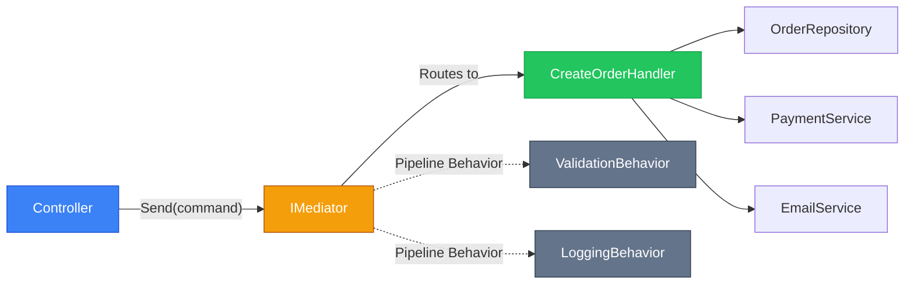

# CQRS та Mediator з MediatR в ASP.NET Core

::note
Класичний ASP.NET Core контролер з 10+ ін'єкціями залежностей — це сигнал тривоги. `IUserService`, `IEmailService`, `IOrderService`, `ICacheService`... При додаванні нової фічі потрібно змінювати контролер, сервіс, можливо ще й репозиторій. Усі ці зміни — у різних місцях, через які складно розуміти, що відбувається при конкретному запиті. MediatR вводить єдину точку входу — **Mediator**, і розкладає логіку по маленьких, фокусованих Handler-класах.
::

---

## 1. Проблема «Товстих» Контролерів

### Ознаки нездорової архітектури

Розгляньмо типовий «товстий» контролер:

```csharp [Controllers/OrdersController.cs — антипатерн]
[ApiController]
public class OrdersController : ControllerBase
{
    // 8 залежностей у конструкторі — тривожний сигнал
    private readonly IOrderRepository   _orderRepo;
    private readonly IProductRepository _productRepo;
    private readonly IUserRepository    _userRepo;
    private readonly IEmailService      _emailService;
    private readonly IPaymentService    _paymentService;
    private readonly ICacheService      _cacheService;
    private readonly ILogger            _logger;
    private readonly IValidator<CreateOrderRequest> _validator;

    [HttpPost]
    public async Task<IActionResult> CreateOrder(CreateOrderRequest request)
    {
        // Весь бізнес-процес у контролері:
        var validationResult = await _validator.ValidateAsync(request);
        if (!validationResult.IsValid)
            return BadRequest(validationResult.Errors);

        var product = await _productRepo.GetByIdAsync(request.ProductId);
        if (product is null) return NotFound();
        if (product.Stock < request.Quantity) return BadRequest("Out of stock");

        var user = await _userRepo.GetByIdAsync(request.UserId);
        var order = new Order { /* ... */ };
        await _orderRepo.CreateAsync(order);

        await _paymentService.ChargeAsync(user.PaymentMethod, order.Total);
        await _emailService.SendOrderConfirmationAsync(user.Email, order);
        await _cacheService.InvalidateAsync($"user-orders-{user.Id}");

        _logger.LogInformation("Order {OrderId} created", order.Id);
        return CreatedAtAction(nameof(GetById), new { id = order.Id }, order);
    }
}
```

Проблеми цього підходу:
1. **Тестування**: щоб протестувати `CreateOrder`, потрібно мокати 8 залежностей.
2. **Читабельність**: важко зрозуміти з першого погляду, «що робить цей контролер».
3. **Принцип єдиної відповідальності**: контролер знає про платежі, email, кеш.
4. **Масштабованість**: при додаванні нової фічі — змінюємо той самий клас.

### Патерн Mediator: єдина точка

**Patтерн Mediator** (посередник) — поведінковий паттерн, де об'єкти спілкуються не безпосередньо між собою, а через «посередника».

У контексті ASP.NET Core: контролер надсилає **Request** до `IMediator`, який знаходить відповідний **Handler** та виконує його. Контролер не знає нічого про реалізацію.

::mermaid



::

---

## 2. CQRS: Розділення Команд та Запитів

**CQRS** (Command Query Responsibility Segregation) — принцип, за яким:
- **Query** (запит) — читає дані, нічого не змінює. Повертає результат.
- **Command** (команда) — змінює стан системи. Не повертає даних (або повертає мінімально).

Це не суворе технічне правило, а **концептуальне розмежування** відповідальностей.

| | Query | Command |
|---|---|---|
| **Дія** | Читання | Запис/Зміна/Видалення |
| **Повертає** | Дані | Підтвердження або ID |
| **Побічний ефект** | Ні | Так |
| **Приклади** | `GetUserQuery`, `ListOrdersQuery` | `CreateOrderCommand`, `DeleteUserCommand` |

---

## 3. Встановлення MediatR

::code-group

```bash [dotnet CLI]
dotnet add package MediatR
dotnet add package MediatR.Extensions.Microsoft.DependencyInjection
```

```bash [.NET 8+ (вбудована DI реєстрація)]
dotnet add package MediatR
```

::

```csharp [Program.cs — реєстрація MediatR]
// Сканує збірку та реєструє всі IRequestHandler<,> автоматично
builder.Services.AddMediatR(cfg =>
    cfg.RegisterServicesFromAssemblyContaining<Program>());
```

---

## 4. Queries: Запити на Читання

### Структура Query + Handler

```csharp [Features/Users/GetUser/GetUserQuery.cs]
using MediatR;

// Query — це запит + очікуваний тип відповіді (IRequest<TResponse>)
public record GetUserQuery(int UserId) : IRequest<UserDto?>;
```

```csharp [Features/Users/GetUser/GetUserHandler.cs]
using MediatR;

// Handler — єдиний клас, що обробляє цей запит
public class GetUserHandler : IRequestHandler<GetUserQuery, UserDto?>
{
    private readonly AppDbContext _db;

    public GetUserHandler(AppDbContext db) => _db = db;

    // Handle() — єдина точка бізнес-логіки для GetUserQuery
    public async Task<UserDto?> Handle(
        GetUserQuery query,
        CancellationToken cancellationToken)
    {
        return await _db.Users
            .Where(u => u.Id == query.UserId)
            .ProjectToType<UserDto>()
            .FirstOrDefaultAsync(cancellationToken);
    }
}
```

```csharp [Controllers/UsersController.cs — контролер без залежностей]
[ApiController]
[Route("api/[controller]")]
public class UsersController : ControllerBase
{
    private readonly IMediator _mediator;

    // Лише ОДИН конструктор з ОДНІЄЮ залежністю — IMediator!
    public UsersController(IMediator mediator) => _mediator = mediator;

    [HttpGet("{id}")]
    public async Task<ActionResult<UserDto>> GetById(int id)
    {
        var result = await _mediator.Send(new GetUserQuery(id));
        return result is null ? NotFound() : Ok(result);
    }
}
```

### Складний Query з фільтрацією

```csharp [Features/Orders/ListOrders/ListOrdersQuery.cs]
public record ListOrdersQuery(
    int     Page       = 1,
    int     PageSize   = 20,
    string? Status     = null,
    int?    CustomerId = null,
    string  SortBy     = "CreatedAt",
    bool    Ascending  = false
) : IRequest<PagedResult<OrderDto>>;

public record PagedResult<T>(
    List<T> Items,
    int     TotalCount,
    int     Page,
    int     PageSize)
{
    public int TotalPages => (int)Math.Ceiling((double)TotalCount / PageSize);
    public bool HasNextPage => Page < TotalPages;
}
```

```csharp [Features/Orders/ListOrders/ListOrdersHandler.cs]
public class ListOrdersHandler
    : IRequestHandler<ListOrdersQuery, PagedResult<OrderDto>>
{
    private readonly AppDbContext _db;

    public ListOrdersHandler(AppDbContext db) => _db = db;

    public async Task<PagedResult<OrderDto>> Handle(
        ListOrdersQuery query,
        CancellationToken ct)
    {
        var q = _db.Orders.AsQueryable();

        // Динамічна фільтрація
        if (query.Status is not null)
            q = q.Where(o => o.Status == query.Status);

        if (query.CustomerId.HasValue)
            q = q.Where(o => o.CustomerId == query.CustomerId);

        // Динамічне сортування
        q = query.SortBy switch
        {
            "Total"     => query.Ascending
                ? q.OrderBy(o => o.Total)
                : q.OrderByDescending(o => o.Total),
            _ => query.Ascending
                ? q.OrderBy(o => o.CreatedAt)
                : q.OrderByDescending(o => o.CreatedAt)
        };

        var totalCount = await q.CountAsync(ct);

        var items = await q
            .Skip((query.Page - 1) * query.PageSize)
            .Take(query.PageSize)
            .ProjectToType<OrderDto>()
            .ToListAsync(ct);

        return new PagedResult<OrderDto>(
            items, totalCount, query.Page, query.PageSize);
    }
}
```

---

## 5. Commands: Команди на Зміну

```csharp [Features/Orders/CreateOrder/CreateOrderCommand.cs]
// Command повертає ErrorOr<OrderDto> — інтеграція з Result Pattern
public record CreateOrderCommand(
    int         CustomerId,
    List<OrderItemDto> Items,
    string?     PromoCode
) : IRequest<ErrorOr<OrderDto>>;
```

```csharp [Features/Orders/CreateOrder/CreateOrderHandler.cs]
public class CreateOrderHandler
    : IRequestHandler<CreateOrderCommand, ErrorOr<OrderDto>>
{
    private readonly AppDbContext       _db;
    private readonly IEmailService      _emailService;
    private readonly ILogger<CreateOrderHandler> _logger;

    public CreateOrderHandler(
        AppDbContext db,
        IEmailService emailService,
        ILogger<CreateOrderHandler> logger)
    {
        _db           = db;
        _emailService = emailService;
        _logger       = logger;
    }

    public async Task<ErrorOr<OrderDto>> Handle(
        CreateOrderCommand command,
        CancellationToken ct)
    {
        // 1. Перевіряємо наявність покупця
        var customer = await _db.Users.FindAsync([command.CustomerId], ct);
        if (customer is null)
            return Error.NotFound("Customer.NotFound", "Покупця не знайдено.");

        // 2. Перевіряємо наявність товарів
        var productIds = command.Items.Select(i => i.ProductId).ToList();
        var products   = await _db.Products
            .Where(p => productIds.Contains(p.Id))
            .ToDictionaryAsync(p => p.Id, ct);

        var errors = new List<Error>();
        foreach (var item in command.Items)
        {
            if (!products.TryGetValue(item.ProductId, out var product))
            {
                errors.Add(Error.NotFound("Product.NotFound",
                    $"Товар {item.ProductId} не знайдено."));
                continue;
            }

            if (product.Stock < item.Quantity)
                errors.Add(Error.Conflict("Order.InsufficientStock",
                    $"Недостатньо '{product.Name}' на складі."));
        }

        if (errors.Count > 0) return errors;

        // 3. Створюємо замовлення
        var order = new Order
        {
            CustomerId = command.CustomerId,
            CreatedAt  = DateTime.UtcNow,
            Items      = command.Items.Select(i => new OrderItem
            {
                ProductId = i.ProductId,
                Quantity  = i.Quantity,
                Price     = products[i.ProductId].Price
            }).ToList()
        };

        order.Total = order.Items.Sum(i => i.Price * i.Quantity);

        _db.Orders.Add(order);
        await _db.SaveChangesAsync(ct);

        // 4. Надсилаємо підтвердження
        await _emailService.SendOrderConfirmationAsync(customer.Email, order);

        _logger.LogInformation(
            "Замовлення {OrderId} створено для покупця {CustomerId}. Сума: {Total}",
            order.Id, command.CustomerId, order.Total);

        return order.Adapt<OrderDto>();
    }
}
```

---

## 6. Pipeline Behaviors: Крізь усі запити

**Pipeline Behavior** (поведінка конвеєра) — middleware для MediatR. Виконується для **кожного** запиту до та після обробника. Ідеально для валідації, логування, кешування.

### ValidationBehavior: FluentValidation + MediatR

```csharp [Behaviors/ValidationBehavior.cs]
using FluentValidation;
using MediatR;

public class ValidationBehavior<TRequest, TResponse>
    : IPipelineBehavior<TRequest, TResponse>
    where TRequest : IRequest<TResponse>
{
    private readonly IEnumerable<IValidator<TRequest>> _validators;

    public ValidationBehavior(IEnumerable<IValidator<TRequest>> validators)
        => _validators = validators;

    public async Task<TResponse> Handle(
        TRequest request,
        RequestHandlerDelegate<TResponse> next,
        CancellationToken ct)
    {
        // Якщо валідаторів немає — пропускаємо
        if (!_validators.Any())
            return await next();

        // Запускаємо всі валідатори паралельно
        var context = new ValidationContext<TRequest>(request);
        var results = await Task.WhenAll(
            _validators.Select(v => v.ValidateAsync(context, ct)));

        var failures = results
            .SelectMany(r => r.Errors)
            .Where(f => f is not null)
            .ToList();

        if (failures.Count == 0)
            return await next();  // Валідація пройшла — виконуємо Handler

        // Якщо відповідь ErrorOr — повертаємо помилки у ньому
        if (typeof(TResponse).IsGenericType &&
            typeof(TResponse).GetGenericTypeDefinition() == typeof(ErrorOr<>))
        {
            var errors = failures
                .Select(f => Error.Validation(f.PropertyName, f.ErrorMessage))
                .ToList();

            return (TResponse)(dynamic)errors;
        }

        // Інакше — кидаємо ValidationException
        throw new ValidationException(failures);
    }
}
```

```csharp [Behaviors/LoggingBehavior.cs — логування всіх запитів]
public class LoggingBehavior<TRequest, TResponse>
    : IPipelineBehavior<TRequest, TResponse>
    where TRequest : IRequest<TResponse>
{
    private readonly ILogger<LoggingBehavior<TRequest, TResponse>> _logger;

    public LoggingBehavior(
        ILogger<LoggingBehavior<TRequest, TResponse>> logger)
        => _logger = logger;

    public async Task<TResponse> Handle(
        TRequest request,
        RequestHandlerDelegate<TResponse> next,
        CancellationToken ct)
    {
        var requestName = typeof(TRequest).Name;

        _logger.LogInformation(
            "Починаємо обробку {RequestName}: {@Request}",
            requestName, request);

        var stopwatch = Stopwatch.StartNew();
        TResponse response;

        try
        {
            response = await next();
        }
        finally
        {
            stopwatch.Stop();

            _logger.LogInformation(
                "Завершено {RequestName} за {ElapsedMs}ms",
                requestName, stopwatch.ElapsedMilliseconds);
        }

        return response;
    }
}
```

```csharp [Program.cs — реєстрація Behaviors]
builder.Services.AddMediatR(cfg =>
{
    cfg.RegisterServicesFromAssemblyContaining<Program>();

    // Порядок важливий! Виконуються зліва направо:
    // Logging → Validation → Handler → Validation → Logging
    cfg.AddBehavior(typeof(IPipelineBehavior<,>),
                    typeof(LoggingBehavior<,>));
    cfg.AddBehavior(typeof(IPipelineBehavior<,>),
                    typeof(ValidationBehavior<,>));
});
```

---

## 7. Notifications: Event-Driven у межах процесу

**INotification** — механізм для публікації подій (Events) всередині одного процесу. Декілька обробників можуть реагувати на одну подію:

```csharp [Notifications/OrderCreatedNotification.cs]
using MediatR;

// Подія: замовлення створено
public record OrderCreatedNotification(
    int    OrderId,
    int    CustomerId,
    string CustomerEmail,
    decimal Total
) : INotification;
```

```csharp [Notifications/Handlers/SendEmailOnOrderCreated.cs]
// Обробник 1: надсилає email
public class SendEmailOnOrderCreated
    : INotificationHandler<OrderCreatedNotification>
{
    private readonly IEmailService _emailService;

    public SendEmailOnOrderCreated(IEmailService emailService)
        => _emailService = emailService;

    public async Task Handle(
        OrderCreatedNotification notification,
        CancellationToken ct)
    {
        await _emailService.SendOrderConfirmationAsync(
            notification.CustomerEmail,
            notification.OrderId);
    }
}
```

```csharp [Notifications/Handlers/UpdateInventoryOnOrderCreated.cs]
// Обробник 2: оновлює залишки
public class UpdateInventoryOnOrderCreated
    : INotificationHandler<OrderCreatedNotification>
{
    private readonly AppDbContext _db;

    public UpdateInventoryOnOrderCreated(AppDbContext db) => _db = db;

    public async Task Handle(
        OrderCreatedNotification notification,
        CancellationToken ct)
    {
        // Зменшуємо кількість на складі
        var order = await _db.Orders
            .Include(o => o.Items)
            .FirstOrDefaultAsync(o => o.Id == notification.OrderId, ct);

        if (order is null) return;

        foreach (var item in order.Items)
        {
            var product = await _db.Products.FindAsync([item.ProductId], ct);
            if (product is not null)
                product.Stock -= item.Quantity;
        }

        await _db.SaveChangesAsync(ct);
    }
}
```

```csharp [Features/Orders/CreateOrder/CreateOrderHandler.cs — публікація]
// У Handler-і публікуємо подію після успішного створення
await _db.SaveChangesAsync(ct);

// Публікуємо — MediatR знайде ВСІХ обробників і викличе їх
await _mediator.Publish(new OrderCreatedNotification(
    order.Id,
    command.CustomerId,
    customer.Email,
    order.Total), ct);

return order.Adapt<OrderDto>();
```

::tip
`Publish()` викликає всіх обробників **послідовно** за замовчуванням. Якщо потрібно паралельне виконання — реалізуйте кастомний `INotificationPublisher`.
::

---

## 8. Структура проєкту з MediatR (Feature Folders)

MediatR найкраще поєднується з **Vertical Slice Architecture** (архітектура вертикальних зрізів), де код організовано по фічах, а не по шарах:

::code-tree

```text [Features/Users/GetUser/GetUserQuery.cs]
public record GetUserQuery(int UserId) : IRequest<UserDto?>;
```

```text [Features/Users/GetUser/GetUserHandler.cs]
public class GetUserHandler : IRequestHandler<GetUserQuery, UserDto?> { }
```

```text [Features/Users/CreateUser/CreateUserCommand.cs]
public record CreateUserCommand(...) : IRequest<ErrorOr<UserDto>>;
```

```text [Features/Users/CreateUser/CreateUserCommandValidator.cs]
public class CreateUserCommandValidator : AbstractValidator<CreateUserCommand> { }
```

```text [Features/Users/CreateUser/CreateUserHandler.cs]
public class CreateUserHandler : IRequestHandler<CreateUserCommand, ErrorOr<UserDto>> { }
```

```text [Features/Orders/CreateOrder/CreateOrderCommand.cs]
public record CreateOrderCommand(...) : IRequest<ErrorOr<OrderDto>>;
```

::

---

## Практичні завдання

::accordion
::accordion-item{label="Рівень 1: Перший Query та Command" icon="i-lucide-code"}

**Завдання 1.1.** Реалізуйте `GetProductQuery(int ProductId) : IRequest<ProductDto?>` та відповідний Handler. Підключіть Mapster для проєкції. Викличте через `IMediator` у Minimal API ендпоінті.

**Завдання 1.2.** Реалізуйте `DeleteProductCommand(int ProductId) : IRequest<ErrorOr<Deleted>>`. Handler має перевіряти наявність продукту і повертати `Error.NotFound` або `Result.Deleted`.

::
::accordion-item{label="Рівень 2: Pipeline Behaviors" icon="i-lucide-git-branch"}

**Завдання 2.1.** Реалізуйте `PerformanceBehavior<TRequest, TResponse>`, що логує попередження для запитів, які виконуються довше 500ms. Використайте `Stopwatch`.

**Завдання 2.2.** Реалізуйте `CachingBehavior<TRequest, TResponse>`, де Query-запити кешуються в `IMemoryCache` на 5 хвилин. Запити мають реалізовувати маркерний інтерфейс `ICacheableRequest` з властивістю `CacheKey`.

::
::accordion-item{label="Рівень 3: Notifications та Feature Slice" icon="i-lucide-layers"}

**Завдання 3.1.** Реалізуйте повний вертикальний зріз для `Tag`: `CreateTagCommand`, `CreateTagCommandValidator`, `CreateTagHandler`, `TagCreatedNotification`, два обробники notifications (логування та аудит). Organize в папці `Features/Tags/CreateTag/`.

**Завдання 3.2.** Напишіть тест для `CreateTagHandler` за допомогою `FakeMediator` або `NSubstitute`. Переконайтесь, що `TagCreatedNotification` публікується при успішному створенні.

::
::

---

## Резюме

MediatR трансформує ASP.NET Core архітектуру від «товстих контролерів» до фокусованих, тестованих компонентів:

::card-group

::card{title="Єдина залежність" icon="i-lucide-plug"}
Контролер залежить лише від `IMediator`. Нові фічі не змінюють контролер.
::

::card{title="Pipeline Behaviors" icon="i-lucide-layers"}
Валідація, логування, кешування — один раз для всіх запитів через `IPipelineBehavior`.
::

::card{title="Notifications" icon="i-lucide-bell"}
Різні частини системи реагують на події без прямого зв'язку між собою.
::

::card{title="Vertical Slices" icon="i-lucide-scissors"}
Код організовано по фічах: усе для «CreateOrder» — в одній папці.
::

::

**Посилання**:
- [MediatR на GitHub](https://github.com/jbogard/MediatR)
- [CQRS pattern](https://learn.microsoft.com/en-us/azure/architecture/patterns/cqrs)
- [Vertical Slice Architecture](https://jimmybogard.com/vertical-slice-architecture/)
