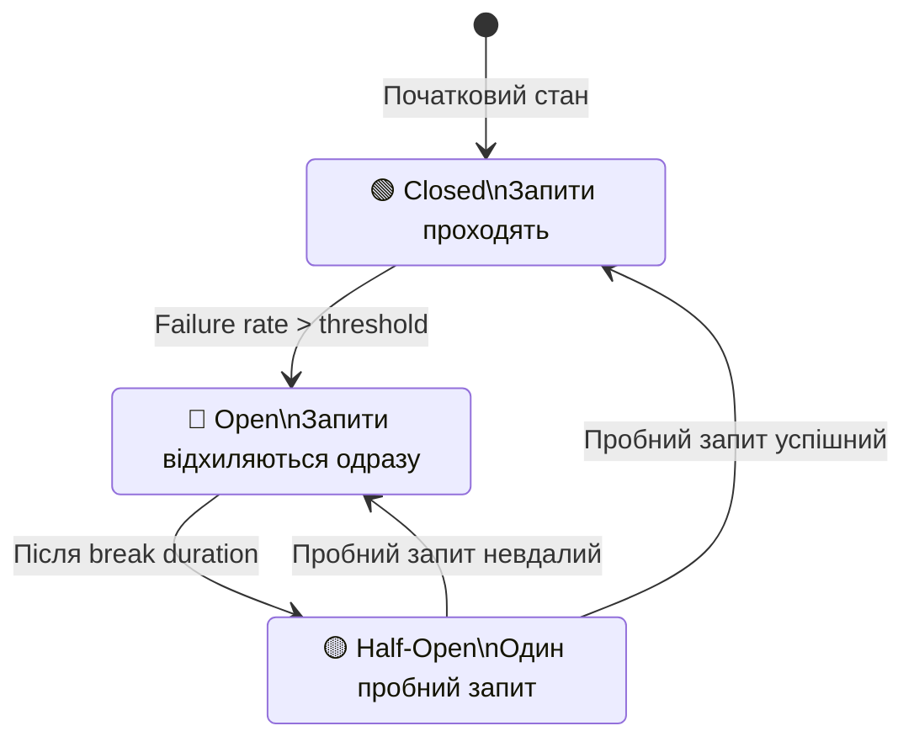

# Відмовостійкість з Polly в ASP.NET Core

::note
Ваш додаток викликає зовнішнє API оплати. Раптово API відповідає із затримкою 30 секунд або взагалі не відповідає. Без захисного механізму ваш додаток «замерзає», накопичує відкриті з'єднання і в результаті падає. Polly — це бібліотека відмовостійкості, що реалізує принцип «очікуй відмов і дій відповідно».
::

---

## 1. Що таке Resilience (відмовостійкість)?

**Resilience** (відмовостійкість) — здатність системи продовжувати функціонувати або коректно деградувати під впливом збоїв: мережевих помилок, тайм-аутів, перевантаження зовнішніх сервісів.

Без резильєнтності навіть тимчасова недоступність зовнішнього сервісу може призвести до каскадного збою всього додатку. Polly вирішує цю проблему через набір **resilience strategies** (стратегій відмовостійкості):

::card-group

::card{title="Retry" icon="i-lucide-refresh-cw"}
Повторює запит при тимчасових збоях. Ідеально для мережевих затримок.
::

::card{title="Circuit Breaker" icon="i-lucide-zap-off"}
«Вимикач»: після N збоїв підряд припиняє спроби на певний час.
::

::card{title="Timeout" icon="i-lucide-clock"}
Скасовує запит, якщо він виконується довше заданого ліміту.
::

::card{title="Fallback" icon="i-lucide-git-branch"}
Запасний план: повертає дефолтне значення при збої основного.
::

::card{title="Rate Limiter" icon="i-lucide-gauge"}
Обмежує кількість виклчів за одиницю часу для захисту downstream.
::

::card{title="Hedging" icon="i-lucide-split"}
Паралельно надсилає кілька запитів, повертає перший успішний.
::

::

---

## 2. Polly у .NET 8+: Resilience Pipelines

Починаючи з .NET 8, Microsoft разом з командою Polly додали підтримку резильєнтності безпосередньо у framework через `Microsoft.Extensions.Http.Resilience`. Це об'єднує Polly v8 з DI та HttpClient.

### Встановлення

::code-group

```bash [Сучасний підхід — .NET 8+]
dotnet add package Microsoft.Extensions.Http.Resilience
dotnet add package Polly.Core
```

```bash [Класичний Polly (v7)]
dotnet add package Polly
dotnet add package Microsoft.Extensions.Http.Polly
```

::

### Вбудований Standard Resilience Handler

Найшвидший спосіб додати резильєнтність — `AddStandardResilienceHandler()`:

```csharp [Program.cs — Standard Resilience Handler]
builder.Services.AddHttpClient<IPaymentGateway, PaymentGateway>(client =>
{
    client.BaseAddress = new Uri("https://payment-api.example.com");
    client.Timeout     = TimeSpan.FromSeconds(30);
})
.AddStandardResilienceHandler();  // Вмикає: Retry + Circuit Breaker + Timeout
```

`AddStandardResilienceHandler()` автоматично налаштовує:
- **Retry**: 3 спроби з exponential backoff
- **Circuit Breaker**: відкривається після 10% помилок протягом 30 секунд
- **Timeout на спробу**: 10 секунд на кожну спробу  
- **Загальний Timeout**: 30 секунд на весь ланцюжок

---

## 3. Retry: Повтор при збоях

### Концепція Retry

**Retry** (повтор) — найпростіша стратегія: якщо запит завершився збоєм, спробуємо ще раз. Логіка: більшість мережевих проблем — тимчасові (transient faults).

```csharp [Program.cs — налаштування Retry вручну]
using Polly;
using Polly.Retry;

builder.Services.AddHttpClient<IWeatherService, WeatherService>()
    .AddResilienceHandler("weather-retry", pipelineBuilder =>
    {
        pipelineBuilder.AddRetry(new RetryStrategyOptions<HttpResponseMessage>
        {
            // Максимальна кількість повторів (не рахуючи перший запит)
            MaxRetryAttempts = 3,

            // Базова затримка між спробами (exponential: 1s, 2s, 4s)
            Delay = TimeSpan.FromSeconds(1),
            BackoffType = DelayBackoffType.Exponential,

            // Додаємо випадковий «шум» (jitter) щоб уникнути «thundering herd»
            // Усі клієнти одночасно не ретраються у той самий момент
            UseJitter = true,

            // Які помилки вважати «ретраблями»
            ShouldHandle = new PredicateBuilder<HttpResponseMessage>()
                .Handle<HttpRequestException>()
                .Handle<TimeoutRejectedException>()
                .HandleResult(r => r.StatusCode == HttpStatusCode.ServiceUnavailable)
                .HandleResult(r => r.StatusCode == HttpStatusCode.TooManyRequests),

            // Колбек при кожній спробі
            OnRetry = static args =>
            {
                Console.WriteLine(
                    $"Retry #{args.AttemptNumber}. Delay: {args.RetryDelay.TotalSeconds:F1}s");
                return ValueTask.CompletedTask;
            }
        });
    });
```

### Exponential Backoff + Jitter

Проста стратегія «retry відразу» може погіршити ситуацію: якщо 1000 клієнтів одночасно отримали помилку і одночасно ретраються — сервер отримує навантаження в 1000 разів більше. Рішення:

- **Exponential backoff**: кожна наступна спроба чекає вдвічі довше (1с → 2с → 4с → 8с).
- **Jitter**: додаємо випадкову величину до затримки (1.3с → 1.7с → 4.2с → 7.8с).

::mermaid


::

---

## 4. Circuit Breaker: Запобіжник

### Аналогія з електрикою

Circuit Breaker (автоматичний вимикач) — це «запобіжник» для HTTP-запитів. В електриці: якщо виникає коротке замикання — запобіжник розриває ланцюг, захищаючи пристрої. В мікросервісах: якщо downstream-сервіс стабільно падає — припиняємо надсилати запити, даємо йому «відпочити».

### Стани Circuit Breaker

::mermaid



::

- **Closed** (закритий): нормальний стан. Запити проходять.
- **Open** (відкритий): сервіс недоступний. Запити відхиляються **одразу** без мережевого виклику. Це захищає downstream.
- **Half-Open** (напіввідкритий): через певний час пропускаємо один «пробний» запит. Якщо успішний — переходимо в Closed. Если ні — назад в Open.

```csharp [Налаштування Circuit Breaker]
pipelineBuilder.AddCircuitBreaker(new CircuitBreakerStrategyOptions<HttpResponseMessage>
{
    // Мінімальна кількість запитів для розрахунку відсотка помилок
    MinimumThroughput = 10,

    // Якщо більше 50% запитів за останні 30 секунд завершились збоєм — відкриваємо
    FailureRatio = 0.5,

    // Вікно спостереження (sampling window)
    SamplingDuration = TimeSpan.FromSeconds(30),

    // Скільки часу тримати circuit breaker відкритим
    BreakDuration = TimeSpan.FromSeconds(15),

    ShouldHandle = new PredicateBuilder<HttpResponseMessage>()
        .Handle<HttpRequestException>()
        .HandleResult(r => r.StatusCode >= HttpStatusCode.InternalServerError),

    OnOpened = static args =>
    {
        Console.WriteLine(
            $"⚡ Circuit Breaker відкрито! Причина: {args.Outcome.Exception?.Message}");
        return ValueTask.CompletedTask;
    },

    OnClosed = static _ =>
    {
        Console.WriteLine("✅ Circuit Breaker закрито — сервіс відновився.");
        return ValueTask.CompletedTask;
    }
});
```

### Коли Circuit Breaker відкритий — помилка BrokenCircuitException

```csharp [Обробка BrokenCircuitException або BrokenCircuit]
try
{
    var result = await _httpClient.GetAsync("/api/products");
    // ...
}
catch (BrokenCircuitException)
{
    // Circuit Breaker відкритий — повертаємо cached або дефолтне значення
    return _cache.Get<List<Product>>("products") ?? [];
}
```

---

## 5. Timeout та Fallback

### Timeout

```csharp [Налаштування Timeout]
pipelineBuilder.AddTimeout(new TimeoutStrategyOptions
{
    // Якщо після 5 секунд немає відповіді — скасовуємо
    Timeout = TimeSpan.FromSeconds(5),

    OnTimeout = static args =>
    {
        Console.WriteLine(
            $"⏱ Timeout! Операція тривала більше {args.Timeout.TotalSeconds}s");
        return ValueTask.CompletedTask;
    }
});
```

### Fallback: Запасний план

**Fallback** (запасний план) — якщо основна операція не вдалася, повертаємо заздалегідь підготований результат:

```csharp [Fallback стратегія]
pipelineBuilder.AddFallback(new FallbackStrategyOptions<HttpResponseMessage>
{
    ShouldHandle = new PredicateBuilder<HttpResponseMessage>()
        .Handle<TimeoutRejectedException>()
        .Handle<BrokenCircuitException>()
        .Handle<HttpRequestException>(),

    // Що повертати при збої
    FallbackAction = static args =>
    {
        var fallbackResponse = new HttpResponseMessage(HttpStatusCode.OK)
        {
            Content = new StringContent(
                """{"products": [], "source": "cache", "degraded": true}""",
                Encoding.UTF8, "application/json")
        };
        return ValueTask.FromResult(fallbackResponse);
    },

    OnFallback = static args =>
    {
        Console.WriteLine(
            $"⚠️ Fallback активовано. Причина: {args.Outcome.Exception?.Message}");
        return ValueTask.CompletedTask;
    }
});
```

---

## 6. Повна Resilience Pipeline

Стратегії можна об'єднувати в один pipeline. Порядок важливий — виконуються зовні досередини:

```csharp [Program.cs — повна Resilience Pipeline]
builder.Services.AddHttpClient<IPaymentGateway, PaymentGateway>(client =>
    client.BaseAddress = new Uri("https://payment-api.example.com"))
.AddResilienceHandler("payment-pipeline", pipeline =>
{
    // 1. Fallback (зовнішній — перший що спрацює при будь-якій помилці)
    pipeline.AddFallback(new FallbackStrategyOptions<HttpResponseMessage>
    {
        ShouldHandle = new PredicateBuilder<HttpResponseMessage>()
            .Handle<Exception>(),
        FallbackAction = _ =>
        {
            var r = new HttpResponseMessage(HttpStatusCode.ServiceUnavailable)
            {
                Content = new StringContent("""{"error": "Payment service unavailable"}""")
            };
            return ValueTask.FromResult(r);
        }
    });

    // 2. Circuit Breaker
    pipeline.AddCircuitBreaker(new CircuitBreakerStrategyOptions<HttpResponseMessage>
    {
        FailureRatio      = 0.5,
        MinimumThroughput = 5,
        SamplingDuration  = TimeSpan.FromSeconds(10),
        BreakDuration     = TimeSpan.FromSeconds(30)
    });

    // 3. Retry (внутрішній — виконується до Circuit Breaker)
    pipeline.AddRetry(new RetryStrategyOptions<HttpResponseMessage>
    {
        MaxRetryAttempts = 3,
        Delay            = TimeSpan.FromMilliseconds(500),
        BackoffType      = DelayBackoffType.Exponential,
        UseJitter        = true,
        ShouldHandle     = new PredicateBuilder<HttpResponseMessage>()
            .Handle<HttpRequestException>()
            .HandleResult(r => r.StatusCode == HttpStatusCode.ServiceUnavailable)
    });

    // 4. Timeout на кожну спробу (найвнутрішніший)
    pipeline.AddTimeout(TimeSpan.FromSeconds(5));
});
```

При запиті порядок виконання: Fallback → CircuitBreaker → Retry → [Timeout → Запит] → Retry → CircuitBreaker → Fallback. Тобто Timeout застосовується до кожної спроби в Retry, а Circuit Breaker рахує загальну кількість помилок.

---

## 7. ResiliencePipelineProvider: Ручне використання

Для не-HTTP коду (виклики до Redis, файлової системи) використовуйте `ResiliencePipelineProvider<TKey>`:

```csharp [Services/ResilientRedisService.cs]
using Polly;
using Polly.Registry;

public class ResilientRedisService
{
    private readonly ResiliencePipeline _pipeline;
    private readonly IConnectionMultiplexer _redis;

    public ResilientRedisService(
        ResiliencePipelineProvider<string> pipelineProvider,
        IConnectionMultiplexer redis)
    {
        _pipeline = pipelineProvider.GetPipeline("redis-pipeline");
        _redis    = redis;
    }

    public async Task<string?> GetAsync(string key)
    {
        return await _pipeline.ExecuteAsync(async ct =>
        {
            var db    = _redis.GetDatabase();
            var value = await db.StringGetAsync(key);
            return (string?)value;
        });
    }
}
```

```csharp [Program.cs — реєстрація кастомного Pipeline]
builder.Services.AddResiliencePipeline("redis-pipeline", (pipelineBuilder, _) =>
{
    pipelineBuilder
        .AddRetry(new RetryStrategyOptions
        {
            MaxRetryAttempts  = 3,
            Delay             = TimeSpan.FromMilliseconds(100),
            BackoffType       = DelayBackoffType.Exponential,
            ShouldHandle      = new PredicateBuilder()
                .Handle<RedisException>()
                .Handle<TimeoutException>()
        })
        .AddTimeout(TimeSpan.FromSeconds(2));
});
```

---

## Практичні завдання

::accordion
::accordion-item{label="Рівень 1: Базовий Retry" icon="i-lucide-refresh-cw"}

**Завдання 1.1.** Налаштуйте `HttpClient` для зовнішнього `WeatherAPI` з Retry-стратегією: 3 спроби, exponential backoff (1s, 2s, 4s), jitter. Логуйте номер спроби при кожному ретраї.

**Завдання 1.2.** Додайте Timeout 5 секунд до кожної спроби. Протестуйте поведінку при затримці сервера.

::
::accordion-item{label="Рівень 2: Circuit Breaker" icon="i-lucide-zap-off"}

**Завдання 2.1.** Реалізуйте Circuit Breaker для `PaymentService`: відкривається після 30% помилок за 20 секунд (мінімум 5 запитів). Break duration — 10 секунд. Логуйте зміни стану.

**Завдання 2.2.** Додайте Fallback до Payment Circuit Breaker: при відкритому ланцюзі повертайте `ErrorOr` з помилкою `Error.Unavailable("Payment.Unavailable", "Сервіс оплати тимчасово недоступний. Спробуйте через кілька хвилин.")`.

::
::accordion-item{label="Рівень 3: Повна Pipeline" icon="i-lucide-layers"}

**Завдання 3.1.** Побудуйте повну resilience pipeline для `NotificationService` (SMS gateway): Fallback → CircuitBreaker → Retry (3 спроби, exponential) → Timeout (3s). При Fallback — зберігайте повідомлення в чергу (IQueue) для пізнішого відправлення.

**Завдання 3.2.** Напишіть тест, що симулює: перша спроба — timeout, друга — 503, третя — успіх. Переконайтесь, що retry відпрацював 3 рази і повернув результат.

::
::

---

## Резюме

Polly перетворює ваш код із «наївного» на «захищений»:

::card-group

::card{title="Retry" icon="i-lucide-refresh-cw"}
Тимчасові збої — це норма мережевого середовища. Exponential + Jitter запобігає «thundering herd».
::

::card{title="Circuit Breaker" icon="i-lucide-zap-off"}
Не тривожить нездоровий сервіс. Дає йому час відновитися. Захищає від каскадних збоїв.
::

::card{title=".NET 8 Integration" icon="i-lucide-package"}
`AddStandardResilienceHandler()` — готова до виробництва конфігурація одним рядком.
::

::card{title="Composable" icon="i-lucide-layers"}
Стратегії складаються у pipeline. Кожна шар захищає від свого типу збоїв.
::

::

**Посилання**:
- [Polly на GitHub](https://github.com/App-vNext/Polly)
- [Microsoft.Extensions.Http.Resilience](https://learn.microsoft.com/en-us/dotnet/core/resilience/)
- [Polly v8 документація](https://www.pollydocs.org/)
