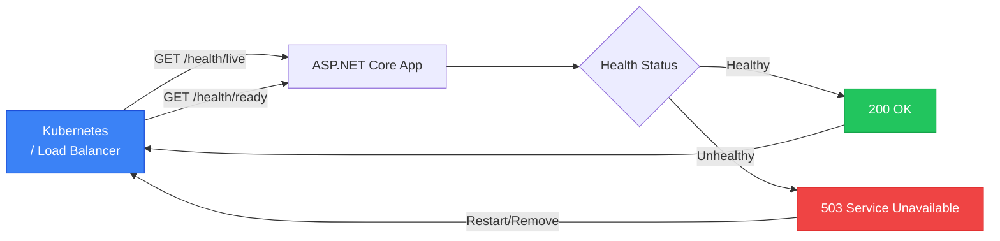

# Health Checks в ASP.NET Core

::note
Коли продукт-менеджер запитує «чи все добре з системою?», відповідь не може бути «дивіться логи». Health Checks — це стандартизований ендпоінт `/health`, що у реальному часі показує стан системи та всіх її залежностей: бази даних, Redis, зовнішніх API, черг повідомлень.
::

---

## 1. Навіщо Health Checks?

У сучасних хмарних середовищах (Kubernetes, Azure App Service) оркестратори постійно перевіряють здоров'я контейнерів через два типи проб:

- **Liveness probe**: «чи живий процес?». Якщо ні — перезапустити контейнер.
- **Readiness probe**: «чи готовий приймати трафік?». Якщо ні — вивести з балансувальника навантаження.

Health Checks в ASP.NET Core реалізують обидві концепції через єдину систему.

::mermaid



::

---

## 2. Базові Health Checks

### Встановлення та мінімальна конфігурація

```csharp [Program.cs — базові Health Checks]
var builder = WebApplication.CreateBuilder(args);

// Реєстрація Health Checks
builder.Services.AddHealthChecks()
    // Вбудована перевірка БД через EF Core
    .AddDbContextCheck<AppDbContext>()
    // Перевірка доступності URL
    .AddUrlGroup(new Uri("https://api.example.com/ping"), "external-api");

var app = builder.Build();

// Базовий ендпоінт
app.MapHealthChecks("/health");

// Розширений ендпоінт з деталями (для внутрішнього моніторингу)
app.MapHealthChecks("/health/detail", new HealthCheckOptions
{
    ResponseWriter = UIResponseWriter.WriteHealthCheckUIResponse
});

app.Run();
```

```json [Відповідь /health (базова)]
{
  "status": "Healthy"
}
```

---

## 3. Бібліотека AspNetCore.HealthChecks

Пакет `AspNetCore.HealthChecks.*` надає готові перевірки для популярних технологій:

::code-group

```bash [Встановлення пакетів]
dotnet add package AspNetCore.HealthChecks.SqlServer
dotnet add package AspNetCore.HealthChecks.NpgSql
dotnet add package AspNetCore.HealthChecks.Redis
dotnet add package AspNetCore.HealthChecks.Uris
dotnet add package AspNetCore.HealthChecks.UI
dotnet add package AspNetCore.HealthChecks.UI.Client
dotnet add package AspNetCore.HealthChecks.UI.InMemory.Storage
```

::

```csharp [Program.cs — повна конфігурація Health Checks]
builder.Services.AddHealthChecks()
    // SQL Server / PostgreSQL
    .AddNpgSql(
        connectionString: builder.Configuration.GetConnectionString("Default")!,
        name:             "postgresql",
        tags:             ["database", "ready"])

    // Redis
    .AddRedis(
        redisConnectionString: builder.Configuration.GetConnectionString("Redis")!,
        name:                  "redis",
        tags:                  ["cache", "ready"])

    // Зовнішнє API
    .AddUrlGroup(
        uri:     new Uri("https://payment-api.example.com/health"),
        name:    "payment-api",
        tags:    ["external", "ready"])

    // Доступне місце на диску
    .AddDiskStorageHealthCheck(
        setup:  s => s.AddDrive("C:\\", minimumFreeMegabytes: 1024),
        name:   "disk-storage",
        tags:   ["infrastructure"]);

// Health Check UI
builder.Services.AddHealthChecksUI(setup =>
{
    setup.SetEvaluationTimeInSeconds(30);   // Перевірка кожні 30 секунд
    setup.MaximumHistoryEntriesPerEndpoint(50);
    setup.AddHealthCheckEndpoint("Production API", "/health/detail");
}).AddInMemoryStorage();
```

```csharp [Program.cs — ендпоінти з фільтрацією по тегах]
// Liveness: лише чи живий процес (без зовнішніх залежностей)
app.MapHealthChecks("/health/live", new HealthCheckOptions
{
    Predicate = _ => false  // Жодних перевірок — просто «я живий»
});

// Readiness: готовність приймати трафік (із залежностями)
app.MapHealthChecks("/health/ready", new HealthCheckOptions
{
    Predicate      = hc => hc.Tags.Contains("ready"),
    ResponseWriter = UIResponseWriter.WriteHealthCheckUIResponse
});

// Детальний звіт для внутрішнього моніторингу
app.MapHealthChecks("/health/detail", new HealthCheckOptions
{
    ResponseWriter = UIResponseWriter.WriteHealthCheckUIResponse
})
.RequireAuthorization();  // Захищаємо від публічного доступу

// UI Dashboard
app.MapHealthChecksUI(config => config.UIPath = "/health-ui");
```

---

## 4. Кастомний Health Check

Для перевірок специфічних для вашої бізнес-логіки:

```csharp [HealthChecks/DatabaseMigrationHealthCheck.cs]
using Microsoft.Extensions.Diagnostics.HealthChecks;

public class DatabaseMigrationHealthCheck : IHealthCheck
{
    private readonly AppDbContext _db;
    private readonly ILogger<DatabaseMigrationHealthCheck> _logger;

    public DatabaseMigrationHealthCheck(
        AppDbContext db,
        ILogger<DatabaseMigrationHealthCheck> logger)
    {
        _db     = db;
        _logger = logger;
    }

    public async Task<HealthCheckResult> CheckHealthAsync(
        HealthCheckContext context,
        CancellationToken ct = default)
    {
        try
        {
            // Перевіряємо, чи всі міграції застосовані
            var pendingMigrations = await _db.Database
                .GetPendingMigrationsAsync(ct);

            var pendingList = pendingMigrations.ToList();

            if (pendingList.Count == 0)
            {
                return HealthCheckResult.Healthy(
                    "Всі міграції застосовані.");
            }

            return HealthCheckResult.Degraded(
                description: $"Є {pendingList.Count} незастосованих міграцій.",
                data: new Dictionary<string, object>
                {
                    ["pendingMigrations"] = pendingList
                });
        }
        catch (Exception ex)
        {
            _logger.LogError(ex, "Помилка перевірки міграцій БД.");

            return HealthCheckResult.Unhealthy(
                description: "Не вдалося підключитися до БД.",
                exception:   ex);
        }
    }
}
```

```csharp [HealthChecks/ExternalLicenseHealthCheck.cs — бізнес-перевірка]
public class LicenseValidityHealthCheck : IHealthCheck
{
    private readonly ILicenseService _licenseService;

    public LicenseValidityHealthCheck(ILicenseService licenseService)
        => _licenseService = licenseService;

    public async Task<HealthCheckResult> CheckHealthAsync(
        HealthCheckContext context,
        CancellationToken ct = default)
    {
        var license = await _licenseService.GetCurrentAsync();

        if (license is null)
            return HealthCheckResult.Unhealthy("Ліцензія не знайдена.");

        var daysUntilExpiry = (license.ExpiresAt - DateTime.UtcNow).TotalDays;

        return daysUntilExpiry switch
        {
            < 0   => HealthCheckResult.Unhealthy(
                         $"Ліцензія прострочена {Math.Abs(daysUntilExpiry):F0} днів тому."),
            < 7   => HealthCheckResult.Degraded(
                         $"Ліцензія спливає через {daysUntilExpiry:F0} днів!"),
            _     => HealthCheckResult.Healthy(
                         $"Ліцензія дійсна. Спливає через {daysUntilExpiry:F0} днів.")
        };
    }
}
```

```csharp [Program.cs — реєстрація кастомних checks]
builder.Services.AddHealthChecks()
    .AddCheck<DatabaseMigrationHealthCheck>(
        name: "db-migrations",
        tags: ["database", "ready"])
    .AddCheck<LicenseValidityHealthCheck>(
        name:               "license",
        failureStatus:      HealthStatus.Degraded,
        tags:               ["business"]);
```

---

## 5. Відповідь з деталями

Стандартний `UIResponseWriter.WriteHealthCheckUIResponse` повертає детальний JSON:

```json
{
  "status": "Degraded",
  "totalDuration": "00:00:00.045",
  "entries": {
    "postgresql": {
      "status": "Healthy",
      "duration": "00:00:00.012",
      "tags": ["database", "ready"]
    },
    "redis": {
      "status": "Healthy",
      "duration": "00:00:00.008",
      "tags": ["cache", "ready"]
    },
    "payment-api": {
      "status": "Degraded",
      "description": "Service responding slowly (1234ms)",
      "duration": "00:00:01.234",
      "tags": ["external", "ready"]
    },
    "license": {
      "status": "Degraded",
      "description": "Ліцензія спливає через 5 днів!",
      "duration": "00:00:00.003",
      "tags": ["business"]
    }
  }
}
```

Три стани:
- `Healthy` → HTTP 200
- `Degraded` → HTTP 200 (система працює, але не оптимально)
- `Unhealthy` → HTTP 503 (система недоступна)

---

## Практичні завдання

::accordion
::accordion-item{label="Рівень 1: Базовий Health Check" icon="i-lucide-heart"}
**Завдання 1.1.** Налаштуйте `/health/live` (без перевірок) та `/health/ready` (з перевіркою PostgreSQL та Redis). Переконайтеся, що при недоступному Redis статус `ready` стає `Unhealthy`.
::
::accordion-item{label="Рівень 2: Кастомна перевірка" icon="i-lucide-settings-2"}
**Завдання 2.1.** Реалізуйте `QueueHealthCheck`, що перевіряє розмір черги повідомлень: `Healthy` якщо < 100 елементів, `Degraded` якщо 100-500, `Unhealthy` якщо > 500.
::
::accordion-item{label="Рівень 3: UI Dashboard" icon="i-lucide-layout-dashboard"}
**Завдання 3.1.** Підключіть HealthChecks UI (InMemory Storage). Налаштуйте 5-6 перевірок із різними тегами. Захистіть `/health/detail` та `/health-ui` авторизацією.
::
::

---

## Резюме

::card-group
::card{title="Liveness vs Readiness" icon="i-lucide-activity"}
Два типи перевірок: «я живий» (процес запущений) та «я готовий» (всі залежності доступні).
::
::card{title="Готові інтеграції" icon="i-lucide-plug"}
`AspNetCore.HealthChecks.*` покриває SQL Server, PostgreSQL, Redis, RabbitMQ та десятки інших.
::
::card{title="UI Dashboard" icon="i-lucide-monitor"}
HealthChecks UI надає веб-інтерфейс з історією та поточним станом усіх перевірок.
::
::

**Посилання**:
- [ASP.NET Core Health Checks](https://learn.microsoft.com/en-us/aspnet/core/host-and-deploy/health-checks)
- [AspNetCore.Diagnostics.HealthChecks](https://github.com/Xabaril/AspNetCore.Diagnostics.HealthChecks)
