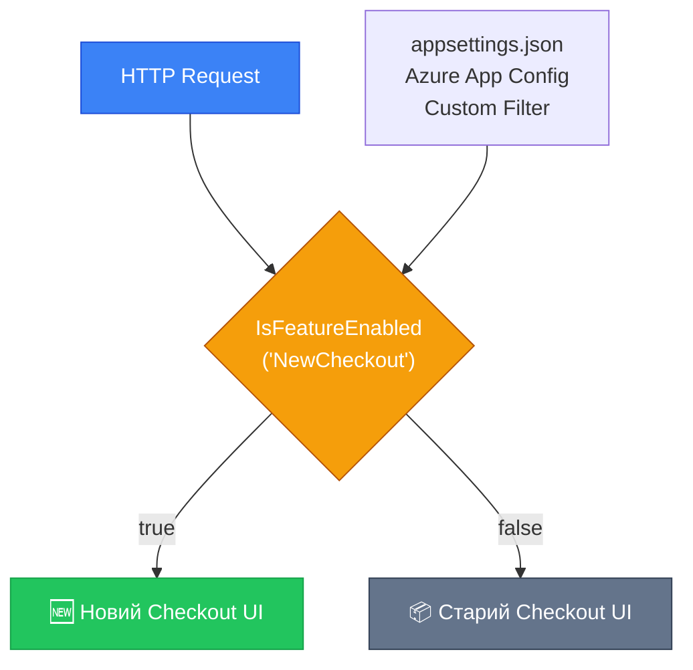

# Feature Management та Feature Flags в ASP.NET Core

::note
Нова функція готова до коду, але ринкова команда хоче випустити її лише через 2 тижні. Або потрібно провести A/B-тест: показати нову сторінку 10% користувачів і виміряти конверсію. Або терміново вимкнути «сиру» фічу в продакшені без деплою. Feature Flags (прапори функцій) — це механізм, що відокремлює деплой коду від активації функцій.
::

---

## 1. Концепція Feature Flags

**Feature Flag** (прапор функції), також відомий як Feature Toggle, — це конфігураційний параметр, що вмикає або вимикає шматок функціональності без зміни або перегортання коду.

```
Deploy code → Feature is OFF → QA tests on production → Marketing says GO → Feature turns ON
```

Переваги:
- **Trunk-based development**: всі гілки зливаються до main, нові фічі приховані за флагами.
- **Поступовий rollout**: 1% → 10% → 100% користувачів.
- **A/B тестування**: різна поведінка для різних груп.
- **Kill switch**: миттєве вимкнення проблемної фічі без деплою.

::mermaid



::

---

## 2. Встановлення та базова конфігурація

### Встановлення

::code-group

```bash [Основний пакет]
dotnet add package Microsoft.FeatureManagement.AspNetCore
```

```bash [З Azure App Configuration]
dotnet add package Microsoft.Azure.AppConfiguration.AspNetCore
dotnet add package Microsoft.FeatureManagement.AspNetCore
```

::

### Конфігурація в appsettings.json

```json [appsettings.json — Feature Flags]
{
  "FeatureManagement": {
    "NewDashboard":    true,
    "BetaCheckout":    false,
    "DarkMode":        true,
    "AdvancedSearch":  false,
    "ExperimentalApi": false
  }
}
```

```csharp [Program.cs — реєстрація]
using Microsoft.FeatureManagement;

builder.Services.AddFeatureManagement();
// або з конфігурацією:
builder.Services
    .AddFeatureManagement()
    .AddFeatureFilter<PercentageFilter>()
    .AddFeatureFilter<TimeWindowFilter>()
    .AddFeatureFilter<TargetingFilter>();
```

---

## 3. Використання IFeatureManager

### У сервісах та контролерах

```csharp [Services/SearchService.cs — IFeatureManager]
using Microsoft.FeatureManagement;

public class SearchService
{
    private readonly IFeatureManager _featureManager;
    private readonly ISearchProvider _basicSearch;
    private readonly IElasticsearchProvider _elasticSearch;

    public SearchService(
        IFeatureManager featureManager,
        ISearchProvider basicSearch,
        IElasticsearchProvider elasticSearch)
    {
        _featureManager = featureManager;
        _basicSearch    = basicSearch;
        _elasticSearch  = elasticSearch;
    }

    public async Task<SearchResult> SearchAsync(string query)
    {
        // Перевіряємо чи увімкнена фіча
        if (await _featureManager.IsEnabledAsync(FeatureFlags.AdvancedSearch))
        {
            return await _elasticSearch.SearchAsync(query);
        }

        return await _basicSearch.SearchAsync(query);
    }
}

// Константи для назв флагів — уникаємо «магічних рядків»
public static class FeatureFlags
{
    public const string NewDashboard    = "NewDashboard";
    public const string BetaCheckout   = "BetaCheckout";
    public const string AdvancedSearch  = "AdvancedSearch";
    public const string DarkMode        = "DarkMode";
    public const string ExperimentalApi = "ExperimentalApi";
}
```

### В Minimal API через атрибут або перевірку

```csharp [Program.cs — Feature Flags у Minimal API]
// Спосіб 1: Явна перевірка
app.MapGet("/api/v2/search", async (
    string q,
    IFeatureManager features) =>
{
    if (!await features.IsEnabledAsync(FeatureFlags.ExperimentalApi))
        return Results.NotFound();

    return Results.Ok(/* нова логіка */);
});

// Спосіб 2: Middleware-фільтр (ендпоінт повернить 404 якщо флаг вимкнений)
app.MapGet("/api/new-checkout", () => Results.Ok("New Checkout!"))
    .WithMetadata(new FeatureGateAttribute(FeatureFlags.BetaCheckout));
```

---

## 4. Feature Filters: Умовне вмикання

### PercentageFilter: Rollout на частину трафіку

```json [appsettings.json — Percentage Rollout]
{
  "FeatureManagement": {
    "NewCheckoutUI": {
      "EnabledFor": [
        {
          "Name": "Microsoft.Percentage",
          "Parameters": {
            "Value": 10
          }
        }
      ]
    }
  }
}
```

Цей флаг вмикається для **випадкових 10% запитів**. Корисно для поступового rollout — з 10% до 25% до 50% до 100%.

::warning
`PercentageFilter` визначає 10% **на рівні запитів**, а не на рівні користувачів. Один і той самий користувач може бачити різну поведінку при різних запитах. Для consistent user experience — використовуйте `TargetingFilter`.
::

### TimeWindowFilter: Активація за розкладом

```json [appsettings.json — Time Window]
{
  "FeatureManagement": {
    "BlackFridayPromotions": {
      "EnabledFor": [
        {
          "Name": "Microsoft.TimeWindow",
          "Parameters": {
            "Start": "2024-11-29T00:00:00+02:00",
            "End":   "2024-11-30T23:59:59+02:00"
          }
        }
      ]
    }
  }
}
```

Фіча автоматично вмикається та вимикається у задані дати. Ідеально для сезонних акцій.

### TargetingFilter: Точне таргетування

```json [appsettings.json — Targeting]
{
  "FeatureManagement": {
    "AdminPanel2": {
      "EnabledFor": [
        {
          "Name": "Microsoft.Targeting",
          "Parameters": {
            "Audience": {
              "Users":  ["admin@example.com", "cto@example.com"],
              "Groups": [
                { "Name": "beta-testers", "RolloutPercentage": 100 },
                { "Name": "premium-users", "RolloutPercentage": 25 }
              ],
              "DefaultRolloutPercentage": 0
            }
          }
        }
      ]
    }
  }
}
```

- `Users` — конкретні користувачі завжди бачать фічу (whitelist).
- `Groups` — група `beta-testers` бачить 100%, `premium-users` — 25%.
- `DefaultRolloutPercentage: 0` — всі інші не бачать.

```csharp [Реєстрація ITargetingContextAccessor]
public class HttpContextTargetingContextAccessor : ITargetingContextAccessor
{
    private readonly IHttpContextAccessor _httpContextAccessor;

    public HttpContextTargetingContextAccessor(IHttpContextAccessor httpContextAccessor)
        => _httpContextAccessor = httpContextAccessor;

    public ValueTask<TargetingContext> GetContextAsync()
    {
        var httpContext = _httpContextAccessor.HttpContext;

        var userId = httpContext?.User?.FindFirst("sub")?.Value
                     ?? httpContext?.Connection.RemoteIpAddress?.ToString()
                     ?? "anonymous";

        // Групи визначаємо із claims користувача
        var groups = httpContext?.User?
            .FindAll("role")
            .Select(c => c.Value)
            .ToList() ?? [];

        return ValueTask.FromResult(new TargetingContext
        {
            UserId = userId,
            Groups = groups
        });
    }
}
```

```csharp [Program.cs]
builder.Services.AddHttpContextAccessor();
builder.Services.AddSingleton<ITargetingContextAccessor,
    HttpContextTargetingContextAccessor>();
```

---

## 5. Кастомний Feature Filter

```csharp [Filters/MaintenanceModeFilter.cs]
[FilterAlias("MaintenanceMode")]
public class MaintenanceModeFilter : IFeatureFilter
{
    private readonly IConfiguration _config;

    public MaintenanceModeFilter(IConfiguration config) => _config = config;

    public Task<bool> EvaluateAsync(FeatureFilterEvaluationContext context)
    {
        // Параметри з конфігурації
        var settings = context.Parameters.Get<MaintenanceModeSettings>()
                       ?? new MaintenanceModeSettings();

        // Перевіряємо розклад технічного обслуговування
        var now = DateTime.UtcNow;
        bool isMaintenanceTime = now.TimeOfDay >= settings.Start
                               && now.TimeOfDay <= settings.End;

        // Фіча ВИМКНЕНА під час обслуговування (інвертована логіка)
        return Task.FromResult(!isMaintenanceTime);
    }
}

public class MaintenanceModeSettings
{
    public TimeSpan Start { get; set; } = TimeSpan.FromHours(2);  // 02:00 UTC
    public TimeSpan End   { get; set; } = TimeSpan.FromHours(4);  // 04:00 UTC
}
```

---

## 6. Feature Variants та Конфігурація Значення

У `.FeatureManagement` 2.0 з'явились **Variants** — флаги що повертають не bool, а значення:

```json [appsettings.json — Feature Variants]
{
  "FeatureManagement": {
    "Greeting": {
      "Variants": [
        { "Name": "Formal",   "ConfigurationValue": "Доброго дня!" },
        { "Name": "Casual",   "ConfigurationValue": "Привіт!" }
      ],
      "Allocation": {
        "Percentile": [
          { "Variant": "Formal", "From": 0,  "To": 50 },
          { "Variant": "Casual", "From": 50, "To": 100 }
        ]
      }
    }
  }
}
```

```csharp [Використання Variants]
var variant = await _featureManager.GetVariantAsync("Greeting", cancellationToken);
var greeting = variant?.Configuration?.Value ?? "Вітаємо!";
```

---

## Практичні завдання

::accordion
::accordion-item{label="Рівень 1: Базові флаги" icon="i-lucide-toggle-left"}
**Завдання 1.1.** Додайте Feature Flag `BetaApi` до `appsettings.json`. Реалізуйте ендпоінт `GET /api/beta/products`, що повертає 404 якщо флаг вимкнений, або розширену відповідь якщо увімкнений.
::
::accordion-item{label="Рівень 2: Feature Filters" icon="i-lucide-filter"}
**Завдання 2.1.** Налаштуйте `PercentageFilter` для флагу `NewHomepage` на 20% трафіку. Реалізуйте `TargetingFilter` для флагу `AdminFeature`, що вмикається лише для email-адрес з доменом `@company.com`.
::
::accordion-item{label="Рівень 3: Кастомний фільтр" icon="i-lucide-code-2"}
**Завдання 3.1.** Реалізуйте `GeolocationFilter`, що вмикає фічу лише для запитів з певної країни (на основі заголовка `CF-IPCountry` від Cloudflare). Протестуйте з мокovanим `IHttpContextAccessor`.
::
::

---

## Резюме

::card-group
::card{title="Deploy vs Release" icon="i-lucide-git-merge"}
Код деплоїться постійно. Фічі вмикаються за розкладом. Ніяких feature-гілок.
::
::card{title="Поступовий rollout" icon="i-lucide-trending-up"}
1% → 10% → 50% → 100%. Проблема на 1%? Одразу вимкнути без деплою.
::
::card{title="Zero config" icon="i-lucide-settings"}
`appsettings.json` достатньо для початку. Azure App Configuration для prod-рівня.
::
::

**Посилання**:
- [Microsoft.FeatureManagement](https://learn.microsoft.com/en-us/azure/azure-app-configuration/use-feature-flags-dotnet-core)
- [Feature Management GitHub](https://github.com/microsoft/FeatureManagement-Dotnet)
