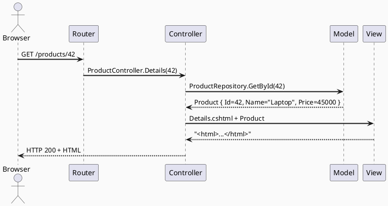

# Патерн MVC: архітектура, що змінила веб

Коли ваш застосунок був маленьким — одна сторінка, десяток рядків коду — все здавалося простим. Але той момент, коли логіка відображення, бізнес-правила та управління даними починають переплітатися в одному файлі, стає початком архітектурного кошмару. Саме цю проблему вирішив патерн, якому вже понад 40 років: **Model-View-Controller (MVC)**.

У цій статті ми не пишемо жодного рядка ASP.NET коду — ми вивчаємо **ідею**. Бо розробник, який розуміє _чому_ патерн існує, пише кращий код, ніж той, хто просто знає _як_ його застосувати.

::note
Ця стаття — виключно про архітектурний патерн MVC як концепцію. Реалізацію в ASP.NET Core розглядаємо з наступної статті.
::

---

## Проблема: коли код стає спагеті

Уявіть типовий PHP-файл з 2005 року — або будь-який код без архітектури:

```php
<?php
// Отримання даних з бази
$conn = mysqli_connect("localhost", "root", "", "shop");
$result = mysqli_query($conn, "SELECT * FROM products WHERE category = " . $_GET['cat']);

// Бізнес-логіка прямо тут
$products = [];
while ($row = mysqli_fetch_assoc($result)) {
    if ($row['stock'] > 0 && $row['price'] > 0) {
        $row['discount'] = $row['price'] * 0.1; // 10% знижка
        $products[] = $row;
    }
}

// HTML розмітка тут же
echo "<html><body>";
echo "<h1>Категорія: " . $_GET['cat'] . "</h1>";
foreach ($products as $p) {
    echo "<div>" . $p['name'] . " — " . $p['price'] . " грн</div>";
}
echo "</body></html>";
?>
```

Цей код робить **три принципово різні речі в одному місці**:
1. Отримує дані з бази (робота з Model)
2. Обчислює знижки (бізнес-логіка)
3. Генерує HTML (представлення)

**Наслідки:**
- Дизайнер не може змінити вигляд без ризику зламати логіку
- Неможливо протестувати бізнес-правила окремо
- Якщо потрібно показати ті самі дані по-іншому (наприклад, у форматі JSON для мобільного застосунку) — потрібно дублювати весь файл
- SQL-ін'єкція через `$_GET['cat']` — привіт, хакери

Саме тут на сцену виходить **Separation of Concerns** (розділення відповідальностей) — один із фундаментальних принципів програмування.

> **Принцип Separation of Concerns:** кожна частина програми повинна відповідати лише за одну чітко визначену функцію. Зміна одного аспекту не повинна вимагати змін в іншому.

---

## Народження MVC: SmallTalk-80 та Trygve Reenskaug

**1979 рік.** Норвезький вчений **Trygve Mikkjel Heyerdahl Reenskaug** працює в Xerox PARC над мовою SmallTalk. Він вирішує проблему, яка мучила розробників GUI-застосунків (графічний інтерфейс): як відокремити дані від їх відображення так, щоб одні й ті самі дані можна було показувати по-різному?

Його рішення — три пов'язані компоненти:
- **Model** — дані та правила роботи з ними
- **View** — візуалізація даних
- **Controller** — обробка дій користувача

У 1980 році це з'явилося в SmallTalk-80 як офіційний патерн. **Трюгве Реєнскауг** описав його так:

> _«MVC was conceived as a general solution to the problem of users controlling a large and complex data set.»_

Але тоді йшлося про **desktop-застосунки** з графічним інтерфейсом, де View реагував на зміни Model у реальному часі через Observer pattern. Для веб це виявилося трохи інакше.

{.diagram-img}

<!-- Search Query: MVC pattern Trygve Reenskaug original diagram 1979 SmallTalk -->

**1996 рік.** Java-фреймворк **Struts** адаптує MVC для веб. **2004 рік.** Ruby on Rails робить MVC мейнстримом. **2008 рік.** Microsoft випускає ASP.NET MVC. З того часу фреймворки Django (Python), Laravel (PHP), Spring MVC (Java), Angular (TypeScript) — всі так чи інакше реалізують цей 40-річний патерн.

---

## Ролі компонентів: хто за що відповідає

Розберемо кожен компонент на прикладі **інтернет-магазину**.

### Model: зберігач правди

**Model** — це не просто клас з полями. Це **все, що пов'язане з даними та бізнес-логікою**:

::card-group

::card{title="Domain Model" icon="i-lucide-database"}
Сутності предметної області: `Product`, `Order`, `Customer`. Вони відображають реальний світ і містять бізнес-правила: «товар не може мати від'ємну ціну», «замовлення без позицій не може бути підтверджено».
::

::card{title="Repository / Data Access" icon="i-lucide-hard-drive"}
Логіка роботи з базою даних або іншими джерелами даних. Model знає, як зберегти та отримати себе — але не знає, як виглядати.
::

::card{title="Business Logic / Services" icon="i-lucide-cog"}
Правила предметної галузі: розрахунок знижок, перевірка наявності на складі, розрахунок вартості доставки. Все це живе в Model.
::

::

**Ключове правило:** Model **нічого не знає** про View і Controller. Він незалежний. Саме тому ті ж дані продукту можна відобразити і як HTML-сторінку, і як JSON для API, і як PDF-звіт.

### View: майстер відображення

**View** — це шаблон, який перетворює дані на те, що бачить користувач. У веб-контексті це HTML+CSS, але може бути і JSON, XML, PDF.

**Ключове правило:** View **не містить бізнес-логіки**. Він не обчислює знижки — він лише відображає те, що отримав. Якщо у View є `if (price > 1000) { showFreeShipping(); }` — це вже бізнес-правило, якому не місце у View.

View може містити **логіку відображення** (iterating over a list, conditional CSS classes) — але не **бізнес-логіку**.

### Controller: координатор

**Controller** — це посередник. Він отримує запит від користувача, координує взаємодію між Model і View, і повертає результат.

Аналогія з ресторану:
- **Model** — кухар (знає рецепти, готує їжу)
- **View** — офіціант який подає страву (показує результат)
- **Controller** — менеджер залу (отримує замовлення, передає на кухню, координує подачу)

**Ключове правило:** Controller **тонкий** (thin controller). Він не містить бізнес-логіки — він лише делегує. «Fat Controller» (контролер з бізнес-логікою) — це анти-патерн.

```
❌ Fat Controller (анти-патерн):
Controller отримує запит → обчислює знижки → перевіряє склад →
формує email → зберігає замовлення → повертає View

✅ Thin Controller (правильно):
Controller отримує запит → викликає OrderService.CreateOrder() →
повертає View з результатом
```

---

## Lifecycle HTTP-запиту через MVC

У веб-застосунку запит проходить чіткий шлях:

::steps

### Запит надходить

Браузер надсилає `GET /products/42`. Маршрутизатор (Router) аналізує URL і визначає: цей запит має обробити `ProductController`, метод `Details`, з параметром `id = 42`.

### Controller приймає управління

`ProductController.Details(42)` викликається. Controller — це просто C#-клас з методами (Actions). Action-метод визначає, що потрібно зробити.

### Model отримує запит на дані

Controller каже: «Дай мені продукт з id = 42». `ProductRepository.GetById(42)` повертає об'єкт `Product`. Жодного HTML тут немає.

### Controller передає дані у View

Controller вибирає, який View показати, і передає туди отриманий `Product`. «Ось дані — відобрази їх».

### View генерує HTML

Шаблон `.cshtml` отримує `Product` і генерує HTML: назва, ціна, фото, кнопка «Купити». Жодної логіки тут немає — тільки шаблон.

### Відповідь повертається

Згенерований HTML повертається браузеру. Запит завершено.

::



---

## MVC у класичному розумінні vs. веб-MVC

Важливо розуміти: **веб-MVC відрізняється від оригінального MVC Реєнскауга**.

| Аспект | Класичний MVC (desktop) | Веб-MVC |
|---|---|---|
| Взаємодія | View і Model напряму пов'язані через Observer | View і Model не взаємодіють напряму |
| Оновлення | View автоматично оновлюється при зміні Model | Кожен запит — новий цикл Request→Response |
| Стан | View зберігає стан (open windows) | HTTP stateless — стан не зберігається між запитами |
| Controller | Обробляє input (клавіатура, миша) | Обробляє HTTP-запити |

У веб-MVC (включаючи ASP.NET Core MVC) View та Model **не взаємодіють напряму** — Controller завжди посередник. Це спрощення оригінальної ідеї, але воно ідеально підходить для stateless HTTP-протоколу.

::tip
Деякі пуристи кажуть, що «веб-MVC» — це насправді «MVP» (Model-View-Presenter). Не заглиблюйтеся у цю термінологічну суперечку — практична різниця незначна, а «MVC» залишається загальноприйнятим терміном.
::

---

## Варіації патерну: MVP, MVVM, MVT

MVC породив сімейство схожих патернів:

::tabs

::tabs-item{label="MVP" icon="i-lucide-layers"}

### Model-View-Presenter

**Де використовується:** Android (традиційний), WinForms, класичні мобільні застосунки.

**Відмінність від MVC:** Presenter (аналог Controller) — це посередник між Model та View, але View пасивний: він не знає про Model взагалі. Presenter отримує дані і сам оновлює View через інтерфейс.

```
View → Presenter → Model
        ↓
       View (через інтерфейс IView)
```

**Коли краще:** коли View потрібно ізолювати для юніт-тестів (View — це інтерфейс, легко підмінити mock).

::

::tabs-item{label="MVVM" icon="i-lucide-zap"}

### Model-View-ViewModel

**Де використовується:** WPF, Blazor, Angular, Vue.js, SwiftUI.

**Відмінність:** ViewModel — це не Controller і не Presenter. Це «адаптований Model для View». View прив'язується до ViewModel через Data Binding і автоматично оновлюється при зміні ViewModel (через INotifyPropertyChanged або Observable).

```
View ←[Data Binding]→ ViewModel → Model
```

**Коли краще:** реактивні UI з двостороннім зв'язуванням даних.
::

::tabs-item{label="MVT" icon="i-lucide-code-2"}

### Model-View-Template

**Де використовується:** Django (Python).

**Відмінність:** Template (аналог View) — статичний шаблон. View (аналог Controller) — функція або клас, що обробляє запит і повертає Response. Назви компонентів відмінні, але ідея та сама.

```python
# Django "View" — насправді Controller у термінах MVC
def product_detail(request, pk):
    product = Product.objects.get(pk=pk)  # Model
    return render(request, 'product.html', {'product': product})  # Template = View
```

::

::

### Порівняльна таблиця

| | MVC | MVP | MVVM | MVT |
|---|---|---|---|---|
| Посередник | Controller | Presenter | ViewModel | View (Django) |
| View знає про Model? | Ні | Ні | Через binding | Ні |
| Тестованість View | Складна | Легка | Легка | Середня |
| Data Binding | Ні | Ні | Так | Ні |
| Де зустрічається | ASP.NET, Rails, Laravel | Android legacy, WinForms | Blazor, Vue, WPF | Django |

---

## Demonstration: інтернет-магазин через призму MVC

Розглянемо, як різні сценарії розподіляються між M, V і C без жодного коду — лише архітектурне мислення.

**Сценарій: користувач купує товар**

```
Хто це обробляє?

[Форма "Купити"] → натискання кнопки
      ↓
C: OrderController.Create(productId, quantity)
   — перевіряє, що формат запиту коректний
   — передає дані у OrderService

M: OrderService.PlaceOrder(userId, productId, quantity)
   — перевіряє наявність товару на складі
   — розраховує вартість з урахуванням знижок
   — резервує товар
   — зберігає замовлення у БД
   — ставить завдання на відправку email (фоновий сервіс)

C: отримує результат від M
   — якщо успіх → вибирає View "OrderConfirmation"
   — якщо помилка (нема на складі) → вибирає View "OutOfStock"

V: OrderConfirmation.cshtml
   — відображає номер замовлення, деталі, суму
   — кнопка "Перейти до замовлень"
```

**Що відбувається при зміні вимог:**

| Зміна | Що змінюється | Що НЕ змінюється |
|---|---|---|
| Новий дизайн сторінки підтвердження | View | Model, Controller |
| Нове правило знижок (5% → 10%) | Model (OrderService) | View, Controller |
| Нова URL-структура `/checkout/confirm` | Controller (routing) | Model, View |
| Додати мобільний API ендпоінт | Новий Controller (ApiController) + новий View (JSON) | Model (той самий OrderService) |

Ось у чому сила MVC: **зміни ізольовані**. Дизайнер, бізнес-аналітик і backend-розробник можуть працювати **паралельно** над різними компонентами.

---

## Чому ASP.NET MVC — не зовсім «класичний» MVC

ASP.NET Core MVC реалізує веб-адаптацію патерну з кількома суттєвими відмінностями від оригіналу:

1. **Немає зворотного зв'язку View→Model.** В оригінальному MVC View підписувався на зміни Model через Observer. У ASP.NET — кожен запит незалежний.

2. **Model у ASP.NET — це ViewModel.** Те, що ASP.NET передає у View, — це часто не доменна модель, а `ViewModel` — об'єкт, спеціально створений для конкретного View з потрібними полями.

3. **Routing як четвертий компонент.** Маршрутизатор визначає, який Controller викликати — це важлива частина архітектури, якої не було в оригінальному MVC.

4. **Middleware pipeline.** Перед тим як запит дійде до Controller, він проходить через pipeline посередників — автентифікацію, кешування, логування. Це розширення оригінальної ідеї.

::note
Коли ми кажемо «ASP.NET MVC», ми маємо на увазі Microsoft-реалізацію **веб-адаптації** патерну MVC. У ній збережена суть (розділення Model, View, Controller), але адаптована до stateless HTTP.
::

---

## Анти-патерн: Fat Controller

**Fat Controller** — найпоширеніша помилка початківців у MVC:

```
❌ Fat Controller (все в Controller):
OrderController.Create() {
    // Перевірка наявності на складі
    var stock = db.Products.Find(id).Stock;
    if (stock == 0) return View("Error");

    // Розрахунок знижки
    var discount = user.IsVip ? 0.15 : 0.05;
    var finalPrice = price * (1 - discount);

    // Збереження
    db.Orders.Add(new Order { ... });
    db.SaveChanges();

    // Відправка email
    var smtp = new SmtpClient("mail.example.com");
    smtp.Send(new MailMessage { ... });

    return View("Success");
}
```

Усе, що тут є, крім вибору View — **не місце у Controller**.

```
✅ Thin Controller (правильно):
OrderController.Create(CreateOrderDto dto) {
    var result = await _orderService.PlaceOrderAsync(dto);
    return result.IsSuccess
        ? View("Success", result.Order)
        : View("Error", result.Error);
}
```

Controller має **дві відповідальності**:
1. Отримати вхідні дані з HTTP-запиту
2. Вибрати, який View повернути

Все інше — в Model (Services).

---

## Практичні завдання

### Рівень 1 — Базовий: класифікація коду

**Завдання 1.1.** Для кожного фрагменту коду визначте, до якого компоненту MVC він належить (M, V або C), і обґрунтуйте:

- `var discount = order.TotalPrice > 1000 ? 0.1m : 0m;`
- `<h1>@Model.ProductName</h1>`
- `return RedirectToAction("Index");`
- `var products = await _repository.GetAllAsync();`
- `if (!ModelState.IsValid) return View(model);`
- `foreach (var item in Model.CartItems) { ... }` (у .cshtml)

**Завдання 1.2.** Наведіть 3 приклади **логіки відображення** (яка допустима у View) та 3 приклади **бізнес-логіки** (яка у View заборонена). Поясніть різницю.

---

### Рівень 2 — Логіка: архітектурне мислення

**Завдання 2.1.** Вам потрібно реалізувати функцію «Забули пароль?». Распишіть, що робить кожен компонент (M, V, C) для кожного кроку:
1. Користувач вводить email і натискає «Відновити»
2. Система перевіряє, чи існує акаунт
3. Система надсилає email з посиланням
4. Користувач переходить за посиланням
5. Користувач вводить новий пароль

**Завдання 2.2.** Ваш колега каже: «У мене View сам звертається до бази даних — це ж зручніше, бо не треба передавати дані через Controller!» Напишіть аргументований технічний відгук: чому це погана ідея і які конкретні проблеми це спричинить.

---

### Рівень 3 — Архітектура: проєктування

**Завдання 3.1.** Спроєктуйте MVC-архітектуру для системи **бронювання готелів**. Визначте:
- Які доменні моделі (Model) потрібні: які сутності, які бізнес-правила вони містять
- Які Controllers і їхні Actions для: перегляду номерів, пошуку за датами, бронювання, скасування
- Які Views потрібні для кожного Controller
- Де проходить межа між Controller і Model для логіки «перевірити доступність номеру на дати»

Оформіть у вигляді схеми або таблиці.

---

## Резюме

::card-group

::card{title="Separation of Concerns" icon="i-lucide-scissors"}
MVC вирішує проблему змішування даних, відображення і логіки в одному місці. Кожен компонент — одна відповідальність.
::

::card{title="Model: незалежний" icon="i-lucide-database"}
Знає про дані і бізнес-правила. Нічого не знає про View і Controller. Може бути використаний для HTML, JSON, PDF — будь-якого представлення.
::

::card{title="View: пасивний" icon="i-lucide-layout"}
Лише відображає дані. Не містить бізнес-логіки. Змінюється незалежно від Model і Controller.
::

::card{title="Controller: тонкий" icon="i-lucide-git-branch"}
Координує. Не обчислює, не зберігає — делегує Model. Fat Controller — анти-патерн.
::

::

У наступній статті ми перейдемо від теорії до практики: побачимо, як ці принципи реалізовані в ASP.NET Core MVC, і зробимо перший крок — перетворимо знайому Razor Page на Controller + Action.
