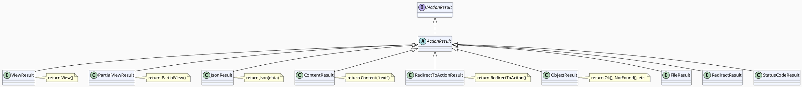

# Controllers та Actions: серце MVC

Якщо MVC — це організаційна схема, то **Controller** — це центр управління. Саме тут HTTP-запит перетворюється на дію: викликаються сервіси, формується результат, вибирається View. У цій статті розберемо Controller від основ до тонкощів — і побудуємо повноцінний `LibraryController` крок за кроком.

---

## Controller: що це насправді

**Controller** — це звичайний C#-клас, що успадковується від `Controller` або `ControllerBase`, і містить **Action-методи** — публічні методи що обробляють HTTP-запити.

Розглянемо мінімальний Controller:

```csharp [Controllers/GreetingController.cs]
using Microsoft.AspNetCore.Mvc;

namespace LibraryApp.Controllers;

// Клас успадковується від Controller
public class GreetingController : Controller
{
    // Action-метод — обробляє GET /greeting/hello
    public IActionResult Hello()
    {
        return View(); // → Views/Greeting/Hello.cshtml
    }
}
```

Маршрутизатор ASP.NET Core за замовчуванням (convention routing) знаходить цей метод автоматично:
- Клас `GreetingController` → контролер `greeting`
- Метод `Hello()` → action `hello`
- URL: `GET /greeting/hello`

### Controller vs ControllerBase

ASP.NET Core надає два базових класи:

| | `ControllerBase` | `Controller` |
|---|---|---|
| Де використовується | Web API (JSON) | MVC (HTML Views) |
| Методи `View()`, `ViewBag`, `TempData` | ❌ Немає | ✅ Є |
| Методи `Ok()`, `BadRequest()`, `NotFound()` | ✅ Є | ✅ Успадковує |
| `HttpContext`, `Request`, `Response` | ✅ Є | ✅ Успадковує |
| `ModelState` | ✅ Є | ✅ Успадковує |

```csharp
// Для MVC (HTML-відповіді):
public class ProductController : Controller { }

// Для Web API (JSON-відповіді):
[ApiController]
public class ProductApiController : ControllerBase { }
```

::note
Якщо ваш Controller повертає і HTML Views, і JSON (наприклад, для HTMX-запитів) — успадковуйте від `Controller`. Якщо виключно JSON — від `ControllerBase`.
::

---

## Action-методи: правила та конвенції

**Action-метод** — це публічний метод Controller що повертає `IActionResult` (або `Task<IActionResult>` для async).

### Що робить метод Action-методом?

```csharp
public class ExampleController : Controller
{
    // ✅ Action-метод: публічний, повертає IActionResult
    public IActionResult Index() => View();

    // ✅ Action-метод: async варіант
    public async Task<IActionResult> Details(int id)
    {
        var item = await _service.GetAsync(id);
        return View(item);
    }

    // ✅ Action-метод: повертає конкретний тип через ActionResult<T>
    public ActionResult<string> GetName() => "Hello";

    // ❌ НЕ Action-метод: [NonAction] виключає з маршрутизації
    [NonAction]
    public string HelperMethod() => "internal";

    // ❌ НЕ Action-метод: private не доступний маршрутизатору
    private void InternalLogic() { }
}
```

### Конвенція іменування

ASP.NET Core MVC використовує суфікс `Controller` для визначення класів:
- `ProductController` → controller name: `product`
- `AdminUserController` → controller name: `adminuser`
- `HomeController` → controller name: `home`

Суфікс `Controller` **відрізається** при визначенні маршруту. Це конвенція, не вимога — можна використати `[Route]` для явного іменування.

---

## Ієрархія IActionResult: карта результатів

Все що повертає Action-метод реалізує інтерфейс `IActionResult`. У ASP.NET Core є понад 20 вбудованих реалізацій:



### Таблиця всіх ключових результатів

| Метод Controller | Тип результату | HTTP статус | Коли використовувати |
|---|---|---|---|
| `View()` | `ViewResult` | 200 | Відображення .cshtml |
| `View(model)` | `ViewResult` | 200 | View з моделлю |
| `PartialView()` | `PartialViewResult` | 200 | Partial view (HTMX/AJAX) |
| `Json(data)` | `JsonResult` | 200 | JSON-відповідь |
| `Content("text")` | `ContentResult` | 200 | Текст/HTML рядок |
| `File(bytes, type)` | `FileContentResult` | 200 | Файл для завантаження |
| `PhysicalFile(path, type)` | `PhysicalFileResult` | 200 | Файл з диску |
| `RedirectToAction("X")` | `RedirectToActionResult` | 302 | Редирект на Action |
| `RedirectToAction("X", "Y")` | `RedirectToActionResult` | 302 | Редирект на інший Controller |
| `Redirect("/url")` | `RedirectResult` | 302 | Редирект на URL |
| `RedirectPermanent("/url")` | `RedirectResult` | 301 | Постійний редирект |
| `Ok()` | `OkResult` | 200 | Успіх без тіла |
| `Ok(data)` | `OkObjectResult` | 200 | Успіх з даними |
| `Created(uri, data)` | `CreatedResult` | 201 | Ресурс створено |
| `NotFound()` | `NotFoundResult` | 404 | Не знайдено |
| `NotFound(data)` | `NotFoundObjectResult` | 404 | Не знайдено з деталями |
| `BadRequest()` | `BadRequestResult` | 400 | Помилка запиту |
| `BadRequest(modelState)` | `BadRequestObjectResult` | 400 | Помилка з деталями |
| `Unauthorized()` | `UnauthorizedResult` | 401 | Не автентифікований |
| `Forbid()` | `ForbidResult` | 403 | Не авторизований |
| `StatusCode(code)` | `StatusCodeResult` | будь-який | Довільний HTTP статус |
| `NoContent()` | `NoContentResult` | 204 | Успіх без тіла |

---

## HTTP-атрибути: обмеження методам

За замовчуванням Action відповідає на **будь-який** HTTP-метод. Щоб обмежити:

```csharp
public class BookController : Controller
{
    // GET /book — форма пошуку
    [HttpGet]
    public IActionResult Search(string? q) => View();

    // POST /book/search — обробка форми
    [HttpPost("search")]
    public IActionResult Search(SearchModel model)
    {
        if (!ModelState.IsValid) return View(model);
        // ...
        return View("Results", results);
    }

    // GET /book/5
    [HttpGet("{id:int}")]
    public async Task<IActionResult> Details(int id) { ... }

    // PUT /book/5
    [HttpPut("{id:int}")]
    public async Task<IActionResult> Update(int id, BookModel model) { ... }

    // DELETE /book/5
    [HttpDelete("{id:int}")]
    public async Task<IActionResult> Delete(int id) { ... }

    // Метод що НЕ є Action (helper)
    [NonAction]
    private string FormatTitle(string title) => title.Trim();
}
```

### Перевантаження Action-методів (GET+POST на одне ім'я)

```csharp
// GET /book/create — показати форму
[HttpGet]
public IActionResult Create() => View();

// POST /book/create — обробити форму (те саме ім'я!)
[HttpPost]
public async Task<IActionResult> Create(CreateBookModel model)
{
    if (!ModelState.IsValid) return View(model);
    await _service.CreateAsync(model);
    return RedirectToAction(nameof(Index));
}
```

Два методи з однаковим ім'ям `Create` — C# дозволяє це завдяки різним атрибутам `[HttpGet]`/`[HttpPost]`.

---

## Доступ до контексту запиту

Controller надає доступ до HTTP-контексту через вбудовані властивості:

```csharp
public class InfoController : Controller
{
    public IActionResult ShowContext()
    {
        // HTTP метод, URL, headers
        var method = Request.Method;          // "GET"
        var path = Request.Path;              // "/info/showcontext"
        var userAgent = Request.Headers["User-Agent"].ToString();
        var queryParam = Request.Query["page"];  // query string

        // Дані маршруту
        var controller = RouteData.Values["controller"]?.ToString();
        var action = RouteData.Values["action"]?.ToString();

        // Користувач (після аутентифікації)
        var userId = User.FindFirst(ClaimTypes.NameIdentifier)?.Value;
        var isAdmin = User.IsInRole("Admin");

        // ControllerContext
        var controllerName = ControllerContext.ActionDescriptor.ControllerName;

        return View();
    }

    // Перевірка типу запиту
    public IActionResult Smart()
    {
        // Чи це HTMX/AJAX запит?
        if (Request.Headers["HX-Request"].Count > 0)
            return PartialView("_Fragment");

        return View();
    }
}
```

---

## Демо-проєкт: LibraryController з повним CRUD

Будуємо покроково. Кожен крок — окремий блок коду, який ви відтворюєте у себе.

### Крок 1: Модель і сервіс

```csharp [Models/Book.cs]
namespace LibraryApp.Models;

public record Book(int Id, string Title, string Author, int Year, string Genre);
```

```csharp [Services/IBookService.cs]
namespace LibraryApp.Services;

public interface IBookService
{
    Task<List<Book>> GetAllAsync();
    Task<Book?> GetByIdAsync(int id);
    Task<Book> CreateAsync(CreateBookDto dto);
    Task<Book?> UpdateAsync(int id, EditBookDto dto);
    Task<bool> DeleteAsync(int id);
}
```

```csharp [Services/InMemoryBookService.cs]
namespace LibraryApp.Services;

// Простий in-memory сервіс для демонстрації
public class InMemoryBookService : IBookService
{
    private readonly List<Book> _books =
    [
        new(1, "Кобзар", "Тарас Шевченко", 1840, "Поезія"),
        new(2, "Тіні забутих предків", "Михайло Коцюбинський", 1911, "Проза"),
        new(3, "Місто", "Валер'ян Підмогильний", 1928, "Роман"),
    ];
    private int _nextId = 4;

    public Task<List<Book>> GetAllAsync() =>
        Task.FromResult(_books.ToList());

    public Task<Book?> GetByIdAsync(int id) =>
        Task.FromResult(_books.FirstOrDefault(b => b.Id == id));

    public Task<Book> CreateAsync(CreateBookDto dto)
    {
        var book = new Book(_nextId++, dto.Title, dto.Author, dto.Year, dto.Genre);
        _books.Add(book);
        return Task.FromResult(book);
    }

    public Task<Book?> UpdateAsync(int id, EditBookDto dto)
    {
        var index = _books.FindIndex(b => b.Id == id);
        if (index < 0) return Task.FromResult<Book?>(null);
        _books[index] = new Book(id, dto.Title, dto.Author, dto.Year, dto.Genre);
        return Task.FromResult<Book?>(_books[index]);
    }

    public Task<bool> DeleteAsync(int id)
    {
        var book = _books.FirstOrDefault(b => b.Id == id);
        if (book is null) return Task.FromResult(false);
        _books.Remove(book);
        return Task.FromResult(true);
    }
}
```

```csharp [Models/BookDtos.cs]
namespace LibraryApp.Models;

public record CreateBookDto(
    string Title,
    string Author,
    int Year,
    string Genre
);

public record EditBookDto(
    string Title,
    string Author,
    int Year,
    string Genre
);
```

### Крок 2: Реєстрація сервісу

```csharp [Program.cs]
var builder = WebApplication.CreateBuilder(args);

builder.Services.AddControllersWithViews();

// Реєструємо наш сервіс
builder.Services.AddSingleton<IBookService, InMemoryBookService>();

var app = builder.Build();

app.UseStaticFiles();
app.UseRouting();
app.MapDefaultControllerRoute();

app.Run();
```

::note
У наступному кроці ми вперше використаємо **`TempData`** (для Flash Messages після створення/видалення) та **`ViewBag`** (для передачі дрібних метаданих у форму `Edit`). Ці механізми передачі даних між Controller та View ми дуже детально розберемо у повноцінній статті 06. Поки що сприймайте їх як тимчасові словники.
::

### Крок 3: Controller — всі Actions

```csharp [Controllers/LibraryController.cs]
using Microsoft.AspNetCore.Mvc;
using LibraryApp.Models;
using LibraryApp.Services;

namespace LibraryApp.Controllers;

public class LibraryController : Controller
{
    private readonly IBookService _service;

    // DI через конструктор — точно як у Razor Pages
    public LibraryController(IBookService service)
    {
        _service = service;
    }

    // ─── INDEX: список книг ───────────────────────────────────────
    // GET /library
    public async Task<IActionResult> Index()
    {
        var books = await _service.GetAllAsync();
        // Передаємо список у View як модель
        return View(books);
    }

    // ─── DETAILS: деталі книги ────────────────────────────────────
    // GET /library/details/5
    public async Task<IActionResult> Details(int id)
    {
        var book = await _service.GetByIdAsync(id);

        // Якщо книга не знайдена → 404
        if (book is null)
            return NotFound();

        return View(book);
    }

    // ─── CREATE: форма і обробка ──────────────────────────────────
    // GET /library/create — показати форму
    [HttpGet]
    public IActionResult Create()
    {
        // Передаємо порожній DTO у View для форми
        return View(new CreateBookDto("", "", DateTime.Now.Year, ""));
    }

    // POST /library/create — обробити форму
    [HttpPost]
    public async Task<IActionResult> Create(CreateBookDto dto)
    {
        // ModelState.IsValid перевіряє DataAnnotations на DTO
        if (!ModelState.IsValid)
            return View(dto); // Повертаємо форму з помилками

        var book = await _service.CreateAsync(dto);

        // TempData зберігається між запитами (через редирект)
        TempData["Success"] = $"Книгу «{book.Title}» успішно додано!";

        // Redirect після успішного POST (PRG pattern)
        return RedirectToAction(nameof(Index));
    }

    // ─── EDIT: форма та збереження ────────────────────────────────
    // GET /library/edit/5 — завантажити форму з даними
    [HttpGet]
    public async Task<IActionResult> Edit(int id)
    {
        var book = await _service.GetByIdAsync(id);
        if (book is null) return NotFound();

        // Конвертуємо Book у EditBookDto для форми
        var dto = new EditBookDto(book.Title, book.Author, book.Year, book.Genre);
        // Передаємо id у ViewBag бо він не є частиною dto
        ViewBag.BookId = id;
        ViewBag.BookTitle = book.Title;

        return View(dto);
    }

    // POST /library/edit/5 — зберегти зміни
    [HttpPost]
    public async Task<IActionResult> Edit(int id, EditBookDto dto)
    {
        if (!ModelState.IsValid)
        {
            ViewBag.BookId = id;
            return View(dto);
        }

        var updated = await _service.UpdateAsync(id, dto);
        if (updated is null) return NotFound();

        TempData["Success"] = $"Книгу «{updated.Title}» оновлено.";
        return RedirectToAction(nameof(Index));
    }

    // ─── DELETE: підтвердження і видалення ───────────────────────
    // GET /library/delete/5 — сторінка підтвердження
    [HttpGet]
    public async Task<IActionResult> Delete(int id)
    {
        var book = await _service.GetByIdAsync(id);
        if (book is null) return NotFound();
        return View(book);
    }

    // POST /library/delete/5 — остаточне видалення
    [HttpPost, ActionName("Delete")]
    public async Task<IActionResult> DeleteConfirmed(int id)
    {
        var deleted = await _service.DeleteAsync(id);
        if (!deleted) return NotFound();

        TempData["Success"] = "Книгу видалено.";
        return RedirectToAction(nameof(Index));
    }
}
```

Зверніть увагу на `[ActionName("Delete")]` — це дозволяє мати два методи `Delete` і `DeleteConfirmed` що обидва маршрутизуються на `/library/delete/{id}`, але різними HTTP-методами.

### Крок 4: Views

```html [Views/Library/Index.cshtml]
@model List<LibraryApp.Models.Book>

@{
    ViewData["Title"] = "Бібліотека";
}

<div class="d-flex justify-content-between align-items-center mb-3">
    <h1>@ViewData["Title"]</h1>
    <a asp-action="Create" class="btn btn-primary">+ Додати книгу</a>
</div>

@* TempData["Success"] — повідомлення після redirect *@
@if (TempData["Success"] is string msg)
{
    <div class="alert alert-success alert-dismissible fade show" role="alert">
        @msg
        <button type="button" class="btn-close" data-bs-dismiss="alert"></button>
    </div>
}

@if (!Model.Any())
{
    <p class="text-muted">Бібліотека порожня. Додайте першу книгу!</p>
}
else
{
    <table class="table table-hover">
        <thead>
            <tr>
                <th>Назва</th>
                <th>Автор</th>
                <th>Рік</th>
                <th>Жанр</th>
                <th></th>
            </tr>
        </thead>
        <tbody>
            @foreach (var book in Model)
            {
                <tr>
                    <td>
                        @* asp-action + asp-route-id — типізований URL *@
                        <a asp-action="Details" asp-route-id="@book.Id">@book.Title</a>
                    </td>
                    <td>@book.Author</td>
                    <td>@book.Year</td>
                    <td>@book.Genre</td>
                    <td class="text-end">
                        <a asp-action="Edit" asp-route-id="@book.Id"
                           class="btn btn-sm btn-outline-secondary">Редагувати</a>
                        <a asp-action="Delete" asp-route-id="@book.Id"
                           class="btn btn-sm btn-outline-danger">Видалити</a>
                    </td>
                </tr>
            }
        </tbody>
    </table>
}
```

```html [Views/Library/Details.cshtml]
@model LibraryApp.Models.Book

@{
    ViewData["Title"] = Model.Title;
}

<nav aria-label="breadcrumb">
    <ol class="breadcrumb">
        <li class="breadcrumb-item"><a asp-action="Index">Бібліотека</a></li>
        <li class="breadcrumb-item active">@Model.Title</li>
    </ol>
</nav>

<h1>@Model.Title</h1>
<dl class="row">
    <dt class="col-sm-2">Автор</dt>
    <dd class="col-sm-10">@Model.Author</dd>

    <dt class="col-sm-2">Рік</dt>
    <dd class="col-sm-10">@Model.Year</dd>

    <dt class="col-sm-2">Жанр</dt>
    <dd class="col-sm-10">@Model.Genre</dd>
</dl>

<div class="mt-3">
    <a asp-action="Edit" asp-route-id="@Model.Id" class="btn btn-secondary">Редагувати</a>
    <a asp-action="Index" class="btn btn-outline-secondary">← Назад</a>
</div>
```

```html [Views/Library/Create.cshtml]
@model LibraryApp.Models.CreateBookDto

@{
    ViewData["Title"] = "Нова книга";
}

<h1>@ViewData["Title"]</h1>

<div class="row">
    <div class="col-md-6">
        @* asp-action — MVC аналог asp-page у Razor Pages *@
        <form asp-action="Create" method="post">
            @* AntiForgery token — автоматично при asp-action *@

            <div class="mb-3">
                <label asp-for="Title" class="form-label">Назва</label>
                <input asp-for="Title" class="form-control">
                <span asp-validation-for="Title" class="text-danger"></span>
            </div>

            <div class="mb-3">
                <label asp-for="Author" class="form-label">Автор</label>
                <input asp-for="Author" class="form-control">
                <span asp-validation-for="Author" class="text-danger"></span>
            </div>

            <div class="mb-3">
                <label asp-for="Year" class="form-label">Рік видання</label>
                <input asp-for="Year" class="form-control" type="number">
                <span asp-validation-for="Year" class="text-danger"></span>
            </div>

            <div class="mb-3">
                <label asp-for="Genre" class="form-label">Жанр</label>
                <input asp-for="Genre" class="form-control">
                <span asp-validation-for="Genre" class="text-danger"></span>
            </div>

            <button type="submit" class="btn btn-primary">Додати</button>
            <a asp-action="Index" class="btn btn-outline-secondary">Скасувати</a>
        </form>
    </div>
</div>

@section Scripts {
    @* Клієнтська валідація — той самий механізм що у Razor Pages *@
    <partial name="_ValidationScriptsPartial" />
}
```

```html [Views/Library/Delete.cshtml]
@model LibraryApp.Models.Book

@{
    ViewData["Title"] = "Підтвердження видалення";
}

<h1>Видалити книгу?</h1>

<div class="alert alert-danger">
    <strong>Ви впевнені, що хочете видалити «@Model.Title»?</strong>
    <p class="mb-0">Цю дію неможливо скасувати.</p>
</div>

<dl class="row">
    <dt class="col-sm-2">Автор</dt>
    <dd class="col-sm-10">@Model.Author</dd>
    <dt class="col-sm-2">Рік</dt>
    <dd class="col-sm-10">@Model.Year</dd>
</dl>

@* POST-форма для видалення — [HttpPost, ActionName("Delete")] *@
<form asp-action="Delete" asp-route-id="@Model.Id" method="post">
    <button type="submit" class="btn btn-danger">Так, видалити</button>
    <a asp-action="Index" class="btn btn-outline-secondary">Скасувати</a>
</form>
```

### Крок 5: Запускаємо

```bash
dotnet run
```

Відкрийте `https://localhost:{port}/library`. Ви повинні бачити список книг, мати змогу переходити до деталей, створювати, редагувати і видаляти.

---

## Шпаргалка: Tag Helpers у MVC Views

У Razor Pages ви звикли до `asp-page`. У MVC — використовуємо `asp-action` і `asp-controller`:

| Razor Pages | MVC | Результат |
|---|---|---|
| `asp-page="/Books/Index"` | `asp-controller="Book" asp-action="Index"` | `/book` |
| `asp-page="./Details"` | `asp-action="Details"` | `/book/details` (поточний controller) |
| `asp-route-id="@book.Id"` | `asp-route-id="@book.Id"` | Однаково! |
| `asp-page-handler="Delete"` | `asp-action="Delete"` | Окремий Action |

```html
@* Посилання на Action у поточному Controller *@
<a asp-action="Details" asp-route-id="@book.Id">Деталі</a>
→ /library/details/5

@* Посилання на Action в іншому Controller *@
<a asp-controller="Home" asp-action="Index">Головна</a>
→ /home

@* Форма з POST на конкретний Action *@
<form asp-controller="Library" asp-action="Create" method="post">
```

---

## Практичні завдання

### Рівень 1 — Базовий

**Завдання 1.1.** У `LibraryController` додайте Action `Search` (GET `/library/search?q=`). Він приймає рядок пошуку, фільтрує книги за назвою або автором, і повертає View зі списком результатів. Підказка: якщо результатів немає — View має показати повідомлення "Нічого не знайдено".

**Завдання 1.2.** Розберіть кожен рядок методу `DeleteConfirmed`: навіщо `[ActionName("Delete")]`? Що станеться якщо його прибрати? Спробуйте і перевірте.

### Рівень 2 — Логіка

**Завдання 2.1.** Додайте до `LibraryController` Action `Export` який повертає список книг у форматі CSV (використайте `Content(csvString, "text/csv")` з заголовком для завантаження файлу `Response.Headers["Content-Disposition"] = "attachment; filename=books.csv"`).

**Завдання 2.2.** Реалізуйте `CategoryController` з Actions: `Index` (список категорій), `Details/{id}` (категорія + список книг у ній). `Details` повинен повертати `NotFound()` якщо категорія не існує, і `View` з книгами якщо існує.

### Рівень 3 — Архітектура

**Завдання 3.1.** Розширте `LibraryController` до повноцінного застосунку:

1. Додайте сторінку **статистики** (`/library/stats`): загальна кількість книг, книг по жанрам (таблиця), найстаріша і найновіша книга
2. Реалізуйте **пагінацію** в `Index`: `page` і `pageSize` параметри через query string, і посилання "Попередня/Наступна" у View
3. Додайте **фільтрацію по жанру**: dropdown у View `Index`, GET-параметр `genre`, фільтрація у сервісі

Всі дані — з `IBookService`, вся логіка — в сервісі, Controller — тонкий.

---

## Резюме

- **Controller** — C#-клас що успадковується від `Controller` (MVC) або `ControllerBase` (API)
- **Action** — публічний метод що повертає `IActionResult` або `Task<IActionResult>`
- **`IActionResult`** — інтерфейс для всього різноманіття результатів: View, JSON, File, Redirect, статус-коди
- **`[HttpGet]`/`[HttpPost]`** — обмежують Action конкретним HTTP-методом
- **`[NonAction]`** — виключає публічний метод з маршрутизації
- **`TempData`** — передача даних між запитами (для Flash Messages після redirect)
- **Tag Helpers у MVC:** `asp-action` і `asp-controller` замість `asp-page`

У наступній статті заглибимося у маршрутизацію MVC: convention routing, attribute routing і — вперше — Areas routing.
