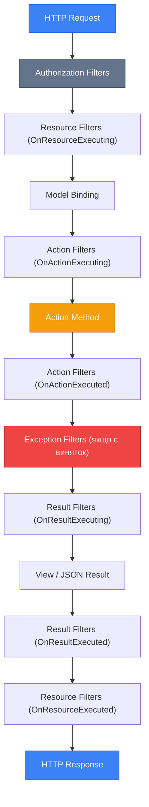
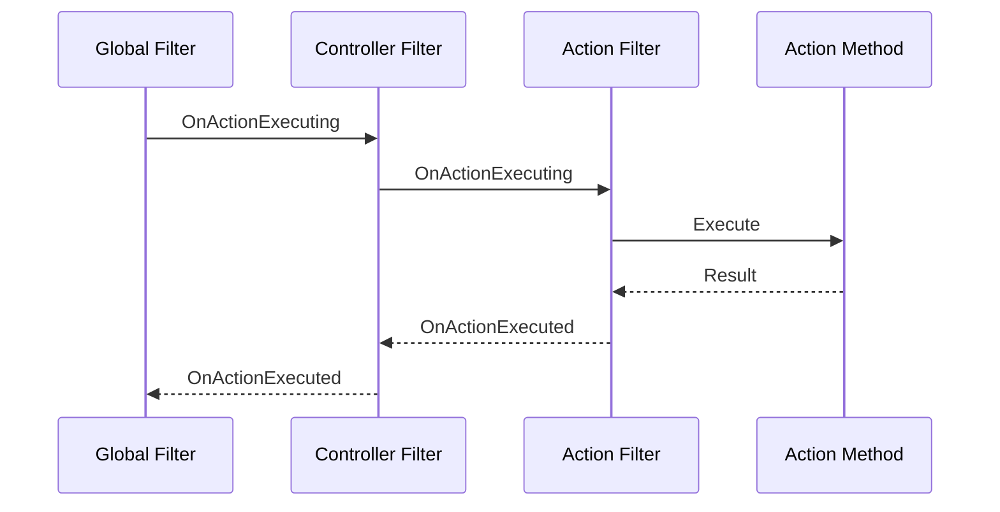

# Filters: аспектно-орієнтоване програмування в MVC

Уявіть: у вас двадцять Action-методів, і в кожному потрібно виміряти час виконання, перевірити права доступу та записати дію в журнал аудиту. Без фільтрів вам доведеться дублювати цей код у кожному методі або виносити його у приватні хелпери, які доведеться викликати вручну. Це рецепт для помилок і «спагетті-коду».

Фільтри (Filters) вирішують цю проблему через принцип **аспектно-орієнтованого програмування** (Aspect-Oriented Programming, AOP): ви описуєте «наскрізну» логіку один раз і декларативно застосовуєте її до будь-якої кількості Action-методів. Controller залишається чистим — лише бізнес-логіка.

---

## Що таке Filter і як він працює?

Технічно, Filter — це клас, що реалізує один із кількох інтерфейсів ASP.NET Core (`IActionFilter`, `IResultFilter` тощо) і вставляється у **filter pipeline** — послідовність обробників, через яку проходить кожен HTTP-запит після визначення маршруту та вибору Action-методу.

Відмінність від **Middleware** принципова. Middleware знаходиться поза MVC і «не знає» нічого про Controllers та Actions — він оперує лише `HttpContext`. Фільтри ж — це **частина MVC-pipeline**: вони мають доступ до `ActionDescriptor`, параметрів Action-методу, результату виконання та контексту моделі. Фільтр «знає», який саме метод зараз виконується.

::note
**Middleware vs Filter:** Middleware — для інфраструктурних задач (компресія, HTTPS-redirect, CORS). Filters — для задач рівня MVC-контролера (авторизація, валідація, кешування, аудит, вимірювання часу).
::

---

## Filter Pipeline: порядок виконання

Ось послідовність, якою фільтри оточують виконання Action-методу. Важливо розуміти її не як лінійний ланцюг, а як систему **вкладених оболонок** — кожен тип фільтру «обгортає» наступний.

::mermaid



::

Розглянемо кожну «оболонку» детально.

---

## П'ять типів фільтрів

### 1. Authorization Filters — «Пропускний пункт»

Authorization Filters запускаються **першими** — ще до model binding і до всіх інших фільтрів. Якщо запит не авторизований, Filter може одразу завершити обробку і повернути `401 Unauthorized` або `403 Forbidden`.

Вбудований приклад — `[Authorize]`. Для власних Authorization Filters реалізуйте `IAuthorizationFilter` або `IAsyncAuthorizationFilter`. Детальніше про авторизацію — в окремому модулі; тут зосередимося на інших типах.

---

### 2. Resource Filters — «Охоронець перед Model Binding»

Resource Filters запускаються **після** авторизації, але **до** model binding та action filters. Вони оточують увесь подальший pipeline, включно з:
- Model Binding
- Action Filters
- Action Method
- Result Filters

Ключовий сценарій — **кешування**: якщо відповідь вже є в кеші, Resource Filter може повернути її, повністю оминувши deserialization параметрів і виконання Action.

Resource Filters реалізують `IResourceFilter` з методами `OnResourceExecuting` (до model binding) та `OnResourceExecuted` (після всього).

```csharp [Filters/CacheResourceFilter.cs]
using Microsoft.AspNetCore.Mvc;
using Microsoft.AspNetCore.Mvc.Filters;
using Microsoft.Extensions.Caching.Memory;

namespace BlogApp.Filters;

// Resource Filter: кеш на рівні Action
public class CacheResourceFilter : Attribute, IResourceFilter
{
    private readonly string _cacheKey;
    private static readonly IMemoryCache _cache = new MemoryCache(new MemoryCacheOptions());

    public CacheResourceFilter(string cacheKey)
    {
        _cacheKey = cacheKey;
    }

    // Виконується ДО model binding і action
    public void OnResourceExecuting(ResourceExecutingContext context)
    {
        // Якщо відповідь є в кеші — одразу повертаємо її
        if (_cache.TryGetValue(_cacheKey, out IActionResult? cachedResult))
        {
            context.Result = cachedResult; // коротке замикання: action не виконається
        }
    }

    // Виконується ПІСЛЯ всього pipeline
    public void OnResourceExecuted(ResourceExecutedContext context)
    {
        // Якщо це перший запит — зберігаємо результат у кеш
        if (context.Result is not null && !_cache.TryGetValue(_cacheKey, out _))
        {
            _cache.Set(_cacheKey, context.Result, TimeSpan.FromMinutes(5));
        }
    }
}
```

Встановлення `context.Result` у `OnResourceExecuting` — це **«коротке замикання» (short-circuit)**. Коли Filter присвоює `context.Result`, усі подальші кроки pipeline (model binding, action filters, action method) пропускаються, і виконання переходить одразу до Result Filters.

---

### 3. Action Filters — «Обгортка навколо Action Method»

Action Filters — найпопулярніший і найвживаніший тип. Вони виконуються безпосередньо **до і після** Action-методу, вже після model binding. Це означає, що параметри Action вже заповнені та провалідовані.

Реалізовують `IActionFilter` з двома методами:
- **`OnActionExecuting`** — до виконання Action. Тут можна перевірити стан моделі, модифікувати параметри або взагалі скасувати виконання.
- **`OnActionExecuted`** — після виконання Action (але до рендерингу результату). Тут вже є `context.Result` і `context.Exception`.

```csharp [Filters/LogActionFilter.cs]
using Microsoft.AspNetCore.Mvc.Filters;

namespace BlogApp.Filters;

// Простий Action Filter для логування
public class LogActionFilter : IActionFilter
{
    private readonly ILogger<LogActionFilter> _logger;

    public LogActionFilter(ILogger<LogActionFilter> logger)
    {
        _logger = logger;
    }

    public void OnActionExecuting(ActionExecutingContext context)
    {
        // context.ActionDescriptor.DisplayName — назва Action
        // context.ActionArguments — словник параметрів
        _logger.LogInformation(
            "Executing action: {Action}, Arguments: {@Arguments}",
            context.ActionDescriptor.DisplayName,
            context.ActionArguments
        );
    }

    public void OnActionExecuted(ActionExecutedContext context)
    {
        // context.Exception — якщо виняток стався в Action
        // context.Result — результат Action (якщо Exception == null)
        if (context.Exception is not null)
        {
            _logger.LogError(context.Exception,
                "Action {Action} threw an exception",
                context.ActionDescriptor.DisplayName);
        }
        else
        {
            _logger.LogInformation(
                "Action {Action} completed with result: {ResultType}",
                context.ActionDescriptor.DisplayName,
                context.Result?.GetType().Name ?? "null");
        }
    }
}
```

---

### 4. Exception Filters — «Централізований обробник винятків»

Exception Filters перехоплюють необроблені винятки, що виникають **в Action Filters або в самому Action-методі**. Важлива деталь: вони **не перехоплюють** винятки з Result Filters або безпосередньо з логіки рендерингу View.

Реалізують `IExceptionFilter` з одним методом `OnException`. Якщо Filter «обробляє» виняток, він встановлює `context.ExceptionHandled = true`, і виняток не розповсюджується далі — замість нього ASP.NET поверне результат з `context.Result`.

```csharp [Filters/BusinessExceptionFilter.cs]
using Microsoft.AspNetCore.Mvc;
using Microsoft.AspNetCore.Mvc.Filters;

namespace BlogApp.Filters;

// Фільтр для обробки очікуваних бізнес-винятків
public class BusinessExceptionFilter : IExceptionFilter
{
    private readonly ILogger<BusinessExceptionFilter> _logger;

    public BusinessExceptionFilter(ILogger<BusinessExceptionFilter> logger)
    {
        _logger = logger;
    }

    public void OnException(ExceptionContext context)
    {
        // Обробляємо лише «бізнесові» винятки
        if (context.Exception is not BusinessException businessEx)
            return; // інші винятки проходять далі

        _logger.LogWarning(businessEx, "Business rule violation: {Message}", businessEx.Message);

        // Повертаємо структуровану помилку
        context.Result = new BadRequestObjectResult(new
        {
            Error = businessEx.Message,
            Code = businessEx.ErrorCode
        });

        context.ExceptionHandled = true; // помилка оброблена
    }
}

// Власний бізнес-виняток
public class BusinessException : Exception
{
    public string ErrorCode { get; }

    public BusinessException(string message, string errorCode) : base(message)
    {
        ErrorCode = errorCode;
    }
}
```

::tip
Exception Filters — альтернатива `try-catch` у кожному Action-методі. Але для справді глобальної обробки структурованих відповідей на помилки (`ProblemDetails`) краще поєднувати їх з Middleware `UseExceptionHandler`.
::

---

### 5. Result Filters — «Пост-обробка результату»

Result Filters виконуються **до і після** рендерингу результату Action (тобто до і після запису відповіді в тіло HTTP-response). Вони дозволяють досліджувати та модифікувати відповідь.

Реалізують `IResultFilter` з методами `OnResultExecuting` і `OnResultExecuted`. Типові сценарії: додавання HTTP-заголовків, трансформація ViewData перед рендерингом, кешування отриманої відповіді.

```csharp [Filters/AddSecurityHeadersFilter.cs]
using Microsoft.AspNetCore.Mvc.Filters;

namespace BlogApp.Filters;

// Result Filter: додає security headers до кожної відповіді
public class AddSecurityHeadersFilter : IResultFilter
{
    public void OnResultExecuting(ResultExecutingContext context)
    {
        // Виконується до рендерингу — можна ще змінити відповідь
        var response = context.HttpContext.Response;
        response.Headers["X-Content-Type-Options"] = "nosniff";
        response.Headers["X-Frame-Options"] = "SAMEORIGIN";
        response.Headers["Referrer-Policy"] = "strict-origin-when-cross-origin";
    }

    public void OnResultExecuted(ResultExecutedContext context)
    {
        // Виконується після рендерингу — тіло відповіді вже записано
        // Тут вже не можна змінити HTTP-заголовки чи тіло
    }
}
```

---

### Порівняльна таблиця п'яти типів

::card-group

::card{title="Authorization" icon="i-heroicons-lock-closed"}

- Виконується **першим**
- Може повернути 401/403 одразу
- Реалізує: `IAuthorizationFilter`
- Сценарій: перевірка прав, token validation

::

::card{title="Resource" icon="i-heroicons-server"}

- Оточує весь pipeline
- Може **обійти** model binding
- Реалізує: `IResourceFilter`
- Сценарій: кешування, rate limiting

::

::card{title="Action" icon="i-heroicons-bolt"}

- Оточує Action Method
- Параметри вже **прив'язані**
- Реалізує: `IActionFilter`
- Сценарій: логування, вимірювання часу

::

::card{title="Exception" icon="i-heroicons-exclamation-triangle"}

- Перехоплює необроблені винятки
- Встановлює `ExceptionHandled`
- Реалізує: `IExceptionFilter`
- Сценарій: бізнес-помилки, API error responses

::

::card{title="Result" icon="i-heroicons-document-text"}

- Оточує рендеринг результату
- Може додавати заголовки
- Реалізує: `IResultFilter`
- Сценарій: security headers, response caching

::

::

---

## Async-варіанти фільтрів

Кожен синхронний інтерфейс фільтра має асинхронний аналог. Замість двох окремих методів (`OnActionExecuting` / `OnActionExecuted`) є один метод `OnActionExecutionAsync` з делегатом `next`:

```csharp [Filters/ExecutionTimeFilter.cs]
using Microsoft.AspNetCore.Mvc.Filters;
using System.Diagnostics;

namespace BlogApp.Filters;

// Async Action Filter — вимірює час виконання Action
public class ExecutionTimeFilter : IAsyncActionFilter
{
    private readonly ILogger<ExecutionTimeFilter> _logger;

    public ExecutionTimeFilter(ILogger<ExecutionTimeFilter> logger)
    {
        _logger = logger;
    }

    // Один метод замість двох: маємо і "до", і "після" через next()
    public async Task OnActionExecutionAsync(
        ActionExecutingContext context,
        ActionExecutionDelegate next) // next — делегат для виклику наступного кроку
    {
        var stopwatch = Stopwatch.StartNew();

        // Весь код ДО виклику next() — це "OnActionExecuting"
        _logger.LogInformation(
            "→ Starting: {Action}",
            context.ActionDescriptor.DisplayName);

        // Викликаємо наступний крок pipeline (сам Action Method)
        var executedContext = await next();

        stopwatch.Stop();

        // Весь код ПІСЛЯ next() — це "OnActionExecuted"
        if (executedContext.Exception is not null && !executedContext.ExceptionHandled)
        {
            _logger.LogWarning(
                "← Failed: {Action} in {Ms}ms — {Error}",
                context.ActionDescriptor.DisplayName,
                stopwatch.ElapsedMilliseconds,
                executedContext.Exception.Message);
        }
        else
        {
            _logger.LogInformation(
                "← Completed: {Action} in {Ms}ms",
                context.ActionDescriptor.DisplayName,
                stopwatch.ElapsedMilliseconds);
        }
    }
}
```

Зверніть увагу на конструкцію: код **до** `await next()` виконується на вході (як `OnActionExecuting`), код **після** — на виході (як `OnActionExecuted`). Якщо не викликати `next()` — pipeline зупиняється (коротке замикання).

::note
**Синхронний чи async?** Якщо у Filter немає async операцій (звернення до БД, HTTP-запитів) — використовуйте синхронний інтерфейс (`IActionFilter`). Якщо є — async (`IAsyncActionFilter`). Не змішуйте обидва інтерфейси в одному класі — ASP.NET викличе лише async-версію.
::

---

## Як застосовувати фільтри?

Існує три рівні застосування фільтрів: глобальний, рівень Controller та рівень Action-методу.

### Рівень 1: Атрибути на Action або Controller

Найпростіший спосіб — успадкування від `Attribute` і реалізація потрібного фільтр-інтерфейсу. Такий фільтр застосовується як звичайний C# атрибут:

```csharp [Filters/ValidateAntiForgeryTokenFilter.cs]
using Microsoft.AspNetCore.Mvc;
using Microsoft.AspNetCore.Mvc.Filters;

namespace BlogApp.Filters;

// Власний атрибут-фільтр: перевіряє ModelState перед Action
[AttributeUsage(AttributeTargets.Method | AttributeTargets.Class)]
public class ValidateModelAttribute : ActionFilterAttribute
{
    // ActionFilterAttribute — зручний базовий клас що реалізує обидва інтерфейси
    public override void OnActionExecuting(ActionExecutingContext context)
    {
        if (!context.ModelState.IsValid)
        {
            // Зупиняємо pipeline і повертаємо помилки валідації
            context.Result = new BadRequestObjectResult(context.ModelState);
        }
    }
}
```

Застосування:

```csharp [Controllers/ArticleController.cs]
[ValidateModel] // ← атрибут на рівні Controller: діє для ВСІХ Action
public class ArticleController : Controller
{
    [HttpPost]
    [ValidateModel] // ← або на рівні конкретного Action
    public IActionResult Create(CreateArticleDto dto) { /*...*/ }
}
```

---

### Рівень 2: [ServiceFilter] та [TypeFilter] — фільтри з DI

Фільтр-атрибут не може приймати DI-сервіси через конструктор (атрибути в C# ініціалізуються статично). Щоб ін'єктувати залежності у Filter, є два атрибути-обгортки:

**`[ServiceFilter(typeof(T))]`** — вимагає, щоб фільтр був зареєстрований у DI-контейнері:

```csharp [Program.cs]
// Реєструємо фільтр як сервіс
builder.Services.AddScoped<ExecutionTimeFilter>();
builder.Services.AddScoped<AuditLogFilter>();
```

```csharp [Controllers/ArticleController.cs]
[ServiceFilter(typeof(ExecutionTimeFilter))] // ← DI розв'яже залежності
[ServiceFilter(typeof(AuditLogFilter))]
public class ArticleController : Controller
{
    // ...
}
```

**`[TypeFilter(typeof(T))]`** — DI-реєстрація **не потрібна**, але можна передавати додаткові аргументи:

```csharp [Controllers/ArticleController.cs]
// TypeFilter сам створить екземпляр, використавши DI для вирішення залежностей конструктора
[TypeFilter(typeof(ExecutionTimeFilter))]
public class ArticleController : Controller { }

// Передача додаткових аргументів (що не є DI-сервісами)
[TypeFilter(typeof(RateLimitFilter), Arguments = new object[] { 100, TimeSpan.FromMinutes(1) })]
public IActionResult ExpensiveOperation() { /*...*/ }
```

| | `[ServiceFilter]` | `[TypeFilter]` |
|---|---|---|
| Реєстрація у DI | **Обов'язкова** | Не потрібна |
| Lifetime | Контролюється DI (Scoped/Singleton) | Завжди Transient |
| Додаткові аргументи | Ні | Так (`Arguments`) |
| Кешування екземпляра | Так (якщо Singleton/Scoped) | Ні |

---

### Рівень 3: Global Filters — для всіх Controllers і Actions

Global Filters застосовуються до **кожного** Action-методу в застосунку без жодного атрибуту:

```csharp [Program.cs]
builder.Services.AddControllersWithViews(options =>
{
    // Глобальний фільтр вимірювання часу
    options.Filters.Add<ExecutionTimeFilter>();

    // Або через екземпляр (якщо немає DI-залежностей)
    options.Filters.Add(new AddSecurityHeadersFilter());

    // Або через тип з порядком виконання
    options.Filters.Add(typeof(AuditLogFilter), order: 1);
});
```

::warning
Порядок виконання фільтрів одного типу контролюється через `order`. Менше число = вищий пріоритет (виконується першим на вході і **останнім** на виході). Глобальні фільтри виконуються **перед** фільтрами рівня Controller, а ті — перед фільтрами рівня Action.
::

---

## Демо-проєкт: три практичних фільтри

Побудуємо реалістичний приклад з трьома фільтрами, що разом утворюють «фундамент» для будь-якого production-застосунку.

### Крок 1: Структура проєкту

::code-tree

```text [Filters/ExecutionTimeFilter.cs]
// Async Action Filter — вимірює час виконання
```

```text [Filters/MaintenanceModeFilter.cs]
// Resource Filter — глобальний 503, якщо сайт на обслуговуванні
```

```text [Filters/AuditLogFilter.cs]
// Action Filter — журнал дій користувача
```

```text [Program.cs]
// Реєстрація всіх трьох фільтрів
```

::

### Крок 2: ExecutionTimeFilter — вимірювання часу виконання

Ми вже бачили його реалізацію вище. Доповнимо реальним сценарієм: якщо Action виконується довше за поріг — записуємо `Warning` замість `Information`.

```csharp [Filters/ExecutionTimeFilter.cs]
using Microsoft.AspNetCore.Mvc.Filters;
using System.Diagnostics;

namespace BlogApp.Filters;

public class ExecutionTimeFilter : IAsyncActionFilter
{
    // Поріг у мілісекундах, після якого логуємо Warning
    private const int SlowThresholdMs = 500;

    private readonly ILogger<ExecutionTimeFilter> _logger;

    public ExecutionTimeFilter(ILogger<ExecutionTimeFilter> logger)
    {
        _logger = logger;
    }

    public async Task OnActionExecutionAsync(
        ActionExecutingContext context,
        ActionExecutionDelegate next)
    {
        var stopwatch = Stopwatch.StartNew();

        var executed = await next(); // виконуємо Action

        stopwatch.Stop();
        var elapsed = stopwatch.ElapsedMilliseconds;

        // Збагачуємо лог: назва контролера, action, час
        var actionName = $"{context.RouteData.Values["controller"]}" +
                         $".{context.RouteData.Values["action"]}";

        if (elapsed > SlowThresholdMs)
        {
            // Повільний запит — Warning для подальшого аналізу
            _logger.LogWarning(
                "SLOW ACTION [{ActionName}] executed in {Elapsed}ms (threshold: {Threshold}ms)",
                actionName, elapsed, SlowThresholdMs);
        }
        else
        {
            _logger.LogInformation(
                "Action [{ActionName}] executed in {Elapsed}ms",
                actionName, elapsed);
        }
    }
}
```

### Крок 3: MaintenanceModeFilter — глобальний режим обслуговування

Цей фільтр реалізує сценарій: адміністратор вмикає «технічне обслуговування» через конфігурацію, і всі запити до сайту отримують `503 Service Unavailable`. Реалізуємо як **Resource Filter** — найраніша точка в pipeline де можна «відрізати» запит після авторизації.

```csharp [Filters/MaintenanceModeFilter.cs]
using Microsoft.AspNetCore.Mvc;
using Microsoft.AspNetCore.Mvc.Filters;

namespace BlogApp.Filters;

// Resource Filter: відхиляє всі запити під час обслуговування
public class MaintenanceModeFilter : IAsyncResourceFilter
{
    private readonly IConfiguration _configuration;
    private readonly ILogger<MaintenanceModeFilter> _logger;

    public MaintenanceModeFilter(
        IConfiguration configuration,
        ILogger<MaintenanceModeFilter> logger)
    {
        _configuration = configuration;
        _logger = logger;
    }

    public async Task OnResourceExecutionAsync(
        ResourceExecutingContext context,
        ResourceExecutionDelegate next)
    {
        // Читаємо прапорець з конфігурації (appsettings.json або env variable)
        var isMaintenanceMode = _configuration.GetValue<bool>("App:MaintenanceMode");

        if (isMaintenanceMode)
        {
            _logger.LogInformation(
                "Maintenance mode is active. Blocking request to {Path}",
                context.HttpContext.Request.Path);

            // Повертаємо 503 з Retry-After заголовком
            context.HttpContext.Response.Headers["Retry-After"] = "3600"; // 1 година
            context.Result = new ContentResult
            {
                StatusCode = StatusCodes.Status503ServiceUnavailable,
                Content = "Сайт тимчасово недоступний. Проводимо технічне обслуговування.",
                ContentType = "text/plain; charset=utf-8"
            };

            // next() НЕ викликаємо — pipeline зупинено
            return;
        }

        // Якщо обслуговування не активне — пропускаємо запит далі
        await next();
    }
}
```

Додайте у `appsettings.json`:

```json [appsettings.json]
{
  "App": {
    "MaintenanceMode": false
  }
}
```

Щоб увімкнути режим обслуговування без перезапуску застосунку, встановіть `App:MaintenanceMode=true` через змінну середовища або `appsettings.Development.json`. ASP.NET Core конфігурація підтримує hot reload.

### Крок 4: AuditLogFilter — журнал дій

Журнал аудиту фіксує: **хто**, **коли**, **яку дію** виконав і **яким був результат**. Це обов'язковий компонент для будь-якого застосунку, де важлива відстежуваність дій (CRUD операції, адміністрування).

```csharp [Filters/AuditLogFilter.cs]
using Microsoft.AspNetCore.Mvc.Filters;

namespace BlogApp.Filters;

// Attribute + IAsyncActionFilter — застосовується через [AuditLog]
[AttributeUsage(AttributeTargets.Method | AttributeTargets.Class)]
public class AuditLogFilter : Attribute, IAsyncActionFilter
{
    // Опціональна мітка — що саме аудитуємо
    public string? ActionLabel { get; set; }

    private ILogger<AuditLogFilter>? _logger;

    // ServiceFilter знає як розв'язати ILogger через DI
    public async Task OnActionExecutionAsync(
        ActionExecutingContext context,
        ActionExecutionDelegate next)
    {
        // Ін'єктуємо ILogger через RequestServices (для Attribute-фільтрів без DI конструктора)
        _logger = context.HttpContext.RequestServices
            .GetRequiredService<ILogger<AuditLogFilter>>();

        var userId = context.HttpContext.User.Identity?.Name ?? "anonymous";
        var action = ActionLabel
                     ?? context.ActionDescriptor.DisplayName
                     ?? "unknown";
        var ip = context.HttpContext.Connection.RemoteIpAddress?.ToString() ?? "unknown";
        var timestamp = DateTimeOffset.UtcNow;

        // Виконуємо Action
        var executed = await next();

        // Фіксуємо результат
        var statusCode = executed.Result switch
        {
            ObjectResult obj => obj.StatusCode?.ToString() ?? "200",
            StatusCodeResult sc => sc.StatusCode.ToString(),
            _ => "200"
        };

        var hasError = executed.Exception is not null && !executed.ExceptionHandled;

        _logger!.LogInformation(
            "AUDIT | User={UserId} | IP={IP} | Action={Action} | Status={Status} | Error={HasError} | Time={Timestamp:O}",
            userId, ip, action, statusCode, hasError, timestamp);
    }
}
```

Використання — декларативне, без зміни логіки Controller:

```csharp [Controllers/ArticleController.cs]
using BlogApp.Filters;
using Microsoft.AspNetCore.Mvc;

namespace BlogApp.Controllers;

[AuditLog] // ← аудитуємо всі дії у Controller
public class ArticleController : Controller
{
    [HttpPost]
    [AuditLog(ActionLabel = "Article.Create")] // ← або з кастомною міткою
    public async Task<IActionResult> Create(CreateArticleDto dto)
    {
        // ...
        return RedirectToAction(nameof(Index));
    }

    [HttpPost]
    [AuditLog(ActionLabel = "Article.Delete")]
    public async Task<IActionResult> Delete(int id)
    {
        // ...
        TempData["Success"] = "Статтю видалено.";
        return RedirectToAction(nameof(Index));
    }
}
```

### Крок 5: Реєстрація фільтрів у Program.cs

```csharp [Program.cs]
using BlogApp.Filters;

var builder = WebApplication.CreateBuilder(args);

// Реєструємо сервіси фільтрів у DI
builder.Services.AddScoped<ExecutionTimeFilter>();
builder.Services.AddScoped<MaintenanceModeFilter>();

builder.Services.AddControllersWithViews(options =>
{
    // Глобально — діє для всіх Controllers і Actions
    options.Filters.Add<ExecutionTimeFilter>();       // через generic
    options.Filters.Add<MaintenanceModeFilter>();     // через generic

    // AuditLogFilter застосовується через [AuditLog] атрибут — не глобально
});

var app = builder.Build();
// ... стандартний pipeline
app.MapDefaultControllerRoute();
app.Run();
```

Зверніть увагу: `ExecutionTimeFilter` та `MaintenanceModeFilter` зареєстровані **глобально** — вони автоматично застосовуються до всіх Action-методів без жодного атрибуту. `AuditLogFilter` застосовується **вибірково** через атрибут `[AuditLog]` там, де аудит потрібен явно.

---

## Порядок виконання кількох фільтрів одного типу

Коли кілька фільтрів одного типу застосовані одночасно (наприклад, глобальний + controller-level + action-level), порядок такий:

```
Вхід (OnExecuting): global → controller → action
Вихід (OnExecuted): action → controller → global
```

Це «стек» (LIFO для виходу). Аналогія — цибулина: зовнішні шари «загортають» внутрішні.

::mermaid



::

Якщо потрібен явний контроль порядку — передайте `order` при реєстрації:

```csharp
options.Filters.Add<ExecutionTimeFilter>(order: 1);   // виконується першим
options.Filters.Add<MaintenanceModeFilter>(order: -1); // виконується до ExecutionTime
// Менше число order = вище пріоритет на вході = нижче пріоритет на виході
```

---

## «Коротке замикання» (Short-Circuit): зупинка pipeline

Фільтр може повністю зупинити подальшу обробку запиту, встановивши `context.Result` **до** виклику `next()`. Це патерн «короткого замикання»:

```csharp
public async Task OnActionExecutionAsync(
    ActionExecutingContext context,
    ActionExecutionDelegate next)
{
    // Перевіряємо умову
    if (!SomeConditionMet())
    {
        // Встановлюємо результат БЕЗ виклику next()
        context.Result = new ForbidResult();
        return; // ← pipeline зупинено, Action не виконається
    }

    // Якщо умова виконана — продовжуємо нормально
    await next();
}
```

Після короткого замикання в Action Filter залишкові Action Filters все одно виконуються (на виході — `OnActionExecuted`), але з `context.Canceled = true`. Result Filters також виконуються — Pipeline не зупиняється повністю, а лише пропускає Action Method.

---

## Практичні завдання

### Рівень 1 — Базовий

**Завдання 1.1.** Реалізуйте `RequireHttpsFilter` — Authorization Filter, що перевіряє, чи прийшов запит через HTTPS. Якщо ні — повертає `403 Forbidden` з повідомленням «Потрібне захищене з'єднання». Зареєструйте його глобально.

**Завдання 1.2.** Створіть `AddTimestampHeaderFilter` — Result Filter, що додає до кожної відповіді заголовок `X-Processed-At` зі значенням поточного `DateTimeOffset.UtcNow` у форматі ISO 8601.

**Завдання 1.3.** Поясніть різницю між `context.Result = new ForbidResult()` (без виклику `next()`) та встановленням `context.Result` після `await next()`. Які частини pipeline виконаються в кожному випадку?

### Рівень 2 — Логіка

**Завдання 2.1.** Реалізуйте `RateLimitFilter` — Action Filter, що обмежує кількість запитів від одного IP до `N` запитів за `M` хвилин. Параметри `N` та `M` передаються як аргументи через `[TypeFilter(typeof(RateLimitFilter), Arguments = ...)]`. При перевищенні ліміту — `429 Too Many Requests` із заголовком `Retry-After`.

**Завдання 2.2.** Побудуйте `CacheActionFilter` — Resource Filter, що кешує результат Action на `duration` секунд (параметр атрибуту). Ключ кешу формується з повного URL запиту включно з query string. Кешований результат має тип `ContentResult` з серіалізованим JSON. Переконайтеся, що POST-запити **не кешуються**.

### Рівень 3 — Архітектура

**Завдання 3.1.** Розробіть систему **Feature Flags** через фільтри. Реалізуйте:
- `IFeatureFlagService` — сервіс, що читає прапорці з `appsettings.json` (`Features:NewEditor: true`)
- `[RequireFeature("NewEditor")]` — атрибут-фільтр, що застосовується до Action або Controller. Якщо фіча вимкнена — повертає `404 Not Found` або редиректить на альтернативний Action
- Зареєструйте `IFeatureFlagService` як `Singleton` та продемонструйте hot reload значення через `IOptionsMonitor<T>`

---

## Резюме

- **Filters** — це механізм AOP в ASP.NET Core MVC: виконайте наскрізну логіку один раз, застосуйте до будь-якої кількості Actions
- **Filter pipeline** — п'ять типів у суворому порядку: Authorization → Resource → Action → Exception → Result
- **Authorization Filters** — перевірка прав; **Resource Filters** — до/після model binding, ідеальні для кешування; **Action Filters** — навколо Action Method; **Exception Filters** — необроблені винятки; **Result Filters** — навколо рендерингу відповіді
- **Async-варіанти** (`IAsyncActionFilter` тощо) — один метод з `await next()` замість двох окремих
- **`[ServiceFilter]`** — потребує DI-реєстрації, контролює lifetime; **`[TypeFilter]`** — без реєстрації, підтримує `Arguments`
- **Global Filters** реєструються через `MvcOptions.Filters` і діють на всі Actions без атрибутів
- **Коротке замикання:** `context.Result = ...` без виклику `next()` зупиняє pipeline, але Result Filters все одно виконуються

У наступній статті — **Areas**: як структурувати великий застосунок на незалежні модулі через `[Area("Admin")]`, `MapAreaControllerRoute` та cross-area посилання.
