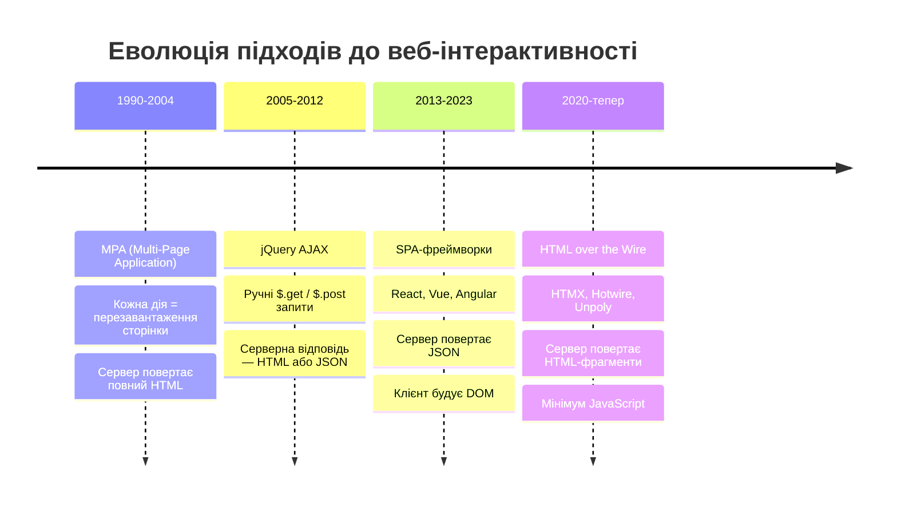

# HTMX: інтерактивність через HTML-атрибути

Уявіть типовий застосунок на ASP.NET Core MVC: список товарів із фільтрацією за категорією. Користувач обирає «Електроніка» — і браузер перезавантажує сторінку повністю. Сервер формує весь HTML заново, від `<html>` до `</html>`, повертає 80 кілобайт розмітки, браузер перемальовує DOM з нуля. Для зміни двох десятків рядків у таблиці.

Саме цю проблему намагалися вирішити протягом останніх двадцяти років. Спочатку — jQuery і ручний AJAX: `$.get("/products?category=electronics", function(data) { $("#list").html(data); })`. Підхід працює, але вимагає JavaScript-коду для кожної взаємодії. Потім прийшли React, Vue, Angular: сервер повертає не HTML, а JSON, а весь DOM будується на клієнті. За це ми платимо сотнями кілобайтів JavaScript, архітектурним розривом між фронтендом і бекендом, складним управлінням станом на клієнті.

**HTMX** пропонує четвертий шлях — і він радикально простіший. Ідея виглядає майже банально: дозвольте будь-якому HTML-елементу робити HTTP-запити і вставляти отримані HTML-фрагменти у DOM. Без написання JavaScript. Без JSON. Без клієнтського стану. Сервер знову є джерелом правди і повертає те, що він вміє найкраще — готовий HTML.

Цю концепцію автор бібліотеки Карсон Гросс (Carson Gross) назвав «**HTML over the wire**» — HTML по дроту. На відміну від «JSON over the wire» (підхід SPA), сервер надсилає не дані для рендерингу, а вже відрендерений HTML-фрагмент. HTMX перехоплює кліки, надсилає запит і вставляє відповідь у вказане місце DOM — все це без єдиного рядку вашого JavaScript.

::note
HTMX — це бібліотека розміром ~14kb (після стиснення gzip). Вона не має залежностей і підключається одним `<script>`-тегом. Порівняйте: React із ReactDOM — понад 45kb, Vue 3 — близько 30kb.
::

---

## Еволюція веб-інтерактивності

Щоб зрозуміти місце HTMX в екосистемі, корисно простежити, як змінювалися підходи до побудови інтерактивних веб-застосунків:

::mermaid



::

Кожен із цих підходів розв'язував реальну проблему свого часу та водночас породжував нові. MPA — просто та передбачувано, але нав'язує відчуття «перемигування» сторінки. jQuery-AJAX — гнучко, але швидко перетворюється на «спагетті-код» при масштабуванні. SPA — потужно, але за ціну величезної складності та фундаментального архітектурного розриву між клієнтом і сервером.

HTMX повертає нас до серверного рендерингу — але без відчуття перезавантаження. Сервер будує HTML (як у MPA), але клієнт вставляє лише змінений фрагмент (як у SPA). Найкраще з обох світів — за умови, що застосунок не є повноцінним клієнтським редактором на кшталт Google Docs.

---

## Підключення HTMX

HTMX — це єдиний JavaScript-файл без жодних залежностей. Підключення вимагає лише одного рядка у спільному `_Layout.cshtml`:

::code-group

```html [CDN (для розробки)]
<script src="https://unpkg.com/htmx.org@2.0.3"
        integrity="sha384-HGfztofotfshcF7+8n44JQL2oJmowVChPTg48S+jvZoztPfvwD79OC/LTtG6dMp+"
        crossorigin="anonymous"></script>
```

```html [Локально (для production)]
@* Завантажте htmx.min.js з htmx.org та помістіть у wwwroot/lib/htmx/ *@
<script src="~/lib/htmx/htmx.min.js"></script>
```

::

Після підключення HTMX одразу активний для всього документа. Жодної ініціалізації, жодного `document.addEventListener("DOMContentLoaded", ...)`. Ви просто починаєте додавати `hx-*` атрибути до існуючих HTML-елементів.

::tip
Для **production**-середовища завжди використовуйте локальний файл — це усуває залежність від зовнішнього CDN та гарантує стабільну версію бібліотеки. Завантажте `htmx.min.js` з [htmx.org](https://htmx.org) і розмістіть у `wwwroot/lib/htmx/`.
::

---

## Core атрибути HTMX

### `hx-get`, `hx-post`, `hx-put`, `hx-patch`, `hx-delete` — метод і URL запиту

Це фундаментальні атрибути бібліотеки. Вони перетворюють будь-який HTML-елемент на джерело HTTP-запиту. Атрибут визначає **метод** запиту, а його значення — **URL**, на який запит надсилається.

```html
@* GET-запит на /products при кліку на кнопку *@
<button hx-get="/products">Завантажити товари</button>

@* POST-запит для створення нового ресурсу *@
<button hx-post="/products/create">Створити товар</button>

@* DELETE для видалення конкретного запису *@
<button hx-delete="/products/42">Видалити</button>
```

За замовчуванням HTMX реагує на **природну подію** елемента: `click` для кнопок і посилань, `submit` для форм, `change` для `<select>` і чекбоксів. Тобто жодного `onclick=""` — HTML-атрибут вказує що робити, браузер вирішує коли.

Важливий нюанс: відповідь сервера за замовчуванням вставляється **всередину самого ініціатора** запиту `(innerHTML)`. Тобто після кліку на `<button hx-get="/products">` — вміст кнопки замінюється HTML-відповіддю сервера, що рідко є бажаним результатом. Для керування місцем вставки і існує атрибут `hx-target`.

---

### `hx-target` — куди вставляти відповідь

`hx-target` приймає CSS-селектор елемента, у який буде вставлено відповідь сервера. Ця пара — `hx-get` + `hx-target` — є основним будівельним блоком більшості HTMX-взаємодій:

```html
@* Кнопка робить запит, але результат потрапляє у #product-list *@
<button hx-get="/products"
        hx-target="#product-list">
    Завантажити товари
</button>

<div id="product-list">
    @* Сюди прийде HTML-відповідь від /products *@
</div>
```

Окрім звичайних CSS-селекторів, `hx-target` підтримує спеціальні відносні селектори для знаходження елементів відносно ініціатора запиту:

| Значення | Опис |
|---|---|
| `#element-id` | Елемент за CSS-ідентифікатором |
| `.class-name` | Перший елемент за класом |
| `closest tr` | Найближчий батьківський `<tr>` |
| `next div` | Наступний сусідній `<div>` |
| `previous p` | Попередній сусідній `<p>` |
| `this` | Сам ініціатор (за замовчуванням) |

Відносні селектори (`closest`, `next`, `previous`) особливо корисні у динамічних шаблонах, де `id` невідомий наперед — наприклад, у рядках таблиці, що генеруються `@foreach`.

---

### `hx-swap` — як саме вставляти відповідь

Якщо `hx-target` відповідає на питання «**куди**», то `hx-swap` відповідає на питання «**як**». Атрибут визначає спосіб вставки HTML-відповіді відносно цільового елемента. Без `hx-swap` використовується режим `innerHTML` за замовчуванням — вміст цільового елемента замінюється.

Розуміння всіх режимів `hx-swap` критично важливе для побудови правильних HTMX-взаємодій. Розглянемо кожен:

::card-group

::card{title="innerHTML (за замовчуванням)" icon="i-heroicons-arrow-path"}
Замінює **внутрішній вміст** `hx-target`. Сам елемент-контейнер залишається. Найпоширеніший режим для списків та контейнерів.

```html
<div id="results" hx-get="/search" hx-swap="innerHTML">
    Початковий вміст буде замінено
</div>
```

::

::card{title="outerHTML" icon="i-heroicons-arrow-path-rounded-square"}
Замінює **сам елемент** `hx-target` повністю разом із його тегом. Застосовується, коли відповідь є новою версією всього елемента, наприклад оновлений рядок таблиці.

```html
<tr id="row-5" hx-patch="/tasks/5" hx-swap="outerHTML">
```

::

::card{title="beforeend" icon="i-heroicons-chevron-double-down"}
Вставляє відповідь всередину `hx-target` **у кінець**, після останнього дочірнього елемента. Ідеально для нескінченного прокручування та додавання нових елементів до списку.

```html
<ul id="todo-list" hx-post="/todo" hx-swap="beforeend">
```

::

::card{title="afterend" icon="i-heroicons-arrow-down"}
Вставляє відповідь **після** елемента `hx-target` (як наступний сусід у DOM). Елемент-ціль залишається незмінним. Корисно для вставки нового запису поряд з існуючим.

```html
<div id="last-item" hx-get="/next" hx-swap="afterend">
```

::

::card{title="delete" icon="i-heroicons-trash"}
Видаляє елемент `hx-target` з DOM **незалежно** від вмісту відповіді сервера. Зручно для кнопок «Видалити», де сервер повертає `200 OK` з порожнім тілом.

```html
<li id="task-42" hx-delete="/tasks/42" hx-swap="delete"
    hx-target="this">
```

::

::card{title="none" icon="i-heroicons-no-symbol"}
Відповідь ігнорується — DOM не змінюється. Використовується для запитів, результат яких не потрібно відображати (наприклад, аналітика, пінг, тригер серверної події).

```html
<button hx-post="/analytics/click" hx-swap="none">
```

::

::

Поширена помилка початківців — використовувати `hx-swap="innerHTML"` там, де потрібен `outerHTML`. Різниця принципова: при `innerHTML` ви оновлюєте вміст елемента-цілі, а при `outerHTML` — замінюєте сам елемент. Якщо сервер повертає `<li id="task-5">...</li>`, а на сторінці вже є `<li id="task-5">`, то для заміни рядка потрібен `outerHTML` — інакше отримаєте вкладений `<li>` всередині `<li>`.

---

### `hx-trigger` — коли надсилати запит

Три попередні атрибути визначали **що**, **куди** і **як**. `hx-trigger` визначає **коли**. За замовчуванням HTMX використовує природні події: `click` для кнопок, `submit` для форм, `change` для `<select>`. Але реальні інтерфейси часто вимагають тонкішого налаштування.

Наприклад, поле пошуку, що надсилає запит при кожному натисканні клавіші — без затримки — призведе до сотень зайвих запитів за секунду. Або потрібно завантажити секцію сторінки лише тоді, коли вона з'явиться у viewport. Або оновлювати лічильник кожні 5 секунд. Для всього цього існує `hx-trigger`:

```html
@* Пошук при введенні тексту — лише якщо значення змінилося,
   після 300мс паузи (debounce). Запобігає зайвим запитам *@
<input type="search"
       name="q"
       hx-get="/products/search"
       hx-target="#results"
       hx-trigger="input changed delay:300ms"
       placeholder="Пошук товарів...">

@* Завантажити секцію при появі у viewport (lazy loading) *@
<div hx-get="/dashboard/stats"
     hx-trigger="revealed"
     hx-target="this"
     hx-swap="outerHTML">
    <div class="spinner">Завантаження...</div>
</div>

@* Автооновлення лічильника кожні 5 секунд *@
<span id="online-count"
      hx-get="/users/online-count"
      hx-trigger="every 5s">
    ...
</span>

@* Реагувати на кастомну подію від іншого елемента *@
<div id="cart-summary"
     hx-get="/cart/summary"
     hx-trigger="cartUpdated from:body">
</div>
```

`hx-trigger` підтримує кілька потужних **модифікаторів**, що можна комбінувати через пробіл:

| Модифікатор | Опис |
|---|---|
| `delay:300ms` | Затримка (debounce) — запит надсилається через N мс після події |
| `throttle:1s` | Обмеження — не більше одного запиту за вказаний інтервал |
| `changed` | Запит лише якщо значення елемента змінилося |
| `once` | Запит лише один раз за життя елемента |
| `revealed` | Тригер при появі елемента у viewport (Intersection Observer) |
| `every 5s` | Polling — повторювати через вказаний інтервал |
| `from:#other` | Слухати подію від іншого елемента за CSS-селектором |
| `load` | Спрацьовує одразу після завантаження сторінки |

Ключова різниця між `delay` і `throttle`: `delay` — це debounce (скидає таймер при кожній новій події, надсилає запит лише коли події припинились), а `throttle` — це throttle (надсилає запит не частіше одного разу за інтервал, незалежно від кількості подій).

::tip
Комбінація `hx-trigger="input changed delay:300ms"` є найпоширенішим рецептом для live-search: `input` — подія, `changed` — лише якщо значення справді змінилося, `delay:300ms` — debounce 300 мс. Ця трійка запобігає надлишковим запитам при швидкому введенні тексту.
::

---

### `hx-include` — включити значення інших елементів у запит

За замовчуванням HTMX серіалізує у запит лише той елемент, що є ініціатором (або всю форму, якщо ініціатором є елемент форми). `hx-include` дозволяє явно вказати додаткові елементи, значення яких слід додати до параметрів запиту.

Типовий сценарій: кнопка «Застосувати фільтр», при натисканні якої потрібно включити поточне значення кількох `<select>` і `<input>`:

```html
<select id="category-filter" name="category">
    <option value="">Всі категорії</option>
    <option value="electronics">Електроніка</option>
    <option value="clothing">Одяг</option>
</select>

<select id="sort-filter" name="sort">
    <option value="price-asc">Ціна ↑</option>
    <option value="price-desc">Ціна ↓</option>
</select>

@* При кліку — GET /products?category=electronics&sort=price-asc *@
<button hx-get="/products"
        hx-target="#product-grid"
        hx-include="#category-filter, #sort-filter">
    Застосувати
</button>
```

`hx-include` приймає будь-який CSS-селектор — можна вказати кілька через кому, або `closest form` щоб включити всю найближчу форму.

---

### `hx-indicator` — індикатор стану завантаження

Поки HTMX-запит виконується, бібліотека автоматично додає CSS-клас `htmx-request` до елемента-ініціатора. `hx-indicator` дозволяє вказати окремий елемент (наприклад, спіннер), який HTMX зробить видимим на час запиту, а після — знову приховає.

```html
<button hx-get="/slow-report"
        hx-target="#report-area"
        hx-indicator="#report-spinner">
    Згенерувати звіт
</button>

<span id="report-spinner" class="htmx-indicator">
    <span class="spinner-border spinner-border-sm"></span>
    Обробка...
</span>
```

```css
/* htmx-indicator за замовчуванням прихований */
.htmx-indicator { opacity: 0; transition: opacity 200ms ease-in; }
/* HTMX додає htmx-request до ініціатора — і показує індикатор */
.htmx-request .htmx-indicator,
.htmx-request.htmx-indicator { opacity: 1; }

/* Опціонально: заблокувати повторний клік під час запиту */
.htmx-request { pointer-events: none; opacity: 0.7; }
```

---

### `hx-push-url` — оновлювати URL у браузері

AJAX-запити не змінюють URL у адресному рядку браузера — що ламає кнопку «Назад» і унеможливлює закладинки. `hx-push-url` вирішує цю проблему: він додає запис до History API, так само як це робить навігація по посиланнях.

```html
@* При кліку на статтю URL стає /articles/42 *@
<a hx-get="/articles/42"
   hx-target="#content"
   hx-push-url="/articles/42">
    Прочитати статтю
</a>
```

Тепер кнопка «Назад» у браузері коректно повертає до попередньої URL. HTMX перехоплює `popstate` і автоматично робить новий запит, щоб відновити стан сторінки.

---

### `hx-boost` — SPA-навігація без коду

`hx-boost="true"` — це «прискорена» навігація: HTMX перехоплює всі звичайні `<a href>` та `<form>` усередині елемента-контейнера і перетворює їх на HTMX-запити автоматично. Замість повного перезавантаження сторінки він робить AJAX, замінює `<body>` і оновлює URL через History API.

```html
@* Всі посилання у навбарі стають HTMX-запитами *@
<nav hx-boost="true">
    <a href="/products">Товари</a>    @* → hx-get="/products" hx-target="body" *@
    <a href="/about">Про нас</a>
    <a href="/contact">Контакти</a>
</nav>
```

Ефект — SPA-подібна навігація (без перемиготіння сторінки) без жодного рядку JavaScript. `hx-boost` ідеально підходить для звичайних MVC-застосунків, де кожна сторінка рендериться сервером: ви отримуєте плавну навігацію безкоштовно, просто додавши один атрибут до `<nav>` або `<body>`.

---

## Out-of-Band Swaps: оновлення кількох елементів з однієї відповіді

Стандартна HTMX-взаємодія має просту модель: один запит — одна відповідь — одна вставка в один `hx-target`. Але реальні інтерфейси часто вимагають більшого: одна дія змінює одразу кілька незалежних частин сторінки.

Розглянемо типовий приклад: кнопка «Додати до кошика». Після натискання треба одночасно оновити:
1. Лічильник товарів у кошику (навбар, `<span id="cart-count">`)
2. Тіло відповіді — підтвердження додавання (там де стоїть `hx-target`)
3. Toast-сповіщення у правому куті екрана

Три незалежні елементи — і жодного JavaScript. Саме для цього існують **Out-of-Band Swaps** (OOB-вставки): сервер повертає один HTML-документ, у якому позначає частини з атрибутом `hx-swap-oob`. HTMX знаходить елементи за їхнім `id` та оновлює їх незалежно від основного `hx-target`.

```html
@* Відповідь сервера на POST /cart/add — один HTML-документ із трьома фрагментами *@

@* 1. Основний фрагмент — вставляється у hx-target ініціатора *@
<div class="alert alert-success">
    Товар «Apple MacBook Pro» додано до кошика!
</div>

@* 2. OOB-фрагмент: знайти #cart-count у DOM і замінити його вміст *@
<span id="cart-count" hx-swap-oob="innerHTML">5</span>

@* 3. OOB-фрагмент: оновити toast-контейнер *@
<div id="toast-container" hx-swap-oob="innerHTML">
    <div class="toast show">Кошик оновлено!</div>
</div>
```

Механізм роботи простий: HTMX парсить усю відповідь, шукає елементи з `hx-swap-oob`, знаходить відповідні елементи у поточному DOM за їхнім `id` і замінює їх вміст. Основний фрагмент (без `hx-swap-oob`) потрапляє у `hx-target` як зазвичай.

`hx-swap-oob` приймає ті самі значення, що й `hx-swap`: `true` (означає `outerHTML`), `innerHTML`, `beforeend` тощо. Це надає точний контроль над способом вставки кожного OOB-фрагмента.

::warning
OOB-елементи **обов'язково мають мати `id`**, за яким HTMX знаходить їх у DOM. Без `id` HTMX не знає, куди вставити OOB-фрагмент, і проігнорує його.
::

---

## Server-Sent Events (SSE): real-time оновлення з сервера

Всі розглянуті атрибути є **pull**-моделлю: клієнт ініціює запит, сервер відповідає. Але що, якщо потрібна **push**-модель — сервер сам надсилає дані без запиту від клієнта? Для цього HTMX підтримує **Server-Sent Events** (SSE) — стандарт браузера для однонаправленого потоку подій від сервера до клієнта.

SSE ідеально підходить для: сповіщень у реальному часі, лічильників онлайн-користувачів, прогресу тривалих задач, live-оновлення стрічки подій.

Для підключення SSE потрібно окремо завантажити офіційне розширення:

```html
<script src="https://unpkg.com/htmx-ext-sse@2.2.2/sse.js"></script>
```

Синтаксис у HTML:

```html
@* Підключитися до SSE-потоку /notifications/stream *@
<div hx-ext="sse" sse-connect="/notifications/stream">

    @* Слухати подію з іменем "new-message" і вставляти у #messages *@
    <div sse-swap="new-message"
         hx-target="#messages"
         hx-swap="beforeend">
    </div>

</div>

<ul id="messages">
    @* Нові повідомлення будуть дописуватися сюди в реальному часі *@
</ul>
```

На стороні сервера ASP.NET Core SSE-endpoint надсилає події у стандартному форматі (`event:\ndata:\n\n`):

```csharp [Controllers/NotificationsController.cs]
[HttpGet("notifications/stream")]
public async Task Stream(CancellationToken ct)
{
    Response.ContentType = "text/event-stream";
    Response.Headers["Cache-Control"] = "no-cache";
    Response.Headers["X-Accel-Buffering"] = "no"; // для nginx

    while (!ct.IsCancellationRequested)
    {
        var html = $"<li>{DateTime.Now:HH:mm:ss} — нова подія</li>";
        // Формат SSE: event-name, потім дані
        await Response.WriteAsync($"event: new-message\ndata: {html}\n\n", ct);
        await Response.Body.FlushAsync(ct);

        await Task.Delay(3000, ct); // нова подія кожні 3 секунди
    }
}
```

З'єднання підтримується браузером автоматично: якщо воно обривається — браузер перезапускає підключення через кілька секунд без будь-якого коду з вашого боку.

---

## HTMX vs Alpine.js vs React: коли що обрати

Важливо розуміти, що HTMX — не конкурент React чи Vue. Це інструменти для різних задач. Ухвалення правильного рішення залежить від характеру застосунку:

| Критерій | HTMX | Alpine.js | React / Vue |
|---|---|---|---|
| Розмір бібліотеки | ~14kb | ~15kb | 45kb+ |
| JavaScript, який пишете ви | Мінімум | Небагато | Багато |
| Стан на клієнті | Відсутній | Локальний | Складний |
| Рендеринг | Завжди сервер | Гібрид | Переважно клієнт |
| SEO «з коробки» | ✅ | ✅ | Потребує SSR |
| Складні SPA | ❌ | Частково | ✅ |
| Real-time (WebSocket) | Через ext | Вручну | Бібліотеки |
| Крива навчання | Мінімальна | Середня | Висока |
| Ідеально для | MVC, форми, таблиці | Мікро-інтерактивність | Повноцінний SPA |

Практичне правило: якщо вашому застосунку на MVC потрібні пошук з фільтрацією, live-таблиці, модальні форми, inline-редагування — HTMX є природним і мінімалістичним вибором. Якщо ж ви будуєте Figma, Google Sheets або складний дашборд із реактивним станом — React або Vue доцільніші.

---

## Демо: живий список задач

Побудуємо повністю функціональний список задач (Todo List) — без єдиного рядку власного JavaScript. Усі операції: додавання, позначення виконаним, видалення — через HTMX. Серверна сторона — ASP.NET Core MVC.

::steps

### Крок 1: Модель даних

Оскільки це демонстраційний приклад, зберігатимемо задачі у статичному списку в пам'яті. У реальному застосунку це була б база даних:

```csharp [Models/TodoItem.cs]
namespace HtmxDemo.Models;

// record — незмінний тип даних, зручний для in-memory колекцій
public record TodoItem(int Id, string Text, bool IsCompleted);
```

### Крок 2: Controller — читання та створення

```csharp [Controllers/TodoController.cs]
using HtmxDemo.Models;
using Microsoft.AspNetCore.Mvc;

namespace HtmxDemo.Controllers;

public class TodoController : Controller
{
    // Статичний список — спільний для всіх запитів у межах процесу
    private static readonly List<TodoItem> _todos =
    [
        new(1, "Вивчити HTMX-атрибути", false),
        new(2, "Побудувати live-search", false),
        new(3, "Зробити каву", true),
    ];
    private static int _nextId = 4;

    // GET /todo → повна сторінка з _Layout
    public IActionResult Index() => View(_todos.AsReadOnly());

    // POST /todo/create?text=Нова+задача
    // Повертає лише Partial View нового рядка — HTMX вставляє його у список
    [HttpPost]
    public IActionResult Create(string text)
    {
        if (string.IsNullOrWhiteSpace(text))
            return BadRequest();

        var item = new TodoItem(_nextId++, text.Trim(), false);
        _todos.Add(item);

        // Повертаємо HTML лише одного рядка — HTMX вставить через hx-swap="beforeend"
        return PartialView("_TodoItem", item);
    }
}
```

Розберемо ключові рішення. `PartialView("_TodoItem", item)` повертає лише HTML-фрагмент одного `<li>` — без `<html>`, `<body>` чи `_Layout`. Саме такий фрагмент HTMX вставить у потрібне місце DOM через `hx-swap="beforeend"`. Контролер не знає нічого про HTMX — він просто повертає Partial View. Це чіткий розподіл відповідальності.

### Крок 3: Controller — Toggle та Delete

Доповнимо `TodoController` двома методами:

```csharp [Controllers/TodoController.cs — методи Toggle та Delete]
// POST /todo/{id}/toggle — змінити статус виконання
[HttpPost, Route("todo/{id}/toggle")]
public IActionResult Toggle(int id)
{
    var item = _todos.FirstOrDefault(t => t.Id == id);
    if (item is null) return NotFound();

    // record підтримує синтаксис "with" — створює копію з зміненим полем
    var index = _todos.IndexOf(item);
    _todos[index] = item with { IsCompleted = !item.IsCompleted };

    // Повертаємо оновлений рядок — HTMX замінить весь <li> через outerHTML
    return PartialView("_TodoItem", _todos[index]);
}

// DELETE /todo/{id}/delete — видалити задачу
[HttpDelete, Route("todo/{id}/delete")]
public IActionResult Delete(int id)
{
    _todos.RemoveAll(t => t.Id == id);
    // Порожня відповідь 200 OK + hx-swap="outerHTML" = елемент зникне з DOM
    return Ok();
}
```

Зверніть увагу на асиметрію: `Toggle` повертає оновлений фрагмент HTML, а `Delete` — просто `Ok()` з порожнім тілом. HTMX з `hx-swap="outerHTML"` та порожньою відповіддю видалить цільовий елемент з DOM — ніякого JavaScript, ніякого `element.remove()`.

### Крок 4: View Index.cshtml

```html [Views/Todo/Index.cshtml]
@model IReadOnlyList<HtmxDemo.Models.TodoItem>
@{ ViewData["Title"] = "Мої задачі"; }

<div class="container mt-4" style="max-width: 600px">
    <h1 class="mb-4">Мої задачі</h1>

    @* Форма додавання: POST через HTMX, результат додається наприкінці списку *@
    <form hx-post="/todo/create"
          hx-target="#todo-list"
          hx-swap="beforeend"
          hx-on::after-request="this.reset()"
          class="d-flex gap-2 mb-4">
        <input type="text" name="text"
               class="form-control"
               placeholder="Нова задача..."
               required autocomplete="off">
        <button type="submit" class="btn btn-primary">
            <span class="htmx-indicator spinner-border spinner-border-sm"></span>
            Додати
        </button>
    </form>

    @* Список задач — початковий стан рендериться сервером *@
    <ul id="todo-list" class="list-group">
        @foreach (var item in Model)
        {
            <partial name="_TodoItem" model="item"/>
        }
    </ul>
</div>
```

`hx-on::after-request="this.reset()"` — єдиний JavaScript у всьому демо. Це inline-обробник HTMX-події, що очищує форму після успішного запиту. Зверніть на подвійне двокрапкове `::` — так в HTMX записуються власні події бібліотеки.

### Крок 5: Partial View _TodoItem.cshtml

```html [Views/Todo/_TodoItem.cshtml]
@model HtmxDemo.Models.TodoItem

@* id="todo-{id}" дозволяє hx-target="closest li" або #todo-{id} знайти саме цей рядок *@
<li id="todo-@Model.Id"
    class="list-group-item d-flex align-items-center gap-3">

    @* Чекбокс: POST /todo/{id}/toggle при зміні → замінює весь <li> *@
    <input type="checkbox"
           class="form-check-input flex-shrink-0"
           @(Model.IsCompleted ? "checked" : "")
           hx-post="/todo/@Model.Id/toggle"
           hx-target="#todo-@Model.Id"
           hx-swap="outerHTML">

    @* Текст задачі — перекреслений якщо виконано *@
    <span class="@(Model.IsCompleted ? "text-decoration-line-through text-muted" : "")">
        @Model.Text
    </span>

    @* Кнопка видалення: DELETE → порожня відповідь → outerHTML видаляє <li> *@
    <button class="btn btn-sm btn-outline-danger ms-auto"
            hx-delete="/todo/@Model.Id/delete"
            hx-target="#todo-@Model.Id"
            hx-swap="outerHTML"
            hx-confirm="Видалити «@Model.Text»?">
        &times;
    </button>
</li>
```

`hx-confirm` відображає нативний браузерний діалог підтвердження перед надсиланням запиту. Без JavaScript, без модальних вікон — один атрибут.

::

Весь список задач працює без єдиного рядка JavaScript, написаного вами. HTMX обробляє всі запити, оновлює DOM, очищує форму, показує індикатор завантаження.

---

## Практичні завдання

### Рівень 1 — Базовий

**Завдання 1.1.** Розширте Todo-демо функцією **«Позначити всі виконаними»**: додайте кнопку з `hx-post="/todo/complete-all"`. Controller повертає повний список через `PartialView("_TodoList", _todos)`, де `_TodoList.cshtml` рендерить усі рядки. Використайте `hx-target="#todo-list"` та `hx-swap="innerHTML"`.

**Завдання 1.2.** Додайте до Todo-демо **лічильник невиконаних задач** `<span id="pending-count">` у заголовок. При кожній операції (Create/Toggle/Delete) сервер повертає OOB-фрагмент `<span id="pending-count" hx-swap-oob="innerHTML">N</span>` з актуальним числом.

### Рівень 2 — Логіка

**Завдання 2.1.** Реалізуйте **live-search** для списку статей: `<input hx-get="/articles/search" hx-trigger="input changed delay:300ms" hx-target="#articles-list" name="q">`. Controller `ArticlesController.Search(string? q)` повертає `PartialView("_ArticleList", filteredArticles)`. Додайте `hx-indicator` зі спіннером та `hx-push-url="true"` щоб URL оновлювався і пошук можна було закладинкувати.

**Завдання 2.2.** Побудуйте **нескінченний scroll** для таблиці товарів: перша сторінка рендериться при завантаженні сервером, наприкінці списку — порожній `<div hx-get="/products?page=2" hx-trigger="revealed" hx-swap="outerHTML">`. При скролі донизу HTMX підвантажує наступну порцію та замінює sentinel-div на нові рядки і новий sentinel.

### Рівень 3 — Архітектура

**Завдання 3.1.** Реалізуйте **real-time лічильник онлайн-користувачів** через SSE:
- `GET /realtime/online` — SSE-endpoint, що кожні 5 с надсилає `event: count\ndata: <strong>N</strong> online\n\n`
- В `_Layout.cshtml` підключіться через `hx-ext="sse" sse-connect="/realtime/online"` та `sse-swap="count" hx-target="#online-count"`
- На сервері — `IHostedService` що зберігає кількість активних з'єднань через `Interlocked.Increment/Decrement` при connect/disconnect через `CancellationToken`

---

## Резюме

- **HTMX** — JavaScript-бібліотека (~14kb) що реалізує філософію «HTML over the wire»: сервер повертає готовий HTML-фрагмент, а не JSON
- **`hx-get/post/put/patch/delete`** — перетворюють будь-який HTML-елемент на джерело HTTP-запиту
- **`hx-target`** — CSS-селектор елемента куди вставляти відповідь; підтримує відносні селектори `closest`, `next`, `previous`
- **`hx-swap`** — спосіб вставки: `innerHTML` (вміст), `outerHTML` (весь елемент), `beforeend` (в кінець), `delete` (видалити), `none` (ігнорувати)
- **`hx-trigger`** — коли надсилати: `click`, `input delay:300ms`, `revealed`, `every 5s`, `from:#id`, `load`, `once`
- **`hx-include`** — включити значення інших елементів у запит за CSS-селектором
- **`hx-indicator`** — елемент що з'являється під час запиту через CSS-клас `htmx-request`
- **`hx-push-url`** — оновлює URL у браузері через History API без перезавантаження
- **`hx-boost`** — автоматично перетворює всі `<a>` і `<form>` у межах елемента на HTMX-запити
- **OOB Swaps** (`hx-swap-oob`) — оновлення кількох елементів DOM з однієї HTTP-відповіді за `id`
- **SSE** (`hx-ext="sse"`) — підписка на серверні події для real-time потоку

У наступній статті — **HTMX у MVC**: виявлення HTMX-запитів через `HX-Request`, CSRF-захист, response headers `HX-Redirect` та `HX-Trigger`, а також практичні патерни: live-search, lazy loading таблиці, inline edit.


