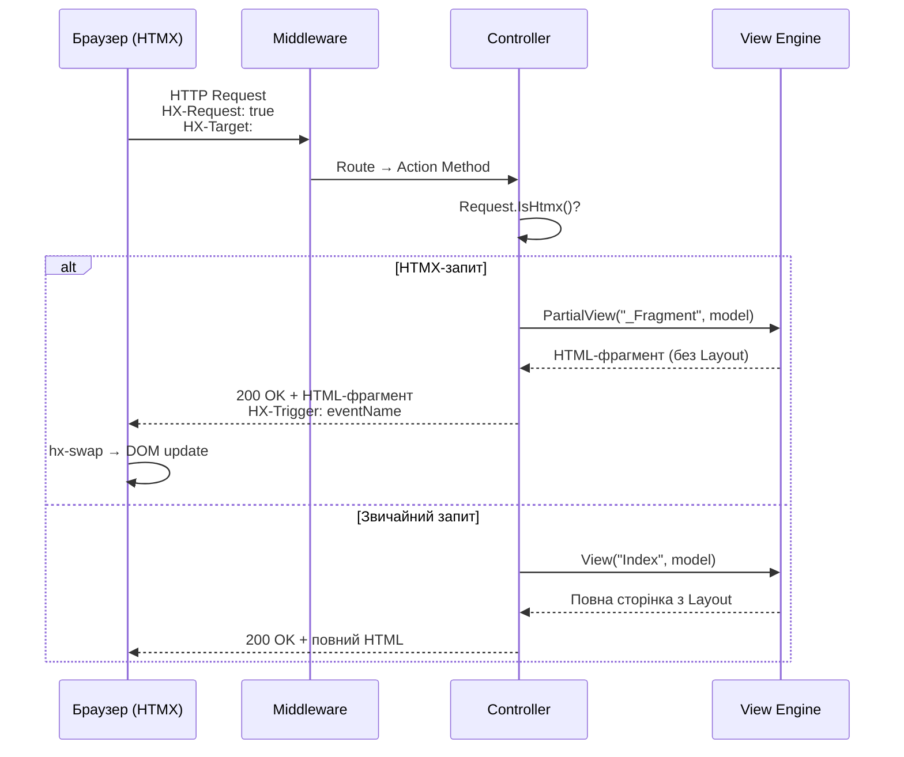

# HTMX у ASP.NET Core MVC: серверна інтеграція

Попередня стаття дослідила HTMX як клієнтську технологію — атрибути, тригери, режими вставки. Ми з'ясували, що бібліотека вміє перехоплювати кліки, надсилати HTTP-запити і вставляти HTML-фрагменти у DOM. Але виникає закономірне питання: **як має бути організована серверна сторона?**

ASP.NET Core MVC — це серверна технологія, що природно генерує HTML. На перший погляд, HTMX і MVC ідеально створені одне для одного: HTMX хоче отримувати HTML-фрагменти, а MVC вміє їх генерувати через Partial Views. Проте інтеграція вимагає кількох нетривіальних архітектурних рішень.

По-перше, Controller повинен вміти **розрізняти** звичайний навігаційний запит від HTMX-запиту: перший вимагає повної сторінки з `_Layout`, другий — лише фрагмент. По-друге, форми захищені **AntiForgery-токеном** — і потрібно передати його разом із HTMX-запитами, що не є стандартними HTML-формами. По-третє, сервер може **керувати поведінкою HTMX** на клієнті через спеціальні HTTP-заголовки відповіді — `HX-Redirect`, `HX-Trigger`, `HX-Reswap`. Це «зворотний» канал комунікації: сервер дає інструкції браузеру без JavaScript.

Ця стаття покриває всі три аспекти та завершується трьома практичними патернами, що є фундаментом більшості реальних HTMX+MVC застосунків.

---

## Архітектура: як HTMX-запит проходить через MVC

Перш ніж заглиблюватись у деталі, розглянемо загальну картину. HTMX-запит — це звичайний HTTP-запит, але з кількома характерними заголовками. Розуміння потоку запиту допоможе зрозуміти, де і чому потрібні зміни на серверній стороні:

::mermaid



::

Діаграма ілюструє ключовий момент: **один і той самий Action-метод** обслуговує обидва типи запитів. Логіка маршрутизації залишається незмінною — змінюється лише те, що повертається: повна сторінка або фрагмент. Саме ця дуальність робить HTMX+MVC елегантним рішенням: застосунок залишається коректно працюючим навіть при відключеному JavaScript (progressive enhancement).

---

## Виявлення HTMX-запитів: заголовок `HX-Request`

HTMX автоматично додає до **кожного** свого запиту заголовок `HX-Request: true`. Це маркер, що дозволяє серверній стороні однозначно ідентифікувати запит як HTMX-запит на відміну від звичайного навігаційного запиту браузера.

Перевірка виконується у Controller через `Request.Headers`:

```csharp [Controllers/ArticleController.cs]
public async Task<IActionResult> Index(string? q)
{
    var articles = await _articles.SearchAsync(q);

    // Якщо запит від HTMX — повертаємо лише список (без Layout)
    if (Request.Headers.ContainsKey("HX-Request"))
        return PartialView("_ArticleList", articles);

    // Звичайний браузерний запит — повна сторінка з _Layout
    return View(articles);
}
```

Цей шаблон — умовне повернення `PartialView` або `View` залежно від наявності `HX-Request` — є **центральним патерном** HTMX+MVC інтеграції. Один URL обслуговує обидва сценарії: пряме відкриття в браузері і динамічне оновлення через HTMX.

### Extension-метод IsHtmx()

Повторення `Request.Headers.ContainsKey("HX-Request")` у кожному Controller-методі засмічує код. Виносимо перевірку в extension-метод:

```csharp [Extensions/HttpRequestExtensions.cs]
namespace BlogApp.Extensions;

public static class HttpRequestExtensions
{
    /// <summary>Повертає true якщо запит ініційований HTMX</summary>
    public static bool IsHtmx(this HttpRequest request)
        => request.Headers.ContainsKey("HX-Request");

    /// <summary>URL сторінки у браузері на момент HTMX-запиту</summary>
    public static string? HtmxCurrentUrl(this HttpRequest request)
        => request.Headers.TryGetValue("HX-Current-URL", out var val)
            ? val.ToString() : null;

    /// <summary>Значення hx-target атрибута ініціатора</summary>
    public static string? HtmxTarget(this HttpRequest request)
        => request.Headers.TryGetValue("HX-Target", out var val)
            ? val.ToString() : null;

    /// <summary>Значення hx-trigger атрибута (id ініціюючого елемента)</summary>
    public static string? HtmxTrigger(this HttpRequest request)
        => request.Headers.TryGetValue("HX-Trigger", out var val)
            ? val.ToString() : null;
}
```

Тепер Controller-код читається природно:

```csharp [Controllers/ArticleController.cs — з extension]
using BlogApp.Extensions;

public async Task<IActionResult> Index(string? q)
{
    var articles = await _articles.SearchAsync(q);

    return Request.IsHtmx()
        ? PartialView("_ArticleList", articles)
        : View(articles);
}
```

### Таблиця HTMX Request Headers

HTMX надсилає кілька корисних заголовків разом із кожним запитом. Їх можна читати у Controller для тонкого керування логікою:

::field-group

::field{name="HX-Request" type="true/false"}
Присутній у кожному HTMX-запиті. Дозволяє відрізнити HTMX-запит від звичайного.
::

::field{name="HX-Current-URL" type="string"}
Поточна URL сторінки в браузері на момент надсилання запиту. Корисно для логування та умовної логіки.
::

::field{name="HX-Target" type="string"}
Значення атрибута `hx-target` на клієнті — `id` або CSS-селектор цільового елемента.
::

::field{name="HX-Trigger" type="string"}
`id` елемента що ініціював запит (якщо він задано). Дозволяє ідентифікувати джерело запиту на сервері.
::

::field{name="HX-Trigger-Name" type="string"}
`name` атрибут елемента-ініціатора. Альтернатива до `HX-Trigger` для форм.
::

::field{name="HX-Boosted" type="true/false"}
Присутній коли запит ініційований через `hx-boost` (навігація по посиланню).
::

::field{name="HX-History-Restore-Request" type="true/false"}
Запит є відновленням стану при навігації «Назад» у браузері.
::

::


---

## AntiForgery Token з HTMX

Cross-Site Request Forgery (CSRF) — клас атак, при якому зловмисний сайт змушує браузер жертви надіслати автентифікований запит до вашого застосунку. ASP.NET Core захищається через **AntiForgery Token**: сервер генерує унікальний токен, вбудовує його у форму, а при POST-запиті звіряє отриманий токен із очікуваним.

Проблема з HTMX: атрибут `hx-post` на кнопці — це не HTML-форма, а JavaScript-запит. Стандартний механізм вбудовування токена через `<input type="hidden" name="__RequestVerificationToken">` не спрацює, якщо ініціатор запиту — кнопка, а не `<form>`. Потрібна альтернативна стратегія.

Є два надійних підходи. Перший — природний, для форм. Другий — глобальний, для кнопок і посилань.

::steps

### Підхід 1: HTMX-форма (автоматично)

Якщо ініціатором HTMX-запиту є `<form>`, і форма містить стандартний AntiForgery input — токен буде включено у запит автоматично, оскільки HTMX серіалізує всі поля форми:

```html [Views/Product/Create.cshtml]
@* asp-antiforgery="true" або просто <form> з tag helper asp-action — генерує hidden input *@
<form hx-post="/products/create"
      hx-target="#product-list"
      hx-swap="beforeend"
      asp-antiforgery="true">

    @* HTMX серіалізує ВСІ поля форми, включно з hidden __RequestVerificationToken *@
    <input type="text" name="name" placeholder="Назва товару">
    <button type="submit">Створити</button>
</form>
```

На стороні Controller — атрибут `[ValidateAntiForgeryToken]` як завжди:

```csharp [Controllers/ProductController.cs]
[HttpPost]
[ValidateAntiForgeryToken]
public IActionResult Create(ProductCreateDto dto)
{
    // ...
    return Request.IsHtmx()
        ? PartialView("_ProductCard", product)
        : RedirectToAction(nameof(Index));
}
```

### Підхід 2: Meta-тег + глобальна конфігурація (для кнопок)

Якщо HTMX-запит ініціюється **кнопкою** поза формою або посиланням — потрібно передати токен через заголовок запиту. Це реалізується через мета-тег у `_Layout.cshtml` і одноразову HTMX-конфігурацію:

```html [Views/Shared/_Layout.cshtml]
<head>
    @* ... *@
    @* Вбудовуємо токен у мета-тег — безпечно, оскільки читається лише JS на тій же сторінці *@
    <meta name="htmx-config" content='{"antiForgery":{"headerName":"RequestVerificationToken","formFieldName":"__RequestVerificationToken"}}'>
    <meta name="RequestVerificationToken" content="@Antiforgery.GetAndStoreTokens(Context).RequestToken">
</head>
```

```javascript [wwwroot/js/htmx-setup.js]
// Єдиний JS-файл у застосунку — налаштування HTMX перед кожним запитом
document.addEventListener("htmx:configRequest", (event) => {
    const token = document.querySelector('meta[name="RequestVerificationToken"]')
        ?.getAttribute("content");
    if (token) {
        event.detail.headers["RequestVerificationToken"] = token;
    }
});
```

```csharp [Program.cs — реєстрація IAntiforgery]
// Реєструємо IAntiforgery для ін'єкції у _Layout.cshtml
builder.Services.AddAntiforgery(options => {
    options.HeaderName = "RequestVerificationToken"; // читати токен також із заголовка
});
```

::

::warning
Підхід 2 вимагає **єдиного** невеликого файлу `htmx-setup.js`. Це єдиний виняток із правила «жодного JavaScript» — він потрібен лише один раз для всього застосунку і стосується виключно безпеки, а не логіки інтерфейсу.
::

::tip
Для спрощення можна поєднати обидва підходи: використовувати `<form>` де можливо (підхід 1), і мета-тег як fallback для кнопок поза формами (підхід 2). Це дає максимальну сумісність без дублювання токенів.
::

---

## HX-Response Headers: керування HTMX з сервера

Одна з найпотужніших особливостей HTMX — двонаправлена комунікація між сервером і клієнтом. Клієнт надсилає запит із `HX-*` заголовками, а сервер відповідає власними `HX-*` заголовками, що **інструктують HTMX** виконати додаткові дії. Це архітектурно важливо: бізнес-логіка залишається на сервері, і сервер сам вирішує що має відбутися на клієнті.

### `HX-Redirect` — перенаправлення після HTMX-запиту

У звичайному MVC-патерні після успішного POST використовується `RedirectToAction` — `302 Found`. Але `302` не спрацьовує коректно із HTMX: бібліотека перехоплює редирект та виконує AJAX-запит на нову URL, вставляючи відповідь у `hx-target` замість навігації. `HX-Redirect` повідомляє HTMX виконати **повноцінну навігацію** браузера:

```csharp [Controllers/ProductController.cs]
[HttpPost, ValidateAntiForgeryToken]
public async Task<IActionResult> Create(ProductCreateDto dto)
{
    if (!ModelState.IsValid)
        return Request.IsHtmx()
            ? PartialView("_CreateForm", dto)
            : View(dto);

    var product = await _service.CreateAsync(dto);

    if (Request.IsHtmx())
    {
        // Повна навігація — не AJAX-вставка у hx-target
        Response.Headers["HX-Redirect"] = Url.Action("Details", new { id = product.Id });
        return Ok(); // тіло ігнорується при HX-Redirect
    }

    return RedirectToAction(nameof(Details), new { id = product.Id });
}
```

### `HX-Trigger` — ініціювати клієнтські події

`HX-Trigger` дозволяє серверу після виконання запиту **ініціювати JavaScript-подію** у браузері. Будь-який елемент що слухає цю подію через `hx-trigger="eventName from:body"` отримає сигнал і зробить свій HTMX-запит. Це елегантний спосіб реактивного оновлення кількох незалежних компонентів без OOB-свопів:

```csharp [Controllers/CartController.cs]
[HttpPost]
public async Task<IActionResult> Add(int productId)
{
    await _cart.AddItemAsync(productId);
    // Всі підписники "cartUpdated" на сторінці оновляться самостійно
    Response.Headers["HX-Trigger"] = "cartUpdated";
    return PartialView("_AddToCartConfirmation");
}
```

У `_Layout.cshtml` компонент кошика слухає цю подію автоматично:

```html [Views/Shared/_Layout.cshtml]
<span id="cart-badge"
      hx-get="/cart/count"
      hx-trigger="cartUpdated from:body"
      hx-swap="innerHTML">0</span>
```

Для передачі даних разом із подією `HX-Trigger` приймає JSON:

```csharp
// Подія з даними — доступні через event.detail на клієнті
Response.Headers["HX-Trigger"] = """{"cartUpdated": {"count": 5}}""";
```

### `HX-Retarget` та `HX-Reswap` — динамічна зміна цілі

Інколи сервер знає що результат запиту потрібно показати в іншому місці, ніж очікував клієнт. `HX-Retarget` замінює `hx-target`, а `HX-Reswap` замінює стратегію вставки — обидва визначаються сервером під час обробки:

```csharp [Controllers/FormController.cs]
[HttpPost]
public IActionResult Submit(FormDto dto)
{
    if (!ModelState.IsValid)
    {
        // Перенаправити відповідь у глобальне вікно помилок
        Response.Headers["HX-Retarget"] = "#global-error-panel";
        Response.Headers["HX-Reswap"] = "innerHTML";
        Response.StatusCode = 422; // Unprocessable Entity
        return PartialView("_ValidationErrors", ModelState);
    }
    // ...
}
```

### Повна таблиця HX-Response Headers

::field-group

::field{name="HX-Location" type="string | JSON"}
Клієнтська навігація без повного перезавантаження. Приймає URL або JSON з `path`, `target`, `swap`.
::

::field{name="HX-Push-Url" type="string | false"}
Додати URL до History API браузера. `false` — заборонити push навіть якщо `hx-push-url` задано клієнтом.
::

::field{name="HX-Redirect" type="string (URL)"}
Виконати повну навігацію браузера — коректна альтернатива `302` для HTMX-запитів.
::

::field{name="HX-Refresh" type="true"}
Перезавантажити поточну сторінку повністю. Корисно після дій що кардинально змінюють стан.
::

::field{name="HX-Retarget" type="CSS selector"}
Замінити `hx-target` — вказати інший елемент для вставки відповіді.
::

::field{name="HX-Reswap" type="swap strategy"}
Замінити стратегію вставки (`innerHTML`, `outerHTML`, `beforeend`, тощо).
::

::field{name="HX-Trigger" type="string | JSON"}
Ініціювати одну або кілька JavaScript-подій на клієнті після отримання відповіді.
::

::field{name="HX-Trigger-After-Settle" type="string | JSON"}
Ініціювати події після завершення settle-анімації HTMX.
::

::

---

## Практичні патерни

### Патерн 1: Live-Search

Live-search — найпопулярніший патерн HTMX+MVC. Поле пошуку надсилає GET-запит при введенні тексту (з debounce 300мс), сервер фільтрує дані і повертає HTML-фрагмент зі списком результатів. Жодного JavaScript для логіки пошуку.

**Структура файлів:**

::code-tree

```
Controllers/
  ProductController.cs   ← Index() + Search()
Views/Product/
  Index.cshtml           ← повна сторінка з полем пошуку
  _ProductGrid.cshtml    ← partial: сітка карток товарів
```

::

**Controller:**

```csharp [Controllers/ProductController.cs]
public class ProductController : Controller
{
    private readonly IProductRepository _products;

    public ProductController(IProductRepository products)
        => _products = products;

    // GET /products — повна сторінка при першому відкритті
    public async Task<IActionResult> Index()
    {
        var products = await _products.GetAllAsync();
        return View(products);
    }

    // GET /products/search?q=ноутбук — лише при HTMX-запиті
    [HttpGet]
    public async Task<IActionResult> Search(string? q)
    {
        var results = string.IsNullOrWhiteSpace(q)
            ? await _products.GetAllAsync()
            : await _products.SearchAsync(q);

        // Завжди повертаємо PartialView — цей endpoint лише для HTMX
        return PartialView("_ProductGrid", results);
    }
}
```

**Index.cshtml — поле пошуку:**

```html [Views/Product/Index.cshtml]
@model IReadOnlyList<Product>

<div class="container">
    <h1>Каталог товарів</h1>

    @* hx-trigger="input changed delay:300ms" — debounce 300мс, лише при зміні значення *@
    <div class="mb-4 position-relative">
        <input type="search"
               name="q"
               class="form-control form-control-lg"
               placeholder="Пошук за назвою..."
               hx-get="/products/search"
               hx-target="#product-grid"
               hx-trigger="input changed delay:300ms"
               hx-indicator="#search-spinner"
               hx-push-url="true"
               autocomplete="off">

        @* Спіннер — зникає автоматично після відповіді *@
        <div id="search-spinner" class="htmx-indicator position-absolute top-50 end-0
                                        translate-middle-y me-3">
            <div class="spinner-border spinner-border-sm text-secondary"></div>
        </div>
    </div>

    @* Початкові результати рендеряться сервером — SEO-дружньо *@
    <div id="product-grid">
        <partial name="_ProductGrid" model="Model"/>
    </div>
</div>
```

**_ProductGrid.cshtml — фрагмент результатів:**

```html [Views/Product/_ProductGrid.cshtml]
@model IReadOnlyList<Product>

@if (!Model.Any())
{
    <div class="alert alert-info">За вашим запитом нічого не знайдено.</div>
}
else
{
    <div class="row row-cols-1 row-cols-md-3 g-4">
        @foreach (var product in Model)
        {
            <div class="col">
                <div class="card h-100 shadow-sm">
                    <div class="card-body">
                        <h5 class="card-title">@product.Name</h5>
                        <p class="card-text text-muted">@product.Category</p>
                        <p class="card-text fw-bold">@product.Price.ToString("C")</p>
                    </div>
                </div>
            </div>
        }
    </div>
}
```

`hx-push-url="true"` оновлює URL у браузері при кожному пошуку — результати можна закладинкувати та поділитися посиланням. При прямому відкритті URL `/products?q=ноутбук` сервер рендерить сторінку з вже відфільтрованими результатами.

---

### Патерн 2: Lazy Loading / Infinite Scroll

Infinite scroll дозволяє завантажувати наступну «сторінку» даних автоматично, коли користувач доходить до кінця поточного списку. HTMX реалізує це через `hx-trigger="revealed"` — тригер спрацьовує коли елемент з'являється у viewport (Intersection Observer).

**Ключова ідея:** наприкінці кожної порції даних сервер додає «sentinel»-елемент — порожній `<div>`, що буде завантажувати **наступну** порцію при появі у viewport, а потім замінюватись новою порцією разом із новим sentinel.

```csharp [Controllers/ArticleController.cs]
// GET /articles?page=1 — перша порція або наступні через revealed
[HttpGet]
public async Task<IActionResult> Index(int page = 1)
{
    const int pageSize = 10;
    var articles = await _articles.GetPageAsync(page, pageSize);
    var hasMore = await _articles.HasMoreAsync(page, pageSize);

    var vm = new ArticlePageViewModel(articles, page, hasMore);

    // Перша сторінка — повний View з Layout
    if (page == 1 && !Request.IsHtmx())
        return View(vm);

    // Наступні сторінки через HTMX — лише фрагмент
    return PartialView("_ArticlePage", vm);
}
```

```html [Views/Article/_ArticlePage.cshtml]
@model ArticlePageViewModel

@* Статті поточної сторінки *@
@foreach (var article in Model.Articles)
{
    <article class="card mb-3 shadow-sm">
        <div class="card-body">
            <h2 class="h5">@article.Title</h2>
            <p class="text-muted small">@article.PublishedAt:d</p>
        </div>
    </article>
}

@* Sentinel-елемент — лише якщо є наступна сторінка *@
@if (Model.HasMore)
{
    @* При появі у viewport — завантажує наступну порцію і замінює сам себе *@
    <div hx-get="/articles?page=@(Model.Page + 1)"
         hx-trigger="revealed"
         hx-swap="outerHTML"
         class="d-flex justify-content-center py-4">
        <div class="spinner-border text-primary"></div>
    </div>
}
```

Sentinel-div завантажує наступну сторінку (`page + 1`) і замінює себе через `outerHTML`. Нова порція містить нові статті і новий sentinel для сторінки `page + 2`. Процес є само-підтримуючим — доки є дані, ланцюжок продовжується.

---

### Патерн 3: Inline Edit

Inline edit дозволяє редагувати значення прямо в таблиці без переходу на окрему сторінку редагування. Патерн будується на трьох станах рядка: **перегляд** (звичайний `<tr>`), **редагування** (рядок з `<input>`), **збережено** (оновлений `<tr>`).

```csharp [Controllers/Admin/ProductController.cs]
// GET /admin/products/{id}/row — рядок у режимі перегляду
[HttpGet, Route("admin/products/{id}/row")]
public async Task<IActionResult> Row(int id)
{
    var product = await _products.GetByIdAsync(id);
    return PartialView("_ProductRow", product);
}

// GET /admin/products/{id}/edit-row — рядок у режимі редагування
[HttpGet, Route("admin/products/{id}/edit-row")]
public async Task<IActionResult> EditRow(int id)
{
    var product = await _products.GetByIdAsync(id);
    return PartialView("_ProductEditRow", product);
}

// PATCH /admin/products/{id} — зберегти зміни
[HttpPatch, Route("admin/products/{id}")]
[ValidateAntiForgeryToken]
public async Task<IActionResult> Update(int id, ProductUpdateDto dto)
{
    if (!ModelState.IsValid)
    {
        Response.StatusCode = 422;
        return PartialView("_ProductEditRow", dto);
    }
    var updated = await _products.UpdateAsync(id, dto);
    return PartialView("_ProductRow", updated);
}
```

```html [Views/Admin/Product/_ProductRow.cshtml]
@model Product

@* id="row-{id}" — дозволяє hx-target знайти цей рядок для заміни *@
<tr id="row-@Model.Id">
    <td>@Model.Name</td>
    <td>@Model.Price.ToString("C")</td>
    <td>@Model.Category</td>
    <td>
        @* Клік → замінює весь рядок на Edit-версію через outerHTML *@
        <button class="btn btn-sm btn-outline-primary"
                hx-get="/admin/products/@Model.Id/edit-row"
                hx-target="#row-@Model.Id"
                hx-swap="outerHTML">✏️</button>
    </td>
</tr>
```

```html [Views/Admin/Product/_ProductEditRow.cshtml]
@model Product

<tr id="row-@Model.Id">
    <td><input name="name" value="@Model.Name" class="form-control form-control-sm"></td>
    <td><input name="price" value="@Model.Price" type="number" class="form-control form-control-sm"></td>
    <td>@Model.Category</td>
    <td class="d-flex gap-1">
        @* ✓ Зберегти: PATCH + AntiForgery через meta-тег *@
        <button class="btn btn-sm btn-success"
                hx-patch="/admin/products/@Model.Id"
                hx-target="#row-@Model.Id"
                hx-swap="outerHTML"
                hx-include="closest tr">✓</button>
        @* ✕ Скасувати: повернути View-версію рядка *@
        <button class="btn btn-sm btn-outline-secondary"
                hx-get="/admin/products/@Model.Id/row"
                hx-target="#row-@Model.Id"
                hx-swap="outerHTML">✕</button>
    </td>
</tr>
```

`hx-include="closest tr"` включає значення всіх `<input>` всередині найближчого `<tr>` — без окремої `<form>`. Це дозволяє будувати редаговані таблиці без вкладених форм, що є неvalid HTML.

---

## Обробка помилок з HTMX

HTMX за замовчуванням **ігнорує** відповіді з HTTP-статусами 4xx та 5xx — вміст відповіді не вставляється у DOM. Щоб показати помилку користувачу, потрібно або використати `422 Unprocessable Entity` (єдиний 4xx що HTMX обробляє як успіх), або налаштувати глобальний обробник:

```javascript [wwwroot/js/htmx-setup.js]
// Глобальна обробка HTTP-помилок від HTMX
document.addEventListener("htmx:responseError", (event) => {
    const status = event.detail.xhr.status;
    const message = status === 403 ? "Доступ заборонено"
        : status === 404 ? "Ресурс не знайдено"
        : status >= 500 ? "Помилка сервера. Спробуйте пізніше."
        : "Сталася помилка.";

    // Показати toast або alert
    document.getElementById("error-toast").textContent = message;
    document.getElementById("error-toast").classList.add("show");
});
```

Для відображення помилок валідації форм — використовуйте `422`:

```csharp
if (!ModelState.IsValid)
{
    Response.StatusCode = 422; // HTMX обробляє 422 як успіх і вставляє відповідь
    return PartialView("_FormWithErrors", model);
}
```

---

## Практичні завдання

### Рівень 1 — Базовий

**Завдання 1.1.** Реалізуйте **live-search для таблиці користувачів** у адмін-панелі: `UserController.Search(string? q)` що приймає `hx-trigger="input changed delay:300ms"`, фільтрує за іменем та email, повертає `PartialView("_UserTable", results)`. Додайте порожній стан «Нічого не знайдено».

**Завдання 1.2.** Додайте до будь-якого CRUD-контролера **підтвердження видалення через HTMX**: кнопка «Видалити» робить `hx-get="/items/{id}/confirm"` → сервер повертає `_ConfirmDialog.cshtml` з кнопками «Так» і «Ні» → «Так» робить `hx-delete="/items/{id}"`.

### Рівень 2 — Логіка

**Завдання 2.1.** Реалізуйте **фільтрацію таблиці по кількох полях одночасно**: `<select>` для статусу, `<input>` для пошуку, `<select>` для сортування — всі три використовують `hx-include` для включення один одного. Всі три реагують на `change` і надсилають запит на один endpoint `GET /orders/filter`.

**Завдання 2.2.** Побудуйте **inline edit із Server-Side Validation**: при збереженні якщо `ModelState.IsValid == false` — сервер повертає `422` з Edit-рядком де підсвічені помилки. При успіху — повертає View-рядок та `HX-Trigger: "rowUpdated"` для оновлення лічильника змін у заголовку таблиці.

### Рівень 3 — Архітектура

**Завдання 3.1.** Реалізуйте **глобальний HTMX middleware**: `HtmxMiddleware` що для кожного HTMX-запиту логує `HX-Target`, `HX-Trigger`, `HX-Current-URL` у structured logging (`ILogger`). Реєструйте лише запити де `HX-Request` присутній. Витягніть значення через extension-методи `IsHtmx()`, `HtmxTarget()`, `HtmxTrigger()`.

---

## Резюме

- **`HX-Request: true`** — маркер HTMX-запиту; `Request.IsHtmx()` extension для зручної перевірки
- **`PartialView` vs `View`** — один Action повертає обидва залежно від `IsHtmx()`: progressive enhancement
- **AntiForgery підхід 1** — `<form asp-antiforgery="true">` + HTMX серіалізує всі поля автоматично
- **AntiForgery підхід 2** — мета-тег + `htmx:configRequest` для кнопок поза формами; один JS-файл на весь застосунок
- **`HX-Redirect`** — коректне перенаправлення після HTMX POST; замість `302` що HTMX перехоплює як AJAX
- **`HX-Trigger`** — сервер ініціює клієнтські події; слухачі через `hx-trigger="event from:body"`
- **`HX-Retarget` / `HX-Reswap`** — сервер динамічно змінює ціль і стратегію вставки
- **Live-search** — `hx-get` + `hx-trigger="input changed delay:300ms"` + `hx-push-url="true"` + `hx-indicator`
- **Infinite scroll** — sentinel `<div hx-trigger="revealed" hx-swap="outerHTML">` + само-підтримуючий ланцюжок
- **Inline edit** — три стани рядка: Row / EditRow / Update; `hx-include="closest tr"` замість вкладеної форми
- **Помилки** — `422 Unprocessable Entity` для валідації; `htmx:responseError` для глобальної обробки

У наступній статті — **Практичний проєкт: Каталог товарів з HTMX**: наскрізний застосунок від `dotnet new` до завершеного каталогу з live-search, infinite scroll, inline edit, модальними вікнами та кошиком — усе на HTMX без JavaScript-фреймворків.


::


