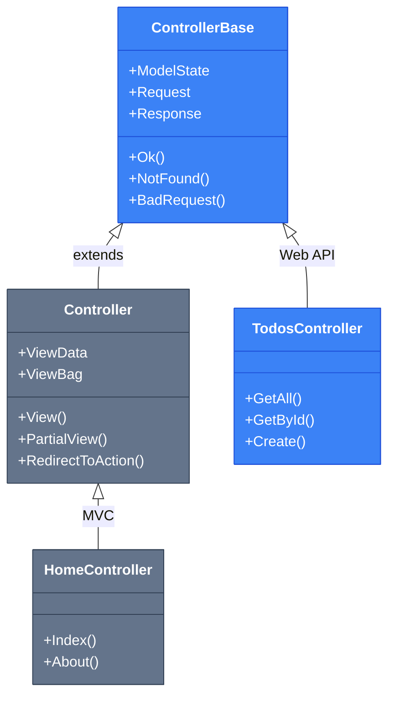
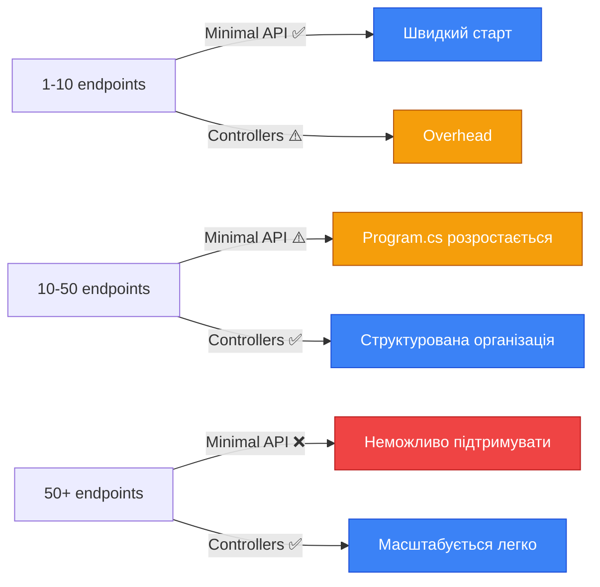

# Від Minimal API до Controller-based API

## Вступ: Дві філософії побудови API

Коли ви вперше створюєте REST API в ASP.NET Core, перед вами постає фундаментальне питання архітектурного вибору: використовувати **Minimal API** з його лаконічним функціональним стилем чи **Controller-based API** з об'єктно-орієнтованою структурою? Це не просто питання синтаксичних переваг — це вибір між двома філософіями організації коду, кожна з яких має свої сильні сторони та обмеження.

Уявіть, що ви будуєте невелику кав'ярню. Minimal API — це як відкритий бар, де бариста стоїть за стійкою і безпосередньо приймає замовлення, готує каву та віддає її клієнту. Все відбувається швидко, без зайвих формальностей, і для невеликого закладу це ідеальне рішення. Controller-based API — це як ресторан з офіціантами, кухнею та чіткою ієрархією: замовлення приймає офіціант, передає на кухню, отримує готову страву і сервірує її за встановленими стандартами. Це вимагає більше структури, але дозволяє масштабуватися до великого закладу з десятками столиків.

У попередніх розділах ви вже досконало опанували Minimal API — його middleware pipeline, dependency injection, routing та конфігурацію. Ви знаєте, як створювати endpoints через `app.MapGet()`, `app.MapPost()` та інші методи розширення. Тепер настав час зрозуміти, коли цього підходу стає недостатньо і як еволюціонувати до більш структурованої архітектури без втрати продуктивності.

::note
**Передумови:** Ця стаття передбачає, що ви вже вивчили Minimal API (17 статей), API Design (14 статей) та MVC Controllers (16 статей). Ми будемо активно посилатися на ці знання, показуючи мости між парадигмами.
::

### Що ви створите в цій статті

Ми побудуємо **Todo API** — класичний CRUD-сервіс для управління завданнями. Але замість того, щоб просто написати код, ми створимо **два паралельні рішення**: одне на Minimal API, друге на Web API Controllers. Це дозволить вам побачити не теоретичні абстракції, а реальні відмінності в організації коду, тестованості та масштабованості.

До кінця статті ви зможете:

- Пояснити фундаментальні відмінності між `Controller` та `ControllerBase`
- Розуміти, що робить атрибут `[ApiController]` "під капотом"
- Мігрувати існуючі Minimal API endpoints на Controllers
- Обґрунтовано вибирати підхід для конкретного проєкту

---

## Фундаментальні концепції: Анатомія двох підходів

### Minimal API: Функціональна парадигма

Minimal API, представлений у .NET 6, втілює **функціональний підхід** до побудови веб-сервісів. Його філософія базується на ідеї, що HTTP endpoint — це просто функція, яка приймає запит і повертає відповідь. Не потрібні класи, атрибути чи складна ієрархія — лише чистий код.


Розглянемо типовий Minimal API endpoint:

```csharp
app.MapGet("/api/todos/{id}", async (int id, TodoDbContext db) =>
{
    var todo = await db.Todos.FindAsync(id);
    return todo is not null ? Results.Ok(todo) : Results.NotFound();
});
```

Що відбувається в цьому коді?

- **Inline визначення:** Endpoint визначається безпосередньо в `Program.cs` через lambda-вираз
- **Автоматичний model binding:** Параметр `id` автоматично береться з маршруту, `db` — з DI-контейнера
- **Явне повернення результату:** Використовуємо статичний клас `Results` для формування HTTP-відповіді
- **Відсутність класів:** Немає контролерів, базових класів чи атрибутів — лише функція

Цей підхід надзвичайно ефективний для **невеликих API** або **мікросервісів** з обмеженою кількістю endpoints. Код читається лінійно, зверху вниз, і вся логіка маршрутизації знаходиться в одному місці. Для команди з 2-3 розробників, які працюють над сервісом з 10-15 endpoints, це ідеальне рішення.

### Controller-based API: Об'єктно-орієнтована парадигма

Web API Controllers втілюють **об'єктно-орієнтований підхід**, де endpoints групуються в класи за доменною логікою. Замість розкиданих по `Program.cs` функцій, ми створюємо **контролери** — класи, що успадковуються від `ControllerBase` і містять методи-дії (actions), кожен з яких обробляє окремий HTTP-запит.

Той самий endpoint у Controller-based підході:

```csharp
[ApiController]
[Route("api/[controller]")]
public class TodosController : ControllerBase
{
    private readonly TodoDbContext _db;

    public TodosController(TodoDbContext db)
    {
        _db = db;
    }

    [HttpGet("{id}")]
    public async Task<ActionResult<Todo>> GetById(int id)
    {
        var todo = await _db.Todos.FindAsync(id);
        return todo is not null ? Ok(todo) : NotFound();
    }
}
```

Декомпозиція цього коду:

1. **`[ApiController]`** — атрибут, що вмикає спеціальну поведінку для API (про це детально нижче)
2. **`[Route("api/[controller]")]`** — шаблон маршруту на рівні класу; `[controller]` замінюється на "todos" (без суфікса "Controller")
3. **`ControllerBase`** — базовий клас, що надає допоміжні методи (`Ok()`, `NotFound()`, тощо)
4. **Dependency Injection через конструктор** — замість параметрів методу, залежності ін'єктуються один раз у конструктор
5. **`ActionResult<T>`** — generic тип повернення, що дозволяє повертати як `T`, так і HTTP-результати (`NotFound`, `BadRequest`)


### ControllerBase vs Controller: Критична відмінність

Одне з найпоширеніших непорозумінь серед розробників, які переходять від MVC до Web API — це вибір між `Controller` та `ControllerBase`. Ця відмінність не є косметичною; вона відображає фундаментальну різницю в призначенні.

**`Controller`** (з простору імен `Microsoft.AspNetCore.Mvc`) — це клас для **MVC-додатків**, що повертають HTML-представлення (Views). Він успадковується від `ControllerBase` і додає функціональність для роботи з Razor Views:

- `View()` — повертає Razor View
- `PartialView()` — повертає часткове представлення
- `ViewData`, `ViewBag`, `TempData` — механізми передачі даних у View
- `RedirectToAction()` — перенаправлення на інший action з поверненням HTML

**`ControllerBase`** — це **мінімалістична база** для API-контролерів, що повертають дані (JSON/XML), а не HTML. Він містить лише те, що потрібно для обробки HTTP-запитів:

- `Ok()`, `Created()`, `NoContent()` — методи для формування успішних відповідей
- `BadRequest()`, `NotFound()`, `Conflict()` — методи для помилок
- `Request`, `Response`, `User` — доступ до HTTP-контексту
- `ModelState` — стан валідації моделі

::tip
**Правило вибору:** Якщо ваш контролер повертає JSON/XML (API) — використовуйте `ControllerBase`. Якщо повертає HTML (MVC) — використовуйте `Controller`. Використання `Controller` для API додає ~50 KB непотрібного коду у ваш додаток через підключення Razor View Engine.
::

Ось візуальна ієрархія:

::mermaid

::


### Магія атрибута [ApiController]: Що відбувається під капотом

Атрибут `[ApiController]` — це не просто декоративна мітка. Він активує **набір конвенцій та автоматичної поведінки**, що спрощують розробку API та роблять його більш передбачуваним. Розглянемо кожну з цих можливостей детально.

#### 1. Автоматична валідація моделі з поверненням 400 Bad Request

Без `[ApiController]` вам потрібно вручну перевіряти `ModelState` у кожному action:

```csharp
// БЕЗ [ApiController] — ручна перевірка
[HttpPost]
public async Task<IActionResult> Create(CreateTodoDto dto)
{
    if (!ModelState.IsValid) // Ручна перевірка
    {
        return BadRequest(ModelState); // Ручне повернення помилки
    }
    
    // Логіка створення...
}
```

З `[ApiController]` ця перевірка відбувається **автоматично**. Якщо модель не пройшла валідацію (наприклад, порушені `[Required]` чи `[MaxLength]` атрибути), фреймворк автоматично повертає `400 Bad Request` з деталями помилок у форматі `ProblemDetails` (RFC 9457):

```csharp
// З [ApiController] — автоматична валідація
[ApiController]
[Route("api/[controller]")]
public class TodosController : ControllerBase
{
    [HttpPost]
    public async Task<IActionResult> Create(CreateTodoDto dto)
    {
        // ModelState вже перевірено! Якщо ми тут — модель валідна
        // Логіка створення...
    }
}
```

Приклад відповіді при невалідній моделі:

```json
{
  "type": "https://tools.ietf.org/html/rfc9457#section-3.1",
  "title": "One or more validation errors occurred.",
  "status": 400,
  "errors": {
    "Title": ["The Title field is required."],
    "DueDate": ["The field DueDate must be between 01/01/2024 and 12/31/2030."]
  }
}
```

::note
**Технічна деталь:** Автоматична валідація реалізована через `ModelStateInvalidFilter` — спеціальний фільтр, що додається до pipeline при наявності `[ApiController]`. Ви можете налаштувати його поведінку через `ApiBehaviorOptions` у `Program.cs`.
::


#### 2. Автоматичний inference джерела даних ([FromBody] за замовчуванням)

У Minimal API та звичайних контролерах без `[ApiController]` вам потрібно явно вказувати, звідки брати дані для складних типів:

```csharp
// БЕЗ [ApiController]
[HttpPost]
public IActionResult Create([FromBody] CreateTodoDto dto) // Явний [FromBody]
{
    // ...
}
```

З `[ApiController]` фреймворк **автоматично визначає джерело** за правилами:

- **Складні типи** (класи, records) → `[FromBody]` (з тіла запиту як JSON)
- **Прості типи** (int, string, bool) у маршруті → `[FromRoute]`
- **Прості типи** у query string → `[FromQuery]`
- **`IFormFile`, `IFormFileCollection`** → `[FromForm]`

```csharp
// З [ApiController] — автоматичний inference
[HttpPost]
public IActionResult Create(CreateTodoDto dto) // [FromBody] додається автоматично
{
    // dto автоматично десеріалізується з JSON-тіла запиту
}

[HttpGet("{id}")]
public IActionResult GetById(int id) // [FromRoute] додається автоматично
{
    // id автоматично береться з URL
}

[HttpGet]
public IActionResult Search(string query) // [FromQuery] додається автоматично
{
    // query береться з ?query=...
}
```

Це робить код чистішим та зменшує кількість boilerplate-атрибутів. Однак, якщо вам потрібна нестандартна поведінка (наприклад, складний тип з query string), ви завжди можете явно вказати атрибут:

```csharp
[HttpGet]
public IActionResult Filter([FromQuery] TodoFilterDto filter) // Явне перевизначення
{
    // filter десеріалізується з query string: ?status=completed&priority=high
}
```

#### 3. Обов'язковість атрибута [Route]

Контролери з `[ApiController]` **вимагають** наявності атрибута маршрутизації на рівні класу або методу. Це запобігає випадковому використанню convention-based routing (який призначений для MVC з Views):

```csharp
[ApiController] // Помилка компіляції, якщо немає [Route]!
public class TodosController : ControllerBase
{
    // ...
}
```

Правильний варіант:

```csharp
[ApiController]
[Route("api/[controller]")] // Обов'язковий атрибут
public class TodosController : ControllerBase
{
    // ...
}
```


#### 4. Автоматичне повернення ProblemDetails для помилок

Коли ваш action повертає статус-код помилки (400, 404, 500), `[ApiController]` автоматично обгортає відповідь у стандартизований формат `ProblemDetails` (RFC 9457). Це забезпечує консистентність API та полегшує обробку помилок на клієнті:

```csharp
[HttpGet("{id}")]
public ActionResult<Todo> GetById(int id)
{
    var todo = _db.Todos.Find(id);
    if (todo is null)
        return NotFound(); // Автоматично перетворюється на ProblemDetails
    
    return Ok(todo);
}
```

Відповідь для `NotFound()`:

```json
{
  "type": "https://tools.ietf.org/html/rfc9457#section-3.1",
  "title": "Not Found",
  "status": 404,
  "traceId": "00-a1b2c3d4e5f6-7890abcdef-00"
}
```

### Порівняльна таблиця: Minimal API vs Web API Controllers

Тепер, коли ми розглянули обидва підходи детально, зведемо ключові відмінності в таблицю:

| Аспект | Minimal API | Web API Controllers |
|--------|-------------|---------------------|
| **Базовий клас** | Немає | `ControllerBase` |
| **Визначення endpoints** | `app.MapGet("/api/todos", ...)` | `[HttpGet]` атрибут на методі |
| **Маршрутизація** | Inline у `Program.cs` | `[Route]` атрибути на класі/методі |
| **Dependency Injection** | Параметри handler-функції | Конструктор контролера |
| **Model Binding** | Автоматичний (параметри) | Автоматичний + `[ApiController]` inference |
| **Валідація** | Ручна або FluentValidation | Автоматична через `[ApiController]` |
| **Повернення результату** | `Results.Ok(data)` | `Ok(data)` або `ActionResult<T>` |
| **Групування логіки** | За файлами/модулями | За контролерами (класами) |
| **OpenAPI/Swagger** | `WithOpenApi()` extension | Автоматично через Swashbuckle |
| **Тестування** | Складніше (потрібен `WebApplicationFactory`) | Простіше (unit-тести методів) |
| **Масштабованість** | До ~20-30 endpoints | Необмежена (сотні endpoints) |
| **Продуктивність** | Трохи швидше (~5-10%) | Трохи повільніше (overhead класів) |

::warning
**Міф про продуктивність:** Часто можна почути, що Minimal API "значно швидший" за Controllers. Насправді різниця становить **5-10% у синтетичних бенчмарках** і практично непомітна в реальних додатках, де bottleneck — це база даних або зовнішні API, а не фреймворк.
::


---

## Практична реалізація: Todo API двома способами

Настав час перейти від теорії до практики. Ми створимо повноцінний CRUD API для управління завданнями (Todo items), реалізувавши його **двома паралельними способами**: спочатку через Minimal API, потім через Web API Controllers. Це дозволить вам побачити не абстрактні відмінності, а реальний код у дії.

### Крок 1: Створення проєкту та налаштування бази даних

Почнемо зі створення нового ASP.NET Core проєкту та налаштування Entity Framework Core для роботи з SQLite (для простоти демонстрації).

::steps

### Створення проєкту

Відкрийте термінал та виконайте команди:

::terminal-preview{title="bash"}
<div class="line"><span class="opacity-40">$</span> <strong class="font-bold">dotnet new webapi -n TodoApi</strong></div>
<div class="line"><span class="text-green-400 font-bold">The template "ASP.NET Core Web API" was created successfully.</span></div>
<div class="line"></div>
<div class="line"><span class="opacity-40">$</span> <strong class="font-bold">cd TodoApi</strong></div>
<div class="line"><span class="opacity-40">$</span> <strong class="font-bold">dotnet add package Microsoft.EntityFrameworkCore.Sqlite</strong></div>
<div class="line"><span class="text-blue-400">info</span> : PackageReference for package 'Microsoft.EntityFrameworkCore.Sqlite' version '8.0.0' added</div>
<div class="line"></div>
<div class="line"><span class="opacity-40">$</span> <strong class="font-bold">dotnet add package Microsoft.EntityFrameworkCore.Design</strong></div>
<div class="line"><span class="text-blue-400">info</span> : PackageReference for package 'Microsoft.EntityFrameworkCore.Design' version '8.0.0' added</div>
::

### Створення моделі та DbContext

Створіть файл `Models/Todo.cs`:

```csharp
namespace TodoApi.Models;

public class Todo
{
    public int Id { get; set; }
    public required string Title { get; set; }
    public string? Description { get; set; }
    public bool IsCompleted { get; set; }
    public DateTime CreatedAt { get; set; } = DateTime.UtcNow;
    public DateTime? CompletedAt { get; set; }
}
```

Створіть файл `Data/TodoDbContext.cs`:

```csharp
using Microsoft.EntityFrameworkCore;
using TodoApi.Models;

namespace TodoApi.Data;

public class TodoDbContext : DbContext
{
    public TodoDbContext(DbContextOptions<TodoDbContext> options) 
        : base(options)
    {
    }

    public DbSet<Todo> Todos => Set<Todo>();

    protected override void OnModelCreating(ModelBuilder modelBuilder)
    {
        modelBuilder.Entity<Todo>(entity =>
        {
            entity.HasKey(e => e.Id);
            entity.Property(e => e.Title).IsRequired().HasMaxLength(200);
            entity.Property(e => e.Description).HasMaxLength(1000);
            entity.HasIndex(e => e.IsCompleted);
        });
    }
}
```


### Налаштування DbContext у Program.cs

Відкрийте `Program.cs` та додайте реєстрацію DbContext:

```csharp
using Microsoft.EntityFrameworkCore;
using TodoApi.Data;

var builder = WebApplication.CreateBuilder(args);

// Реєстрація DbContext з SQLite
builder.Services.AddDbContext<TodoDbContext>(options =>
    options.UseSqlite("Data Source=todos.db"));

// Додаємо підтримку Controllers (поки що закоментовано)
// builder.Services.AddControllers();

builder.Services.AddEndpointsApiExplorer();
builder.Services.AddSwaggerGen();

var app = builder.Build();

// Автоматичне застосування міграцій при старті (тільки для dev!)
using (var scope = app.Services.CreateScope())
{
    var db = scope.ServiceProvider.GetRequiredService<TodoDbContext>();
    db.Database.EnsureCreated();
}

if (app.Environment.IsDevelopment())
{
    app.UseSwagger();
    app.UseSwaggerUI();
}

app.UseHttpsRedirection();

// Тут будуть наші endpoints

app.Run();
```

::note
**Про `EnsureCreated()`:** У production-середовищі замість `EnsureCreated()` використовуйте міграції через `dotnet ef migrations add` та `dotnet ef database update`. `EnsureCreated()` — це швидкий спосіб для прототипування, але він не підтримує версіонування схеми.
::

### Створення DTO (Data Transfer Objects)

Для дотримання принципу розділення відповідальності створимо окремі класи для вхідних даних (запитів) та вихідних (відповідей). Створіть файл `DTOs/TodoDtos.cs`:

```csharp
using System.ComponentModel.DataAnnotations;

namespace TodoApi.DTOs;

// DTO для створення нового Todo
public record CreateTodoDto
{
    [Required(ErrorMessage = "Title is required")]
    [MaxLength(200, ErrorMessage = "Title cannot exceed 200 characters")]
    public required string Title { get; init; }

    [MaxLength(1000, ErrorMessage = "Description cannot exceed 1000 characters")]
    public string? Description { get; init; }
}

// DTO для оновлення існуючого Todo
public record UpdateTodoDto
{
    [MaxLength(200)]
    public string? Title { get; init; }

    [MaxLength(1000)]
    public string? Description { get; init; }

    public bool? IsCompleted { get; init; }
}

// DTO для відповіді (можна додати додаткові поля, які не є в моделі)
public record TodoResponseDto
{
    public int Id { get; init; }
    public required string Title { get; init; }
    public string? Description { get; init; }
    public bool IsCompleted { get; init; }
    public DateTime CreatedAt { get; init; }
    public DateTime? CompletedAt { get; init; }
}
```

::tip
**Чому records?** Ми використовуємо `record` замість `class` для DTO, оскільки records надають immutability за замовчуванням, автоматичну реалізацію `Equals`/`GetHashCode` та лаконічний синтаксис. Це ідеально для об'єктів, що передають дані без поведінки.
::

::


---

### Реалізація 1: Minimal API підхід

Тепер реалізуємо повний CRUD функціонал через Minimal API endpoints. Додайте наступний код у `Program.cs` перед `app.Run()`:

```csharp
// ============= MINIMAL API ENDPOINTS =============

var todosGroup = app.MapGroup("/api/todos")
    .WithTags("Todos (Minimal API)")
    .WithOpenApi();

// GET /api/todos - Отримати всі завдання
todosGroup.MapGet("/", async (TodoDbContext db) =>
{
    var todos = await db.Todos
        .OrderByDescending(t => t.CreatedAt)
        .ToListAsync();
    
    return Results.Ok(todos.Select(t => new TodoResponseDto
    {
        Id = t.Id,
        Title = t.Title,
        Description = t.Description,
        IsCompleted = t.IsCompleted,
        CreatedAt = t.CreatedAt,
        CompletedAt = t.CompletedAt
    }));
})
.Produces<IEnumerable<TodoResponseDto>>(StatusCodes.Status200OK);

// GET /api/todos/{id} - Отримати завдання за ID
todosGroup.MapGet("/{id:int}", async (int id, TodoDbContext db) =>
{
    var todo = await db.Todos.FindAsync(id);
    
    if (todo is null)
        return Results.NotFound(new { message = $"Todo with ID {id} not found" });
    
    var response = new TodoResponseDto
    {
        Id = todo.Id,
        Title = todo.Title,
        Description = todo.Description,
        IsCompleted = todo.IsCompleted,
        CreatedAt = todo.CreatedAt,
        CompletedAt = todo.CompletedAt
    };
    
    return Results.Ok(response);
})
.Produces<TodoResponseDto>(StatusCodes.Status200OK)
.Produces(StatusCodes.Status404NotFound);

// POST /api/todos - Створити нове завдання
todosGroup.MapPost("/", async (CreateTodoDto dto, TodoDbContext db) =>
{
    // Ручна валідація (у Minimal API немає автоматичної)
    var validationResults = new List<ValidationResult>();
    var validationContext = new ValidationContext(dto);
    
    if (!Validator.TryValidateObject(dto, validationContext, validationResults, true))
    {
        var errors = validationResults
            .GroupBy(r => r.MemberNames.FirstOrDefault() ?? "")
            .ToDictionary(
                g => g.Key,
                g => g.Select(r => r.ErrorMessage ?? "").ToArray()
            );
        
        return Results.ValidationProblem(errors);
    }
    
    var todo = new Todo
    {
        Title = dto.Title,
        Description = dto.Description,
        IsCompleted = false,
        CreatedAt = DateTime.UtcNow
    };
    
    db.Todos.Add(todo);
    await db.SaveChangesAsync();
    
    var response = new TodoResponseDto
    {
        Id = todo.Id,
        Title = todo.Title,
        Description = todo.Description,
        IsCompleted = todo.IsCompleted,
        CreatedAt = todo.CreatedAt,
        CompletedAt = todo.CompletedAt
    };
    
    return Results.Created($"/api/todos/{todo.Id}", response);
})
.Produces<TodoResponseDto>(StatusCodes.Status201Created)
.Produces(StatusCodes.Status400BadRequest);
```


```csharp
// PUT /api/todos/{id} - Оновити завдання
todosGroup.MapPut("/{id:int}", async (int id, UpdateTodoDto dto, TodoDbContext db) =>
{
    var todo = await db.Todos.FindAsync(id);
    
    if (todo is null)
        return Results.NotFound(new { message = $"Todo with ID {id} not found" });
    
    // Оновлюємо тільки ті поля, що передані
    if (dto.Title is not null)
        todo.Title = dto.Title;
    
    if (dto.Description is not null)
        todo.Description = dto.Description;
    
    if (dto.IsCompleted.HasValue)
    {
        todo.IsCompleted = dto.IsCompleted.Value;
        todo.CompletedAt = dto.IsCompleted.Value ? DateTime.UtcNow : null;
    }
    
    await db.SaveChangesAsync();
    
    var response = new TodoResponseDto
    {
        Id = todo.Id,
        Title = todo.Title,
        Description = todo.Description,
        IsCompleted = todo.IsCompleted,
        CreatedAt = todo.CreatedAt,
        CompletedAt = todo.CompletedAt
    };
    
    return Results.Ok(response);
})
.Produces<TodoResponseDto>(StatusCodes.Status200OK)
.Produces(StatusCodes.Status404NotFound);

// DELETE /api/todos/{id} - Видалити завдання
todosGroup.MapDelete("/{id:int}", async (int id, TodoDbContext db) =>
{
    var todo = await db.Todos.FindAsync(id);
    
    if (todo is null)
        return Results.NotFound(new { message = $"Todo with ID {id} not found" });
    
    db.Todos.Remove(todo);
    await db.SaveChangesAsync();
    
    return Results.NoContent();
})
.Produces(StatusCodes.Status204NoContent)
.Produces(StatusCodes.Status404NotFound);
```

Декомпозиція Minimal API коду:

1. **`MapGroup("/api/todos")`** — створює групу endpoints з спільним префіксом, що зменшує дублювання
2. **`.WithTags("Todos (Minimal API)")`** — додає тег для Swagger UI, щоб згрупувати endpoints
3. **`.WithOpenApi()`** — генерує метадані OpenAPI для кожного endpoint
4. **Ручна валідація** — використовуємо `Validator.TryValidateObject()` для перевірки DataAnnotations
5. **`Results.Created()`** — повертає 201 з Location header, що вказує на створений ресурс
6. **`.Produces<T>()`** — метадані для OpenAPI про можливі типи відповідей

::warning
**Проблема масштабованості:** Зверніть увагу, скільки boilerplate-коду потрібно для валідації, маппінгу та обробки помилок. У проєкті з 50+ endpoints цей код розростається до тисяч рядків у `Program.cs`, що робить його важко підтримуваним.
::


---

### Реалізація 2: Web API Controllers підхід

Тепер створимо той самий функціонал через Controller-based підхід. Спочатку увімкніть підтримку Controllers у `Program.cs`:

```csharp
// У Program.cs, після AddDbContext
builder.Services.AddControllers(); // Розкоментуйте цей рядок

// Перед app.Run()
app.MapControllers(); // Додайте цей рядок
```

Створіть файл `Controllers/TodosController.cs`:

```csharp
using Microsoft.AspNetCore.Mvc;
using Microsoft.EntityFrameworkCore;
using TodoApi.Data;
using TodoApi.DTOs;
using TodoApi.Models;

namespace TodoApi.Controllers;

[ApiController]
[Route("api/[controller]")]
[Produces("application/json")]
public class TodosController : ControllerBase
{
    private readonly TodoDbContext _db;
    private readonly ILogger<TodosController> _logger;

    public TodosController(TodoDbContext db, ILogger<TodosController> logger)
    {
        _db = db;
        _logger = logger;
    }

    /// <summary>
    /// Отримати всі завдання
    /// </summary>
    /// <returns>Список всіх завдань</returns>
    [HttpGet]
    [ProducesResponseType(typeof(IEnumerable<TodoResponseDto>), StatusCodes.Status200OK)]
    public async Task<ActionResult<IEnumerable<TodoResponseDto>>> GetAll()
    {
        _logger.LogInformation("Fetching all todos");
        
        var todos = await _db.Todos
            .OrderByDescending(t => t.CreatedAt)
            .ToListAsync();
        
        var response = todos.Select(MapToDto);
        
        return Ok(response);
    }

    /// <summary>
    /// Отримати завдання за ID
    /// </summary>
    /// <param name="id">Ідентифікатор завдання</param>
    /// <returns>Завдання або 404</returns>
    [HttpGet("{id:int}")]
    [ProducesResponseType(typeof(TodoResponseDto), StatusCodes.Status200OK)]
    [ProducesResponseType(StatusCodes.Status404NotFound)]
    public async Task<ActionResult<TodoResponseDto>> GetById(int id)
    {
        _logger.LogInformation("Fetching todo with ID {TodoId}", id);
        
        var todo = await _db.Todos.FindAsync(id);
        
        if (todo is null)
        {
            _logger.LogWarning("Todo with ID {TodoId} not found", id);
            return NotFound(new { message = $"Todo with ID {id} not found" });
        }
        
        return Ok(MapToDto(todo));
    }

    /// <summary>
    /// Створити нове завдання
    /// </summary>
    /// <param name="dto">Дані для створення</param>
    /// <returns>Створене завдання</returns>
    [HttpPost]
    [ProducesResponseType(typeof(TodoResponseDto), StatusCodes.Status201Created)]
    [ProducesResponseType(StatusCodes.Status400BadRequest)]
    public async Task<ActionResult<TodoResponseDto>> Create(CreateTodoDto dto)
    {
        // Валідація відбувається автоматично завдяки [ApiController]!
        
        _logger.LogInformation("Creating new todo: {Title}", dto.Title);
        
        var todo = new Todo
        {
            Title = dto.Title,
            Description = dto.Description,
            IsCompleted = false,
            CreatedAt = DateTime.UtcNow
        };
        
        _db.Todos.Add(todo);
        await _db.SaveChangesAsync();
        
        var response = MapToDto(todo);
        
        return CreatedAtAction(
            nameof(GetById), 
            new { id = todo.Id }, 
            response
        );
    }


    /// <summary>
    /// Оновити існуюче завдання
    /// </summary>
    /// <param name="id">Ідентифікатор завдання</param>
    /// <param name="dto">Дані для оновлення</param>
    /// <returns>Оновлене завдання або 404</returns>
    [HttpPut("{id:int}")]
    [ProducesResponseType(typeof(TodoResponseDto), StatusCodes.Status200OK)]
    [ProducesResponseType(StatusCodes.Status404NotFound)]
    public async Task<ActionResult<TodoResponseDto>> Update(int id, UpdateTodoDto dto)
    {
        _logger.LogInformation("Updating todo with ID {TodoId}", id);
        
        var todo = await _db.Todos.FindAsync(id);
        
        if (todo is null)
        {
            _logger.LogWarning("Todo with ID {TodoId} not found", id);
            return NotFound(new { message = $"Todo with ID {id} not found" });
        }
        
        // Оновлюємо тільки передані поля
        if (dto.Title is not null)
            todo.Title = dto.Title;
        
        if (dto.Description is not null)
            todo.Description = dto.Description;
        
        if (dto.IsCompleted.HasValue)
        {
            todo.IsCompleted = dto.IsCompleted.Value;
            todo.CompletedAt = dto.IsCompleted.Value ? DateTime.UtcNow : null;
        }
        
        await _db.SaveChangesAsync();
        
        return Ok(MapToDto(todo));
    }

    /// <summary>
    /// Видалити завдання
    /// </summary>
    /// <param name="id">Ідентифікатор завдання</param>
    /// <returns>204 No Content або 404</returns>
    [HttpDelete("{id:int}")]
    [ProducesResponseType(StatusCodes.Status204NoContent)]
    [ProducesResponseType(StatusCodes.Status404NotFound)]
    public async Task<IActionResult> Delete(int id)
    {
        _logger.LogInformation("Deleting todo with ID {TodoId}", id);
        
        var todo = await _db.Todos.FindAsync(id);
        
        if (todo is null)
        {
            _logger.LogWarning("Todo with ID {TodoId} not found", id);
            return NotFound(new { message = $"Todo with ID {id} not found" });
        }
        
        _db.Todos.Remove(todo);
        await _db.SaveChangesAsync();
        
        return NoContent();
    }

    // Приватний допоміжний метод для маппінгу
    private static TodoResponseDto MapToDto(Todo todo) => new()
    {
        Id = todo.Id,
        Title = todo.Title,
        Description = todo.Description,
        IsCompleted = todo.IsCompleted,
        CreatedAt = todo.CreatedAt,
        CompletedAt = todo.CompletedAt
    };
}
```

Декомпозиція Controller-based коду:

1. **Dependency Injection через конструктор** — `TodoDbContext` та `ILogger` ін'єктуються один раз, а не в кожному методі
2. **Автоматична валідація** — завдяки `[ApiController]` немає потреби в ручній перевірці `ModelState`
3. **XML-коментарі** — `/// <summary>` генерують документацію для Swagger UI
4. **`[ProducesResponseType]`** — явно вказуємо можливі типи відповідей для OpenAPI
5. **`CreatedAtAction()`** — автоматично генерує Location header з URL створеного ресурсу
6. **Приватний метод `MapToDto()`** — централізований маппінг, що зменшує дублювання коду
7. **Structured logging** — використання `ILogger` з параметризованими повідомленнями


::tip
**Переваги Controller підходу:**
- Автоматична валідація без boilerplate-коду
- Централізований маппінг через приватні методи
- Легше тестувати (unit-тести методів без `WebApplicationFactory`)
- XML-коментарі для документації
- Structured logging з параметрами
- Групування логіки за доменом (всі Todo-операції в одному класі)
::

---

## Порівняльний аналіз: Метрики та висновки

Тепер, коли ми маємо дві реалізації одного API, проаналізуємо їх за ключовими метриками:

### Кількість рядків коду

| Метрика | Minimal API | Controllers | Різниця |
|---------|-------------|-------------|---------|
| Рядків коду для CRUD | ~180 | ~150 | -17% |
| Рядків валідації | ~15 на endpoint | 0 (автоматично) | -100% |
| Рядків маппінгу | ~8 на endpoint | ~8 (один раз) | -87% |
| **Загальна складність** | Висока (дублювання) | Низька (DRY) | — |

### Тестованість

**Minimal API:**
```csharp
// Потрібен WebApplicationFactory для інтеграційних тестів
public class TodosMinimalApiTests : IClassFixture<WebApplicationFactory<Program>>
{
    private readonly HttpClient _client;
    
    public TodosMinimalApiTests(WebApplicationFactory<Program> factory)
    {
        _client = factory.CreateClient();
    }
    
    [Fact]
    public async Task GetAll_ReturnsOkResult()
    {
        var response = await _client.GetAsync("/api/todos");
        response.EnsureSuccessStatusCode();
        // ...
    }
}
```

**Controllers:**
```csharp
// Можна писати прості unit-тести методів
public class TodosControllerTests
{
    [Fact]
    public async Task GetAll_ReturnsOkResult()
    {
        // Arrange
        var mockDb = CreateMockDbContext();
        var controller = new TodosController(mockDb, Mock.Of<ILogger<TodosController>>());
        
        // Act
        var result = await controller.GetAll();
        
        // Assert
        var okResult = Assert.IsType<OkObjectResult>(result.Result);
        var todos = Assert.IsAssignableFrom<IEnumerable<TodoResponseDto>>(okResult.Value);
        Assert.NotEmpty(todos);
    }
}
```

::note
**Висновок:** Controllers дозволяють писати **unit-тести** без підняття всього веб-сервера, що робить тести швидшими (в 10-20 разів) та простішими у налагодженні.
::


### Масштабованість проєкту

::mermaid

::

---

## Міграційна таблиця: Від Minimal API до Controllers

Якщо ви вже маєте проєкт на Minimal API і хочете мігрувати на Controllers, використовуйте цю таблицю як довідник:

| Minimal API | Web API Controllers | Примітки |
|-------------|---------------------|----------|
| `app.MapGet("/api/todos", handler)` | `[HttpGet]` на методі | Атрибут замість методу розширення |
| `app.MapPost("/api/todos", handler)` | `[HttpPost]` на методі | — |
| `app.MapPut("/api/todos/{id}", handler)` | `[HttpPut("{id}")]` | Параметр маршруту в атрибуті |
| `app.MapDelete("/api/todos/{id}", handler)` | `[HttpDelete("{id}")]` | — |
| `Results.Ok(data)` | `Ok(data)` або `return data` | Метод базового класу |
| `Results.Created(uri, data)` | `CreatedAtAction(nameof(Action), routeValues, data)` | Автоматична генерація URI |
| `Results.NotFound()` | `NotFound()` або `NotFound(message)` | — |
| `Results.BadRequest()` | `BadRequest()` або `BadRequest(ModelState)` | — |
| `Results.NoContent()` | `NoContent()` | — |
| `Results.ValidationProblem(errors)` | Автоматично через `[ApiController]` | Не потрібно вручну |
| Параметр `TodoDbContext db` | Конструктор `TodosController(TodoDbContext db)` | DI через конструктор |
| `.WithTags("Todos")` | `[Tags("Todos")]` на класі | Атрибут замість методу |
| `.WithOpenApi()` | Автоматично через Swashbuckle | Не потрібно явно вказувати |
| `.Produces<T>(200)` | `[ProducesResponseType(typeof(T), 200)]` | Атрибут на методі |
| Ручна валідація `Validator.TryValidateObject()` | Автоматична через `[ApiController]` | Економія 10-15 рядків на endpoint |

### Приклад міграції одного endpoint

**До (Minimal API):**
```csharp
app.MapPost("/api/todos", async (CreateTodoDto dto, TodoDbContext db) =>
{
    var validationResults = new List<ValidationResult>();
    var validationContext = new ValidationContext(dto);
    
    if (!Validator.TryValidateObject(dto, validationContext, validationResults, true))
    {
        return Results.ValidationProblem(/* ... */);
    }
    
    var todo = new Todo { Title = dto.Title, /* ... */ };
    db.Todos.Add(todo);
    await db.SaveChangesAsync();
    
    return Results.Created($"/api/todos/{todo.Id}", MapToDto(todo));
});
```

**Після (Controllers):**
```csharp
[HttpPost]
public async Task<ActionResult<TodoResponseDto>> Create(CreateTodoDto dto)
{
    // Валідація автоматична!
    var todo = new Todo { Title = dto.Title, /* ... */ };
    _db.Todos.Add(todo);
    await _db.SaveChangesAsync();
    
    return CreatedAtAction(nameof(GetById), new { id = todo.Id }, MapToDto(todo));
}
```

**Економія:** 8 рядків коду, автоматична валідація, автоматична генерація Location header.


---

## Коли використовувати який підхід: Матриця прийняття рішень

Вибір між Minimal API та Controllers не є бінарним "правильно/неправильно". Це залежить від контексту вашого проєкту. Ось структурована матриця для прийняття рішення:

::card-group

::card{title="✅ Використовуйте Minimal API" icon="i-lucide-zap"}

- **Мікросервіси** з 5-15 endpoints
- **Прототипи** та MVP
- **Serverless функції** (AWS Lambda, Azure Functions)
- **Внутрішні утиліти** та інструменти
- Команда віддає перевагу **функціональному стилю**
- Проєкт не буде масштабуватися понад 20 endpoints
- Потрібна **максимальна продуктивність** (різниця 5-10%)

::

::card{title="✅ Використовуйте Controllers" icon="i-lucide-layers"}

- **Монолітні API** з 20+ endpoints
- **Enterprise-додатки** з складною бізнес-логікою
- Проєкти з **великою командою** (5+ розробників)
- Потрібна **структурована організація** коду
- Важлива **тестованість** (unit-тести без WebApplicationFactory)
- Планується **довгострокова підтримка** (2+ роки)
- Потрібна **розширена документація** (XML-коментарі)

::

::card{title="🔀 Гібридний підхід" icon="i-lucide-git-merge"}

- **CRUD через Controllers**, lightweight endpoints через Minimal API
- **Health checks, metrics** — Minimal API
- **Бізнес-логіка** — Controllers
- **Webhooks, callbacks** — Minimal API
- Детальніше у статті 09 цього курсу

::

::

### Реальні сценарії з практики

::accordion

::accordion-item{label="Сценарій 1: Стартап з MVP" icon="i-lucide-rocket"}

**Контекст:** Команда з 2 розробників створює MVP для валідації ідеї. Потрібно швидко випустити продукт на ринок.

**Рішення:** **Minimal API**

**Обґрунтування:**
- Швидкість розробки критична
- Кількість endpoints обмежена (10-15)
- Код буде переписаний після отримання feedback
- Немає потреби в складній архітектурі

::

::accordion-item{label="Сценарій 2: Enterprise CRM система" icon="i-lucide-building"}

**Контекст:** Велика компанія розробляє внутрішню CRM-систему. Команда з 10 розробників, проєкт на 3 роки.

**Рішення:** **Web API Controllers**

**Обґрунтування:**
- 100+ endpoints (клієнти, замовлення, продукти, звіти)
- Потрібна чітка структура для паралельної роботи команди
- Важлива тестованість (CI/CD з unit-тестами)
- Довгострокова підтримка та еволюція API

::

::accordion-item{label="Сценарій 3: Мікросервісна архітектура" icon="i-lucide-boxes"}

**Контекст:** E-commerce платформа з 15 мікросервісами (auth, catalog, cart, payment, shipping, тощо).

**Рішення:** **Minimal API для кожного сервісу**

**Обґрунтування:**
- Кожен сервіс має 5-10 endpoints
- Незалежне розгортання та масштабування
- Продуктивність критична (високе навантаження)
- Кожен сервіс підтримується окремою командою

::

::accordion-item{label="Сценарій 4: Монолітний API з планами на мікросервіси" icon="i-lucide-split"}

**Контекст:** Існуючий монолітний API на Controllers, планується поступова міграція на мікросервіси.

**Рішення:** **Гібридний підхід**

**Обґрунтування:**
- Основна логіка залишається на Controllers
- Нові bounded contexts виносяться в окремі Minimal API сервіси
- Поступова міграція без повного переписування
- Використання API Gateway для об'єднання

::

::


---

## Практичні завдання

Закріпіть вивчений матеріал, виконавши наступні завдання. Вони розбиті на три рівні складності.

### Рівень 1: Базове розуміння

::steps

### Завдання 1.1: Виправлення помилок

У наступному коді є 3 помилки. Знайдіть та виправте їх:

```csharp
[ApiController]
public class ProductsController : Controller // Помилка 1
{
    [HttpGet]
    public IActionResult GetAll()
    {
        var products = new[] { "Product 1", "Product 2" };
        return products; // Помилка 2
    }
}
// Помилка 3: відсутній атрибут Route
```

::collapsible{title="Показати рішення"}

**Помилки:**
1. Використано `Controller` замість `ControllerBase` (для API потрібен `ControllerBase`)
2. Повернення масиву напряму замість `Ok(products)`
3. Відсутній атрибут `[Route]` (обов'язковий для `[ApiController]`)

**Виправлений код:**
```csharp
[ApiController]
[Route("api/[controller]")]
public class ProductsController : ControllerBase
{
    [HttpGet]
    public IActionResult GetAll()
    {
        var products = new[] { "Product 1", "Product 2" };
        return Ok(products);
    }
}
```
::

### Завдання 1.2: Конвертація Minimal API → Controller

Конвертуйте наступний Minimal API endpoint у Controller action:

```csharp
app.MapGet("/api/users/{id}", async (int id, UserDbContext db) =>
{
    var user = await db.Users.FindAsync(id);
    return user is not null ? Results.Ok(user) : Results.NotFound();
});
```

::collapsible{title="Показати рішення"}

```csharp
[ApiController]
[Route("api/[controller]")]
public class UsersController : ControllerBase
{
    private readonly UserDbContext _db;

    public UsersController(UserDbContext db)
    {
        _db = db;
    }

    [HttpGet("{id:int}")]
    [ProducesResponseType(typeof(User), StatusCodes.Status200OK)]
    [ProducesResponseType(StatusCodes.Status404NotFound)]
    public async Task<ActionResult<User>> GetById(int id)
    {
        var user = await _db.Users.FindAsync(id);
        return user is not null ? Ok(user) : NotFound();
    }
}
```
::

### Завдання 1.3: Атрибут [ApiController]

Поясніть, що станеться, якщо видалити атрибут `[ApiController]` з контролера. Які 3 речі перестануть працювати автоматично?

::collapsible{title="Показати відповідь"}

Без `[ApiController]`:
1. **Валідація моделі** не буде автоматичною — потрібно вручну перевіряти `ModelState.IsValid`
2. **Inference джерела даних** не працюватиме — потрібно явно вказувати `[FromBody]`, `[FromRoute]`
3. **ProblemDetails** не генеруватиметься автоматично для помилок — потрібно вручну формувати відповіді
::

::

---

### Рівень 2: Логіка та розширення

::steps

### Завдання 2.1: Додавання фільтрації

Розширте `TodosController` методом `GetByStatus`, що повертає завдання за статусом (completed/pending):

```
GET /api/todos/status/completed
GET /api/todos/status/pending
```

::collapsible{title="Показати рішення"}

```csharp
[HttpGet("status/{status}")]
[ProducesResponseType(typeof(IEnumerable<TodoResponseDto>), StatusCodes.Status200OK)]
[ProducesResponseType(StatusCodes.Status400BadRequest)]
public async Task<ActionResult<IEnumerable<TodoResponseDto>>> GetByStatus(string status)
{
    if (status != "completed" && status != "pending")
    {
        return BadRequest(new { message = "Status must be 'completed' or 'pending'" });
    }

    bool isCompleted = status == "completed";
    
    var todos = await _db.Todos
        .Where(t => t.IsCompleted == isCompleted)
        .OrderByDescending(t => t.CreatedAt)
        .ToListAsync();
    
    var response = todos.Select(MapToDto);
    
    return Ok(response);
}
```
::

### Завдання 2.2: Пагінація

Додайте пагінацію до методу `GetAll`. Приймайте параметри `page` (номер сторінки) та `pageSize` (кількість елементів):

```
GET /api/todos?page=1&pageSize=10
```

::collapsible{title="Показати рішення"}

```csharp
[HttpGet]
[ProducesResponseType(typeof(PagedResult<TodoResponseDto>), StatusCodes.Status200OK)]
public async Task<ActionResult<PagedResult<TodoResponseDto>>> GetAll(
    [FromQuery] int page = 1, 
    [FromQuery] int pageSize = 10)
{
    if (page < 1) page = 1;
    if (pageSize < 1 || pageSize > 100) pageSize = 10;

    var totalCount = await _db.Todos.CountAsync();
    
    var todos = await _db.Todos
        .OrderByDescending(t => t.CreatedAt)
        .Skip((page - 1) * pageSize)
        .Take(pageSize)
        .ToListAsync();
    
    var items = todos.Select(MapToDto);
    
    var result = new PagedResult<TodoResponseDto>
    {
        Items = items,
        Page = page,
        PageSize = pageSize,
        TotalCount = totalCount,
        TotalPages = (int)Math.Ceiling(totalCount / (double)pageSize)
    };
    
    return Ok(result);
}

// DTO для пагінації
public record PagedResult<T>
{
    public required IEnumerable<T> Items { get; init; }
    public int Page { get; init; }
    public int PageSize { get; init; }
    public int TotalCount { get; init; }
    public int TotalPages { get; init; }
}
```
::

::

---

### Рівень 3: Архітектура та створення

::steps

### Завдання 3.1: Новий контролер Categories

Створіть повноцінний `CategoriesController` для управління категоріями завдань:

**Модель:**
```csharp
public class Category
{
    public int Id { get; set; }
    public required string Name { get; set; }
    public string? Description { get; set; }
    public int TodoCount { get; set; } // Кількість завдань у категорії
}
```

**Endpoints:**
- `GET /api/categories` — всі категорії
- `GET /api/categories/{id}` — категорія за ID
- `POST /api/categories` — створити категорію
- `PUT /api/categories/{id}` — оновити категорію
- `DELETE /api/categories/{id}` — видалити категорію (тільки якщо TodoCount = 0)

::collapsible{title="Показати рішення"}

```csharp
[ApiController]
[Route("api/[controller]")]
public class CategoriesController : ControllerBase
{
    private readonly TodoDbContext _db;

    public CategoriesController(TodoDbContext db)
    {
        _db = db;
    }

    [HttpGet]
    public async Task<ActionResult<IEnumerable<Category>>> GetAll()
    {
        var categories = await _db.Categories.ToListAsync();
        return Ok(categories);
    }

    [HttpGet("{id:int}")]
    public async Task<ActionResult<Category>> GetById(int id)
    {
        var category = await _db.Categories.FindAsync(id);
        return category is not null ? Ok(category) : NotFound();
    }

    [HttpPost]
    public async Task<ActionResult<Category>> Create(CreateCategoryDto dto)
    {
        var category = new Category
        {
            Name = dto.Name,
            Description = dto.Description,
            TodoCount = 0
        };

        _db.Categories.Add(category);
        await _db.SaveChangesAsync();

        return CreatedAtAction(nameof(GetById), new { id = category.Id }, category);
    }

    [HttpPut("{id:int}")]
    public async Task<ActionResult<Category>> Update(int id, UpdateCategoryDto dto)
    {
        var category = await _db.Categories.FindAsync(id);
        if (category is null) return NotFound();

        if (dto.Name is not null) category.Name = dto.Name;
        if (dto.Description is not null) category.Description = dto.Description;

        await _db.SaveChangesAsync();
        return Ok(category);
    }

    [HttpDelete("{id:int}")]
    public async Task<IActionResult> Delete(int id)
    {
        var category = await _db.Categories.FindAsync(id);
        if (category is null) return NotFound();

        if (category.TodoCount > 0)
        {
            return BadRequest(new 
            { 
                message = "Cannot delete category with existing todos",
                todoCount = category.TodoCount
            });
        }

        _db.Categories.Remove(category);
        await _db.SaveChangesAsync();

        return NoContent();
    }
}
```
::

### Завдання 3.2: Міграція проєкту

Уявіть, що у вас є проєкт з 30 Minimal API endpoints у `Program.cs` (600+ рядків коду). Створіть план міграції на Controllers:

1. Які endpoints мігрувати першими?
2. Як організувати контролери?
3. Як забезпечити backward compatibility?

::collapsible{title="Показати план"}

**План міграції:**

**Фаза 1: Підготовка (тиждень 1)**
- Додати `builder.Services.AddControllers()` та `app.MapControllers()`
- Створити структуру папок: `Controllers/`, `DTOs/`, `Services/`
- Налаштувати Swashbuckle для Controllers

**Фаза 2: Міграція за доменами (тижні 2-4)**
- Почати з найпростіших endpoints (GET без параметрів)
- Групувати за доменною логікою: `UsersController`, `ProductsController`, тощо
- Мігрувати по одному контролеру за раз
- Зберігати обидва підходи паралельно (Minimal API + Controllers)

**Фаза 3: Тестування (тиждень 5)**
- Написати unit-тести для Controllers
- Інтеграційні тести для перевірки backward compatibility
- Навантажувальне тестування

**Фаза 4: Видалення Minimal API (тиждень 6)**
- Видалити старі Minimal API endpoints
- Оновити документацію
- Повідомити клієнтів API (якщо публічне)

**Backward compatibility:**
- Зберігати ті самі URL-шляхи
- Зберігати ті самі формати відповідей
- Використовувати API versioning для breaking changes
::

::


---

## Підсумок

У цій статті ми здійснили подорож від функціонального підходу Minimal API до об'єктно-орієнтованої архітектури Web API Controllers. Ви навчилися не просто писати код двома способами, а **розуміти філософію** кожного підходу та обґрунтовано вибирати інструмент для конкретної задачі.

**Ключові висновки:**

1. **ControllerBase vs Controller:** Для API завжди використовуйте `ControllerBase` — він не містить зайвої функціональності для Views та економить ресурси.

2. **Магія [ApiController]:** Цей атрибут не є декоративним — він активує автоматичну валідацію, inference джерела даних, ProblemDetails та обов'язковість маршрутизації.

3. **Minimal API для малих проєктів:** Ідеальний вибір для мікросервісів, прототипів та утиліт з 5-20 endpoints. Швидкий старт, мінімум boilerplate.

4. **Controllers для масштабованості:** Незамінні для enterprise-додатків з 20+ endpoints, великих команд та довгострокової підтримки. Структурована організація, легке тестування.

5. **Гібридний підхід:** Не бійтеся комбінувати обидва підходи в одному проєкті — використовуйте сильні сторони кожного.

У наступній статті ми заглибимося в **ActionResult\<T\> та Response Types**, розглянемо ієрархію результатів, правильні HTTP-коди та патерни повернення даних з API.

---

## Додаткові ресурси

::card-group

::card{title="Офіційна документація" icon="i-lucide-book-open" to="https://learn.microsoft.com/en-us/aspnet/core/web-api/" target="_blank"}
Microsoft Docs: Web API в ASP.NET Core
::

::card{title="Minimal API vs Controllers" icon="i-lucide-git-compare" to="https://learn.microsoft.com/en-us/aspnet/core/fundamentals/apis" target="_blank"}
Порівняння підходів від Microsoft
::

::card{title="ApiController атрибут" icon="i-lucide-code-2" to="https://learn.microsoft.com/en-us/aspnet/core/web-api/#apicontroller-attribute" target="_blank"}
Детальна документація про [ApiController]
::

::card{title="Testing Controllers" icon="i-lucide-flask-conical" to="https://learn.microsoft.com/en-us/aspnet/core/mvc/controllers/testing" target="_blank"}
Unit-тестування контролерів
::

::

---

::note
**Наступна стаття:** [ControllerBase, ActionResult\<T\> та Response Types](/csharp/aspnet/web-api/controller-base-actionresult) — глибоке занурення в типи повернення, HTTP-коди та патерни відповідей API.
::
