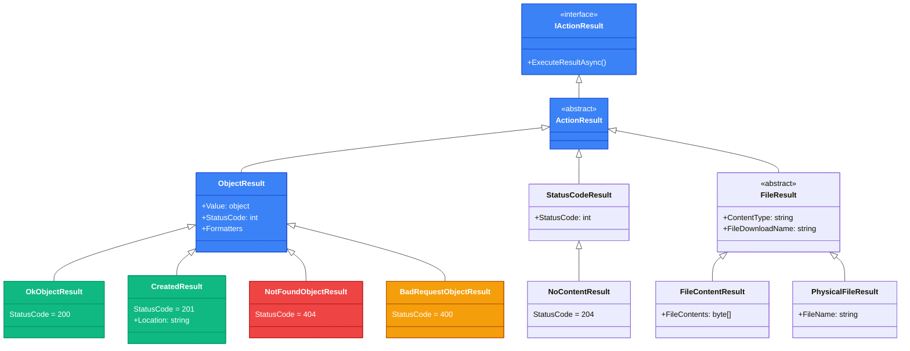
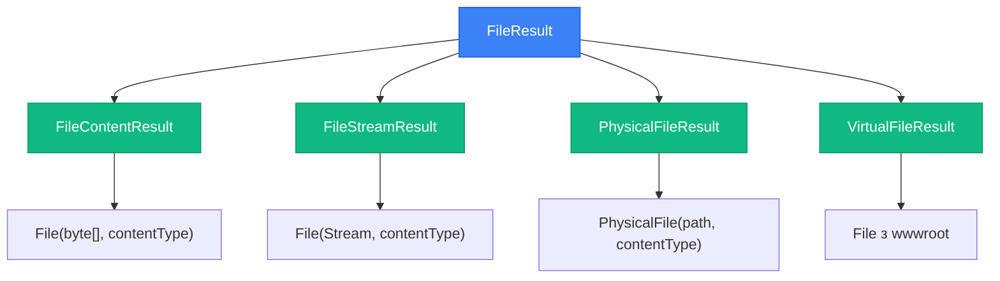

# ControllerBase, ActionResult\<T\> та Response Types

## Вступ: Мова спілкування з клієнтом

Якщо контролер — це серце вашого API, то **типи повернення** (response types) — це його мова спілкування з клієнтом. Кожна відповідь API — це не просто дані; це **структурована розмова**, де HTTP-код каже "що сталося", заголовки надають метадані, а тіло містить корисне навантаження. Неправильно обраний тип повернення або статус-код може зруйнувати user experience, навіть якщо ваша бізнес-логіка бездоганна.

Уявіть, що ви замовляєте каву в кав'ярні. Бариста може відповісти по-різному:

- **200 OK** + кава в руках: "Ось ваше замовлення" ☕
- **201 Created** + чек: "Замовлення створено, ось номер для відстеження" 🧾
- **204 No Content**: "Готово" (без додаткової інформації) ✅
- **404 Not Found**: "Вибачте, такого напою немає в меню" ❌
- **400 Bad Request**: "Не зрозумів ваше замовлення, повторіть, будь ласка" ⚠️
- **409 Conflict**: "Ви вже маєте активне замовлення" 🚫

Кожна з цих відповідей несе **семантичне значення**, і клієнт (мобільний додаток, веб-інтерфейс, інший сервіс) повинен розуміти, як реагувати. У попередній статті ми навчилися створювати контролери; тепер настав час опанувати **мистецтво формування відповідей**.

::note
**Передумови:** Ця стаття базується на знаннях з попередньої статті (01. Від Minimal API до Controllers), а також на розумінні HTTP-методів та статус-кодів з курсу API Design (статті 03-05).
::

### Що ви створите в цій статті

Ми побудуємо **Products API** — сервіс управління товарами інтернет-магазину. Цей API демонструватиме **всі типи відповідей** у реальних сценаріях:

- Успішне отримання даних (200 OK)
- Створення ресурсу з Location header (201 Created)
- Оновлення без повернення даних (204 No Content)
- Обробка відсутніх ресурсів (404 Not Found)
- Валідаційні помилки (400 Bad Request)
- Конфлікти бізнес-логіки (409 Conflict)
- Повернення файлів (File Download)

До кінця статті ви зможете:

- Обирати правильний тип повернення для кожного сценарію
- Використовувати `ActionResult<T>` vs `IActionResult` обґрунтовано
- Формувати відповіді з правильними HTTP-кодами
- Документувати API через `[ProducesResponseType]`
- Повертати файли з API (PDF, зображення, CSV)

---

## Фундаментальні концепції: Ієрархія результатів

### Базовий клас ControllerBase: Фабрика результатів

`ControllerBase` — це не просто базовий клас для успадкування. Це **фабрика допоміжних методів**, що спрощують створення HTTP-відповідей. Замість ручного конструювання об'єктів `ObjectResult`, `StatusCodeResult` та інших, ви використовуєте лаконічні методи.


Розглянемо ключові методи `ControllerBase`:

#### Успішні відповіді (2xx)

```csharp
// 200 OK - Успішна операція з даними
Ok(data)                    // ObjectResult з StatusCode = 200

// 201 Created - Ресурс створено
Created(uri, data)          // CreatedResult з Location header
CreatedAtAction(actionName, routeValues, data)  // Автоматична генерація URI
CreatedAtRoute(routeName, routeValues, data)    // URI через іменований маршрут

// 202 Accepted - Запит прийнято до обробки (асинхронні операції)
Accepted(uri, data)         // AcceptedResult

// 204 No Content - Успішно, але без даних у відповіді
NoContent()                 // NoContentResult
```

#### Помилки клієнта (4xx)

```csharp
// 400 Bad Request - Невалідний запит
BadRequest()                // BadRequestResult
BadRequest(error)           // BadRequestObjectResult з деталями
BadRequest(ModelState)      // Автоматичні помилки валідації

// 401 Unauthorized - Не автентифікований
Unauthorized()              // UnauthorizedResult

// 403 Forbidden - Автентифікований, але немає прав
Forbid()                    // ForbidResult

// 404 Not Found - Ресурс не знайдено
NotFound()                  // NotFoundResult
NotFound(message)           // NotFoundObjectResult з повідомленням

// 409 Conflict - Конфлікт бізнес-логіки
Conflict()                  // ConflictResult
Conflict(error)             // ConflictObjectResult

// 422 Unprocessable Entity - Семантично невалідний запит
UnprocessableEntity()       // UnprocessableEntityResult
UnprocessableEntity(ModelState)
```

#### Помилки сервера (5xx)

```csharp
// 500 Internal Server Error - Загальна помилка сервера
StatusCode(500)             // StatusCodeResult
StatusCode(500, error)      // ObjectResult з кодом 500

// Загальний метод для будь-якого коду
StatusCode(statusCode)
StatusCode(statusCode, value)
```

#### Спеціальні результати

```csharp
// Повернення файлів
File(bytes, contentType)                    // FileContentResult
File(stream, contentType)                   // FileStreamResult
PhysicalFile(path, contentType)             // PhysicalFileResult
File(bytes, contentType, fileDownloadName)  // З ім'ям для завантаження

// Перенаправлення
Redirect(url)               // RedirectResult (302)
RedirectPermanent(url)      // RedirectResult (301)
LocalRedirect(url)          // LocalRedirectResult (безпечніше)

// Проблемні деталі (RFC 9457)
Problem(detail, instance, statusCode, title, type)  // ProblemDetails
ValidationProblem(ModelState)                       // ValidationProblemDetails
```

::tip
**Правило вибору методу:** Завжди використовуйте найспецифічніший метод. Замість `StatusCode(200, data)` пишіть `Ok(data)` — це робить код самодокументованим та зрозумілим.
::


### Ієрархія типів результатів

Всі методи `ControllerBase` повертають об'єкти, що успадковуються від `IActionResult` або `ActionResult<T>`. Розуміння цієї ієрархії критично важливе для правильного вибору типу повернення.

::mermaid

::

**Ключові класи:**

1. **`IActionResult`** — базовий інтерфейс для всіх результатів. Містить єдиний метод `ExecuteResultAsync()`, що виконує формування HTTP-відповіді.

2. **`ActionResult`** — абстрактний клас, що реалізує `IActionResult`. Базовий клас для всіх конкретних результатів.

3. **`ObjectResult`** — результат з об'єктом у тілі відповіді. Автоматично серіалізується в JSON/XML через content negotiation.

4. **`StatusCodeResult`** — результат лише зі статус-кодом, без тіла.

5. **`FileResult`** — базовий клас для повернення файлів (зображення, PDF, CSV).


### ActionResult\<T\> vs IActionResult: Критичний вибір

Один з найважливіших рішень при проєктуванні API-методу — вибір між `ActionResult<T>` та `IActionResult`. Ця відмінність впливає на документацію OpenAPI, type safety та зручність використання.

#### IActionResult: Гнучкість без типізації

```csharp
[HttpGet("{id}")]
public async Task<IActionResult> GetById(int id)
{
    var product = await _db.Products.FindAsync(id);
    
    if (product is null)
        return NotFound(); // Повертаємо NotFoundResult
    
    return Ok(product);    // Повертаємо OkObjectResult
}
```

**Переваги:**
- Максимальна гнучкість — можна повертати будь-який тип результату
- Підходить для методів з багатьма різними типами відповідей

**Недоліки:**
- ❌ **Втрата типізації:** Компілятор не знає, що метод повертає `Product`
- ❌ **Погана документація OpenAPI:** Swagger не може автоматично визначити тип відповіді
- ❌ **Потрібні явні `[ProducesResponseType]` атрибути** для документації

#### ActionResult\<T\>: Type Safety + OpenAPI

```csharp
[HttpGet("{id}")]
public async Task<ActionResult<Product>> GetById(int id)
{
    var product = await _db.Products.FindAsync(id);
    
    if (product is null)
        return NotFound(); // Повертаємо NotFoundResult
    
    return product;        // Неявна конвертація Product → OkObjectResult
}
```

**Переваги:**
- ✅ **Type Safety:** Компілятор знає, що успішна відповідь містить `Product`
- ✅ **Автоматична документація OpenAPI:** Swagger бачить тип `Product` для 200 OK
- ✅ **Неявна конвертація:** Можна повертати `T` напряму, без `Ok()`
- ✅ **Intellisense:** IDE підказує властивості типу `T`

**Недоліки:**
- Трохи менша гнучкість (але це рідко є проблемою)

::tip
**Рекомендація:** Завжди використовуйте `ActionResult<T>` для API-методів, де є чіткий "успішний" тип відповіді. Використовуйте `IActionResult` лише для методів, що повертають принципово різні типи (наприклад, файл або JSON залежно від параметра).
::

#### Порівняльна таблиця

| Аспект | IActionResult | ActionResult\<T\> |
|--------|---------------|-------------------|
| **Type Safety** | ❌ Немає | ✅ Є |
| **OpenAPI документація** | ⚠️ Потрібні атрибути | ✅ Автоматична |
| **Неявна конвертація** | ❌ Завжди `Ok(data)` | ✅ Можна `return data` |
| **Гнучкість** | ✅ Максимальна | ⚠️ Обмежена одним типом |
| **Intellisense** | ❌ Немає підказок | ✅ Підказки для `T` |
| **Використання** | Рідко (legacy) | ✅ За замовчуванням |


#### Неявна конвертація: Магія ActionResult\<T\>

`ActionResult<T>` підтримує **неявну конвертацію** з типу `T` та з будь-якого `ActionResult`. Це дозволяє писати лаконічніший код:

```csharp
// Варіант 1: Явне Ok()
[HttpGet("{id}")]
public async Task<ActionResult<Product>> GetById_Explicit(int id)
{
    var product = await _db.Products.FindAsync(id);
    if (product is null) return NotFound();
    return Ok(product); // Явно обгортаємо в OkObjectResult
}

// Варіант 2: Неявна конвертація (рекомендовано)
[HttpGet("{id}")]
public async Task<ActionResult<Product>> GetById_Implicit(int id)
{
    var product = await _db.Products.FindAsync(id);
    if (product is null) return NotFound();
    return product; // Неявна конвертація Product → ActionResult<Product>
}
```

Обидва варіанти працюють ідентично, але другий — **чистіший та ідіоматичніший**. Компілятор автоматично обгортає `product` у `OkObjectResult`.

::warning
**Обережно з null:** Якщо ви повертаєте `null` напряму, це призведе до `204 No Content`, а не `200 OK` з `null` у тілі. Якщо потрібен саме `200 OK` з `null`, використовуйте `Ok(null)` явно.
::

---

## Практична реалізація: Products API

Настав час застосувати теорію на практиці. Створимо повноцінний API для управління товарами інтернет-магазину, демонструючи **всі типи відповідей** у реальних сценаріях.

### Крок 1: Налаштування проєкту

::steps

### Створення проєкту

::terminal-preview{title="bash"}
<div class="line"><span class="opacity-40">$</span> <strong class="font-bold">dotnet new webapi -n ProductsApi</strong></div>
<div class="line"><span class="text-green-400 font-bold">The template "ASP.NET Core Web API" was created successfully.</span></div>
<div class="line"></div>
<div class="line"><span class="opacity-40">$</span> <strong class="font-bold">cd ProductsApi</strong></div>
<div class="line"><span class="opacity-40">$</span> <strong class="font-bold">dotnet add package Microsoft.EntityFrameworkCore.InMemory</strong></div>
<div class="line"><span class="text-blue-400">info</span> : PackageReference for package 'Microsoft.EntityFrameworkCore.InMemory' added</div>
::

### Створення моделі Product

Створіть файл `Models/Product.cs`:

```csharp
using System.ComponentModel.DataAnnotations;

namespace ProductsApi.Models;

public class Product
{
    public int Id { get; set; }
    
    [Required]
    [MaxLength(200)]
    public required string Name { get; set; }
    
    [MaxLength(1000)]
    public string? Description { get; set; }
    
    [Range(0.01, 1_000_000)]
    public decimal Price { get; set; }
    
    [Range(0, int.MaxValue)]
    public int Stock { get; set; }
    
    [MaxLength(100)]
    public string? Category { get; set; }
    
    public bool IsActive { get; set; } = true;
    
    public DateTime CreatedAt { get; set; } = DateTime.UtcNow;
    
    public DateTime? UpdatedAt { get; set; }
}
```

### Створення DTOs

Створіть файл `DTOs/ProductDtos.cs`:

```csharp
using System.ComponentModel.DataAnnotations;

namespace ProductsApi.DTOs;

public record CreateProductDto
{
    [Required(ErrorMessage = "Product name is required")]
    [MaxLength(200)]
    public required string Name { get; init; }

    [MaxLength(1000)]
    public string? Description { get; init; }

    [Range(0.01, 1_000_000, ErrorMessage = "Price must be between 0.01 and 1,000,000")]
    public decimal Price { get; init; }

    [Range(0, int.MaxValue, ErrorMessage = "Stock cannot be negative")]
    public int Stock { get; init; }

    [MaxLength(100)]
    public string? Category { get; init; }
}

public record UpdateProductDto
{
    [MaxLength(200)]
    public string? Name { get; init; }

    [MaxLength(1000)]
    public string? Description { get; init; }

    [Range(0.01, 1_000_000)]
    public decimal? Price { get; init; }

    [Range(0, int.MaxValue)]
    public int? Stock { get; init; }

    [MaxLength(100)]
    public string? Category { get; init; }

    public bool? IsActive { get; init; }
}

public record ProductResponseDto
{
    public int Id { get; init; }
    public required string Name { get; init; }
    public string? Description { get; init; }
    public decimal Price { get; init; }
    public int Stock { get; init; }
    public string? Category { get; init; }
    public bool IsActive { get; init; }
    public DateTime CreatedAt { get; init; }
    public DateTime? UpdatedAt { get; init; }
}
```

::


### Створення DbContext

Створіть файл `Data/ProductDbContext.cs`:

```csharp
using Microsoft.EntityFrameworkCore;
using ProductsApi.Models;

namespace ProductsApi.Data;

public class ProductDbContext : DbContext
{
    public ProductDbContext(DbContextOptions<ProductDbContext> options) 
        : base(options)
    {
    }

    public DbSet<Product> Products => Set<Product>();

    protected override void OnModelCreating(ModelBuilder modelBuilder)
    {
        modelBuilder.Entity<Product>(entity =>
        {
            entity.HasKey(e => e.Id);
            entity.Property(e => e.Name).IsRequired();
            entity.Property(e => e.Price).HasPrecision(18, 2);
            entity.HasIndex(e => e.Category);
            entity.HasIndex(e => e.IsActive);
            
            // Seed data для демонстрації
            entity.HasData(
                new Product 
                { 
                    Id = 1, 
                    Name = "Laptop Dell XPS 15", 
                    Description = "High-performance laptop for developers",
                    Price = 1499.99m, 
                    Stock = 10, 
                    Category = "Electronics",
                    CreatedAt = DateTime.UtcNow.AddDays(-30)
                },
                new Product 
                { 
                    Id = 2, 
                    Name = "Mechanical Keyboard", 
                    Description = "RGB mechanical keyboard with Cherry MX switches",
                    Price = 129.99m, 
                    Stock = 25, 
                    Category = "Accessories",
                    CreatedAt = DateTime.UtcNow.AddDays(-15)
                },
                new Product 
                { 
                    Id = 3, 
                    Name = "USB-C Hub", 
                    Description = "7-in-1 USB-C hub with HDMI and Ethernet",
                    Price = 49.99m, 
                    Stock = 0, 
                    Category = "Accessories",
                    IsActive = false,
                    CreatedAt = DateTime.UtcNow.AddDays(-60)
                }
            );
        });
    }
}
```

### Налаштування Program.cs

```csharp
using Microsoft.EntityFrameworkCore;
using ProductsApi.Data;

var builder = WebApplication.CreateBuilder(args);

// Реєстрація DbContext з InMemory провайдером
builder.Services.AddDbContext<ProductDbContext>(options =>
    options.UseInMemoryDatabase("ProductsDb"));

builder.Services.AddControllers();
builder.Services.AddEndpointsApiExplorer();
builder.Services.AddSwaggerGen(options =>
{
    options.SwaggerDoc("v1", new() 
    { 
        Title = "Products API", 
        Version = "v1",
        Description = "API для управління товарами інтернет-магазину"
    });
    
    // Підключення XML-коментарів для документації
    var xmlFile = $"{System.Reflection.Assembly.GetExecutingAssembly().GetName().Name}.xml";
    var xmlPath = Path.Combine(AppContext.BaseDirectory, xmlFile);
    if (File.Exists(xmlPath))
    {
        options.IncludeXmlComments(xmlPath);
    }
});

var app = builder.Build();

// Ініціалізація бази даних
using (var scope = app.Services.CreateScope())
{
    var db = scope.ServiceProvider.GetRequiredService<ProductDbContext>();
    db.Database.EnsureCreated();
}

if (app.Environment.IsDevelopment())
{
    app.UseSwagger();
    app.UseSwaggerUI();
}

app.UseHttpsRedirection();
app.UseAuthorization();
app.MapControllers();

app.Run();
```

::note
**Про InMemory Database:** Ми використовуємо `UseInMemoryDatabase` для простоти демонстрації. У production-середовищі замініть на реальну базу даних (SQL Server, PostgreSQL, тощо).
::


---

### Крок 2: Створення ProductsController з різними типами відповідей

Створіть файл `Controllers/ProductsController.cs`. Ми реалізуємо кожен endpoint з **правильним типом повернення** та **HTTP-кодом**.

```csharp
using Microsoft.AspNetCore.Mvc;
using Microsoft.EntityFrameworkCore;
using ProductsApi.Data;
using ProductsApi.DTOs;
using ProductsApi.Models;

namespace ProductsApi.Controllers;

[ApiController]
[Route("api/[controller]")]
[Produces("application/json")]
public class ProductsController : ControllerBase
{
    private readonly ProductDbContext _db;
    private readonly ILogger<ProductsController> _logger;

    public ProductsController(ProductDbContext db, ILogger<ProductsController> logger)
    {
        _db = db;
        _logger = logger;
    }

    /// <summary>
    /// Отримати всі активні товари
    /// </summary>
    /// <returns>Список товарів</returns>
    /// <response code="200">Успішно отримано список товарів</response>
    [HttpGet]
    [ProducesResponseType(typeof(IEnumerable<ProductResponseDto>), StatusCodes.Status200OK)]
    public async Task<ActionResult<IEnumerable<ProductResponseDto>>> GetAll()
    {
        _logger.LogInformation("Fetching all active products");
        
        var products = await _db.Products
            .Where(p => p.IsActive)
            .OrderByDescending(p => p.CreatedAt)
            .ToListAsync();
        
        var response = products.Select(MapToDto);
        
        return Ok(response);
    }

    /// <summary>
    /// Отримати товар за ID
    /// </summary>
    /// <param name="id">Ідентифікатор товару</param>
    /// <returns>Товар або 404</returns>
    /// <response code="200">Товар знайдено</response>
    /// <response code="404">Товар не знайдено</response>
    [HttpGet("{id:int}")]
    [ProducesResponseType(typeof(ProductResponseDto), StatusCodes.Status200OK)]
    [ProducesResponseType(typeof(ProblemDetails), StatusCodes.Status404NotFound)]
    public async Task<ActionResult<ProductResponseDto>> GetById(int id)
    {
        _logger.LogInformation("Fetching product with ID {ProductId}", id);
        
        var product = await _db.Products.FindAsync(id);
        
        if (product is null)
        {
            _logger.LogWarning("Product with ID {ProductId} not found", id);
            return NotFound(new ProblemDetails
            {
                Title = "Product not found",
                Detail = $"Product with ID {id} does not exist",
                Status = StatusCodes.Status404NotFound,
                Instance = HttpContext.Request.Path
            });
        }
        
        // Неявна конвертація ProductResponseDto → ActionResult<ProductResponseDto>
        return MapToDto(product);
    }

    /// <summary>
    /// Створити новий товар
    /// </summary>
    /// <param name="dto">Дані для створення товару</param>
    /// <returns>Створений товар</returns>
    /// <response code="201">Товар успішно створено</response>
    /// <response code="400">Невалідні дані</response>
    /// <response code="409">Товар з такою назвою вже існує</response>
    [HttpPost]
    [ProducesResponseType(typeof(ProductResponseDto), StatusCodes.Status201Created)]
    [ProducesResponseType(typeof(ValidationProblemDetails), StatusCodes.Status400BadRequest)]
    [ProducesResponseType(typeof(ProblemDetails), StatusCodes.Status409Conflict)]
    public async Task<ActionResult<ProductResponseDto>> Create(CreateProductDto dto)
    {
        _logger.LogInformation("Creating new product: {ProductName}", dto.Name);
        
        // Перевірка на дублікат назви
        var existingProduct = await _db.Products
            .FirstOrDefaultAsync(p => p.Name == dto.Name);
        
        if (existingProduct is not null)
        {
            _logger.LogWarning("Product with name '{ProductName}' already exists", dto.Name);
            return Conflict(new ProblemDetails
            {
                Title = "Product already exists",
                Detail = $"A product with the name '{dto.Name}' already exists",
                Status = StatusCodes.Status409Conflict,
                Instance = HttpContext.Request.Path
            });
        }
        
        var product = new Product
        {
            Name = dto.Name,
            Description = dto.Description,
            Price = dto.Price,
            Stock = dto.Stock,
            Category = dto.Category,
            CreatedAt = DateTime.UtcNow
        };
        
        _db.Products.Add(product);
        await _db.SaveChangesAsync();
        
        var response = MapToDto(product);
        
        // CreatedAtAction автоматично генерує Location header
        return CreatedAtAction(
            nameof(GetById),
            new { id = product.Id },
            response
        );
    }

    /// <summary>
    /// Оновити існуючий товар
    /// </summary>
    /// <param name="id">Ідентифікатор товару</param>
    /// <param name="dto">Дані для оновлення</param>
    /// <returns>Оновлений товар</returns>
    /// <response code="200">Товар успішно оновлено</response>
    /// <response code="404">Товар не знайдено</response>
    [HttpPut("{id:int}")]
    [ProducesResponseType(typeof(ProductResponseDto), StatusCodes.Status200OK)]
    [ProducesResponseType(typeof(ProblemDetails), StatusCodes.Status404NotFound)]
    public async Task<ActionResult<ProductResponseDto>> Update(int id, UpdateProductDto dto)
    {
        _logger.LogInformation("Updating product with ID {ProductId}", id);
        
        var product = await _db.Products.FindAsync(id);
        
        if (product is null)
        {
            return NotFound(new ProblemDetails
            {
                Title = "Product not found",
                Detail = $"Product with ID {id} does not exist",
                Status = StatusCodes.Status404NotFound
            });
        }
        
        // Оновлюємо тільки передані поля
        if (dto.Name is not null) product.Name = dto.Name;
        if (dto.Description is not null) product.Description = dto.Description;
        if (dto.Price.HasValue) product.Price = dto.Price.Value;
        if (dto.Stock.HasValue) product.Stock = dto.Stock.Value;
        if (dto.Category is not null) product.Category = dto.Category;
        if (dto.IsActive.HasValue) product.IsActive = dto.IsActive.Value;
        
        product.UpdatedAt = DateTime.UtcNow;
        
        await _db.SaveChangesAsync();
        
        return MapToDto(product);
    }

    /// <summary>
    /// Видалити товар (soft delete - деактивація)
    /// </summary>
    /// <param name="id">Ідентифікатор товару</param>
    /// <returns>204 No Content</returns>
    /// <response code="204">Товар успішно деактивовано</response>
    /// <response code="404">Товар не знайдено</response>
    [HttpDelete("{id:int}")]
    [ProducesResponseType(StatusCodes.Status204NoContent)]
    [ProducesResponseType(typeof(ProblemDetails), StatusCodes.Status404NotFound)]
    public async Task<IActionResult> Delete(int id)
    {
        _logger.LogInformation("Deactivating product with ID {ProductId}", id);
        
        var product = await _db.Products.FindAsync(id);
        
        if (product is null)
        {
            return NotFound(new ProblemDetails
            {
                Title = "Product not found",
                Detail = $"Product with ID {id} does not exist",
                Status = StatusCodes.Status404NotFound
            });
        }
        
        // Soft delete - просто деактивуємо
        product.IsActive = false;
        product.UpdatedAt = DateTime.UtcNow;
        
        await _db.SaveChangesAsync();
        
        // NoContent() - успішно, але без даних у відповіді
        return NoContent();
    }

    /// <summary>
    /// Видалити товар назавжди (hard delete)
    /// </summary>
    /// <param name="id">Ідентифікатор товару</param>
    /// <returns>204 No Content</returns>
    /// <response code="204">Товар успішно видалено</response>
    /// <response code="404">Товар не знайдено</response>
    /// <response code="409">Неможливо видалити товар з ненульовим залишком</response>
    [HttpDelete("{id:int}/permanent")]
    [ProducesResponseType(StatusCodes.Status204NoContent)]
    [ProducesResponseType(typeof(ProblemDetails), StatusCodes.Status404NotFound)]
    [ProducesResponseType(typeof(ProblemDetails), StatusCodes.Status409Conflict)]
    public async Task<IActionResult> DeletePermanent(int id)
    {
        _logger.LogInformation("Permanently deleting product with ID {ProductId}", id);
        
        var product = await _db.Products.FindAsync(id);
        
        if (product is null)
        {
            return NotFound(new ProblemDetails
            {
                Title = "Product not found",
                Detail = $"Product with ID {id} does not exist",
                Status = StatusCodes.Status404NotFound
            });
        }
        
        // Бізнес-правило: не можна видаляти товар з залишком
        if (product.Stock > 0)
        {
            return Conflict(new ProblemDetails
            {
                Title = "Cannot delete product",
                Detail = $"Product has {product.Stock} items in stock. Reduce stock to zero before deletion.",
                Status = StatusCodes.Status409Conflict
            });
        }
        
        _db.Products.Remove(product);
        await _db.SaveChangesAsync();
        
        return NoContent();
    }

    /// <summary>
    /// Оновити залишок товару
    /// </summary>
    /// <param name="id">Ідентифікатор товару</param>
    /// <param name="quantity">Нова кількість</param>
    /// <returns>204 No Content</returns>
    /// <response code="204">Залишок оновлено</response>
    /// <response code="400">Невалідна кількість</response>
    /// <response code="404">Товар не знайдено</response>
    [HttpPatch("{id:int}/stock")]
    [ProducesResponseType(StatusCodes.Status204NoContent)]
    [ProducesResponseType(typeof(ProblemDetails), StatusCodes.Status400BadRequest)]
    [ProducesResponseType(typeof(ProblemDetails), StatusCodes.Status404NotFound)]
    public async Task<IActionResult> UpdateStock(int id, [FromQuery] int quantity)
    {
        if (quantity < 0)
        {
            return BadRequest(new ProblemDetails
            {
                Title = "Invalid quantity",
                Detail = "Stock quantity cannot be negative",
                Status = StatusCodes.Status400BadRequest
            });
        }
        
        var product = await _db.Products.FindAsync(id);
        
        if (product is null)
        {
            return NotFound(new ProblemDetails
            {
                Title = "Product not found",
                Detail = $"Product with ID {id} does not exist",
                Status = StatusCodes.Status404NotFound
            });
        }
        
        product.Stock = quantity;
        product.UpdatedAt = DateTime.UtcNow;
        
        await _db.SaveChangesAsync();
        
        return NoContent();
    }

    // Приватний допоміжний метод для маппінгу
    private static ProductResponseDto MapToDto(Product product) => new()
    {
        Id = product.Id,
        Name = product.Name,
        Description = product.Description,
        Price = product.Price,
        Stock = product.Stock,
        Category = product.Category,
        IsActive = product.IsActive,
        CreatedAt = product.CreatedAt,
        UpdatedAt = product.UpdatedAt
    };
}
```

Декомпозиція коду:

1. **`[ProducesResponseType]`** — документує можливі типи відповідей для OpenAPI/Swagger
2. **XML-коментарі** — `<summary>`, `<response>` генерують документацію
3. **`ProblemDetails`** — стандартизований формат помилок (RFC 9457)
4. **`CreatedAtAction()`** — автоматично генерує `Location: /api/products/4` header
5. **Неявна конвертація** — `return MapToDto(product)` замість `return Ok(MapToDto(product))`
6. **Structured logging** — параметризовані повідомлення для кращого аналізу


---

## Повернення файлів з API

Окрім JSON-даних, API часто потребує повертати файли: звіти у PDF, експорт у CSV, зображення товарів. ASP.NET Core надає кілька способів роботи з файлами через спеціалізовані результати.

### Типи FileResult

::mermaid

::

1. **`FileContentResult`** — файл з масиву байтів (для невеликих файлів у пам'яті)
2. **`FileStreamResult`** — файл зі стріму (для великих файлів, що генеруються на льоту)
3. **`PhysicalFileResult`** — файл з файлової системи за абсолютним шляхом
4. **`VirtualFileResult`** — файл з `wwwroot` або іншого віртуального шляху

### Приклад 1: Експорт товарів у CSV

Додайте метод до `ProductsController`:

```csharp
/// <summary>
/// Експортувати всі товари у CSV-файл
/// </summary>
/// <returns>CSV-файл</returns>
/// <response code="200">CSV-файл успішно згенеровано</response>
[HttpGet("export/csv")]
[Produces("text/csv")]
[ProducesResponseType(typeof(FileContentResult), StatusCodes.Status200OK)]
public async Task<IActionResult> ExportToCsv()
{
    _logger.LogInformation("Exporting products to CSV");
    
    var products = await _db.Products.ToListAsync();
    
    // Генерація CSV
    var csv = new StringBuilder();
    csv.AppendLine("Id,Name,Description,Price,Stock,Category,IsActive");
    
    foreach (var product in products)
    {
        csv.AppendLine($"{product.Id}," +
                      $"\"{product.Name}\"," +
                      $"\"{product.Description ?? ""}\"," +
                      $"{product.Price}," +
                      $"{product.Stock}," +
                      $"\"{product.Category ?? ""}\"," +
                      $"{product.IsActive}");
    }
    
    var bytes = Encoding.UTF8.GetBytes(csv.ToString());
    
    // File() з масиву байтів + ім'я файлу для завантаження
    return File(
        bytes, 
        "text/csv", 
        $"products_{DateTime.UtcNow:yyyyMMdd_HHmmss}.csv"
    );
}
```

**Що відбувається:**
- Генеруємо CSV-рядок у пам'яті
- Конвертуємо у байти через `Encoding.UTF8`
- Повертаємо через `File()` з MIME-типом `text/csv`
- Третій параметр — ім'я файлу для завантаження (браузер покаже діалог "Save As")

### Приклад 2: Генерація PDF-звіту

Для генерації PDF використаємо бібліотеку `QuestPDF` (встановіть через NuGet):

```bash
dotnet add package QuestPDF
```

Додайте метод:

```csharp
/// <summary>
/// Згенерувати PDF-звіт по товарах
/// </summary>
/// <returns>PDF-файл</returns>
/// <response code="200">PDF-звіт успішно згенеровано</response>
[HttpGet("export/pdf")]
[Produces("application/pdf")]
[ProducesResponseType(typeof(FileContentResult), StatusCodes.Status200OK)]
public async Task<IActionResult> ExportToPdf()
{
    _logger.LogInformation("Generating PDF report");
    
    var products = await _db.Products
        .Where(p => p.IsActive)
        .OrderBy(p => p.Category)
        .ThenBy(p => p.Name)
        .ToListAsync();
    
    // Генерація PDF через QuestPDF
    var pdfBytes = GenerateProductsPdf(products);
    
    return File(
        pdfBytes, 
        "application/pdf", 
        $"products_report_{DateTime.UtcNow:yyyyMMdd}.pdf"
    );
}

private byte[] GenerateProductsPdf(List<Product> products)
{
    // Спрощена версія - у реальному проєкті використовуйте QuestPDF
    // Тут просто повертаємо placeholder
    var content = $"Products Report\n\nTotal: {products.Count} items";
    return Encoding.UTF8.GetBytes(content);
}
```


### Приклад 3: Повернення зображення товару

Додайте метод для отримання зображення товару з файлової системи:

```csharp
/// <summary>
/// Отримати зображення товару
/// </summary>
/// <param name="id">Ідентифікатор товару</param>
/// <returns>Зображення або 404</returns>
/// <response code="200">Зображення знайдено</response>
/// <response code="404">Зображення не знайдено</response>
[HttpGet("{id:int}/image")]
[Produces("image/jpeg", "image/png")]
[ProducesResponseType(typeof(FileResult), StatusCodes.Status200OK)]
[ProducesResponseType(typeof(ProblemDetails), StatusCodes.Status404NotFound)]
public async Task<IActionResult> GetProductImage(int id)
{
    var product = await _db.Products.FindAsync(id);
    
    if (product is null)
    {
        return NotFound(new ProblemDetails
        {
            Title = "Product not found",
            Detail = $"Product with ID {id} does not exist",
            Status = StatusCodes.Status404NotFound
        });
    }
    
    // Шлях до зображення (у реальному проєкті зберігайте в БД)
    var imagePath = Path.Combine(
        Directory.GetCurrentDirectory(), 
        "wwwroot", 
        "images", 
        "products", 
        $"{id}.jpg"
    );
    
    if (!System.IO.File.Exists(imagePath))
    {
        // Повертаємо placeholder зображення
        imagePath = Path.Combine(
            Directory.GetCurrentDirectory(), 
            "wwwroot", 
            "images", 
            "placeholder.jpg"
        );
    }
    
    // PhysicalFile() для файлів з файлової системи
    return PhysicalFile(imagePath, "image/jpeg");
}
```

### Приклад 4: Стрімінг великого файлу

Для великих файлів (>100 MB) використовуйте `FileStreamResult`, щоб не завантажувати весь файл у пам'ять:

```csharp
/// <summary>
/// Завантажити великий файл (стрімінг)
/// </summary>
/// <returns>Файл</returns>
[HttpGet("download/large-file")]
[Produces("application/octet-stream")]
public IActionResult DownloadLargeFile()
{
    var filePath = Path.Combine(
        Directory.GetCurrentDirectory(), 
        "Data", 
        "large-export.zip"
    );
    
    // FileStream відкривається і читається по частинах
    var stream = new FileStream(filePath, FileMode.Open, FileAccess.Read);
    
    return File(stream, "application/octet-stream", "export.zip");
}
```

::tip
**Вибір методу для файлів:**
- **Малі файли (<1 MB):** `File(byte[], ...)` — найпростіше
- **Середні файли (1-10 MB):** `PhysicalFile(path, ...)` — ефективніше
- **Великі файли (>10 MB):** `File(Stream, ...)` — стрімінг без завантаження в пам'ять
- **Динамічна генерація:** `File(MemoryStream, ...)` або `File(byte[], ...)`
::

---

## Патерни відповідей: Best Practices

Тепер, коли ми розглянули всі типи результатів, зведемо **best practices** для типових сценаріїв.

### Патерн 1: "Знайти або 404"

Найпоширеніший патерн — отримання ресурсу за ID:

```csharp
[HttpGet("{id}")]
public async Task<ActionResult<ProductResponseDto>> GetById(int id)
{
    var product = await _db.Products.FindAsync(id);
    
    if (product is null)
        return NotFound(); // або NotFound(ProblemDetails)
    
    return MapToDto(product); // Неявна конвертація
}
```

**Ключові моменти:**
- Використовуйте `ActionResult<T>` для type safety
- `NotFound()` для відсутніх ресурсів
- Неявна конвертація для успішної відповіді

### Патерн 2: "Створити з Location header"

Створення нового ресурсу з поверненням URI:

```csharp
[HttpPost]
public async Task<ActionResult<ProductResponseDto>> Create(CreateProductDto dto)
{
    var product = new Product { /* ... */ };
    _db.Products.Add(product);
    await _db.SaveChangesAsync();
    
    return CreatedAtAction(
        nameof(GetById),           // Назва action для генерації URI
        new { id = product.Id },   // Route values
        MapToDto(product)          // Тіло відповіді
    );
}
```

**Результат:**
```http
HTTP/1.1 201 Created
Location: https://api.example.com/api/products/42
Content-Type: application/json

{
  "id": 42,
  "name": "New Product",
  ...
}
```


### Патерн 3: "Оновити без повернення даних"

Для операцій, де клієнту не потрібні оновлені дані:

```csharp
[HttpPatch("{id}/stock")]
public async Task<IActionResult> UpdateStock(int id, [FromQuery] int quantity)
{
    var product = await _db.Products.FindAsync(id);
    if (product is null) return NotFound();
    
    product.Stock = quantity;
    await _db.SaveChangesAsync();
    
    return NoContent(); // 204 - успішно, без тіла
}
```

**Коли використовувати:**
- Операції, що не змінюють структуру ресурсу
- Клієнт не потребує оновлених даних
- Економія трафіку (особливо для мобільних додатків)

### Патерн 4: "Валідація з ProblemDetails"

Повернення структурованих помилок валідації:

```csharp
[HttpPost]
public async Task<ActionResult<ProductResponseDto>> Create(CreateProductDto dto)
{
    // [ApiController] автоматично перевіряє ModelState
    // Але для кастомної валідації:
    
    if (await _db.Products.AnyAsync(p => p.Name == dto.Name))
    {
        return Conflict(new ProblemDetails
        {
            Title = "Product already exists",
            Detail = $"A product with the name '{dto.Name}' already exists",
            Status = StatusCodes.Status409Conflict,
            Type = "https://api.example.com/errors/duplicate-product",
            Instance = HttpContext.Request.Path
        });
    }
    
    // Створення...
}
```

**Структура ProblemDetails:**
```json
{
  "type": "https://api.example.com/errors/duplicate-product",
  "title": "Product already exists",
  "status": 409,
  "detail": "A product with the name 'Laptop' already exists",
  "instance": "/api/products"
}
```

### Патерн 5: "Умовне повернення"

Різні типи відповідей залежно від умов:

```csharp
[HttpGet("{id}/details")]
public async Task<IActionResult> GetDetails(int id, [FromQuery] string format = "json")
{
    var product = await _db.Products.FindAsync(id);
    if (product is null) return NotFound();
    
    return format.ToLower() switch
    {
        "json" => Ok(MapToDto(product)),
        "xml" => Ok(MapToDto(product)), // Content negotiation обробить
        "pdf" => File(GeneratePdf(product), "application/pdf"),
        "csv" => File(GenerateCsv(product), "text/csv"),
        _ => BadRequest(new { message = "Unsupported format" })
    };
}
```

::note
**Про IActionResult:** У цьому патерні ми використовуємо `IActionResult` замість `ActionResult<T>`, оскільки повертаємо принципово різні типи (JSON, файл).
::

---

## Документування API через ProducesResponseType

Атрибут `[ProducesResponseType]` — це не просто декорація. Він генерує **метадані OpenAPI**, що дозволяють Swagger UI та клієнтським генераторам (NSwag, OpenAPI Generator) розуміти структуру відповідей.

### Базовий синтаксис

```csharp
[HttpGet("{id}")]
[ProducesResponseType(typeof(ProductResponseDto), StatusCodes.Status200OK)]
[ProducesResponseType(typeof(ProblemDetails), StatusCodes.Status404NotFound)]
public async Task<ActionResult<ProductResponseDto>> GetById(int id)
{
    // ...
}
```

**Що це дає:**

1. **Swagger UI** показує приклади відповідей для кожного коду
2. **Клієнтські генератори** створюють типізовані методи
3. **Документація** стає самодостатньою

### Приклад у Swagger UI

Після додавання `[ProducesResponseType]`, Swagger UI показує:

```
GET /api/products/{id}

Responses:
  200 - Success
    Content-Type: application/json
    Schema: ProductResponseDto
    Example:
    {
      "id": 1,
      "name": "Laptop",
      "price": 1499.99,
      ...
    }
  
  404 - Not Found
    Content-Type: application/problem+json
    Schema: ProblemDetails
    Example:
    {
      "type": "https://tools.ietf.org/html/rfc9457",
      "title": "Product not found",
      "status": 404,
      ...
    }
```

### Множинні типи контенту

Якщо endpoint повертає різні формати:

```csharp
[HttpGet("{id}")]
[Produces("application/json", "application/xml")]
[ProducesResponseType(typeof(ProductResponseDto), StatusCodes.Status200OK)]
public async Task<ActionResult<ProductResponseDto>> GetById(int id)
{
    // Content negotiation обробить Accept header
}
```


### Повна таблиця HTTP-кодів та методів ControllerBase

| HTTP-код | Метод ControllerBase | Коли використовувати | Приклад |
|----------|---------------------|----------------------|---------|
| **200 OK** | `Ok(data)` | Успішна операція з даними | GET, PUT з поверненням даних |
| **201 Created** | `CreatedAtAction()` | Ресурс створено | POST |
| **202 Accepted** | `Accepted()` | Запит прийнято до обробки | Асинхронні операції |
| **204 No Content** | `NoContent()` | Успішно, без даних | DELETE, PATCH без повернення |
| **400 Bad Request** | `BadRequest()` | Невалідний запит | Помилки валідації |
| **401 Unauthorized** | `Unauthorized()` | Не автентифікований | Відсутній/невалідний токен |
| **403 Forbidden** | `Forbid()` | Немає прав доступу | Недостатньо прав |
| **404 Not Found** | `NotFound()` | Ресурс не знайдено | GET за неіснуючим ID |
| **409 Conflict** | `Conflict()` | Конфлікт бізнес-логіки | Дублікат, порушення правил |
| **422 Unprocessable Entity** | `UnprocessableEntity()` | Семантично невалідний | Бізнес-валідація |
| **500 Internal Server Error** | `StatusCode(500)` | Помилка сервера | Необроблені винятки |

---

## Практичні завдання

Закріпіть вивчений матеріал, виконавши наступні завдання.

### Рівень 1: Базове розуміння

::steps

### Завдання 1.1: Вибір типу повернення

Для кожного сценарію оберіть правильний тип повернення:

1. Метод `GetAll()` повертає список товарів
2. Метод `Delete()` видаляє товар без повернення даних
3. Метод `GetImage()` повертає зображення або JSON-помилку

::collapsible{title="Показати відповіді"}

1. `ActionResult<IEnumerable<ProductResponseDto>>` — є чіткий тип успішної відповіді
2. `IActionResult` — немає даних у відповіді (204 No Content)
3. `IActionResult` — повертає різні типи (файл або JSON)

::

### Завдання 1.2: Правильний HTTP-код

Який HTTP-код та метод використати для кожного сценарію?

1. Товар успішно створено
2. Товар не знайдено за ID
3. Спроба створити товар з дублікатом назви
4. Залишок товару оновлено (без повернення даних)

::collapsible{title="Показати відповіді"}

1. **201 Created** — `CreatedAtAction(nameof(GetById), new { id }, data)`
2. **404 Not Found** — `NotFound()` або `NotFound(ProblemDetails)`
3. **409 Conflict** — `Conflict(ProblemDetails)`
4. **204 No Content** — `NoContent()`

::

### Завдання 1.3: Виправлення коду

Знайдіть та виправте помилки у коді:

```csharp
[HttpGet("{id}")]
public async Task<IActionResult> GetById(int id) // Помилка 1
{
    var product = await _db.Products.FindAsync(id);
    if (product is null) return Ok(null); // Помилка 2
    return product; // Помилка 3
}
```

::collapsible{title="Показати рішення"}

**Помилки:**
1. Використано `IActionResult` замість `ActionResult<ProductResponseDto>` (втрата type safety)
2. `Ok(null)` замість `NotFound()` — неправильний HTTP-код
3. Неможливо повернути `product` напряму з `IActionResult` (потрібен `Ok(product)`)

**Виправлений код:**
```csharp
[HttpGet("{id}")]
public async Task<ActionResult<ProductResponseDto>> GetById(int id)
{
    var product = await _db.Products.FindAsync(id);
    if (product is null) return NotFound();
    return MapToDto(product); // Неявна конвертація
}
```
::

::

---

### Рівень 2: Логіка та розширення

::steps

### Завдання 2.1: Метод з множинними помилками

Реалізуйте метод `ActivateProduct(int id)`, що активує деактивований товар. Можливі відповіді:

- **200 OK** — товар активовано
- **404 Not Found** — товар не існує
- **409 Conflict** — товар вже активний

::collapsible{title="Показати рішення"}

```csharp
/// <summary>
/// Активувати деактивований товар
/// </summary>
[HttpPost("{id}/activate")]
[ProducesResponseType(typeof(ProductResponseDto), StatusCodes.Status200OK)]
[ProducesResponseType(typeof(ProblemDetails), StatusCodes.Status404NotFound)]
[ProducesResponseType(typeof(ProblemDetails), StatusCodes.Status409Conflict)]
public async Task<ActionResult<ProductResponseDto>> ActivateProduct(int id)
{
    var product = await _db.Products.FindAsync(id);
    
    if (product is null)
    {
        return NotFound(new ProblemDetails
        {
            Title = "Product not found",
            Detail = $"Product with ID {id} does not exist",
            Status = StatusCodes.Status404NotFound
        });
    }
    
    if (product.IsActive)
    {
        return Conflict(new ProblemDetails
        {
            Title = "Product already active",
            Detail = $"Product with ID {id} is already active",
            Status = StatusCodes.Status409Conflict
        });
    }
    
    product.IsActive = true;
    product.UpdatedAt = DateTime.UtcNow;
    await _db.SaveChangesAsync();
    
    return MapToDto(product);
}
```
::

### Завдання 2.2: Експорт з фільтрацією

Розширте метод `ExportToCsv()`, додавши фільтрацію за категорією:

```
GET /api/products/export/csv?category=Electronics
```

::collapsible{title="Показати рішення"}

```csharp
[HttpGet("export/csv")]
[Produces("text/csv")]
public async Task<IActionResult> ExportToCsv([FromQuery] string? category = null)
{
    var query = _db.Products.AsQueryable();
    
    if (!string.IsNullOrEmpty(category))
    {
        query = query.Where(p => p.Category == category);
    }
    
    var products = await query.ToListAsync();
    
    var csv = new StringBuilder();
    csv.AppendLine("Id,Name,Price,Stock,Category");
    
    foreach (var product in products)
    {
        csv.AppendLine($"{product.Id}," +
                      $"\"{product.Name}\"," +
                      $"{product.Price}," +
                      $"{product.Stock}," +
                      $"\"{product.Category ?? ""}\"");
    }
    
    var bytes = Encoding.UTF8.GetBytes(csv.ToString());
    var filename = string.IsNullOrEmpty(category) 
        ? $"products_{DateTime.UtcNow:yyyyMMdd}.csv"
        : $"products_{category}_{DateTime.UtcNow:yyyyMMdd}.csv";
    
    return File(bytes, "text/csv", filename);
}
```
::

::

---

### Рівень 3: Архітектура та створення

::steps

### Завдання 3.1: Асинхронна обробка

Реалізуйте endpoint для імпорту товарів з CSV-файлу. Оскільки обробка може тривати довго, поверніть **202 Accepted** з URL для перевірки статусу:

```
POST /api/products/import
→ 202 Accepted
Location: /api/products/import/status/{jobId}
```

::collapsible{title="Показати рішення"}

```csharp
// DTO для статусу імпорту
public record ImportStatus
{
    public required string JobId { get; init; }
    public required string Status { get; init; } // "pending", "processing", "completed", "failed"
    public int ProcessedCount { get; init; }
    public int TotalCount { get; init; }
    public string? ErrorMessage { get; init; }
}

// Словник для зберігання статусів (у production використовуйте Redis/БД)
private static readonly Dictionary<string, ImportStatus> _importJobs = new();

[HttpPost("import")]
[ProducesResponseType(typeof(ImportStatus), StatusCodes.Status202Accepted)]
public async Task<IActionResult> ImportFromCsv(IFormFile file)
{
    if (file == null || file.Length == 0)
    {
        return BadRequest(new ProblemDetails
        {
            Title = "Invalid file",
            Detail = "CSV file is required",
            Status = StatusCodes.Status400BadRequest
        });
    }
    
    var jobId = Guid.NewGuid().ToString();
    
    var status = new ImportStatus
    {
        JobId = jobId,
        Status = "pending",
        ProcessedCount = 0,
        TotalCount = 0
    };
    
    _importJobs[jobId] = status;
    
    // Запускаємо обробку в фоні (у production використовуйте Hangfire/BackgroundService)
    _ = Task.Run(async () => await ProcessImportAsync(jobId, file));
    
    return AcceptedAtAction(
        nameof(GetImportStatus),
        new { jobId },
        status
    );
}

[HttpGet("import/status/{jobId}")]
[ProducesResponseType(typeof(ImportStatus), StatusCodes.Status200OK)]
[ProducesResponseType(StatusCodes.Status404NotFound)]
public IActionResult GetImportStatus(string jobId)
{
    if (!_importJobs.TryGetValue(jobId, out var status))
    {
        return NotFound(new ProblemDetails
        {
            Title = "Job not found",
            Detail = $"Import job with ID {jobId} does not exist",
            Status = StatusCodes.Status404NotFound
        });
    }
    
    return Ok(status);
}

private async Task ProcessImportAsync(string jobId, IFormFile file)
{
    // Симуляція обробки
    await Task.Delay(5000);
    
    _importJobs[jobId] = _importJobs[jobId] with
    {
        Status = "completed",
        ProcessedCount = 100,
        TotalCount = 100
    };
}
```
::

### Завдання 3.2: Повний CRUD для Categories

Створіть новий контролер `CategoriesController` з повним CRUD та правильними типами повернення:

- `GET /api/categories` → `ActionResult<IEnumerable<CategoryDto>>`
- `GET /api/categories/{id}` → `ActionResult<CategoryDto>`
- `POST /api/categories` → `ActionResult<CategoryDto>` (201 Created)
- `PUT /api/categories/{id}` → `ActionResult<CategoryDto>` (200 OK)
- `DELETE /api/categories/{id}` → `IActionResult` (204 No Content або 409 Conflict)

Додайте бізнес-правило: категорію не можна видалити, якщо в ній є товари.

::collapsible{title="Показати структуру рішення"}

```csharp
[ApiController]
[Route("api/[controller]")]
public class CategoriesController : ControllerBase
{
    private readonly ProductDbContext _db;

    public CategoriesController(ProductDbContext db)
    {
        _db = db;
    }

    [HttpGet]
    [ProducesResponseType(typeof(IEnumerable<string>), StatusCodes.Status200OK)]
    public async Task<ActionResult<IEnumerable<string>>> GetAll()
    {
        var categories = await _db.Products
            .Where(p => p.Category != null)
            .Select(p => p.Category!)
            .Distinct()
            .OrderBy(c => c)
            .ToListAsync();
        
        return Ok(categories);
    }

    [HttpDelete("{name}")]
    [ProducesResponseType(StatusCodes.Status204NoContent)]
    [ProducesResponseType(typeof(ProblemDetails), StatusCodes.Status409Conflict)]
    public async Task<IActionResult> Delete(string name)
    {
        var productsInCategory = await _db.Products
            .CountAsync(p => p.Category == name);
        
        if (productsInCategory > 0)
        {
            return Conflict(new ProblemDetails
            {
                Title = "Cannot delete category",
                Detail = $"Category '{name}' has {productsInCategory} products",
                Status = StatusCodes.Status409Conflict
            });
        }
        
        // Логіка видалення...
        return NoContent();
    }
    
    // Інші методи...
}
```
::

::


---

## Підсумок

У цій статті ми здійснили глибоке занурення в світ типів повернення ASP.NET Core Web API. Ви навчилися не просто повертати дані, а **формувати семантично правильні HTTP-відповіді**, що роблять ваш API передбачуваним та зручним для клієнтів.

**Ключові висновки:**

1. **ControllerBase — фабрика результатів:** Використовуйте допоміжні методи (`Ok()`, `NotFound()`, `Created()`) замість ручного конструювання результатів — це робить код самодокументованим.

2. **ActionResult\<T\> > IActionResult:** Завжди віддавайте перевагу `ActionResult<T>` для type safety та автоматичної документації OpenAPI. Використовуйте `IActionResult` лише для методів з принципово різними типами відповідей.

3. **Правильні HTTP-коди:** Кожен код несе семантичне значення. 200 ≠ 201 ≠ 204 — вибір коду впливає на те, як клієнт обробляє відповідь.

4. **ProblemDetails для помилок:** Використовуйте стандартизований формат RFC 9457 для всіх помилок — це забезпечує консистентність та полегшує обробку на клієнті.

5. **Документування через атрибути:** `[ProducesResponseType]` — це не опціональна декорація, а критично важлива частина API-контракту.

6. **Файли — теж результати:** API може повертати не лише JSON — використовуйте `File()`, `PhysicalFile()` для експорту даних у різних форматах.

У наступній статті ми розглянемо **Content Negotiation** — механізм, що дозволяє одному endpoint повертати дані у різних форматах (JSON, XML, CSV) залежно від запиту клієнта.

---

## Додаткові ресурси

::card-group

::card{title="ActionResult документація" icon="i-lucide-book-open" to="https://learn.microsoft.com/en-us/aspnet/core/web-api/action-return-types" target="_blank"}
Офіційна документація про типи повернення
::

::card{title="HTTP Status Codes" icon="i-lucide-list-checks" to="https://httpstatuses.com/" target="_blank"}
Повний довідник HTTP-кодів з поясненнями
::

::card{title="ProblemDetails (RFC 9457)" icon="i-lucide-alert-circle" to="https://www.rfc-editor.org/rfc/rfc9457.html" target="_blank"}
Специфікація формату помилок
::

::card{title="File Results" icon="i-lucide-file-down" to="https://learn.microsoft.com/en-us/aspnet/core/mvc/models/file-uploads" target="_blank"}
Робота з файлами в ASP.NET Core
::

::

---

::note
**Наступна стаття:** [Content Negotiation: JSON, XML та власні форматери](/csharp/aspnet/web-api/content-negotiation) — як один endpoint може повертати дані у різних форматах залежно від Accept header.
::
