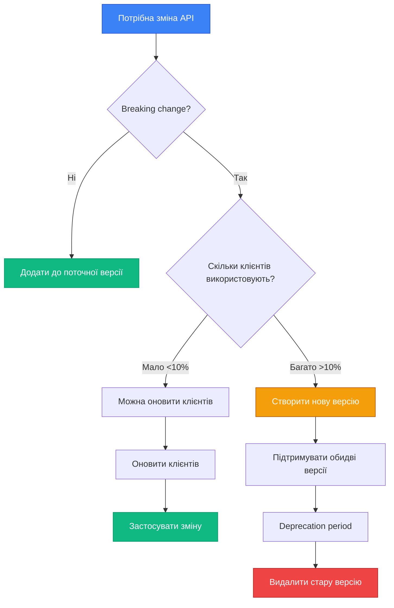

# Версіонування API

## Вступ: Еволюція без катастроф

Уявіть, що ви керуєте мобільним додатком з мільйоном користувачів. Ви випустили версію 1.0 рік тому, і тисячі користувачів досі використовують її, не оновлюючись. Тепер вам потрібно змінити структуру API — додати нові поля, перейменувати властивості, змінити логіку валідації. Якщо ви просто оновите API, старі версії додатка **перестануть працювати**. Користувачі побачать помилки, залишать негативні відгуки, а ваш бізнес втратить довіру.

Це класична проблема **breaking changes** — змін, що порушують сумісність з існуючими клієнтами. Рішення цієї проблеми — **API Versioning** (версіонування API) — практика підтримки **кількох версій API одночасно**, що дозволяє:

- **Еволюціонувати API** без порушення роботи існуючих клієнтів
- **Поступово мігрувати** клієнтів на нові версії
- **Підтримувати legacy-версії** протягом визначеного періоду
- **Комунікувати зміни** через чіткі версії та deprecation notices

Версіонування — це не технічна деталь, а **стратегічне рішення**, що впливає на архітектуру, документацію та життєвий цикл вашого API. Неправильний вибір стратегії може призвести до технічного боргу, складності підтримки та фрустрації розробників.

::note
**Передумови:** Ця стаття базується на знаннях з попередніх статей (01-03 Web API Controllers), а також на розумінні REST-принципів з курсу API Design (статті 01-06).
::

### Що ви створите в цій статті

Ми побудуємо **E-commerce API** з **трьома версіями**, що демонструють реальну еволюцію продукту:

**Версія 1.0** (2023) — базовий функціонал:
```json
{
  "id": 1,
  "name": "Laptop",
  "price": 1499.99
}
```

**Версія 2.0** (2024) — додано категорії та рейтинг:
```json
{
  "id": 1,
  "name": "Laptop",
  "price": 1499.99,
  "category": "Electronics",
  "rating": 4.5
}
```

**Версія 3.0** (2025) — breaking change (price → pricing object):
```json
{
  "id": 1,
  "name": "Laptop",
  "pricing": {
    "amount": 1499.99,
    "currency": "USD",
    "discount": 10
  },
  "category": "Electronics",
  "rating": 4.5
}
```

Ми реалізуємо **4 стратегії версіонування**:
1. **URL Path** — `/api/v1/products`, `/api/v2/products`
2. **Query String** — `/api/products?api-version=1.0`
3. **HTTP Header** — `X-Api-Version: 2.0`
4. **Media Type** — `Accept: application/vnd.myapi.v2+json`

До кінця статті ви зможете:

- Обирати стратегію версіонування для конкретного проєкту
- Використовувати пакет `Asp.Versioning.Mvc`
- Підтримувати кілька версій одночасно
- Реалізовувати deprecation flow
- Створювати migration guides для клієнтів

---

## Фундаментальні концепції: Чому версіонування необхідне

### Типи змін: Breaking vs Non-Breaking

Не всі зміни API вимагають нової версії. Розуміння різниці між **breaking** та **non-breaking** змінами критично важливе.


#### Breaking Changes (вимагають нової версії)

::card-group

::card{title="❌ Видалення полів" icon="i-lucide-trash-2"}
```json
// v1
{ "id": 1, "name": "Laptop", "oldField": "value" }

// v2 (breaking!)
{ "id": 1, "name": "Laptop" }
```
Клієнти, що очікують `oldField`, отримають помилку.
::

::card{title="❌ Перейменування полів" icon="i-lucide-pencil"}
```json
// v1
{ "productName": "Laptop" }

// v2 (breaking!)
{ "name": "Laptop" }
```
Клієнти шукатимуть `productName`, якого більше немає.
::

::card{title="❌ Зміна типу даних" icon="i-lucide-type"}
```json
// v1
{ "price": 1499.99 }

// v2 (breaking!)
{ "price": "1499.99 USD" }
```
Клієнти очікують число, отримують рядок.
::

::card{title="❌ Зміна структури" icon="i-lucide-git-branch"}
```json
// v1
{ "price": 1499.99 }

// v2 (breaking!)
{ "pricing": { "amount": 1499.99, "currency": "USD" } }
```
Повна зміна структури даних.
::

::card{title="❌ Зміна поведінки" icon="i-lucide-settings"}
```
// v1: POST створює і повертає 201
// v2: POST створює асинхронно і повертає 202
```
Клієнти очікують синхронну обробку.
::

::card{title="❌ Зміна валідації" icon="i-lucide-shield-alert"}
```
// v1: email опціональний
// v2: email обов'язковий
```
Старі запити без email стануть невалідними.
::

::

#### Non-Breaking Changes (не вимагають нової версії)

::card-group

::card{title="✅ Додавання нових полів" icon="i-lucide-plus"}
```json
// v1
{ "id": 1, "name": "Laptop" }

// v1.1 (non-breaking)
{ "id": 1, "name": "Laptop", "category": "Electronics" }
```
Клієнти ігнорують невідомі поля.
::

::card{title="✅ Додавання нових endpoints" icon="i-lucide-route"}
```
// v1
GET /api/products

// v1.1 (non-breaking)
GET /api/products
GET /api/products/search  ← новий endpoint
```
Існуючі endpoints не змінюються.
::

::card{title="✅ Розширення enum" icon="i-lucide-list"}
```json
// v1: status = "active" | "inactive"
// v1.1: status = "active" | "inactive" | "pending"
```
Якщо клієнт обробляє unknown values gracefully.
::

::card{title="✅ Пом'якшення валідації" icon="i-lucide-shield-check"}
```
// v1: email обов'язковий
// v1.1: email опціональний
```
Старі запити продовжують працювати.
::

::

::tip
**Правило Postel's Law:** "Be conservative in what you send, be liberal in what you accept" — API має бути строгим у відповідях (не змінювати структуру), але толерантним у запитах (приймати додаткові поля).
::

### Коли створювати нову версію?

::mermaid

::


---

## Стратегії версіонування: Порівняння підходів

Існує **4 основні стратегії** версіонування API, кожна з яких має свої переваги та недоліки.

### 1. URL Path Versioning

Версія вказується безпосередньо в URL-шляху:

```http
GET /api/v1/products
GET /api/v2/products
GET /api/v3/products
```

**Переваги:**
- ✅ **Найпростіша** для розуміння та використання
- ✅ **Явна** — версія видна в URL
- ✅ **Легко тестувати** через браузер або curl
- ✅ **Кешування** працює природно (різні URL = різні кеші)
- ✅ **Документація** проста (Swagger показує всі версії)

**Недоліки:**
- ❌ Порушує принцип REST (один ресурс = один URL)
- ❌ Дублювання коду контролерів
- ❌ Складніше підтримувати багато версій

**Коли використовувати:**
- Публічні API для зовнішніх розробників
- API з рідкими breaking changes (1-2 рази на рік)
- Коли простота важливіша за REST-чистоту

---

### 2. Query String Versioning

Версія передається як query-параметр:

```http
GET /api/products?api-version=1.0
GET /api/products?api-version=2.0
```

**Переваги:**
- ✅ **Один URL** для ресурсу (REST-friendly)
- ✅ **Легко додати** до існуючого API
- ✅ **Опціональна версія** (можна мати default)
- ✅ **Гнучкість** — можна комбінувати з іншими параметрами

**Недоліки:**
- ❌ Менш явна (легко забути вказати версію)
- ❌ **Кешування** складніше (query string впливає на кеш-ключ)
- ❌ Не всі клієнти зручно працюють з query params

**Коли використовувати:**
- Внутрішні API (мікросервіси)
- API з частими змінами версій
- Коли потрібна backward compatibility (default version)

---

### 3. HTTP Header Versioning

Версія передається через кастомний HTTP-заголовок:

```http
GET /api/products
X-Api-Version: 2.0
```

**Переваги:**
- ✅ **Чистий URL** (найбільш REST-friendly)
- ✅ **Не впливає на кешування** URL
- ✅ **Гнучкість** — можна додавати інші метадані
- ✅ **Приховує версію** від кінцевих користувачів

**Недоліки:**
- ❌ **Складніше тестувати** (потрібні інструменти для headers)
- ❌ Не видно в браузері
- ❌ Документація складніша
- ❌ Не всі клієнти підтримують кастомні headers

**Коли використовувати:**
- API для мобільних додатків
- B2B інтеграції
- Коли версія — це технічна деталь, а не частина бізнес-логіки

---

### 4. Media Type Versioning (Content Negotiation)

Версія вказується в `Accept` header через кастомний media type:

```http
GET /api/products
Accept: application/vnd.myapi.v2+json
```

**Переваги:**
- ✅ **Найбільш REST-friendly** (використовує стандартний механізм)
- ✅ **Семантично правильно** (версія = формат даних)
- ✅ **Гнучкість** — можна комбінувати з форматом (json/xml)
- ✅ **Професійний підхід** (використовується GitHub, Stripe)

**Недоліки:**
- ❌ **Найскладніша** для розуміння
- ❌ Складно тестувати та документувати
- ❌ Не всі розробники знайомі з цим підходом
- ❌ Вимагає розуміння Content Negotiation

**Коли використовувати:**
- Enterprise API з високими вимогами до REST
- API, що вже використовує Content Negotiation
- Коли версія тісно пов'язана з форматом даних

---

### Порівняльна таблиця стратегій

| Критерій | URL Path | Query String | HTTP Header | Media Type |
|----------|----------|--------------|-------------|------------|
| **Простота** | ⭐⭐⭐⭐⭐ | ⭐⭐⭐⭐ | ⭐⭐⭐ | ⭐⭐ |
| **REST-сумісність** | ⭐⭐ | ⭐⭐⭐ | ⭐⭐⭐⭐ | ⭐⭐⭐⭐⭐ |
| **Тестування** | ⭐⭐⭐⭐⭐ | ⭐⭐⭐⭐ | ⭐⭐⭐ | ⭐⭐ |
| **Документація** | ⭐⭐⭐⭐⭐ | ⭐⭐⭐⭐ | ⭐⭐⭐ | ⭐⭐ |
| **Кешування** | ⭐⭐⭐⭐⭐ | ⭐⭐⭐ | ⭐⭐⭐⭐ | ⭐⭐⭐⭐ |
| **Гнучкість** | ⭐⭐⭐ | ⭐⭐⭐⭐ | ⭐⭐⭐⭐⭐ | ⭐⭐⭐⭐⭐ |
| **Популярність** | 🥇 70% | 🥈 20% | 🥉 8% | 2% |

::tip
**Рекомендація:** Для більшості проєктів використовуйте **URL Path Versioning** — це найпростіший та найзрозуміліший підхід. Якщо ви будуєте enterprise API з високими вимогами до REST, розгляньте **Media Type Versioning**.
::


---

## Практична реалізація: E-commerce API з версіонуванням

Настав час створити реальний API з підтримкою кількох версій. Використаємо пакет **Asp.Versioning.Mvc** від Microsoft.

### Крок 1: Налаштування проєкту

::steps

### Створення проєкту та встановлення пакетів

::terminal-preview{title="bash"}
<div class="line"><span class="opacity-40">$</span> <strong class="font-bold">dotnet new webapi -n EcommerceApi</strong></div>
<div class="line"><span class="text-green-400 font-bold">The template "ASP.NET Core Web API" was created successfully.</span></div>
<div class="line"></div>
<div class="line"><span class="opacity-40">$</span> <strong class="font-bold">cd EcommerceApi</strong></div>
<div class="line"><span class="opacity-40">$</span> <strong class="font-bold">dotnet add package Asp.Versioning.Mvc</strong></div>
<div class="line"><span class="text-blue-400">info</span> : PackageReference for package 'Asp.Versioning.Mvc' version '8.0.0' added</div>
<div class="line"></div>
<div class="line"><span class="opacity-40">$</span> <strong class="font-bold">dotnet add package Asp.Versioning.Mvc.ApiExplorer</strong></div>
<div class="line"><span class="text-blue-400">info</span> : PackageReference for package 'Asp.Versioning.Mvc.ApiExplorer' version '8.0.0' added</div>
<div class="line"></div>
<div class="line"><span class="opacity-40">$</span> <strong class="font-bold">dotnet add package Microsoft.EntityFrameworkCore.InMemory</strong></div>
<div class="line"><span class="text-blue-400">info</span> : PackageReference added successfully</div>
::

### Створення моделей для різних версій

Створіть файл `Models/ProductModels.cs`:

```csharp
namespace EcommerceApi.Models;

// Базова модель (внутрішня, для БД)
public class Product
{
    public int Id { get; set; }
    public required string Name { get; set; }
    public decimal Price { get; set; }
    public string? Category { get; set; }
    public double Rating { get; set; }
    public string Currency { get; set; } = "USD";
    public decimal Discount { get; set; }
}

// DTO для версії 1.0 (2023)
public record ProductV1Dto
{
    public int Id { get; init; }
    public required string Name { get; init; }
    public decimal Price { get; init; }
}

// DTO для версії 2.0 (2024)
public record ProductV2Dto
{
    public int Id { get; init; }
    public required string Name { get; init; }
    public decimal Price { get; init; }
    public string? Category { get; init; }
    public double Rating { get; init; }
}

// DTO для версії 3.0 (2025) - breaking change
public record ProductV3Dto
{
    public int Id { get; init; }
    public required string Name { get; init; }
    public required PricingInfo Pricing { get; init; }
    public string? Category { get; init; }
    public double Rating { get; init; }
}

public record PricingInfo
{
    public decimal Amount { get; init; }
    public string Currency { get; init; } = "USD";
    public decimal Discount { get; init; }
}
```

### Створення DbContext

Створіть файл `Data/EcommerceDbContext.cs`:

```csharp
using Microsoft.EntityFrameworkCore;
using EcommerceApi.Models;

namespace EcommerceApi.Data;

public class EcommerceDbContext : DbContext
{
    public EcommerceDbContext(DbContextOptions<EcommerceDbContext> options) 
        : base(options)
    {
    }

    public DbSet<Product> Products => Set<Product>();

    protected override void OnModelCreating(ModelBuilder modelBuilder)
    {
        modelBuilder.Entity<Product>(entity =>
        {
            entity.HasKey(e => e.Id);
            entity.Property(e => e.Price).HasPrecision(18, 2);
            entity.Property(e => e.Discount).HasPrecision(5, 2);
            
            // Seed data
            entity.HasData(
                new Product 
                { 
                    Id = 1, 
                    Name = "Laptop Dell XPS 15", 
                    Price = 1499.99m,
                    Category = "Electronics",
                    Rating = 4.7,
                    Currency = "USD",
                    Discount = 10
                },
                new Product 
                { 
                    Id = 2, 
                    Name = "Wireless Mouse", 
                    Price = 29.99m,
                    Category = "Accessories",
                    Rating = 4.3,
                    Currency = "USD",
                    Discount = 0
                },
                new Product 
                { 
                    Id = 3, 
                    Name = "USB-C Hub", 
                    Price = 49.99m,
                    Category = "Accessories",
                    Rating = 4.5,
                    Currency = "USD",
                    Discount = 5
                }
            );
        });
    }
}
```

::


### Налаштування версіонування в Program.cs

```csharp
using Microsoft.EntityFrameworkCore;
using EcommerceApi.Data;
using Asp.Versioning;

var builder = WebApplication.CreateBuilder(args);

// Реєстрація DbContext
builder.Services.AddDbContext<EcommerceDbContext>(options =>
    options.UseInMemoryDatabase("EcommerceDb"));

// Налаштування API Versioning
builder.Services.AddApiVersioning(options =>
{
    // Версія за замовчуванням (якщо клієнт не вказав)
    options.DefaultApiVersion = new ApiVersion(1, 0);
    
    // Використовувати версію за замовчуванням, якщо не вказано
    options.AssumeDefaultVersionWhenUnspecified = true;
    
    // Повертати підтримувані версії у заголовках відповіді
    options.ReportApiVersions = true;
    
    // Стратегії читання версії (можна комбінувати!)
    options.ApiVersionReader = ApiVersionReader.Combine(
        new UrlSegmentApiVersionReader(),           // /api/v1/products
        new QueryStringApiVersionReader("api-version"), // ?api-version=1.0
        new HeaderApiVersionReader("X-Api-Version"),    // X-Api-Version: 2.0
        new MediaTypeApiVersionReader("version")        // Accept: application/json;version=3.0
    );
})
.AddApiExplorer(options =>
{
    // Формат версії у URL: 'v'major[.minor][-status]
    options.GroupNameFormat = "'v'VVV";
    
    // Замінювати {version} у маршрутах на фактичну версію
    options.SubstituteApiVersionInUrl = true;
});

builder.Services.AddControllers();
builder.Services.AddEndpointsApiExplorer();
builder.Services.AddSwaggerGen();

var app = builder.Build();

// Ініціалізація бази даних
using (var scope = app.Services.CreateScope())
{
    var db = scope.ServiceProvider.GetRequiredService<EcommerceDbContext>();
    db.Database.EnsureCreated();
}

if (app.Environment.IsDevelopment())
{
    app.UseSwagger();
    app.UseSwaggerUI();
}

app.UseHttpsRedirection();
app.UseAuthorization();
app.MapControllers();

app.Run();
```

**Декомпозиція налаштувань:**

1. **`DefaultApiVersion`** — версія, що використовується, якщо клієнт не вказав (зазвичай найстаріша стабільна)
2. **`AssumeDefaultVersionWhenUnspecified`** — якщо `true`, використовувати default версію; якщо `false` — повертати 400 Bad Request
3. **`ReportApiVersions`** — додає заголовки `api-supported-versions` та `api-deprecated-versions` у відповідь
4. **`ApiVersionReader.Combine()`** — дозволяє клієнту вказувати версію будь-яким способом (URL, query, header, media type)
5. **`GroupNameFormat`** — формат версії для Swagger UI (`v1`, `v2`, `v3`)
6. **`SubstituteApiVersionInUrl`** — замінює `{version:apiVersion}` у маршрутах на фактичну версію

::tip
**Комбінування стратегій:** Використання `ApiVersionReader.Combine()` дозволяє клієнтам вибирати зручний спосіб вказання версії. Це особливо корисно під час міграції між стратегіями.
::

---

### Крок 2: Створення контролерів для різних версій

Тепер створимо **три контролери** для трьох версій API.

#### Версія 1.0 (базова)

Створіть файл `Controllers/V1/ProductsV1Controller.cs`:

```csharp
using Microsoft.AspNetCore.Mvc;
using Microsoft.EntityFrameworkCore;
using EcommerceApi.Data;
using EcommerceApi.Models;
using Asp.Versioning;

namespace EcommerceApi.Controllers.V1;

[ApiController]
[Route("api/v{version:apiVersion}/products")]
[ApiVersion("1.0")]
public class ProductsV1Controller : ControllerBase
{
    private readonly EcommerceDbContext _db;
    private readonly ILogger<ProductsV1Controller> _logger;

    public ProductsV1Controller(EcommerceDbContext db, ILogger<ProductsV1Controller> logger)
    {
        _db = db;
        _logger = logger;
    }

    /// <summary>
    /// Отримати всі продукти (v1.0)
    /// </summary>
    [HttpGet]
    [ProducesResponseType(typeof(IEnumerable<ProductV1Dto>), StatusCodes.Status200OK)]
    public async Task<ActionResult<IEnumerable<ProductV1Dto>>> GetAll()
    {
        _logger.LogInformation("V1: Fetching all products");
        
        var products = await _db.Products.ToListAsync();
        
        var response = products.Select(p => new ProductV1Dto
        {
            Id = p.Id,
            Name = p.Name,
            Price = p.Price
        });
        
        return Ok(response);
    }

    /// <summary>
    /// Отримати продукт за ID (v1.0)
    /// </summary>
    [HttpGet("{id:int}")]
    [ProducesResponseType(typeof(ProductV1Dto), StatusCodes.Status200OK)]
    [ProducesResponseType(StatusCodes.Status404NotFound)]
    public async Task<ActionResult<ProductV1Dto>> GetById(int id)
    {
        var product = await _db.Products.FindAsync(id);
        
        if (product is null)
            return NotFound();
        
        var response = new ProductV1Dto
        {
            Id = product.Id,
            Name = product.Name,
            Price = product.Price
        };
        
        return response;
    }
}
```

**Ключові моменти:**

- `[ApiVersion("1.0")]` — вказує версію контролера
- `[Route("api/v{version:apiVersion}/products")]` — `{version:apiVersion}` автоматично замінюється на `v1`
- Повертаємо `ProductV1Dto` — спрощену версію без категорій та рейтингу


#### Версія 2.0 (додано категорії та рейтинг)

Створіть файл `Controllers/V2/ProductsV2Controller.cs`:

```csharp
using Microsoft.AspNetCore.Mvc;
using Microsoft.EntityFrameworkCore;
using EcommerceApi.Data;
using EcommerceApi.Models;
using Asp.Versioning;

namespace EcommerceApi.Controllers.V2;

[ApiController]
[Route("api/v{version:apiVersion}/products")]
[ApiVersion("2.0")]
public class ProductsV2Controller : ControllerBase
{
    private readonly EcommerceDbContext _db;
    private readonly ILogger<ProductsV2Controller> _logger;

    public ProductsV2Controller(EcommerceDbContext db, ILogger<ProductsV2Controller> logger)
    {
        _db = db;
        _logger = logger;
    }

    /// <summary>
    /// Отримати всі продукти (v2.0) - з категоріями та рейтингом
    /// </summary>
    [HttpGet]
    [ProducesResponseType(typeof(IEnumerable<ProductV2Dto>), StatusCodes.Status200OK)]
    public async Task<ActionResult<IEnumerable<ProductV2Dto>>> GetAll()
    {
        _logger.LogInformation("V2: Fetching all products with categories and ratings");
        
        var products = await _db.Products.ToListAsync();
        
        var response = products.Select(p => new ProductV2Dto
        {
            Id = p.Id,
            Name = p.Name,
            Price = p.Price,
            Category = p.Category,
            Rating = p.Rating
        });
        
        return Ok(response);
    }

    /// <summary>
    /// Отримати продукт за ID (v2.0)
    /// </summary>
    [HttpGet("{id:int}")]
    [ProducesResponseType(typeof(ProductV2Dto), StatusCodes.Status200OK)]
    [ProducesResponseType(StatusCodes.Status404NotFound)]
    public async Task<ActionResult<ProductV2Dto>> GetById(int id)
    {
        var product = await _db.Products.FindAsync(id);
        
        if (product is null)
            return NotFound();
        
        var response = new ProductV2Dto
        {
            Id = product.Id,
            Name = product.Name,
            Price = product.Price,
            Category = product.Category,
            Rating = product.Rating
        };
        
        return response;
    }

    /// <summary>
    /// Фільтрувати продукти за категорією (нова функція у v2.0)
    /// </summary>
    [HttpGet("by-category/{category}")]
    [ProducesResponseType(typeof(IEnumerable<ProductV2Dto>), StatusCodes.Status200OK)]
    public async Task<ActionResult<IEnumerable<ProductV2Dto>>> GetByCategory(string category)
    {
        var products = await _db.Products
            .Where(p => p.Category == category)
            .ToListAsync();
        
        var response = products.Select(p => new ProductV2Dto
        {
            Id = p.Id,
            Name = p.Name,
            Price = p.Price,
            Category = p.Category,
            Rating = p.Rating
        });
        
        return Ok(response);
    }
}
```

#### Версія 3.0 (breaking change — нова структура ціни)

Створіть файл `Controllers/V3/ProductsV3Controller.cs`:

```csharp
using Microsoft.AspNetCore.Mvc;
using Microsoft.EntityFrameworkCore;
using EcommerceApi.Data;
using EcommerceApi.Models;
using Asp.Versioning;

namespace EcommerceApi.Controllers.V3;

[ApiController]
[Route("api/v{version:apiVersion}/products")]
[ApiVersion("3.0")]
public class ProductsV3Controller : ControllerBase
{
    private readonly EcommerceDbContext _db;
    private readonly ILogger<ProductsV3Controller> _logger;

    public ProductsV3Controller(EcommerceDbContext db, ILogger<ProductsV3Controller> logger)
    {
        _db = db;
        _logger = logger;
    }

    /// <summary>
    /// Отримати всі продукти (v3.0) - з новою структурою ціни
    /// </summary>
    [HttpGet]
    [ProducesResponseType(typeof(IEnumerable<ProductV3Dto>), StatusCodes.Status200OK)]
    public async Task<ActionResult<IEnumerable<ProductV3Dto>>> GetAll()
    {
        _logger.LogInformation("V3: Fetching all products with new pricing structure");
        
        var products = await _db.Products.ToListAsync();
        
        var response = products.Select(MapToV3Dto);
        
        return Ok(response);
    }

    /// <summary>
    /// Отримати продукт за ID (v3.0)
    /// </summary>
    [HttpGet("{id:int}")]
    [ProducesResponseType(typeof(ProductV3Dto), StatusCodes.Status200OK)]
    [ProducesResponseType(StatusCodes.Status404NotFound)]
    public async Task<ActionResult<ProductV3Dto>> GetById(int id)
    {
        var product = await _db.Products.FindAsync(id);
        
        if (product is null)
            return NotFound();
        
        return MapToV3Dto(product);
    }

    /// <summary>
    /// Фільтрувати продукти за категорією (v3.0)
    /// </summary>
    [HttpGet("by-category/{category}")]
    [ProducesResponseType(typeof(IEnumerable<ProductV3Dto>), StatusCodes.Status200OK)]
    public async Task<ActionResult<IEnumerable<ProductV3Dto>>> GetByCategory(string category)
    {
        var products = await _db.Products
            .Where(p => p.Category == category)
            .ToListAsync();
        
        var response = products.Select(MapToV3Dto);
        
        return Ok(response);
    }

    // Допоміжний метод для маппінгу
    private static ProductV3Dto MapToV3Dto(Product product) => new()
    {
        Id = product.Id,
        Name = product.Name,
        Pricing = new PricingInfo
        {
            Amount = product.Price,
            Currency = product.Currency,
            Discount = product.Discount
        },
        Category = product.Category,
        Rating = product.Rating
    };
}
```

**Ключова відмінність v3.0:** Замість простого поля `price`, тепер використовується об'єкт `pricing` з детальною інформацією про валюту та знижку. Це **breaking change**, тому потрібна нова major версія.


---

### Крок 3: Тестування різних версій

Запустіть проєкт та протестуйте всі стратегії версіонування:

::terminal-preview{title="bash"}
<div class="line"><span class="opacity-40">$</span> <strong class="font-bold">dotnet run</strong></div>
<div class="line"><span class="text-green-400 font-bold">info</span>: Now listening on: https://localhost:5001</div>
<div class="line"></div>
<div class="line"><span class="opacity-40"># Стратегія 1: URL Path</span></div>
<div class="line"><span class="opacity-40">$</span> <strong class="font-bold">curl https://localhost:5001/api/v1/products/1</strong></div>
<div class="line"><span class="text-blue-400">{</span> <span class="text-green-400">"id"</span>: 1, <span class="text-green-400">"name"</span>: <span class="text-yellow-400">"Laptop"</span>, <span class="text-green-400">"price"</span>: 1499.99 <span class="text-blue-400">}</span></div>
<div class="line"></div>
<div class="line"><span class="opacity-40">$</span> <strong class="font-bold">curl https://localhost:5001/api/v2/products/1</strong></div>
<div class="line"><span class="text-blue-400">{</span> <span class="text-green-400">"id"</span>: 1, <span class="text-green-400">"category"</span>: <span class="text-yellow-400">"Electronics"</span>, <span class="text-green-400">"rating"</span>: 4.7 <span class="text-blue-400">}</span></div>
<div class="line"></div>
<div class="line"><span class="opacity-40"># Стратегія 2: Query String</span></div>
<div class="line"><span class="opacity-40">$</span> <strong class="font-bold">curl "https://localhost:5001/api/v1/products/1?api-version=2.0"</strong></div>
<div class="line"><span class="text-blue-400">{</span> <span class="text-green-400">"id"</span>: 1, <span class="text-green-400">"category"</span>: <span class="text-yellow-400">"Electronics"</span> <span class="text-blue-400">}</span></div>
<div class="line"></div>
<div class="line"><span class="opacity-40"># Стратегія 3: HTTP Header</span></div>
<div class="line"><span class="opacity-40">$</span> <strong class="font-bold">curl -H "X-Api-Version: 3.0" https://localhost:5001/api/v1/products/1</strong></div>
<div class="line"><span class="text-blue-400">{</span> <span class="text-green-400">"pricing"</span>: <span class="text-blue-400">{</span> <span class="text-green-400">"amount"</span>: 1499.99, <span class="text-green-400">"currency"</span>: <span class="text-yellow-400">"USD"</span> <span class="text-blue-400">}</span> <span class="text-blue-400">}</span></div>
<div class="line"></div>
<div class="line"><span class="opacity-40"># Перевірка підтримуваних версій</span></div>
<div class="line"><span class="opacity-40">$</span> <strong class="font-bold">curl -I https://localhost:5001/api/v1/products</strong></div>
<div class="line">HTTP/1.1 200 OK</div>
<div class="line"><span class="text-blue-400 font-bold">api-supported-versions: 1.0, 2.0, 3.0</span></div>
::

::note
**Заголовок `api-supported-versions`:** Завдяки `ReportApiVersions = true`, кожна відповідь містить інформацію про всі підтримувані версії. Це допомагає клієнтам виявляти доступні версії.
::

---

## Deprecation Flow: Виведення версій з експлуатації

Підтримка всіх версій назавжди неможлива. Потрібен **процес виведення з експлуатації** (deprecation) старих версій.

### Крок 1: Позначення версії як deprecated

```csharp
[ApiController]
[Route("api/v{version:apiVersion}/products")]
[ApiVersion("1.0", Deprecated = true)] // Позначаємо як deprecated
[ApiVersion("2.0")] // Поточна стабільна версія
public class ProductsV1Controller : ControllerBase
{
    // ...
}
```

Тепер відповіді v1.0 містять заголовок:

```http
HTTP/1.1 200 OK
api-supported-versions: 1.0, 2.0, 3.0
api-deprecated-versions: 1.0
```

### Крок 2: Додавання Sunset header

Вкажіть **дату видалення** версії через кастомний middleware:

```csharp
// Middleware для додавання Sunset header
public class DeprecationMiddleware
{
    private readonly RequestDelegate _next;

    public DeprecationMiddleware(RequestDelegate next)
    {
        _next = next;
    }

    public async Task InvokeAsync(HttpContext context)
    {
        await _next(context);

        // Якщо використана deprecated версія
        if (context.Response.Headers.ContainsKey("api-deprecated-versions"))
        {
            var deprecatedVersions = context.Response.Headers["api-deprecated-versions"].ToString();
            
            if (deprecatedVersions.Contains("1.0"))
            {
                // Sunset header (RFC 8594) - дата видалення
                context.Response.Headers.Append("Sunset", "Sat, 31 Dec 2024 23:59:59 GMT");
                
                // Link на migration guide
                context.Response.Headers.Append("Link", 
                    "</docs/migration/v1-to-v2>; rel=\"deprecation\"; type=\"text/html\"");
                
                // Кастомне повідомлення
                context.Response.Headers.Append("X-Api-Warn", 
                    "API v1.0 is deprecated and will be removed on 2024-12-31. Please migrate to v2.0.");
            }
        }
    }
}

// Реєстрація у Program.cs
app.UseMiddleware<DeprecationMiddleware>();
```

### Крок 3: Створення Migration Guide

Створіть документ `docs/migration/v1-to-v2.md`:

```markdown
# Migration Guide: v1.0 → v2.0

## Зміни

### Додані поля (non-breaking)

- `category` (string, nullable) — категорія продукту
- `rating` (number) — рейтинг від 0 до 5

### Приклад

**v1.0:**
```json
{
  "id": 1,
  "name": "Laptop",
  "price": 1499.99
}
```

**v2.0:**
```json
{
  "id": 1,
  "name": "Laptop",
  "price": 1499.99,
  "category": "Electronics",
  "rating": 4.7
}
```

## Кроки міграції

1. Оновіть клієнтський код для обробки нових полів
2. Змініть URL з `/api/v1/products` на `/api/v2/products`
3. Протестуйте на staging-середовищі
4. Розгорніть на production

## Зворотна сумісність

v2.0 повністю зворотно сумісна з v1.0. Нові поля опціональні.
```

### Крок 4: Видалення старої версії

Після закінчення deprecation period (зазвичай 6-12 місяців):

1. Видаліть контролер `ProductsV1Controller`
2. Видаліть DTO `ProductV1Dto`
3. Оновіть документацію
4. Повідомте клієнтів через email/блог
```

---

## Просунуті техніки версіонування

### MapToApiVersion: Різні версії в одному контролері

Замість створення окремих контролерів для кожної версії, можна використовувати `[MapToApiVersion]`:

```csharp
[ApiController]
[Route("api/v{version:apiVersion}/products")]
[ApiVersion("1.0")]
[ApiVersion("2.0")]
public class ProductsController : ControllerBase
{
    // Метод для v1.0
    [HttpGet]
    [MapToApiVersion("1.0")]
    public async Task<ActionResult<IEnumerable<ProductV1Dto>>> GetAllV1()
    {
        // Логіка для v1.0
    }

    // Метод для v2.0
    [HttpGet]
    [MapToApiVersion("2.0")]
    public async Task<ActionResult<IEnumerable<ProductV2Dto>>> GetAllV2()
    {
        // Логіка для v2.0
    }

    // Спільний метод для обох версій
    [HttpGet("{id}")]
    public async Task<IActionResult> GetById(int id, ApiVersion version)
    {
        var product = await _db.Products.FindAsync(id);
        if (product is null) return NotFound();

        // Повертаємо різні DTO залежно від версії
        return version.MajorVersion switch
        {
            1 => Ok(new ProductV1Dto { /* ... */ }),
            2 => Ok(new ProductV2Dto { /* ... */ }),
            _ => StatusCode(406)
        };
    }
}
```

**Коли використовувати:**
- Невеликі відмінності між версіями
- Спільна бізнес-логіка
- Хочете уникнути дублювання коду

**Коли НЕ використовувати:**
- Великі відмінності між версіями
- Різна бізнес-логіка
- Контролер стає занадто складним

### Version Neutral Endpoints

Деякі endpoints не потребують версіонування (health checks, metrics):

```csharp
[ApiController]
[Route("api/health")]
[ApiVersionNeutral] // Доступний для всіх версій
public class HealthController : ControllerBase
{
    [HttpGet]
    public IActionResult Check()
    {
        return Ok(new { status = "healthy", timestamp = DateTime.UtcNow });
    }
}
```

### Version Ranges

Підтримка діапазону версій:

```csharp
[ApiVersion("1.0")]
[ApiVersion("1.1")]
[ApiVersion("2.0")]
public class ProductsController : ControllerBase
{
    // Доступний для v1.0, v1.1, v2.0
    [HttpGet]
    public async Task<IActionResult> GetAll()
    {
        // ...
    }

    // Доступний тільки для v2.0
    [HttpGet("advanced")]
    [MapToApiVersion("2.0")]
    public async Task<IActionResult> GetAdvanced()
    {
        // ...
    }
}
```

---

## Best Practices версіонування

::card-group

::card{title="✅ Семантичне версіонування" icon="i-lucide-git-branch"}
Використовуйте **SemVer** (Semantic Versioning):
- **Major** (1.0 → 2.0): Breaking changes
- **Minor** (1.0 → 1.1): Нові функції (backward compatible)
- **Patch** (1.0.0 → 1.0.1): Bug fixes

Для API зазвичай достатньо Major.Minor.
::

::card{title="✅ Документуйте зміни" icon="i-lucide-file-text"}
Для кожної версії створюйте:
- **Changelog** — що змінилося
- **Migration Guide** — як мігрувати
- **Breaking Changes** — список несумісних змін
- **Deprecation Notice** — що буде видалено
::

::card{title="✅ Deprecation Period" icon="i-lucide-clock"}
Встановіть чіткий термін підтримки:
- **Мінімум 6 місяців** для публічних API
- **3-6 місяців** для внутрішніх API
- **Попереджайте за 3 місяці** до видалення
::

::card{title="✅ Backward Compatibility" icon="i-lucide-shield-check"}
Намагайтеся уникати breaking changes:
- Додавайте нові поля замість зміни існуючих
- Робіть поля опціональними
- Використовуйте default values
- Підтримуйте старі назви через aliases
::

::card{title="✅ Версіонуйте контракт, не код" icon="i-lucide-file-code"}
Версія — це контракт з клієнтом:
- Різні версії можуть використовувати спільний код
- Не дублюйте бізнес-логіку
- Версіонуйте тільки DTO та endpoints
::

::card{title="✅ Тестуйте всі версії" icon="i-lucide-flask-conical"}
Кожна версія має свої тести:
- Integration tests для кожної версії
- Contract tests (Pact, Spring Cloud Contract)
- Backward compatibility tests
::

::

---

## Практичні завдання

### Рівень 1: Базове розуміння

::steps

### Завдання 1.1: Класифікація змін

Визначте, чи є наступні зміни breaking чи non-breaking:

1. Додавання нового поля `description` до Product
2. Перейменування поля `name` на `productName`
3. Зміна типу `price` з `number` на `string`
4. Додавання нового endpoint `GET /api/products/search`
5. Зміна валідації: `email` стає обов'язковим

::collapsible{title="Показати відповіді"}

1. **Non-breaking** — клієнти ігнорують невідомі поля
2. **Breaking** — клієнти шукатимуть `name`, якого більше немає
3. **Breaking** — клієнти очікують число, отримають рядок
4. **Non-breaking** — новий endpoint не впливає на існуючі
5. **Breaking** — старі запити без email стануть невалідними

::

### Завдання 1.2: Вибір стратегії

Для кожного сценарію оберіть найкращу стратегію версіонування:

1. Публічний API для мобільного додатку (1M користувачів)
2. Внутрішній API між мікросервісами
3. API для B2B партнерів (10 компаній)
4. REST API для веб-додатку (SPA)

::collapsible{title="Показати рекомендації"}

1. **URL Path** — найпростіше для мобільних розробників, легко тестувати
2. **Query String** або **Header** — гнучкість для внутрішніх систем
3. **URL Path** — явність та простота для партнерів
4. **URL Path** або **Query String** — залежить від архітектури фронтенду

::

::

---

### Рівень 2: Логіка та розширення

::steps

### Завдання 2.1: Реалізація версіонування через Header

Змініть проєкт так, щоб версія читалася **тільки** з header `X-Api-Version`:

::collapsible{title="Показати рішення"}

```csharp
builder.Services.AddApiVersioning(options =>
{
    options.DefaultApiVersion = new ApiVersion(1, 0);
    options.AssumeDefaultVersionWhenUnspecified = true;
    options.ReportApiVersions = true;
    
    // Тільки header versioning
    options.ApiVersionReader = new HeaderApiVersionReader("X-Api-Version");
});
```

Оновіть маршрути контролерів:

```csharp
[Route("api/products")] // Без {version}
[ApiVersion("1.0")]
public class ProductsV1Controller : ControllerBase
{
    // ...
}
```

Тестування:
```bash
curl -H "X-Api-Version: 1.0" https://localhost:5001/api/products
curl -H "X-Api-Version: 2.0" https://localhost:5001/api/products
```
::

### Завдання 2.2: Автоматичний маппінг версій

Створіть generic метод для автоматичного маппінгу між версіями DTO:

```csharp
public static TTarget MapVersion<TSource, TTarget>(TSource source)
{
    // Реалізуйте автоматичний маппінг через рефлексію
}
```

::collapsible{title="Показати підхід"}

```csharp
using System.Reflection;

public static class VersionMapper
{
    public static TTarget MapVersion<TSource, TTarget>(TSource source) 
        where TTarget : new()
    {
        var target = new TTarget();
        var sourceProps = typeof(TSource).GetProperties();
        var targetProps = typeof(TTarget).GetProperties();

        foreach (var targetProp in targetProps)
        {
            var sourceProp = sourceProps.FirstOrDefault(p => 
                p.Name == targetProp.Name && 
                p.PropertyType == targetProp.PropertyType);

            if (sourceProp != null)
            {
                var value = sourceProp.GetValue(source);
                targetProp.SetValue(target, value);
            }
        }

        return target;
    }
}

// Використання
var v1Dto = VersionMapper.MapVersion<Product, ProductV1Dto>(product);
var v2Dto = VersionMapper.MapVersion<Product, ProductV2Dto>(product);
```

::note
У production використовуйте **AutoMapper** або **Mapster** замість ручної рефлексії.
::

::

::

---

### Рівень 3: Архітектура та створення

::steps

### Завдання 3.1: Версіонування з Swagger UI

Налаштуйте Swagger UI для відображення **окремих документів** для кожної версії:

::collapsible{title="Показати рішення"}

```csharp
using Asp.Versioning.ApiExplorer;

var builder = WebApplication.CreateBuilder(args);

// ... (налаштування API Versioning)

builder.Services.AddSwaggerGen(options =>
{
    var provider = builder.Services.BuildServiceProvider()
        .GetRequiredService<IApiVersionDescriptionProvider>();

    // Створюємо документ для кожної версії
    foreach (var description in provider.ApiVersionDescriptions)
    {
        options.SwaggerDoc(
            description.GroupName,
            new Microsoft.OpenApi.Models.OpenApiInfo
            {
                Title = $"E-commerce API {description.ApiVersion}",
                Version = description.ApiVersion.ToString(),
                Description = description.IsDeprecated 
                    ? "⚠️ This version is deprecated" 
                    : "Current version"
            });
    }
});

var app = builder.Build();

if (app.Environment.IsDevelopment())
{
    app.UseSwagger();
    app.UseSwaggerUI(options =>
    {
        var provider = app.Services.GetRequiredService<IApiVersionDescriptionProvider>();

        // Dropdown для вибору версії
        foreach (var description in provider.ApiVersionDescriptions)
        {
            options.SwaggerEndpoint(
                $"/swagger/{description.GroupName}/swagger.json",
                description.GroupName.ToUpperInvariant());
        }
    });
}
```

Результат: Swagger UI з dropdown "Select a definition" → v1, v2, v3
::

::


---

## Підсумок

У цій статті ми опанували мистецтво версіонування API — критично важливу практику для еволюції сервісів без порушення роботи існуючих клієнтів. Ви навчилися не просто додавати версії до URL, а **стратегічно керувати життєвим циклом API**.

**Ключові висновки:**

1. **Версіонування — це необхідність:** Будь-який API, що живе довше 6 місяців, потребуватиме змін. Версіонування дозволяє еволюціонувати без катастроф.

2. **Breaking vs Non-Breaking:** Розуміння різниці між цими типами змін визначає, коли потрібна нова версія. Додавання полів — non-breaking, видалення або перейменування — breaking.

3. **URL Path — найпопулярніший:** 70% API використовують версіонування через URL (`/api/v1/products`) через простоту та явність. Це найкращий вибір для більшості проєктів.

4. **Asp.Versioning.Mvc — потужний інструмент:** Пакет від Microsoft надає гнучкі можливості версіонування з підтримкою всіх стратегій одночасно.

5. **Deprecation Flow — обов'язковий:** Позначайте старі версії як deprecated, додавайте Sunset header, створюйте migration guides та дотримуйтесь deprecation period (мінімум 6 місяців).

6. **Документація критична:** Кожна версія має мати changelog, migration guide та чітко задокументовані breaking changes.

У наступній статті ми розглянемо **ProblemDetails та структуровану обробку помилок** — як повертати консистентні та інформативні помилки згідно з RFC 9457.

---

## Додаткові ресурси

::card-group

::card{title="Asp.Versioning.Mvc" icon="i-lucide-book-open" to="https://github.com/dotnet/aspnet-api-versioning" target="_blank"}
Офіційний репозиторій пакету версіонування
::

::card{title="API Versioning Guide" icon="i-lucide-git-branch" to="https://learn.microsoft.com/en-us/aspnet/core/web-api/advanced/versioning" target="_blank"}
Microsoft Docs: Версіонування Web API
::

::card{title="Semantic Versioning" icon="i-lucide-tag" to="https://semver.org/" target="_blank"}
Специфікація SemVer 2.0.0
::

::card{title="RFC 8594 (Sunset Header)" icon="i-lucide-calendar-x" to="https://www.rfc-editor.org/rfc/rfc8594.html" target="_blank"}
Стандарт для deprecation notices
::

::

---

::note
**Наступна стаття:** [ProblemDetails та структурована обробка помилок](/csharp/aspnet/web-api/problemdetails-error-handling) — реалізація RFC 9457, глобальні exception handlers та кастомні error codes.
::
