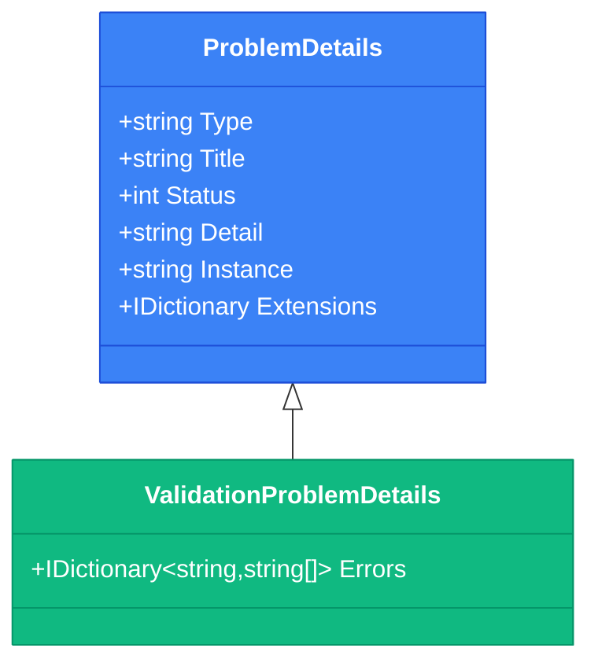

# ProblemDetails та структурована обробка помилок

## Вступ: Мова помилок

Уявіть, що ви розробляєте мобільний додаток, який інтегрується з вашим API. Все працює чудово, поки користувач не вводить невалідні дані або не намагається отримати доступ до неіснуючого ресурсу. API повертає помилку, але що саме пішло не так? Як показати користувачу зрозуміле повідомлення? Як залогувати помилку для debugging?

Якщо ваш API повертає помилки у **різних форматах**, клієнтський код перетворюється на кошмар:

```typescript
// Кошмар клієнтського коду
try {
  const response = await api.getProduct(id);
} catch (error) {
  // Що тут? Рядок? Об'єкт? Масив?
  if (typeof error === 'string') {
    showError(error);
  } else if (error.message) {
    showError(error.message);
  } else if (error.errors) {
    showValidationErrors(error.errors);
  } else if (error.error_description) {
    showError(error.error_description);
  } else {
    showError('Unknown error');
  }
}
```

Рішення цієї проблеми — **ProblemDetails** (RFC 9457) — стандартизований формат для представлення помилок у HTTP API. Це не просто технічна специфікація, а **мова спілкування** між сервером та клієнтом про те, що пішло не так.

::note
**Передумови:** Ця стаття базується на знаннях з попередніх статей (01-04 Web API Controllers), а також на розумінні HTTP-кодів з курсу API Design (стаття 05).
::

### Що ви створите в цій статті

Ми побудуємо **Banking API** з **професійною системою обробки помилок**:

**Стандартна помилка (404):**
```json
{
  "type": "https://api.bank.com/errors/account-not-found",
  "title": "Account Not Found",
  "status": 404,
  "detail": "Account with ID 12345 does not exist",
  "instance": "/api/accounts/12345",
  "traceId": "00-a1b2c3d4e5f6-7890abcdef-00"
}
```

**Валідаційна помилка (400):**
```json
{
  "type": "https://tools.ietf.org/html/rfc9457#section-3.1",
  "title": "One or more validation errors occurred",
  "status": 400,
  "errors": {
    "amount": ["Amount must be greater than 0"],
    "accountNumber": ["Invalid account number format"]
  },
  "traceId": "00-xyz123-456-00"
}
```

**Бізнес-помилка (409):**
```json
{
  "type": "https://api.bank.com/errors/insufficient-funds",
  "title": "Insufficient Funds",
  "status": 409,
  "detail": "Account balance (100.00 USD) is insufficient for transaction (150.00 USD)",
  "balance": 100.00,
  "requiredAmount": 150.00,
  "traceId": "00-abc789-def-00"
}
```

До кінця статті ви зможете:

- Реалізовувати RFC 9457 у ASP.NET Core
- Створювати глобальні exception handlers
- Використовувати `IExceptionHandler` (.NET 8+)
- Додавати кастомні поля до ProblemDetails
- Реалізовувати traceability через correlation IDs
- Обробляти різні типи помилок консистентно

---

## Фундаментальні концепції: RFC 9457 ProblemDetails

### Структура ProblemDetails

RFC 9457 визначає **стандартний формат** для представлення помилок у JSON:


```json
{
  "type": "https://example.com/errors/out-of-credit",
  "title": "You do not have enough credit",
  "status": 403,
  "detail": "Your current balance is 30, but that costs 50",
  "instance": "/account/12345/transactions/abc"
}
```

**Обов'язкові поля:**

| Поле | Тип | Опис |
|------|-----|------|
| `type` | string (URI) | Унікальний ідентифікатор типу помилки. За замовчуванням: `about:blank` |
| `title` | string | Коротке, зрозуміле людині резюме проблеми |
| `status` | number | HTTP-код статусу (дублює код відповіді) |

**Опціональні поля:**

| Поле | Тип | Опис |
|------|-----|------|
| `detail` | string | Детальне пояснення конкретного випадку помилки |
| `instance` | string (URI) | URI, що ідентифікує конкретний випадок проблеми |

**Кастомні поля:**

RFC дозволяє додавати **будь-які додаткові поля** для специфічного контексту:

```json
{
  "type": "https://api.bank.com/errors/insufficient-funds",
  "title": "Insufficient Funds",
  "status": 409,
  "detail": "Account balance is insufficient",
  "balance": 100.00,           // Кастомне поле
  "requiredAmount": 150.00,    // Кастомне поле
  "currency": "USD",           // Кастомне поле
  "traceId": "00-abc123-def"   // Кастомне поле
}
```

### Чому ProblemDetails важливий?

::card-group

::card{title="✅ Консистентність" icon="i-lucide-check-circle"}
Всі помилки мають однакову структуру. Клієнт пише обробку помилок **один раз** для всього API.
::

::card{title="✅ Машиночитаність" icon="i-lucide-cpu"}
Поле `type` дозволяє клієнту **програмно** визначити тип помилки та відреагувати відповідно.
::

::card{title="✅ Людиночитаність" icon="i-lucide-user"}
Поля `title` та `detail` надають зрозумілі повідомлення для розробників та користувачів.
::

::card{title="✅ Розширюваність" icon="i-lucide-puzzle"}
Можна додавати кастомні поля для специфічного контексту без порушення стандарту.
::

::card{title="✅ Стандартизація" icon="i-lucide-globe"}
RFC 9457 — це **міжнародний стандарт**, підтримуваний багатьма фреймворками та бібліотеками.
::

::card{title="✅ Debugging" icon="i-lucide-bug"}
Поле `instance` та кастомні поля (traceId) полегшують відстеження помилок у логах.
::

::

### ProblemDetails vs ValidationProblemDetails

ASP.NET Core надає **два типи** ProblemDetails:

**`ProblemDetails`** — для загальних помилок:

```csharp
public class ProblemDetails
{
    public string? Type { get; set; }
    public string? Title { get; set; }
    public int? Status { get; set; }
    public string? Detail { get; set; }
    public string? Instance { get; set; }
    public IDictionary<string, object?> Extensions { get; set; }
}
```

**`ValidationProblemDetails`** — для валідаційних помилок (успадковується від `ProblemDetails`):

```csharp
public class ValidationProblemDetails : ProblemDetails
{
    public IDictionary<string, string[]> Errors { get; set; }
}
```

Приклад `ValidationProblemDetails`:

```json
{
  "type": "https://tools.ietf.org/html/rfc9457#section-3.1",
  "title": "One or more validation errors occurred",
  "status": 400,
  "errors": {
    "email": ["Email is required", "Email format is invalid"],
    "age": ["Age must be between 18 and 120"]
  }
}
```

::mermaid

::


---

## Практична реалізація: Banking API з професійною обробкою помилок

Створимо реальний API з **глобальною системою обробки помилок**.

### Крок 1: Налаштування проєкту

::steps

### Створення проєкту

::terminal-preview{title="bash"}
<div class="line"><span class="opacity-40">$</span> <strong class="font-bold">dotnet new webapi -n BankingApi</strong></div>
<div class="line"><span class="text-green-400 font-bold">The template "ASP.NET Core Web API" was created successfully.</span></div>
<div class="line"></div>
<div class="line"><span class="opacity-40">$</span> <strong class="font-bold">cd BankingApi</strong></div>
<div class="line"><span class="opacity-40">$</span> <strong class="font-bold">dotnet add package Microsoft.EntityFrameworkCore.InMemory</strong></div>
<div class="line"><span class="text-blue-400">info</span> : PackageReference added successfully</div>
::

### Створення кастомних винятків

Створіть файл `Exceptions/BankingExceptions.cs`:

```csharp
namespace BankingApi.Exceptions;

// Базовий клас для бізнес-винятків
public abstract class BusinessException : Exception
{
    public int StatusCode { get; }
    public string ErrorType { get; }

    protected BusinessException(
        string message, 
        int statusCode, 
        string errorType) 
        : base(message)
    {
        StatusCode = statusCode;
        ErrorType = errorType;
    }
}

// 404 Not Found
public class AccountNotFoundException : BusinessException
{
    public string AccountId { get; }

    public AccountNotFoundException(string accountId)
        : base(
            $"Account with ID '{accountId}' does not exist",
            StatusCodes.Status404NotFound,
            "account-not-found")
    {
        AccountId = accountId;
    }
}

// 409 Conflict - Insufficient Funds
public class InsufficientFundsException : BusinessException
{
    public decimal Balance { get; }
    public decimal RequiredAmount { get; }
    public string Currency { get; }

    public InsufficientFundsException(
        decimal balance, 
        decimal requiredAmount, 
        string currency = "USD")
        : base(
            $"Account balance ({balance:F2} {currency}) is insufficient for transaction ({requiredAmount:F2} {currency})",
            StatusCodes.Status409Conflict,
            "insufficient-funds")
    {
        Balance = balance;
        RequiredAmount = requiredAmount;
        Currency = currency;
    }
}

// 409 Conflict - Account Locked
public class AccountLockedException : BusinessException
{
    public string Reason { get; }
    public DateTime? UnlockedAt { get; }

    public AccountLockedException(string reason, DateTime? unlockedAt = null)
        : base(
            $"Account is locked: {reason}",
            StatusCodes.Status409Conflict,
            "account-locked")
    {
        Reason = reason;
        UnlockedAt = unlockedAt;
    }
}

// 400 Bad Request - Invalid Transaction
public class InvalidTransactionException : BusinessException
{
    public string ValidationError { get; }

    public InvalidTransactionException(string validationError)
        : base(
            $"Transaction is invalid: {validationError}",
            StatusCodes.Status400BadRequest,
            "invalid-transaction")
    {
        ValidationError = validationError;
    }
}
```

**Декомпозиція:**

1. **`BusinessException`** — базовий клас для всіх бізнес-винятків з `StatusCode` та `ErrorType`
2. **Спеціалізовані винятки** — кожен тип помилки має свій клас з релевантними властивостями
3. **Кастомні властивості** — `Balance`, `RequiredAmount`, `Reason` тощо для додаткового контексту

### Створення моделей

Створіть файл `Models/Account.cs`:

```csharp
using System.ComponentModel.DataAnnotations;

namespace BankingApi.Models;

public class Account
{
    public int Id { get; set; }
    
    [Required]
    [MaxLength(20)]
    public required string AccountNumber { get; set; }
    
    [Required]
    [MaxLength(100)]
    public required string OwnerName { get; set; }
    
    [Range(0, double.MaxValue)]
    public decimal Balance { get; set; }
    
    [MaxLength(3)]
    public string Currency { get; set; } = "USD";
    
    public bool IsLocked { get; set; }
    
    public string? LockReason { get; set; }
    
    public DateTime CreatedAt { get; set; } = DateTime.UtcNow;
}

public record TransferRequest
{
    [Required(ErrorMessage = "Source account is required")]
    public required string FromAccountNumber { get; init; }
    
    [Required(ErrorMessage = "Destination account is required")]
    public required string ToAccountNumber { get; init; }
    
    [Range(0.01, 1_000_000, ErrorMessage = "Amount must be between 0.01 and 1,000,000")]
    public decimal Amount { get; init; }
    
    [MaxLength(200)]
    public string? Description { get; init; }
}
```

::


---

### Крок 2: Створення Global Exception Handler (.NET 8+)

.NET 8 представив новий інтерфейс `IExceptionHandler` для централізованої обробки помилок.

Створіть файл `Handlers/GlobalExceptionHandler.cs`:

```csharp
using Microsoft.AspNetCore.Diagnostics;
using Microsoft.AspNetCore.Mvc;
using BankingApi.Exceptions;
using System.Diagnostics;

namespace BankingApi.Handlers;

public class GlobalExceptionHandler : IExceptionHandler
{
    private readonly ILogger<GlobalExceptionHandler> _logger;
    private readonly IHostEnvironment _environment;

    public GlobalExceptionHandler(
        ILogger<GlobalExceptionHandler> logger,
        IHostEnvironment environment)
    {
        _logger = logger;
        _environment = environment;
    }

    public async ValueTask<bool> TryHandleAsync(
        HttpContext httpContext,
        Exception exception,
        CancellationToken cancellationToken)
    {
        var traceId = Activity.Current?.Id ?? httpContext.TraceIdentifier;

        _logger.LogError(
            exception,
            "Exception occurred: {Message}. TraceId: {TraceId}",
            exception.Message,
            traceId);

        var problemDetails = exception switch
        {
            // Бізнес-винятки
            BusinessException businessEx => CreateBusinessProblemDetails(
                businessEx, 
                httpContext, 
                traceId),

            // Валідаційні помилки (не повинні потрапляти сюди через [ApiController])
            ValidationException validationEx => CreateValidationProblemDetails(
                validationEx, 
                httpContext, 
                traceId),

            // Необроблені винятки
            _ => CreateGenericProblemDetails(
                exception, 
                httpContext, 
                traceId)
        };

        httpContext.Response.StatusCode = problemDetails.Status ?? 500;
        httpContext.Response.ContentType = "application/problem+json";

        await httpContext.Response.WriteAsJsonAsync(problemDetails, cancellationToken);

        return true; // Exception handled
    }

    private ProblemDetails CreateBusinessProblemDetails(
        BusinessException exception,
        HttpContext context,
        string traceId)
    {
        var problemDetails = new ProblemDetails
        {
            Type = $"https://api.bank.com/errors/{exception.ErrorType}",
            Title = exception.GetType().Name.Replace("Exception", ""),
            Status = exception.StatusCode,
            Detail = exception.Message,
            Instance = context.Request.Path
        };

        // Додаємо traceId для debugging
        problemDetails.Extensions["traceId"] = traceId;

        // Додаємо кастомні властивості залежно від типу винятку
        switch (exception)
        {
            case InsufficientFundsException insufficientFunds:
                problemDetails.Extensions["balance"] = insufficientFunds.Balance;
                problemDetails.Extensions["requiredAmount"] = insufficientFunds.RequiredAmount;
                problemDetails.Extensions["currency"] = insufficientFunds.Currency;
                break;

            case AccountLockedException accountLocked:
                problemDetails.Extensions["reason"] = accountLocked.Reason;
                if (accountLocked.UnlockedAt.HasValue)
                {
                    problemDetails.Extensions["unlockedAt"] = accountLocked.UnlockedAt.Value;
                }
                break;

            case AccountNotFoundException accountNotFound:
                problemDetails.Extensions["accountId"] = accountNotFound.AccountId;
                break;
        }

        return problemDetails;
    }

    private ValidationProblemDetails CreateValidationProblemDetails(
        ValidationException exception,
        HttpContext context,
        string traceId)
    {
        var problemDetails = new ValidationProblemDetails
        {
            Type = "https://tools.ietf.org/html/rfc9457#section-3.1",
            Title = "One or more validation errors occurred",
            Status = StatusCodes.Status400BadRequest,
            Detail = exception.Message,
            Instance = context.Request.Path
        };

        problemDetails.Extensions["traceId"] = traceId;

        return problemDetails;
    }

    private ProblemDetails CreateGenericProblemDetails(
        Exception exception,
        HttpContext context,
        string traceId)
    {
        var problemDetails = new ProblemDetails
        {
            Type = "https://tools.ietf.org/html/rfc9457#section-3.1",
            Title = "An error occurred while processing your request",
            Status = StatusCodes.Status500InternalServerError,
            Instance = context.Request.Path
        };

        // У development показуємо деталі помилки
        if (_environment.IsDevelopment())
        {
            problemDetails.Detail = exception.Message;
            problemDetails.Extensions["stackTrace"] = exception.StackTrace;
        }
        else
        {
            // У production приховуємо деталі
            problemDetails.Detail = "An unexpected error occurred. Please contact support.";
        }

        problemDetails.Extensions["traceId"] = traceId;

        return problemDetails;
    }
}
```

**Декомпозиція коду:**

1. **`TryHandleAsync()`** — головний метод обробки винятків
2. **Pattern matching** — визначаємо тип винятку через `switch`
3. **Логування** — всі винятки логуються з traceId
4. **Кастомні поля** — додаємо релевантні дані через `Extensions`
5. **Environment-aware** — у development показуємо stack trace, у production — приховуємо
6. **TraceId** — використовуємо `Activity.Current?.Id` для distributed tracing


### Налаштування в Program.cs

```csharp
using Microsoft.EntityFrameworkCore;
using BankingApi.Data;
using BankingApi.Handlers;

var builder = WebApplication.CreateBuilder(args);

// Реєстрація DbContext
builder.Services.AddDbContext<BankingDbContext>(options =>
    options.UseInMemoryDatabase("BankingDb"));

// Реєстрація Global Exception Handler
builder.Services.AddExceptionHandler<GlobalExceptionHandler>();

// Налаштування ProblemDetails
builder.Services.AddProblemDetails(options =>
{
    // Кастомізація ProblemDetails для всіх помилок
    options.CustomizeProblemDetails = context =>
    {
        // Додаємо machine name для debugging у development
        if (builder.Environment.IsDevelopment())
        {
            context.ProblemDetails.Extensions["machine"] = Environment.MachineName;
        }

        // Додаємо timestamp
        context.ProblemDetails.Extensions["timestamp"] = DateTime.UtcNow;
    };
});

builder.Services.AddControllers();
builder.Services.AddEndpointsApiExplorer();
builder.Services.AddSwaggerGen();

var app = builder.Build();

// Ініціалізація бази даних
using (var scope = app.Services.CreateScope())
{
    var db = scope.ServiceProvider.GetRequiredService<BankingDbContext>();
    db.Database.EnsureCreated();
}

if (app.Environment.IsDevelopment())
{
    app.UseSwagger();
    app.UseSwaggerUI();
}

// ВАЖЛИВО: Exception handler має бути перед іншими middleware
app.UseExceptionHandler();

app.UseHttpsRedirection();
app.UseAuthorization();
app.MapControllers();

app.Run();
```

**Ключові моменти:**

1. **`AddExceptionHandler<GlobalExceptionHandler>()`** — реєструє наш handler
2. **`AddProblemDetails()`** — налаштовує генерацію ProblemDetails
3. **`CustomizeProblemDetails`** — дозволяє додавати глобальні поля до всіх помилок
4. **`UseExceptionHandler()`** — активує middleware (має бути на початку pipeline)

---

### Крок 3: Створення контролера з бізнес-логікою

Створіть файл `Controllers/AccountsController.cs`:

```csharp
using Microsoft.AspNetCore.Mvc;
using Microsoft.EntityFrameworkCore;
using BankingApi.Data;
using BankingApi.Models;
using BankingApi.Exceptions;

namespace BankingApi.Controllers;

[ApiController]
[Route("api/[controller]")]
public class AccountsController : ControllerBase
{
    private readonly BankingDbContext _db;
    private readonly ILogger<AccountsController> _logger;

    public AccountsController(BankingDbContext db, ILogger<AccountsController> logger)
    {
        _db = db;
        _logger = logger;
    }

    /// <summary>
    /// Отримати рахунок за номером
    /// </summary>
    [HttpGet("{accountNumber}")]
    [ProducesResponseType(typeof(Account), StatusCodes.Status200OK)]
    [ProducesResponseType(typeof(ProblemDetails), StatusCodes.Status404NotFound)]
    public async Task<ActionResult<Account>> GetByAccountNumber(string accountNumber)
    {
        var account = await _db.Accounts
            .FirstOrDefaultAsync(a => a.AccountNumber == accountNumber);

        if (account is null)
        {
            // Кидаємо кастомний виняток - GlobalExceptionHandler обробить
            throw new AccountNotFoundException(accountNumber);
        }

        return account;
    }

    /// <summary>
    /// Переказ коштів між рахунками
    /// </summary>
    [HttpPost("transfer")]
    [ProducesResponseType(StatusCodes.Status200OK)]
    [ProducesResponseType(typeof(ValidationProblemDetails), StatusCodes.Status400BadRequest)]
    [ProducesResponseType(typeof(ProblemDetails), StatusCodes.Status404NotFound)]
    [ProducesResponseType(typeof(ProblemDetails), StatusCodes.Status409Conflict)]
    public async Task<IActionResult> Transfer(TransferRequest request)
    {
        _logger.LogInformation(
            "Transfer request: {From} -> {To}, Amount: {Amount}",
            request.FromAccountNumber,
            request.ToAccountNumber,
            request.Amount);

        // Валідація: не можна переказувати на той самий рахунок
        if (request.FromAccountNumber == request.ToAccountNumber)
        {
            throw new InvalidTransactionException(
                "Cannot transfer to the same account");
        }

        // Знаходимо рахунки
        var fromAccount = await _db.Accounts
            .FirstOrDefaultAsync(a => a.AccountNumber == request.FromAccountNumber);

        if (fromAccount is null)
        {
            throw new AccountNotFoundException(request.FromAccountNumber);
        }

        var toAccount = await _db.Accounts
            .FirstOrDefaultAsync(a => a.AccountNumber == request.ToAccountNumber);

        if (toAccount is null)
        {
            throw new AccountNotFoundException(request.ToAccountNumber);
        }

        // Перевірка: чи не заблокований рахунок
        if (fromAccount.IsLocked)
        {
            throw new AccountLockedException(
                fromAccount.LockReason ?? "Account is locked");
        }

        // Перевірка: чи достатньо коштів
        if (fromAccount.Balance < request.Amount)
        {
            throw new InsufficientFundsException(
                fromAccount.Balance,
                request.Amount,
                fromAccount.Currency);
        }

        // Виконуємо переказ
        fromAccount.Balance -= request.Amount;
        toAccount.Balance += request.Amount;

        await _db.SaveChangesAsync();

        _logger.LogInformation(
            "Transfer completed: {From} -> {To}, Amount: {Amount}",
            request.FromAccountNumber,
            request.ToAccountNumber,
            request.Amount);

        return Ok(new
        {
            message = "Transfer completed successfully",
            fromBalance = fromAccount.Balance,
            toBalance = toAccount.Balance
        });
    }

    /// <summary>
    /// Заблокувати рахунок
    /// </summary>
    [HttpPost("{accountNumber}/lock")]
    [ProducesResponseType(StatusCodes.Status200OK)]
    [ProducesResponseType(typeof(ProblemDetails), StatusCodes.Status404NotFound)]
    public async Task<IActionResult> LockAccount(
        string accountNumber,
        [FromBody] string reason)
    {
        var account = await _db.Accounts
            .FirstOrDefaultAsync(a => a.AccountNumber == accountNumber);

        if (account is null)
        {
            throw new AccountNotFoundException(accountNumber);
        }

        account.IsLocked = true;
        account.LockReason = reason;

        await _db.SaveChangesAsync();

        return Ok(new { message = "Account locked successfully" });
    }
}
```

**Ключові моменти:**

1. **Кидаємо винятки замість повернення результатів** — `throw new AccountNotFoundException()`
2. **GlobalExceptionHandler автоматично обробляє** — перетворює у ProblemDetails
3. **Бізнес-логіка чиста** — не захаращена обробкою помилок
4. **Логування** — важливі операції логуються для аудиту


---

### Крок 4: Тестування обробки помилок

::terminal-preview{title="bash"}
<div class="line"><span class="opacity-40">$</span> <strong class="font-bold">dotnet run</strong></div>
<div class="line"><span class="text-green-400 font-bold">info</span>: Now listening on: https://localhost:5001</div>
<div class="line"></div>
<div class="line"><span class="opacity-40"># Тест 1: Account Not Found (404)</span></div>
<div class="line"><span class="opacity-40">$</span> <strong class="font-bold">curl https://localhost:5001/api/accounts/INVALID123</strong></div>
<div class="line"><span class="text-blue-400">{</span></div>
<div class="line">  <span class="text-green-400">"type"</span>: <span class="text-yellow-400">"https://api.bank.com/errors/account-not-found"</span>,</div>
<div class="line">  <span class="text-green-400">"title"</span>: <span class="text-yellow-400">"AccountNotFound"</span>,</div>
<div class="line">  <span class="text-green-400">"status"</span>: 404,</div>
<div class="line">  <span class="text-green-400">"detail"</span>: <span class="text-yellow-400">"Account with ID 'INVALID123' does not exist"</span>,</div>
<div class="line">  <span class="text-green-400">"accountId"</span>: <span class="text-yellow-400">"INVALID123"</span>,</div>
<div class="line">  <span class="text-green-400">"traceId"</span>: <span class="text-yellow-400">"00-a1b2c3d4e5f6-7890abcdef-00"</span></div>
<div class="line"><span class="text-blue-400">}</span></div>
<div class="line"></div>
<div class="line"><span class="opacity-40"># Тест 2: Insufficient Funds (409)</span></div>
<div class="line"><span class="opacity-40">$</span> <strong class="font-bold">curl -X POST https://localhost:5001/api/accounts/transfer \</strong></div>
<div class="line">  <strong class="font-bold">-H "Content-Type: application/json" \</strong></div>
<div class="line">  <strong class="font-bold">-d '{"fromAccountNumber":"ACC001","toAccountNumber":"ACC002","amount":5000}'</strong></div>
<div class="line"><span class="text-blue-400">{</span></div>
<div class="line">  <span class="text-green-400">"type"</span>: <span class="text-yellow-400">"https://api.bank.com/errors/insufficient-funds"</span>,</div>
<div class="line">  <span class="text-green-400">"title"</span>: <span class="text-yellow-400">"InsufficientFunds"</span>,</div>
<div class="line">  <span class="text-green-400">"status"</span>: 409,</div>
<div class="line">  <span class="text-green-400">"balance"</span>: 100.00,</div>
<div class="line">  <span class="text-green-400">"requiredAmount"</span>: 5000.00,</div>
<div class="line">  <span class="text-green-400">"currency"</span>: <span class="text-yellow-400">"USD"</span></div>
<div class="line"><span class="text-blue-400">}</span></div>
<div class="line"></div>
<div class="line"><span class="opacity-40"># Тест 3: Validation Error (400)</span></div>
<div class="line"><span class="opacity-40">$</span> <strong class="font-bold">curl -X POST https://localhost:5001/api/accounts/transfer \</strong></div>
<div class="line">  <strong class="font-bold">-H "Content-Type: application/json" \</strong></div>
<div class="line">  <strong class="font-bold">-d '{"amount":-100}'</strong></div>
<div class="line"><span class="text-blue-400">{</span></div>
<div class="line">  <span class="text-green-400">"type"</span>: <span class="text-yellow-400">"https://tools.ietf.org/html/rfc9457#section-3.1"</span>,</div>
<div class="line">  <span class="text-green-400">"title"</span>: <span class="text-yellow-400">"One or more validation errors occurred"</span>,</div>
<div class="line">  <span class="text-green-400">"status"</span>: 400,</div>
<div class="line">  <span class="text-green-400">"errors"</span>: <span class="text-blue-400">{</span></div>
<div class="line">    <span class="text-green-400">"fromAccountNumber"</span>: [<span class="text-yellow-400">"Source account is required"</span>],</div>
<div class="line">    <span class="text-green-400">"amount"</span>: [<span class="text-yellow-400">"Amount must be between 0.01 and 1,000,000"</span>]</div>
<div class="line">  <span class="text-blue-400">}</span></div>
<div class="line"><span class="text-blue-400">}</span></div>
::

---

## Альтернативні підходи до обробки помилок

### Підхід 1: Exception Filter (Legacy)

До .NET 8 використовувався `IExceptionFilter`:

```csharp
public class GlobalExceptionFilter : IExceptionFilter
{
    private readonly ILogger<GlobalExceptionFilter> _logger;

    public GlobalExceptionFilter(ILogger<GlobalExceptionFilter> logger)
    {
        _logger = logger;
    }

    public void OnException(ExceptionContext context)
    {
        _logger.LogError(context.Exception, "Unhandled exception occurred");

        var problemDetails = context.Exception switch
        {
            BusinessException businessEx => new ProblemDetails
            {
                Status = businessEx.StatusCode,
                Title = businessEx.GetType().Name,
                Detail = businessEx.Message
            },
            _ => new ProblemDetails
            {
                Status = 500,
                Title = "Internal Server Error",
                Detail = "An unexpected error occurred"
            }
        };

        context.Result = new ObjectResult(problemDetails)
        {
            StatusCode = problemDetails.Status
        };

        context.ExceptionHandled = true;
    }
}

// Реєстрація
builder.Services.AddControllers(options =>
{
    options.Filters.Add<GlobalExceptionFilter>();
});
```

**Недоліки:**
- Працює тільки для MVC/API Controllers (не для Minimal API)
- Менш гнучкий за `IExceptionHandler`
- Складніше тестувати

### Підхід 2: UseExceptionHandler з lambda

Простий підхід для невеликих проєктів:

```csharp
app.UseExceptionHandler(exceptionHandlerApp =>
{
    exceptionHandlerApp.Run(async context =>
    {
        var exceptionHandlerFeature = context.Features
            .Get<IExceptionHandlerFeature>();

        var exception = exceptionHandlerFeature?.Error;

        var problemDetails = new ProblemDetails
        {
            Status = StatusCodes.Status500InternalServerError,
            Title = "An error occurred",
            Detail = exception?.Message
        };

        context.Response.StatusCode = 500;
        context.Response.ContentType = "application/problem+json";

        await context.Response.WriteAsJsonAsync(problemDetails);
    });
});
```

**Недоліки:**
- Важко розширювати
- Немає dependency injection
- Складно тестувати

### Підхід 3: Result Pattern (без винятків)

Деякі команди віддають перевагу **Result Pattern** замість винятків:

```csharp
public record Result<T>
{
    public bool IsSuccess { get; init; }
    public T? Value { get; init; }
    public string? Error { get; init; }
    public int StatusCode { get; init; }

    public static Result<T> Success(T value) => new()
    {
        IsSuccess = true,
        Value = value,
        StatusCode = 200
    };

    public static Result<T> Failure(string error, int statusCode) => new()
    {
        IsSuccess = false,
        Error = error,
        StatusCode = statusCode
    };
}

// Використання
[HttpGet("{id}")]
public async Task<IActionResult> GetAccount(string id)
{
    var result = await _accountService.GetByIdAsync(id);

    if (!result.IsSuccess)
    {
        return StatusCode(result.StatusCode, new ProblemDetails
        {
            Status = result.StatusCode,
            Detail = result.Error
        });
    }

    return Ok(result.Value);
}
```

**Переваги:**
- Явний control flow (без винятків)
- Легше тестувати
- Продуктивніше (немає overhead винятків)

**Недоліки:**
- Більше boilerplate-коду
- Потрібна дисципліна команди
- Не підходить для несподіваних помилок

::tip
**Рекомендація:** Для більшості проєктів використовуйте **IExceptionHandler** (.NET 8+) — це найсучасніший та найгнучкіший підхід. Result Pattern підходить для high-performance систем або функціонального стилю програмування.
::


---

## Просунуті техніки

### Correlation ID та Distributed Tracing

Для мікросервісної архітектури критично важливо відстежувати запити через кілька сервісів:

```csharp
// Middleware для додавання Correlation ID
public class CorrelationIdMiddleware
{
    private readonly RequestDelegate _next;
    private const string CorrelationIdHeader = "X-Correlation-ID";

    public CorrelationIdMiddleware(RequestDelegate next)
    {
        _next = next;
    }

    public async Task InvokeAsync(HttpContext context)
    {
        // Отримуємо або генеруємо Correlation ID
        var correlationId = context.Request.Headers[CorrelationIdHeader]
            .FirstOrDefault() ?? Guid.NewGuid().ToString();

        // Додаємо до response headers
        context.Response.Headers.Append(CorrelationIdHeader, correlationId);

        // Додаємо до Activity для distributed tracing
        Activity.Current?.SetTag("correlation.id", correlationId);

        // Додаємо до HttpContext для доступу в контролерах
        context.Items["CorrelationId"] = correlationId;

        await _next(context);
    }
}

// Використання в GlobalExceptionHandler
var correlationId = httpContext.Items["CorrelationId"]?.ToString() 
    ?? Activity.Current?.Id 
    ?? httpContext.TraceIdentifier;

problemDetails.Extensions["correlationId"] = correlationId;
```

### Локалізація помилок

Підтримка багатомовних повідомлень:

```csharp
public class LocalizedExceptionHandler : IExceptionHandler
{
    private readonly IStringLocalizer<SharedResources> _localizer;

    public LocalizedExceptionHandler(IStringLocalizer<SharedResources> localizer)
    {
        _localizer = localizer;
    }

    public async ValueTask<bool> TryHandleAsync(
        HttpContext httpContext,
        Exception exception,
        CancellationToken cancellationToken)
    {
        var problemDetails = exception switch
        {
            AccountNotFoundException ex => new ProblemDetails
            {
                Title = _localizer["AccountNotFound"],
                Detail = _localizer["AccountNotFoundDetail", ex.AccountId],
                Status = 404
            },
            _ => new ProblemDetails
            {
                Title = _localizer["InternalError"],
                Status = 500
            }
        };

        await httpContext.Response.WriteAsJsonAsync(problemDetails, cancellationToken);
        return true;
    }
}

// Resources/SharedResources.uk.resx
// AccountNotFound = "Рахунок не знайдено"
// AccountNotFoundDetail = "Рахунок з ID '{0}' не існує"
```

### Error Codes для програмної обробки

Додавання унікальних кодів помилок:

```csharp
public abstract class BusinessException : Exception
{
    public string ErrorCode { get; }
    
    protected BusinessException(string message, string errorCode) 
        : base(message)
    {
        ErrorCode = errorCode;
    }
}

public class InsufficientFundsException : BusinessException
{
    public InsufficientFundsException(decimal balance, decimal required)
        : base(
            $"Insufficient funds: {balance} < {required}",
            "BANK_001") // Унікальний код
    {
    }
}

// У ProblemDetails
problemDetails.Extensions["errorCode"] = exception.ErrorCode;
```

Клієнт може обробляти за кодом:

```typescript
if (error.errorCode === 'BANK_001') {
  showInsufficientFundsDialog();
} else if (error.errorCode === 'BANK_002') {
  showAccountLockedDialog();
}
```

---

## Практичні завдання

### Рівень 1: Базове розуміння

::steps

### Завдання 1.1: Структура ProblemDetails

Які поля є обов'язковими у ProblemDetails згідно з RFC 9457?

::collapsible{title="Показати відповідь"}

**Обов'язкові поля:**
- `type` (string, URI)
- `title` (string)
- `status` (number)

**Опціональні поля:**
- `detail` (string)
- `instance` (string, URI)
- Будь-які кастомні поля через `Extensions`

::

### Завдання 1.2: Вибір HTTP-коду

Який HTTP-код використати для кожної помилки?

1. Користувач не автентифікований
2. Користувач автентифікований, але немає прав
3. Невалідні дані у запиті
4. Ресурс не знайдено
5. Конфлікт бізнес-логіки (недостатньо коштів)
6. Необроблена помилка сервера

::collapsible{title="Показати відповіді"}

1. **401 Unauthorized** — не автентифікований
2. **403 Forbidden** — немає прав
3. **400 Bad Request** — невалідні дані
4. **404 Not Found** — ресурс не існує
5. **409 Conflict** — бізнес-правило порушено
6. **500 Internal Server Error** — несподівана помилка

::

::

---

### Рівень 2: Логіка та розширення

::steps

### Завдання 2.1: Кастомний виняток

Створіть виняток `DuplicateEmailException` для ситуації, коли користувач намагається зареєструватися з email, що вже існує:

::collapsible{title="Показати рішення"}

```csharp
public class DuplicateEmailException : BusinessException
{
    public string Email { get; }
    public int ExistingUserId { get; }

    public DuplicateEmailException(string email, int existingUserId)
        : base(
            $"User with email '{email}' already exists",
            StatusCodes.Status409Conflict,
            "duplicate-email")
    {
        Email = email;
        ExistingUserId = existingUserId;
    }
}

// Обробка у GlobalExceptionHandler
case DuplicateEmailException duplicateEmail:
    problemDetails.Extensions["email"] = duplicateEmail.Email;
    problemDetails.Extensions["existingUserId"] = duplicateEmail.ExistingUserId;
    problemDetails.Extensions["suggestion"] = "Try logging in or use password reset";
    break;
```

Відповідь:
```json
{
  "type": "https://api.example.com/errors/duplicate-email",
  "title": "DuplicateEmail",
  "status": 409,
  "detail": "User with email 'john@example.com' already exists",
  "email": "john@example.com",
  "existingUserId": 42,
  "suggestion": "Try logging in or use password reset"
}
```
::

### Завдання 2.2: Retry-After header

Додайте підтримку `Retry-After` header для помилок rate limiting:

::collapsible{title="Показати рішення"}

```csharp
public class RateLimitExceededException : BusinessException
{
    public int RetryAfterSeconds { get; }

    public RateLimitExceededException(int retryAfterSeconds)
        : base(
            $"Rate limit exceeded. Retry after {retryAfterSeconds} seconds",
            StatusCodes.Status429TooManyRequests,
            "rate-limit-exceeded")
    {
        RetryAfterSeconds = retryAfterSeconds;
    }
}

// У GlobalExceptionHandler
case RateLimitExceededException rateLimitEx:
    httpContext.Response.Headers.Append(
        "Retry-After", 
        rateLimitEx.RetryAfterSeconds.ToString());
    
    problemDetails.Extensions["retryAfter"] = rateLimitEx.RetryAfterSeconds;
    break;
```
::

::

---

### Рівень 3: Архітектура та створення

::steps

### Завдання 3.1: Централізована система error codes

Створіть систему для управління error codes з документацією:

::collapsible{title="Показати структуру рішення"}

```csharp
// ErrorCatalog.cs
public static class ErrorCatalog
{
    public static class Banking
    {
        public static readonly ErrorDefinition AccountNotFound = new(
            Code: "BANK_001",
            Title: "Account Not Found",
            Description: "The specified account does not exist",
            HttpStatus: 404,
            DocumentationUrl: "https://docs.api.com/errors/BANK_001"
        );

        public static readonly ErrorDefinition InsufficientFunds = new(
            Code: "BANK_002",
            Title: "Insufficient Funds",
            Description: "Account balance is insufficient for the transaction",
            HttpStatus: 409,
            DocumentationUrl: "https://docs.api.com/errors/BANK_002"
        );
    }
}

public record ErrorDefinition(
    string Code,
    string Title,
    string Description,
    int HttpStatus,
    string DocumentationUrl
);

// Використання
public class AccountNotFoundException : BusinessException
{
    public AccountNotFoundException(string accountId)
        : base(
            ErrorCatalog.Banking.AccountNotFound,
            $"Account '{accountId}' does not exist")
    {
    }
}

// У ProblemDetails
problemDetails.Type = exception.ErrorDefinition.DocumentationUrl;
problemDetails.Extensions["errorCode"] = exception.ErrorDefinition.Code;
```

**Переваги:**
- Централізована документація помилок
- Легко генерувати error catalog для клієнтів
- Консистентність кодів та повідомлень
::

::


---

## Підсумок

У цій статті ми опанували професійну обробку помилок у Web API через стандарт RFC 9457 ProblemDetails. Ви навчилися не просто повертати помилки, а **створювати консистентну мову спілкування** між сервером та клієнтом про проблеми.

**Ключові висновки:**

1. **ProblemDetails — це стандарт:** RFC 9457 забезпечує консистентність помилок у всьому API. Клієнт пише обробку помилок один раз для всіх endpoints.

2. **IExceptionHandler — сучасний підхід:** .NET 8+ надає потужний механізм централізованої обробки винятків з повною підтримкою DI та async/await.

3. **Кастомні винятки для бізнес-логіки:** Створюйте спеціалізовані винятки (`InsufficientFundsException`, `AccountLockedException`) з релевантними властивостями замість generic `Exception`.

4. **TraceId критичний для debugging:** Додавайте correlation IDs до всіх помилок для відстеження запитів через distributed systems.

5. **Environment-aware обробка:** У development показуйте stack traces, у production — приховуйте деталі реалізації.

6. **Кастомні поля через Extensions:** Додавайте релевантний контекст (`balance`, `requiredAmount`, `errorCode`) для кращої обробки на клієнті.

У наступній статті ми розглянемо **Фільтри у Web API контексті** — як використовувати action filters, exception filters та result filters для cross-cutting concerns.

---

## Додаткові ресурси

::card-group

::card{title="RFC 9457 (ProblemDetails)" icon="i-lucide-book-open" to="https://www.rfc-editor.org/rfc/rfc9457.html" target="_blank"}
Офіційна специфікація ProblemDetails
::

::card{title="IExceptionHandler" icon="i-lucide-shield-alert" to="https://learn.microsoft.com/en-us/aspnet/core/fundamentals/error-handling" target="_blank"}
Microsoft Docs: Error Handling в ASP.NET Core
::

::card{title="Problem Details for HTTP APIs" icon="i-lucide-alert-triangle" to="https://learn.microsoft.com/en-us/dotnet/api/microsoft.aspnetcore.mvc.problemdetails" target="_blank"}
API Reference: ProblemDetails клас
::

::card{title="Distributed Tracing" icon="i-lucide-git-branch" to="https://learn.microsoft.com/en-us/dotnet/core/diagnostics/distributed-tracing" target="_blank"}
Distributed Tracing у .NET
::

::

---

::note
**Наступна стаття:** [Фільтри у Web API контексті](/csharp/aspnet/web-api/filters-for-api) — Action Filters, Exception Filters, Result Filters для API. Валідація DTO, response wrapping, correlation IDs.
::
