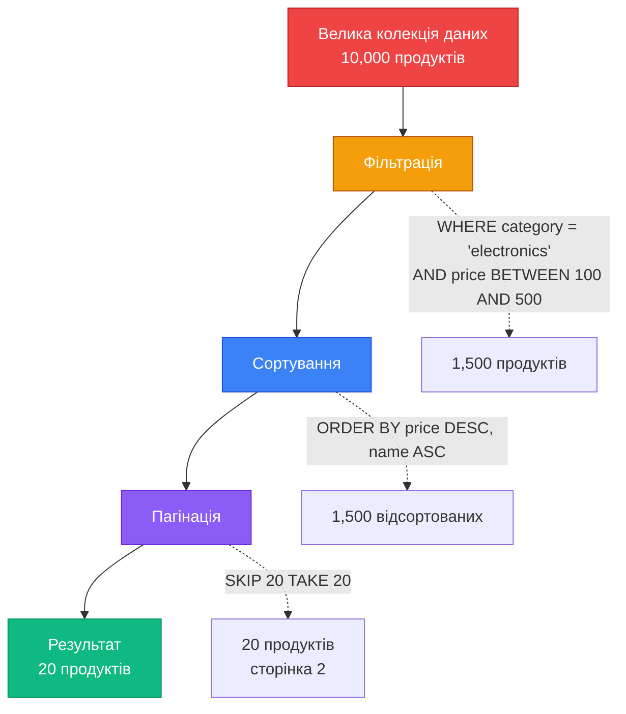

# Пагінація, фільтрація та сортування

## Вступ: Проблема великих колекцій

Уявіть, що ваш API повертає список продуктів:

```csharp
[HttpGet]
public async Task<ActionResult<IEnumerable<Product>>> GetAll()
{
    var products = await _db.Products.ToListAsync();
    return Ok(products); // ❌ Проблема!
}
```

**Що не так з цим кодом?**

Якщо у базі даних **10,000 продуктів**, цей endpoint:

- ❌ Завантажить **всі 10,000 записів** у пам'ять
- ❌ Серіалізує **весь масив** у JSON (~5-10 MB)
- ❌ Передасть **гігантську відповідь** клієнту
- ❌ Клієнт не зможе **швидко відобразити** таку кількість даних
- ❌ **Неможливо знайти** потрібний продукт без пошуку на клієнті

**Реальний сценарій:**

```http
GET /api/products
→ Response: 10 MB JSON з 10,000 продуктів
→ Час завантаження: 5-10 секунд
→ Користувач бачить: "Loading..." і чекає
→ Результат: погана UX, високе навантаження на сервер
```

**Що потрібно користувачу насправді?**

- Показати **20 продуктів** на сторінці
- Фільтрувати за **категорією** та **ціною**
- Сортувати за **популярністю** або **ціною**
- Переходити між **сторінками**

**Рішення** — **Пагінація, фільтрація та сортування** — три ключові техніки для роботи з великими колекціями даних у REST API.

::note
**Передумови:** Ця стаття базується на знаннях з попередніх статей (01-06 Web API Controllers), а також на розумінні теорії пагінації з курсу API Design (стаття 11).
::

### Що ви створите в цій статті

Ми побудуємо **E-commerce Products API** з професійною системою пагінації, фільтрації та сортування:

**1. Offset-based пагінація:**
```http
GET /api/products?page=2&pageSize=20
→ Повертає продукти 21-40 з headers:
X-Pagination: {"currentPage":2,"totalPages":50,"totalCount":1000}
```

**2. Query-based фільтрація:**
```http
GET /api/products?category=electronics&minPrice=100&maxPrice=500&inStock=true
→ Повертає тільки електроніку від $100 до $500 в наявності
```

**3. Dynamic сортування:**
```http
GET /api/products?sort=price:desc,name:asc
→ Сортує за ціною (спадання), потім за назвою (зростання)
```

**4. HATEOAS links:**
```json
{
  "data": [...],
  "_links": {
    "self": "/api/products?page=2",
    "first": "/api/products?page=1",
    "prev": "/api/products?page=1",
    "next": "/api/products?page=3",
    "last": "/api/products?page=50"
  }
}
```

**5. Cursor-based пагінація (для real-time даних):**
```http
GET /api/products?cursor=eyJpZCI6MTAwfQ==&limit=20
→ Повертає 20 продуктів після курсора
```

До кінця статті ви зможете:

- Реалізувати `PagedList<T>` generic клас
- Створювати query-based фільтри через DTO
- Використовувати dynamic сортування
- Додавати HATEOAS links до пагінованих відповідей
- Вибирати між offset-based та cursor-based пагінацією

---

## Фундаментальні концепції

### Три стовпи роботи з колекціями

::mermaid

::

**Порядок виконання критично важливий:**

1. **Фільтрація** — зменшуємо датасет (WHERE у SQL)
2. **Сортування** — впорядковуємо результати (ORDER BY у SQL)
3. **Пагінація** — беремо частину (SKIP/TAKE у LINQ, OFFSET/LIMIT у SQL)

::warning
**Антипатерн:** Завантажити всі дані у пам'ять, потім фільтрувати/сортувати/пагінувати на C#. Це призведе до `OutOfMemoryException` на великих датасетах. **Завжди** використовуйте LINQ для побудови SQL-запиту.
::

### Пагінація: Offset-based vs Cursor-based

| Характеристика | Offset-based | Cursor-based |
|----------------|--------------|--------------|
| **Синтаксис** | `?page=2&pageSize=20` | `?cursor=abc123&limit=20` |
| **SQL** | `OFFSET 20 LIMIT 20` | `WHERE id > 100 LIMIT 20` |
| **Переваги** | Простота, можна перейти на будь-яку сторінку | Стабільність, продуктивність |
| **Недоліки** | Проблеми з real-time даними | Неможливо перейти на довільну сторінку |
| **Використання** | Статичні списки, адмін-панелі | Стрічки новин, чати, логи |

**Приклад проблеми offset-based:**

```
Початковий стан (10 продуктів):
[1, 2, 3, 4, 5, 6, 7, 8, 9, 10]

Користувач на сторінці 1 (продукти 1-5):
[1, 2, 3, 4, 5]

Хтось видаляє продукт #3:
[1, 2, 4, 5, 6, 7, 8, 9, 10]

Користувач переходить на сторінку 2 (продукти 6-10):
[6, 7, 8, 9, 10]

❌ Продукти 4 та 5 пропущені!
```

**Cursor-based вирішує це:**

```
Користувач на сторінці 1 (після курсора 0):
[1, 2, 3, 4, 5] → курсор = 5

Хтось видаляє продукт #3:
[1, 2, 4, 5, 6, 7, 8, 9, 10]

Користувач переходить на наступну сторінку (після курсора 5):
[6, 7, 8, 9, 10]

✅ Жодних пропусків!
```

---

## Практична реалізація: Products API

### Крок 1: Налаштування проєкту

::steps

### Створення проєкту

::terminal-preview{title="bash"}
<div class="line"><span class="opacity-40">$</span> <strong class="font-bold">dotnet new webapi -n ProductsPaginationApi</strong></div>
<div class="line"><span class="text-green-400 font-bold">The template "ASP.NET Core Web API" was created successfully.</span></div>
<div class="line"></div>
<div class="line"><span class="opacity-40">$</span> <strong class="font-bold">cd ProductsPaginationApi</strong></div>
<div class="line"><span class="opacity-40">$</span> <strong class="font-bold">dotnet add package Microsoft.EntityFrameworkCore.InMemory</strong></div>
<div class="line"><span class="text-blue-400">info</span> : PackageReference added successfully</div>
<div class="line"><span class="opacity-40">$</span> <strong class="font-bold">dotnet add package System.Linq.Dynamic.Core</strong></div>
<div class="line"><span class="text-blue-400">info</span> : PackageReference added successfully</div>
::

::note
**System.Linq.Dynamic.Core** — бібліотека для dynamic сортування через строкові вирази (`"price desc, name asc"`).
::

### Створення моделей

Створіть файл `Models/Product.cs`:

```csharp
namespace ProductsPaginationApi.Models;

public class Product
{
    public int Id { get; set; }
    public required string Name { get; set; }
    public required string Category { get; set; }
    public decimal Price { get; set; }
    public int Stock { get; set; }
    public bool InStock => Stock > 0;
    public double Rating { get; set; }
    public int ReviewCount { get; set; }
    public DateTime CreatedAt { get; set; } = DateTime.UtcNow;
}
```

**Декомпозиція:**

- **`Id`** — первинний ключ для cursor-based пагінації
- **`Category`** — для фільтрації за категорією
- **`Price`** — для фільтрації за діапазоном цін та сортування
- **`Stock`** — для фільтрації "в наявності"
- **`InStock`** — computed property для зручності
- **`Rating`, `ReviewCount`** — для сортування за популярністю
- **`CreatedAt`** — для сортування за датою додавання

::

---

### Крок 2: Pagination Infrastructure

#### 1. PaginationFilter — Query Parameters DTO

Створіть файл `Models/PaginationFilter.cs`:

```csharp
namespace ProductsPaginationApi.Models;

public class PaginationFilter
{
    private const int MaxPageSize = 100;
    private int _pageSize = 20;

    public int Page { get; set; } = 1;

    public int PageSize
    {
        get => _pageSize;
        set => _pageSize = value > MaxPageSize ? MaxPageSize : value;
    }

    // Computed properties для LINQ
    public int Skip => (Page - 1) * PageSize;
    public int Take => PageSize;
}
```

**Декомпозиція:**

1. **`MaxPageSize`** — захист від зловживань (користувач не може запитати 1,000,000 записів)
2. **`_pageSize`** — backing field для валідації
3. **`PageSize` setter** — автоматично обмежує до `MaxPageSize`
4. **`Skip`** — скільки записів пропустити (`OFFSET` у SQL)
5. **`Take`** — скільки записів взяти (`LIMIT` у SQL)

**Приклад:**
```
Page = 3, PageSize = 20
→ Skip = (3 - 1) * 20 = 40
→ Take = 20
→ SQL: OFFSET 40 LIMIT 20
```

#### 2. PagedList<T> — Generic Wrapper

Створіть файл `Models/PagedList.cs`:

```csharp
namespace ProductsPaginationApi.Models;

public class PagedList<T>
{
    public List<T> Items { get; }
    public int CurrentPage { get; }
    public int TotalPages { get; }
    public int PageSize { get; }
    public int TotalCount { get; }
    
    public bool HasPrevious => CurrentPage > 1;
    public bool HasNext => CurrentPage < TotalPages;

    public PagedList(List<T> items, int count, int page, int pageSize)
    {
        Items = items;
        TotalCount = count;
        CurrentPage = page;
        PageSize = pageSize;
        TotalPages = (int)Math.Ceiling(count / (double)pageSize);
    }

    public static PagedList<T> Create(IQueryable<T> source, PaginationFilter filter)
    {
        var count = source.Count(); // SQL: SELECT COUNT(*)
        var items = source
            .Skip(filter.Skip)
            .Take(filter.Take)
            .ToList(); // SQL: OFFSET X LIMIT Y

        return new PagedList<T>(items, count, filter.Page, filter.PageSize);
    }
}
```

**Декомпозиція:**

1. **`Items`** — фактичні дані сторінки
2. **`TotalCount`** — загальна кількість записів (для UI: "Показано 21-40 з 1000")
3. **`TotalPages`** — кількість сторінок (`Math.Ceiling` для округлення вгору)
4. **`HasPrevious`, `HasNext`** — для UI кнопок навігації
5. **`Create` метод** — factory для створення з `IQueryable` (виконує SQL)

::tip
**Важливо:** `Create` приймає `IQueryable<T>`, а не `List<T>`. Це дозволяє Entity Framework побудувати оптимальний SQL-запит з `COUNT(*)` та `OFFSET/LIMIT`.
::

#### 3. PaginationMetadata — Response Headers

Створіть файл `Models/PaginationMetadata.cs`:

```csharp
namespace ProductsPaginationApi.Models;

public class PaginationMetadata
{
    public int CurrentPage { get; set; }
    public int TotalPages { get; set; }
    public int PageSize { get; set; }
    public int TotalCount { get; set; }
    public bool HasPrevious { get; set; }
    public bool HasNext { get; set; }
}
```

Це DTO для серіалізації у `X-Pagination` header.

---

### Крок 3: Filtering Infrastructure

#### ProductFilter — Query Parameters для фільтрації

Створіть файл `Models/ProductFilter.cs`:

```csharp
namespace ProductsPaginationApi.Models;

public class ProductFilter : PaginationFilter
{
    // Фільтрація за категорією
    public string? Category { get; set; }

    // Фільтрація за ціною
    public decimal? MinPrice { get; set; }
    public decimal? MaxPrice { get; set; }

    // Фільтрація за наявністю
    public bool? InStock { get; set; }

    // Фільтрація за рейтингом
    public double? MinRating { get; set; }

    // Пошук за назвою
    public string? Search { get; set; }

    // Сортування
    public string? Sort { get; set; } = "id:asc"; // За замовчуванням
}
```

**Декомпозиція:**

1. **Наслідування від `PaginationFilter`** — отримуємо `Page` та `PageSize`
2. **Nullable типи** — `null` означає "не фільтрувати за цим параметром"
3. **`Category`** — точна відповідність (case-insensitive)
4. **`MinPrice`, `MaxPrice`** — діапазон цін
5. **`InStock`** — булева фільтрація
6. **`Search`** — пошук за назвою (LIKE у SQL)
7. **`Sort`** — строка формату `"field:direction,field:direction"`

**Приклад запиту:**
```http
GET /api/products?category=electronics&minPrice=100&maxPrice=500&inStock=true&sort=price:desc&page=2&pageSize=20
```

---

### Крок 4: Sorting Infrastructure

#### SortingHelper — Dynamic Sorting

Створіть файл `Helpers/SortingHelper.cs`:

```csharp
using System.Linq.Dynamic.Core;

namespace ProductsPaginationApi.Helpers;

public static class SortingHelper
{
    public static IQueryable<T> ApplySort<T>(
        this IQueryable<T> source,
        string? sortExpression)
    {
        if (string.IsNullOrWhiteSpace(sortExpression))
            return source;

        // Парсимо "price:desc,name:asc" → ["price desc", "name asc"]
        var sortParts = sortExpression
            .Split(',', StringSplitOptions.RemoveEmptyEntries)
            .Select(part => part.Trim())
            .Select(part =>
            {
                var tokens = part.Split(':', StringSplitOptions.RemoveEmptyEntries);
                var field = tokens[0].Trim();
                var direction = tokens.Length > 1 && tokens[1].Trim().ToLower() == "desc"
                    ? "desc"
                    : "asc";
                return $"{field} {direction}";
            });

        var sortString = string.Join(", ", sortParts);

        // Використовуємо System.Linq.Dynamic.Core для dynamic OrderBy
        return source.OrderBy(sortString);
    }
}
```

**Декомпозиція:**

1. **Extension method** — викликається як `query.ApplySort("price:desc")`
2. **Парсинг** — розбиваємо строку на частини
3. **Валідація напрямку** — тільки `asc` або `desc`
4. **`OrderBy(string)`** — з бібліотеки `System.Linq.Dynamic.Core`

**Приклад:**
```csharp
var query = _db.Products.AsQueryable();
query = query.ApplySort("price:desc,name:asc");
// SQL: ORDER BY price DESC, name ASC
```

::warning
**Безпека:** У production додайте whitelist дозволених полів для сортування, щоб уникнути SQL injection через dynamic LINQ.
::


---

### Крок 5: HATEOAS Links Infrastructure

#### LinkGenerator Helper

Створіть файл `Helpers/PaginationLinksHelper.cs`:

```csharp
using Microsoft.AspNetCore.WebUtilities;
using ProductsPaginationApi.Models;

namespace ProductsPaginationApi.Helpers;

public static class PaginationLinksHelper
{
    public static Dictionary<string, string> GenerateLinks(
        HttpRequest request,
        PagedList<object> pagedList)
    {
        var baseUrl = $"{request.Scheme}://{request.Host}{request.Path}";
        var queryParams = request.Query.ToDictionary(
            kvp => kvp.Key,
            kvp => kvp.Value.ToString());

        var links = new Dictionary<string, string>
        {
            ["self"] = BuildUrl(baseUrl, queryParams, pagedList.CurrentPage)
        };

        if (pagedList.HasPrevious)
        {
            links["first"] = BuildUrl(baseUrl, queryParams, 1);
            links["prev"] = BuildUrl(baseUrl, queryParams, pagedList.CurrentPage - 1);
        }

        if (pagedList.HasNext)
        {
            links["next"] = BuildUrl(baseUrl, queryParams, pagedList.CurrentPage + 1);
            links["last"] = BuildUrl(baseUrl, queryParams, pagedList.TotalPages);
        }

        return links;
    }

    private static string BuildUrl(
        string baseUrl,
        Dictionary<string, string> queryParams,
        int page)
    {
        queryParams["page"] = page.ToString();
        return QueryHelpers.AddQueryString(baseUrl, queryParams!);
    }
}
```

**Декомпозиція:**

1. **`baseUrl`** — схема + хост + шлях (`https://api.example.com/api/products`)
2. **`queryParams`** — всі існуючі query параметри (фільтри, сортування)
3. **`self`** — посилання на поточну сторінку
4. **`first`, `prev`** — тільки якщо є попередня сторінка
5. **`next`, `last`** — тільки якщо є наступна сторінка
6. **`QueryHelpers.AddQueryString`** — правильно кодує URL

**Результат:**
```json
{
  "_links": {
    "self": "/api/products?category=electronics&page=2&pageSize=20",
    "first": "/api/products?category=electronics&page=1&pageSize=20",
    "prev": "/api/products?category=electronics&page=1&pageSize=20",
    "next": "/api/products?category=electronics&page=3&pageSize=20",
    "last": "/api/products?category=electronics&page=50&pageSize=20"
  }
}
```

---

### Крок 6: DbContext та Seed Data

Створіть файл `Data/ProductDbContext.cs`:

```csharp
using Microsoft.EntityFrameworkCore;
using ProductsPaginationApi.Models;

namespace ProductsPaginationApi.Data;

public class ProductDbContext : DbContext
{
    public ProductDbContext(DbContextOptions<ProductDbContext> options) : base(options) { }

    public DbSet<Product> Products => Set<Product>();

    protected override void OnModelCreating(ModelBuilder modelBuilder)
    {
        // Seed 1000 продуктів для тестування
        var products = new List<Product>();
        var categories = new[] { "Electronics", "Clothing", "Books", "Home", "Sports" };
        var random = new Random(42); // Фіксований seed для відтворюваності

        for (int i = 1; i <= 1000; i++)
        {
            products.Add(new Product
            {
                Id = i,
                Name = $"Product {i}",
                Category = categories[random.Next(categories.Length)],
                Price = Math.Round((decimal)(random.NextDouble() * 1000 + 10), 2),
                Stock = random.Next(0, 100),
                Rating = Math.Round(random.NextDouble() * 5, 1),
                ReviewCount = random.Next(0, 500),
                CreatedAt = DateTime.UtcNow.AddDays(-random.Next(0, 365))
            });
        }

        modelBuilder.Entity<Product>().HasData(products);
    }
}
```

**Декомпозиція:**

1. **1000 продуктів** — достатньо для тестування пагінації (50 сторінок по 20)
2. **5 категорій** — для тестування фільтрації
3. **Випадкові ціни** — від $10 до $1010
4. **Випадковий stock** — деякі продукти не в наявності
5. **Фіксований seed (42)** — однакові дані при кожному запуску

---

### Крок 7: Products Controller

Створіть файл `Controllers/ProductsController.cs`:

```csharp
using Microsoft.AspNetCore.Mvc;
using Microsoft.EntityFrameworkCore;
using ProductsPaginationApi.Data;
using ProductsPaginationApi.Models;
using ProductsPaginationApi.Helpers;
using System.Text.Json;

namespace ProductsPaginationApi.Controllers;

[ApiController]
[Route("api/[controller]")]
public class ProductsController : ControllerBase
{
    private readonly ProductDbContext _db;
    private readonly ILogger<ProductsController> _logger;

    public ProductsController(ProductDbContext db, ILogger<ProductsController> logger)
    {
        _db = db;
        _logger = logger;
    }

    /// <summary>
    /// Отримати список продуктів з пагінацією, фільтрацією та сортуванням
    /// </summary>
    /// <param name="filter">Параметри фільтрації, сортування та пагінації</param>
    [HttpGet]
    [ProducesResponseType(typeof(object), StatusCodes.Status200OK)]
    public async Task<IActionResult> GetAll([FromQuery] ProductFilter filter)
    {
        _logger.LogInformation(
            "Fetching products: Page={Page}, PageSize={PageSize}, Category={Category}, Sort={Sort}",
            filter.Page,
            filter.PageSize,
            filter.Category ?? "all",
            filter.Sort);

        // Починаємо з базового query
        var query = _db.Products.AsQueryable();

        // 1. ФІЛЬТРАЦІЯ
        query = ApplyFilters(query, filter);

        // 2. СОРТУВАННЯ
        query = query.ApplySort(filter.Sort);

        // 3. ПАГІНАЦІЯ
        var pagedList = PagedList<Product>.Create(query, filter);

        // 4. METADATA у headers
        var metadata = new PaginationMetadata
        {
            CurrentPage = pagedList.CurrentPage,
            TotalPages = pagedList.TotalPages,
            PageSize = pagedList.PageSize,
            TotalCount = pagedList.TotalCount,
            HasPrevious = pagedList.HasPrevious,
            HasNext = pagedList.HasNext
        };

        Response.Headers.Append("X-Pagination", JsonSerializer.Serialize(metadata));

        // 5. HATEOAS LINKS
        var pagedListAsObject = new PagedList<object>(
            pagedList.Items.Cast<object>().ToList(),
            pagedList.TotalCount,
            pagedList.CurrentPage,
            pagedList.PageSize);

        var links = PaginationLinksHelper.GenerateLinks(Request, pagedListAsObject);

        // 6. RESPONSE
        var response = new
        {
            data = pagedList.Items,
            pagination = metadata,
            _links = links
        };

        return Ok(response);
    }

    private IQueryable<Product> ApplyFilters(IQueryable<Product> query, ProductFilter filter)
    {
        // Фільтр за категорією
        if (!string.IsNullOrWhiteSpace(filter.Category))
        {
            query = query.Where(p => p.Category.ToLower() == filter.Category.ToLower());
        }

        // Фільтр за ціною (діапазон)
        if (filter.MinPrice.HasValue)
        {
            query = query.Where(p => p.Price >= filter.MinPrice.Value);
        }

        if (filter.MaxPrice.HasValue)
        {
            query = query.Where(p => p.Price <= filter.MaxPrice.Value);
        }

        // Фільтр за наявністю
        if (filter.InStock.HasValue)
        {
            if (filter.InStock.Value)
            {
                query = query.Where(p => p.Stock > 0);
            }
            else
            {
                query = query.Where(p => p.Stock == 0);
            }
        }

        // Фільтр за рейтингом
        if (filter.MinRating.HasValue)
        {
            query = query.Where(p => p.Rating >= filter.MinRating.Value);
        }

        // Пошук за назвою
        if (!string.IsNullOrWhiteSpace(filter.Search))
        {
            query = query.Where(p => p.Name.ToLower().Contains(filter.Search.ToLower()));
        }

        return query;
    }

    /// <summary>
    /// Отримати продукт за ID
    /// </summary>
    [HttpGet("{id:int}")]
    [ProducesResponseType(typeof(Product), StatusCodes.Status200OK)]
    [ProducesResponseType(StatusCodes.Status404NotFound)]
    public async Task<ActionResult<Product>> GetById(int id)
    {
        var product = await _db.Products.FindAsync(id);

        if (product is null)
            return NotFound();

        return Ok(product);
    }
}
```

**Декомпозиція:**

1. **`[FromQuery]`** — автоматично біндить query параметри до `ProductFilter`
2. **Порядок операцій** — фільтрація → сортування → пагінація
3. **`X-Pagination` header** — метадані для клієнта
4. **HATEOAS links** — навігаційні посилання
5. **Structured response** — `data`, `pagination`, `_links`
6. **`ApplyFilters`** — окремий метод для читабельності

::tip
**Best Practice:** Завжди логуйте параметри пагінації та фільтрації для моніторингу та дебагу.
::

---

### Крок 8: Program.cs Configuration

```csharp
using Microsoft.EntityFrameworkCore;
using ProductsPaginationApi.Data;

var builder = WebApplication.CreateBuilder(args);

// DbContext
builder.Services.AddDbContext<ProductDbContext>(options =>
    options.UseInMemoryDatabase("ProductsDb"));

builder.Services.AddControllers();
builder.Services.AddEndpointsApiExplorer();
builder.Services.AddSwaggerGen();

var app = builder.Build();

// Seed database
using (var scope = app.Services.CreateScope())
{
    var db = scope.ServiceProvider.GetRequiredService<ProductDbContext>();
    db.Database.EnsureCreated();
}

if (app.Environment.IsDevelopment())
{
    app.UseSwagger();
    app.UseSwaggerUI();
}

app.UseHttpsRedirection();
app.UseAuthorization();
app.MapControllers();

app.Run();
```

---

### Крок 9: Тестування

::terminal-preview{title="bash"}
<div class="line"><span class="opacity-40">$</span> <strong class="font-bold">dotnet run</strong></div>
<div class="line"><span class="text-green-400 font-bold">info</span>: Now listening on: https://localhost:5001</div>
<div class="line"></div>
<div class="line"><span class="opacity-40"># Тест 1: Базова пагінація</span></div>
<div class="line"><span class="opacity-40">$</span> <strong class="font-bold">curl "https://localhost:5001/api/products?page=1&pageSize=5"</strong></div>
<div class="line"><span class="text-green-400 font-bold">HTTP/1.1 200 OK</span></div>
<div class="line"><span class="text-blue-400 font-bold">X-Pagination: {"currentPage":1,"totalPages":200,"pageSize":5,"totalCount":1000}</span></div>
<div class="line"><span class="text-blue-400">{</span></div>
<div class="line">  <span class="text-green-400">"data"</span>: [</div>
<div class="line">    <span class="text-blue-400">{ "id": 1, "name": "Product 1", "price": 123.45 }</span>,</div>
<div class="line">    <span class="text-blue-400">{ "id": 2, "name": "Product 2", "price": 234.56 }</span>,</div>
<div class="line">    <span class="opacity-40">...</span></div>
<div class="line">  ],</div>
<div class="line">  <span class="text-green-400">"_links"</span>: <span class="text-blue-400">{</span></div>
<div class="line">    <span class="text-green-400">"self"</span>: <span class="text-yellow-400">"/api/products?page=1&pageSize=5"</span>,</div>
<div class="line">    <span class="text-green-400">"next"</span>: <span class="text-yellow-400">"/api/products?page=2&pageSize=5"</span>,</div>
<div class="line">    <span class="text-green-400">"last"</span>: <span class="text-yellow-400">"/api/products?page=200&pageSize=5"</span></div>
<div class="line">  <span class="text-blue-400">}</span></div>
<div class="line"><span class="text-blue-400">}</span></div>
<div class="line"></div>
<div class="line"><span class="opacity-40"># Тест 2: Фільтрація за категорією</span></div>
<div class="line"><span class="opacity-40">$</span> <strong class="font-bold">curl "https://localhost:5001/api/products?category=electronics&page=1&pageSize=10"</strong></div>
<div class="line"><span class="text-green-400 font-bold">HTTP/1.1 200 OK</span></div>
<div class="line"><span class="text-blue-400 font-bold">X-Pagination: {"currentPage":1,"totalPages":20,"pageSize":10,"totalCount":200}</span></div>
<div class="line"></div>
<div class="line"><span class="opacity-40"># Тест 3: Фільтрація за ціною + сортування</span></div>
<div class="line"><span class="opacity-40">$</span> <strong class="font-bold">curl "https://localhost:5001/api/products?minPrice=100&maxPrice=500&sort=price:desc"</strong></div>
<div class="line"><span class="text-green-400 font-bold">HTTP/1.1 200 OK</span></div>
<div class="line"><span class="opacity-40"># Повертає продукти від $100 до $500, відсортовані за ціною (спадання)</span></div>
<div class="line"></div>
<div class="line"><span class="opacity-40"># Тест 4: Комбінована фільтрація</span></div>
<div class="line"><span class="opacity-40">$</span> <strong class="font-bold">curl "https://localhost:5001/api/products?category=electronics&minPrice=200&inStock=true&sort=rating:desc,price:asc"</strong></div>
<div class="line"><span class="text-green-400 font-bold">HTTP/1.1 200 OK</span></div>
<div class="line"><span class="opacity-40"># Електроніка від $200, в наявності, сортування: рейтинг↓, ціна↑</span></div>
::

---

## Просунуті техніки

### 1. Cursor-Based Pagination

Для real-time даних (чати, стрічки новин) offset-based пагінація не підходить. Використовуйте cursor-based:

#### CursorPaginationFilter

Створіть файл `Models/CursorPaginationFilter.cs`:

```csharp
namespace ProductsPaginationApi.Models;

public class CursorPaginationFilter
{
    public string? Cursor { get; set; } // Base64-encoded ID
    public int Limit { get; set; } = 20;
    private const int MaxLimit = 100;

    public int GetLimit() => Limit > MaxLimit ? MaxLimit : Limit;

    public int? DecodeCursor()
    {
        if (string.IsNullOrWhiteSpace(Cursor))
            return null;

        try
        {
            var bytes = Convert.FromBase64String(Cursor);
            var json = System.Text.Encoding.UTF8.GetString(bytes);
            var data = System.Text.Json.JsonSerializer.Deserialize<CursorData>(json);
            return data?.Id;
        }
        catch
        {
            return null;
        }
    }

    public static string EncodeCursor(int id)
    {
        var data = new CursorData { Id = id };
        var json = System.Text.Json.JsonSerializer.Serialize(data);
        var bytes = System.Text.Encoding.UTF8.GetBytes(json);
        return Convert.ToBase64String(bytes);
    }

    private record CursorData
    {
        public int Id { get; init; }
    }
}
```

#### Controller Method

```csharp
[HttpGet("cursor")]
[ProducesResponseType(typeof(object), StatusCodes.Status200OK)]
public async Task<IActionResult> GetWithCursor([FromQuery] CursorPaginationFilter filter)
{
    var query = _db.Products.AsQueryable();

    // Застосовуємо курсор (якщо є)
    var cursorId = filter.DecodeCursor();
    if (cursorId.HasValue)
    {
        query = query.Where(p => p.Id > cursorId.Value);
    }

    // Беремо limit + 1 для визначення hasNext
    var limit = filter.GetLimit();
    var products = await query
        .OrderBy(p => p.Id) // Важливо: стабільне сортування
        .Take(limit + 1)
        .ToListAsync();

    var hasNext = products.Count > limit;
    if (hasNext)
    {
        products = products.Take(limit).ToList();
    }

    var nextCursor = hasNext && products.Any()
        ? CursorPaginationFilter.EncodeCursor(products.Last().Id)
        : null;

    var response = new
    {
        data = products,
        pagination = new
        {
            limit,
            hasNext,
            nextCursor
        }
    };

    return Ok(response);
}
```

**Приклад використання:**

```http
GET /api/products/cursor?limit=20
→ Повертає перші 20 продуктів + nextCursor

GET /api/products/cursor?cursor=eyJpZCI6MjB9&limit=20
→ Повертає наступні 20 продуктів після ID=20
```

**Переваги:**

✅ Стабільність при змінах даних  
✅ Висока продуктивність (індекс на ID)  
✅ Підходить для infinite scroll

**Недоліки:**

❌ Неможливо перейти на довільну сторінку  
❌ Складніша реалізація

---

### 2. Field Selection (Sparse Fieldsets)

Дозволяє клієнту вибирати, які поля повертати:

```http
GET /api/products?fields=id,name,price
→ Повертає тільки id, name, price (без category, stock, rating)
```

#### Implementation

```csharp
public class FieldSelectionFilter
{
    public string? Fields { get; set; }

    public List<string> GetFields()
    {
        if (string.IsNullOrWhiteSpace(Fields))
            return new List<string>();

        return Fields
            .Split(',', StringSplitOptions.RemoveEmptyEntries)
            .Select(f => f.Trim().ToLower())
            .ToList();
    }
}
```

```csharp
[HttpGet("sparse")]
public async Task<IActionResult> GetWithFieldSelection(
    [FromQuery] ProductFilter filter,
    [FromQuery] FieldSelectionFilter fieldFilter)
{
    var query = _db.Products.AsQueryable();
    query = ApplyFilters(query, filter);
    query = query.ApplySort(filter.Sort);

    var pagedList = PagedList<Product>.Create(query, filter);

    // Застосовуємо field selection
    var fields = fieldFilter.GetFields();
    if (fields.Any())
    {
        var selectedData = pagedList.Items.Select(p => SelectFields(p, fields));
        return Ok(new { data = selectedData });
    }

    return Ok(new { data = pagedList.Items });
}

private object SelectFields(Product product, List<string> fields)
{
    var result = new Dictionary<string, object?>();

    foreach (var field in fields)
    {
        switch (field)
        {
            case "id": result["id"] = product.Id; break;
            case "name": result["name"] = product.Name; break;
            case "price": result["price"] = product.Price; break;
            case "category": result["category"] = product.Category; break;
            case "stock": result["stock"] = product.Stock; break;
            case "rating": result["rating"] = product.Rating; break;
        }
    }

    return result;
}
```

::note
У production використовуйте бібліотеки типу `AutoMapper` або `System.Linq.Dynamic.Core` для dynamic projection.
::

---

### 3. Aggregations та Facets

Додайте агрегації для фільтрів (як у e-commerce):

```csharp
[HttpGet("facets")]
public async Task<IActionResult> GetFacets()
{
    var facets = new
    {
        categories = await _db.Products
            .GroupBy(p => p.Category)
            .Select(g => new { category = g.Key, count = g.Count() })
            .ToListAsync(),

        priceRanges = new[]
        {
            new { range = "0-100", count = await _db.Products.CountAsync(p => p.Price < 100) },
            new { range = "100-500", count = await _db.Products.CountAsync(p => p.Price >= 100 && p.Price < 500) },
            new { range = "500+", count = await _db.Products.CountAsync(p => p.Price >= 500) }
        },

        availability = new
        {
            inStock = await _db.Products.CountAsync(p => p.Stock > 0),
            outOfStock = await _db.Products.CountAsync(p => p.Stock == 0)
        }
    };

    return Ok(facets);
}
```

**Результат:**

```json
{
  "categories": [
    { "category": "Electronics", "count": 200 },
    { "category": "Clothing", "count": 180 },
    { "category": "Books", "count": 220 }
  ],
  "priceRanges": [
    { "range": "0-100", "count": 150 },
    { "range": "100-500", "count": 600 },
    { "range": "500+", "count": 250 }
  ],
  "availability": {
    "inStock": 850,
    "outOfStock": 150
  }
}
```

Це дозволяє клієнту показувати UI фільтрів з кількістю результатів.


---

## Практичні завдання

### Рівень 1: Базове розуміння

::steps

### Завдання 1.1: Розрахунок пагінації

Дано: 1,247 продуктів, `pageSize = 25`. Розрахуйте:

1. Скільки буде сторінок?
2. Скільки продуктів на останній сторінці?
3. Які значення `Skip` та `Take` для сторінки 3?

::collapsible{title="Показати відповіді"}

1. **Кількість сторінок:**
   ```
   TotalPages = Math.Ceiling(1247 / 25.0) = Math.Ceiling(49.88) = 50
   ```

2. **Продуктів на останній сторінці:**
   ```
   LastPageItems = 1247 - (49 * 25) = 1247 - 1225 = 22
   ```

3. **Skip та Take для сторінки 3:**
   ```
   Skip = (3 - 1) * 25 = 50
   Take = 25
   SQL: OFFSET 50 LIMIT 25
   ```

::

### Завдання 1.2: Порядок операцій

У якому порядку мають виконуватися операції для оптимальної продуктивності?

A) Пагінація → Фільтрація → Сортування  
B) Сортування → Фільтрація → Пагінація  
C) Фільтрація → Сортування → Пагінація  
D) Фільтрація → Пагінація → Сортування

::collapsible{title="Показати відповідь"}

**Правильна відповідь: C) Фільтрація → Сортування → Пагінація**

**Пояснення:**

1. **Фільтрація спочатку** — зменшуємо датасет (WHERE у SQL)
2. **Сортування** — впорядковуємо відфільтровані дані (ORDER BY)
3. **Пагінація останньою** — беремо частину відсортованих даних (OFFSET/LIMIT)

**Антипатерн (D):** Якщо пагінувати перед сортуванням, отримаємо невірні результати (сортування застосується тільки до 20 записів замість усього датасету).

::

::

---

### Рівень 2: Логіка та розширення

::steps

### Завдання 2.1: Реалізація Search Filter

Додайте повнотекстовий пошук, що шукає у `Name` та `Category`:

::collapsible{title="Показати рішення"}

```csharp
// Додайте до ProductFilter
public string? Search { get; set; }

// Додайте до ApplyFilters у контролері
if (!string.IsNullOrWhiteSpace(filter.Search))
{
    var searchLower = filter.Search.ToLower();
    query = query.Where(p =>
        p.Name.ToLower().Contains(searchLower) ||
        p.Category.ToLower().Contains(searchLower));
}
```

**Тестування:**

```http
GET /api/products?search=laptop
→ Повертає продукти з "laptop" у назві або категорії
```

**Покращення для production:**

```csharp
// Використовуйте EF.Functions.Like для case-insensitive пошуку
if (!string.IsNullOrWhiteSpace(filter.Search))
{
    query = query.Where(p =>
        EF.Functions.Like(p.Name, $"%{filter.Search}%") ||
        EF.Functions.Like(p.Category, $"%{filter.Search}%"));
}
```

::note
Для великих датасетів використовуйте Full-Text Search (SQL Server) або Elasticsearch.
::

::

### Завдання 2.2: Whitelist для сортування

Додайте валідацію дозволених полів для сортування (безпека):

::collapsible{title="Показати рішення"}

```csharp
public static class SortingHelper
{
    private static readonly HashSet<string> AllowedFields = new(StringComparer.OrdinalIgnoreCase)
    {
        "id", "name", "category", "price", "stock", "rating", "reviewcount", "createdat"
    };

    public static IQueryable<T> ApplySort<T>(
        this IQueryable<T> source,
        string? sortExpression)
    {
        if (string.IsNullOrWhiteSpace(sortExpression))
            return source;

        var sortParts = sortExpression
            .Split(',', StringSplitOptions.RemoveEmptyEntries)
            .Select(part => part.Trim())
            .Select(part =>
            {
                var tokens = part.Split(':', StringSplitOptions.RemoveEmptyEntries);
                var field = tokens[0].Trim();

                // Валідація поля
                if (!AllowedFields.Contains(field))
                {
                    throw new ArgumentException($"Sorting by '{field}' is not allowed");
                }

                var direction = tokens.Length > 1 && tokens[1].Trim().ToLower() == "desc"
                    ? "desc"
                    : "asc";

                return $"{field} {direction}";
            });

        var sortString = string.Join(", ", sortParts);
        return source.OrderBy(sortString);
    }
}
```

**Обробка помилки у контролері:**

```csharp
try
{
    query = query.ApplySort(filter.Sort);
}
catch (ArgumentException ex)
{
    return BadRequest(new ProblemDetails
    {
        Status = StatusCodes.Status400BadRequest,
        Title = "Invalid Sort Parameter",
        Detail = ex.Message
    });
}
```

**Тестування:**

```http
GET /api/products?sort=price:desc
→ 200 OK (дозволено)

GET /api/products?sort=password:desc
→ 400 Bad Request: "Sorting by 'password' is not allowed"
```

::

### Завдання 2.3: Default Sorting

Додайте сортування за замовчуванням, якщо клієнт не вказав `sort`:

::collapsible{title="Показати рішення"}

```csharp
public class ProductFilter : PaginationFilter
{
    private string _sort = "id:asc"; // За замовчуванням

    public string? Sort
    {
        get => _sort;
        set => _sort = string.IsNullOrWhiteSpace(value) ? "id:asc" : value;
    }

    // Інші властивості...
}
```

**Альтернатива — smart defaults:**

```csharp
public string GetEffectiveSort()
{
    if (!string.IsNullOrWhiteSpace(Sort))
        return Sort;

    // Якщо є пошук — сортуємо за релевантністю (тут — за назвою)
    if (!string.IsNullOrWhiteSpace(Search))
        return "name:asc";

    // Якщо фільтр за категорією — сортуємо за рейтингом
    if (!string.IsNullOrWhiteSpace(Category))
        return "rating:desc";

    // За замовчуванням — за датою додавання (новіші спочатку)
    return "createdat:desc";
}
```

::

::

---

### Рівень 3: Архітектура та створення

::steps

### Завдання 3.1: Generic Pagination Service

Створіть generic сервіс для пагінації будь-яких сутностей:

::collapsible{title="Показати рішення"}

**1. Interface:**

```csharp
public interface IPaginationService
{
    Task<PagedList<T>> PaginateAsync<T>(
        IQueryable<T> query,
        PaginationFilter filter) where T : class;
}
```

**2. Implementation:**

```csharp
public class PaginationService : IPaginationService
{
    public async Task<PagedList<T>> PaginateAsync<T>(
        IQueryable<T> query,
        PaginationFilter filter) where T : class
    {
        var count = await query.CountAsync();
        var items = await query
            .Skip(filter.Skip)
            .Take(filter.Take)
            .ToListAsync();

        return new PagedList<T>(items, count, filter.Page, filter.PageSize);
    }
}
```

**3. Реєстрація:**

```csharp
builder.Services.AddScoped<IPaginationService, PaginationService>();
```

**4. Використання у контролері:**

```csharp
public class ProductsController : ControllerBase
{
    private readonly ProductDbContext _db;
    private readonly IPaginationService _paginationService;

    public ProductsController(ProductDbContext db, IPaginationService paginationService)
    {
        _db = db;
        _paginationService = paginationService;
    }

    [HttpGet]
    public async Task<IActionResult> GetAll([FromQuery] ProductFilter filter)
    {
        var query = _db.Products.AsQueryable();
        query = ApplyFilters(query, filter);
        query = query.ApplySort(filter.Sort);

        var pagedList = await _paginationService.PaginateAsync(query, filter);

        // Response logic...
        return Ok(pagedList);
    }
}
```

**Переваги:**

✅ Reusable для всіх контролерів  
✅ Легко тестувати  
✅ Централізована логіка пагінації

::

### Завдання 3.2: Advanced Filtering з Expression Trees

Створіть систему динамічної фільтрації через expression trees:

::collapsible{title="Показати рішення"}

**1. Filter DTO:**

```csharp
public class DynamicFilter
{
    public string Field { get; set; } = "";
    public string Operator { get; set; } = "eq"; // eq, ne, gt, lt, gte, lte, contains
    public string Value { get; set; } = "";
}

public class DynamicFilterRequest : PaginationFilter
{
    public List<DynamicFilter> Filters { get; set; } = new();
    public string? Sort { get; set; }
}
```

**2. Expression Builder:**

```csharp
using System.Linq.Expressions;
using System.Reflection;

public static class DynamicFilterHelper
{
    public static IQueryable<T> ApplyDynamicFilters<T>(
        this IQueryable<T> query,
        List<DynamicFilter> filters)
    {
        foreach (var filter in filters)
        {
            query = query.Where(BuildPredicate<T>(filter));
        }
        return query;
    }

    private static Expression<Func<T, bool>> BuildPredicate<T>(DynamicFilter filter)
    {
        var parameter = Expression.Parameter(typeof(T), "x");
        var property = Expression.Property(parameter, filter.Field);
        var constant = Expression.Constant(Convert.ChangeType(filter.Value, property.Type));

        Expression comparison = filter.Operator.ToLower() switch
        {
            "eq" => Expression.Equal(property, constant),
            "ne" => Expression.NotEqual(property, constant),
            "gt" => Expression.GreaterThan(property, constant),
            "lt" => Expression.LessThan(property, constant),
            "gte" => Expression.GreaterThanOrEqual(property, constant),
            "lte" => Expression.LessThanOrEqual(property, constant),
            "contains" => Expression.Call(
                property,
                typeof(string).GetMethod("Contains", new[] { typeof(string) })!,
                constant),
            _ => throw new ArgumentException($"Operator '{filter.Operator}' is not supported")
        };

        return Expression.Lambda<Func<T, bool>>(comparison, parameter);
    }
}
```

**3. Використання:**

```csharp
[HttpPost("dynamic")]
public async Task<IActionResult> GetWithDynamicFilters([FromBody] DynamicFilterRequest request)
{
    var query = _db.Products.AsQueryable();

    // Застосовуємо динамічні фільтри
    query = query.ApplyDynamicFilters(request.Filters);

    // Сортування та пагінація
    query = query.ApplySort(request.Sort);
    var pagedList = PagedList<Product>.Create(query, request);

    return Ok(new { data = pagedList.Items });
}
```

**Приклад запиту:**

```json
POST /api/products/dynamic
{
  "filters": [
    { "field": "Category", "operator": "eq", "value": "Electronics" },
    { "field": "Price", "operator": "gte", "value": "100" },
    { "field": "Price", "operator": "lte", "value": "500" },
    { "field": "Name", "operator": "contains", "value": "laptop" }
  ],
  "sort": "price:desc",
  "page": 1,
  "pageSize": 20
}
```

**Переваги:**

✅ Гнучкість — клієнт може створювати будь-які комбінації фільтрів  
✅ Типобезпека — expression trees компілюються у SQL  
✅ Розширюваність — легко додати нові оператори

**Недоліки:**

❌ Складність — потребує розуміння expression trees  
❌ Безпека — потрібна валідація полів та операторів

::

### Завдання 3.3: Pagination Response Filter

Створіть Result Filter для автоматичного додавання пагінаційних headers та HATEOAS links:

::collapsible{title="Показати рішення"}

**1. Filter:**

```csharp
using Microsoft.AspNetCore.Mvc;
using Microsoft.AspNetCore.Mvc.Filters;
using System.Text.Json;
using ProductsPaginationApi.Models;
using ProductsPaginationApi.Helpers;

public class PaginationResponseFilter : IAsyncResultFilter
{
    public async Task OnResultExecutionAsync(
        ResultExecutingContext context,
        ResultExecutionDelegate next)
    {
        if (context.Result is ObjectResult objectResult &&
            objectResult.Value != null)
        {
            var valueType = objectResult.Value.GetType();

            // Перевіряємо, чи це PagedList<T>
            if (valueType.IsGenericType &&
                valueType.GetGenericTypeDefinition() == typeof(PagedList<>))
            {
                var pagedList = objectResult.Value;
                var pagedListType = valueType;

                // Отримуємо властивості через reflection
                var currentPage = (int)pagedListType.GetProperty("CurrentPage")!.GetValue(pagedList)!;
                var totalPages = (int)pagedListType.GetProperty("TotalPages")!.GetValue(pagedList)!;
                var pageSize = (int)pagedListType.GetProperty("PageSize")!.GetValue(pagedList)!;
                var totalCount = (int)pagedListType.GetProperty("TotalCount")!.GetValue(pagedList)!;
                var hasPrevious = (bool)pagedListType.GetProperty("HasPrevious")!.GetValue(pagedList)!;
                var hasNext = (bool)pagedListType.GetProperty("HasNext")!.GetValue(pagedList)!;
                var items = pagedListType.GetProperty("Items")!.GetValue(pagedList);

                // Додаємо X-Pagination header
                var metadata = new PaginationMetadata
                {
                    CurrentPage = currentPage,
                    TotalPages = totalPages,
                    PageSize = pageSize,
                    TotalCount = totalCount,
                    HasPrevious = hasPrevious,
                    HasNext = hasNext
                };

                context.HttpContext.Response.Headers.Append(
                    "X-Pagination",
                    JsonSerializer.Serialize(metadata));

                // Генеруємо HATEOAS links
                var pagedListAsObject = new PagedList<object>(
                    ((IEnumerable<object>)items!).ToList(),
                    totalCount,
                    currentPage,
                    pageSize);

                var links = PaginationLinksHelper.GenerateLinks(
                    context.HttpContext.Request,
                    pagedListAsObject);

                // Обгортаємо відповідь
                var response = new
                {
                    data = items,
                    pagination = metadata,
                    _links = links
                };

                context.Result = new ObjectResult(response)
                {
                    StatusCode = objectResult.StatusCode
                };
            }
        }

        await next();
    }
}
```

**2. Реєстрація:**

```csharp
builder.Services.AddControllers(options =>
{
    options.Filters.Add<PaginationResponseFilter>();
});
```

**3. Спрощений контролер:**

```csharp
[HttpGet]
public async Task<ActionResult<PagedList<Product>>> GetAll([FromQuery] ProductFilter filter)
{
    var query = _db.Products.AsQueryable();
    query = ApplyFilters(query, filter);
    query = query.ApplySort(filter.Sort);

    var pagedList = PagedList<Product>.Create(query, filter);

    // Фільтр автоматично додасть headers та links!
    return Ok(pagedList);
}
```

**Переваги:**

✅ DRY — логіка пагінації у одному місці  
✅ Консистентність — всі endpoints мають однаковий формат  
✅ Чистий код контролерів

::

::

---

## Резюме

У цій статті ви навчилися реалізовувати **пагінацію, фільтрацію та сортування** для Web API:

### Ключові концепції

**1. Три стовпи роботи з колекціями:**
- **Фільтрація** — зменшення датасету (WHERE)
- **Сортування** — впорядкування результатів (ORDER BY)
- **Пагінація** — розбиття на сторінки (OFFSET/LIMIT)

**2. Типи пагінації:**
- **Offset-based** — `?page=2&pageSize=20` (простота, довільні сторінки)
- **Cursor-based** — `?cursor=abc&limit=20` (стабільність, продуктивність)

**3. Infrastructure компоненти:**
- **`PaginationFilter`** — query parameters DTO
- **`PagedList<T>`** — generic wrapper з метаданими
- **`SortingHelper`** — dynamic сортування через LINQ
- **`PaginationLinksHelper`** — HATEOAS links генератор

**4. Best Practices:**
- Завжди виконуйте фільтрацію/сортування/пагінацію на рівні БД (IQueryable)
- Додавайте `X-Pagination` header з метаданими
- Використовуйте HATEOAS links для навігації
- Валідуйте `pageSize` (max limit)
- Whitelist дозволених полів для сортування
- Логуйте параметри пагінації для моніторингу

### Порівняння підходів

| Характеристика | Offset-based | Cursor-based |
|----------------|--------------|--------------|
| **Складність** | Проста | Середня |
| **Продуктивність** | Погіршується на великих offset | Стабільна |
| **Стабільність** | Проблеми з real-time даними | Стабільна |
| **Навігація** | Довільні сторінки | Тільки next/prev |
| **Використання** | Адмін-панелі, каталоги | Стрічки, чати, логи |

### Коли використовувати

| Сценарій | Рішення |
|----------|---------|
| Каталог продуктів | Offset-based + фільтри + сортування |
| Стрічка новин | Cursor-based |
| Адмін-панель | Offset-based + пошук |
| Чат/коментарі | Cursor-based |
| Логи/події | Cursor-based |
| Звіти | Offset-based + експорт |

::tip
**Production Checklist:**
- ✅ Валідація `pageSize` (max 100)
- ✅ Whitelist для сортування
- ✅ Індекси на поля фільтрації та сортування
- ✅ Кешування для популярних запитів
- ✅ Rate limiting для захисту від зловживань
- ✅ Логування параметрів пагінації
::

---

## Додаткові ресурси

::card-group
::card{title="Офіційна документація" icon="i-heroicons-book-open"}
[Pagination in ASP.NET Core](https://learn.microsoft.com/en-us/aspnet/core/data/ef-mvc/sort-filter-page)
::

::card{title="LINQ Dynamic" icon="i-heroicons-code-bracket"}
[System.Linq.Dynamic.Core](https://dynamic-linq.net/)
::

::card{title="REST API Best Practices" icon="i-heroicons-light-bulb"}
[REST API Pagination](https://www.moesif.com/blog/technical/api-design/REST-API-Design-Filtering-Sorting-and-Pagination/)
::

::card{title="Cursor Pagination" icon="i-heroicons-arrow-path"}
[Cursor-Based Pagination](https://slack.engineering/evolving-api-pagination-at-slack/)
::
::

---

::note{icon="i-heroicons-arrow-right"}
**Наступна стаття:** [HATEOAS та Resource Expansion](/csharp/aspnet/web-api/hateoas-resource-expansion) — Hypermedia as the Engine of Application State, HAL формат, LinkGenerator, resource expansion через `?expand=author,comments` та sparse fieldsets.
::
