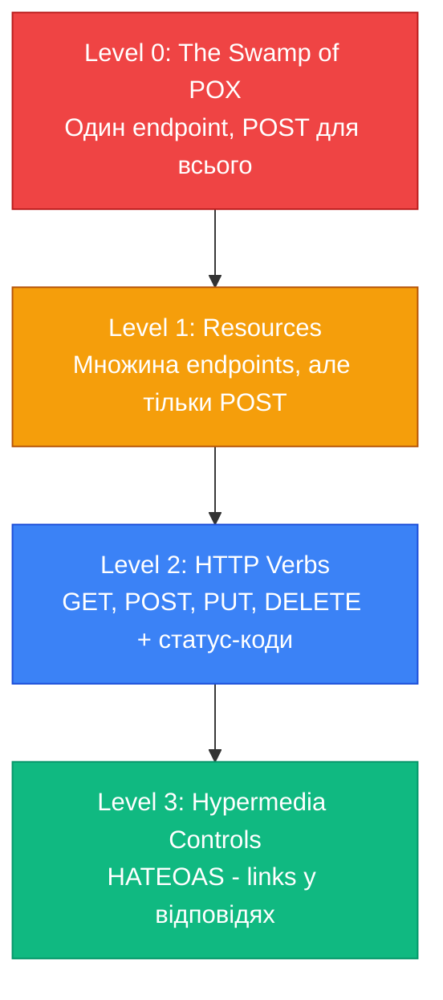

# HATEOAS та Resource Expansion

## Вступ: Проблема статичних API

Уявіть, що ви створили REST API для блогу:

```http
GET /api/articles/5
```

```json
{
  "id": 5,
  "title": "Introduction to ASP.NET Core",
  "authorId": 42,
  "categoryId": 3,
  "publishedAt": "2024-01-15T10:00:00Z"
}
```

**Що має зробити клієнт далі?**

Клієнт бачить `authorId: 42`, але **не знає**:

- ❌ Як отримати інформацію про автора?
- ❌ Який URL використовувати? `/api/authors/42`? `/api/users/42`?
- ❌ Які дії доступні? Можна редагувати? Видалити?
- ❌ Як отримати коментарі до статті?

**Типовий підхід — документація:**

```
Документація API:
- Отримати автора: GET /api/authors/{id}
- Отримати коментарі: GET /api/articles/{id}/comments
- Редагувати статтю: PUT /api/articles/{id} (потрібна роль Editor)
- Видалити статтю: DELETE /api/articles/{id} (потрібна роль Admin)
```

**Проблеми цього підходу:**

- ❌ Клієнт має **хардкодити** URL-и
- ❌ Документація може **застаріти**
- ❌ Клієнт не знає, **які дії доступні** для конкретного користувача
- ❌ Зміна URL-структури **ламає всіх клієнтів**

**Реальний сценарій:**

```javascript
// Клієнтський код (хардкод URL)
const article = await fetch('/api/articles/5').then(r => r.json());
const author = await fetch(`/api/authors/${article.authorId}`).then(r => r.json());

// ❌ Що якщо API змінить URL на /api/users/{id}?
// ❌ Що якщо authorId більше не повертається?
// ❌ Клієнт зламається!
```

**Рішення** — **HATEOAS (Hypermedia as the Engine of Application State)** — принцип REST, де API **сам повідомляє клієнту**, які дії та ресурси доступні через **гіперпосилання**.

::note
**Передумови:** Ця стаття базується на знаннях з попередніх статей (01-07 Web API Controllers), а також на розумінні REST теорії з курсу API Design (статті 01-06).
::

### Що ви створите в цій статті

Ми побудуємо **Blog API** з **HATEOAS** та **Resource Expansion**:

**1. HATEOAS Links — Self-Discoverable API:**
```json
{
  "id": 5,
  "title": "Introduction to ASP.NET Core",
  "_links": {
    "self": { "href": "/api/articles/5" },
    "author": { "href": "/api/authors/42" },
    "comments": { "href": "/api/articles/5/comments" },
    "edit": { "href": "/api/articles/5", "method": "PUT" },
    "delete": { "href": "/api/articles/5", "method": "DELETE" }
  }
}
```

**2. Resource Expansion — Embedded Resources:**
```http
GET /api/articles/5?expand=author,comments
```

```json
{
  "id": 5,
  "title": "Introduction to ASP.NET Core",
  "_embedded": {
    "author": {
      "id": 42,
      "name": "John Doe",
      "email": "john@example.com"
    },
    "comments": [
      { "id": 1, "text": "Great article!", "author": "Jane" },
      { "id": 2, "text": "Thanks for sharing", "author": "Bob" }
    ]
  },
  "_links": { ... }
}
```

**3. Sparse Fieldsets — Вибіркові поля:**
```http
GET /api/articles?fields=id,title,author
```

**4. HAL (Hypertext Application Language) формат:**
```json
{
  "_links": { "self": { "href": "/api/articles" } },
  "_embedded": {
    "articles": [
      { "id": 1, "title": "Article 1", "_links": { ... } },
      { "id": 2, "title": "Article 2", "_links": { ... } }
    ]
  },
  "page": 1,
  "totalPages": 10
}
```

До кінця статті ви зможете:

- Реалізувати HATEOAS links через `LinkGenerator`
- Створювати self-discoverable API
- Використовувати resource expansion для зменшення кількості запитів
- Реалізувати HAL формат
- Застосовувати sparse fieldsets для оптимізації

---

## Фундаментальні концепції

### Richardson Maturity Model

REST API має **4 рівні зрілості** (Richardson Maturity Model):

::mermaid

::

**Level 0 — The Swamp of POX (Plain Old XML):**
```http
POST /api
{ "action": "getArticle", "id": 5 }
```

**Level 1 — Resources:**
```http
POST /api/articles/5
{ "action": "get" }
```

**Level 2 — HTTP Verbs (більшість сучасних API):**
```http
GET /api/articles/5
PUT /api/articles/5
DELETE /api/articles/5
```

**Level 3 — Hypermedia Controls (HATEOAS):**
```json
{
  "id": 5,
  "title": "Article",
  "_links": {
    "self": { "href": "/api/articles/5" },
    "edit": { "href": "/api/articles/5", "method": "PUT" },
    "delete": { "href": "/api/articles/5", "method": "DELETE" }
  }
}
```

::tip
**Більшість API знаходяться на Level 2.** Level 3 (HATEOAS) — це **ідеал REST**, але він вимагає більше зусиль і не завжди виправданий для простих API.
::

### HATEOAS: Переваги та недоліки

**Переваги:**

✅ **Decoupling** — клієнт не хардкодить URL-и  
✅ **Evolvability** — можна змінювати URL-структуру без ламання клієнтів  
✅ **Discoverability** — API самодокументується  
✅ **Dynamic behavior** — сервер контролює, які дії доступні  
✅ **Versioning** — легше підтримувати кілька версій API

**Недоліки:**

❌ **Складність** — більше коду на сервері та клієнті  
❌ **Розмір відповіді** — links збільшують payload  
❌ **Підтримка клієнтів** — не всі клієнти вміють працювати з HATEOAS  
❌ **Overkill** — для простих CRUD API може бути надмірним

### HAL (Hypertext Application Language)

**HAL** — стандартний формат для HATEOAS API:

```json
{
  "_links": {
    "self": { "href": "/api/articles/5" },
    "author": { "href": "/api/authors/42", "title": "John Doe" }
  },
  "_embedded": {
    "comments": [
      {
        "id": 1,
        "text": "Great!",
        "_links": { "self": { "href": "/api/comments/1" } }
      }
    ]
  },
  "id": 5,
  "title": "Article Title"
}
```

**Ключові елементи:**

- **`_links`** — навігаційні посилання
- **`_embedded`** — вбудовані ресурси (для зменшення кількості запитів)
- **`self`** — обов'язкове посилання на сам ресурс
- **`href`** — URL ресурсу
- **`title`** — опис посилання (опціонально)

---

## Практична реалізація: Blog API з HATEOAS

### Крок 1: Налаштування проєкту

::steps

### Створення проєкту

::terminal-preview{title="bash"}
<div class="line"><span class="opacity-40">$</span> <strong class="font-bold">dotnet new webapi -n BlogHateoasApi</strong></div>
<div class="line"><span class="text-green-400 font-bold">The template "ASP.NET Core Web API" was created successfully.</span></div>
<div class="line"></div>
<div class="line"><span class="opacity-40">$</span> <strong class="font-bold">cd BlogHateoasApi</strong></div>
<div class="line"><span class="opacity-40">$</span> <strong class="font-bold">dotnet add package Microsoft.EntityFrameworkCore.InMemory</strong></div>
<div class="line"><span class="text-blue-400">info</span> : PackageReference added successfully</div>
::

### Створення моделей

Створіть файл `Models/Article.cs`:

```csharp
namespace BlogHateoasApi.Models;

public class Article
{
    public int Id { get; set; }
    public required string Title { get; set; }
    public required string Content { get; set; }
    public int AuthorId { get; set; }
    public Author? Author { get; set; }
    public int CategoryId { get; set; }
    public Category? Category { get; set; }
    public List<Comment> Comments { get; set; } = new();
    public DateTime PublishedAt { get; set; } = DateTime.UtcNow;
    public DateTime? UpdatedAt { get; set; }
    public ArticleStatus Status { get; set; } = ArticleStatus.Draft;
}

public enum ArticleStatus
{
    Draft,
    Published,
    Archived
}

public class Author
{
    public int Id { get; set; }
    public required string Name { get; set; }
    public required string Email { get; set; }
    public string? Bio { get; set; }
    public List<Article> Articles { get; set; } = new();
}

public class Category
{
    public int Id { get; set; }
    public required string Name { get; set; }
    public string? Description { get; set; }
    public List<Article> Articles { get; set; } = new();
}

public class Comment
{
    public int Id { get; set; }
    public required string Text { get; set; }
    public required string AuthorName { get; set; }
    public int ArticleId { get; set; }
    public Article? Article { get; set; }
    public DateTime CreatedAt { get; set; } = DateTime.UtcNow;
}
```

**Декомпозиція:**

- **`Article`** — основна сутність з навігаційними властивостями
- **`Author`, `Category`** — пов'язані ресурси для expansion
- **`Comment`** — вкладений ресурс (один-до-багатьох)
- **`ArticleStatus`** — для демонстрації conditional links (draft можна редагувати, archived — ні)

::

---

### Крок 2: HATEOAS Infrastructure

#### 1. Link DTO

Створіть файл `Models/Link.cs`:

```csharp
namespace BlogHateoasApi.Models;

public class Link
{
    public required string Href { get; set; }
    public string? Rel { get; set; }
    public string? Method { get; set; } = "GET";
    public string? Title { get; set; }
}

public class ResourceWithLinks
{
    public Dictionary<string, Link> Links { get; set; } = new();
}
```

**Декомпозиція:**

- **`Href`** — URL ресурсу
- **`Rel`** — тип зв'язку (self, author, edit, delete)
- **`Method`** — HTTP метод (GET, POST, PUT, DELETE)
- **`Title`** — опис посилання (для UI)

#### 2. LinkGenerator Helper

Створіть файл `Helpers/LinkGeneratorHelper.cs`:

```csharp
using BlogHateoasApi.Models;
using Microsoft.AspNetCore.Mvc;

namespace BlogHateoasApi.Helpers;

public static class LinkGeneratorHelper
{
    public static Dictionary<string, Link> GenerateArticleLinks(
        int articleId,
        ArticleStatus status,
        IUrlHelper urlHelper,
        bool isOwner = false)
    {
        var links = new Dictionary<string, Link>
        {
            ["self"] = new Link
            {
                Href = urlHelper.Action("GetById", "Articles", new { id = articleId })!,
                Rel = "self",
                Method = "GET",
                Title = "Get article details"
            },
            ["author"] = new Link
            {
                Href = urlHelper.Action("GetById", "Authors", new { id = "{authorId}" })!,
                Rel = "author",
                Method = "GET",
                Title = "Get article author"
            },
            ["comments"] = new Link
            {
                Href = urlHelper.Action("GetComments", "Articles", new { id = articleId })!,
                Rel = "comments",
                Method = "GET",
                Title = "Get article comments"
            },
            ["category"] = new Link
            {
                Href = urlHelper.Action("GetById", "Categories", new { id = "{categoryId}" })!,
                Rel = "category",
                Method = "GET",
                Title = "Get article category"
            }
        };

        // Conditional links based on status and ownership
        if (status == ArticleStatus.Draft && isOwner)
        {
            links["publish"] = new Link
            {
                Href = urlHelper.Action("Publish", "Articles", new { id = articleId })!,
                Rel = "publish",
                Method = "POST",
                Title = "Publish article"
            };
        }

        if (status != ArticleStatus.Archived && isOwner)
        {
            links["edit"] = new Link
            {
                Href = urlHelper.Action("Update", "Articles", new { id = articleId })!,
                Rel = "edit",
                Method = "PUT",
                Title = "Update article"
            };

            links["delete"] = new Link
            {
                Href = urlHelper.Action("Delete", "Articles", new { id = articleId })!,
                Rel = "delete",
                Method = "DELETE",
                Title = "Delete article"
            };
        }

        if (status == ArticleStatus.Published)
        {
            links["archive"] = new Link
            {
                Href = urlHelper.Action("Archive", "Articles", new { id = articleId })!,
                Rel = "archive",
                Method = "POST",
                Title = "Archive article"
            };
        }

        return links;
    }

    public static Dictionary<string, Link> GenerateCollectionLinks(
        IUrlHelper urlHelper,
        string action,
        string controller,
        int page,
        int totalPages)
    {
        var links = new Dictionary<string, Link>
        {
            ["self"] = new Link
            {
                Href = urlHelper.Action(action, controller, new { page })!,
                Rel = "self"
            }
        };

        if (page > 1)
        {
            links["first"] = new Link
            {
                Href = urlHelper.Action(action, controller, new { page = 1 })!,
                Rel = "first"
            };

            links["prev"] = new Link
            {
                Href = urlHelper.Action(action, controller, new { page = page - 1 })!,
                Rel = "prev"
            };
        }

        if (page < totalPages)
        {
            links["next"] = new Link
            {
                Href = urlHelper.Action(action, controller, new { page = page + 1 })!,
                Rel = "next"
            };

            links["last"] = new Link
            {
                Href = urlHelper.Action(action, controller, new { page = totalPages })!,
                Rel = "last"
            };
        }

        return links;
    }
}
```

**Декомпозиція:**

1. **`IUrlHelper`** — ASP.NET Core сервіс для генерації URL-ів
2. **Conditional links** — різні links залежно від статусу та прав
3. **`{authorId}` placeholder** — буде замінено на фактичний ID
4. **Collection links** — для пагінованих списків

::tip
**`IUrlHelper`** автоматично генерує правильні URL-и з урахуванням routing конфігурації. Якщо змінити маршрут, links оновляться автоматично.
::

---

### Крок 3: Resource DTOs з HATEOAS

#### ArticleDto з Links

Створіть файл `Models/DTOs/ArticleDto.cs`:

```csharp
using System.Text.Json.Serialization;

namespace BlogHateoasApi.Models.DTOs;

public class ArticleDto
{
    public int Id { get; set; }
    public required string Title { get; set; }
    public required string Content { get; set; }
    public int AuthorId { get; set; }
    public int CategoryId { get; set; }
    public DateTime PublishedAt { get; set; }
    public DateTime? UpdatedAt { get; set; }
    public string Status { get; set; } = "";

    [JsonPropertyName("_links")]
    public Dictionary<string, Link>? Links { get; set; }

    [JsonPropertyName("_embedded")]
    public EmbeddedResources? Embedded { get; set; }
}

public class EmbeddedResources
{
    public AuthorDto? Author { get; set; }
    public CategoryDto? Category { get; set; }
    public List<CommentDto>? Comments { get; set; }
}

public class AuthorDto
{
    public int Id { get; set; }
    public required string Name { get; set; }
    public required string Email { get; set; }
    public string? Bio { get; set; }

    [JsonPropertyName("_links")]
    public Dictionary<string, Link>? Links { get; set; }
}

public class CategoryDto
{
    public int Id { get; set; }
    public required string Name { get; set; }
    public string? Description { get; set; }

    [JsonPropertyName("_links")]
    public Dictionary<string, Link>? Links { get; set; }
}

public class CommentDto
{
    public int Id { get; set; }
    public required string Text { get; set; }
    public required string AuthorName { get; set; }
    public DateTime CreatedAt { get; set; }

    [JsonPropertyName("_links")]
    public Dictionary<string, Link>? Links { get; set; }
}
```

**Декомпозиція:**

1. **`[JsonPropertyName("_links")]`** — HAL стандарт використовує `_links`
2. **`_embedded`** — вбудовані ресурси (для expansion)
3. **Nullable `Links`** — можна вимкнути HATEOAS для певних endpoints
4. **Окремі DTO** — для кожного типу ресурсу

---

### Крок 4: Resource Expansion Infrastructure

#### ExpansionHelper

Створіть файл `Helpers/ExpansionHelper.cs`:

```csharp
namespace BlogHateoasApi.Helpers;

public class ExpansionOptions
{
    public bool IncludeAuthor { get; set; }
    public bool IncludeCategory { get; set; }
    public bool IncludeComments { get; set; }

    public static ExpansionOptions Parse(string? expand)
    {
        if (string.IsNullOrWhiteSpace(expand))
            return new ExpansionOptions();

        var parts = expand.Split(',', StringSplitOptions.RemoveEmptyEntries)
            .Select(p => p.Trim().ToLower())
            .ToHashSet();

        return new ExpansionOptions
        {
            IncludeAuthor = parts.Contains("author"),
            IncludeCategory = parts.Contains("category"),
            IncludeComments = parts.Contains("comments")
        };
    }
}
```

**Використання:**

```csharp
var options = ExpansionOptions.Parse("author,comments");
// options.IncludeAuthor = true
// options.IncludeComments = true
// options.IncludeCategory = false
```

---

### Крок 5: DbContext та Seed Data

Створіть файл `Data/BlogDbContext.cs`:

```csharp
using Microsoft.EntityFrameworkCore;
using BlogHateoasApi.Models;

namespace BlogHateoasApi.Data;

public class BlogDbContext : DbContext
{
    public BlogDbContext(DbContextOptions<BlogDbContext> options) : base(options) { }

    public DbSet<Article> Articles => Set<Article>();
    public DbSet<Author> Authors => Set<Author>();
    public DbSet<Category> Categories => Set<Category>();
    public DbSet<Comment> Comments => Set<Comment>();

    protected override void OnModelCreating(ModelBuilder modelBuilder)
    {
        // Seed Authors
        modelBuilder.Entity<Author>().HasData(
            new Author { Id = 1, Name = "John Doe", Email = "john@example.com", Bio = "Senior Developer" },
            new Author { Id = 2, Name = "Jane Smith", Email = "jane@example.com", Bio = "Tech Writer" }
        );

        // Seed Categories
        modelBuilder.Entity<Category>().HasData(
            new Category { Id = 1, Name = "Technology", Description = "Tech articles" },
            new Category { Id = 2, Name = "Programming", Description = "Programming tutorials" }
        );

        // Seed Articles
        modelBuilder.Entity<Article>().HasData(
            new Article
            {
                Id = 1,
                Title = "Introduction to ASP.NET Core",
                Content = "ASP.NET Core is a cross-platform framework...",
                AuthorId = 1,
                CategoryId = 2,
                Status = ArticleStatus.Published,
                PublishedAt = DateTime.UtcNow.AddDays(-10)
            },
            new Article
            {
                Id = 2,
                Title = "Getting Started with HATEOAS",
                Content = "HATEOAS is a constraint of REST...",
                AuthorId = 2,
                CategoryId = 1,
                Status = ArticleStatus.Draft,
                PublishedAt = DateTime.UtcNow.AddDays(-5)
            },
            new Article
            {
                Id = 3,
                Title = "REST API Best Practices",
                Content = "Building great APIs requires...",
                AuthorId = 1,
                CategoryId = 2,
                Status = ArticleStatus.Published,
                PublishedAt = DateTime.UtcNow.AddDays(-3)
            }
        );

        // Seed Comments
        modelBuilder.Entity<Comment>().HasData(
            new Comment { Id = 1, ArticleId = 1, Text = "Great article!", AuthorName = "Bob", CreatedAt = DateTime.UtcNow.AddDays(-9) },
            new Comment { Id = 2, ArticleId = 1, Text = "Very helpful, thanks!", AuthorName = "Alice", CreatedAt = DateTime.UtcNow.AddDays(-8) },
            new Comment { Id = 3, ArticleId = 3, Text = "Looking forward to more!", AuthorName = "Charlie", CreatedAt = DateTime.UtcNow.AddDays(-2) }
        );
    }
}
```


---

### Крок 6: Articles Controller з HATEOAS

Створіть файл `Controllers/ArticlesController.cs`:

```csharp
using Microsoft.AspNetCore.Mvc;
using Microsoft.EntityFrameworkCore;
using BlogHateoasApi.Data;
using BlogHateoasApi.Models;
using BlogHateoasApi.Models.DTOs;
using BlogHateoasApi.Helpers;

namespace BlogHateoasApi.Controllers;

[ApiController]
[Route("api/[controller]")]
public class ArticlesController : ControllerBase
{
    private readonly BlogDbContext _db;
    private readonly ILogger<ArticlesController> _logger;
    private readonly IUrlHelper _urlHelper;

    public ArticlesController(
        BlogDbContext db,
        ILogger<ArticlesController> logger,
        IUrlHelperFactory urlHelperFactory,
        IActionContextAccessor actionContextAccessor)
    {
        _db = db;
        _logger = logger;
        _urlHelper = urlHelperFactory.GetUrlHelper(actionContextAccessor.ActionContext!);
    }

    /// <summary>
    /// Отримати статтю за ID з HATEOAS links та опціональним expansion
    /// </summary>
    /// <param name="id">ID статті</param>
    /// <param name="expand">Ресурси для expansion (author,category,comments)</param>
    [HttpGet("{id:int}", Name = "GetArticleById")]
    [ProducesResponseType(typeof(ArticleDto), StatusCodes.Status200OK)]
    [ProducesResponseType(StatusCodes.Status404NotFound)]
    public async Task<ActionResult<ArticleDto>> GetById(
        int id,
        [FromQuery] string? expand = null)
    {
        var expansionOptions = ExpansionOptions.Parse(expand);

        // Базовий query
        var query = _db.Articles.AsQueryable();

        // Eager loading залежно від expansion
        if (expansionOptions.IncludeAuthor)
            query = query.Include(a => a.Author);

        if (expansionOptions.IncludeCategory)
            query = query.Include(a => a.Category);

        if (expansionOptions.IncludeComments)
            query = query.Include(a => a.Comments);

        var article = await query.FirstOrDefaultAsync(a => a.Id == id);

        if (article is null)
            return NotFound();

        // Мапінг до DTO
        var dto = MapToDto(article, expansionOptions);

        // Генерація HATEOAS links
        dto.Links = LinkGeneratorHelper.GenerateArticleLinks(
            article.Id,
            article.Status,
            _urlHelper,
            isOwner: true); // У production перевіряти реального користувача

        // Заміна placeholders у links
        dto.Links["author"].Href = dto.Links["author"].Href.Replace("{authorId}", article.AuthorId.ToString());
        dto.Links["category"].Href = dto.Links["category"].Href.Replace("{categoryId}", article.CategoryId.ToString());

        return Ok(dto);
    }

    /// <summary>
    /// Отримати всі статті з пагінацією та HATEOAS
    /// </summary>
    [HttpGet(Name = "GetArticles")]
    [ProducesResponseType(typeof(object), StatusCodes.Status200OK)]
    public async Task<IActionResult> GetAll(
        [FromQuery] int page = 1,
        [FromQuery] int pageSize = 10)
    {
        var totalCount = await _db.Articles.CountAsync();
        var totalPages = (int)Math.Ceiling(totalCount / (double)pageSize);

        var articles = await _db.Articles
            .OrderByDescending(a => a.PublishedAt)
            .Skip((page - 1) * pageSize)
            .Take(pageSize)
            .ToListAsync();

        var dtos = articles.Select(a =>
        {
            var dto = MapToDto(a, new ExpansionOptions());
            dto.Links = LinkGeneratorHelper.GenerateArticleLinks(
                a.Id,
                a.Status,
                _urlHelper,
                isOwner: true);
            return dto;
        }).ToList();

        var collectionLinks = LinkGeneratorHelper.GenerateCollectionLinks(
            _urlHelper,
            "GetArticles",
            "Articles",
            page,
            totalPages);

        var response = new
        {
            _links = collectionLinks,
            _embedded = new { articles = dtos },
            page,
            pageSize,
            totalCount,
            totalPages
        };

        return Ok(response);
    }

    /// <summary>
    /// Отримати коментарі до статті
    /// </summary>
    [HttpGet("{id:int}/comments", Name = "GetArticleComments")]
    [ProducesResponseType(typeof(List<CommentDto>), StatusCodes.Status200OK)]
    public async Task<ActionResult<List<CommentDto>>> GetComments(int id)
    {
        var article = await _db.Articles
            .Include(a => a.Comments)
            .FirstOrDefaultAsync(a => a.Id == id);

        if (article is null)
            return NotFound();

        var dtos = article.Comments.Select(c => new CommentDto
        {
            Id = c.Id,
            Text = c.Text,
            AuthorName = c.AuthorName,
            CreatedAt = c.CreatedAt,
            Links = new Dictionary<string, Link>
            {
                ["self"] = new Link
                {
                    Href = _urlHelper.Action("GetCommentById", "Comments", new { id = c.Id })!,
                    Rel = "self"
                },
                ["article"] = new Link
                {
                    Href = _urlHelper.Action("GetById", "Articles", new { id = article.Id })!,
                    Rel = "article"
                }
            }
        }).ToList();

        return Ok(dtos);
    }

    /// <summary>
    /// Створити нову статтю
    /// </summary>
    [HttpPost(Name = "CreateArticle")]
    [ProducesResponseType(typeof(ArticleDto), StatusCodes.Status201Created)]
    public async Task<ActionResult<ArticleDto>> Create([FromBody] CreateArticleDto dto)
    {
        var article = new Article
        {
            Title = dto.Title,
            Content = dto.Content,
            AuthorId = dto.AuthorId,
            CategoryId = dto.CategoryId,
            Status = ArticleStatus.Draft
        };

        _db.Articles.Add(article);
        await _db.SaveChangesAsync();

        var resultDto = MapToDto(article, new ExpansionOptions());
        resultDto.Links = LinkGeneratorHelper.GenerateArticleLinks(
            article.Id,
            article.Status,
            _urlHelper,
            isOwner: true);

        return CreatedAtAction(
            nameof(GetById),
            new { id = article.Id },
            resultDto);
    }

    /// <summary>
    /// Опублікувати статтю (змінити статус на Published)
    /// </summary>
    [HttpPost("{id:int}/publish", Name = "PublishArticle")]
    [ProducesResponseType(typeof(ArticleDto), StatusCodes.Status200OK)]
    [ProducesResponseType(StatusCodes.Status404NotFound)]
    [ProducesResponseType(StatusCodes.Status400BadRequest)]
    public async Task<ActionResult<ArticleDto>> Publish(int id)
    {
        var article = await _db.Articles.FindAsync(id);

        if (article is null)
            return NotFound();

        if (article.Status != ArticleStatus.Draft)
            return BadRequest(new ProblemDetails
            {
                Title = "Invalid Operation",
                Detail = "Only draft articles can be published"
            });

        article.Status = ArticleStatus.Published;
        article.PublishedAt = DateTime.UtcNow;
        await _db.SaveChangesAsync();

        var dto = MapToDto(article, new ExpansionOptions());
        dto.Links = LinkGeneratorHelper.GenerateArticleLinks(
            article.Id,
            article.Status,
            _urlHelper,
            isOwner: true);

        return Ok(dto);
    }

    /// <summary>
    /// Архівувати статтю
    /// </summary>
    [HttpPost("{id:int}/archive", Name = "ArchiveArticle")]
    [ProducesResponseType(typeof(ArticleDto), StatusCodes.Status200OK)]
    public async Task<ActionResult<ArticleDto>> Archive(int id)
    {
        var article = await _db.Articles.FindAsync(id);

        if (article is null)
            return NotFound();

        article.Status = ArticleStatus.Archived;
        await _db.SaveChangesAsync();

        var dto = MapToDto(article, new ExpansionOptions());
        dto.Links = LinkGeneratorHelper.GenerateArticleLinks(
            article.Id,
            article.Status,
            _urlHelper,
            isOwner: true);

        return Ok(dto);
    }

    /// <summary>
    /// Оновити статтю
    /// </summary>
    [HttpPut("{id:int}", Name = "UpdateArticle")]
    [ProducesResponseType(typeof(ArticleDto), StatusCodes.Status200OK)]
    public async Task<ActionResult<ArticleDto>> Update(int id, [FromBody] UpdateArticleDto dto)
    {
        var article = await _db.Articles.FindAsync(id);

        if (article is null)
            return NotFound();

        article.Title = dto.Title;
        article.Content = dto.Content;
        article.UpdatedAt = DateTime.UtcNow;

        await _db.SaveChangesAsync();

        var resultDto = MapToDto(article, new ExpansionOptions());
        resultDto.Links = LinkGeneratorHelper.GenerateArticleLinks(
            article.Id,
            article.Status,
            _urlHelper,
            isOwner: true);

        return Ok(resultDto);
    }

    /// <summary>
    /// Видалити статтю
    /// </summary>
    [HttpDelete("{id:int}", Name = "DeleteArticle")]
    [ProducesResponseType(StatusCodes.Status204NoContent)]
    public async Task<IActionResult> Delete(int id)
    {
        var article = await _db.Articles.FindAsync(id);

        if (article is null)
            return NotFound();

        _db.Articles.Remove(article);
        await _db.SaveChangesAsync();

        return NoContent();
    }

    private ArticleDto MapToDto(Article article, ExpansionOptions options)
    {
        var dto = new ArticleDto
        {
            Id = article.Id,
            Title = article.Title,
            Content = article.Content,
            AuthorId = article.AuthorId,
            CategoryId = article.CategoryId,
            PublishedAt = article.PublishedAt,
            UpdatedAt = article.UpdatedAt,
            Status = article.Status.ToString()
        };

        // Resource expansion
        if (options.IncludeAuthor || options.IncludeCategory || options.IncludeComments)
        {
            dto.Embedded = new EmbeddedResources();

            if (options.IncludeAuthor && article.Author != null)
            {
                dto.Embedded.Author = new AuthorDto
                {
                    Id = article.Author.Id,
                    Name = article.Author.Name,
                    Email = article.Author.Email,
                    Bio = article.Author.Bio,
                    Links = new Dictionary<string, Link>
                    {
                        ["self"] = new Link
                        {
                            Href = _urlHelper.Action("GetById", "Authors", new { id = article.Author.Id })!,
                            Rel = "self"
                        }
                    }
                };
            }

            if (options.IncludeCategory && article.Category != null)
            {
                dto.Embedded.Category = new CategoryDto
                {
                    Id = article.Category.Id,
                    Name = article.Category.Name,
                    Description = article.Category.Description,
                    Links = new Dictionary<string, Link>
                    {
                        ["self"] = new Link
                        {
                            Href = _urlHelper.Action("GetById", "Categories", new { id = article.Category.Id })!,
                            Rel = "self"
                        }
                    }
                };
            }

            if (options.IncludeComments && article.Comments.Any())
            {
                dto.Embedded.Comments = article.Comments.Select(c => new CommentDto
                {
                    Id = c.Id,
                    Text = c.Text,
                    AuthorName = c.AuthorName,
                    CreatedAt = c.CreatedAt
                }).ToList();
            }
        }

        return dto;
    }
}

// DTOs для створення/оновлення
public record CreateArticleDto
{
    public required string Title { get; init; }
    public required string Content { get; init; }
    public int AuthorId { get; init; }
    public int CategoryId { get; init; }
}

public record UpdateArticleDto
{
    public required string Title { get; init; }
    public required string Content { get; init; }
}
```

**Декомпозиція:**

1. **`IUrlHelper` injection** — через `IUrlHelperFactory` та `IActionContextAccessor`
2. **Conditional eager loading** — завантажуємо пов'язані дані тільки якщо потрібно
3. **`MapToDto`** — централізована логіка мапінгу з expansion
4. **Conditional links** — різні links для draft/published/archived
5. **HAL формат** — `_links` та `_embedded` у відповідях

---

### Крок 7: Program.cs Configuration

```csharp
using Microsoft.EntityFrameworkCore;
using BlogHateoasApi.Data;

var builder = WebApplication.CreateBuilder(args);

// DbContext
builder.Services.AddDbContext<BlogDbContext>(options =>
    options.UseInMemoryDatabase("BlogDb"));

// IUrlHelper dependencies
builder.Services.AddHttpContextAccessor();
builder.Services.AddSingleton<IActionContextAccessor, ActionContextAccessor>();

builder.Services.AddControllers();
builder.Services.AddEndpointsApiExplorer();
builder.Services.AddSwaggerGen();

var app = builder.Build();

// Seed database
using (var scope = app.Services.CreateScope())
{
    var db = scope.ServiceProvider.GetRequiredService<BlogDbContext>();
    db.Database.EnsureCreated();
}

if (app.Environment.IsDevelopment())
{
    app.UseSwagger();
    app.UseSwaggerUI();
}

app.UseHttpsRedirection();
app.UseAuthorization();
app.MapControllers();

app.Run();
```

**Важливо:** Реєструємо `IActionContextAccessor` для доступу до `IUrlHelper`.

---

### Крок 8: Тестування HATEOAS

::terminal-preview{title="bash"}
<div class="line"><span class="opacity-40">$</span> <strong class="font-bold">dotnet run</strong></div>
<div class="line"><span class="text-green-400 font-bold">info</span>: Now listening on: https://localhost:5001</div>
<div class="line"></div>
<div class="line"><span class="opacity-40"># Тест 1: Базовий запит (без expansion)</span></div>
<div class="line"><span class="opacity-40">$</span> <strong class="font-bold">curl https://localhost:5001/api/articles/1</strong></div>
<div class="line"><span class="text-green-400 font-bold">HTTP/1.1 200 OK</span></div>
<div class="line"><span class="text-blue-400">{</span></div>
<div class="line">  <span class="text-green-400">"id"</span>: 1,</div>
<div class="line">  <span class="text-green-400">"title"</span>: <span class="text-yellow-400">"Introduction to ASP.NET Core"</span>,</div>
<div class="line">  <span class="text-green-400">"authorId"</span>: 1,</div>
<div class="line">  <span class="text-green-400">"_links"</span>: <span class="text-blue-400">{</span></div>
<div class="line">    <span class="text-green-400">"self"</span>: <span class="text-blue-400">{ "href": "/api/articles/1", "method": "GET" }</span>,</div>
<div class="line">    <span class="text-green-400">"author"</span>: <span class="text-blue-400">{ "href": "/api/authors/1", "method": "GET" }</span>,</div>
<div class="line">    <span class="text-green-400">"comments"</span>: <span class="text-blue-400">{ "href": "/api/articles/1/comments" }</span>,</div>
<div class="line">    <span class="text-green-400">"archive"</span>: <span class="text-blue-400">{ "href": "/api/articles/1/archive", "method": "POST" }</span></div>
<div class="line">  <span class="text-blue-400">}</span></div>
<div class="line"><span class="text-blue-400">}</span></div>
<div class="line"></div>
<div class="line"><span class="opacity-40"># Тест 2: Resource expansion (author + comments)</span></div>
<div class="line"><span class="opacity-40">$</span> <strong class="font-bold">curl "https://localhost:5001/api/articles/1?expand=author,comments"</strong></div>
<div class="line"><span class="text-green-400 font-bold">HTTP/1.1 200 OK</span></div>
<div class="line"><span class="text-blue-400">{</span></div>
<div class="line">  <span class="text-green-400">"id"</span>: 1,</div>
<div class="line">  <span class="text-green-400">"title"</span>: <span class="text-yellow-400">"Introduction to ASP.NET Core"</span>,</div>
<div class="line">  <span class="text-green-400">"_embedded"</span>: <span class="text-blue-400">{</span></div>
<div class="line">    <span class="text-green-400">"author"</span>: <span class="text-blue-400">{</span></div>
<div class="line">      <span class="text-green-400">"id"</span>: 1,</div>
<div class="line">      <span class="text-green-400">"name"</span>: <span class="text-yellow-400">"John Doe"</span>,</div>
<div class="line">      <span class="text-green-400">"email"</span>: <span class="text-yellow-400">"john@example.com"</span></div>
<div class="line">    <span class="text-blue-400">}</span>,</div>
<div class="line">    <span class="text-green-400">"comments"</span>: [</div>
<div class="line">      <span class="text-blue-400">{ "id": 1, "text": "Great article!", "authorName": "Bob" }</span>,</div>
<div class="line">      <span class="text-blue-400">{ "id": 2, "text": "Very helpful!", "authorName": "Alice" }</span></div>
<div class="line">    ]</div>
<div class="line">  <span class="text-blue-400">}</span>,</div>
<div class="line">  <span class="text-green-400">"_links"</span>: <span class="text-blue-400">{ ... }</span></div>
<div class="line"><span class="text-blue-400">}</span></div>
<div class="line"></div>
<div class="line"><span class="opacity-40"># Тест 3: Draft article (різні links)</span></div>
<div class="line"><span class="opacity-40">$</span> <strong class="font-bold">curl https://localhost:5001/api/articles/2</strong></div>
<div class="line"><span class="text-green-400 font-bold">HTTP/1.1 200 OK</span></div>
<div class="line"><span class="text-blue-400">{</span></div>
<div class="line">  <span class="text-green-400">"id"</span>: 2,</div>
<div class="line">  <span class="text-green-400">"status"</span>: <span class="text-yellow-400">"Draft"</span>,</div>
<div class="line">  <span class="text-green-400">"_links"</span>: <span class="text-blue-400">{</span></div>
<div class="line">    <span class="text-green-400">"self"</span>: <span class="text-blue-400">{ "href": "/api/articles/2" }</span>,</div>
<div class="line">    <span class="text-green-400">"publish"</span>: <span class="text-blue-400">{ "href": "/api/articles/2/publish", "method": "POST" }</span>,</div>
<div class="line">    <span class="text-green-400">"edit"</span>: <span class="text-blue-400">{ "href": "/api/articles/2", "method": "PUT" }</span>,</div>
<div class="line">    <span class="text-green-400">"delete"</span>: <span class="text-blue-400">{ "href": "/api/articles/2", "method": "DELETE" }</span></div>
<div class="line">  <span class="text-blue-400">}</span></div>
<div class="line"><span class="text-blue-400">}</span></div>
<div class="line"></div>
<div class="line"><span class="opacity-40"># Тест 4: Колекція з пагінацією</span></div>
<div class="line"><span class="opacity-40">$</span> <strong class="font-bold">curl "https://localhost:5001/api/articles?page=1&pageSize=2"</strong></div>
<div class="line"><span class="text-green-400 font-bold">HTTP/1.1 200 OK</span></div>
<div class="line"><span class="text-blue-400">{</span></div>
<div class="line">  <span class="text-green-400">"_links"</span>: <span class="text-blue-400">{</span></div>
<div class="line">    <span class="text-green-400">"self"</span>: <span class="text-blue-400">{ "href": "/api/articles?page=1" }</span>,</div>
<div class="line">    <span class="text-green-400">"next"</span>: <span class="text-blue-400">{ "href": "/api/articles?page=2" }</span>,</div>
<div class="line">    <span class="text-green-400">"last"</span>: <span class="text-blue-400">{ "href": "/api/articles?page=2" }</span></div>
<div class="line">  <span class="text-blue-400">}</span>,</div>
<div class="line">  <span class="text-green-400">"_embedded"</span>: <span class="text-blue-400">{</span></div>
<div class="line">    <span class="text-green-400">"articles"</span>: [<span class="opacity-40">...</span>]</div>
<div class="line">  <span class="text-blue-400">}</span></div>
<div class="line"><span class="text-blue-400">}</span></div>
::

---

## Просунуті техніки

### 1. Sparse Fieldsets — Вибіркові поля

Дозволяє клієнту вибирати, які поля повертати:

```http
GET /api/articles/1?fields=id,title,author
→ Повертає тільки id, title, author (без content, publishedAt)
```

#### Implementation

```csharp
public class FieldSelectionHelper
{
    public static object SelectFields<T>(T source, string? fields)
    {
        if (string.IsNullOrWhiteSpace(fields))
            return source!;

        var fieldList = fields.Split(',', StringSplitOptions.RemoveEmptyEntries)
            .Select(f => f.Trim().ToLower())
            .ToHashSet();

        var result = new Dictionary<string, object?>();
        var properties = typeof(T).GetProperties();

        foreach (var prop in properties)
        {
            if (fieldList.Contains(prop.Name.ToLower()))
            {
                result[ToCamelCase(prop.Name)] = prop.GetValue(source);
            }
        }

        return result;
    }

    private static string ToCamelCase(string str)
    {
        if (string.IsNullOrEmpty(str) || char.IsLower(str[0]))
            return str;

        return char.ToLower(str[0]) + str.Substring(1);
    }
}
```

#### Використання у контролері

```csharp
[HttpGet("{id:int}")]
public async Task<IActionResult> GetById(
    int id,
    [FromQuery] string? expand = null,
    [FromQuery] string? fields = null)
{
    var article = await _db.Articles.FindAsync(id);
    if (article is null) return NotFound();

    var dto = MapToDto(article, ExpansionOptions.Parse(expand));
    dto.Links = LinkGeneratorHelper.GenerateArticleLinks(article.Id, article.Status, _urlHelper, true);

    // Застосовуємо field selection
    var result = FieldSelectionHelper.SelectFields(dto, fields);

    return Ok(result);
}
```

**Приклад:**

```http
GET /api/articles/1?fields=id,title,_links
```

```json
{
  "id": 1,
  "title": "Introduction to ASP.NET Core",
  "_links": { ... }
}
```

---

### 2. Conditional Links Based on Permissions

Генеруйте links залежно від прав користувача:

```csharp
public static Dictionary<string, Link> GenerateArticleLinks(
    int articleId,
    ArticleStatus status,
    IUrlHelper urlHelper,
    ClaimsPrincipal user) // Замість bool isOwner
{
    var links = new Dictionary<string, Link>
    {
        ["self"] = new Link { Href = urlHelper.Action("GetById", "Articles", new { id = articleId })! }
    };

    // Тільки автор може редагувати
    if (user.HasClaim("ArticleOwner", articleId.ToString()))
    {
        links["edit"] = new Link
        {
            Href = urlHelper.Action("Update", "Articles", new { id = articleId })!,
            Method = "PUT"
        };
    }

    // Тільки адміни можуть видаляти
    if (user.IsInRole("Admin"))
    {
        links["delete"] = new Link
        {
            Href = urlHelper.Action("Delete", "Articles", new { id = articleId })!,
            Method = "DELETE"
        };
    }

    return links;
}
```

**Результат для звичайного користувача:**

```json
{
  "_links": {
    "self": { "href": "/api/articles/1" }
  }
}
```

**Результат для автора:**

```json
{
  "_links": {
    "self": { "href": "/api/articles/1" },
    "edit": { "href": "/api/articles/1", "method": "PUT" }
  }
}
```

---

### 3. Link Templates (RFC 6570)

Для параметризованих links використовуйте URI Templates:

```csharp
links["search"] = new Link
{
    Href = "/api/articles{?category,author,page}",
    Templated = true,
    Title = "Search articles"
};
```

```json
{
  "_links": {
    "search": {
      "href": "/api/articles{?category,author,page}",
      "templated": true,
      "title": "Search articles"
    }
  }
}
```

Клієнт може підставити параметри:

```
/api/articles?category=tech&author=john&page=2
```

---

### 4. Curies (Compact URIs)

Для документації links використовуйте curies:

```json
{
  "_links": {
    "self": { "href": "/api/articles/1" },
    "curies": [{
      "name": "doc",
      "href": "https://api.example.com/docs/rels/{rel}",
      "templated": true
    }],
    "doc:author": { "href": "/api/authors/1" },
    "doc:comments": { "href": "/api/articles/1/comments" }
  }
}
```

Клієнт може отримати документацію:

```
https://api.example.com/docs/rels/author
→ Документація про rel "author"
```


---

## Практичні завдання

### Рівень 1: Базове розуміння

::steps

### Завдання 1.1: Richardson Maturity Model

Визначте рівень зрілості для кожного API:

**API A:**
```http
POST /api
{ "action": "getUser", "userId": 5 }
```

**API B:**
```http
GET /api/users/5
PUT /api/users/5
DELETE /api/users/5
```

**API C:**
```json
{
  "id": 5,
  "name": "John",
  "_links": {
    "self": { "href": "/api/users/5" },
    "edit": { "href": "/api/users/5", "method": "PUT" }
  }
}
```

::collapsible{title="Показати відповіді"}

- **API A:** Level 0 (The Swamp of POX) — один endpoint, POST для всього
- **API B:** Level 2 (HTTP Verbs) — використовує GET/PUT/DELETE та ресурси
- **API C:** Level 3 (Hypermedia Controls) — HATEOAS з `_links`

::

### Завдання 1.2: HAL формат

Який з цих JSON є валідним HAL форматом?

**Варіант A:**
```json
{
  "id": 1,
  "links": {
    "self": "/api/articles/1"
  }
}
```

**Варіант B:**
```json
{
  "id": 1,
  "_links": {
    "self": { "href": "/api/articles/1" }
  }
}
```

::collapsible{title="Показати відповідь"}

**Правильна відповідь: Варіант B**

HAL формат вимагає:
- `_links` (з підкресленням)
- Кожен link має бути об'єктом з `href` властивістю
- `self` link є обов'язковим

::

::

---

### Рівень 2: Логіка та розширення

::steps

### Завдання 2.1: Nested Resource Expansion

Реалізуйте вкладений expansion: `?expand=author.articles`:

::collapsible{title="Показати рішення"}

**1. Розширений ExpansionOptions:**

```csharp
public class ExpansionOptions
{
    public bool IncludeAuthor { get; set; }
    public bool IncludeAuthorArticles { get; set; }
    public bool IncludeCategory { get; set; }
    public bool IncludeComments { get; set; }

    public static ExpansionOptions Parse(string? expand)
    {
        if (string.IsNullOrWhiteSpace(expand))
            return new ExpansionOptions();

        var parts = expand.Split(',', StringSplitOptions.RemoveEmptyEntries)
            .Select(p => p.Trim().ToLower())
            .ToList();

        return new ExpansionOptions
        {
            IncludeAuthor = parts.Any(p => p.StartsWith("author")),
            IncludeAuthorArticles = parts.Contains("author.articles"),
            IncludeCategory = parts.Contains("category"),
            IncludeComments = parts.Contains("comments")
        };
    }
}
```

**2. Оновлений MapToDto:**

```csharp
private ArticleDto MapToDto(Article article, ExpansionOptions options)
{
    var dto = new ArticleDto { /* ... */ };

    if (options.IncludeAuthor && article.Author != null)
    {
        dto.Embedded ??= new EmbeddedResources();
        dto.Embedded.Author = new AuthorDto
        {
            Id = article.Author.Id,
            Name = article.Author.Name,
            Email = article.Author.Email,
            Bio = article.Author.Bio
        };

        // Nested expansion
        if (options.IncludeAuthorArticles)
        {
            dto.Embedded.Author.Articles = article.Author.Articles
                .Where(a => a.Id != article.Id) // Виключаємо поточну статтю
                .Take(5) // Обмежуємо кількість
                .Select(a => new ArticleSummaryDto
                {
                    Id = a.Id,
                    Title = a.Title,
                    PublishedAt = a.PublishedAt
                })
                .ToList();
        }
    }

    return dto;
}
```

**3. Eager loading у контролері:**

```csharp
if (expansionOptions.IncludeAuthorArticles)
{
    query = query.Include(a => a.Author)
                 .ThenInclude(author => author.Articles);
}
```

**Результат:**

```http
GET /api/articles/1?expand=author.articles
```

```json
{
  "id": 1,
  "title": "Introduction to ASP.NET Core",
  "_embedded": {
    "author": {
      "id": 1,
      "name": "John Doe",
      "articles": [
        { "id": 3, "title": "REST API Best Practices" },
        { "id": 5, "title": "Microservices Architecture" }
      ]
    }
  }
}
```

::

### Завдання 2.2: Expansion Depth Limit

Додайте обмеження глибини expansion для захисту від зловживань:

::collapsible{title="Показати рішення"}

```csharp
public class ExpansionOptions
{
    private const int MaxDepth = 2;
    public int CurrentDepth { get; private set; }

    public bool IncludeAuthor { get; set; }
    public bool IncludeAuthorArticles { get; set; }

    public static ExpansionOptions Parse(string? expand, int depth = 0)
    {
        if (depth > MaxDepth)
        {
            throw new ArgumentException($"Expansion depth cannot exceed {MaxDepth}");
        }

        if (string.IsNullOrWhiteSpace(expand))
            return new ExpansionOptions { CurrentDepth = depth };

        var parts = expand.Split(',', StringSplitOptions.RemoveEmptyEntries)
            .Select(p => p.Trim().ToLower())
            .ToList();

        // Підраховуємо максимальну глибину
        var maxRequestedDepth = parts
            .Select(p => p.Count(c => c == '.') + 1)
            .DefaultIfEmpty(0)
            .Max();

        if (maxRequestedDepth > MaxDepth)
        {
            throw new ArgumentException($"Expansion depth {maxRequestedDepth} exceeds maximum {MaxDepth}");
        }

        return new ExpansionOptions
        {
            CurrentDepth = depth,
            IncludeAuthor = parts.Any(p => p.StartsWith("author")),
            IncludeAuthorArticles = parts.Contains("author.articles")
        };
    }
}
```

**Обробка помилки у контролері:**

```csharp
try
{
    var expansionOptions = ExpansionOptions.Parse(expand);
    // ...
}
catch (ArgumentException ex)
{
    return BadRequest(new ProblemDetails
    {
        Title = "Invalid Expansion",
        Detail = ex.Message
    });
}
```

**Тестування:**

```http
GET /api/articles/1?expand=author.articles.author.articles
→ 400 Bad Request: "Expansion depth 3 exceeds maximum 2"
```

::

### Завдання 2.3: Conditional Expansion

Дозволяйте expansion тільки для певних ролей:

::collapsible{title="Показати рішення"}

```csharp
public class ExpansionValidator
{
    private static readonly Dictionary<string, string[]> ExpansionPermissions = new()
    {
        ["author"] = new[] { "User", "Admin" },
        ["author.articles"] = new[] { "Admin" },
        ["comments"] = new[] { "User", "Admin" },
        ["category"] = new[] { "User", "Admin" }
    };

    public static (bool IsValid, string? Error) Validate(
        string? expand,
        ClaimsPrincipal user)
    {
        if (string.IsNullOrWhiteSpace(expand))
            return (true, null);

        var parts = expand.Split(',', StringSplitOptions.RemoveEmptyEntries)
            .Select(p => p.Trim().ToLower());

        foreach (var part in parts)
        {
            if (!ExpansionPermissions.TryGetValue(part, out var allowedRoles))
            {
                return (false, $"Expansion '{part}' is not supported");
            }

            if (!allowedRoles.Any(role => user.IsInRole(role)))
            {
                return (false, $"Insufficient permissions for expansion '{part}'");
            }
        }

        return (true, null);
    }
}
```

**Використання у контролері:**

```csharp
[HttpGet("{id:int}")]
public async Task<IActionResult> GetById(int id, [FromQuery] string? expand = null)
{
    var (isValid, error) = ExpansionValidator.Validate(expand, User);
    
    if (!isValid)
    {
        return Forbidden(new ProblemDetails
        {
            Title = "Expansion Not Allowed",
            Detail = error
        });
    }

    // Продовжуємо обробку...
}
```

::

::

---

### Рівень 3: Архітектура та створення

::steps

### Завдання 3.1: Generic HATEOAS Service

Створіть generic сервіс для додавання HATEOAS links до будь-яких ресурсів:

::collapsible{title="Показати рішення"}

**1. Interface:**

```csharp
public interface IHateoasService
{
    T AddLinks<T>(T resource, params (string rel, string action, string? controller, object? routeValues, string? method)[] links)
        where T : IHateoasResource;
}

public interface IHateoasResource
{
    Dictionary<string, Link>? Links { get; set; }
}
```

**2. Implementation:**

```csharp
public class HateoasService : IHateoasService
{
    private readonly IUrlHelper _urlHelper;

    public HateoasService(IUrlHelperFactory urlHelperFactory, IActionContextAccessor actionContextAccessor)
    {
        _urlHelper = urlHelperFactory.GetUrlHelper(actionContextAccessor.ActionContext!);
    }

    public T AddLinks<T>(
        T resource,
        params (string rel, string action, string? controller, object? routeValues, string? method)[] links)
        where T : IHateoasResource
    {
        resource.Links = new Dictionary<string, Link>();

        foreach (var (rel, action, controller, routeValues, method) in links)
        {
            var href = _urlHelper.Action(action, controller, routeValues);
            
            if (href != null)
            {
                resource.Links[rel] = new Link
                {
                    Href = href,
                    Rel = rel,
                    Method = method ?? "GET"
                };
            }
        }

        return resource;
    }
}
```

**3. Реєстрація:**

```csharp
builder.Services.AddScoped<IHateoasService, HateoasService>();
```

**4. Використання у контролері:**

```csharp
public class ArticlesController : ControllerBase
{
    private readonly IHateoasService _hateoasService;

    [HttpGet("{id:int}")]
    public async Task<ActionResult<ArticleDto>> GetById(int id)
    {
        var article = await _db.Articles.FindAsync(id);
        if (article is null) return NotFound();

        var dto = MapToDto(article);

        // Додаємо links через сервіс
        _hateoasService.AddLinks(dto,
            ("self", "GetById", "Articles", new { id }, "GET"),
            ("author", "GetById", "Authors", new { id = article.AuthorId }, "GET"),
            ("comments", "GetComments", "Articles", new { id }, "GET"),
            ("edit", "Update", "Articles", new { id }, "PUT"),
            ("delete", "Delete", "Articles", new { id }, "DELETE")
        );

        return Ok(dto);
    }
}
```

**Переваги:**

✅ Reusable для всіх ресурсів  
✅ Централізована логіка генерації links  
✅ Легко тестувати

::

### Завдання 3.2: HATEOAS Action Filter

Створіть Action Filter для автоматичного додавання HATEOAS links:

::collapsible{title="Показати рішення"}

**1. Attribute для конфігурації:**

```csharp
[AttributeUsage(AttributeTargets.Method)]
public class HateoasAttribute : Attribute
{
    public string[] Relations { get; }

    public HateoasAttribute(params string[] relations)
    {
        Relations = relations;
    }
}
```

**2. Filter:**

```csharp
public class HateoasFilter : IAsyncResultFilter
{
    private readonly IUrlHelper _urlHelper;

    public HateoasFilter(IUrlHelperFactory urlHelperFactory, IActionContextAccessor actionContextAccessor)
    {
        _urlHelper = urlHelperFactory.GetUrlHelper(actionContextAccessor.ActionContext!);
    }

    public async Task OnResultExecutionAsync(
        ResultExecutingContext context,
        ResultExecutionDelegate next)
    {
        // Перевіряємо наявність атрибута
        var hateoasAttribute = context.ActionDescriptor.EndpointMetadata
            .OfType<HateoasAttribute>()
            .FirstOrDefault();

        if (hateoasAttribute != null && context.Result is ObjectResult objectResult)
        {
            if (objectResult.Value is IHateoasResource resource)
            {
                resource.Links = GenerateLinks(context, hateoasAttribute.Relations);
            }
        }

        await next();
    }

    private Dictionary<string, Link> GenerateLinks(
        ResultExecutingContext context,
        string[] relations)
    {
        var links = new Dictionary<string, Link>();
        var routeData = context.RouteData;
        var controller = routeData.Values["controller"]?.ToString();
        var id = routeData.Values["id"];

        foreach (var rel in relations)
        {
            var link = rel.ToLower() switch
            {
                "self" => new Link
                {
                    Href = _urlHelper.Action(context.ActionDescriptor.RouteValues["action"], controller, new { id })!,
                    Rel = "self"
                },
                "edit" => new Link
                {
                    Href = _urlHelper.Action("Update", controller, new { id })!,
                    Rel = "edit",
                    Method = "PUT"
                },
                "delete" => new Link
                {
                    Href = _urlHelper.Action("Delete", controller, new { id })!,
                    Rel = "delete",
                    Method = "DELETE"
                },
                _ => null
            };

            if (link != null)
            {
                links[rel] = link;
            }
        }

        return links;
    }
}
```

**3. Реєстрація:**

```csharp
builder.Services.AddControllers(options =>
{
    options.Filters.Add<HateoasFilter>();
});
```

**4. Використання:**

```csharp
[HttpGet("{id:int}")]
[Hateoas("self", "edit", "delete")] // Автоматично додасть links!
public async Task<ActionResult<ArticleDto>> GetById(int id)
{
    var article = await _db.Articles.FindAsync(id);
    if (article is null) return NotFound();

    return Ok(MapToDto(article));
}
```

**Переваги:**

✅ Декларативний підхід  
✅ Чистий код контролерів  
✅ Консистентність links

::

### Завдання 3.3: HAL Browser Integration

Створіть endpoint для HAL Browser (інтерактивна документація):

::collapsible{title="Показати рішення"}

**1. Root Endpoint (API Entry Point):**

```csharp
[ApiController]
[Route("api")]
public class RootController : ControllerBase
{
    private readonly IUrlHelper _urlHelper;

    public RootController(IUrlHelperFactory urlHelperFactory, IActionContextAccessor actionContextAccessor)
    {
        _urlHelper = urlHelperFactory.GetUrlHelper(actionContextAccessor.ActionContext!);
    }

    [HttpGet(Name = "GetRoot")]
    public IActionResult GetRoot()
    {
        var root = new
        {
            _links = new Dictionary<string, object>
            {
                ["self"] = new { href = _urlHelper.Action("GetRoot", "Root")! },
                ["articles"] = new
                {
                    href = _urlHelper.Action("GetAll", "Articles")!,
                    title = "Browse articles"
                },
                ["authors"] = new
                {
                    href = _urlHelper.Action("GetAll", "Authors")!,
                    title = "Browse authors"
                },
                ["categories"] = new
                {
                    href = _urlHelper.Action("GetAll", "Categories")!,
                    title = "Browse categories"
                },
                ["search"] = new
                {
                    href = "/api/articles{?category,author,page}",
                    templated = true,
                    title = "Search articles"
                }
            },
            version = "1.0",
            description = "Blog API with HATEOAS support"
        };

        return Ok(root);
    }
}
```

**2. HAL Browser HTML:**

Створіть `wwwroot/hal-browser.html`:

```html
<!DOCTYPE html>
<html>
<head>
    <title>HAL Browser</title>
    <link rel="stylesheet" href="https://cdn.jsdelivr.net/npm/hal-browser@latest/hal-browser.css">
</head>
<body>
    <div id="browser"></div>
    <script src="https://cdn.jsdelivr.net/npm/hal-browser@latest/hal-browser.js"></script>
    <script>
        HALBrowser.browser('/api', document.getElementById('browser'));
    </script>
</body>
</html>
```

**3. Налаштування Program.cs:**

```csharp
app.UseStaticFiles(); // Для wwwroot

app.MapGet("/", () => Results.Redirect("/hal-browser.html"));
```

**Результат:**

Відкрийте `https://localhost:5001/` → інтерактивний браузер API з можливістю переходу по links.

::

::

---

## Резюме

У цій статті ви навчилися реалізовувати **HATEOAS** та **Resource Expansion** для Web API:

### Ключові концепції

**1. Richardson Maturity Model:**
- **Level 0** — один endpoint, POST для всього
- **Level 1** — множина ресурсів
- **Level 2** — HTTP verbs (GET, POST, PUT, DELETE)
- **Level 3** — Hypermedia Controls (HATEOAS)

**2. HATEOAS переваги:**
- ✅ Decoupling — клієнт не хардкодить URL-и
- ✅ Evolvability — можна змінювати структуру без ламання клієнтів
- ✅ Discoverability — API самодокументується
- ✅ Dynamic behavior — сервер контролює доступні дії

**3. HAL (Hypertext Application Language):**
- `_links` — навігаційні посилання
- `_embedded` — вбудовані ресурси
- `self` — обов'язкове посилання на ресурс

**4. Resource Expansion:**
- Зменшує кількість HTTP-запитів
- `?expand=author,comments` — вбудовує пов'язані ресурси
- Потребує eager loading для продуктивності

**5. Sparse Fieldsets:**
- `?fields=id,title,author` — повертає тільки вказані поля
- Зменшує розмір payload
- Оптимізує мобільні додатки

### Коли використовувати HATEOAS

| Сценарій | Рекомендація |
|----------|--------------|
| Публічний API для сторонніх розробників | ✅ Так |
| Складний workflow з багатьма станами | ✅ Так |
| API що часто змінюється | ✅ Так |
| Простий CRUD API | ❌ Overkill |
| Internal API з одним клієнтом | ❌ Не обов'язково |
| Mobile-first API (розмір payload критичний) | ⚠️ З обережністю |

### Best Practices

✅ **Завжди включайте `self` link**  
✅ **Використовуйте conditional links** (залежно від прав та стану)  
✅ **Документуйте rel types** (через curies або окрему документацію)  
✅ **Обмежуйте глибину expansion** (max 2-3 рівні)  
✅ **Кешуйте згенеровані links**  
✅ **Використовуйте `IUrlHelper`** замість хардкоду URL-ів  
✅ **Тестуйте links** (перевіряйте, що всі URL-и валідні)

::tip
**Production Checklist:**
- ✅ Conditional links based on permissions
- ✅ Expansion depth limit (max 2-3)
- ✅ Sparse fieldsets для оптимізації
- ✅ Кешування згенерованих links
- ✅ Документація rel types
- ✅ HAL Browser для розробників
::

---

## Додаткові ресурси

::card-group
::card{title="HAL Specification" icon="i-heroicons-book-open"}
[HAL - Hypertext Application Language](https://stateless.group/hal_specification.html)
::

::card{title="Richardson Maturity Model" icon="i-heroicons-chart-bar"}
[Martin Fowler - Richardson Maturity Model](https://martinfowler.com/articles/richardsonMaturityModel.html)
::

::card{title="RFC 6570" icon="i-heroicons-document-text"}
[URI Template Specification](https://datatracker.ietf.org/doc/html/rfc6570)
::

::card{title="REST API Best Practices" icon="i-heroicons-light-bulb"}
[Microsoft REST API Guidelines](https://github.com/microsoft/api-guidelines/blob/vNext/Guidelines.md)
::
::

---

::note{icon="i-heroicons-arrow-right"}
**Наступна стаття:** [Гібридна архітектура: Minimal API + Controllers](/csharp/aspnet/web-api/minimal-api-vs-controllers-hybrid) — як комбінувати Minimal API та Controllers у одному проєкті, vertical slice architecture, feature folders та Carter library.
::
