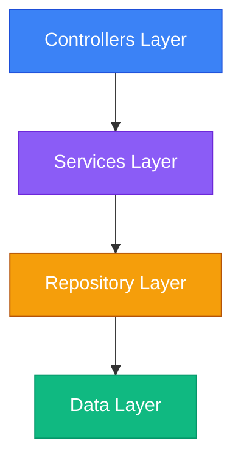
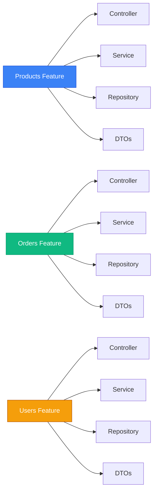

# Гібридна архітектура: Minimal API + Controllers

## Вступ: Дилема вибору

Уявіть, що ви починаєте новий проєкт API. Перед вами стоїть вибір:

**Minimal API:**
```csharp
app.MapGet("/api/products", async (ProductDbContext db) =>
{
    var products = await db.Products.ToListAsync();
    return Results.Ok(products);
});
```

**Controllers:**
```csharp
[ApiController]
[Route("api/[controller]")]
public class ProductsController : ControllerBase
{
    [HttpGet]
    public async Task<ActionResult<List<Product>>> GetAll()
    {
        var products = await _db.Products.ToListAsync();
        return Ok(products);
    }
}
```

**Проблема:** Обидва підходи мають свої переваги та недоліки:

| Характеристика | Minimal API | Controllers |
|----------------|-------------|-------------|
| **Простота** | ✅ Менше boilerplate | ❌ Більше коду |
| **Організація** | ❌ Все в Program.cs | ✅ Структуровано |
| **Фільтри** | ❌ Обмежена підтримка | ✅ Повна підтримка |
| **Model Binding** | ❌ Ручний | ✅ Автоматичний |
| **Тестування** | ❌ Складніше | ✅ Простіше |
| **Продуктивність** | ✅ Швидше | ❌ Повільніше |

**Питання:** Чому б не використовувати **обидва підходи** у одному проєкті?

**Реальний сценарій:**

```
E-commerce API:
├── Products CRUD → Controllers (складна логіка, валідація, фільтри)
├── Health checks → Minimal API (простий endpoint)
├── Metrics → Minimal API (lightweight)
├── Orders CRUD → Controllers (транзакції, бізнес-логіка)
└── Webhooks → Minimal API (швидка обробка)
```

**Рішення** — **Гібридна архітектура** — комбінування Minimal API та Controllers у одному проєкті, використовуючи кожен підхід там, де він найефективніший.

::note
**Передумови:** Ця стаття базується на знаннях з курсу Minimal API (17 статей) та попередніх статей Web API Controllers (01-08).
::

### Що ви створите в цій статті

Ми побудуємо **E-commerce API** з **гібридною архітектурою**:

**1. Стратегія розподілу:**
```
Controllers:
- Products CRUD (складна бізнес-логіка)
- Orders CRUD (транзакції, валідація)

Minimal API:
- Health checks (/health, /health/ready)
- Metrics (/metrics)
- Webhooks (/webhooks/payment)
```

**2. Vertical Slice Architecture:**
```
Features/
├── Products/
│   ├── ProductsController.cs
│   ├── ProductService.cs
│   └── ProductDto.cs
├── Orders/
│   ├── OrdersController.cs
│   ├── OrderService.cs
│   └── OrderDto.cs
└── Health/
    └── HealthEndpoints.cs
```

**3. Carter Library для організації:**
```csharp
public class HealthModule : ICarterModule
{
    public void AddRoutes(IEndpointRouteBuilder app)
    {
        app.MapGet("/health", () => Results.Ok("Healthy"));
    }
}
```

**4. Спільні сервіси:**
```csharp
// Використовуються і в Controllers, і в Minimal API
builder.Services.AddScoped<IProductService, ProductService>();
```

До кінця статті ви зможете:

- Комбінувати Minimal API та Controllers
- Організовувати код через feature folders
- Використовувати Carter для Minimal API endpoints
- Застосовувати vertical slice architecture
- Вибирати оптимальний підхід для кожного endpoint

---

## Фундаментальні концепції

### Layered vs Vertical Slice Architecture

**Traditional Layered Architecture (шари):**

::mermaid

::

```
Controllers/
├── ProductsController.cs
├── OrdersController.cs
└── UsersController.cs

Services/
├── ProductService.cs
├── OrderService.cs
└── UserService.cs

Repositories/
├── ProductRepository.cs
├── OrderRepository.cs
└── UserRepository.cs
```

**Проблеми:**
- ❌ Зміна однієї feature торкається багатьох папок
- ❌ Складно знайти весь код для однієї feature
- ❌ Залежності між шарами

**Vertical Slice Architecture (вертикальні зрізи):**

::mermaid

::

```
Features/
├── Products/
│   ├── ProductsController.cs
│   ├── ProductService.cs
│   ├── ProductRepository.cs
│   └── ProductDto.cs
├── Orders/
│   ├── OrdersController.cs
│   ├── OrderService.cs
│   ├── OrderRepository.cs
│   └── OrderDto.cs
└── Users/
    ├── UsersController.cs
    ├── UserService.cs
    ├── UserRepository.cs
    └── UserDto.cs
```

**Переваги:**
- ✅ Весь код для feature в одному місці
- ✅ Легко додавати/видаляти features
- ✅ Незалежні features (менше конфліктів у команді)
- ✅ Простіше тестувати

### Стратегії розподілу: Коли що використовувати

| Критерій | Minimal API | Controllers |
|----------|-------------|-------------|
| **Складність логіки** | Проста (1-5 рядків) | Складна (10+ рядків) |
| **Валідація** | Проста або відсутня | Складна (DataAnnotations, FluentValidation) |
| **Фільтри** | Не потрібні | Потрібні (auth, logging, validation) |
| **Model Binding** | Прості параметри | Складні DTO з вкладеними об'єктами |
| **Тестування** | Не критичне | Критичне (unit tests) |
| **Продуктивність** | Критична (high-throughput) | Не критична |
| **Документація** | Проста | Складна (XML comments, Swagger) |

**Приклади:**

**Minimal API — ідеально для:**
- Health checks (`/health`, `/health/ready`)
- Metrics endpoints (`/metrics`)
- Webhooks (швидка обробка)
- Static content (`/version`, `/info`)
- Redirects (`/` → `/swagger`)

**Controllers — ідеально для:**
- CRUD операції з валідацією
- Складна бізнес-логіка
- Endpoints з багатьма фільтрами
- API з версіонуванням
- Endpoints що потребують авторизації

---

## Практична реалізація: E-commerce Hybrid API

### Крок 1: Налаштування проєкту

::steps

### Створення проєкту

::terminal-preview{title="bash"}
<div class="line"><span class="opacity-40">$</span> <strong class="font-bold">dotnet new webapi -n EcommerceHybridApi</strong></div>
<div class="line"><span class="text-green-400 font-bold">The template "ASP.NET Core Web API" was created successfully.</span></div>
<div class="line"></div>
<div class="line"><span class="opacity-40">$</span> <strong class="font-bold">cd EcommerceHybridApi</strong></div>
<div class="line"><span class="opacity-40">$</span> <strong class="font-bold">dotnet add package Microsoft.EntityFrameworkCore.InMemory</strong></div>
<div class="line"><span class="text-blue-400">info</span> : PackageReference added successfully</div>
<div class="line"><span class="opacity-40">$</span> <strong class="font-bold">dotnet add package Carter</strong></div>
<div class="line"><span class="text-blue-400">info</span> : PackageReference added successfully</div>
::

::note
**Carter** — бібліотека для організації Minimal API endpoints у модулі (альтернатива розкиданим `app.MapGet` у Program.cs).
::

### Структура проєкту (Vertical Slices)

```
EcommerceHybridApi/
├── Features/
│   ├── Products/
│   │   ├── ProductsController.cs      # Controller-based
│   │   ├── ProductService.cs
│   │   ├── ProductDto.cs
│   │   └── ProductValidator.cs
│   ├── Orders/
│   │   ├── OrdersController.cs        # Controller-based
│   │   ├── OrderService.cs
│   │   └── OrderDto.cs
│   ├── Health/
│   │   └── HealthEndpoints.cs         # Minimal API
│   ├── Metrics/
│   │   └── MetricsEndpoints.cs        # Minimal API
│   └── Webhooks/
│       └── WebhookEndpoints.cs        # Minimal API
├── Shared/
│   ├── Data/
│   │   └── AppDbContext.cs
│   └── Models/
│       ├── Product.cs
│       └── Order.cs
└── Program.cs
```

::

---

### Крок 2: Shared Infrastructure

#### Моделі

Створіть файл `Shared/Models/Product.cs`:

```csharp
namespace EcommerceHybridApi.Shared.Models;

public class Product
{
    public int Id { get; set; }
    public required string Name { get; set; }
    public decimal Price { get; set; }
    public int Stock { get; set; }
    public bool IsActive { get; set; } = true;
}

public class Order
{
    public int Id { get; set; }
    public required string CustomerName { get; set; }
    public List<OrderItem> Items { get; set; } = new();
    public decimal TotalAmount { get; set; }
    public OrderStatus Status { get; set; } = OrderStatus.Pending;
    public DateTime CreatedAt { get; set; } = DateTime.UtcNow;
}

public class OrderItem
{
    public int Id { get; set; }
    public int OrderId { get; set; }
    public int ProductId { get; set; }
    public Product? Product { get; set; }
    public int Quantity { get; set; }
    public decimal Price { get; set; }
}

public enum OrderStatus
{
    Pending,
    Processing,
    Shipped,
    Delivered,
    Cancelled
}
```

#### DbContext

Створіть файл `Shared/Data/AppDbContext.cs`:

```csharp
using Microsoft.EntityFrameworkCore;
using EcommerceHybridApi.Shared.Models;

namespace EcommerceHybridApi.Shared.Data;

public class AppDbContext : DbContext
{
    public AppDbContext(DbContextOptions<AppDbContext> options) : base(options) { }

    public DbSet<Product> Products => Set<Product>();
    public DbSet<Order> Orders => Set<Order>();
    public DbSet<OrderItem> OrderItems => Set<OrderItem>();

    protected override void OnModelCreating(ModelBuilder modelBuilder)
    {
        // Seed products
        modelBuilder.Entity<Product>().HasData(
            new Product { Id = 1, Name = "Laptop", Price = 1299.99m, Stock = 10 },
            new Product { Id = 2, Name = "Mouse", Price = 29.99m, Stock = 50 },
            new Product { Id = 3, Name = "Keyboard", Price = 79.99m, Stock = 30 }
        );
    }
}
```

---

### Крок 3: Feature 1 — Products (Controller-based)

#### ProductDto

Створіть файл `Features/Products/ProductDto.cs`:

```csharp
using System.ComponentModel.DataAnnotations;

namespace EcommerceHybridApi.Features.Products;

public record ProductDto
{
    public int Id { get; init; }
    public required string Name { get; init; }
    public decimal Price { get; init; }
    public int Stock { get; init; }
    public bool IsActive { get; init; }
}

public record CreateProductDto
{
    [Required(ErrorMessage = "Product name is required")]
    [MaxLength(200)]
    public required string Name { get; init; }

    [Range(0.01, 1_000_000)]
    public decimal Price { get; init; }

    [Range(0, int.MaxValue)]
    public int Stock { get; init; }
}

public record UpdateProductDto
{
    [Required]
    [MaxLength(200)]
    public required string Name { get; init; }

    [Range(0.01, 1_000_000)]
    public decimal Price { get; init; }

    [Range(0, int.MaxValue)]
    public int Stock { get; init; }
}
```

#### ProductService

Створіть файл `Features/Products/ProductService.cs`:

```csharp
using Microsoft.EntityFrameworkCore;
using EcommerceHybridApi.Shared.Data;
using EcommerceHybridApi.Shared.Models;

namespace EcommerceHybridApi.Features.Products;

public interface IProductService
{
    Task<List<ProductDto>> GetAllAsync();
    Task<ProductDto?> GetByIdAsync(int id);
    Task<ProductDto> CreateAsync(CreateProductDto dto);
    Task<ProductDto?> UpdateAsync(int id, UpdateProductDto dto);
    Task<bool> DeleteAsync(int id);
}

public class ProductService : IProductService
{
    private readonly AppDbContext _db;
    private readonly ILogger<ProductService> _logger;

    public ProductService(AppDbContext db, ILogger<ProductService> logger)
    {
        _db = db;
        _logger = logger;
    }

    public async Task<List<ProductDto>> GetAllAsync()
    {
        return await _db.Products
            .Where(p => p.IsActive)
            .Select(p => new ProductDto
            {
                Id = p.Id,
                Name = p.Name,
                Price = p.Price,
                Stock = p.Stock,
                IsActive = p.IsActive
            })
            .ToListAsync();
    }

    public async Task<ProductDto?> GetByIdAsync(int id)
    {
        var product = await _db.Products.FindAsync(id);
        
        if (product is null)
            return null;

        return new ProductDto
        {
            Id = product.Id,
            Name = product.Name,
            Price = product.Price,
            Stock = product.Stock,
            IsActive = product.IsActive
        };
    }

    public async Task<ProductDto> CreateAsync(CreateProductDto dto)
    {
        var product = new Product
        {
            Name = dto.Name,
            Price = dto.Price,
            Stock = dto.Stock
        };

        _db.Products.Add(product);
        await _db.SaveChangesAsync();

        _logger.LogInformation("Product {ProductId} created: {ProductName}", product.Id, product.Name);

        return new ProductDto
        {
            Id = product.Id,
            Name = product.Name,
            Price = product.Price,
            Stock = product.Stock,
            IsActive = product.IsActive
        };
    }

    public async Task<ProductDto?> UpdateAsync(int id, UpdateProductDto dto)
    {
        var product = await _db.Products.FindAsync(id);
        
        if (product is null)
            return null;

        product.Name = dto.Name;
        product.Price = dto.Price;
        product.Stock = dto.Stock;

        await _db.SaveChangesAsync();

        _logger.LogInformation("Product {ProductId} updated", product.Id);

        return new ProductDto
        {
            Id = product.Id,
            Name = product.Name,
            Price = product.Price,
            Stock = product.Stock,
            IsActive = product.IsActive
        };
    }

    public async Task<bool> DeleteAsync(int id)
    {
        var product = await _db.Products.FindAsync(id);
        
        if (product is null)
            return false;

        product.IsActive = false; // Soft delete
        await _db.SaveChangesAsync();

        _logger.LogInformation("Product {ProductId} deleted (soft)", product.Id);

        return true;
    }
}
```

#### ProductsController

Створіть файл `Features/Products/ProductsController.cs`:

```csharp
using Microsoft.AspNetCore.Mvc;

namespace EcommerceHybridApi.Features.Products;

[ApiController]
[Route("api/[controller]")]
public class ProductsController : ControllerBase
{
    private readonly IProductService _productService;
    private readonly ILogger<ProductsController> _logger;

    public ProductsController(IProductService productService, ILogger<ProductsController> logger)
    {
        _productService = productService;
        _logger = logger;
    }

    /// <summary>
    /// Отримати всі продукти
    /// </summary>
    [HttpGet]
    [ProducesResponseType(typeof(List<ProductDto>), StatusCodes.Status200OK)]
    public async Task<ActionResult<List<ProductDto>>> GetAll()
    {
        var products = await _productService.GetAllAsync();
        return Ok(products);
    }

    /// <summary>
    /// Отримати продукт за ID
    /// </summary>
    [HttpGet("{id:int}")]
    [ProducesResponseType(typeof(ProductDto), StatusCodes.Status200OK)]
    [ProducesResponseType(StatusCodes.Status404NotFound)]
    public async Task<ActionResult<ProductDto>> GetById(int id)
    {
        var product = await _productService.GetByIdAsync(id);
        
        if (product is null)
            return NotFound();

        return Ok(product);
    }

    /// <summary>
    /// Створити новий продукт
    /// </summary>
    [HttpPost]
    [ProducesResponseType(typeof(ProductDto), StatusCodes.Status201Created)]
    [ProducesResponseType(StatusCodes.Status400BadRequest)]
    public async Task<ActionResult<ProductDto>> Create([FromBody] CreateProductDto dto)
    {
        var product = await _productService.CreateAsync(dto);
        return CreatedAtAction(nameof(GetById), new { id = product.Id }, product);
    }

    /// <summary>
    /// Оновити продукт
    /// </summary>
    [HttpPut("{id:int}")]
    [ProducesResponseType(typeof(ProductDto), StatusCodes.Status200OK)]
    [ProducesResponseType(StatusCodes.Status404NotFound)]
    public async Task<ActionResult<ProductDto>> Update(int id, [FromBody] UpdateProductDto dto)
    {
        var product = await _productService.UpdateAsync(id, dto);
        
        if (product is null)
            return NotFound();

        return Ok(product);
    }

    /// <summary>
    /// Видалити продукт
    /// </summary>
    [HttpDelete("{id:int}")]
    [ProducesResponseType(StatusCodes.Status204NoContent)]
    [ProducesResponseType(StatusCodes.Status404NotFound)]
    public async Task<IActionResult> Delete(int id)
    {
        var deleted = await _productService.DeleteAsync(id);
        
        if (!deleted)
            return NotFound();

        return NoContent();
    }
}
```

**Чому Controller?**
- ✅ Складна валідація (DataAnnotations)
- ✅ CRUD операції з бізнес-логікою
- ✅ Потребує тестування (unit tests для ProductService)
- ✅ XML коментарі для Swagger

---

### Крок 4: Feature 2 — Health Checks (Minimal API)

Створіть файл `Features/Health/HealthEndpoints.cs`:

```csharp
using Carter;
using Microsoft.EntityFrameworkCore;
using EcommerceHybridApi.Shared.Data;

namespace EcommerceHybridApi.Features.Health;

public class HealthEndpoints : ICarterModule
{
    public void AddRoutes(IEndpointRouteBuilder app)
    {
        var group = app.MapGroup("/health")
            .WithTags("Health")
            .WithOpenApi();

        // Basic health check
        group.MapGet("", () => Results.Ok(new
        {
            status = "Healthy",
            timestamp = DateTime.UtcNow
        }))
        .WithName("GetHealth")
        .WithSummary("Basic health check");

        // Readiness check (перевіряє БД)
        group.MapGet("/ready", async (AppDbContext db) =>
        {
            try
            {
                await db.Database.CanConnectAsync();
                
                return Results.Ok(new
                {
                    status = "Ready",
                    database = "Connected",
                    timestamp = DateTime.UtcNow
                });
            }
            catch (Exception ex)
            {
                return Results.ServiceUnavailable(new
                {
                    status = "Not Ready",
                    database = "Disconnected",
                    error = ex.Message,
                    timestamp = DateTime.UtcNow
                });
            }
        })
        .WithName("GetReadiness")
        .WithSummary("Readiness check with database connection");

        // Liveness check
        group.MapGet("/live", () => Results.Ok(new
        {
            status = "Alive",
            timestamp = DateTime.UtcNow
        }))
        .WithName("GetLiveness")
        .WithSummary("Liveness check");
    }
}
```

**Чому Minimal API?**
- ✅ Проста логіка (1-5 рядків)
- ✅ Не потребує валідації
- ✅ Висока продуктивність (викликається часто)
- ✅ Не потребує тестування

---

### Крок 5: Feature 3 — Metrics (Minimal API)

Створіть файл `Features/Metrics/MetricsEndpoints.cs`:

```csharp
using Carter;
using Microsoft.EntityFrameworkCore;
using EcommerceHybridApi.Shared.Data;

namespace EcommerceHybridApi.Features.Metrics;

public class MetricsEndpoints : ICarterModule
{
    public void AddRoutes(IEndpointRouteBuilder app)
    {
        app.MapGet("/metrics", async (AppDbContext db) =>
        {
            var metrics = new
            {
                products = new
                {
                    total = await db.Products.CountAsync(),
                    active = await db.Products.CountAsync(p => p.IsActive),
                    outOfStock = await db.Products.CountAsync(p => p.Stock == 0)
                },
                orders = new
                {
                    total = await db.Orders.CountAsync(),
                    pending = await db.Orders.CountAsync(o => o.Status == Shared.Models.OrderStatus.Pending),
                    completed = await db.Orders.CountAsync(o => o.Status == Shared.Models.OrderStatus.Delivered)
                },
                timestamp = DateTime.UtcNow
            };

            return Results.Ok(metrics);
        })
        .WithTags("Metrics")
        .WithName("GetMetrics")
        .WithSummary("Get API metrics")
        .WithOpenApi();
    }
}
```

**Чому Minimal API?**
- ✅ Lightweight endpoint
- ✅ Проста агрегація даних
- ✅ Не потребує складної логіки


---

### Крок 6: Feature 4 — Webhooks (Minimal API)

Створіть файл `Features/Webhooks/WebhookEndpoints.cs`:

```csharp
using Carter;

namespace EcommerceHybridApi.Features.Webhooks;

public class WebhookEndpoints : ICarterModule
{
    public void AddRoutes(IEndpointRouteBuilder app)
    {
        var group = app.MapGroup("/webhooks")
            .WithTags("Webhooks")
            .WithOpenApi();

        // Payment webhook
        group.MapPost("/payment", async (PaymentWebhookDto dto, ILogger<WebhookEndpoints> logger) =>
        {
            logger.LogInformation(
                "Payment webhook received: OrderId={OrderId}, Status={Status}",
                dto.OrderId,
                dto.Status);

            // Швидка обробка (без складної логіки)
            // У production: додати до черги для асинхронної обробки

            return Results.Ok(new { received = true, timestamp = DateTime.UtcNow });
        })
        .WithName("PaymentWebhook")
        .WithSummary("Receive payment webhook");

        // Shipping webhook
        group.MapPost("/shipping", async (ShippingWebhookDto dto, ILogger<WebhookEndpoints> logger) =>
        {
            logger.LogInformation(
                "Shipping webhook received: OrderId={OrderId}, TrackingNumber={TrackingNumber}",
                dto.OrderId,
                dto.TrackingNumber);

            return Results.Ok(new { received = true, timestamp = DateTime.UtcNow });
        })
        .WithName("ShippingWebhook")
        .WithSummary("Receive shipping webhook");
    }
}

public record PaymentWebhookDto(int OrderId, string Status, decimal Amount);
public record ShippingWebhookDto(int OrderId, string TrackingNumber, string Carrier);
```

**Чому Minimal API?**
- ✅ Швидка обробка (webhooks мають timeout)
- ✅ Проста логіка (логування + відповідь)
- ✅ Висока продуктивність

---

### Крок 7: Program.cs — Об'єднання всього

```csharp
using Microsoft.EntityFrameworkCore;
using Carter;
using EcommerceHybridApi.Shared.Data;
using EcommerceHybridApi.Features.Products;

var builder = WebApplication.CreateBuilder(args);

// Database
builder.Services.AddDbContext<AppDbContext>(options =>
    options.UseInMemoryDatabase("EcommerceDb"));

// Services (спільні для Controllers та Minimal API)
builder.Services.AddScoped<IProductService, ProductService>();

// Controllers
builder.Services.AddControllers();

// Carter (для Minimal API modules)
builder.Services.AddCarter();

// Swagger
builder.Services.AddEndpointsApiExplorer();
builder.Services.AddSwaggerGen(options =>
{
    options.SwaggerDoc("v1", new()
    {
        Title = "E-commerce Hybrid API",
        Version = "v1",
        Description = "API combining Controllers and Minimal API"
    });
});

var app = builder.Build();

// Seed database
using (var scope = app.Services.CreateScope())
{
    var db = scope.ServiceProvider.GetRequiredService<AppDbContext>();
    db.Database.EnsureCreated();
}

if (app.Environment.IsDevelopment())
{
    app.UseSwagger();
    app.UseSwaggerUI();
}

app.UseHttpsRedirection();
app.UseAuthorization();

// Controllers endpoints
app.MapControllers();

// Minimal API endpoints (через Carter)
app.MapCarter();

// Root redirect
app.MapGet("/", () => Results.Redirect("/swagger"))
    .ExcludeFromDescription();

app.Run();
```

**Декомпозиція:**

1. **`AddControllers()`** — реєструє Controllers
2. **`AddCarter()`** — реєструє Carter modules (автоматично знаходить `ICarterModule`)
3. **`MapControllers()`** — мапить Controller endpoints
4. **`MapCarter()`** — мапить Minimal API endpoints з Carter modules
5. **Спільні сервіси** — `IProductService` доступний і в Controllers, і в Minimal API

---

### Крок 8: Тестування

::terminal-preview{title="bash"}
<div class="line"><span class="opacity-40">$</span> <strong class="font-bold">dotnet run</strong></div>
<div class="line"><span class="text-green-400 font-bold">info</span>: Now listening on: https://localhost:5001</div>
<div class="line"></div>
<div class="line"><span class="opacity-40"># Тест 1: Controller endpoint (Products)</span></div>
<div class="line"><span class="opacity-40">$</span> <strong class="font-bold">curl https://localhost:5001/api/products</strong></div>
<div class="line"><span class="text-green-400 font-bold">HTTP/1.1 200 OK</span></div>
<div class="line"><span class="text-blue-400">[</span></div>
<div class="line">  <span class="text-blue-400">{ "id": 1, "name": "Laptop", "price": 1299.99 }</span>,</div>
<div class="line">  <span class="text-blue-400">{ "id": 2, "name": "Mouse", "price": 29.99 }</span></div>
<div class="line"><span class="text-blue-400">]</span></div>
<div class="line"></div>
<div class="line"><span class="opacity-40"># Тест 2: Minimal API endpoint (Health)</span></div>
<div class="line"><span class="opacity-40">$</span> <strong class="font-bold">curl https://localhost:5001/health</strong></div>
<div class="line"><span class="text-green-400 font-bold">HTTP/1.1 200 OK</span></div>
<div class="line"><span class="text-blue-400">{</span></div>
<div class="line">  <span class="text-green-400">"status"</span>: <span class="text-yellow-400">"Healthy"</span>,</div>
<div class="line">  <span class="text-green-400">"timestamp"</span>: <span class="text-yellow-400">"2024-01-15T10:30:00Z"</span></div>
<div class="line"><span class="text-blue-400">}</span></div>
<div class="line"></div>
<div class="line"><span class="opacity-40"># Тест 3: Minimal API endpoint (Metrics)</span></div>
<div class="line"><span class="opacity-40">$</span> <strong class="font-bold">curl https://localhost:5001/metrics</strong></div>
<div class="line"><span class="text-green-400 font-bold">HTTP/1.1 200 OK</span></div>
<div class="line"><span class="text-blue-400">{</span></div>
<div class="line">  <span class="text-green-400">"products"</span>: <span class="text-blue-400">{ "total": 3, "active": 3, "outOfStock": 0 }</span>,</div>
<div class="line">  <span class="text-green-400">"orders"</span>: <span class="text-blue-400">{ "total": 0, "pending": 0, "completed": 0 }</span></div>
<div class="line"><span class="text-blue-400">}</span></div>
<div class="line"></div>
<div class="line"><span class="opacity-40"># Тест 4: Webhook endpoint</span></div>
<div class="line"><span class="opacity-40">$</span> <strong class="font-bold">curl -X POST https://localhost:5001/webhooks/payment \</strong></div>
<div class="line">  <strong class="font-bold">-H "Content-Type: application/json" \</strong></div>
<div class="line">  <strong class="font-bold">-d '{"orderId":1,"status":"paid","amount":1299.99}'</strong></div>
<div class="line"><span class="text-green-400 font-bold">HTTP/1.1 200 OK</span></div>
<div class="line"><span class="text-blue-400">{ "received": true, "timestamp": "2024-01-15T10:31:00Z" }</span></div>
::

---

## Просунуті техніки

### 1. Спільні Middleware для обох підходів

Middleware працюють однаково для Controllers та Minimal API:

```csharp
// Correlation ID middleware
app.Use(async (context, next) =>
{
    var correlationId = context.Request.Headers["X-Correlation-ID"].FirstOrDefault()
        ?? Guid.NewGuid().ToString();

    context.Response.Headers.Append("X-Correlation-ID", correlationId);
    context.Items["CorrelationId"] = correlationId;

    await next();
});

// Працює для обох:
// - /api/products (Controller)
// - /health (Minimal API)
```

### 2. Спільні Filters через Endpoint Filters

Endpoint Filters працюють для Minimal API (аналог Action Filters):

```csharp
public class LoggingEndpointFilter : IEndpointFilter
{
    private readonly ILogger<LoggingEndpointFilter> _logger;

    public LoggingEndpointFilter(ILogger<LoggingEndpointFilter> logger)
    {
        _logger = logger;
    }

    public async ValueTask<object?> InvokeAsync(
        EndpointFilterInvocationContext context,
        EndpointFilterDelegate next)
    {
        var path = context.HttpContext.Request.Path;
        _logger.LogInformation("Executing endpoint: {Path}", path);

        var result = await next(context);

        _logger.LogInformation("Executed endpoint: {Path}", path);

        return result;
    }
}
```

**Використання:**

```csharp
// Для Minimal API
app.MapGet("/metrics", async (AppDbContext db) => { ... })
    .AddEndpointFilter<LoggingEndpointFilter>();

// Для Controllers — використовуйте Action Filters
```

### 3. Групування Minimal API endpoints

Carter автоматично групує, але можна і вручну:

```csharp
var api = app.MapGroup("/api/v1")
    .WithTags("API v1")
    .RequireAuthorization(); // Для всієї групи

api.MapGet("/status", () => Results.Ok("OK"));
api.MapGet("/version", () => Results.Ok("1.0.0"));
```

### 4. Міграція з Controllers на Minimal API

Поступова міграція:

**Крок 1: Ідентифікуйте прості endpoints**

```csharp
// Простий endpoint — кандидат на міграцію
[HttpGet("version")]
public IActionResult GetVersion()
{
    return Ok(new { version = "1.0.0" });
}
```

**Крок 2: Створіть Minimal API еквівалент**

```csharp
app.MapGet("/api/products/version", () => Results.Ok(new { version = "1.0.0" }))
    .WithTags("Products");
```

**Крок 3: Видаліть Controller метод**

**Крок 4: Повторіть для інших простих endpoints**

### 5. Feature Toggles для вибору підходу

```csharp
var useMinimalApi = builder.Configuration.GetValue<bool>("Features:UseMinimalApiForProducts");

if (useMinimalApi)
{
    // Minimal API version
    app.MapGet("/api/products", async (AppDbContext db) =>
    {
        var products = await db.Products.ToListAsync();
        return Results.Ok(products);
    });
}
else
{
    // Controller version (через MapControllers)
    app.MapControllers();
}
```

---

## Практичні завдання

### Рівень 1: Базове розуміння

::steps

### Завдання 1.1: Вибір підходу

Для кожного endpoint виберіть оптимальний підхід (Controller або Minimal API):

1. `GET /api/users` — список користувачів з пагінацією, фільтрацією, сортуванням
2. `GET /health` — health check
3. `POST /api/orders` — створення замовлення з валідацією та транзакцією
4. `GET /version` — версія API
5. `POST /webhooks/stripe` — webhook від Stripe

::collapsible{title="Показати відповіді"}

1. **Controller** — складна логіка (пагінація, фільтрація, сортування)
2. **Minimal API** — простий endpoint без логіки
3. **Controller** — складна валідація, транзакції, бізнес-логіка
4. **Minimal API** — статичні дані
5. **Minimal API** — швидка обробка, проста логіка

::

### Завдання 1.2: Layered vs Vertical Slice

Яка структура краща для команди з 5 розробників, що працюють над різними features?

**Варіант A (Layered):**
```
Controllers/
Services/
Repositories/
```

**Варіант B (Vertical Slice):**
```
Features/
├── Products/
├── Orders/
└── Users/
```

::collapsible{title="Показати відповідь"}

**Правильна відповідь: Варіант B (Vertical Slice)**

**Причини:**
- ✅ Кожен розробник працює у своїй feature папці
- ✅ Менше конфліктів у Git (різні папки)
- ✅ Легше code review (всі зміни в одній папці)
- ✅ Простіше видалити feature (видалити одну папку)

::

::

---

### Рівень 2: Логіка та розширення

::steps

### Завдання 2.1: Спільний сервіс для обох підходів

Створіть сервіс, що використовується і в Controller, і в Minimal API:

::collapsible{title="Показати рішення"}

**1. Interface та Implementation:**

```csharp
public interface IOrderService
{
    Task<OrderDto> CreateOrderAsync(CreateOrderDto dto);
    Task<OrderDto?> GetOrderAsync(int id);
}

public class OrderService : IOrderService
{
    private readonly AppDbContext _db;
    private readonly ILogger<OrderService> _logger;

    public OrderService(AppDbContext db, ILogger<OrderService> logger)
    {
        _db = db;
        _logger = logger;
    }

    public async Task<OrderDto> CreateOrderAsync(CreateOrderDto dto)
    {
        var order = new Order
        {
            CustomerName = dto.CustomerName,
            TotalAmount = dto.Items.Sum(i => i.Price * i.Quantity)
        };

        _db.Orders.Add(order);
        await _db.SaveChangesAsync();

        _logger.LogInformation("Order {OrderId} created", order.Id);

        return new OrderDto(order.Id, order.CustomerName, order.TotalAmount, order.Status.ToString());
    }

    public async Task<OrderDto?> GetOrderAsync(int id)
    {
        var order = await _db.Orders.FindAsync(id);
        return order is null ? null : new OrderDto(order.Id, order.CustomerName, order.TotalAmount, order.Status.ToString());
    }
}
```

**2. Реєстрація:**

```csharp
builder.Services.AddScoped<IOrderService, OrderService>();
```

**3. Використання у Controller:**

```csharp
[ApiController]
[Route("api/[controller]")]
public class OrdersController : ControllerBase
{
    private readonly IOrderService _orderService;

    public OrdersController(IOrderService orderService)
    {
        _orderService = orderService;
    }

    [HttpPost]
    public async Task<ActionResult<OrderDto>> Create([FromBody] CreateOrderDto dto)
    {
        var order = await _orderService.CreateOrderAsync(dto);
        return CreatedAtAction(nameof(GetById), new { id = order.Id }, order);
    }

    [HttpGet("{id:int}")]
    public async Task<ActionResult<OrderDto>> GetById(int id)
    {
        var order = await _orderService.GetOrderAsync(id);
        return order is null ? NotFound() : Ok(order);
    }
}
```

**4. Використання у Minimal API:**

```csharp
public class OrderEndpoints : ICarterModule
{
    public void AddRoutes(IEndpointRouteBuilder app)
    {
        app.MapGet("/api/orders/{id:int}/status", async (int id, IOrderService orderService) =>
        {
            var order = await orderService.GetOrderAsync(id);
            return order is null ? Results.NotFound() : Results.Ok(new { status = order.Status });
        })
        .WithTags("Orders");
    }
}
```

**Переваги:**
- ✅ DRY — логіка в одному місці
- ✅ Легко тестувати (mock `IOrderService`)
- ✅ Консистентність між підходами

::

### Завдання 2.2: Conditional Routing

Використовуйте різні підходи залежно від environment:

::collapsible{title="Показати рішення"}

```csharp
var app = builder.Build();

if (app.Environment.IsDevelopment())
{
    // Development: використовуємо Minimal API для швидкого прототипування
    app.MapGet("/api/products", async (AppDbContext db) =>
    {
        var products = await db.Products.ToListAsync();
        return Results.Ok(products);
    })
    .WithTags("Products (Dev)");
}
else
{
    // Production: використовуємо Controllers для стабільності
    app.MapControllers();
}
```

::

### Завдання 2.3: Hybrid Endpoint з Fallback

Створіть endpoint, що використовує Controller, але має Minimal API fallback:

::collapsible{title="Показати рішення"}

```csharp
var useControllers = builder.Configuration.GetValue<bool>("Features:UseControllers", true);

if (useControllers)
{
    builder.Services.AddControllers();
    // ... після app.Build()
    app.MapControllers();
}
else
{
    // Fallback на Minimal API
    app.MapGet("/api/products", async (AppDbContext db) =>
    {
        var products = await db.Products.ToListAsync();
        return Results.Ok(products);
    });

    app.MapGet("/api/products/{id:int}", async (int id, AppDbContext db) =>
    {
        var product = await db.Products.FindAsync(id);
        return product is null ? Results.NotFound() : Results.Ok(product);
    });
}
```

**appsettings.json:**

```json
{
  "Features": {
    "UseControllers": true
  }
}
```

::

::

---

### Рівень 3: Архітектура та створення

::steps

### Завдання 3.1: Feature Module System

Створіть систему модулів, де кожна feature сама реєструє свої endpoints:

::collapsible{title="Показати рішення"}

**1. Interface:**

```csharp
public interface IFeatureModule
{
    void RegisterServices(IServiceCollection services);
    void RegisterEndpoints(IEndpointRouteBuilder app);
}
```

**2. Products Feature Module:**

```csharp
namespace EcommerceHybridApi.Features.Products;

public class ProductsModule : IFeatureModule
{
    public void RegisterServices(IServiceCollection services)
    {
        services.AddScoped<IProductService, ProductService>();
        // Інші сервіси для Products feature
    }

    public void RegisterEndpoints(IEndpointRouteBuilder app)
    {
        // Можна використовувати і Controllers, і Minimal API
        var group = app.MapGroup("/api/products")
            .WithTags("Products");

        // Minimal API endpoints для простих операцій
        group.MapGet("/count", async (IProductService service) =>
        {
            var products = await service.GetAllAsync();
            return Results.Ok(new { count = products.Count });
        });

        // Controllers для складних операцій реєструються через MapControllers()
    }
}
```

**3. Extension Method:**

```csharp
public static class FeatureModuleExtensions
{
    public static IServiceCollection AddFeatureModules(
        this IServiceCollection services,
        params IFeatureModule[] modules)
    {
        foreach (var module in modules)
        {
            module.RegisterServices(services);
        }
        return services;
    }

    public static IEndpointRouteBuilder MapFeatureModules(
        this IEndpointRouteBuilder app,
        params IFeatureModule[] modules)
    {
        foreach (var module in modules)
        {
            module.RegisterEndpoints(app);
        }
        return app;
    }
}
```

**4. Program.cs:**

```csharp
var productsModule = new ProductsModule();
var ordersModule = new OrdersModule();

builder.Services.AddFeatureModules(productsModule, ordersModule);

// ... після app.Build()

app.MapFeatureModules(productsModule, ordersModule);
app.MapControllers(); // Для Controllers з modules
```

**Переваги:**
- ✅ Кожна feature самодостатня
- ✅ Легко додавати/видаляти features
- ✅ Чистий Program.cs

::

### Завдання 3.2: Auto-Discovery Feature Modules

Автоматично знаходьте та реєструйте всі feature modules:

::collapsible{title="Показати рішення"}

```csharp
public static class FeatureModuleExtensions
{
    public static IServiceCollection AddAllFeatureModules(this IServiceCollection services)
    {
        var moduleType = typeof(IFeatureModule);
        var modules = AppDomain.CurrentDomain.GetAssemblies()
            .SelectMany(assembly => assembly.GetTypes())
            .Where(type => moduleType.IsAssignableFrom(type) && !type.IsInterface && !type.IsAbstract)
            .Select(type => (IFeatureModule)Activator.CreateInstance(type)!)
            .ToList();

        foreach (var module in modules)
        {
            module.RegisterServices(services);
        }

        // Зберігаємо modules для використання у MapAllFeatureModules
        services.AddSingleton<IEnumerable<IFeatureModule>>(modules);

        return services;
    }

    public static IEndpointRouteBuilder MapAllFeatureModules(this IEndpointRouteBuilder app)
    {
        var modules = app.ServiceProvider.GetRequiredService<IEnumerable<IFeatureModule>>();

        foreach (var module in modules)
        {
            module.RegisterEndpoints(app);
        }

        return app;
    }
}
```

**Program.cs:**

```csharp
builder.Services.AddAllFeatureModules(); // Автоматично знаходить всі IFeatureModule

// ... після app.Build()

app.MapAllFeatureModules();
app.MapControllers();
```

**Переваги:**
- ✅ Нові features додаються автоматично
- ✅ Не потрібно оновлювати Program.cs
- ✅ Convention over configuration

::

### Завдання 3.3: Performance Comparison Tool

Створіть endpoint для порівняння продуктивності Controllers vs Minimal API:

::collapsible{title="Показати рішення"}

```csharp
public class PerformanceEndpoints : ICarterModule
{
    public void AddRoutes(IEndpointRouteBuilder app)
    {
        app.MapGet("/performance/compare", async (AppDbContext db) =>
        {
            var iterations = 1000;
            var results = new Dictionary<string, long>();

            // Test 1: Minimal API
            var sw1 = System.Diagnostics.Stopwatch.StartNew();
            for (int i = 0; i < iterations; i++)
            {
                var _ = await db.Products.CountAsync();
            }
            sw1.Stop();
            results["MinimalAPI"] = sw1.ElapsedMilliseconds;

            // Test 2: Direct service call (як у Controller)
            var productService = app.ServiceProvider.GetRequiredService<IProductService>();
            var sw2 = System.Diagnostics.Stopwatch.StartNew();
            for (int i = 0; i < iterations; i++)
            {
                var _ = await productService.GetAllAsync();
            }
            sw2.Stop();
            results["ControllerService"] = sw2.ElapsedMilliseconds;

            return Results.Ok(new
            {
                iterations,
                results,
                winner = results.MinBy(r => r.Value).Key,
                difference = $"{Math.Abs(results["MinimalAPI"] - results["ControllerService"])}ms"
            });
        })
        .WithTags("Performance")
        .ExcludeFromDescription(); // Не показувати у Swagger
    }
}
```

**Результат:**

```json
{
  "iterations": 1000,
  "results": {
    "MinimalAPI": 245,
    "ControllerService": 267
  },
  "winner": "MinimalAPI",
  "difference": "22ms"
}
```

::

::

---

## Резюме

У цій статті ви навчилися комбінувати **Minimal API** та **Controllers** у гібридній архітектурі:

### Ключові концепції

**1. Vertical Slice Architecture:**
- Організація коду за features замість шарів
- Кожна feature містить всю логіку (Controller/Endpoints, Service, DTOs)
- Незалежні features — менше конфліктів у команді

**2. Стратегія розподілу:**

| Використовуйте Controllers для: | Використовуйте Minimal API для: |
|----------------------------------|----------------------------------|
| Складної бізнес-логіки | Простих endpoints (1-5 рядків) |
| CRUD з валідацією | Health checks, metrics |
| Endpoints з фільтрами | Webhooks (швидка обробка) |
| API що потребує тестування | Static content, redirects |
| Складного model binding | Lightweight endpoints |

**3. Carter Library:**
- Організація Minimal API у модулі (`ICarterModule`)
- Альтернатива розкиданим `app.MapGet` у Program.cs
- Автоматичне знаходження та реєстрація modules

**4. Спільні компоненти:**
- Сервіси доступні обом підходам
- Middleware працюють однаково
- DbContext спільний

### Переваги гібридного підходу

✅ **Flexibility** — використовуйте кращий інструмент для кожної задачі  
✅ **Performance** — Minimal API для high-throughput endpoints  
✅ **Maintainability** — Controllers для складної логіки  
✅ **Team productivity** — vertical slices зменшують конфлікти  
✅ **Gradual migration** — можна поступово мігрувати з одного підходу на інший

### Best Practices

✅ **Використовуйте vertical slice architecture** для великих проєктів  
✅ **Створюйте спільні сервіси** замість дублювання логіки  
✅ **Документуйте стратегію** — коли використовувати який підхід  
✅ **Групуйте Minimal API** через Carter або `MapGroup`  
✅ **Тестуйте обидва підходи** однаково (integration tests)  
✅ **Моніторьте продуктивність** — порівнюйте підходи

::tip
**Коли використовувати гібридний підхід:**
- ✅ Великі проєкти з різними типами endpoints
- ✅ Команди з різним досвідом (деякі знають Controllers, інші Minimal API)
- ✅ Міграція з Controllers на Minimal API (поступово)
- ✅ Потрібна висока продуктивність для певних endpoints
::

---

## Додаткові ресурси

::card-group
::card{title="Carter Library" icon="i-heroicons-code-bracket"}
[Carter - Minimal API Modules](https://github.com/CarterCommunity/Carter)
::

::card{title="Vertical Slice Architecture" icon="i-heroicons-squares-2x2"}
[Jimmy Bogard - Vertical Slice Architecture](https://www.jimmybogard.com/vertical-slice-architecture/)
::

::card{title="Feature Folders" icon="i-heroicons-folder"}
[Feature Folders in ASP.NET Core](https://scottsauber.com/2016/04/25/feature-folder-structure-in-asp-net-core/)
::

::card{title="Minimal API vs Controllers" icon="i-heroicons-chart-bar"}
[Performance Comparison](https://learn.microsoft.com/en-us/aspnet/core/fundamentals/minimal-apis/overview)
::
::

---

::note{icon="i-heroicons-arrow-right"}
**Наступна стаття:** [Документація API: Swashbuckle, NSwag та генерація клієнтів](/csharp/aspnet/web-api/api-documentation-generation) — production-level документація, XML-коментарі, Swashbuckle фільтри, NSwag для генерації C# та TypeScript клієнтів, Refit автоматичний HTTP-клієнт.
::
