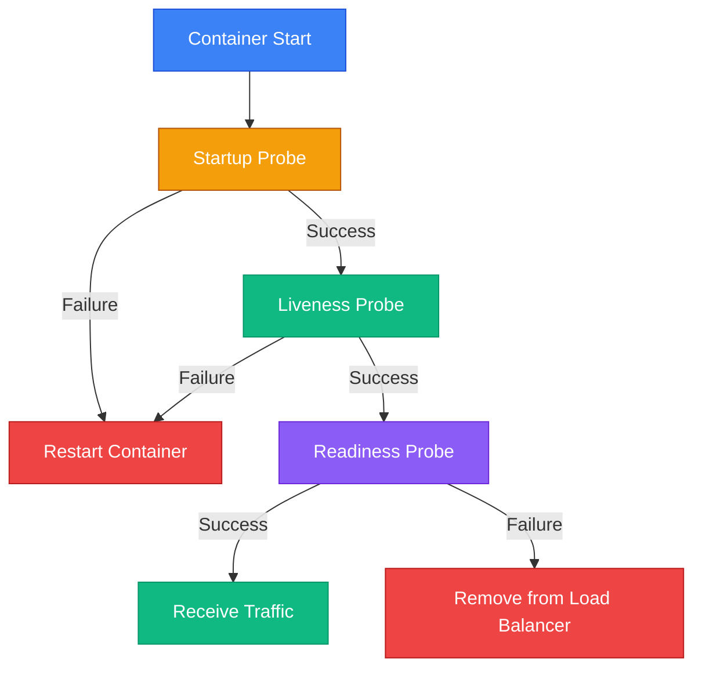

# Health Checks та моніторинг API

## Вступ: Проблема "мертвого" API

Уявіть, що ваш API розгорнуто у production:

```bash
# Користувачі скаржаться на помилки
curl https://api.example.com/products
→ 500 Internal Server Error

# DevOps перевіряє сервер
ssh production-server
ps aux | grep dotnet
→ dotnet процес працює ✓

# Але API не відповідає!
```

**Що сталося?**

- ✅ Процес працює
- ❌ База даних недоступна
- ❌ Redis не відповідає
- ❌ Диск заповнений на 100%
- ❌ Пам'ять закінчилася

**Проблема:** Процес "живий", але API **не функціональний**.

**Типовий підхід — ручна перевірка:**

```bash
# DevOps вручну перевіряє кожен компонент
curl https://api.example.com/health
→ 200 OK (але це нічого не каже про залежності!)

# Перевірка БД
psql -h db-server -U user -c "SELECT 1"
→ Connection refused ❌

# Перевірка Redis
redis-cli -h redis-server ping
→ PONG ✓

# Перевірка диску
df -h
→ /dev/sda1  100%  ❌
```

**Проблеми:**

- ❌ Ручна перевірка займає **багато часу**
- ❌ Немає **автоматичного моніторингу**
- ❌ Kubernetes не знає, що API **не готовий**
- ❌ Load balancer продовжує **відправляти трафік** на "мертвий" instance

**Реальний сценарій:**

```
09:00 - База даних перезапускається (планове обслуговування)
09:01 - API не може підключитися до БД
09:01 - Kubernetes думає, що API "живий" (процес працює)
09:01 - Load balancer відправляє 50% трафіку на цей instance
09:01 - Користувачі отримують 500 помилки
09:15 - DevOps помічає проблему через алерти
09:20 - Вручну перезапускають API
09:25 - API знову працює

❌ 24 хвилини downtime через відсутність health checks!
```

**Рішення** — **Health Checks** — автоматична перевірка стану API та його залежностей з можливістю інтеграції з Kubernetes, load balancers та моніторинговими системами.

::note
**Передумови:** Ця стаття базується на знаннях з попередніх статей Web API Controllers (01-10).
::

### Що ви створите в цій статті

Ми побудуємо **E-commerce API** з **комплексною системою health checks**:

**1. Базові health checks:**
```http
GET /health
→ 200 OK { "status": "Healthy" }

GET /health/ready
→ 503 Service Unavailable { "status": "Unhealthy", "database": "Disconnected" }
```

**2. Вбудовані чеки:**
```csharp
builder.Services.AddHealthChecks()
    .AddSqlServer(connectionString)
    .AddRedis(redisConnection)
    .AddRabbitMQ(rabbitConnection);
```

**3. Кастомні чеки:**
```csharp
public class DiskSpaceHealthCheck : IHealthCheck
{
    public Task<HealthCheckResult> CheckHealthAsync(HealthCheckContext context)
    {
        var freeSpace = GetFreeSpace();
        return freeSpace > 1_000_000_000 // 1 GB
            ? HealthCheckResult.Healthy()
            : HealthCheckResult.Unhealthy("Low disk space");
    }
}
```

**4. Health Check UI:**
```
https://api.example.com/health-ui
→ Інтерактивний dashboard з історією перевірок
```

**5. Kubernetes probes:**
```yaml
livenessProbe:
  httpGet:
    path: /health/live
    port: 80
readinessProbe:
  httpGet:
    path: /health/ready
    port: 80
```

До кінця статті ви зможете:

- Створювати базові та кастомні health checks
- Використовувати вбудовані чеки для БД, Redis, RabbitMQ
- Налаштовувати Health Check UI
- Інтегрувати з Kubernetes probes
- Моніторити стан API у реальному часі

---

## Фундаментальні концепції

### Liveness vs Readiness vs Startup

**Три типи health checks:**

::mermaid

::

| Тип | Призначення | Коли використовувати | Приклад |
|-----|-------------|----------------------|---------|
| **Startup** | Чи завершився запуск? | Повільний старт (завантаження даних) | Міграції БД, warming up cache |
| **Liveness** | Чи живий процес? | Deadlock, infinite loop | Процес працює, але не відповідає |
| **Readiness** | Чи готовий приймати трафік? | Залежності недоступні | БД offline, Redis недоступний |

**Приклад:**

```
Startup:  ✓ Міграції БД завершені
Liveness: ✓ Процес відповідає на запити
Readiness: ✗ Redis недоступний → Не приймати трафік
```

### HealthStatus Enum

```csharp
public enum HealthStatus
{
    Unhealthy = 0,  // Критична помилка
    Degraded = 1,   // Працює, але з проблемами
    Healthy = 2     // Все OK
}
```

**Приклад використання:**

```csharp
// Healthy - все працює
return HealthCheckResult.Healthy("Database connected");

// Degraded - працює повільно
return HealthCheckResult.Degraded("Database response time > 1s");

// Unhealthy - не працює
return HealthCheckResult.Unhealthy("Database connection failed");
```

### Health Check Tags

Групування health checks за категоріями:

```csharp
builder.Services.AddHealthChecks()
    .AddSqlServer(connectionString, tags: new[] { "database", "ready" })
    .AddRedis(redisConnection, tags: new[] { "cache", "ready" })
    .AddCheck<MemoryHealthCheck>("memory", tags: new[] { "resources", "live" });
```

**Використання:**

```csharp
// Тільки "ready" чеки для readiness probe
app.MapHealthChecks("/health/ready", new HealthCheckOptions
{
    Predicate = check => check.Tags.Contains("ready")
});

// Тільки "live" чеки для liveness probe
app.MapHealthChecks("/health/live", new HealthCheckOptions
{
    Predicate = check => check.Tags.Contains("live")
});
```

---

## Практична реалізація: E-commerce API з Health Checks

### Крок 1: Налаштування проєкту

::steps

### Створення проєкту

::terminal-preview{title="bash"}
<div class="line"><span class="opacity-40">$</span> <strong class="font-bold">dotnet new webapi -n EcommerceHealthChecksApi</strong></div>
<div class="line"><span class="text-green-400 font-bold">The template "ASP.NET Core Web API" was created successfully.</span></div>
<div class="line"></div>
<div class="line"><span class="opacity-40">$</span> <strong class="font-bold">cd EcommerceHealthChecksApi</strong></div>
<div class="line"><span class="opacity-40">$</span> <strong class="font-bold">dotnet add package AspNetCore.HealthChecks.SqlServer</strong></div>
<div class="line"><span class="text-blue-400">info</span> : PackageReference added successfully</div>
<div class="line"><span class="opacity-40">$</span> <strong class="font-bold">dotnet add package AspNetCore.HealthChecks.Redis</strong></div>
<div class="line"><span class="text-blue-400">info</span> : PackageReference added successfully</div>
<div class="line"><span class="opacity-40">$</span> <strong class="font-bold">dotnet add package AspNetCore.HealthChecks.UI</strong></div>
<div class="line"><span class="text-blue-400">info</span> : PackageReference added successfully</div>
<div class="line"><span class="opacity-40">$</span> <strong class="font-bold">dotnet add package AspNetCore.HealthChecks.UI.Client</strong></div>
<div class="line"><span class="text-blue-400">info</span> : PackageReference added successfully</div>
<div class="line"><span class="opacity-40">$</span> <strong class="font-bold">dotnet add package AspNetCore.HealthChecks.UI.InMemory.Storage</strong></div>
<div class="line"><span class="text-blue-400">info</span> : PackageReference added successfully</div>
::

::note
**AspNetCore.HealthChecks.*** — офіційна бібліотека з готовими health checks для популярних сервісів (SQL Server, Redis, RabbitMQ, MongoDB, Elasticsearch, тощо).
::

::

---

### Крок 2: Базові Health Checks

Створіть файл `Program.cs`:

```csharp
using Microsoft.AspNetCore.Diagnostics.HealthChecks;
using HealthChecks.UI.Client;
using Microsoft.Extensions.Diagnostics.HealthChecks;

var builder = WebApplication.CreateBuilder(args);

builder.Services.AddControllers();

// Базові health checks
builder.Services.AddHealthChecks()
    .AddCheck("self", () => HealthCheckResult.Healthy("API is running"), tags: new[] { "live" });

var app = builder.Build();

app.UseHttpsRedirection();
app.UseAuthorization();
app.MapControllers();

// Health check endpoints
app.MapHealthChecks("/health", new HealthCheckOptions
{
    ResponseWriter = UIResponseWriter.WriteHealthCheckUIResponse
});

app.MapHealthChecks("/health/live", new HealthCheckOptions
{
    Predicate = check => check.Tags.Contains("live"),
    ResponseWriter = UIResponseWriter.WriteHealthCheckUIResponse
});

app.MapHealthChecks("/health/ready", new HealthCheckOptions
{
    Predicate = check => check.Tags.Contains("ready"),
    ResponseWriter = UIResponseWriter.WriteHealthCheckUIResponse
});

app.Run();
```

**Декомпозиція:**

1. **`AddHealthChecks()`** — реєструє health checks систему
2. **`AddCheck("self")`** — простий чек "API працює"
3. **`MapHealthChecks("/health")`** — endpoint для всіх чеків
4. **`UIResponseWriter`** — форматує відповідь у JSON (з бібліотеки UI.Client)
5. **`Predicate`** — фільтрує чеки за tags

**Тестування:**

```bash
curl https://localhost:5001/health
```

```json
{
  "status": "Healthy",
  "totalDuration": "00:00:00.0012345",
  "entries": {
    "self": {
      "status": "Healthy",
      "description": "API is running",
      "duration": "00:00:00.0001234"
    }
  }
}
```

---

### Крок 3: Вбудовані Health Checks

#### SQL Server Health Check

```csharp
var connectionString = builder.Configuration.GetConnectionString("DefaultConnection");

builder.Services.AddHealthChecks()
    .AddCheck("self", () => HealthCheckResult.Healthy(), tags: new[] { "live" })
    .AddSqlServer(
        connectionString: connectionString!,
        name: "database",
        failureStatus: HealthStatus.Unhealthy,
        tags: new[] { "database", "ready" },
        timeout: TimeSpan.FromSeconds(5));
```

**Що перевіряє:**
- ✓ Підключення до SQL Server
- ✓ Виконання простого запиту (`SELECT 1`)
- ✓ Timeout (5 секунд)

#### Redis Health Check

```csharp
var redisConnection = builder.Configuration.GetConnectionString("Redis");

builder.Services.AddHealthChecks()
    // ... попередні чеки
    .AddRedis(
        redisConnectionString: redisConnection!,
        name: "redis",
        failureStatus: HealthStatus.Degraded, // Не критично
        tags: new[] { "cache", "ready" },
        timeout: TimeSpan.FromSeconds(3));
```

**Що перевіряє:**
- ✓ Підключення до Redis
- ✓ Виконання `PING` команди
- ✓ Timeout (3 секунди)

::tip
**`failureStatus: HealthStatus.Degraded`** — якщо Redis недоступний, API все ще може працювати (без кешу), тому статус `Degraded` замість `Unhealthy`.
::

#### URL Health Check (зовнішні API)

```csharp
builder.Services.AddHealthChecks()
    // ... попередні чеки
    .AddUrlGroup(
        uri: new Uri("https://api.stripe.com/healthcheck"),
        name: "stripe-api",
        failureStatus: HealthStatus.Degraded,
        tags: new[] { "external", "ready" },
        timeout: TimeSpan.FromSeconds(10));
```

**Що перевіряє:**
- ✓ HTTP запит до зовнішнього API
- ✓ Статус-код 200-299
- ✓ Timeout (10 секунд)

---

### Крок 4: Кастомні Health Checks

#### 1. DiskSpaceHealthCheck

Створіть файл `HealthChecks/DiskSpaceHealthCheck.cs`:

```csharp
using Microsoft.Extensions.Diagnostics.HealthChecks;

namespace EcommerceHealthChecksApi.HealthChecks;

public class DiskSpaceHealthCheck : IHealthCheck
{
    private readonly long _minimumFreeBytesThreshold;

    public DiskSpaceHealthCheck(long minimumFreeBytesThreshold = 1_000_000_000) // 1 GB
    {
        _minimumFreeBytesThreshold = minimumFreeBytesThreshold;
    }

    public Task<HealthCheckResult> CheckHealthAsync(
        HealthCheckContext context,
        CancellationToken cancellationToken = default)
    {
        try
        {
            var drive = DriveInfo.GetDrives()
                .FirstOrDefault(d => d.IsReady && d.DriveType == DriveType.Fixed);

            if (drive == null)
            {
                return Task.FromResult(
                    HealthCheckResult.Unhealthy("No fixed drive found"));
            }

            var freeSpaceBytes = drive.AvailableFreeSpace;
            var freeSpaceGB = freeSpaceBytes / 1_000_000_000.0;

            var data = new Dictionary<string, object>
            {
                ["Drive"] = drive.Name,
                ["FreeSpaceGB"] = Math.Round(freeSpaceGB, 2),
                ["TotalSizeGB"] = Math.Round(drive.TotalSize / 1_000_000_000.0, 2),
                ["UsedPercentage"] = Math.Round((1 - (double)freeSpaceBytes / drive.TotalSize) * 100, 2)
            };

            if (freeSpaceBytes < _minimumFreeBytesThreshold)
            {
                return Task.FromResult(
                    HealthCheckResult.Unhealthy(
                        $"Low disk space: {freeSpaceGB:F2} GB free",
                        data: data));
            }

            if (freeSpaceBytes < _minimumFreeBytesThreshold * 2)
            {
                return Task.FromResult(
                    HealthCheckResult.Degraded(
                        $"Disk space getting low: {freeSpaceGB:F2} GB free",
                        data: data));
            }

            return Task.FromResult(
                HealthCheckResult.Healthy(
                    $"Sufficient disk space: {freeSpaceGB:F2} GB free",
                    data: data));
        }
        catch (Exception ex)
        {
            return Task.FromResult(
                HealthCheckResult.Unhealthy(
                    "Error checking disk space",
                    exception: ex));
        }
    }
}
```

**Декомпозиція:**

1. **`IHealthCheck`** — інтерфейс для кастомних чеків
2. **`CheckHealthAsync`** — метод перевірки
3. **`HealthCheckResult`** — результат (Healthy/Degraded/Unhealthy)
4. **`data`** — додаткові дані для моніторингу
5. **Пороги** — < 1 GB = Unhealthy, < 2 GB = Degraded

#### 2. MemoryHealthCheck

Створіть файл `HealthChecks/MemoryHealthCheck.cs`:

```csharp
using Microsoft.Extensions.Diagnostics.HealthChecks;

namespace EcommerceHealthChecksApi.HealthChecks;

public class MemoryHealthCheck : IHealthCheck
{
    private readonly long _thresholdBytes;

    public MemoryHealthCheck(long thresholdBytes = 1_000_000_000) // 1 GB
    {
        _thresholdBytes = thresholdBytes;
    }

    public Task<HealthCheckResult> CheckHealthAsync(
        HealthCheckContext context,
        CancellationToken cancellationToken = default)
    {
        var allocated = GC.GetTotalMemory(forceFullCollection: false);
        var allocatedMB = allocated / 1_000_000.0;

        var data = new Dictionary<string, object>
        {
            ["AllocatedMB"] = Math.Round(allocatedMB, 2),
            ["Gen0Collections"] = GC.CollectionCount(0),
            ["Gen1Collections"] = GC.CollectionCount(1),
            ["Gen2Collections"] = GC.CollectionCount(2)
        };

        if (allocated > _thresholdBytes)
        {
            return Task.FromResult(
                HealthCheckResult.Degraded(
                    $"High memory usage: {allocatedMB:F2} MB",
                    data: data));
        }

        return Task.FromResult(
            HealthCheckResult.Healthy(
                $"Memory usage normal: {allocatedMB:F2} MB",
                data: data));
    }
}
```

#### 3. ExternalApiHealthCheck

Створіть файл `HealthChecks/ExternalApiHealthCheck.cs`:

```csharp
using Microsoft.Extensions.Diagnostics.HealthChecks;

namespace EcommerceHealthChecksApi.HealthChecks;

public class ExternalApiHealthCheck : IHealthCheck
{
    private readonly HttpClient _httpClient;
    private readonly string _url;

    public ExternalApiHealthCheck(HttpClient httpClient, string url)
    {
        _httpClient = httpClient;
        _url = url;
    }

    public async Task<HealthCheckResult> CheckHealthAsync(
        HealthCheckContext context,
        CancellationToken cancellationToken = default)
    {
        try
        {
            var stopwatch = System.Diagnostics.Stopwatch.StartNew();
            var response = await _httpClient.GetAsync(_url, cancellationToken);
            stopwatch.Stop();

            var data = new Dictionary<string, object>
            {
                ["Url"] = _url,
                ["StatusCode"] = (int)response.StatusCode,
                ["ResponseTimeMs"] = stopwatch.ElapsedMilliseconds
            };

            if (!response.IsSuccessStatusCode)
            {
                return HealthCheckResult.Unhealthy(
                    $"External API returned {response.StatusCode}",
                    data: data);
            }

            if (stopwatch.ElapsedMilliseconds > 5000)
            {
                return HealthCheckResult.Degraded(
                    $"External API slow: {stopwatch.ElapsedMilliseconds}ms",
                    data: data);
            }

            return HealthCheckResult.Healthy(
                $"External API responsive: {stopwatch.ElapsedMilliseconds}ms",
                data: data);
        }
        catch (Exception ex)
        {
            return HealthCheckResult.Unhealthy(
                $"External API unreachable: {ex.Message}",
                exception: ex);
        }
    }
}
```

#### Реєстрація кастомних чеків

```csharp
builder.Services.AddHealthChecks()
    .AddCheck("self", () => HealthCheckResult.Healthy(), tags: new[] { "live" })
    .AddSqlServer(connectionString!, tags: new[] { "database", "ready" })
    .AddRedis(redisConnection!, tags: new[] { "cache", "ready" })
    .AddCheck<DiskSpaceHealthCheck>(
        "disk-space",
        failureStatus: HealthStatus.Unhealthy,
        tags: new[] { "resources", "live" })
    .AddCheck<MemoryHealthCheck>(
        "memory",
        failureStatus: HealthStatus.Degraded,
        tags: new[] { "resources", "live" })
    .AddTypeActivatedCheck<ExternalApiHealthCheck>(
        "stripe-api",
        failureStatus: HealthStatus.Degraded,
        tags: new[] { "external", "ready" },
        args: new object[] { "https://api.stripe.com/healthcheck" });
```

**Декомпозиція:**

1. **`AddCheck<T>`** — для чеків без параметрів конструктора
2. **`AddTypeActivatedCheck<T>`** — для чеків з параметрами (DI + args)
3. **`failureStatus`** — який статус при помилці
4. **`tags`** — для фільтрації (live/ready)


---

### Крок 5: Health Check UI

Health Check UI надає інтерактивний dashboard для моніторингу:

#### Конфігурація

```csharp
// Program.cs
builder.Services
    .AddHealthChecksUI(options =>
    {
        options.SetEvaluationTimeInSeconds(10); // Перевірка кожні 10 секунд
        options.MaximumHistoryEntriesPerEndpoint(50); // Зберігати 50 записів історії
        options.AddHealthCheckEndpoint("API Health", "/health");
    })
    .AddInMemoryStorage(); // Зберігання історії у пам'яті

// ... після app.Build()

app.MapHealthChecksUI(options =>
{
    options.UIPath = "/health-ui"; // UI доступний на /health-ui
    options.ApiPath = "/health-ui-api"; // API для UI
});
```

**Результат:** Відкрийте `https://localhost:5001/health-ui` для інтерактивного dashboard.

---

### Крок 6: Kubernetes Integration

#### Deployment YAML

```yaml
apiVersion: apps/v1
kind: Deployment
metadata:
  name: ecommerce-api
spec:
  replicas: 3
  selector:
    matchLabels:
      app: ecommerce-api
  template:
    metadata:
      labels:
        app: ecommerce-api
    spec:
      containers:
      - name: api
        image: ecommerce-api:latest
        ports:
        - containerPort: 80
        
        # Startup Probe - чи завершився запуск?
        startupProbe:
          httpGet:
            path: /health/startup
            port: 80
          initialDelaySeconds: 0
          periodSeconds: 5
          timeoutSeconds: 3
          failureThreshold: 30 # 30 * 5s = 150s максимум на старт
        
        # Liveness Probe - чи живий процес?
        livenessProbe:
          httpGet:
            path: /health/live
            port: 80
          initialDelaySeconds: 0
          periodSeconds: 10
          timeoutSeconds: 3
          failureThreshold: 3 # 3 невдалі спроби → restart
        
        # Readiness Probe - чи готовий приймати трафік?
        readinessProbe:
          httpGet:
            path: /health/ready
            port: 80
          initialDelaySeconds: 0
          periodSeconds: 5
          timeoutSeconds: 3
          failureThreshold: 3 # 3 невдалі спроби → remove from service
```

#### Endpoints для Kubernetes

```csharp
// Startup probe - перевіряє тільки базові речі
app.MapHealthChecks("/health/startup", new HealthCheckOptions
{
    Predicate = check => check.Tags.Contains("startup"),
    ResponseWriter = UIResponseWriter.WriteHealthCheckUIResponse
});

// Liveness probe - перевіряє, чи процес не "завис"
app.MapHealthChecks("/health/live", new HealthCheckOptions
{
    Predicate = check => check.Tags.Contains("live"),
    ResponseWriter = UIResponseWriter.WriteHealthCheckUIResponse
});

// Readiness probe - перевіряє всі залежності
app.MapHealthChecks("/health/ready", new HealthCheckOptions
{
    Predicate = check => check.Tags.Contains("ready"),
    ResponseWriter = UIResponseWriter.WriteHealthCheckUIResponse
});
```

**Реєстрація чеків з правильними tags:**

```csharp
builder.Services.AddHealthChecks()
    // Startup - тільки критичні речі для старту
    .AddCheck("self", () => HealthCheckResult.Healthy(), 
        tags: new[] { "startup", "live" })
    
    // Live - перевірка deadlock, infinite loops
    .AddCheck<MemoryHealthCheck>("memory", 
        tags: new[] { "live" })
    .AddCheck<DiskSpaceHealthCheck>("disk-space", 
        tags: new[] { "live" })
    
    // Ready - всі залежності
    .AddSqlServer(connectionString!, 
        tags: new[] { "database", "ready" })
    .AddRedis(redisConnection!, 
        tags: new[] { "cache", "ready" })
    .AddUrlGroup(new Uri("https://api.stripe.com/healthcheck"), 
        tags: new[] { "external", "ready" });
```

---

## Просунуті техніки

### 1. Health Check Publisher

Автоматична публікація результатів у зовнішні системи:

```csharp
public class CloudWatchHealthCheckPublisher : IHealthCheckPublisher
{
    private readonly ILogger<CloudWatchHealthCheckPublisher> _logger;

    public CloudWatchHealthCheckPublisher(ILogger<CloudWatchHealthCheckPublisher> logger)
    {
        _logger = logger;
    }

    public Task PublishAsync(HealthReport report, CancellationToken cancellationToken)
    {
        _logger.LogInformation(
            "Health Check Status: {Status}, Duration: {Duration}ms",
            report.Status,
            report.TotalDuration.TotalMilliseconds);

        // Відправка метрик у CloudWatch, Prometheus, тощо
        foreach (var entry in report.Entries)
        {
            _logger.LogInformation(
                "  {Name}: {Status} ({Duration}ms)",
                entry.Key,
                entry.Value.Status,
                entry.Value.Duration.TotalMilliseconds);
        }

        return Task.CompletedTask;
    }
}
```

**Реєстрація:**

```csharp
builder.Services.AddSingleton<IHealthCheckPublisher, CloudWatchHealthCheckPublisher>();

builder.Services.Configure<HealthCheckPublisherOptions>(options =>
{
    options.Delay = TimeSpan.FromSeconds(10); // Публікувати кожні 10 секунд
    options.Period = TimeSpan.FromSeconds(30); // Період між публікаціями
});
```

### 2. Conditional Health Checks

Вимкнення чеків у Development:

```csharp
var healthChecksBuilder = builder.Services.AddHealthChecks()
    .AddCheck("self", () => HealthCheckResult.Healthy(), tags: new[] { "live" });

if (!builder.Environment.IsDevelopment())
{
    // Production-only checks
    healthChecksBuilder
        .AddSqlServer(connectionString!, tags: new[] { "database", "ready" })
        .AddRedis(redisConnection!, tags: new[] { "cache", "ready" });
}
else
{
    // Development - mock checks
    healthChecksBuilder
        .AddCheck("database-mock", () => HealthCheckResult.Healthy("Mock DB"), 
            tags: new[] { "database", "ready" })
        .AddCheck("redis-mock", () => HealthCheckResult.Healthy("Mock Redis"), 
            tags: new[] { "cache", "ready" });
}
```

### 3. Graceful Degradation

API продовжує працювати навіть якщо деякі залежності недоступні:

```csharp
public class GracefulDegradationHealthCheck : IHealthCheck
{
    private readonly IProductService _productService;

    public GracefulDegradationHealthCheck(IProductService productService)
    {
        _productService = productService;
    }

    public async Task<HealthCheckResult> CheckHealthAsync(
        HealthCheckContext context,
        CancellationToken cancellationToken = default)
    {
        var canUseCache = await _productService.CanUseCacheAsync();
        var canUseDatabase = await _productService.CanUseDatabaseAsync();

        if (canUseDatabase && canUseCache)
        {
            return HealthCheckResult.Healthy("All systems operational");
        }

        if (canUseDatabase && !canUseCache)
        {
            return HealthCheckResult.Degraded(
                "Cache unavailable, using database only",
                data: new Dictionary<string, object>
                {
                    ["Cache"] = "Unavailable",
                    ["Database"] = "Available",
                    ["Mode"] = "Degraded"
                });
        }

        if (!canUseDatabase)
        {
            return HealthCheckResult.Unhealthy(
                "Database unavailable",
                data: new Dictionary<string, object>
                {
                    ["Cache"] = canUseCache ? "Available" : "Unavailable",
                    ["Database"] = "Unavailable"
                });
        }

        return HealthCheckResult.Healthy();
    }
}
```

### 4. Circuit Breaker Integration

Інтеграція з Polly Circuit Breaker:

```csharp
public class CircuitBreakerHealthCheck : IHealthCheck
{
    private readonly ICircuitBreakerPolicy _circuitBreaker;

    public CircuitBreakerHealthCheck(ICircuitBreakerPolicy circuitBreaker)
    {
        _circuitBreaker = circuitBreaker;
    }

    public Task<HealthCheckResult> CheckHealthAsync(
        HealthCheckContext context,
        CancellationToken cancellationToken = default)
    {
        var state = _circuitBreaker.CircuitState;

        var data = new Dictionary<string, object>
        {
            ["State"] = state.ToString(),
            ["FailureCount"] = _circuitBreaker.FailureCount
        };

        return state switch
        {
            CircuitState.Closed => Task.FromResult(
                HealthCheckResult.Healthy("Circuit breaker closed", data)),
            
            CircuitState.HalfOpen => Task.FromResult(
                HealthCheckResult.Degraded("Circuit breaker half-open", data)),
            
            CircuitState.Open => Task.FromResult(
                HealthCheckResult.Unhealthy("Circuit breaker open", data)),
            
            _ => Task.FromResult(
                HealthCheckResult.Unhealthy("Unknown circuit breaker state", data))
        };
    }
}
```

### 5. Custom Response Format

Кастомний формат відповіді:

```csharp
app.MapHealthChecks("/health/custom", new HealthCheckOptions
{
    ResponseWriter = async (context, report) =>
    {
        context.Response.ContentType = "application/json";

        var response = new
        {
            status = report.Status.ToString(),
            timestamp = DateTime.UtcNow,
            duration = report.TotalDuration.TotalMilliseconds,
            checks = report.Entries.Select(e => new
            {
                name = e.Key,
                status = e.Value.Status.ToString(),
                duration = e.Value.Duration.TotalMilliseconds,
                description = e.Value.Description,
                data = e.Value.Data,
                exception = e.Value.Exception?.Message
            })
        };

        await context.Response.WriteAsJsonAsync(response);
    }
});
```

---

## Практичні завдання

### Рівень 1: Базове розуміння

::steps

### Завдання 1.1: Liveness vs Readiness

Які health checks мають бути у liveness probe, а які у readiness probe?

1. Перевірка підключення до БД
2. Перевірка використання пам'яті
3. Перевірка вільного місця на диску
4. Перевірка доступності Redis
5. Перевірка зовнішнього API

::collapsible{title="Показати відповіді"}

**Liveness (чи процес живий?):**
- 2. Перевірка використання пам'яті (deadlock detection)
- 3. Перевірка вільного місця на диску (критичний ресурс)

**Readiness (чи готовий приймати трафік?):**
- 1. Перевірка підключення до БД (залежність)
- 4. Перевірка доступності Redis (залежність)
- 5. Перевірка зовнішнього API (залежність)

**Правило:** Liveness перевіряє сам процес, Readiness перевіряє залежності.

::

### Завдання 1.2: HealthStatus

Який `HealthStatus` повернути у кожному сценарії?

1. База даних недоступна
2. Redis недоступний (API може працювати без кешу)
3. Зовнішній API відповідає повільно (> 5 секунд)
4. Вільно 500 MB на диску (поріг 1 GB)

::collapsible{title="Показати відповіді"}

1. **Unhealthy** — БД критична для роботи
2. **Degraded** — API працює, але повільніше без кешу
3. **Degraded** — працює, але повільно
4. **Degraded** — працює, але скоро буде проблема

::

::

---

### Рівень 2: Логіка та розширення

::steps

### Завдання 2.1: Database Connection Pool Health Check

Створіть health check для перевірки connection pool:

::collapsible{title="Показати рішення"}

```csharp
public class DatabaseConnectionPoolHealthCheck : IHealthCheck
{
    private readonly string _connectionString;

    public DatabaseConnectionPoolHealthCheck(string connectionString)
    {
        _connectionString = connectionString;
    }

    public async Task<HealthCheckResult> CheckHealthAsync(
        HealthCheckContext context,
        CancellationToken cancellationToken = default)
    {
        try
        {
            using var connection = new SqlConnection(_connectionString);
            await connection.OpenAsync(cancellationToken);

            // Перевіряємо connection pool statistics
            var poolSize = connection.Database; // Simplified - у production використовуйте performance counters

            var data = new Dictionary<string, object>
            {
                ["ConnectionState"] = connection.State.ToString(),
                ["Database"] = connection.Database,
                ["ServerVersion"] = connection.ServerVersion
            };

            // Виконуємо тестовий запит
            using var command = connection.CreateCommand();
            command.CommandText = "SELECT @@VERSION";
            command.CommandTimeout = 5;
            
            var version = await command.ExecuteScalarAsync(cancellationToken);

            return HealthCheckResult.Healthy(
                "Database connection pool healthy",
                data: data);
        }
        catch (SqlException ex) when (ex.Number == -2) // Timeout
        {
            return HealthCheckResult.Degraded(
                "Database connection timeout",
                exception: ex);
        }
        catch (Exception ex)
        {
            return HealthCheckResult.Unhealthy(
                "Database connection failed",
                exception: ex);
        }
    }
}
```

::

### Завдання 2.2: Rate Limiting Health Check

Перевірте, чи не досягнуто ліміту rate limiting:

::collapsible{title="Показати рішення"}

```csharp
public class RateLimitHealthCheck : IHealthCheck
{
    private readonly IRateLimitService _rateLimitService;

    public RateLimitHealthCheck(IRateLimitService rateLimitService)
    {
        _rateLimitService = rateLimitService;
    }

    public Task<HealthCheckResult> CheckHealthAsync(
        HealthCheckContext context,
        CancellationToken cancellationToken = default)
    {
        var stats = _rateLimitService.GetStatistics();

        var data = new Dictionary<string, object>
        {
            ["TotalRequests"] = stats.TotalRequests,
            ["RejectedRequests"] = stats.RejectedRequests,
            ["RejectionRate"] = stats.RejectionRate,
            ["CurrentLimit"] = stats.CurrentLimit
        };

        if (stats.RejectionRate > 0.5) // > 50% rejected
        {
            return Task.FromResult(
                HealthCheckResult.Unhealthy(
                    $"High rejection rate: {stats.RejectionRate:P}",
                    data: data));
        }

        if (stats.RejectionRate > 0.2) // > 20% rejected
        {
            return Task.FromResult(
                HealthCheckResult.Degraded(
                    $"Elevated rejection rate: {stats.RejectionRate:P}",
                    data: data));
        }

        return Task.FromResult(
            HealthCheckResult.Healthy(
                $"Rate limiting normal: {stats.RejectionRate:P} rejected",
                data: data));
    }
}
```

::

### Завдання 2.3: Composite Health Check

Створіть health check, що агрегує результати кількох інших:

::collapsible{title="Показати рішення"}

```csharp
public class CompositeHealthCheck : IHealthCheck
{
    private readonly IHealthCheckService _healthCheckService;

    public CompositeHealthCheck(IHealthCheckService healthCheckService)
    {
        _healthCheckService = healthCheckService;
    }

    public async Task<HealthCheckResult> CheckHealthAsync(
        HealthCheckContext context,
        CancellationToken cancellationToken = default)
    {
        // Виконуємо всі "ready" чеки
        var report = await _healthCheckService.CheckHealthAsync(
            check => check.Tags.Contains("ready"),
            cancellationToken);

        var data = new Dictionary<string, object>();
        var unhealthyChecks = new List<string>();
        var degradedChecks = new List<string>();

        foreach (var entry in report.Entries)
        {
            data[entry.Key] = entry.Value.Status.ToString();

            if (entry.Value.Status == HealthStatus.Unhealthy)
            {
                unhealthyChecks.Add(entry.Key);
            }
            else if (entry.Value.Status == HealthStatus.Degraded)
            {
                degradedChecks.Add(entry.Key);
            }
        }

        if (unhealthyChecks.Any())
        {
            return HealthCheckResult.Unhealthy(
                $"Unhealthy checks: {string.Join(", ", unhealthyChecks)}",
                data: data);
        }

        if (degradedChecks.Any())
        {
            return HealthCheckResult.Degraded(
                $"Degraded checks: {string.Join(", ", degradedChecks)}",
                data: data);
        }

        return HealthCheckResult.Healthy(
            "All checks passed",
            data: data);
    }
}
```

::

::

---

### Рівень 3: Архітектура та створення

::steps

### Завдання 3.1: Health Check Middleware з Caching

Створіть middleware для кешування результатів health checks:

::collapsible{title="Показати рішення"}

```csharp
public class CachedHealthCheckMiddleware
{
    private readonly RequestDelegate _next;
    private readonly IHealthCheckService _healthCheckService;
    private readonly IMemoryCache _cache;
    private readonly TimeSpan _cacheDuration;

    public CachedHealthCheckMiddleware(
        RequestDelegate next,
        IHealthCheckService healthCheckService,
        IMemoryCache cache,
        TimeSpan cacheDuration)
    {
        _next = next;
        _healthCheckService = healthCheckService;
        _cache = cache;
        _cacheDuration = cacheDuration;
    }

    public async Task InvokeAsync(HttpContext context)
    {
        if (!context.Request.Path.StartsWithSegments("/health"))
        {
            await _next(context);
            return;
        }

        var cacheKey = $"health-check:{context.Request.Path}";

        if (_cache.TryGetValue<HealthReport>(cacheKey, out var cachedReport))
        {
            await WriteResponse(context, cachedReport!);
            return;
        }

        var report = await _healthCheckService.CheckHealthAsync();

        _cache.Set(cacheKey, report, _cacheDuration);

        await WriteResponse(context, report);
    }

    private static async Task WriteResponse(HttpContext context, HealthReport report)
    {
        context.Response.ContentType = "application/json";
        context.Response.StatusCode = report.Status == HealthStatus.Healthy ? 200 : 503;

        await context.Response.WriteAsJsonAsync(new
        {
            status = report.Status.ToString(),
            duration = report.TotalDuration.TotalMilliseconds,
            checks = report.Entries.Select(e => new
            {
                name = e.Key,
                status = e.Value.Status.ToString()
            })
        });
    }
}
```

**Реєстрація:**

```csharp
app.UseMiddleware<CachedHealthCheckMiddleware>(TimeSpan.FromSeconds(10));
```

::

### Завдання 3.2: Alerting System

Створіть систему алертів на основі health checks:

::collapsible{title="Показати рішення"}

```csharp
public class HealthCheckAlertingPublisher : IHealthCheckPublisher
{
    private readonly ILogger<HealthCheckAlertingPublisher> _logger;
    private readonly IEmailService _emailService;
    private readonly Dictionary<string, HealthStatus> _previousStatuses = new();

    public HealthCheckAlertingPublisher(
        ILogger<HealthCheckAlertingPublisher> logger,
        IEmailService emailService)
    {
        _logger = logger;
        _emailService = emailService;
    }

    public async Task PublishAsync(HealthReport report, CancellationToken cancellationToken)
    {
        foreach (var entry in report.Entries)
        {
            var currentStatus = entry.Value.Status;
            var checkName = entry.Key;

            // Перевіряємо, чи змінився статус
            if (_previousStatuses.TryGetValue(checkName, out var previousStatus))
            {
                if (previousStatus != currentStatus)
                {
                    await SendAlert(checkName, previousStatus, currentStatus, entry.Value);
                }
            }

            _previousStatuses[checkName] = currentStatus;
        }
    }

    private async Task SendAlert(
        string checkName,
        HealthStatus previousStatus,
        HealthStatus currentStatus,
        HealthReportEntry entry)
    {
        var severity = currentStatus switch
        {
            HealthStatus.Unhealthy => "CRITICAL",
            HealthStatus.Degraded => "WARNING",
            HealthStatus.Healthy => "INFO",
            _ => "UNKNOWN"
        };

        var message = $@"
Health Check Alert

Check: {checkName}
Previous Status: {previousStatus}
Current Status: {currentStatus}
Severity: {severity}
Description: {entry.Description}
Duration: {entry.Duration.TotalMilliseconds}ms
Exception: {entry.Exception?.Message ?? "None"}
";

        _logger.LogWarning(
            "Health check status changed: {CheckName} {PreviousStatus} → {CurrentStatus}",
            checkName,
            previousStatus,
            currentStatus);

        if (currentStatus == HealthStatus.Unhealthy)
        {
            await _emailService.SendAlertAsync(
                "ops-team@example.com",
                $"[{severity}] Health Check Alert: {checkName}",
                message);
        }
    }
}
```

::

### Завдання 3.3: Prometheus Metrics Integration

Експортуйте health check метрики у Prometheus:

::collapsible{title="Показати рішення"}

```csharp
public class PrometheusHealthCheckPublisher : IHealthCheckPublisher
{
    private readonly ILogger<PrometheusHealthCheckPublisher> _logger;
    
    // Prometheus metrics (використовуйте prometheus-net бібліотеку)
    private static readonly Gauge HealthCheckStatus = Metrics.CreateGauge(
        "health_check_status",
        "Health check status (0=Unhealthy, 1=Degraded, 2=Healthy)",
        new GaugeConfiguration
        {
            LabelNames = new[] { "check_name" }
        });

    private static readonly Gauge HealthCheckDuration = Metrics.CreateGauge(
        "health_check_duration_milliseconds",
        "Health check duration in milliseconds",
        new GaugeConfiguration
        {
            LabelNames = new[] { "check_name" }
        });

    public PrometheusHealthCheckPublisher(ILogger<PrometheusHealthCheckPublisher> logger)
    {
        _logger = logger;
    }

    public Task PublishAsync(HealthReport report, CancellationToken cancellationToken)
    {
        foreach (var entry in report.Entries)
        {
            var statusValue = entry.Value.Status switch
            {
                HealthStatus.Healthy => 2,
                HealthStatus.Degraded => 1,
                HealthStatus.Unhealthy => 0,
                _ => -1
            };

            HealthCheckStatus.WithLabels(entry.Key).Set(statusValue);
            HealthCheckDuration.WithLabels(entry.Key).Set(entry.Value.Duration.TotalMilliseconds);
        }

        return Task.CompletedTask;
    }
}
```

**Prometheus scrape config:**

```yaml
scrape_configs:
  - job_name: 'ecommerce-api'
    static_configs:
      - targets: ['api.example.com:80']
    metrics_path: '/metrics'
    scrape_interval: 15s
```

**Grafana dashboard query:**

```promql
# Health check status
health_check_status{check_name="database"}

# Health check duration
health_check_duration_milliseconds{check_name="database"}

# Alert rule
health_check_status{check_name="database"} < 2
```

::

::

---

## Резюме

У цій статті ви навчилися створювати **комплексну систему health checks** для Web API:

### Ключові концепції

**1. Три типи health checks:**
- **Startup** — чи завершився запуск?
- **Liveness** — чи живий процес?
- **Readiness** — чи готовий приймати трафік?

**2. HealthStatus:**
- **Healthy** — все працює
- **Degraded** — працює, але з проблемами
- **Unhealthy** — не працює

**3. Вбудовані чеки:**
- SQL Server, PostgreSQL, MySQL
- Redis, MongoDB, Elasticsearch
- RabbitMQ, Kafka
- HTTP endpoints

**4. Кастомні чеки:**
- Disk space, memory usage
- External APIs
- Circuit breakers
- Rate limiting

**5. Health Check UI:**
- Інтерактивний dashboard
- Історія перевірок
- Real-time моніторинг

**6. Kubernetes Integration:**
- Startup, Liveness, Readiness probes
- Автоматичний restart при failure
- Automatic traffic management

### Best Practices

✅ **Використовуйте tags** для розділення live/ready чеків  
✅ **Встановлюйте timeouts** для всіх чеків (3-5 секунд)  
✅ **Логуйте зміни статусу** для debugging  
✅ **Кешуйте результати** для зменшення навантаження  
✅ **Моніторьте health checks** через Prometheus/CloudWatch  
✅ **Налаштуйте алерти** на Unhealthy статус  
✅ **Тестуйте health checks** у staging перед production

::tip
**Production Checklist:**
- ✅ Startup probe для повільного старту
- ✅ Liveness probe для deadlock detection
- ✅ Readiness probe для всіх залежностей
- ✅ Health Check UI для моніторингу
- ✅ Alerting на зміну статусу
- ✅ Prometheus metrics export
- ✅ Graceful degradation при Degraded статусі
::

---

## Додаткові ресурси

::card-group
::card{title="ASP.NET Core Health Checks" icon="i-heroicons-heart"}
[Official Documentation](https://learn.microsoft.com/en-us/aspnet/core/host-and-deploy/health-checks)
::

::card{title="AspNetCore.Diagnostics.HealthChecks" icon="i-heroicons-check-circle"}
[Community Health Checks Library](https://github.com/Xabaril/AspNetCore.Diagnostics.HealthChecks)
::

::card{title="Kubernetes Probes" icon="i-heroicons-server"}
[Configure Liveness, Readiness and Startup Probes](https://kubernetes.io/docs/tasks/configure-pod-container/configure-liveness-readiness-startup-probes/)
::

::card{title="Health Check UI" icon="i-heroicons-chart-bar"}
[Health Checks UI Documentation](https://github.com/Xabaril/AspNetCore.Diagnostics.HealthChecks/tree/master/src/HealthChecks.UI)
::
::

---

::note{icon="i-heroicons-arrow-right"}
**Наступна стаття:** [Підсумковий проєкт: Production-Ready REST API](/csharp/aspnet/web-api/web-api-project) — наскрізний проєкт Book Store REST API, що поєднує всі 11 попередніх статей: Controllers, ActionResult, Content Negotiation, API Versioning, ProblemDetails, Filters, Pagination, HATEOAS, Hybrid Architecture, Documentation, Health Checks.
::
