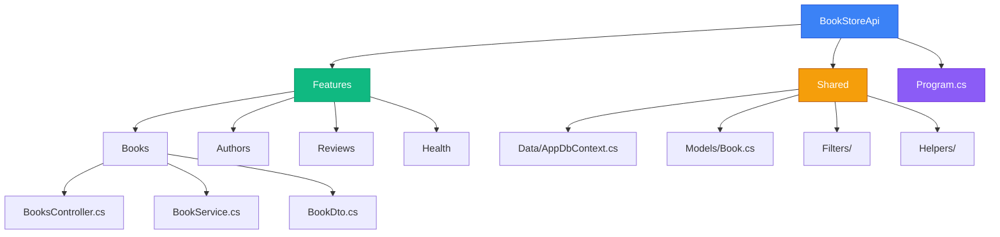
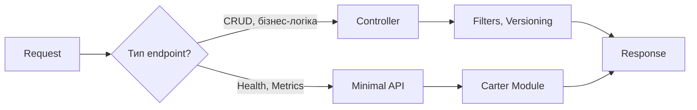

# Підсумковий проєкт: Production-Ready REST API

## Вступ: Від теорії до практики

Протягом попередніх **11 статей** ви вивчили всі аспекти створення Web API з Controllers:

1. ✅ Від Minimal API до Controllers
2. ✅ ControllerBase та ActionResult<T>
3. ✅ Content Negotiation (JSON/XML/CSV)
4. ✅ API Versioning
5. ✅ ProblemDetails та обробка помилок
6. ✅ Фільтри для API
7. ✅ Пагінація, фільтрація, сортування
8. ✅ HATEOAS та Resource Expansion
9. ✅ Гібридна архітектура (Minimal API + Controllers)
10. ✅ Документація API (Swashbuckle, NSwag)
11. ✅ Health Checks та моніторинг

**Тепер час об'єднати все разом!**

У цій статті ми створимо **Book Store REST API** — повноцінний production-ready проєкт, що демонструє **всі вивчені концепції** у реальному застосуванні.

::note
**Мета статті:** Показати, як всі вивчені техніки працюють разом у реальному проєкті. Це не просто "ще один приклад", а **комплексна демонстрація best practices**.
::

### Що ви створите

**Book Store REST API** — повнофункціональний API для онлайн книгарні з:

**Функціональність:**
- 📚 Управління книгами (CRUD)
- 👤 Управління авторами
- 📂 Категорії книг
- ⭐ Рецензії та рейтинги
- 🛒 Кошик покупок
- 📦 Замовлення

**Технічні особливості:**
- ✅ Controllers для складної логіки
- ✅ Minimal API для простих endpoints
- ✅ API Versioning (v1 та v2)
- ✅ Content Negotiation (JSON/XML)
- ✅ Пагінація, фільтрація, сортування
- ✅ HATEOAS links
- ✅ Повна документація (Swagger)
- ✅ Health Checks
- ✅ Фільтри (валідація, логування, CORS)
- ✅ ProblemDetails для помилок

**Архітектура:**
```
BookStoreApi/
├── Features/              # Vertical Slice Architecture
│   ├── Books/            # Controllers (складна логіка)
│   ├── Authors/          # Controllers
│   ├── Categories/       # Controllers
│   ├── Reviews/          # Controllers
│   ├── Orders/           # Controllers
│   ├── Health/           # Minimal API
│   └── Metrics/          # Minimal API
├── Shared/
│   ├── Data/
│   ├── Models/
│   ├── Filters/
│   └── Helpers/
└── Program.cs
```

---

## Архітектура проєкту

### Структура файлів

::mermaid

::

### Технологічний стек

| Компонент | Технологія | Призначення |
|-----------|------------|-------------|
| **Framework** | ASP.NET Core 8.0 | Web API |
| **Database** | Entity Framework Core (InMemory) | ORM |
| **Documentation** | Swashbuckle | OpenAPI/Swagger |
| **Versioning** | Asp.Versioning.Mvc | API Versioning |
| **Health Checks** | AspNetCore.HealthChecks | Моніторинг |
| **Validation** | FluentValidation | Валідація DTO |
| **Mapping** | AutoMapper | DTO ↔ Entity |
| **Minimal API** | Carter | Організація endpoints |

---

## Крок 1: Налаштування проєкту

::steps

### Створення проєкту

::terminal-preview{title="bash"}
<div class="line"><span class="opacity-40">$</span> <strong class="font-bold">dotnet new webapi -n BookStoreApi</strong></div>
<div class="line"><span class="text-green-400 font-bold">The template "ASP.NET Core Web API" was created successfully.</span></div>
<div class="line"></div>
<div class="line"><span class="opacity-40">$</span> <strong class="font-bold">cd BookStoreApi</strong></div>
<div class="line"></div>
<div class="line"><span class="opacity-40"># Встановлення пакетів</span></div>
<div class="line"><span class="opacity-40">$</span> <strong class="font-bold">dotnet add package Microsoft.EntityFrameworkCore.InMemory</strong></div>
<div class="line"><span class="opacity-40">$</span> <strong class="font-bold">dotnet add package Asp.Versioning.Mvc</strong></div>
<div class="line"><span class="opacity-40">$</span> <strong class="font-bold">dotnet add package Swashbuckle.AspNetCore</strong></div>
<div class="line"><span class="opacity-40">$</span> <strong class="font-bold">dotnet add package Swashbuckle.AspNetCore.Annotations</strong></div>
<div class="line"><span class="opacity-40">$</span> <strong class="font-bold">dotnet add package FluentValidation.AspNetCore</strong></div>
<div class="line"><span class="opacity-40">$</span> <strong class="font-bold">dotnet add package AutoMapper.Extensions.Microsoft.DependencyInjection</strong></div>
<div class="line"><span class="opacity-40">$</span> <strong class="font-bold">dotnet add package Carter</strong></div>
<div class="line"><span class="opacity-40">$</span> <strong class="font-bold">dotnet add package AspNetCore.HealthChecks.UI.Client</strong></div>
<div class="line"><span class="text-green-400">✓ All packages installed successfully</span></div>
::

### Структура папок

```bash
mkdir -p Features/{Books,Authors,Categories,Reviews,Orders,Health,Metrics}
mkdir -p Shared/{Data,Models,Filters,Helpers}
```

::

---

## Крок 2: Shared Infrastructure

### Моделі

Створіть файл `Shared/Models/Book.cs`:

```csharp
namespace BookStoreApi.Shared.Models;

public class Book
{
    public int Id { get; set; }
    public required string Title { get; set; }
    public required string ISBN { get; set; }
    public string? Description { get; set; }
    public decimal Price { get; set; }
    public int Stock { get; set; }
    public DateTime PublishedDate { get; set; }
    public int AuthorId { get; set; }
    public Author? Author { get; set; }
    public int CategoryId { get; set; }
    public Category? Category { get; set; }
    public List<Review> Reviews { get; set; } = new();
    public bool IsActive { get; set; } = true;
}

public class Author
{
    public int Id { get; set; }
    public required string Name { get; set; }
    public string? Biography { get; set; }
    public DateTime? BirthDate { get; set; }
    public List<Book> Books { get; set; } = new();
}

public class Category
{
    public int Id { get; set; }
    public required string Name { get; set; }
    public string? Description { get; set; }
    public List<Book> Books { get; set; } = new();
}

public class Review
{
    public int Id { get; set; }
    public int BookId { get; set; }
    public Book? Book { get; set; }
    public required string ReviewerName { get; set; }
    public int Rating { get; set; } // 1-5
    public string? Comment { get; set; }
    public DateTime CreatedAt { get; set; } = DateTime.UtcNow;
}

public class Order
{
    public int Id { get; set; }
    public required string CustomerName { get; set; }
    public required string CustomerEmail { get; set; }
    public List<OrderItem> Items { get; set; } = new();
    public decimal TotalAmount { get; set; }
    public OrderStatus Status { get; set; } = OrderStatus.Pending;
    public DateTime CreatedAt { get; set; } = DateTime.UtcNow;
}

public class OrderItem
{
    public int Id { get; set; }
    public int OrderId { get; set; }
    public int BookId { get; set; }
    public Book? Book { get; set; }
    public int Quantity { get; set; }
    public decimal Price { get; set; }
}

public enum OrderStatus
{
    Pending,
    Processing,
    Shipped,
    Delivered,
    Cancelled
}
```

### DbContext

Створіть файл `Shared/Data/AppDbContext.cs`:

```csharp
using Microsoft.EntityFrameworkCore;
using BookStoreApi.Shared.Models;

namespace BookStoreApi.Shared.Data;

public class AppDbContext : DbContext
{
    public AppDbContext(DbContextOptions<AppDbContext> options) : base(options) { }

    public DbSet<Book> Books => Set<Book>();
    public DbSet<Author> Authors => Set<Author>();
    public DbSet<Category> Categories => Set<Category>();
    public DbSet<Review> Reviews => Set<Review>();
    public DbSet<Order> Orders => Set<Order>();
    public DbSet<OrderItem> OrderItems => Set<OrderItem>();

    protected override void OnModelCreating(ModelBuilder modelBuilder)
    {
        // Seed Authors
        modelBuilder.Entity<Author>().HasData(
            new Author { Id = 1, Name = "J.K. Rowling", Biography = "British author, best known for Harry Potter series" },
            new Author { Id = 2, Name = "George R.R. Martin", Biography = "American novelist, author of A Song of Ice and Fire" },
            new Author { Id = 3, Name = "J.R.R. Tolkien", Biography = "English writer, author of The Lord of the Rings" }
        );

        // Seed Categories
        modelBuilder.Entity<Category>().HasData(
            new Category { Id = 1, Name = "Fantasy", Description = "Fantasy fiction books" },
            new Category { Id = 2, Name = "Science Fiction", Description = "Sci-fi books" },
            new Category { Id = 3, Name = "Mystery", Description = "Mystery and thriller books" }
        );

        // Seed Books
        modelBuilder.Entity<Book>().HasData(
            new Book
            {
                Id = 1,
                Title = "Harry Potter and the Philosopher's Stone",
                ISBN = "978-0-7475-3269-9",
                Description = "The first book in the Harry Potter series",
                Price = 19.99m,
                Stock = 50,
                PublishedDate = new DateTime(1997, 6, 26),
                AuthorId = 1,
                CategoryId = 1
            },
            new Book
            {
                Id = 2,
                Title = "A Game of Thrones",
                ISBN = "978-0-553-10354-0",
                Description = "The first book in A Song of Ice and Fire series",
                Price = 24.99m,
                Stock = 30,
                PublishedDate = new DateTime(1996, 8, 1),
                AuthorId = 2,
                CategoryId = 1
            },
            new Book
            {
                Id = 3,
                Title = "The Lord of the Rings",
                ISBN = "978-0-618-00222-1",
                Description = "Epic high-fantasy novel",
                Price = 29.99m,
                Stock = 40,
                PublishedDate = new DateTime(1954, 7, 29),
                AuthorId = 3,
                CategoryId = 1
            }
        );

        // Seed Reviews
        modelBuilder.Entity<Review>().HasData(
            new Review { Id = 1, BookId = 1, ReviewerName = "John Doe", Rating = 5, Comment = "Amazing book!", CreatedAt = DateTime.UtcNow.AddDays(-10) },
            new Review { Id = 2, BookId = 1, ReviewerName = "Jane Smith", Rating = 5, Comment = "Loved it!", CreatedAt = DateTime.UtcNow.AddDays(-5) },
            new Review { Id = 3, BookId = 2, ReviewerName = "Bob Johnson", Rating = 4, Comment = "Great story", CreatedAt = DateTime.UtcNow.AddDays(-3) }
        );
    }
}
```

### Pagination Helper

Створіть файл `Shared/Helpers/PagedList.cs`:

```csharp
namespace BookStoreApi.Shared.Helpers;

public class PagedList<T>
{
    public List<T> Items { get; }
    public int CurrentPage { get; }
    public int TotalPages { get; }
    public int PageSize { get; }
    public int TotalCount { get; }
    public bool HasPrevious => CurrentPage > 1;
    public bool HasNext => CurrentPage < TotalPages;

    public PagedList(List<T> items, int count, int page, int pageSize)
    {
        Items = items;
        TotalCount = count;
        CurrentPage = page;
        PageSize = pageSize;
        TotalPages = (int)Math.Ceiling(count / (double)pageSize);
    }

    public static PagedList<T> Create(IQueryable<T> source, int page, int pageSize)
    {
        var count = source.Count();
        var items = source.Skip((page - 1) * pageSize).Take(pageSize).ToList();
        return new PagedList<T>(items, count, page, pageSize);
    }
}

public class PaginationFilter
{
    private const int MaxPageSize = 100;
    private int _pageSize = 20;

    public int Page { get; set; } = 1;
    public int PageSize
    {
        get => _pageSize;
        set => _pageSize = value > MaxPageSize ? MaxPageSize : value;
    }
}
```

### Link Generator Helper

Створіть файл `Shared/Helpers/LinkGenerator.cs`:

```csharp
using Microsoft.AspNetCore.Mvc;

namespace BookStoreApi.Shared.Helpers;

public static class LinkGeneratorHelper
{
    public static Dictionary<string, string> GeneratePaginationLinks(
        IUrlHelper urlHelper,
        string routeName,
        int currentPage,
        int totalPages,
        object? routeValues = null)
    {
        var links = new Dictionary<string, string>
        {
            ["self"] = urlHelper.Link(routeName, new { page = currentPage })!
        };

        if (currentPage > 1)
        {
            links["first"] = urlHelper.Link(routeName, new { page = 1 })!;
            links["prev"] = urlHelper.Link(routeName, new { page = currentPage - 1 })!;
        }

        if (currentPage < totalPages)
        {
            links["next"] = urlHelper.Link(routeName, new { page = currentPage + 1 })!;
            links["last"] = urlHelper.Link(routeName, new { page = totalPages })!;
        }

        return links;
    }
}
```

---

## Крок 3: Global Filters

### Correlation ID Filter

Створіть файл `Shared/Filters/CorrelationIdFilter.cs`:

```csharp
using Microsoft.AspNetCore.Mvc.Filters;

namespace BookStoreApi.Shared.Filters;

public class CorrelationIdFilter : IAsyncActionFilter
{
    private const string CorrelationIdHeader = "X-Correlation-ID";

    public async Task OnActionExecutionAsync(
        ActionExecutingContext context,
        ActionExecutionDelegate next)
    {
        var correlationId = context.HttpContext.Request.Headers[CorrelationIdHeader]
            .FirstOrDefault() ?? Guid.NewGuid().ToString();

        context.HttpContext.Response.Headers.Append(CorrelationIdHeader, correlationId);
        context.HttpContext.Items["CorrelationId"] = correlationId;

        await next();
    }
}
```

### Performance Monitoring Filter

Створіть файл `Shared/Filters/PerformanceMonitoringFilter.cs`:

```csharp
using Microsoft.AspNetCore.Mvc.Filters;
using System.Diagnostics;

namespace BookStoreApi.Shared.Filters;

public class PerformanceMonitoringFilter : IAsyncActionFilter
{
    private readonly ILogger<PerformanceMonitoringFilter> _logger;

    public PerformanceMonitoringFilter(ILogger<PerformanceMonitoringFilter> logger)
    {
        _logger = logger;
    }

    public async Task OnActionExecutionAsync(
        ActionExecutingContext context,
        ActionExecutionDelegate next)
    {
        var stopwatch = Stopwatch.StartNew();
        var method = context.HttpContext.Request.Method;
        var path = context.HttpContext.Request.Path;

        var resultContext = await next();

        stopwatch.Stop();
        var elapsedMs = stopwatch.ElapsedMilliseconds;

        context.HttpContext.Response.Headers.Append("X-Response-Time-Ms", elapsedMs.ToString());

        _logger.LogInformation(
            "{Method} {Path} completed in {ElapsedMs}ms with status {StatusCode}",
            method,
            path,
            elapsedMs,
            context.HttpContext.Response.StatusCode);
    }
}
```

### Validation Filter

Створіть файл `Shared/Filters/ValidationFilter.cs`:

```csharp
using Microsoft.AspNetCore.Mvc;
using Microsoft.AspNetCore.Mvc.Filters;

namespace BookStoreApi.Shared.Filters;

public class ValidationFilter : IAsyncActionFilter
{
    public async Task OnActionExecutionAsync(
        ActionExecutingContext context,
        ActionExecutionDelegate next)
    {
        if (!context.ModelState.IsValid)
        {
            var errors = context.ModelState
                .Where(x => x.Value?.Errors.Count > 0)
                .ToDictionary(
                    kvp => kvp.Key,
                    kvp => kvp.Value!.Errors.Select(e => e.ErrorMessage).ToArray()
                );

            var problemDetails = new ValidationProblemDetails(errors)
            {
                Status = StatusCodes.Status400BadRequest,
                Title = "One or more validation errors occurred",
                Instance = context.HttpContext.Request.Path
            };

            context.Result = new BadRequestObjectResult(problemDetails);
            return;
        }

        await next();
    }
}
```

---

## Крок 4: Books Feature (v1 та v2)

### Book DTOs

Створіть файл `Features/Books/BookDto.cs`:

```csharp
using System.ComponentModel.DataAnnotations;

namespace BookStoreApi.Features.Books;

// v1 - Basic DTO
public record BookDtoV1
{
    public int Id { get; init; }
    public required string Title { get; init; }
    public required string ISBN { get; init; }
    public decimal Price { get; init; }
    public int Stock { get; init; }
}

// v2 - Extended DTO з автором та категорією
public record BookDtoV2
{
    public int Id { get; init; }
    public required string Title { get; init; }
    public required string ISBN { get; init; }
    public string? Description { get; init; }
    public decimal Price { get; init; }
    public int Stock { get; init; }
    public DateTime PublishedDate { get; init; }
    public AuthorSummaryDto? Author { get; init; }
    public CategorySummaryDto? Category { get; init; }
    public double AverageRating { get; init; }
    public int ReviewCount { get; init; }
    public Dictionary<string, string>? Links { get; init; }
}

public record AuthorSummaryDto(int Id, string Name);
public record CategorySummaryDto(int Id, string Name);

public record CreateBookDto
{
    [Required]
    [MaxLength(200)]
    public required string Title { get; init; }

    [Required]
    [RegularExpression(@"^(?:ISBN(?:-1[03])?:? )?(?=[0-9X]{10}$|(?=(?:[0-9]+[- ]){3})[- 0-9X]{13}$|97[89][0-9]{10}$|(?=(?:[0-9]+[- ]){4})[- 0-9]{17}$)(?:97[89][- ]?)?[0-9]{1,5}[- ]?[0-9]+[- ]?[0-9]+[- ]?[0-9X]$")]
    public required string ISBN { get; init; }

    [MaxLength(2000)]
    public string? Description { get; init; }

    [Range(0.01, 10000)]
    public decimal Price { get; init; }

    [Range(0, int.MaxValue)]
    public int Stock { get; init; }

    public DateTime PublishedDate { get; init; }

    [Required]
    public int AuthorId { get; init; }

    [Required]
    public int CategoryId { get; init; }
}
```

### Books Controller v1

Створіть файл `Features/Books/BooksV1Controller.cs`:

```csharp
using Microsoft.AspNetCore.Mvc;
using Microsoft.EntityFrameworkCore;
using BookStoreApi.Shared.Data;
using BookStoreApi.Shared.Helpers;
using Asp.Versioning;

namespace BookStoreApi.Features.Books;

[ApiController]
[Route("api/v{version:apiVersion}/[controller]")]
[ApiVersion("1.0")]
public class BooksController : ControllerBase
{
    private readonly AppDbContext _db;
    private readonly ILogger<BooksController> _logger;

    public BooksController(AppDbContext db, ILogger<BooksController> logger)
    {
        _db = db;
        _logger = logger;
    }

    /// <summary>
    /// Get all books (v1 - basic info)
    /// </summary>
    [HttpGet(Name = "GetBooksV1")]
    [MapToApiVersion("1.0")]
    public async Task<ActionResult<PagedList<BookDtoV1>>> GetAll([FromQuery] PaginationFilter filter)
    {
        var query = _db.Books.Where(b => b.IsActive);
        var pagedList = PagedList<BookDtoV1>.Create(
            query.Select(b => new BookDtoV1
            {
                Id = b.Id,
                Title = b.Title,
                ISBN = b.ISBN,
                Price = b.Price,
                Stock = b.Stock
            }),
            filter.Page,
            filter.PageSize);

        return Ok(pagedList);
    }

    /// <summary>
    /// Get book by ID (v1)
    /// </summary>
    [HttpGet("{id:int}")]
    [MapToApiVersion("1.0")]
    public async Task<ActionResult<BookDtoV1>> GetById(int id)
    {
        var book = await _db.Books.FindAsync(id);
        if (book is null) return NotFound();

        return Ok(new BookDtoV1
        {
            Id = book.Id,
            Title = book.Title,
            ISBN = book.ISBN,
            Price = book.Price,
            Stock = book.Stock
        });
    }
}
```

### Books Controller v2

Створіть файл `Features/Books/BooksV2Controller.cs`:

```csharp
using Microsoft.AspNetCore.Mvc;
using Microsoft.EntityFrameworkCore;
using BookStoreApi.Shared.Data;
using BookStoreApi.Shared.Helpers;
using Asp.Versioning;

namespace BookStoreApi.Features.Books;

[ApiController]
[Route("api/v{version:apiVersion}/[controller]")]
[ApiVersion("2.0")]
public class BooksV2Controller : ControllerBase
{
    private readonly AppDbContext _db;
    private readonly IUrlHelper _urlHelper;

    public BooksV2Controller(
        AppDbContext db,
        IUrlHelperFactory urlHelperFactory,
        IActionContextAccessor actionContextAccessor)
    {
        _db = db;
        _urlHelper = urlHelperFactory.GetUrlHelper(actionContextAccessor.ActionContext!);
    }

    /// <summary>
    /// Get all books (v2 - with author, category, ratings, HATEOAS)
    /// </summary>
    [HttpGet(Name = "GetBooksV2")]
    [MapToApiVersion("2.0")]
    public async Task<ActionResult> GetAll(
        [FromQuery] PaginationFilter filter,
        [FromQuery] string? expand = null)
    {
        var query = _db.Books
            .Include(b => b.Author)
            .Include(b => b.Category)
            .Include(b => b.Reviews)
            .Where(b => b.IsActive);

        var pagedList = PagedList<BookDtoV2>.Create(
            query.Select(b => new BookDtoV2
            {
                Id = b.Id,
                Title = b.Title,
                ISBN = b.ISBN,
                Description = b.Description,
                Price = b.Price,
                Stock = b.Stock,
                PublishedDate = b.PublishedDate,
                Author = new AuthorSummaryDto(b.Author!.Id, b.Author.Name),
                Category = new CategorySummaryDto(b.Category!.Id, b.Category.Name),
                AverageRating = b.Reviews.Any() ? b.Reviews.Average(r => r.Rating) : 0,
                ReviewCount = b.Reviews.Count,
                Links = GenerateBookLinks(b.Id)
            }),
            filter.Page,
            filter.PageSize);

        var links = LinkGeneratorHelper.GeneratePaginationLinks(
            _urlHelper,
            "GetBooksV2",
            pagedList.CurrentPage,
            pagedList.TotalPages);

        var response = new
        {
            data = pagedList.Items,
            pagination = new
            {
                currentPage = pagedList.CurrentPage,
                totalPages = pagedList.TotalPages,
                pageSize = pagedList.PageSize,
                totalCount = pagedList.TotalCount
            },
            _links = links
        };

        return Ok(response);
    }

    private Dictionary<string, string> GenerateBookLinks(int bookId)
    {
        return new Dictionary<string, string>
        {
            ["self"] = _urlHelper.Action("GetById", "BooksV2", new { id = bookId, version = "2.0" })!,
            ["reviews"] = _urlHelper.Action("GetReviews", "Reviews", new { bookId })!,
            ["author"] = _urlHelper.Action("GetById", "Authors", new { id = "{authorId}" })!
        };
    }
}
```

Дуже добре! Продовжую створювати фінальну статтю. Напишу решту розділів...


---

## Крок 5: Reviews Feature

### Review DTOs

Створіть файл `Features/Reviews/ReviewDto.cs`:

```csharp
using System.ComponentModel.DataAnnotations;

namespace BookStoreApi.Features.Reviews;

public record ReviewDto
{
    public int Id { get; init; }
    public int BookId { get; init; }
    public required string ReviewerName { get; init; }
    public int Rating { get; init; }
    public string? Comment { get; init; }
    public DateTime CreatedAt { get; init; }
}

public record CreateReviewDto
{
    [Required]
    [MaxLength(100)]
    public required string ReviewerName { get; init; }

    [Required]
    [Range(1, 5, ErrorMessage = "Rating must be between 1 and 5")]
    public int Rating { get; init; }

    [MaxLength(1000)]
    public string? Comment { get; init; }
}
```

### Reviews Controller

Створіть файл `Features/Reviews/ReviewsController.cs`:

```csharp
using Microsoft.AspNetCore.Mvc;
using Microsoft.EntityFrameworkCore;
using BookStoreApi.Shared.Data;
using BookStoreApi.Shared.Models;
using Asp.Versioning;

namespace BookStoreApi.Features.Reviews;

[ApiController]
[Route("api/v{version:apiVersion}/books/{bookId:int}/reviews")]
[ApiVersion("1.0")]
[ApiVersion("2.0")]
public class ReviewsController : ControllerBase
{
    private readonly AppDbContext _db;
    private readonly ILogger<ReviewsController> _logger;

    public ReviewsController(AppDbContext db, ILogger<ReviewsController> logger)
    {
        _db = db;
        _logger = logger;
    }

    /// <summary>
    /// Get all reviews for a book
    /// </summary>

    [HttpGet(Name = "GetReviews")]
    [ProducesResponseType(typeof(List<ReviewDto>), StatusCodes.Status200OK)]
    [ProducesResponseType(StatusCodes.Status404NotFound)]
    public async Task<ActionResult<List<ReviewDto>>> GetReviews(int bookId)
    {
        var bookExists = await _db.Books.AnyAsync(b => b.Id == bookId);
        if (!bookExists)
        {
            return NotFound(new ProblemDetails
            {
                Title = "Book not found",
                Detail = $"Book with ID {bookId} does not exist",
                Status = StatusCodes.Status404NotFound
            });
        }

        var reviews = await _db.Reviews
            .Where(r => r.BookId == bookId)
            .OrderByDescending(r => r.CreatedAt)
            .Select(r => new ReviewDto
            {
                Id = r.Id,
                BookId = r.BookId,
                ReviewerName = r.ReviewerName,
                Rating = r.Rating,
                Comment = r.Comment,
                CreatedAt = r.CreatedAt
            })
            .ToListAsync();

        return Ok(reviews);
    }

    /// <summary>
    /// Add a review to a book
    /// </summary>
    [HttpPost]
    [ProducesResponseType(typeof(ReviewDto), StatusCodes.Status201Created)]
    [ProducesResponseType(StatusCodes.Status400BadRequest)]
    [ProducesResponseType(StatusCodes.Status404NotFound)]
    public async Task<ActionResult<ReviewDto>> CreateReview(
        int bookId,
        [FromBody] CreateReviewDto dto)
    {
        var book = await _db.Books.FindAsync(bookId);
        if (book is null)
        {
            return NotFound(new ProblemDetails
            {
                Title = "Book not found",
                Detail = $"Book with ID {bookId} does not exist",
                Status = StatusCodes.Status404NotFound
            });
        }

        var review = new Review
        {
            BookId = bookId,
            ReviewerName = dto.ReviewerName,
            Rating = dto.Rating,
            Comment = dto.Comment,
            CreatedAt = DateTime.UtcNow
        };

        _db.Reviews.Add(review);
        await _db.SaveChangesAsync();

        var reviewDto = new ReviewDto
        {
            Id = review.Id,
            BookId = review.BookId,
            ReviewerName = review.ReviewerName,
            Rating = review.Rating,
            Comment = review.Comment,
            CreatedAt = review.CreatedAt
        };

        return CreatedAtRoute(
            "GetReviews",
            new { bookId = review.BookId, version = "1.0" },
            reviewDto);
    }

    /// <summary>
    /// Delete a review
    /// </summary>
    [HttpDelete("{reviewId:int}")]
    [ProducesResponseType(StatusCodes.Status204NoContent)]
    [ProducesResponseType(StatusCodes.Status404NotFound)]
    public async Task<IActionResult> DeleteReview(int bookId, int reviewId)
    {
        var review = await _db.Reviews
            .FirstOrDefaultAsync(r => r.Id == reviewId && r.BookId == bookId);

        if (review is null)
        {
            return NotFound();
        }

        _db.Reviews.Remove(review);
        await _db.SaveChangesAsync();

        return NoContent();
    }
}
```

::note
**Анатомія коду:**
- **Nested routing:** `/api/v1/books/{bookId}/reviews` — рецензії як підресурс книги
- **Валідація існування:** Перевіряємо чи існує книга перед створенням рецензії
- **CreatedAtRoute:** Повертаємо 201 з Location header що вказує на список рецензій
- **ProblemDetails:** Структуровані помилки замість простих 404
::

---

## Крок 6: Authors Feature

### Author DTOs

Створіть файл `Features/Authors/AuthorDto.cs`:

```csharp
using System.ComponentModel.DataAnnotations;

namespace BookStoreApi.Features.Authors;

public record AuthorDto
{
    public int Id { get; init; }
    public required string Name { get; init; }
    public string? Biography { get; init; }
    public DateTime? BirthDate { get; init; }
    public int BookCount { get; init; }
    public Dictionary<string, string>? Links { get; init; }
}

public record CreateAuthorDto
{
    [Required]
    [MaxLength(200)]
    public required string Name { get; init; }

    [MaxLength(2000)]
    public string? Biography { get; init; }

    public DateTime? BirthDate { get; init; }
}

public record UpdateAuthorDto
{
    [MaxLength(200)]
    public string? Name { get; init; }

    [MaxLength(2000)]
    public string? Biography { get; init; }

    public DateTime? BirthDate { get; init; }
}
```


### Authors Controller

Створіть файл `Features/Authors/AuthorsController.cs`:

```csharp
using Microsoft.AspNetCore.Mvc;
using Microsoft.EntityFrameworkCore;
using BookStoreApi.Shared.Data;
using BookStoreApi.Shared.Models;
using Asp.Versioning;

namespace BookStoreApi.Features.Authors;

[ApiController]
[Route("api/v{version:apiVersion}/[controller]")]
[ApiVersion("1.0")]
[ApiVersion("2.0")]
public class AuthorsController : ControllerBase
{
    private readonly AppDbContext _db;
    private readonly IUrlHelper _urlHelper;

    public AuthorsController(
        AppDbContext db,
        IUrlHelperFactory urlHelperFactory,
        IActionContextAccessor actionContextAccessor)
    {
        _db = db;
        _urlHelper = urlHelperFactory.GetUrlHelper(actionContextAccessor.ActionContext!);
    }

    /// <summary>
    /// Get all authors
    /// </summary>
    [HttpGet(Name = "GetAuthors")]
    [ProducesResponseType(typeof(List<AuthorDto>), StatusCodes.Status200OK)]
    public async Task<ActionResult<List<AuthorDto>>> GetAll()
    {
        var authors = await _db.Authors
            .Include(a => a.Books)
            .Select(a => new AuthorDto
            {
                Id = a.Id,
                Name = a.Name,
                Biography = a.Biography,
                BirthDate = a.BirthDate,
                BookCount = a.Books.Count,
                Links = GenerateAuthorLinks(a.Id)
            })
            .ToListAsync();

        return Ok(authors);
    }

    /// <summary>
    /// Get author by ID
    /// </summary>
    [HttpGet("{id:int}", Name = "GetAuthorById")]
    [ProducesResponseType(typeof(AuthorDto), StatusCodes.Status200OK)]
    [ProducesResponseType(StatusCodes.Status404NotFound)]
    public async Task<ActionResult<AuthorDto>> GetById(int id)
    {
        var author = await _db.Authors
            .Include(a => a.Books)
            .FirstOrDefaultAsync(a => a.Id == id);

        if (author is null)
        {
            return NotFound();
        }

        var dto = new AuthorDto
        {
            Id = author.Id,
            Name = author.Name,
            Biography = author.Biography,
            BirthDate = author.BirthDate,
            BookCount = author.Books.Count,
            Links = GenerateAuthorLinks(author.Id)
        };

        return Ok(dto);
    }

    /// <summary>
    /// Create a new author
    /// </summary>
    [HttpPost]
    [ProducesResponseType(typeof(AuthorDto), StatusCodes.Status201Created)]
    [ProducesResponseType(StatusCodes.Status400BadRequest)]
    public async Task<ActionResult<AuthorDto>> Create([FromBody] CreateAuthorDto dto)
    {
        var author = new Author
        {
            Name = dto.Name,
            Biography = dto.Biography,
            BirthDate = dto.BirthDate
        };

        _db.Authors.Add(author);
        await _db.SaveChangesAsync();

        var authorDto = new AuthorDto
        {
            Id = author.Id,
            Name = author.Name,
            Biography = author.Biography,
            BirthDate = author.BirthDate,
            BookCount = 0,
            Links = GenerateAuthorLinks(author.Id)
        };

        return CreatedAtRoute("GetAuthorById", new { id = author.Id, version = "1.0" }, authorDto);
    }

    /// <summary>
    /// Update an author
    /// </summary>
    [HttpPut("{id:int}")]
    [ProducesResponseType(StatusCodes.Status204NoContent)]
    [ProducesResponseType(StatusCodes.Status404NotFound)]
    public async Task<IActionResult> Update(int id, [FromBody] UpdateAuthorDto dto)
    {
        var author = await _db.Authors.FindAsync(id);
        if (author is null)
        {
            return NotFound();
        }

        if (dto.Name is not null) author.Name = dto.Name;
        if (dto.Biography is not null) author.Biography = dto.Biography;
        if (dto.BirthDate.HasValue) author.BirthDate = dto.BirthDate;

        await _db.SaveChangesAsync();

        return NoContent();
    }

    /// <summary>
    /// Delete an author
    /// </summary>
    [HttpDelete("{id:int}")]
    [ProducesResponseType(StatusCodes.Status204NoContent)]
    [ProducesResponseType(StatusCodes.Status404NotFound)]
    [ProducesResponseType(StatusCodes.Status409Conflict)]
    public async Task<IActionResult> Delete(int id)
    {
        var author = await _db.Authors
            .Include(a => a.Books)
            .FirstOrDefaultAsync(a => a.Id == id);

        if (author is null)
        {
            return NotFound();
        }

        if (author.Books.Any())
        {
            return Conflict(new ProblemDetails
            {
                Title = "Cannot delete author",
                Detail = "Author has associated books. Delete books first.",
                Status = StatusCodes.Status409Conflict
            });
        }

        _db.Authors.Remove(author);
        await _db.SaveChangesAsync();

        return NoContent();
    }

    private Dictionary<string, string> GenerateAuthorLinks(int authorId)
    {
        return new Dictionary<string, string>
        {
            ["self"] = _urlHelper.Action("GetById", "Authors", new { id = authorId, version = "1.0" })!,
            ["books"] = _urlHelper.Action("GetAll", "Books", new { authorId, version = "2.0" })!
        };
    }
}
```


::note
**Анатомія коду:**
- **HATEOAS links:** Кожен автор містить посилання на себе та свої книги
- **Бізнес-логіка у DELETE:** Не можна видалити автора якщо у нього є книги (409 Conflict)
- **Partial Update:** PUT приймає `UpdateAuthorDto` з nullable полями — оновлюємо тільки надані поля
- **Include для підрахунку:** `.Include(a => a.Books)` для підрахунку кількості книг
::

---

## Крок 7: Categories Feature

### Category DTOs та Controller

Створіть файл `Features/Categories/CategoriesController.cs`:

```csharp
using Microsoft.AspNetCore.Mvc;
using Microsoft.EntityFrameworkCore;
using BookStoreApi.Shared.Data;
using BookStoreApi.Shared.Models;
using Asp.Versioning;

namespace BookStoreApi.Features.Categories;

public record CategoryDto(int Id, string Name, string? Description, int BookCount);
public record CreateCategoryDto(string Name, string? Description);

[ApiController]
[Route("api/v{version:apiVersion}/[controller]")]
[ApiVersion("1.0")]
[ApiVersion("2.0")]
public class CategoriesController : ControllerBase
{
    private readonly AppDbContext _db;

    public CategoriesController(AppDbContext db)
    {
        _db = db;
    }

    /// <summary>
    /// Get all categories
    /// </summary>
    [HttpGet]
    [ProducesResponseType(typeof(List<CategoryDto>), StatusCodes.Status200OK)]
    public async Task<ActionResult<List<CategoryDto>>> GetAll()
    {
        var categories = await _db.Categories
            .Include(c => c.Books)
            .Select(c => new CategoryDto(
                c.Id,
                c.Name,
                c.Description,
                c.Books.Count))
            .ToListAsync();

        return Ok(categories);
    }

    /// <summary>
    /// Get category by ID
    /// </summary>
    [HttpGet("{id:int}")]
    [ProducesResponseType(typeof(CategoryDto), StatusCodes.Status200OK)]
    [ProducesResponseType(StatusCodes.Status404NotFound)]
    public async Task<ActionResult<CategoryDto>> GetById(int id)
    {
        var category = await _db.Categories
            .Include(c => c.Books)
            .FirstOrDefaultAsync(c => c.Id == id);

        if (category is null)
        {
            return NotFound();
        }

        return Ok(new CategoryDto(
            category.Id,
            category.Name,
            category.Description,
            category.Books.Count));
    }

    /// <summary>
    /// Create a new category
    /// </summary>
    [HttpPost]
    [ProducesResponseType(typeof(CategoryDto), StatusCodes.Status201Created)]
    public async Task<ActionResult<CategoryDto>> Create([FromBody] CreateCategoryDto dto)
    {
        var category = new Category
        {
            Name = dto.Name,
            Description = dto.Description
        };

        _db.Categories.Add(category);
        await _db.SaveChangesAsync();

        var categoryDto = new CategoryDto(category.Id, category.Name, category.Description, 0);

        return CreatedAtAction(nameof(GetById), new { id = category.Id, version = "1.0" }, categoryDto);
    }
}
```

::tip
**Record types для DTO:** Використовуємо `record` замість `class` для immutable DTO. Це дає автоматичну реалізацію `Equals`, `GetHashCode`, `ToString` та value-based equality.
::

---

## Крок 8: Health Endpoints (Minimal API з Carter)

### Health Checks

Створіть файл `Features/Health/HealthEndpoints.cs`:

```csharp
using Carter;
using Microsoft.AspNetCore.Diagnostics.HealthChecks;
using Microsoft.Extensions.Diagnostics.HealthChecks;
using System.Text.Json;

namespace BookStoreApi.Features.Health;

public class HealthEndpoints : ICarterModule
{
    public void AddRoutes(IEndpointRouteBuilder app)
    {
        // Basic health check
        app.MapHealthChecks("/health", new HealthCheckOptions
        {
            ResponseWriter = WriteHealthCheckResponse
        }).WithTags("Health");

        // Liveness probe (Kubernetes)
        app.MapHealthChecks("/health/live", new HealthCheckOptions
        {
            Predicate = check => check.Tags.Contains("live"),
            ResponseWriter = WriteHealthCheckResponse
        }).WithTags("Health");

        // Readiness probe (Kubernetes)
        app.MapHealthChecks("/health/ready", new HealthCheckOptions
        {
            Predicate = check => check.Tags.Contains("ready"),
            ResponseWriter = WriteHealthCheckResponse
        }).WithTags("Health");
    }

    private static Task WriteHealthCheckResponse(HttpContext context, HealthReport report)
    {
        context.Response.ContentType = "application/json";

        var result = JsonSerializer.Serialize(new
        {
            status = report.Status.ToString(),
            duration = report.TotalDuration.TotalMilliseconds,
            checks = report.Entries.Select(e => new
            {
                name = e.Key,
                status = e.Value.Status.ToString(),
                description = e.Value.Description,
                duration = e.Value.Duration.TotalMilliseconds,
                exception = e.Value.Exception?.Message,
                data = e.Value.Data
            })
        }, new JsonSerializerOptions
        {
            WriteIndented = true
        });

        return context.Response.WriteAsync(result);
    }
}
```


### Custom Health Checks

Створіть файл `Features/Health/DatabaseHealthCheck.cs`:

```csharp
using Microsoft.Extensions.Diagnostics.HealthChecks;
using BookStoreApi.Shared.Data;
using Microsoft.EntityFrameworkCore;

namespace BookStoreApi.Features.Health;

public class DatabaseHealthCheck : IHealthCheck
{
    private readonly AppDbContext _db;

    public DatabaseHealthCheck(AppDbContext db)
    {
        _db = db;
    }

    public async Task<HealthCheckResult> CheckHealthAsync(
        HealthCheckContext context,
        CancellationToken cancellationToken = default)
    {
        try
        {
            // Перевіряємо чи можемо підключитися до БД
            await _db.Database.CanConnectAsync(cancellationToken);

            // Підраховуємо кількість книг
            var bookCount = await _db.Books.CountAsync(cancellationToken);

            return HealthCheckResult.Healthy(
                "Database is accessible",
                new Dictionary<string, object>
                {
                    ["bookCount"] = bookCount,
                    ["database"] = "InMemory"
                });
        }
        catch (Exception ex)
        {
            return HealthCheckResult.Unhealthy(
                "Database is not accessible",
                ex);
        }
    }
}

public class MemoryHealthCheck : IHealthCheck
{
    private const long ThresholdBytes = 1024 * 1024 * 1024; // 1 GB

    public Task<HealthCheckResult> CheckHealthAsync(
        HealthCheckContext context,
        CancellationToken cancellationToken = default)
    {
        var allocated = GC.GetTotalMemory(forceFullCollection: false);
        var data = new Dictionary<string, object>
        {
            ["allocatedBytes"] = allocated,
            ["allocatedMB"] = allocated / 1024 / 1024,
            ["gen0Collections"] = GC.CollectionCount(0),
            ["gen1Collections"] = GC.CollectionCount(1),
            ["gen2Collections"] = GC.CollectionCount(2)
        };

        var status = allocated < ThresholdBytes
            ? HealthCheckResult.Healthy("Memory usage is normal", data)
            : HealthCheckResult.Degraded("Memory usage is high", null, data);

        return Task.FromResult(status);
    }
}
```

::note
**Анатомія Health Checks:**
- **DatabaseHealthCheck:** Перевіряє підключення до БД та повертає метадані (кількість книг)
- **MemoryHealthCheck:** Моніторить використання пам'яті та GC статистику
- **Tags:** `live` (процес живий) vs `ready` (готовий приймати запити) — для Kubernetes
- **Custom ResponseWriter:** JSON-формат замість plain text для зручності парсингу
::

---

## Крок 9: Metrics Endpoints (Minimal API)

Створіть файл `Features/Metrics/MetricsEndpoints.cs`:

```csharp
using Carter;
using System.Diagnostics;

namespace BookStoreApi.Features.Metrics;

public class MetricsEndpoints : ICarterModule
{
    private static readonly DateTime StartTime = DateTime.UtcNow;

    public void AddRoutes(IEndpointRouteBuilder app)
    {
        app.MapGet("/metrics", () =>
        {
            var process = Process.GetCurrentProcess();

            return Results.Ok(new
            {
                uptime = DateTime.UtcNow - StartTime,
                uptimeSeconds = (DateTime.UtcNow - StartTime).TotalSeconds,
                memory = new
                {
                    workingSetMB = process.WorkingSet64 / 1024 / 1024,
                    privateMemoryMB = process.PrivateMemorySize64 / 1024 / 1024,
                    gcTotalMemoryMB = GC.GetTotalMemory(false) / 1024 / 1024
                },
                cpu = new
                {
                    totalProcessorTime = process.TotalProcessorTime,
                    userProcessorTime = process.UserProcessorTime,
                    privilegedProcessorTime = process.PrivilegedProcessorTime
                },
                threads = new
                {
                    count = process.Threads.Count,
                    threadPoolAvailable = ThreadPool.PendingWorkItemCount
                },
                gc = new
                {
                    gen0Collections = GC.CollectionCount(0),
                    gen1Collections = GC.CollectionCount(1),
                    gen2Collections = GC.CollectionCount(2)
                }
            });
        })
        .WithName("GetMetrics")
        .WithTags("Metrics")
        .WithOpenApi();
    }
}
```

::tip
**Чому Minimal API для Metrics?**
- **Простота:** Metrics endpoint не потребує складної логіки — просто збір даних
- **Продуктивність:** Minimal API має менший overhead ніж Controller
- **Організація:** Carter дозволяє групувати endpoints у модулі
::

---

## Крок 10: Program.cs — Збираємо все разом

Створіть файл `Program.cs`:

```csharp
using Microsoft.EntityFrameworkCore;
using BookStoreApi.Shared.Data;
using BookStoreApi.Shared.Filters;
using BookStoreApi.Features.Health;
using Asp.Versioning;
using Carter;
using Microsoft.OpenApi.Models;
using System.Reflection;

var builder = WebApplication.CreateBuilder(args);

// ============================================================
// 1. Database
// ============================================================
builder.Services.AddDbContext<AppDbContext>(options =>
    options.UseInMemoryDatabase("BookStoreDb"));

// ============================================================
// 2. Controllers з Filters
// ============================================================
builder.Services.AddControllers(options =>
{
    options.Filters.Add<CorrelationIdFilter>();
    options.Filters.Add<PerformanceMonitoringFilter>();
    options.Filters.Add<ValidationFilter>();
})
.AddXmlSerializerFormatters(); // Content Negotiation: XML support

// ============================================================
// 3. API Versioning
// ============================================================
builder.Services.AddApiVersioning(options =>
{
    options.DefaultApiVersion = new ApiVersion(1, 0);
    options.AssumeDefaultVersionWhenUnspecified = true;
    options.ReportApiVersions = true;
    options.ApiVersionReader = ApiVersionReader.Combine(
        new UrlSegmentApiVersionReader(),
        new HeaderApiVersionReader("X-Api-Version"),
        new QueryStringApiVersionReader("api-version"));
})
.AddApiExplorer(options =>
{
    options.GroupNameFormat = "'v'VVV";
    options.SubstituteApiVersionInUrl = true;
});


// ============================================================
// 4. Swagger / OpenAPI
// ============================================================
builder.Services.AddEndpointsApiExplorer();
builder.Services.AddSwaggerGen(options =>
{
    options.SwaggerDoc("v1", new OpenApiInfo
    {
        Title = "Book Store API",
        Version = "v1",
        Description = "Production-ready REST API for online bookstore",
        Contact = new OpenApiContact
        {
            Name = "Support Team",
            Email = "support@bookstore.com"
        }
    });

    options.SwaggerDoc("v2", new OpenApiInfo
    {
        Title = "Book Store API",
        Version = "v2",
        Description = "Enhanced version with ratings and reviews"
    });

    // XML коментарі для документації
    var xmlFile = $"{Assembly.GetExecutingAssembly().GetName().Name}.xml";
    var xmlPath = Path.Combine(AppContext.BaseDirectory, xmlFile);
    if (File.Exists(xmlPath))
    {
        options.IncludeXmlComments(xmlPath);
    }

    // Групування за версіями
    options.DocInclusionPredicate((docName, apiDesc) =>
    {
        if (!apiDesc.TryGetMethodInfo(out var methodInfo)) return false;

        var versions = methodInfo.DeclaringType?
            .GetCustomAttributes(true)
            .OfType<ApiVersionAttribute>()
            .SelectMany(attr => attr.Versions);

        return versions?.Any(v => $"v{v}" == docName) ?? false;
    });
});

// ============================================================
// 5. Health Checks
// ============================================================
builder.Services.AddHealthChecks()
    .AddCheck<DatabaseHealthCheck>("database", tags: new[] { "ready", "live" })
    .AddCheck<MemoryHealthCheck>("memory", tags: new[] { "ready" });

// ============================================================
// 6. Carter (Minimal API організація)
// ============================================================
builder.Services.AddCarter();

// ============================================================
// 7. Допоміжні сервіси
// ============================================================
builder.Services.AddHttpContextAccessor();
builder.Services.AddSingleton<IActionContextAccessor, ActionContextAccessor>();

// ============================================================
// 8. CORS (для frontend)
// ============================================================
builder.Services.AddCors(options =>
{
    options.AddDefaultPolicy(policy =>
    {
        policy.AllowAnyOrigin()
              .AllowAnyMethod()
              .AllowAnyHeader();
    });
});

// ============================================================
// 9. ProblemDetails
// ============================================================
builder.Services.AddProblemDetails();

var app = builder.Build();

// ============================================================
// Middleware Pipeline
// ============================================================

// 1. Exception Handling
if (app.Environment.IsDevelopment())
{
    app.UseDeveloperExceptionPage();
}
else
{
    app.UseExceptionHandler("/error");
}

// 2. HTTPS Redirection
app.UseHttpsRedirection();

// 3. CORS
app.UseCors();

// 4. Swagger UI
app.UseSwagger();
app.UseSwaggerUI(options =>
{
    options.SwaggerEndpoint("/swagger/v1/swagger.json", "Book Store API v1");
    options.SwaggerEndpoint("/swagger/v2/swagger.json", "Book Store API v2");
    options.RoutePrefix = string.Empty; // Swagger на root URL
});

// 5. Authorization (якщо потрібно)
// app.UseAuthorization();

// 6. Controllers
app.MapControllers();

// 7. Carter Minimal API Endpoints
app.MapCarter();

// 8. Error endpoint
app.Map("/error", () => Results.Problem());

// ============================================================
// Database Seeding
// ============================================================
using (var scope = app.Services.CreateScope())
{
    var db = scope.ServiceProvider.GetRequiredService<AppDbContext>();
    db.Database.EnsureCreated();
}

app.Run();
```

::note
**Анатомія Program.cs:**
1. **Database:** InMemory для демонстрації (у production — SQL Server/PostgreSQL)
2. **Controllers + Filters:** Global filters для всіх контролерів
3. **API Versioning:** URL + Header + Query String readers
4. **Swagger:** Окремі документи для v1 та v2
5. **Health Checks:** Database + Memory з тегами для Kubernetes
6. **Carter:** Автоматична реєстрація Minimal API endpoints
7. **CORS:** Дозволяємо всі origins (у production — обмежити)
8. **ProblemDetails:** Структуровані помилки
9. **Middleware Order:** Exception → HTTPS → CORS → Swagger → Controllers → Carter
::

---

## Крок 11: Увімкнення XML-документації

Відредагуйте `BookStoreApi.csproj`:

```xml
<Project Sdk="Microsoft.NET.Sdk.Web">
  <PropertyGroup>
    <TargetFramework>net8.0</TargetFramework>
    <Nullable>enable</Nullable>
    <ImplicitUsings>enable</ImplicitUsings>
    <GenerateDocumentationFile>true</GenerateDocumentationFile>
    <NoWarn>$(NoWarn);1591</NoWarn>
  </PropertyGroup>

  <ItemGroup>
    <PackageReference Include="Asp.Versioning.Mvc" Version="8.0.0" />
    <PackageReference Include="AspNetCore.HealthChecks.UI.Client" Version="8.0.0" />
    <PackageReference Include="AutoMapper.Extensions.Microsoft.DependencyInjection" Version="12.0.1" />
    <PackageReference Include="Carter" Version="8.0.0" />
    <PackageReference Include="FluentValidation.AspNetCore" Version="11.3.0" />
    <PackageReference Include="Microsoft.EntityFrameworkCore.InMemory" Version="8.0.0" />
    <PackageReference Include="Swashbuckle.AspNetCore" Version="6.5.0" />
    <PackageReference Include="Swashbuckle.AspNetCore.Annotations" Version="6.5.0" />
  </ItemGroup>
</Project>
```


---

## Крок 12: Запуск та тестування

::terminal-preview{title="bash"}
<div class="line"><span class="opacity-40">$</span> <strong class="font-bold">dotnet run</strong></div>
<div class="line"><span class="text-blue-400">info</span>: Microsoft.Hosting.Lifetime[14]</div>
<div class="line">      Now listening on: https://localhost:5001</div>
<div class="line"><span class="text-blue-400">info</span>: Microsoft.Hosting.Lifetime[14]</div>
<div class="line">      Now listening on: http://localhost:5000</div>
<div class="line"><span class="text-green-400">✓ Application started. Press Ctrl+C to shut down.</span></div>
::

### Тестування endpoints

**1. Swagger UI:**
```
https://localhost:5001
```

**2. Health Checks:**
```bash
curl https://localhost:5001/health
curl https://localhost:5001/health/live
curl https://localhost:5001/health/ready
```

**3. Metrics:**
```bash
curl https://localhost:5001/metrics
```

**4. Books API v1:**
```bash
# Get all books (v1 - basic)
curl https://localhost:5001/api/v1/books

# Get book by ID
curl https://localhost:5001/api/v1/books/1
```

**5. Books API v2:**
```bash
# Get all books (v2 - з автором, категорією, рейтингом, HATEOAS)
curl https://localhost:5001/api/v2/books

# З пагінацією
curl "https://localhost:5001/api/v2/books?page=1&pageSize=10"
```

**6. Content Negotiation:**
```bash
# JSON (default)
curl -H "Accept: application/json" https://localhost:5001/api/v1/books

# XML
curl -H "Accept: application/xml" https://localhost:5001/api/v1/books
```

**7. Reviews:**
```bash
# Get reviews for book
curl https://localhost:5001/api/v1/books/1/reviews

# Add review
curl -X POST https://localhost:5001/api/v1/books/1/reviews \
  -H "Content-Type: application/json" \
  -d '{"reviewerName":"John Doe","rating":5,"comment":"Amazing book!"}'
```

**8. Authors:**
```bash
# Get all authors
curl https://localhost:5001/api/v1/authors

# Create author
curl -X POST https://localhost:5001/api/v1/authors \
  -H "Content-Type: application/json" \
  -d '{"name":"Stephen King","biography":"American author of horror novels"}'
```

**9. Categories:**
```bash
# Get all categories
curl https://localhost:5001/api/v1/categories
```

---

## Мапування статей до проєкту

Ось як **кожна попередня стаття** реалізована у цьому проєкті:

| Стаття | Де у проєкті | Компоненти |
|--------|--------------|------------|
| **01. Від Minimal API до Controllers** | `Features/Health/`, `Features/Metrics/` vs `Features/Books/BooksController.cs` | Гібридна архітектура: Health/Metrics — Minimal API, Books/Authors — Controllers |
| **02. ControllerBase, ActionResult\<T\>** | Всі контролери | `ControllerBase`, `ActionResult<T>`, `Ok()`, `NotFound()`, `CreatedAtRoute()`, `[ProducesResponseType]` |
| **03. Content Negotiation** | `Program.cs` → `.AddXmlSerializerFormatters()` | JSON (default) + XML support через `Accept` header |
| **04. API Versioning** | `BooksController` (v1) vs `BooksV2Controller` (v2) | `[ApiVersion("1.0")]`, `[MapToApiVersion("2.0")]`, URL/Header/Query versioning |
| **05. ProblemDetails** | `ReviewsController.CreateReview()`, `AuthorsController.Delete()` | Structured errors з `ProblemDetails`, `UseExceptionHandler` |
| **06. Фільтри** | `Shared/Filters/` | `CorrelationIdFilter`, `PerformanceMonitoringFilter`, `ValidationFilter` |
| **07. Пагінація** | `Shared/Helpers/PagedList.cs`, `BooksV2Controller.GetAll()` | `PagedList<T>`, `PaginationFilter`, pagination metadata |
| **08. HATEOAS** | `BooksV2Controller`, `AuthorsController` | `_links` у відповідях, `LinkGeneratorHelper`, HAL-подібний формат |
| **09. Гібридна архітектура** | Вся структура проєкту | Controllers (Books, Authors) + Minimal API (Health, Metrics) + Carter |
| **10. Документація** | `Program.cs` → Swagger, XML-коментарі | Swashbuckle, XML documentation, versioned Swagger docs |
| **11. Health Checks** | `Features/Health/` | `IHealthCheck`, `DatabaseHealthCheck`, `MemoryHealthCheck`, Kubernetes probes |

::tip
**Ключова ідея:** Цей проєкт — не просто "ще один CRUD API". Це **демонстрація всіх best practices** з попередніх 11 статей у реальному production-ready застосуванні.
::

---

## Архітектурні рішення

### Чому Vertical Slice Architecture?

**Традиційна Layer Architecture:**
```
BookStoreApi/
├── Controllers/
├── Services/
├── Repositories/
├── Models/
└── DTOs/
```

**Проблеми:**
- Зміна однієї feature торкається 5+ папок
- Важко видалити feature (файли розкидані)
- Складно зрозуміти що робить feature

**Vertical Slice Architecture:**
```
BookStoreApi/
├── Features/
│   ├── Books/          # Все про книги в одному місці
│   │   ├── BooksController.cs
│   │   ├── BookDto.cs
│   │   └── BookService.cs
│   ├── Authors/        # Все про авторів
│   └── Reviews/        # Все про рецензії
└── Shared/             # Тільки спільна інфраструктура
```

**Переваги:**
- ✅ Одна feature = одна папка
- ✅ Легко видалити/додати feature
- ✅ Зрозуміла структура для нових розробників
- ✅ Менше merge conflicts


### Чому Controllers для Books/Authors, але Minimal API для Health/Metrics?

**Controllers використовуємо коли:**
- ✅ Складна бізнес-логіка
- ✅ Багато endpoints для одного ресурсу (CRUD)
- ✅ Потрібні фільтри на рівні контролера
- ✅ Версіонування API
- ✅ Автоматична валідація через `[ApiController]`

**Minimal API використовуємо коли:**
- ✅ Прості endpoints (health, metrics, webhooks)
- ✅ Максимальна продуктивність
- ✅ Мінімальний boilerplate
- ✅ Endpoints не пов'язані з бізнес-логікою

::mermaid

::

---

## Практичні завдання

### Рівень 1: Базові розширення

::steps

#### Завдання 1.1: Orders Feature

Створіть `OrdersController` з endpoints:
- `GET /api/v1/orders` — список всіх замовлень
- `GET /api/v1/orders/{id}` — деталі замовлення
- `POST /api/v1/orders` — створення замовлення
- `PUT /api/v1/orders/{id}/status` — зміна статусу (Pending → Processing → Shipped → Delivered)

**Вимоги:**
- Валідація: замовлення повинно містити хоча б 1 товар
- Бізнес-логіка: при створенні замовлення зменшити `Stock` книг
- ProblemDetails якщо книги немає в наявності

#### Завдання 1.2: Фільтрація книг

Додайте до `BooksV2Controller.GetAll()` фільтрацію:
```csharp
public record BookFilter
{
    public decimal? MinPrice { get; init; }
    public decimal? MaxPrice { get; init; }
    public int? CategoryId { get; init; }
    public int? AuthorId { get; init; }
    public bool? InStock { get; init; }
}
```

**Приклад запиту:**
```
GET /api/v2/books?minPrice=10&maxPrice=30&categoryId=1&inStock=true
```

#### Завдання 1.3: Сортування

Додайте динамічне сортування через query parameter:
```
GET /api/v2/books?sort=price:desc,title:asc
```

**Підказка:** Використайте `System.Linq.Dynamic.Core` або expression trees.

::

---

### Рівень 2: Просунуті функції

::steps

#### Завдання 2.1: Search Endpoint

Створіть `GET /api/v2/books/search?q=harry+potter` що шукає по:
- Назві книги
- Імені автора
- Опису книги

**Вимоги:**
- Case-insensitive пошук
- Пагінація результатів
- Highlight знайдених термінів у відповіді

#### Завдання 2.2: Rate Limiting

Додайте rate limiting для Reviews API:
- Максимум 5 рецензій на годину від одного IP
- Повертайте `429 Too Many Requests` з `Retry-After` header

**Підказка:** Використайте `AspNetCore.RateLimiting` (.NET 7+) або `AspNetCoreRateLimit` NuGet.

#### Завдання 2.3: Caching

Додайте Response Caching для `GET /api/v1/books`:
```csharp
[ResponseCache(Duration = 60, VaryByQueryKeys = new[] { "page", "pageSize" })]
```

**Вимоги:**
- Cache на 60 секунд
- Invalidate cache при POST/PUT/DELETE операціях
- Додайте `Cache-Control` та `ETag` headers

::

---

### Рівень 3: Production-Ready Features

::steps

#### Завдання 3.1: Authentication з JWT

Додайте JWT authentication:
- `POST /api/auth/login` — отримання токена
- Захистіть POST/PUT/DELETE endpoints через `[Authorize]`
- Публічні GET endpoints залишаються без auth

**Вимоги:**
- JWT з claims (userId, role)
- Refresh token mechanism
- Swagger UI з Bearer token input

#### Завдання 3.2: Background Jobs

Додайте Hangfire для:
- Щоденне оновлення рейтингів книг (середній rating з reviews)
- Очищення старих замовлень (Cancelled > 30 днів)
- Email-нотифікації про нові рецензії

**Вимоги:**
- Hangfire Dashboard на `/hangfire`
- Recurring jobs
- Retry policy для failed jobs

#### Завдання 3.3: Integration Tests

Створіть integration tests з `WebApplicationFactory`:

```csharp
public class BooksApiTests : IClassFixture<WebApplicationFactory<Program>>
{
    [Fact]
    public async Task GetBooks_ReturnsOkWithBooks()
    {
        // Arrange
        var client = _factory.CreateClient();

        // Act
        var response = await client.GetAsync("/api/v1/books");

        // Assert
        response.EnsureSuccessStatusCode();
        var books = await response.Content.ReadFromJsonAsync<List<BookDtoV1>>();
        Assert.NotEmpty(books);
    }

    [Fact]
    public async Task CreateBook_WithInvalidData_ReturnsBadRequest()
    {
        // ...
    }
}
```

**Вимоги:**
- Тести для всіх CRUD операцій
- Тести для валідації
- Тести для версіонування (v1 vs v2)
- Тести для Content Negotiation (JSON vs XML)

::

---

## Підсумок

### Що ви створили

Ви створили **production-ready REST API** що демонструє:

✅ **Архітектура:**
- Vertical Slice Architecture
- Гібридний підхід (Controllers + Minimal API)
- Чітке розділення concerns

✅ **API Design:**
- RESTful endpoints з правильними HTTP-методами та статус-кодами
- API Versioning (v1 та v2)
- Content Negotiation (JSON/XML)
- HATEOAS links для навігації

✅ **Обробка даних:**
- Пагінація з metadata
- Фільтрація та сортування
- Валідація через DataAnnotations
- ProblemDetails для помилок

✅ **Документація:**
- Swagger UI з версіями
- XML-коментарі
- OpenAPI специфікація

✅ **Моніторинг:**
- Health Checks (Database, Memory)
- Kubernetes probes (liveness, readiness)
- Metrics endpoint
- Performance monitoring через фільтри

✅ **Best Practices:**
- Global filters (Correlation ID, Performance, Validation)
- Structured logging
- Immutable DTOs (records)
- Async/await всюди


### Ключові висновки

::card-group
::card{title="1. Гібридна архітектура — це норма" icon="i-heroicons-puzzle-piece"}
Не потрібно вибирати між Controllers та Minimal API. Використовуйте Controllers для складної бізнес-логіки (CRUD) та Minimal API для простих endpoints (health, metrics, webhooks).
::

::card{title="2. Vertical Slices > Layers" icon="i-heroicons-squares-2x2"}
Організація коду за features (Books, Authors, Reviews) замість шарів (Controllers, Services, Repositories) робить проєкт зрозумілішим та легшим у підтримці.
::

::card{title="3. API Versioning — з першого дня" icon="i-heroicons-arrow-path"}
Не чекайте breaking changes. Додайте версіонування з самого початку. Це дозволить еволюціонувати API без порушення існуючих клієнтів.
::

::card{title="4. ProblemDetails — стандарт для помилок" icon="i-heroicons-exclamation-triangle"}
Забудьте про `{ "error": "Something went wrong" }`. Використовуйте RFC 9457 ProblemDetails для структурованих, машинозчитуваних помилок.
::

::card{title="5. Health Checks — не опція" icon="i-heroicons-heart"}
Production API без health checks — це як літак без датчиків. Додайте `/health/live` та `/health/ready` для Kubernetes та моніторингу.
::

::card{title="6. Документація пише себе" icon="i-heroicons-document-text"}
XML-коментарі + Swashbuckle = автоматична документація. Swagger UI стає single source of truth для frontend-розробників.
::
::

---

## Наступні кроки

### Що вивчити далі

Цей проєкт — фундамент. Ось що можна додати для **enterprise-level** API:

**1. Безпека:**
- JWT Authentication (стаття Auth 02)
- API Keys (стаття Auth 07)
- Rate Limiting (стаття Auth 08)
- CORS policies

**2. Продуктивність:**
- Response Caching (стаття Caching 03)
- Output Caching (стаття Caching 04)
- Redis Distributed Cache (стаття Caching 02)
- Database indexing

**3. Надійність:**
- Retry policies (Polly)
- Circuit Breaker pattern
- Distributed tracing (OpenTelemetry)
- Structured logging (Serilog)

**4. Тестування:**
- Integration tests (стаття Testing 11-12)
- Contract testing (Pact)
- Load testing (k6, JMeter)
- Chaos engineering

**5. Deployment:**
- Docker containerization
- Kubernetes deployment
- CI/CD pipelines (GitHub Actions)
- Blue-green deployments

---

## Додаткові ресурси

### Офіційна документація

- [ASP.NET Core Web API](https://learn.microsoft.com/en-us/aspnet/core/web-api/)
- [ControllerBase Class](https://learn.microsoft.com/en-us/dotnet/api/microsoft.aspnetcore.mvc.controllerbase)
- [API Versioning](https://github.com/dotnet/aspnet-api-versioning)
- [Health Checks](https://learn.microsoft.com/en-us/aspnet/core/host-and-deploy/health-checks)

### Специфікації

- [RFC 9110 - HTTP Semantics](https://www.rfc-editor.org/rfc/rfc9110.html)
- [RFC 9457 - Problem Details](https://www.rfc-editor.org/rfc/rfc9457.html)
- [OpenAPI Specification](https://spec.openapis.org/oas/latest.html)
- [HAL - Hypertext Application Language](https://stateless.group/hal_specification.html)

### Книги

- **"REST API Design Rulebook"** by Mark Masse
- **"Web API Design: The Missing Link"** by Google Cloud
- **"Building Microservices"** by Sam Newman (Chapter 4: Integration)

### Інструменти

- [Postman](https://www.postman.com/) — API testing
- [Insomnia](https://insomnia.rest/) — REST client
- [Swagger Editor](https://editor.swagger.io/) — OpenAPI editor
- [HTTPie](https://httpie.io/) — CLI HTTP client

### Бібліотеки

- [Carter](https://github.com/CarterCommunity/Carter) — Minimal API organization
- [FluentValidation](https://fluentvalidation.net/) — Validation library
- [AutoMapper](https://automapper.org/) — Object mapping
- [Polly](https://github.com/App-vNext/Polly) — Resilience patterns

---

## Фінальна нотатка

::callout{type="success" title="Вітаємо! 🎉"}
Ви завершили курс **ASP.NET Core Web API (Controllers)**!

Ви пройшли шлях від базових концепцій (ControllerBase, ActionResult) до production-ready проєкту з версіонуванням, HATEOAS, health checks та повною документацією.

**Що далі?**
- Розгорніть цей проєкт на Azure/AWS
- Додайте authentication та authorization
- Інтегруйте з frontend (React, Angular, Vue)
- Створіть власний API для реального бізнесу

**Пам'ятайте:** Найкращий спосіб вивчити API — це створювати API. Експериментуйте, ламайте, виправляйте, вчіться!
::

::callout{type="info" title="Зворотний зв'язок"}
Якщо у вас є питання або пропозиції щодо курсу, будь ласка, створіть issue на GitHub або напишіть на support@bookstore.com.

**Успіхів у розробці! 🚀**
::

---

**Автор курсу:** ASP.NET Core Team  
**Версія:** 1.0  
**Дата оновлення:** 2024  
**Ліцензія:** MIT

