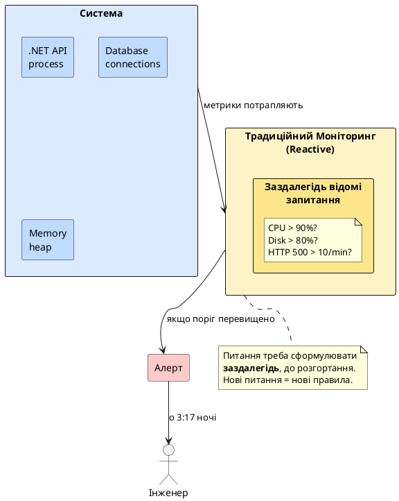
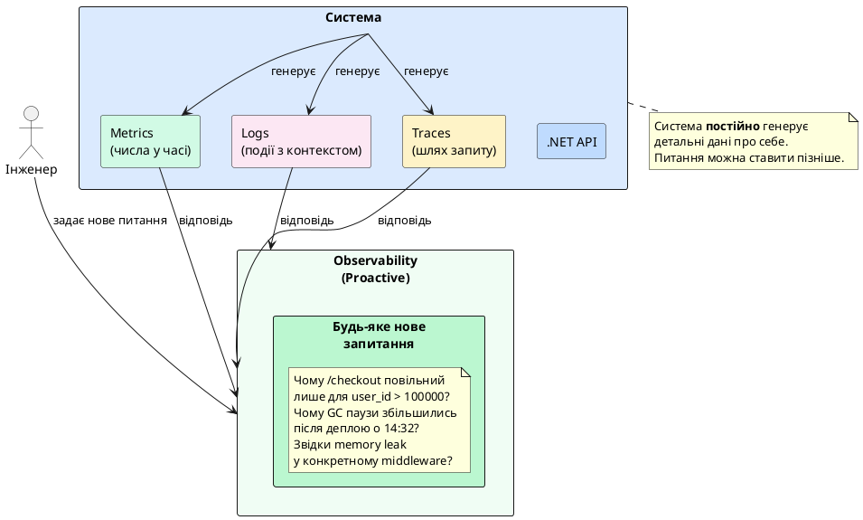
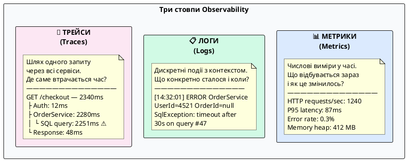
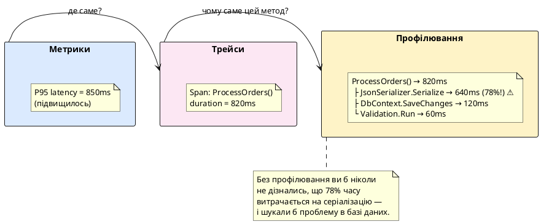
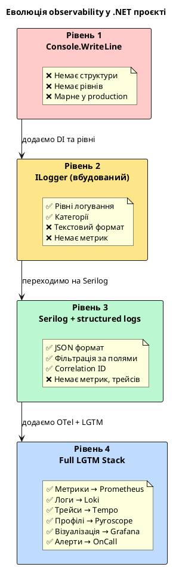
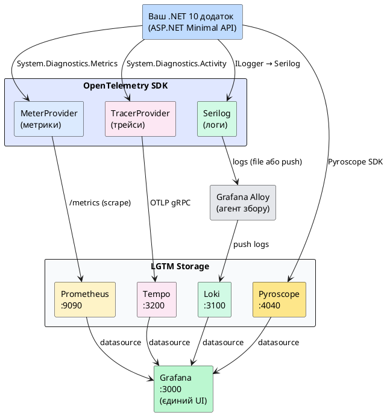
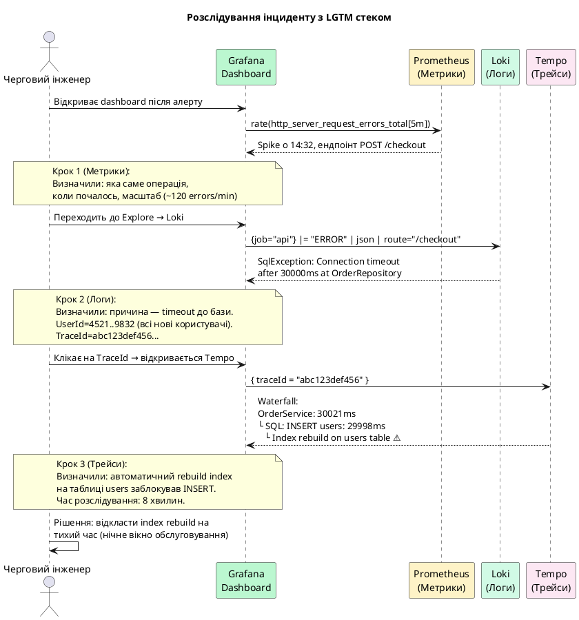

# Спостережуваність: від console.log до production-систем

Уявіть: вівторок, 3:17 ранку. Ваш телефон вибухає від сповіщень — продакшн-система недоступна. Черговий інженер заходить на сервер і бачить... що саме? Якщо відповідь «нічого, крім `journalctl -f`» — ви читаєте правильний матеріал.

Сучасні production-системи живуть і вмирають не через якість коду, а через якість **спостереження за кодом**. Розробник, який вміє написати ефективний алгоритм, але не може відповісти на питання «чому мій сервіс уповільнився о 14:32 у п'ятницю?» — неповний інженер для production-середовища.

Цей розділ курсу присвячений саме цьому: як зробити так, щоб ваш ASP.NET додаток «розповідав» про себе все, що потрібно для розуміння його стану, поведінки та причин збоїв.

---

## Моніторинг: реактивний підхід

Традиційний **моніторинг** — це спостереження за заздалегідь відомими показниками. Ви знаєте, що сервер може перегрітись — тому стежите за температурою процесора. Знаєте, що диск може заповнитись — тому стежите за вільним місцем. Якщо показник перевищує поріг — надходить алерт.

Це реактивний підхід: система фіксує **конкретні відомі симптоми**. Поки щось не вийшло за межі налаштованого порогу — ніхто нічого не знає.

::plant-uml



::

Проблема стає очевидною, коли відбувається щось **непередбачуване**. Наприклад: деградація продуктивності конкретного ендпоінту тільки для запитів з певним набором параметрів, тільки у вівторок між 14:00 і 15:00, тільки якщо одночасно активних сесій більше 300. Жодного з цих порогів у вас не налаштовано — адже ви не могли передбачити саме цю комбінацію.

::note
Традиційний моніторинг добре відповідає на питання «чи все ще працює?» — але погано відповідає на питання «чому воно так поводиться?».
::

---

## Спостережуваність: проактивний підхід

**Observability** (спостережуваність) — це властивість системи, яка дозволяє **зрозуміти її внутрішній стан** на основі зовнішніх сигналів, що вона генерує. Термін прийшов з теорії управління (control theory) і означає: система «спостережувана», якщо будь-який її внутрішній стан можна визначити, вивчивши її зовнішні виходи.

Для програмних систем це звучить так: ви повинні мати можливість поставити **будь-яке нове питання** про поведінку системи і знайти відповідь — навіть якщо це питання ніколи не виникало раніше і ви не готувались до нього заздалегідь.

::plant-uml



::

Різниця фундаментальна: моніторинг каже «збери ці конкретні числа», observability каже «зроби систему настільки прозорою, щоб можна було відповісти на будь-яке питання».

::tip
Хороша метафора: моніторинг — це термометр у кімнаті. Observability — це повна система датчиків, камер та журналів подій, яка дозволить зрозуміти, чому температура змінилась саме так саме тоді.
::

---

## Три стовпи спостережуваності

Галузь виробила **три категорії телеметричних даних**, які разом дають повну картину поведінки системи. Їх часто називають «три стовпи observability».

::plant-uml



::

Кожен стовп відповідає на своє питання — і жоден не може повноцінно замінити інші.

### Стовп перший: Метрики

**Метрики** — це числові значення, що вимірюються у часі. Ключова їхня властивість: вони **агреговані**. Ви не зберігаєте інформацію про кожен окремий HTTP-запит, натомість зберігаєте лічильник «кількість запитів за останню хвилину» або «розподіл часу відповіді за останні 5 хвилин».

Метрики надзвичайно ефективні з точки зору сховища і швидкості запитів, але ціна цієї ефективності — **втрата деталей**. Метрика «P95 latency = 350ms» повідомляє, що щось повільно, але не каже що саме, для якого користувача і чому.

Типові питання, на які відповідають метрики:

- **Скільки?** — кількість запитів, помилок, активних з'єднань
- **Як швидко?** — latency percentiles, throughput
- **Скільки ресурсів?** — CPU, RAM, disk I/O, GC pauses
- **Чи зросло/впало?** — порівняння з минулим

### Стовп другий: Логи

**Логи** — це дискретні записи про події, що відбулись у системі. На відміну від метрик, лог — це завжди **конкретна подія** з повним контекстом: час, рівень важливості, повідомлення, структуровані поля.

Структуровані логи (на відміну від `Console.WriteLine("Error!")`) зберігають дані як об'єкти, що дозволяє ефективно фільтрувати та агрегувати: «покажи всі помилки для userId=4521 за останню годину».

Типові питання, на які відповідають логи:

- **Що конкретно сталося?** — повне повідомлення про подію
- **Для кого?** — userId, requestId, tenantId
- **З якою помилкою?** — stack trace, exception details
- **У якому контексті?** — які параметри запиту, стан системи

### Стовп третій: Трейси

**Трейси** (distributed traces) — це записи про шлях одного конкретного запиту через систему. Один трейс складається з **spans** — відрізків часу, кожен з яких відповідає одній операції: виклик HTTP ендпоінту, SQL-запит, зверненню до Redis, виклику зовнішнього API.

Трейсинг — це інструмент для розуміння **причинно-наслідкових зв'язків** і **розподілу часу**. Коли запит займає 3 секунди, трейс точно показує: 2.8 секунди з них — це очікування відповіді від бази даних на запит у методі `OrderRepository.GetByUserId()`.

Типові питання, на які відповідають трейси:

- **Де втрачається час?** — waterfall-діаграма spans
- **Який шлях пройшов запит?** — через які сервіси, в якому порядку
- **Де виникла помилка?** — конкретний span із помилкою в ланцюжку
- **Як мікросервіси взаємодіють?** — service dependency map

---

## Коли що використовувати: навігаційна таблиця

У реальній роботі observability — це не вибір між трьома стовпами, а навігація між ними залежно від питання, яке потрібно вирішити.

| Питання                               | Стовп        | Інструмент                     |
| ------------------------------------- | ------------ | ------------------------------ | ---------- |
| Чи є зараз деградація продуктивності? | Метрики      | Prometheus + Grafana dashboard |
| О котрій годині почалась проблема?    | Метрики      | Grafana time series            |
| Які ендпоінти постраждали?            | Метрики      | PromQL `by (route)`            |
| Що конкретно відбувається в коді?     | Логи         | Loki + LogQL                   |
| Для яких користувачів проблема?       | Логи         | `{userId="..."}                | = "ERROR"` |
| Де в ланцюжку викликів затримка?      | Трейси       | Grafana Tempo                  |
| Який конкретний SQL запит повільний?  | Трейси       | Span attributes                |
| Чи зафіксована проблема в базі?       | Логи         | Full exception + stack trace   |
| Який метод витрачає найбільше CPU?    | Профілювання | Pyroscope flame graph          |

::tip
**Золоте правило розслідування інциденту:** починайте з **метрик** (зрозуміти масштаб і час), переходьте до **логів** (знайти конкретні помилки), завершуйте **трейсами** (зрозуміти причину).
::

---

## Четвертий стовп: Профілювання

Останніми роками спільнота дійшла консенсусу щодо **четвертого стовпа** — continuous profiling. Якщо три класичних стовпи відповідають на питання «що відбувається», профілювання відповідає на питання «**чому код поводиться саме так на рівні виконання**».

**Профілювання** — це вимірювання того, як саме витрачається час і пам'ять всередині процесу: які функції виконуються найдовше, де відбуваються алокації об'єктів, які lock-и блокують потоки.

::plant-uml



::

**Continuous profiling** — це профілювання, що працює постійно у production з мінімальним overhead (< 2% CPU). На відміну від класичного профілювання (вмикаємо на хвилину при підозрі), continuous profiling дає змогу порівнювати профілі до і після деплою, бачити деградації у часі.

У цьому курсі continuous profiling покривається у файлі 17 (`17.pyroscope-profiling.md`) через Grafana Pyroscope.

::card-group

::card{title="📊 Метрики" icon="i-lucide-bar-chart-2"}

**Питання:** що і скільки?

Агреговані числові виміри у часі. Ефективні, дешеві у зберіганні. Ідеальні для дашбордів та алертів.

**Інструменти:** Prometheus, Grafana

::

::card{title="📋 Логи" icon="i-lucide-scroll-text"}

**Питання:** що конкретно сталось?

Дискретні події з повним контекстом. Дозволяють відтворити точну послідовність подій.

**Інструменти:** Serilog, Loki

::

::card{title="🔗 Трейси" icon="i-lucide-git-branch"}

**Питання:** де втрачається час?

Шлях одного запиту крізь систему. Незамінні для мікросервісів та дебагу latency.

**Інструменти:** OpenTelemetry, Tempo

::

::card{title="🔥 Профілювання" icon="i-lucide-flame"}

**Питання:** чому код так поводиться?

Розподіл CPU і пам'яті по функціях. Знаходить неочевидні bottlenecks у коді.

**Інструменти:** Pyroscope

::

::

---

## Еволюція: від `Console.WriteLine` до observability

Щоб зрозуміти, чому observability — це не «over-engineering», а необхідність, простежимо еволюцію підходів до розуміння поведінки програм.

### Етап 1: `Console.WriteLine` та `Debug.Print`

```csharp [Program.cs]
app.MapPost("/orders", async (Order order) =>
{
    Console.WriteLine("Отримали замовлення");  // ← так робити не треба
    var result = await orderService.Create(order);
    Console.WriteLine("Замовлення створено: " + result.Id);
    return result;
});
```

Працює у розробці. Повністю марне у production: немає рівнів важливості, немає структури, немає можливості фільтрувати, у Docker-контейнері може бути буферизований і взагалі не з'явитись при краші.

### Етап 2: Вбудований `ILogger`

```csharp [Program.cs]
app.MapPost("/orders", async (Order order, ILogger<Program> logger) =>
{
    logger.LogInformation("Отримали замовлення від {UserId}", order.UserId);
    var result = await orderService.Create(order);
    logger.LogInformation("Замовлення {OrderId} створено", result.Id);
    return result;
});
```

Значно краще: є рівні (`Information`, `Warning`, `Error`), є категорії, є конфігурація. Але стандартний вивід у текстовому форматі ускладнює машинний аналіз. У production при 1000 req/s логи перетворюються на нечитабельний потік рядків.

### Етап 3: Structured Logging (Serilog)

```csharp [Program.cs]
// Лог зберігається як об'єкт, а не рядок:
// { "timestamp": "...", "level": "Information",
//   "message": "Order created",
//   "userId": 4521, "orderId": "ord-991",
//   "duration_ms": 47, "traceId": "abc123..." }
logger.LogInformation(
    "Order {OrderId} created for {UserId} in {Duration}ms",
    result.Id, order.UserId, stopwatch.ElapsedMilliseconds);
```

Тепер логи можна фільтрувати за `userId`, агрегувати за `duration_ms`, шукати всі події для конкретного `traceId`. Це вже справжня observability-практика.

### Етап 4: Full Observability Stack

Structured logs — лише початок. Повноцінна observability додає:

- **Метрики** — числові агрегати, що не залежать від обсягу логів (при 100k req/s зберігати лог кожного запиту — надто дорого; метрика «1000 req/s з P95=47ms» — копійки)
- **Трейси** — автоматична кореляція між логами різних сервісів через `traceId`
- **Централізоване сховище** — всі дані в одному місці, незалежно від кількості інстансів і сервісів
- **Алерти** — автоматичне повідомлення, коли щось виходить за межі норми

::plant-uml



::

---

## Чому одних логів недостатньо

Одна з найпоширеніших помилок — вважати, що якщо у додатку є логи, то «моніторинг налаштований». Розглянемо кілька конкретних сценаріїв, де логи не дають відповіді.

**Сценарій 1: повільний деплой**

Після деплою P95 latency зросла з 45ms до 280ms. Помилок немає, виключень немає — лише уповільнення. У логах: тисячі рядків `Information: Request processed`. Навіть якщо в кожному логу є `duration_ms`, щоб обрахувати P95 по 100 000 рядках за хвилину — потрібно виконати агрегацію. Метрики роблять це автоматично і миттєво.

**Сценарій 2: memory leak**

Пам'ять поступово зростає: 200MB → 400MB → 800MB → OOMKill через 6 годин. У логах немає жодної помилки — процес просто вичерпав пам'ять. Метрики б показали тренд зростання. Профілювання б показало, який саме об'єкт не звільняється.

**Сценарій 3: мікросервісна проблема**

Запит до `OrderService` займає 3 секунди. Але `OrderService` сам по собі швидкий — він чекає відповідь від `InventoryService`, який чекає `ExternalShippingAPI`. Без трейсів ви побачите тільки «замовлення повільне» в логах, але не зрозумієте де саме проблема.

::warning
Логи описують **дискретні події**. Вони не підходять для розуміння **трендів у часі** (метрики), **розподілу часу між компонентами** (трейси) або **розподілу CPU/пам'яті по функціях** (профілювання).
::

---

## LGTM-стек: карта нашої подорожі

Цей курс будується навколо **LGTM-стеку** — набору open-source інструментів від компанії Grafana Labs, що реалізують усі чотири стовпи observability. Абревіатура LGTM розшифровується за назвами компонентів: **L**oki, **G**rafana, **T**empo, **M**imir (або Prometheus).

::plant-uml



::

Grafana виступає **єдиним вікном** для всіх чотирьох стовпів. Замість відкривати Prometheus UI для метрик, окремий інтерфейс для логів і ще один для трейсів — ви бачите все в одному місці, з кореляцією між ними.

::card-group

::card{title="Prometheus" icon="i-simple-icons-prometheus"}

**Метрики.** Time-series база даних з pull-моделлю збору. Scrape-ає `/metrics` ендпоінт вашого додатку кожні N секунд.

Покривається у **файлах 04–06**.

::

::card{title="Grafana" icon="i-simple-icons-grafana"}

**Візуалізація.** Єдиний UI для всіх datasource. Дашборди, alerts, Explore, provisioning.

Покривається у **файлах 07–08, 14–15**.

::

::card{title="Loki" icon="i-lucide-scroll-text"}

**Логи.** «Prometheus для логів» — індексує лише metadata, не текст. Cheapest спосіб централізувати логи.

Покривається у **файлах 09–10**.

::

::card{title="Tempo" icon="i-lucide-git-branch"}

**Трейси.** Object storage-first tracing backend. Приймає трейси через OTLP, інтегрується з Grafana.

Покривається у **файлах 11–12**.

::

::

Додатково курс покриває **Grafana Alloy** (агент для збору логів, замінник Promtail), **k6** (навантажувальне тестування з відображенням у Grafana) та **Pyroscope** (continuous profiling).

---

## Сценарій розслідування: як три стовпи працюють разом

Щоб зрозуміти цінність повного стеку, розглянемо реальний сценарій інциденту від початку до кінця.

**Ситуація:** вівторок, 14:47. Надходить алерт: «Error rate перевищив 5%».

::plant-uml



::

Зверніть увагу: кожен крок **звужує простір пошуку**. Метрики дали напрямок (який ендпоінт, коли). Логи дали деталь (яка помилка, для кого). Трейси дали причину (де саме і чому). Без повного стеку кожен з цих кроків міг зайняти години замість хвилин.

---

## Підсумок

Observability — це **інвестиція**, що окупається при першому ж серйозному інциденті. Вартість впровадження LGTM-стеку для одного ASP.NET додатку — кілька годин. Вартість розслідування одного непоміченого інциденту без observability — потенційно дні.

У цьому курсі ми побудуємо повноцінний LGTM-стек крок за кроком:

::steps

### Метрики (файли 02–08)

Health Checks → вбудовані .NET 10 метрики → Prometheus → PromQL → Grafana дашборди.

### Логи (файли 09–10)

Serilog structured logging → Grafana Alloy → Loki → LogQL.

### Трейси (файли 11–12)

OpenTelemetry Activity API → Grafana Tempo → TraceQL → кореляції.

### Повний стек (файли 13–17)

LGTM Docker Compose → Grafana Alerting → OnCall → k6 load testing → Pyroscope profiling.

::

Починаємо з першого практичного кроку: Health Checks — найпростіший і найважливіший механізм observability, що є у кожному ASP.NET Core додатку.
