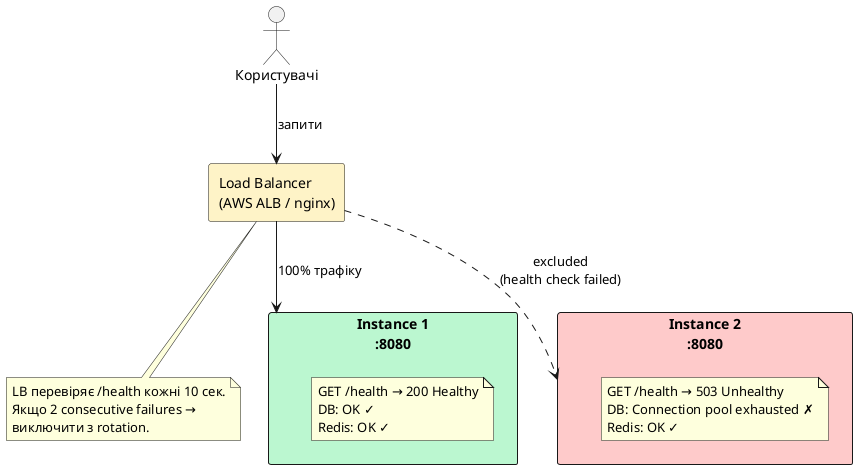
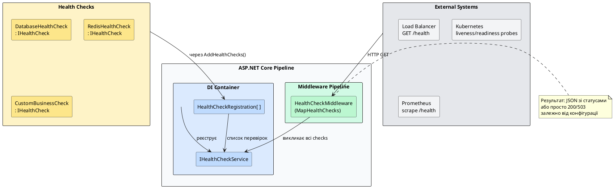
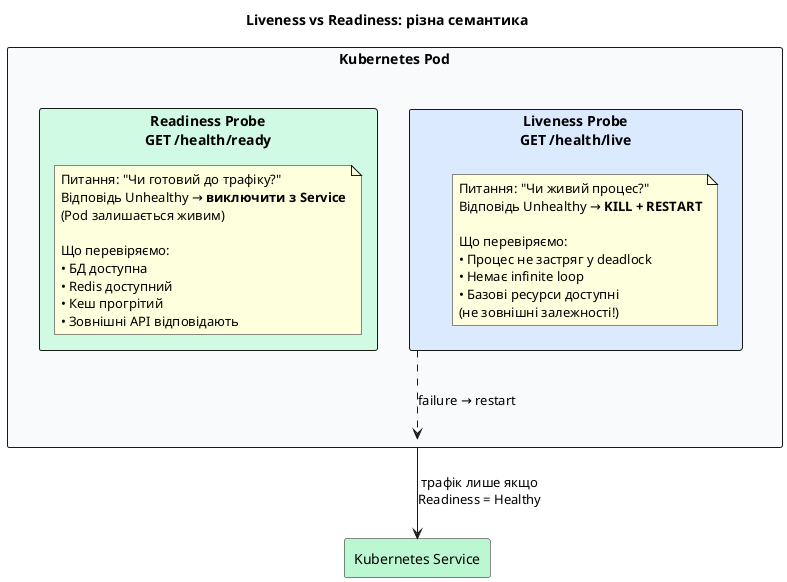
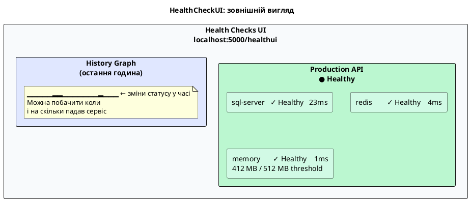

# Health Checks: перший рівень observability

Перш ніж будувати складні дашборди метрик і налаштовувати distributed tracing, варто відповісти на найпростіше питання: **«Чи живий мій додаток прямо зараз?»** Саме для цього існують Health Checks.

Health Check — це механізм, за допомогою якого додаток **повідомляє про свій стан** зовнішнім системам: балансувальнику навантаження, оркестратору контейнерів, системі моніторингу або черговому інженеру. На відміну від метрик, що відповідають на питання «як добре?», health check відповідає на бінарне питання: «продовжувати надсилати трафік чи ні?»

---

## Навіщо це потрібно: три сценарії використання

### Сценарій 1: Load Balancer і маршрутизація трафіку

Уявіть два інстанси вашого ASP.NET додатку за балансувальником навантаження. Один інстанс не може підключитись до бази даних — його пул з'єднань вичерпано. Але процес ASP.NET живий, порт 8080 відповідає, HTTP 200 повертається. Балансувальник не знає про проблему і продовжує надсилати 50% трафіку на несправний інстанс.

Без health checks: половина ваших користувачів отримує помилки бази даних.
З health checks: балансувальник бачить `Unhealthy`, виключає інстанс і весь трафік йде на здоровий.

::plant-uml



::

### Сценарій 2: Kubernetes liveness та readiness

У Kubernetes кожен Pod має два типи перевірок:

- **Liveness probe** — «чи живий процес?» Якщо ні → перезапустити Pod.
- **Readiness probe** — «чи готовий Pod приймати трафік?» Якщо ні → виключити з Service endpoints, але не вбивати.

Це тонка але критична різниця. Під час прогрівання додатку (завантаження кешу, міграції БД) Pod живий, але не готовий. Liveness → Healthy, Readiness → Unhealthy. Kubernetes чекає, поки прогрів завершиться, і лише тоді починає надсилати трафік.

### Сценарій 3: Моніторинг і алерти

Health checks інтегруються з системами моніторингу: Prometheus може збирати статус health checks як метрику, Grafana Alerting може надіслати сповіщення коли статус змінився на `Unhealthy`. Це найпростіший і найшвидший спосіб налаштувати базовий алертинг.

---

## Архітектура Health Checks у ASP.NET Core

ASP.NET Core має вбудовану підтримку health checks через пакет `Microsoft.Extensions.Diagnostics.HealthChecks` (вже є у .NET 10 без додаткових залежностей) та HTTP middleware з пакету `Microsoft.AspNetCore.Diagnostics.HealthChecks`.

::plant-uml



::

Центральний інтерфейс — `IHealthCheck`:

```csharp
public interface IHealthCheck
{
    Task<HealthCheckResult> CheckHealthAsync(
        HealthCheckContext context,
        CancellationToken cancellationToken = default);
}
```

Метод `CheckHealthAsync` повертає `HealthCheckResult` — одне з трьох значень:

::field-group

::field{name="HealthCheckResult.Healthy()" type="HealthStatus.Healthy"}
Сервіс працює нормально. HTTP відповідь: `200 OK`. Балансувальник і Kubernetes продовжують надсилати трафік.
::

::field{name="HealthCheckResult.Degraded()" type="HealthStatus.Degraded"}
Сервіс функціонує, але з деградацією: підвищена latency, знижена пропускна здатність, non-critical залежність недоступна. HTTP відповідь: `200 OK` (за замовчуванням). Трафік продовжується, але це сигнал для команди.
::

::field{name="HealthCheckResult.Unhealthy()" type="HealthStatus.Unhealthy"}
Сервіс не здатний нормально обслуговувати запити: критична залежність (БД, черга) недоступна. HTTP відповідь: `503 Service Unavailable`. Балансувальник виключає інстанс.
::

::

---

## Базова реєстрація та перший health check

Для початку реєструємо health checks у DI-контейнері та підключаємо middleware:

```csharp [Program.cs]
var builder = WebApplication.CreateBuilder(args);

// Крок 1: реєструємо сервіси health checks у DI
builder.Services.AddHealthChecks();

var app = builder.Build();

// Крок 2: підключаємо middleware — додаємо ендпоінт /health
app.MapHealthChecks("/health");

app.Run();
```

Запустіть і перевірте: `GET /health` поверне `200 OK` з тілом `Healthy`. Але це перевірка «нічого» — лише факт того, що процес живий.

::terminal-preview{title="curl /health"}

<div class="line"><span class="opacity-40">$</span> <strong>curl -i http://localhost:5000/health</strong></div>
<div class="line">HTTP/1.1 <span class="text-green-400">200 OK</span></div>
<div class="line">Content-Type: text/plain</div>
<div class="line"></div>
<div class="line"><span class="text-green-400">Healthy</span></div>

::

Щоб отримати детальну JSON-відповідь з інформацією про кожну перевірку, налаштуємо `ResponseWriter`:

```csharp [Program.cs]
using Microsoft.AspNetCore.Diagnostics.HealthChecks;
using Microsoft.Extensions.Diagnostics.HealthChecks;
using System.Text.Json;

app.MapHealthChecks("/health", new HealthCheckOptions
{
    ResponseWriter = async (context, report) =>
    {
        context.Response.ContentType = "application/json";

        var result = JsonSerializer.Serialize(new
        {
            status = report.Status.ToString(),
            duration = report.TotalDuration.TotalMilliseconds,
            checks = report.Entries.Select(e => new
            {
                name = e.Key,
                status = e.Value.Status.ToString(),
                description = e.Value.Description,
                duration = e.Value.Duration.TotalMilliseconds,
                exception = e.Value.Exception?.Message
            })
        }, new JsonSerializerOptions { WriteIndented = true });

        await context.Response.WriteAsync(result);
    }
});
```

::terminal-preview{title="curl /health (JSON format)"}

<div class="line"><span class="opacity-40">$</span> <strong>curl http://localhost:5000/health | jq</strong></div>
<div class="line">{</div>
<div class="line">  <span class="text-blue-400">"status"</span>: <span class="text-green-400">"Healthy"</span>,</div>
<div class="line">  <span class="text-blue-400">"duration"</span>: <span class="text-yellow-400">12.4</span>,</div>
<div class="line">  <span class="text-blue-400">"checks"</span>: []</div>
<div class="line">}</div>

::

---

## Кастомний `IHealthCheck`: перевірка бази даних

Найважливіший health check для більшості додатків — перевірка підключення до бази даних. Реалізуємо його вручну через `IHealthCheck`, щоб зрозуміти механізм зсередини:

```csharp [HealthChecks/DatabaseHealthCheck.cs]
using Microsoft.Extensions.Diagnostics.HealthChecks;
using Microsoft.Data.SqlClient;

public class DatabaseHealthCheck : IHealthCheck
{
    private readonly IConfiguration _configuration;

    public DatabaseHealthCheck(IConfiguration configuration)
    {
        _configuration = configuration;
    }

    public async Task<HealthCheckResult> CheckHealthAsync(
        HealthCheckContext context,
        CancellationToken cancellationToken = default)
    {
        var connectionString = _configuration.GetConnectionString("Default");

        try
        {
            await using var connection = new SqlConnection(connectionString);

            // Відкриваємо з'єднання та виконуємо мінімальний запит
            await connection.OpenAsync(cancellationToken);
            await using var command = connection.CreateCommand();
            command.CommandText = "SELECT 1";
            await command.ExecuteScalarAsync(cancellationToken);

            return HealthCheckResult.Healthy("Database connection is OK");
        }
        catch (SqlException ex) when (ex.Number == -2) // timeout
        {
            return HealthCheckResult.Degraded(
                "Database responds slowly — connection timeout",
                exception: ex);
        }
        catch (Exception ex)
        {
            return HealthCheckResult.Unhealthy(
                "Database is unreachable",
                exception: ex);
        }
    }
}
```

Реєстрація у `Program.cs`:

```csharp [Program.cs]
builder.Services.AddHealthChecks()
    .AddCheck<DatabaseHealthCheck>("database", tags: ["db", "critical"]);
```

::note
Параметр `tags` — це мітки для групування перевірок. Пізніше побачимо, як виводити тільки `critical` checks на ендпоінті `/health/live`, а всі — на `/health/ready`.
::

Тепер відповідь стає змістовнішою:

::terminal-preview{title="curl /health з DatabaseHealthCheck"}

<div class="line"><span class="opacity-40">$</span> <strong>curl http://localhost:5000/health | jq</strong></div>
<div class="line">{</div>
<div class="line">  <span class="text-blue-400">"status"</span>: <span class="text-green-400">"Healthy"</span>,</div>
<div class="line">  <span class="text-blue-400">"duration"</span>: <span class="text-yellow-400">24.7</span>,</div>
<div class="line">  <span class="text-blue-400">"checks"</span>: [</div>
<div class="line">    {</div>
<div class="line">      <span class="text-blue-400">"name"</span>: <span class="text-green-400">"database"</span>,</div>
<div class="line">      <span class="text-blue-400">"status"</span>: <span class="text-green-400">"Healthy"</span>,</div>
<div class="line">      <span class="text-blue-400">"description"</span>: <span class="text-green-400">"Database connection is OK"</span>,</div>
<div class="line">      <span class="text-blue-400">"duration"</span>: <span class="text-yellow-400">23.1</span>,</div>
<div class="line">      <span class="text-blue-400">"exception"</span>: <span class="text-gray-400">null</span></div>
<div class="line">    }</div>
<div class="line">  ]</div>
<div class="line">}</div>

::

---

## Кастомна перевірка пам'яті: `Degraded` у дії

Не всі проблеми бінарні. Підвищене споживання пам'яті — це ще не катастрофа, але сигнал тривоги. Реалізуємо check з трьома рівнями:

```csharp [HealthChecks/MemoryHealthCheck.cs]
using Microsoft.Extensions.Diagnostics.HealthChecks;

public class MemoryHealthCheck : IHealthCheck
{
    // Пороги конфігуруємо ззовні — не хардкодимо
    private readonly long _degradedThresholdBytes;
    private readonly long _unhealthyThresholdBytes;

    public MemoryHealthCheck(IConfiguration configuration)
    {
        // За замовчуванням: Degraded > 512 MB, Unhealthy > 1 GB
        _degradedThresholdBytes = configuration
            .GetValue<long>("HealthChecks:Memory:DegradedMB", 512) * 1024 * 1024;
        _unhealthyThresholdBytes = configuration
            .GetValue<long>("HealthChecks:Memory:UnhealthyMB", 1024) * 1024 * 1024;
    }

    public Task<HealthCheckResult> CheckHealthAsync(
        HealthCheckContext context,
        CancellationToken cancellationToken = default)
    {
        var allocated = GC.GetTotalMemory(forceFullCollection: false);
        var data = new Dictionary<string, object>
        {
            ["allocated_bytes"] = allocated,
            ["allocated_mb"] = allocated / 1024 / 1024,
            ["gen0_collections"] = GC.CollectionCount(0),
            ["gen1_collections"] = GC.CollectionCount(1),
            ["gen2_collections"] = GC.CollectionCount(2),
        };

        if (allocated >= _unhealthyThresholdBytes)
            return Task.FromResult(HealthCheckResult.Unhealthy(
                $"Memory usage critical: {allocated / 1024 / 1024} MB", data: data));

        if (allocated >= _degradedThresholdBytes)
            return Task.FromResult(HealthCheckResult.Degraded(
                $"Memory usage elevated: {allocated / 1024 / 1024} MB", data: data));

        return Task.FromResult(HealthCheckResult.Healthy(
            $"Memory usage normal: {allocated / 1024 / 1024} MB", data: data));
    }
}
```

Зверніть увагу на параметр `data` — словник додаткових даних, що повертається разом з результатом. Ці дані з'являться у JSON-відповіді health check ендпоінту і доступні в UI.

---

## Community-бібліотека: `AspNetCore.HealthChecks.*`

Писати `IHealthCheck` вручну для кожної залежності — рутина. Спільнота створила набір готових перевірок: **AspNetCore.HealthChecks** (автор: Xabaril). Це набір окремих NuGet-пакетів, по одному на кожну технологію:

```xml [MyApi.csproj]
<PackageReference Include="AspNetCore.HealthChecks.SqlServer" Version="8.*" />
<PackageReference Include="AspNetCore.HealthChecks.Redis" Version="8.*" />
<PackageReference Include="AspNetCore.HealthChecks.RabbitMQ" Version="8.*" />
<PackageReference Include="AspNetCore.HealthChecks.Npgsql" Version="8.*" />
<PackageReference Include="AspNetCore.HealthChecks.Uris" Version="8.*" />
<PackageReference Include="AspNetCore.HealthChecks.UI" Version="8.*" />
<PackageReference Include="AspNetCore.HealthChecks.UI.Client" Version="8.*" />
<PackageReference Include="AspNetCore.HealthChecks.UI.InMemory.Storage" Version="8.*" />
```

::note
Версія `8.*` сумісна з .NET 8, 9 та 10 — бібліотека не прив'язана до конкретного runtime, лише до `Microsoft.AspNetCore.App`.
::

Після встановлення реєстрація стає декларативною:

```csharp [Program.cs]
builder.Services.AddHealthChecks()
    // SQL Server: виконує SELECT 1 проти вашої БД
    .AddSqlServer(
        connectionString: builder.Configuration.GetConnectionString("Default")!,
        name: "sql-server",
        tags: ["db", "critical"])

    // PostgreSQL (якщо використовуєте Npgsql)
    .AddNpgsql(
        connectionString: builder.Configuration.GetConnectionString("Postgres")!,
        name: "postgres",
        tags: ["db", "critical"])

    // Redis: PING команда
    .AddRedis(
        redisConnectionString: builder.Configuration.GetConnectionString("Redis")!,
        name: "redis",
        tags: ["cache"])

    // RabbitMQ: перевірка стану connection
    .AddRabbitMQ(
        rabbitConnectionString: builder.Configuration.GetConnectionString("RabbitMQ")!,
        name: "rabbitmq",
        tags: ["messaging"])

    // Зовнішній HTTP ендпоінт: GET та перевірка статус-коду
    .AddUrlGroup(
        uri: new Uri("https://api.stripe.com/v1/"),
        name: "stripe-api",
        tags: ["external"])

    // Наш власний check пам'яті
    .AddCheck<MemoryHealthCheck>("memory", tags: ["system"]);
```

::tip
Завжди визначайте `name` явно — це ім'я з'явиться у JSON-відповіді та HealthCheckUI. Без явного імені використовується ім'я типу, що ускладнює читання.
::

---

## Liveness та Readiness: патерн для Kubernetes і Docker

Один ендпоінт `/health` — це добре для початку, але недостатньо для production. Kubernetes (і Docker Healthcheck) розрізняють два типи перевірок, і вони мають принципово різну семантику.

::plant-uml



::

**Чому не перевіряти БД у liveness?** Якщо liveness probe перевіряє базу даних і база тимчасово недоступна — Kubernetes вб'є і перезапустить всі поди одночасно. Після перезапуску вони знову не пройдуть liveness (бо база ще недоступна) → знову перезапуск → **crashloop**. Добре структурований додаток переживе недоступність бази — він просто не приймає трафік (readiness = unhealthy), але залишається живим і відновиться автоматично.

Реалізація двох окремих ендпоінтів через `tags`:

```csharp [Program.cs]
builder.Services.AddHealthChecks()
    .AddCheck<MemoryHealthCheck>("memory", tags: ["live"])           // liveness
    .AddSqlServer(connStr, name: "sql-server", tags: ["ready", "critical"])  // readiness
    .AddRedis(redisConnStr, name: "redis", tags: ["ready"])          // readiness
    .AddUrlGroup(new Uri("https://api.stripe.com"), name: "stripe",
        tags: ["ready", "external"]);                                // readiness

// Liveness: тільки перевірки з тегом "live"
app.MapHealthChecks("/health/live", new HealthCheckOptions
{
    Predicate = check => check.Tags.Contains("live"),
    ResponseWriter = WriteJsonResponse
});

// Readiness: тільки перевірки з тегом "ready"
app.MapHealthChecks("/health/ready", new HealthCheckOptions
{
    Predicate = check => check.Tags.Contains("ready"),
    ResponseWriter = WriteJsonResponse
});

// Загальний ендпоінт: всі перевірки (для людей, не для Kubernetes)
app.MapHealthChecks("/health", new HealthCheckOptions
{
    ResponseWriter = WriteJsonResponse
});
```

Конфігурація Kubernetes у `deployment.yaml`:

```yaml [k8s/deployment.yaml]
livenessProbe:
    httpGet:
        path: /health/live
        port: 8080
    initialDelaySeconds: 10 # чекати 10с після старту перед першою перевіркою
    periodSeconds: 15 # перевіряти кожні 15с
    failureThreshold: 3 # 3 consecutive failures → restart

readinessProbe:
    httpGet:
        path: /health/ready
        port: 8080
    initialDelaySeconds: 5
    periodSeconds: 10
    failureThreshold: 2 # 2 failures → виключити з endpoints
```

---

## HealthCheckUI: веб-інтерфейс для health checks

`AspNetCore.HealthChecks.UI` — це готовий веб-дашборд, що автоматично опитує ваші ендпоінти і відображає статус у зручному вигляді з графіком змін у часі.

```csharp [Program.cs]
builder.Services
    .AddHealthChecks()
    .AddSqlServer(connStr, name: "sql-server", tags: ["ready", "critical"])
    .AddRedis(redisConnStr, name: "redis", tags: ["ready"])
    .AddCheck<MemoryHealthCheck>("memory", tags: ["live"]);

// Реєструємо UI з in-memory сховищем (для розробки)
builder.Services
    .AddHealthChecksUI(options =>
    {
        options.SetEvaluationTimeInSeconds(15);     // перевіряти кожні 15с
        options.MaximumHistoryEntriesPerEndpoint(50); // зберігати 50 записів
        options.AddHealthCheckEndpoint("Production API", "/health");
    })
    .AddInMemoryStorage();

var app = builder.Build();

// Реєструємо сам ендпоінт /health з форматом для UI
app.MapHealthChecks("/health", new HealthCheckOptions
{
    ResponseWriter = UIResponseWriter.WriteHealthCheckUIResponse  // ← спеціальний writer
});

// Монтуємо UI за адресою /healthui
app.MapHealthChecksUI(options =>
{
    options.UIPath = "/healthui";
    options.ApiPath = "/healthui-api";
});
```

::warning
`HealthCheckUI` за замовчуванням доступний без автентифікації. У production обмежте доступ через IP filtering, BasicAuth або вимкніть зовнішній доступ (expose тільки всередині cluster).
::

Після запуску відкрийте `http://localhost:5000/healthui` — ви побачите дашборд:

::plant-uml



::

---

## Повний приклад: Minimal API з трьома checks + UI

Зберемо все разом у повноцінний приклад. Структура проєкту:

::code-tree

```csharp [Program.cs]
using AspNetCore.HealthChecks.UI.Client;
using Microsoft.AspNetCore.Diagnostics.HealthChecks;

var builder = WebApplication.CreateBuilder(args);

builder.Services
    .AddHealthChecks()
    .AddSqlServer(
        connectionString: builder.Configuration.GetConnectionString("Default")!,
        name: "sql-server",
        failureStatus: Microsoft.Extensions.Diagnostics.HealthChecks.HealthStatus.Unhealthy,
        tags: ["ready", "critical"])
    .AddRedis(
        redisConnectionString: builder.Configuration.GetConnectionString("Redis")!,
        name: "redis",
        failureStatus: Microsoft.Extensions.Diagnostics.HealthChecks.HealthStatus.Degraded,
        tags: ["ready"])
    .AddCheck<MemoryHealthCheck>(
        name: "memory",
        tags: ["live", "system"]);

builder.Services
    .AddHealthChecksUI(options =>
    {
        options.SetEvaluationTimeInSeconds(30);
        options.MaximumHistoryEntriesPerEndpoint(60);
        options.AddHealthCheckEndpoint("API", "/health");
    })
    .AddInMemoryStorage();

var app = builder.Build();

app.MapHealthChecks("/health/live", new HealthCheckOptions
{
    Predicate = r => r.Tags.Contains("live"),
    ResponseWriter = UIResponseWriter.WriteHealthCheckUIResponse
});

app.MapHealthChecks("/health/ready", new HealthCheckOptions
{
    Predicate = r => r.Tags.Contains("ready"),
    ResponseWriter = UIResponseWriter.WriteHealthCheckUIResponse
});

app.MapHealthChecks("/health", new HealthCheckOptions
{
    ResponseWriter = UIResponseWriter.WriteHealthCheckUIResponse
});

app.MapHealthChecksUI(o => o.UIPath = "/healthui");

app.MapGet("/", () => "Hello, World!");

app.Run();
```

```csharp [HealthChecks/MemoryHealthCheck.cs]
using Microsoft.Extensions.Diagnostics.HealthChecks;

public class MemoryHealthCheck : IHealthCheck
{
    private const long DegradedThreshold = 512L * 1024 * 1024;  // 512 MB
    private const long UnhealthyThreshold = 1024L * 1024 * 1024; // 1 GB

    public Task<HealthCheckResult> CheckHealthAsync(
        HealthCheckContext context,
        CancellationToken cancellationToken = default)
    {
        var allocated = GC.GetTotalMemory(forceFullCollection: false);
        var data = new Dictionary<string, object>
        {
            ["allocated_mb"] = allocated / 1024 / 1024,
        };

        if (allocated >= UnhealthyThreshold)
            return Task.FromResult(HealthCheckResult.Unhealthy(
                $"Memory critical: {allocated / 1024 / 1024} MB", data: data));

        if (allocated >= DegradedThreshold)
            return Task.FromResult(HealthCheckResult.Degraded(
                $"Memory elevated: {allocated / 1024 / 1024} MB", data: data));

        return Task.FromResult(HealthCheckResult.Healthy(
            $"Memory OK: {allocated / 1024 / 1024} MB", data: data));
    }
}
```

```json [appsettings.json]
{
    "ConnectionStrings": {
        "Default": "Server=localhost;Database=MyDb;User Id=sa;Password=YourPass;",
        "Redis": "localhost:6379"
    }
}
```

::

::terminal-preview{title="Результат GET /health"}

<div class="line"><span class="opacity-40">$</span> <strong>curl http://localhost:5000/health | jq .status,.checks[].name,.checks[].status</strong></div>
<div class="line"><span class="text-green-400">"Healthy"</span></div>
<div class="line"><span class="text-green-400">"sql-server"</span></div>
<div class="line"><span class="text-green-400">"Healthy"</span></div>
<div class="line"><span class="text-green-400">"redis"</span></div>
<div class="line"><span class="text-green-400">"Healthy"</span></div>
<div class="line"><span class="text-green-400">"memory"</span></div>
<div class="line"><span class="text-green-400">"Healthy"</span></div>

::

---

## Підсумок

Health Checks — це **перший і найпростіший** рівень observability, який потрібно налаштувати у будь-якому ASP.NET Core додатку. Без них Load Balancer і Kubernetes не знають, коли ваш сервіс несправний, і продовжують надсилати трафік на зламані інстанси.

| Що                           | Як                                                                 |
| ---------------------------- | ------------------------------------------------------------------ |
| Базова реєстрація            | `services.AddHealthChecks()` + `app.MapHealthChecks("/health")`    |
| Кастомна перевірка           | Реалізувати `IHealthCheck`                                         |
| Готові перевірки (DB, Redis) | `AspNetCore.HealthChecks.*` NuGet пакети                           |
| Kubernetes liveness          | `MapHealthChecks("/health/live")` з `Predicate` по тегу `"live"`   |
| Kubernetes readiness         | `MapHealthChecks("/health/ready")` з тегом `"ready"`               |
| Веб-дашборд                  | `AddHealthChecksUI().AddInMemoryStorage()` + `MapHealthChecksUI()` |

::note
На наступному кроці переходимо до **метрик** — числових вимірів у часі. Якщо health checks дають бінарну відповідь «живий/мертвий», метрики дадуть відповідь «наскільки добре живий і що саме сповільнюється».
::
