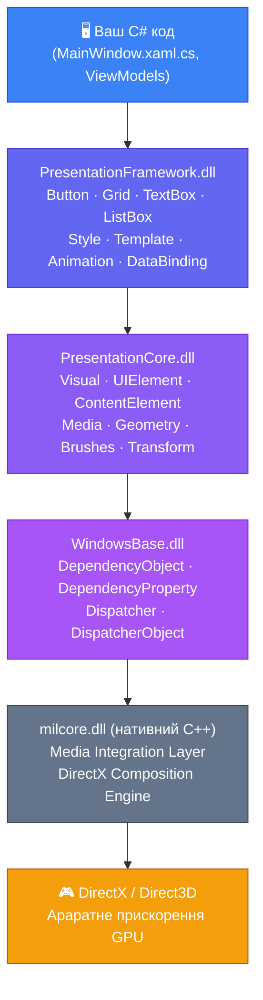
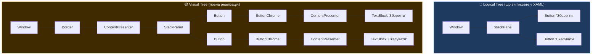

# Архітектура WPF: як влаштований графічний інтерфейс

::note
**Словник теми:** **Rendering** — процес перетворення описів графіки на піксели екрану. **GDI+** (Graphics Device Interface) — растровий рендерер Windows, що використовувався до WPF. **DirectX** — набір API Microsoft для апаратно-прискореної 2D/3D графіки. **Dispatcher** — об'єкт, що керує чергою операцій в UI-потоці. **Visual Tree** — повне дерево всіх візуальних елементів, включно зі службовими. **Logical Tree** — дерево тільки «значущих» елементів, що описані у XAML розробником.
::

## Чому WPF виглядає краще за WinForms?

Відкрийте будь-який застосунок на WinForms і будь-який на WPF поруч. Збільште масштаб системи до 150% (Settings → Display → Scale). Натисніть Print Screen і подивіться на шрифти, кнопки, межі елементів.

WinForms-застосунок буде розмитим. Краї контролів — нечіткі, шрифти — піксельні. WPF-застосунок буде чітким. Все виглядає так, ніби його перемалювали спеціально для нового роздільника.

Це не випадковість і не «красивіші налаштування за замовчуванням». Це фундаментальна різниця в **архітектурі рендерингу**.

### GDI+ — растровий рендеринг (WinForms спосіб)

Коли WinForms малює кнопку, він звертається до **GDI+** (Graphics Device Interface Plus) — Windows API для 2D-графіки, що прийшов з часів Windows 98.

GDI+ думає в пікселях:
- «Намалюй прямокутник від точки (10, 10) до (100, 50) заливкою кольору #CCCCCC»
- «Напиши текст "OK" шрифтом Arial 12px у точці (30, 25)»
- «Намалюй рамку шириною 1 піксел»

Результат — растрове зображення. Коли масштаб змінюється — Windows просто збільшує ці растрові пікселі. Кожен піксел стає 1.5 або 2 пікселі — звідси розмиття та «заїдання».

Ще одна проблема GDI+: він **не знає про GPU**. Кожен елемент малюється **центральним процесором (CPU)**. Кнопка, текст, рамка — все CPU. Gpu простоює.

### DirectX + Composition — векторний рендеринг (WPF спосіб)

WPF ніколи не говорить у пікселях. WPF описує інтерфейс **векторно**:
- «Є прямокутник з округленими кутами 4px, залитий градієнтом від #3D7ABB до #2C5F8A»
- «Є текст "OK" шрифтом Segoe UI, вирівняний по центру контейнера»
- «Є тінь з розмиттям 8px та offset (2, 2)»

Це **сцена з описами**, а не піксели. Цю сцену отримує **milcore.dll** — нативний C++ модуль, що передає її **DirectX Composition**. Саме DirectX вирішує, як намалювати цю сцену на екрані — з урахуванням поточного роздільника, DPI і можливостей GPU.

При масштабі 150% DirectX перемальовує всю сцену заново у вищій роздільності — не збільшує пікселі, а **рехендерить**. Результат — ідеальна чіткість на будь-якому DPI.

А ще: DirectX **знає про GPU**. Більшість операцій рендерингу виконується на відеокарті. CPU лише передає описи — GPU малює. Тому WPF-застосунки можуть мати складні анімації, прозорість, тіні — і при цьому не навантажувати CPU.

::tip
**Аналогія:** GDI+ — це як малювати на папері олівцем (кожен штрих — конкретна дія, результат фіксований). DirectX — це як давати інструкції скульптору: «зроби фігуру такої форми, такого кольору». Скульптор сам вибирає інструменти та оптимізує процес. Коли змінюються умови (інше освітлення, інший масштаб) — скульптор перероблює, не просто збільшує.
::

---

## Архітектурні шари WPF

WPF — це не один монолітний dll-файл. Це **стек шарів**, де кожен відповідає за свою область. Розберемо кожен шар знизу вгору.

::mermaid



::

### Шар 1: WindowsBase.dll — фундамент системи

Це **найнижчий керований (managed) шар** WPF. Тут живуть концепції, на яких побудовано все інше.

**`DependencyObject`** — базовий клас для всіх об'єктів WPF, що беруть участь у системі властивостей. Якщо об'єкт має властивості, до яких можна прив'язати дані, анімації, стилі — він наслідує `DependencyObject`.

**`DependencyProperty`** — спеціальний тип властивостей, що підтримує прив'язку даних, стилі, успадкування значень по дереву елементів. Ми детально вивчимо їх у Блоці 5, але зараз важливо знати: _кожна_ властивість кнопки, текстового поля, гріду — це `DependencyProperty`, а не звичайне C# property.

**`Dispatcher`** — об'єкт, що керує **чергою повідомлень** (message queue) UI-потоку. Для WPF Dispatcher — це охоронець: лише він дозволяє змінювати UI-елементи. Але про це — в окремому розділі нижче.

### Шар 2: PresentationCore.dll — візуальна основа

Тут живуть базові типи для побудови візуальної сцени.

**`Visual`** — найпростіший будівельний блок. Об'єкт, що може брати участь у рендерингу. У нього є `DrawingContext` — «полотно», на якому можна малювати геометрію, текст, зображення. `Visual` — це низькорівневий примітив, не контрол.

**`UIElement`** — розширює `Visual`. Додає концепції: внесок у layout (Measure/Arrange), система вводу (миша, клавіатура, тач), система подій (Routed Events). Вже має `RenderTransform`, `Opacity`, `IsVisible`.

**`ContentElement`** — аналог `UIElement` для «нелayout» вмісту: текстові фрагменти (`Run`, `Bold`, `Paragraph`). Ці елементи не мають власного layout-pass, їх розташовує контейнер.

**Brushes та Geometry** — вектори, пензлі, трансформації. `SolidColorBrush`, `LinearGradientBrush`, `PathGeometry`, `EllipseGeometry` — все це з PresentationCore.

### Шар 3: PresentationFramework.dll — ваш повсякденний інструментарій

Саме з цим шаром ви будете працювати щодня. Тут живуть всі «знайомі» речі:

- **Контроли**: `Button`, `TextBox`, `ComboBox`, `ListBox`, `DataGrid`, `TabControl`...
- **Панелі**: `Grid`, `StackPanel`, `DockPanel`, `Canvas`, `WrapPanel`...
- **Вікна**: `Window`, `Page`, `UserControl`, `NavigationWindow`...
- **Стилізація**: `Style`, `ControlTemplate`, `DataTemplate`, `Trigger`...
- **Прив'язка даних**: механізм `Binding`, `DataContext`, `INotifyPropertyChanged`...
- **Анімація**: `Storyboard`, `DoubleAnimation`, `ColorAnimation`...

Коли ви пишете `new Button()` — ви звертаєтесь до `PresentationFramework.dll`.

### Шар 4: milcore.dll — нативний міст до DirectX

**milcore** (Media Integration Layer Core) — написаний на **нерегульованому C++** (unmanaged). Це межа між керованим .NET-кодом і нативним світом Windows.

Коли WPF хоче щось намалювати — він передає **описи сцени** (retained-mode rendering) через milcore до DirectX. Milcore відповідає за:

- Компіляцію «сцени» WPF у команди DirectX
- Синхронізацію між UI-потоком і rendering-потоком (вони різні!)
- HiDPI-адаптацію — перерахунок розмірів під DPI
- Кешування незмінних частин сцени

Факт, що милcore — нативний C++, означає: він може безпосередньо спілкуватись з DirectX без overhead JIT-компіляції.

::note
**Retained-mode vs Immediate-mode:** GDI+ — immediate-mode: ви викликаєте `DrawRectangle()` і піксели одразу з'являються на екрані. Якщо щось змінилось — треба перемалювати все знову (ось чому у WinForms є `OnPaint`). WPF — retained-mode: ви описуєте **що має бути**, а система сама вирішує **коли і як** це намалювати. Змінилась властивість кнопки — WPF лише оновлює «запис про кнопку» у сцені, а milcore автоматично перемальовує лише те, що змінилось.
::

---

## Потоковість: UI Thread та Dispatcher

Будь-який WPF-застосунок запускається і працює в **одному UI-потоці** (головному потоці). Всі UI-елементи — кнопки, текстові поля, вікна — **власність** цього потоку.

Спроба змінити UI-елемент з іншого потоку призведе до виключення:

```csharp
// ❌ НЕБЕЗПЕЧНО: зміна UI з фонового потоку
Task.Run(() =>
{
    myTextBlock.Text = "Результат обчислень"; // ← InvalidOperationException!
});
```

Ось типова помилка, яку ви обов'язково побачите:

```
System.InvalidOperationException: The calling thread cannot access this object
because a different thread owns it.
```

### Чому UI-потік один?

Причина проста — **thread-safety**. Якщо кілька потоків могли б змінювати UI-елементи одночасно, виникли б race conditions: один потік додає елемент до списку, інший видаляє — результат непередбачуваний.

Замість складних блокувань Microsoft обрала простіший підхід: **тільки один потік може змінювати UI**. Це усуває весь клас проблем з паралельністю в UI-коді.

### Dispatcher — диригент UI-потоку

`Dispatcher` — це черга завдань, прив'язана до UI-потоку. Щоб безпечно оновити UI з фонового потоку — треба «попросити» Dispatcher виконати код у потрібному потоці.

Є два основні способи:

**`Dispatcher.Invoke()` — синхронний**: блокує поточний (фоновий) потік і чекає, поки UI-потік виконає завдання.

```csharp
Task.Run(() =>
{
    // Тривале обчислення у фоновому потоці...
    double result = PerformHeavyCalculation();

    // Safely оновлюємо UI у правильному потоці:
    Dispatcher.Invoke(() =>
    {
        resultTextBlock.Text = result.ToString("F2");
        progressBar.Value = 100;
    });
});
```

**`Dispatcher.BeginInvoke()` — асинхронний**: ставить завдання у чергу і **не чекає** виконання. Фоновий потік продовжує роботу.

```csharp
Task.Run(() =>
{
    for (int i = 0; i <= 100; i++)
    {
        Thread.Sleep(50); // Симуляція роботи

        // Асинхронно оновлюємо прогрес:
        Dispatcher.BeginInvoke(() =>
        {
            progressBar.Value = i;
            statusLabel.Content = $"Прогрес: {i}%";
        });
    }
});
```

::tip
**Сучасний підхід:** У новому коді на C# замість `Dispatcher.Invoke`/`BeginInvoke` частіше використовують `async/await` — він автоматично повертає виконання в UI-потік після `await`. Але розуміти Dispatcher важливо — він є фундаментом, на якому побудовані всі ці абстракції.
::

### `Dispatcher.CheckAccess()` — перевірка потоку

Іноді потрібно перевірити, чи ми вже у UI-потоці — щоб не дублювати Dispatcher там, де він не потрібний:

```csharp
void UpdateStatus(string message)
{
    if (Dispatcher.CheckAccess())
    {
        // Ми вже в UI-потоці — можна змінювати напряму
        statusLabel.Content = message;
    }
    else
    {
        // Ми у фоновому потоці — маршалізуємо через Dispatcher
        Dispatcher.Invoke(() => statusLabel.Content = message);
    }
}
```

---

## Logical Tree та Visual Tree

Що відбувається за лаштунками, коли ви пишете `<Button Content="OK" />`? WPF будує не одне, а **два дерева** елементів — і розуміти різницю між ними критично важливо для розуміння стилів та подій (які ми вивчатимемо в наступних блоках).

### Logical Tree — дерево «змісту»

**Logical Tree** (логічне дерево) — це структура, яку ви **явно описуєте у XAML**. Воно відображає смисловий зміст інтерфейсу: вікно містить кнопку, кнопка містить текст.

```xml
<Window>
    <StackPanel>
        <Button Content="Зберегти" />
        <Button Content="Скасувати" />
    </StackPanel>
</Window>
```

Logical Tree цього XAML:

```
Window
└── StackPanel
    ├── Button ("Зберегти")
    └── Button ("Скасувати")
```

Logical Tree — це те, з чим **ви** маєте справу як розробник. Коли ви встановлюєте `DataContext` на `Window` — він поширюється по Logical Tree вниз. Коли WPF шукає ресурс — він обходить Logical Tree вгору.

### Visual Tree — дерево «реалізації»

**Visual Tree** (візуальне дерево) — це **повна** структура всіх візуальних об'єктів, включно зі службовими. Кожен контрол у WPF — це не атомарний об'єкт, а **дерево примітивів**, що реалізують його зовнішній вигляд.

Та сама `Button` у Visual Tree:

```
Button
└── ButtonChrome (рамка теми Aero)
    └── ContentPresenter
        └── TextBlock ("Зберегти")
```

::mermaid



::

### Навіщо два дерева?

Розділення на Logical і Visual Tree дає WPF фантастичну гнучкість:

**1. Перевизначення зовнішнього вигляду** без зміни логіки. Хочете `Button` у вигляді кола з іконкою замість прямокутника з текстом? Просто замінюєте `ControlTemplate` — Visual Tree повністю перебудовується, але Logical Tree, DataContext, Command незмінні. Ми вивчимо це у Блоці 8.

**2. Маршрутизація подій.** Клік на текст всередині кнопки відбувається у `TextBlock` у Visual Tree. Але подія «спливає» (bubbles up) по Visual Tree вгору, досягає `Button` у Logical Tree — і ви отримуєте `Button.Click`. Блок 5 розкриє цей механізм повністю.

**3. Пошук ресурсів.** `StaticResource` та `DynamicResource` шукають по **Logical Tree** вгору. Visual Tree у пошуку ресурсів не бере участі.

::note
У Visual Studio є вбудований інструмент **Live Visual Tree** (під час відлагодження: меню Debug → Windows → Live Visual Tree). Він показує повне Visual Tree запущеного WPF-застосунку у реальному часі — і навіть дозволяє змінювати властивості елементів «на льоту». Це найкращий спосіб дослідити, з чого «зроблена» кожна кнопка зсередини.
::

---

## Апаратне прискорення: Rendering Tiers

WPF адаптується до можливостей відеокарти автоматично. Якщо GPU потужний — WPF використовує апаратне прискорення на повну. Якщо GPU слабкий або відсутній — WPF деградує до програмного рендерингу.

| Tier | Значення | Умова активації |
|---|---|---|
| **Tier 0** | Програмний рендеринг (CPU) | GPU не підтримує DirectX 9 |
| **Tier 1** | Часткове апаратне прискорення | DirectX 7–8 або VRAM < 60 MB |
| **Tier 2** | Повне апаратне прискорення | DirectX 9+ з підтримкою Pixel Shader 2.0 |

::note
У сучасних системах (Windows 10/11 + будь-яка відеокарта після 2010 року) завжди буде Tier 2. Tier 0 і Tier 1 релевантні для RemoteDesktop-з'єднань, промислових систем або дуже старих машин.
::

### Як виміряти Rendering Tier

`RenderCapability.Tier` повертає `int`, де рівень знаходиться у старшому слові. Тому ділимо на `0x10000`:

```csharp
int tier = RenderCapability.Tier / 0x10000;

string description = tier switch
{
    0 => "Tier 0: Програмний рендеринг (без GPU)",
    1 => "Tier 1: Часткове апаратне прискорення",
    2 => "Tier 2: Повне апаратне прискорення ✓",
    _ => "Невідомий рівень"
};

Console.WriteLine($"WPF Rendering Tier: {description}");
// → WPF Rendering Tier: Tier 2: Повне апаратне прискорення ✓
```

Також можна підписатись на `RenderCapability.TierChanged` — ця подія спрацює, якщо GPU-можливості змінились під час роботи застосунку (наприклад, підключили зовнішній монітор або переключились між integrated і discrete GPU).

---

## Application Lifecycle: клас Application

Кожен WPF-застосунок — це екземпляр класу `Application`. Це **singleton**: він єдиний на весь процес і доступний через `Application.Current` з будь-якого місця коду.

`Application` — точка входу та виходу, а також місце для глобального стану і спільних ресурсів.

### OnStartup та OnExit

```csharp
// App.xaml.cs
public partial class App : Application
{
    protected override void OnStartup(StartupEventArgs e)
    {
        base.OnStartup(e);

        // Викликається одразу після запуску, до показу будь-якого вікна.
        // Ідеальне місце для: ініціалізації DI-контейнера,
        // підключення до БД, налаштування логування.
        Console.WriteLine("Застосунок запускається...");
    }

    protected override void OnExit(ExitEventArgs e)
    {
        base.OnExit(e);

        // Викликається при закритті застосунку.
        // Ідеальне місце для: збереження налаштувань, закриття з'єднань.
        Console.WriteLine($"Застосунок завершується. Exit code: {e.ApplicationExitCode}");
    }
}
```

### DispatcherUnhandledException — перехоплення необроблених виключень

У WPF необроблене виключення у UI-потоці призводить до падіння застосунку. Але ми можемо перехопити його до цього:

```csharp
public partial class App : Application
{
    protected override void OnStartup(StartupEventArgs e)
    {
        base.OnStartup(e);

        DispatcherUnhandledException += (sender, args) =>
        {
            MessageBox.Show(
                $"Сталася неочікувана помилка:\n{args.Exception.Message}",
                "Помилка застосунку",
                MessageBoxButton.OK,
                MessageBoxImage.Error);

            // Handled = true — застосунок НЕ падає.
            args.Handled = true;
        };
    }
}
```

::warning
`DispatcherUnhandledException` перехоплює лише виключення у **UI-потоці**. Для фонових потоків (`Task.Run`) потрібно використовувати `TaskScheduler.UnobservedTaskException` та `AppDomain.CurrentDomain.UnhandledException`.
::

### Application.Current — глобальний доступ

```csharp
// Програмне закриття застосунку:
Application.Current.Shutdown();

// Доступ до головного вікна:
var mainWindow = Application.Current.MainWindow;

// Доступ до глобальних ресурсів:
var brush = Application.Current.Resources["PrimaryBrush"] as SolidColorBrush;
```

---

## Практичні завдання

::note
**Рівень 1** — обов'язковий мінімум. **Рівень 2** — для впевненого розуміння. **Рівень 3** — для тих, хто хоче більше.
::

### Рівень 1: Дослідити Visual Tree

1. Створіть WPF-проєкт з вікном, що містить: `Button`, `TextBox`, `CheckBox`, `ProgressBar`.
2. Запустіть у Debug-режимі та відкрийте **Live Visual Tree** (Debug → Windows → Live Visual Tree).
3. Розгорніть дерево кожного контролу і зафіксуйте: скільки вузлів у Visual Tree займає `Button`? Скільки — `ProgressBar`?

### Рівень 2: Вивести Rendering Tier та обробити виключення

Створіть застосунок, що:

1. При запуску виводить поточний **Rendering Tier** у `TextBlock` головного вікна через `RenderCapability.Tier / 0x10000`.
2. Реалізує `DispatcherUnhandledException` в `App.xaml.cs` — показує `MessageBox` замість падіння.
3. Має кнопку «Спровокувати помилку», що кидає `throw new InvalidOperationException("Тест")`.

Переконайтесь: застосунок не падає, а показує діалог.

### Рівень 3: Dispatcher та фоновий потік

Напишіть застосунок із симуляцією завантаження:

1. Вікно з `ProgressBar` (0–100) та `TextBlock` для статусу.
2. Кнопка «Почати» запускає `Task.Run(...)` з 100 ітераціями + `Thread.Sleep(50)`.
3. Прогрес оновлюється через `Dispatcher.BeginInvoke` кожну ітерацію.
4. Після завершення — статус «Готово!» через `Dispatcher.Invoke`.
5. **Бонус**: Кнопка «Скасувати» через `CancellationToken`.

---

## Підсумок

Ця стаття дала вам **ментальну карту WPF** — уявлення, як платформа влаштована зсередини.

Ключові висновки:

- WPF рендерить **векторно через DirectX** — звідси чіткість на будь-якому DPI та GPU-прискорення
- Архітектура — **чотири шари**: WindowsBase → PresentationCore → PresentationFramework → milcore → DirectX
- **Dispatcher** — охоронець UI-потоку. Всі зміни UI — лише у ньому, або через `Dispatcher.Invoke`
- WPF будує **два дерева**: Logical Tree (ваш XAML) та Visual Tree (повна реалізація). Розуміння обох — ключ до стилів та подій
- **Rendering Tier** визначає, наскільки активно використовується GPU
- `Application` — singleton з lifecycle-подіями: `OnStartup`, `OnExit`, `DispatcherUnhandledException`

У наступній статті — практика: створюємо перший WPF-проєкт, розбираємо структуру файлів і пишемо перший реальний код.


