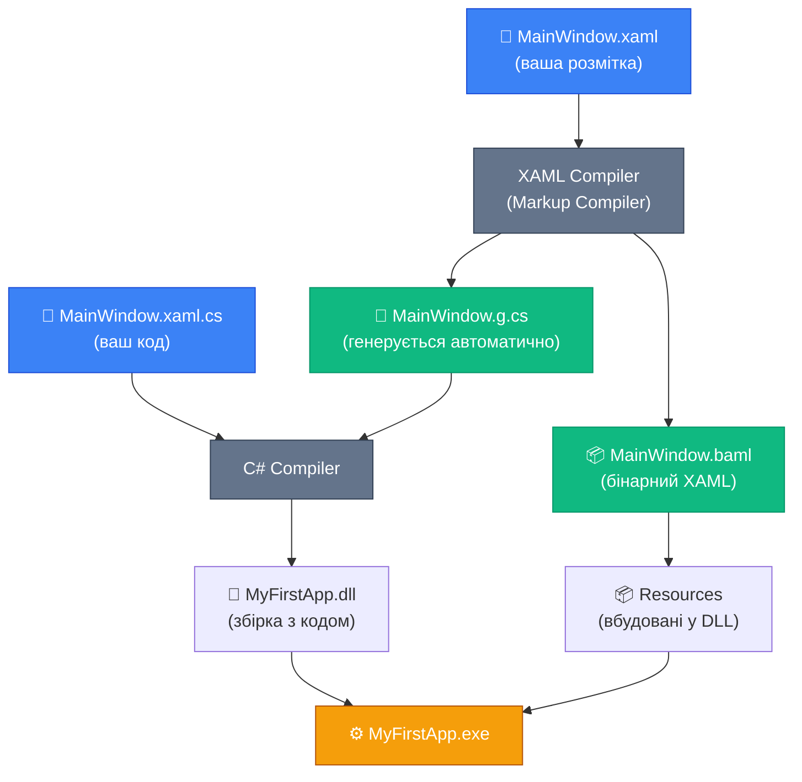

# Перший WPF-проєкт: від нуля до вікна

::note
**Словник теми:** **Code-behind** — C#-файл, що відповідає конкретному XAML-файлу і містить логіку для нього. **Partial class** — клас, розбитий на кілька файлів, що компілюються в один. **`InitializeComponent()`** — метод, що запускає обробку XAML і будує UI. **`x:Name`** — атрибут для надання елементу імені, за яким до нього можна звертатися з C#. **Hot Reload** — функція IDE, що дозволяє змінювати XAML під час роботи застосунку без перезапуску.
::

## Ваш перший GUI-застосунок

Після сотень рядків `Console.WriteLine` і `Console.ReadLine` — настав час зробити щось якісно інше. Програму, з якою можна взаємодіяти мишею. Програму, що має вигляд, а не лише висновки. Програму, що живе у вікні.

Ця стаття — чисто практична. Ми створимо перший WPF-проєкт буквально з нуля, розберемо кожен файл по рядках і додамо перше живе вікно, що реагує на натискання кнопки.

Жодного MVVM, жодного Data Binding, жодних патернів — лише чистий, прямий WPF у найпростішому вигляді. Це основа, яку потрібно добре зрозуміти перед переходом до складніших концепцій.

---

## Структура WPF-проєкту: що всередині

Перш ніж запускати застосунок — розберемось, що за файли створює Visual Studio / dotnet CLI. Кожен файл має чітку роль і не є «магічним шаблоном».

### Створення проєкту

::tabs

::tabs-item{label="Terminal (dotnet CLI)"}

```bash
# Створення нового WPF-проєкту:
dotnet new wpf -n MyFirstApp

# Перейти в папку:
cd MyFirstApp

# Запустити застосунок:
dotnet run
```

::

::tabs-item{label="Visual Studio"}

```
File → New → Project → WPF Application (.NET)
```

Вкажіть назву проєкту, оберіть `.NET 8` (або найновіший .NET), натисніть Create.

::

::tabs-item{label="JetBrains Rider"}

```
File → New Solution → App → WPF Application
```

Оберіть Target Framework: net8.0-windows, натисніть Create.

::

::

Після створення ви побачите структуру файлів:

```
MyFirstApp/
├── App.xaml               ← Конфігурація застосунку
├── App.xaml.cs            ← Code-behind для App.xaml
├── MainWindow.xaml        ← Розмітка головного вікна
├── MainWindow.xaml.cs     ← Code-behind для MainWindow.xaml
├── MyFirstApp.csproj      ← Конфігурація проєкту
└── AssemblyInfo.cs        ← Метадані збірки (генерується)
```

### Файл проєкту: .csproj

Відкрийте `MyFirstApp.csproj`. Для WPF він виглядає так:

```xml
<Project Sdk="Microsoft.NET.Sdk">

  <PropertyGroup>
    <OutputType>WinExe</OutputType>
    <TargetFramework>net8.0-windows</TargetFramework>
    <Nullable>enable</Nullable>
    <ImplicitUsings>enable</ImplicitUsings>
    <UseWPF>true</UseWPF>
  </PropertyGroup>

</Project>
```

Тут є три критично важливих рядки:

**`<OutputType>WinExe</OutputType>`** — тип виводу «Windows-виконуваний файл». На відміну від `Exe` (консоль), `WinExe` не відкриває консольне вікно при запуску. Це саме те, що потрібно для GUI-застосунку.

**`<TargetFramework>net8.0-windows</TargetFramework>`** — суфікс `-windows` критично важливий. Він означає, що проєкт використовує Windows-специфічні API. WPF без нього просто не скомпілюється — він прив'язаний до Windows.

**`<UseWPF>true</UseWPF>`** — включає підтримку WPF. Без цього рядка компілятор не знає, що треба підключити `PresentationFramework.dll`, `PresentationCore.dll` тощо.

---

## Анатомія App.xaml: точка входу застосунку

`App.xaml` — це перший файл, що обробляється при запуску WPF-застосунку. Він описує сам застосунок як об'єкт.

```xml
<Application x:Class="MyFirstApp.App"
             xmlns="http://schemas.microsoft.com/winfx/2006/xaml/presentation"
             xmlns:x="http://schemas.microsoft.com/winfx/2006/xaml"
             StartupUri="MainWindow.xaml">
    <Application.Resources>
        <!-- Глобальні ресурси застосунку будуть тут -->
    </Application.Resources>
</Application>
```

Розберемо кожен атрибут:

**`x:Class="MyFirstApp.App"`** — вказує, який C#-клас «продовжує» цей XAML-файл. XAML-компілятор згенерує частину класу `App`, а ви написали іншу частину в `App.xaml.cs`. Разом вони утворять один повний клас.

**`xmlns` та `xmlns:x`** — простори імен XML. Перший підключає всі WPF-контроли, другий — спеціальні директиви XAML (`x:Class`, `x:Name`, `x:Type` тощо). Ми детально розберемо їх у наступному блоці.

**`StartupUri="MainWindow.xaml"`** — вказує, яке вікно відкрити при запуску. WPF знайде цей XAML-файл, створить екземпляр вікна і відобразить його. Саме так починається ваш застосунок.

**`Application.Resources`** — місце для глобальних ресурсів: кольорів, шрифтів, стилів, що будуть доступні у всіх вікнах. Поки що порожнє — повернемось до ресурсів у Блоці 2.

### App.xaml.cs — code-behind застосунку

```csharp
using System.Windows;

namespace MyFirstApp;

public partial class App : Application
{
    // Тут може бути OnStartup, OnExit, DispatcherUnhandledException
    // Якщо їх немає — WPF використовує поведінку за замовчуванням:
    // відкриває вікно з StartupUri і закривається при закритті останнього вікна.
}
```

::note
Зверніть увагу — `App` є `partial`. Частину класу генерує XAML-компілятор (на основі `App.xaml`), решту пишете ви. При компіляції вони зливаються в один клас. Ми детально розберемо `partial` нижче.
::

---

## Анатомія MainWindow.xaml: перше вікно

`MainWindow.xaml` — опис головного вікна застосунку. Ось мінімальна версія:

```xml
<Window x:Class="MyFirstApp.MainWindow"
        xmlns="http://schemas.microsoft.com/winfx/2006/xaml/presentation"
        xmlns:x="http://schemas.microsoft.com/winfx/2006/xaml"
        Title="Мій перший WPF-застосунок"
        Width="400"
        Height="300"
        WindowStartupLocation="CenterScreen">

    <StackPanel Margin="20" VerticalAlignment="Center">
        <TextBlock x:Name="greetingText"
                   Text="Привіт, WPF!"
                   FontSize="24"
                   HorizontalAlignment="Center"
                   Margin="0,0,0,20"/>

        <Button Content="Натисни мене"
                Width="150"
                Click="Button_Click"/>
    </StackPanel>

</Window>
```

Розберемо ключові атрибути `<Window>`:

**`x:Class="MyFirstApp.MainWindow"`** — пов'язує цей XAML з C#-класом `MainWindow` у namespace `MyFirstApp`. Той самий механізм `partial`, що й у `App`.

**`Title`** — текст у заголовку вікна (синя смуга зверху).

**`Width` і `Height`** — початкові розміри вікна у пікселях (точніше, у пристрій-незалежних одиницях — 1 одиниця = 1/96 дюйма).

**`WindowStartupLocation="CenterScreen"`** — вікно з'являється по центру екрану, а не у лівому верхньому куті (що є поведінкою за замовчуванням).

Всередині `<Window>` — один кореневий елемент `<StackPanel>` з `<TextBlock>` та `<Button>`.

::tip
**Важливо:** У вікні може бути лише **один** безпосередній дочірній елемент. Це обмеження `ContentControl`, від якого наслідує `Window`. Якщо вам треба кілька елементів — розмістіть їх всередині панелі-контейнера (`StackPanel`, `Grid`, `DockPanel`). Детально про панелі — у Блоці 3.
::

### XAML — це C# в іншому записі

Перш ніж рухатися далі, треба зрозуміти одну ключову річ — **кожен рядок XAML є рівнозначним рядку C#**. XAML — це не окрема мова з власною магією. Це лише зручніший, наочніший спосіб запису того, що можна зробити на C#.

Подивіться на приклад нашого вікна та його C#-еквівалент:

::tabs

::tabs-item{label="XAML-версія"}

```xml
<Window Title="Мій застосунок" Width="400" Height="300"
        WindowStartupLocation="CenterScreen">

    <StackPanel Margin="20" VerticalAlignment="Center">
        <TextBlock x:Name="greetingText"
                   Text="Привіт, WPF!"
                   FontSize="24"
                   HorizontalAlignment="Center"
                   Margin="0,0,0,20"/>

        <Button Content="Натисни мене"
                Width="150"
                Click="Button_Click"/>
    </StackPanel>

</Window>
```

::

::tabs-item{label="C#-еквівалент"}

```csharp
var window = new Window();
window.Title = "Мій застосунок";
window.Width = 400;
window.Height = 300;
window.WindowStartupLocation = WindowStartupLocation.CenterScreen;

var panel = new StackPanel();
panel.Margin = new Thickness(20);
panel.VerticalAlignment = VerticalAlignment.Center;

var textBlock = new TextBlock();
textBlock.Name = "greetingText";
textBlock.Text = "Привіт, WPF!";
textBlock.FontSize = 24;
textBlock.HorizontalAlignment = HorizontalAlignment.Center;
textBlock.Margin = new Thickness(0, 0, 0, 20);

var button = new Button();
button.Content = "Натисни мене";
button.Width = 150;
button.Click += Button_Click;

panel.Children.Add(textBlock);
panel.Children.Add(button);
window.Content = panel;

window.Show();
```

::

::

Обидва варіанти роблять абсолютно те саме. XAML просто коротший, читабельніший і набагато краще відображає ієрархічну структуру UI. Уявіть форму з 50 елементами — написати її на чистому C# стане пеклом.

Але ніколи не забувайте про цю рівнозначність: коли ви ставите атрибут `FontSize="24"` — ви по суті пишете `textBlock.FontSize = 24;`.

Ось як наше перше вікно виглядає у живому превьюері:

::wpf-preview{title="Перше WPF-вікно"}

```xml
<StackPanel Margin="20" VerticalAlignment="Center">
    <TextBlock Text="Привіт, WPF!"
               FontSize="24"
               HorizontalAlignment="Center"
               Margin="0,0,0,20"/>

    <Button Content="Натисни мене"
            Width="150"
            HorizontalAlignment="Center"
            Command="{Binding ShowMessageCommand}"
            CommandParameter="Кнопку натиснуто! Це ваш перший WPF-застосунок 🎉"/>
</StackPanel>
```

::

::note
Превью використовує Avalonia Fluent Theme і виглядає як Windows 11. У реальному WPF-проєкті на Windows кнопки та інші елементи матимуть класичний стиль Aero, якщо ви не підключите сторонню бібліотеку тем (наприклад, MaterialDesignInXaml або MahApps.Metro).
::

---

## Code-Behind: логіка вікна на C#

Code-behind — це C#-файл, який відповідає конкретному XAML-файлу та містить логіку для нього. Для `MainWindow.xaml` це `MainWindow.xaml.cs`.

Відкрийте `MainWindow.xaml.cs`. Там ви побачите мінімальний каркас:

```csharp
using System.Windows;

namespace MyFirstApp;

public partial class MainWindow : Window
{
    public MainWindow()
    {
        InitializeComponent();
    }
}
```

Поки що тут лише конструктор з єдиним рядком — `InitializeComponent()`. Зараз пояснимо, що він робить. Але спочатку — реалізуємо обробник кліку кнопки, який ми оголосили у XAML через `Click="Button_Click"`.

### Додаємо перший обробник події

Для того, щоб кнопка відреагувала на натискання, нам потрібен метод `Button_Click` у класі `MainWindow`:

```csharp
public partial class MainWindow : Window
{
    public MainWindow()
    {
        InitializeComponent();
    }

    private void Button_Click(object sender, RoutedEventArgs e)
    {
        greetingText.Text = "Кнопку натиснуто! 🎉";
    }
}
```

Декілька важливих деталей:

**`greetingText`** — це поле, що автоматично генерується компілятором WPF на основі атрибута `x:Name="greetingText"` у XAML. Ви не оголошуєте це поле вручну — воно з'являється само.

**`sender`** — це об'єкт, що ініціював подію (у нашому випадку — кнопка типу `Button`). Якщо вам потрібно звернутися до кнопки у обробнику — приведіть його до типу: `var button = (Button)sender;`.

**`RoutedEventArgs e`** — аргументи події з додатковою інформацією. Для Click-події вони містять мало цікавого, але у складніших подіях (наприклад, MouseMove) `e` буде повним даними: координати, кнопка, стан клавіш тощо.

### Доступ до елементів через `x:Name`

Механізм `x:Name` — це місток між XAML та C#. Будь-якому XAML-елементу можна дати ім'я:

```xml
<TextBlock x:Name="myLabel" Text="Статус: очікування"/>
<TextBox x:Name="nameInput"/>
<ProgressBar x:Name="loadingBar" Value="0" Maximum="100"/>
```

Після цього у C# ці елементи доступні як поля класу:

```csharp
private void StartLoading_Click(object sender, RoutedEventArgs e)
{
    myLabel.Text = $"Завантаження для: {nameInput.Text}";
    loadingBar.Value = 50;
}
```

::warning
Ніколи не звертайтеся до елементів з `x:Name` **до** виклику `InitializeComponent()` — вони ще не ініціалізовані і будуть `null`. Спроба звернутися до них у конструкторі перед `InitializeComponent()` спричинить `NullReferenceException`.
::

### Демонстрація: лічильник кліків

Розширимо наш приклад: додамо лічильник кліків. Зверніть увагу, як поле `_clickCount` зберігає стан між натисканнями:

::wpf-preview{title="Лічильник кліків через code-behind"}

```xml
<StackPanel Margin="20" Spacing="12">
    <TextBlock Text="Лічильник кліків"
               FontSize="20"
               FontWeight="Bold"/>

    <TextBlock Text="Кількість натискань:"
               FontSize="14"/>

    <TextBlock x:Name="counterDisplay"
               Text="0"
               FontSize="48"
               FontWeight="Bold"
               HorizontalAlignment="Center"
               Foreground="#3b82f6"/>

    <Button Content="Натисни мене!"
            HorizontalAlignment="Center"
            Command="{Binding ShowMessageCommand}"
            CommandParameter="Натиснуто! Лічильник збільшено."/>
</StackPanel>
```

```csharp
public partial class MainWindow : Window
{
    // Поле зберігає стан між натисканнями
    private int _clickCount = 0;

    public MainWindow()
    {
        InitializeComponent();
    }

    private void CountButton_Click(object sender, RoutedEventArgs e)
    {
        _clickCount++;
        counterDisplay.Text = _clickCount.ToString();
    }
}
```

::

---

## Partial Classes: як XAML і C# стають одним

Ключове слово `partial` у `public partial class MainWindow` — це не випадковість. Воно означає, що клас `MainWindow` визначений у **кількох файлах одночасно**, і C#-компілятор об'єднує їх при збірці.

### Дві частини одного класу

**Перша частина** — ваш `MainWindow.xaml.cs`. Тут ви пишете конструктор, обробники подій та власну логіку.

**Друга частина** — автоматично згенерований файл `MainWindow.g.cs` (або `MainWindow.g.i.cs`). Його створює WPF-компілятор на основі вашого XAML і він містить:
- Поля для кожного елемента з `x:Name`
- Метод `InitializeComponent()`, що завантажує UI
- Реалізацію IComponentConnector для підключення обробників подій

Ось спрощений вигляд того, що WPF генерує за вас:

```csharp
// MainWindow.g.cs — НЕ редагуйте! Генерується автоматично
public partial class MainWindow : IComponentConnector
{
    // Поля з x:Name
    internal TextBlock greetingText;
    internal Button actionButton;

    public void InitializeComponent()
    {
        // Знаходить і завантажує XAML зі збірки
        var resourceLocator = new Uri("/MyFirstApp;component/mainwindow.xaml", UriKind.Relative);
        Application.LoadComponent(this, resourceLocator);
    }

    void IComponentConnector.Connect(int connectionId, object target)
    {
        switch (connectionId)
        {
            case 1: // greetingText
                this.greetingText = (TextBlock)target;
                break;
            case 2: // actionButton
                this.actionButton = (Button)target;
                this.actionButton.Click += Button_Click;
                break;
        }
    }
}
```

Ваш клас і цей згенерований файл об'єднуються компілятором C# в один клас `MainWindow`. Звідси і береться `partial`.

::tip
Щоб побачити згенерований файл: у Visual Studio → Solution Explorer → кнопка "Show All Files" → розкрийте папку `obj\Debug\net8.0-windows\`. Там знайдете `*.g.cs` файли.
::

### Що відбувається при компіляції

Ось повний ланцюжок перетворення вашого XAML у виконуваний код:

::mermaid



::

**Крок 1 — XAML Compiler**: Трансформує ваш `MainWindow.xaml` у два артефакти:
- `MainWindow.g.cs` — C# код з полями та `InitializeComponent()`
- `MainWindow.baml` — стиснутий бінарний XAML, вбудовується в збірку як ресурс

**Крок 2 — C# Compiler**: Збирає ваш `MainWindow.xaml.cs` та `MainWindow.g.cs` в єдиний клас `MainWindow`.

**Крок 3 — Runtime**: При запуску `InitializeComponent()` завантажує `.baml` з ресурсів збірки, відтворює об'єктний граф (всі елементи UI) та прив'язує їх до полів класу.

Ось чому `.xaml` файли **не потрібно копіювати** поруч з `.exe` — вони вже вбудовані всередину збірки у вигляді `.baml`.

---

## Hot Reload: живі зміни без перезапуску

Одна з найважливіших можливостей для продуктивної розробки — **Hot Reload**. Він дозволяє змінювати код під час роботи застосунку і одразу бачити результат без повного перезапуску.

### XAML Hot Reload

**XAML Hot Reload** — найцінніший інструмент при роботі з UI. Ви змінюєте XAML (кольори, розміри, текст, відступи, розмітку) — і бачите зміни миттєво в запущеному вікні.

Щоб увімкнути XAML Hot Reload у **Visual Studio**:

::steps

### Запустіть застосунок у режимі Debug

Натисніть :kbd{value="F5"} (не :kbd{value="Ctrl"} + :kbd{value="F5"}). Тільки в режимі Debug Hot Reload доступний.

### Переконайтеся, що Hot Reload активний

У меню **Debug → Enable Hot Reload** має бути відмічено. Також перевірте: **Tools → Options → Debugging → .NET/C++ Hot Reload**.

### Змінюйте XAML і дивіться результат

Поки застосунок запущений, відкрийте `MainWindow.xaml`, змініть, наприклад, `FontSize="24"` на `FontSize="36"`. Збережіть файл — IDE запитає, чи застосувати зміни.

::

У **JetBrains Rider** XAML Hot Reload активується автоматично при запуску в режимі Debug через власний механізм RiderLink.

### Що можна змінювати "на льоту"

Розуміння обмежень Hot Reload заощадить вам час і нерви:

| Дія | XAML Hot Reload | C# Hot Reload |
|-----|:-:|:-:|
| Змінити `Text`, `Content`, `FontSize` | ✅ | — |
| Змінити `Background`, `Foreground` (колір) | ✅ | — |
| Змінити `Margin`, `Padding`, `Width` | ✅ | — |
| Додати або видалити елемент | ✅ | — |
| Змінити структуру Layout (Grid ↔ StackPanel) | ✅ | — |
| Змінити тіло методу | — | ✅ |
| Додати новий метод | — | ❌ |
| Змінити `x:Class` (ім'я класу) | ❌ | ❌ |
| Змінити `StartupUri` | ❌ | — |
| Додати новий `x:Name` | ⚠️ частково | — |

::tip
Якщо Hot Reload не застосовується автоматично — шукайте кнопку 🔥 **"Apply Code Changes"** на панелі Debug або натисніть :kbd{value="Alt"} + :kbd{value="F10"}. Деякі зміни вимагають ручного застосування.
::

---

## Покрокова інструкція: від нуля до першого застосунку

Тепер зберемо все разом у повний практичний прохід. Ваш перший застосунок буде мати:
- TextBlock для виводу повідомлень
- TextBox для введення тексту
- Button, що реагує на натискання

::steps

### Крок 1: Створення проєкту

Відкрийте термінал і виконайте:

```bash
dotnet new wpf -n MyFirstWpfApp
cd MyFirstWpfApp
```

Або у Visual Studio: **File → New → Project → WPF Application**.

### Крок 2: Відкриття файлів

Відкрийте проєкт у Visual Studio або Rider. Знайдіть `MainWindow.xaml` та `MainWindow.xaml.cs` — ваші основні файли.

### Крок 3: Редагування MainWindow.xaml

Відкрийте `MainWindow.xaml` і замініть `<Grid>` на наступний вміст:

```xml
<Window x:Class="MyFirstWpfApp.MainWindow"
        xmlns="http://schemas.microsoft.com/winfx/2006/xaml/presentation"
        xmlns:x="http://schemas.microsoft.com/winfx/2006/xaml"
        Title="Мій перший WPF-застосунок"
        Width="450" Height="320"
        WindowStartupLocation="CenterScreen">

    <StackPanel Margin="24" Spacing="12">

        <TextBlock Text="Введіть своє ім'я:"
                   FontSize="14"/>

        <TextBox x:Name="nameInput"
                 FontSize="14"
                 Padding="8,4"/>

        <Button Content="Привітати"
                Width="150"
                HorizontalAlignment="Left"
                Click="GreetButton_Click"/>

        <TextBlock x:Name="resultText"
                   FontSize="18"
                   FontWeight="Bold"
                   TextWrapping="Wrap"/>

    </StackPanel>
</Window>
```

### Крок 4: Редагування MainWindow.xaml.cs

Відкрийте `MainWindow.xaml.cs` і додайте обробник:

```csharp
using System.Windows;

namespace MyFirstWpfApp;

public partial class MainWindow : Window
{
    public MainWindow()
    {
        InitializeComponent();
    }

    private void GreetButton_Click(object sender, RoutedEventArgs e)
    {
        var name = nameInput.Text.Trim();

        if (string.IsNullOrEmpty(name))
        {
            resultText.Text = "⚠️ Будь ласка, введіть ім'я!";
            return;
        }

        resultText.Text = $"Привіт, {name}! 👋 Ласкаво просимо до WPF!";
    }
}
```

### Крок 5: Запуск застосунку

Натисніть :kbd{value="F5"} або виконайте:

```bash
dotnet run
```

Відкриється вікно. Введіть ім'я у текстове поле і натисніть кнопку — ви побачите привітання.

::

Ось як це виглядає у живому превьюері:

::wpf-preview{title="Застосунок з привітанням"}

```xml
<StackPanel Margin="24" Spacing="12">

    <TextBlock Text="Введіть своє ім'я:"
               FontSize="14"/>

    <TextBox FontSize="14"
             Padding="8,4"
             Text="Іванко"/>

    <Button Content="Привітати"
            Width="150"
            HorizontalAlignment="Left"
            Command="{Binding ShowMessageCommand}"
            CommandParameter="Привіт, Іванко! 👋 Ласкаво просимо до WPF!"/>

    <TextBlock Text="Привіт, Іванко! 👋 Ласкаво просимо до WPF!"
               FontSize="18"
               FontWeight="Bold"
               TextWrapping="Wrap"/>

</StackPanel>
```

```csharp
public partial class MainWindow : Window
{
    public MainWindow()
    {
        InitializeComponent();
    }

    private void GreetButton_Click(object sender, RoutedEventArgs e)
    {
        var name = nameInput.Text.Trim();

        if (string.IsNullOrEmpty(name))
        {
            resultText.Text = "⚠️ Будь ласка, введіть ім'я!";
            return;
        }

        resultText.Text = $"Привіт, {name}! 👋 Ласкаво просимо до WPF!";
    }
}
```

::

---

## Підсумок: що ми дізналися

У цій статті ми пройшли через перший WPF-проєкт крок за кроком. Ось ключові ідеї, які варто запам'ятати:

::card-group

::card{title="Структура проєкту" icon="i-heroicons-folder-open"}

- `.csproj` з `<UseWPF>true</UseWPF>` — вмикає WPF
- `net8.0-windows` — WPF є лише для Windows
- Четири файли утворюють основу: `App.xaml` + `.cs`, `MainWindow.xaml` + `.cs`

::

::card{title="App.xaml" icon="i-heroicons-cog-6-tooth"}

- `Application` — singleton всього застосунку
- `StartupUri` — яке вікно відкрити при старті
- `Application.Resources` — спільні ресурси для всіх вікон
- `Application.Current` — глобальний доступ до singleton

::

::card{title="XAML = C#" icon="i-heroicons-code-bracket"}

- Кожен XAML-атрибут = властивість об'єкта
- Вкладені теги = вкладені об'єкти
- XAML компілюється у `.baml` і вбудовується в збірку
- Один кореневий елемент всередині `<Window>`

::

::card{title="Code-Behind" icon="i-heroicons-document-code"}

- `x:Name` — ім'я елемента для доступу з C#
- `Click="Method"` — підписка на подію у XAML
- `partial class` — об'єднує ваш код з генерованим
- `InitializeComponent()` — завжди перший рядок у конструкторі

::

::

---

## Практичні завдання

Час перевірити розуміння на практиці. Кожне завдання будує на попередньому.

::accordion

::accordion-item{label="🟢 Рівень 1: Вікно з привітанням та кнопкою" icon="i-lucide-circle-help"}

**Завдання**: Створіть WPF-застосунок, що при запуску показує TextBlock з текстом `"Привіт, WPF!"` та кнопку `"Змінити текст"`. При натисканні кнопки текст у TextBlock має змінитися на `"Текст змінено успішно! ✅"`.

**Що треба знати**: `x:Name` на TextBlock, обробник Click у code-behind, `textBlock.Text = "..."`.

**Формат підказки**:
```xml
<!-- У XAML -->
<TextBlock x:Name="?" Text="Привіт, WPF!"/>
<Button Content="Змінити текст" Click="?"/>
```
```csharp
// У code-behind
private void SomeName_Click(object sender, RoutedEventArgs e)
{
    ?.Text = "Текст змінено успішно! ✅";
}
```

**Перевірка**: Застосунок запускається, показує вікно, кнопка змінює текст.

::

::accordion-item{label="🟡 Рівень 2: Лічильник та зміна кольору фону" icon="i-lucide-circle-help"}

**Завдання**: Розширте Рівень 1 та додайте два нових функціонали:

1. **Лічильник**. Додайте TextBlock, що відображає кількість натискань кнопки з Рівня 1. Текст формату: `"Кнопку натиснуто: 3 раз(и)"`.

2. **Кнопка зміни фону**. Додайте другу кнопку `"Змінити фон"`. При кожному натисканні — фон головної панелі (StackPanel або Grid) змінюється на інший залежно від лічильника: наприклад, по черзі `LightBlue`, `LightGreen`, `LightCoral`, `LightYellow`.

**Підказка для зміни фону**:
```csharp
private readonly string[] _colors = ["LightBlue", "LightGreen", "LightCoral", "LightYellow"];
private int _colorIndex = 0;

private void ChangeBackground_Click(object sender, RoutedEventArgs e)
{
    _colorIndex = (_colorIndex + 1) % _colors.Length;
    mainPanel.Background = new BrushConverter()
        .ConvertFrom(_colors[_colorIndex]) as Brush;
}
```

**Що треба знати**: Поле класу для стану, `BrushConverter` або `Brushes.LightBlue`, x:Name на панелі.

::

::accordion-item{label="🔴 Рівень 3: Форма привітання з валідацією" icon="i-lucide-circle-help"}

**Завдання**: Створіть форму з наступними елементами:

- `TextBox` для введення **імені** (з горизонтальним написом-міткою зліва)
- `TextBox` для введення **прізвища**
- `ComboBox` для вибору **звернення**: `"Пан"`, `"Пані"`, `"Добродій"` — перший варіант обраний за замовчуванням
- `Button` `"Сформувати привітання"`
- `TextBlock` для виводу результату

**Логіка кнопки**:
1. Якщо поле імені або прізвища порожнє — виводьте `MessageBox.Show(...)` з текстом про помилку, результат НЕ змінюється.
2. Якщо все заповнено — у TextBlock з'являється: `"[Звернення] [Ім'я] [Прізвище], вітаємо у нашому застосунку!"`.

**Додаткові умови**:
- Обидва TextBox мають максимальну ширину 300px
- TextBlock з результатом має `TextWrapping="Wrap"` та `FontSize="16"`
- Кнопка недоступна (IsEnabled="False"), поки застосунок тільки запустився, і стає доступною при будь-якому введенні в TextBox (підказка: підпишіться на `TextChanged` у code-behind)

**Що треба знати**: `TextBox.Text`, `ComboBox.SelectedIndex`, `ComboBox.Items.Add(...)` або ручне заповнення у XAML, `string.IsNullOrWhiteSpace()`, `MessageBox.Show()`, `TextChanged` подія, `button.IsEnabled`.

::

::

