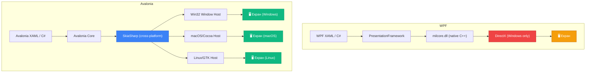

# Перший Avalonia-проєкт: WPF для всіх платформ

У попередній статті ви створили свій перший WPF-застосунок. Ви написали XAML-розмітку, додали обробник кліку у code-behind та побачили перше вікно на екрані. Це великий крок.

Але є одна деталь: ваш WPF-застосунок запуститься **лише на Windows**. Якщо колега з macOS спробує запустити ваш `.exe` — він побачить помилку. Якщо розгорнути на Linux-сервері з GUI — нічого не вийде.

Ось тут на сцену виходить **Avalonia**.

::note
**Словник теми:** **Avalonia** — кросплатформний UI-фреймворк для .NET, натхненний WPF. **Skia / SkiaSharp** — графічна бібліотека Google, що рендерить пікселі незалежно від ОС. **`.axaml`** — розширення файлів розмітки в Avalonia (аналог `.xaml`). **`Program.cs`** — точка входу в Avalonia-застосунок (аналог `App.xaml` у WPF). **DevTools** — вбудований інспектор Avalonia UI (аналог Snoop, але з коробки). **Companion-стаття** — супутня стаття після WPF-уроку, що показує відмінності Avalonia.
::

---

## Hook: той самий код — на трьох системах

Ось що дивовижно: якщо ви знаєте WPF — ви вже знаєте 80% Avalonia. Та сама декларативна XAML-розмітка, той самий принцип Data Binding, той самий підхід MVVM, ті ж назви контролів — `Button`, `TextBlock`, `TextBox`, `StackPanel`, `Grid`.

Різниця в одному: WPF рендерить через DirectX і живе лише на Windows. Avalonia рендерить через Skia — ту саму бібліотеку, яку використовує Flutter від Google — і запускається де завгодно.

Ось конкретний список де може працювати Avalonia-застосунок:

::card-group

::card{title="Desktop" icon="i-heroicons-computer-desktop"}

- Windows 10/11 (x64, x86, ARM64)
- macOS 10.14+ (Intel і Apple Silicon)
- Linux (GTK, Framebuffer, DRM)

::

::card{title="Mobile & Web" icon="i-heroicons-device-phone-mobile"}

- iOS 13+
- Android 5.0+
- WebAssembly (WASM у браузері)

::

::card{title="Embedded" icon="i-heroicons-cpu-chip"}

- Raspberry Pi (Linux ARM)
- Промислові дисплеї (Framebuffer)
- Single-board комп'ютери

::

::

Один і той самий C# код, одна і та сама XAML-розмітка — і він запускається на всьому цьому. Без змін. Це і є сила Avalonia.

---

## Що таке Avalonia і як вона рендерить UI

Щоб зрозуміти Avalonia, треба спочатку зрозуміти, чому WPF не є кросплатформним. Це питання архітектурне.

### Чому WPF прив'язаний до Windows

WPF рендерить через **DirectX** — графічний API Microsoft, що існує виключно на Windows. Міст між WPF і DirectX — це нативна бібліотека `milcore.dll`, що написана на C++ і інтегрована в Windows. Без неї WPF не може намалювати жодного пікселя.

Крім того, WPF залежить від **Windows Message Loop** — механізму повідомлень Windows (WM_PAINT, WM_KEYDOWN, WM_MOUSEDOWN тощо). Це означає прив'язку до Win32 API.

Всі ці залежності роблять перенесення WPF на інші ОС практично неможливим без повного переписування ядра.

### Як Avalonia вирішує цю проблему

Avalonia використовує принципово інший підхід: **абстрагує рендеринг через SkiaSharp** — .NET-обгортку над бібліотекою Skia від Google.

Ось як це виглядає архітектурно:

::mermaid



::

Avalonia самостійно малює весь UI через Skia — від пікселів кнопки до тексту у TextBox. Системні контроли ОС вона **не використовує**. Це навіть перевага: UI виглядає однаково на всіх платформах, бо всі пікселі малюються одним рушієм.

Єдине, що бере від платформи Avalonia — **вікно** (нативне вікно ОС для отримання подій введення та відображення) та **нативні файлові діалоги** (на macOS виглядають по-маківськи, на Windows — по-вінівськи).

### Skia: що це таке

**Skia** — 2D-графічна бібліотека від Google, написана на C++. Вона рендерить текст, криві Безьє, градієнти, тіні, прямокутники — все, що потрібно для UI. Skia використовується у:

- **Google Chrome** / Chromium (весь рендеринг браузера)
- **Flutter** (UI-фреймворк Google)
- **Android** (базовий рендеринг UI)
- **LibreOffice** (частково)

Тобто коли ви запускаєте Chrome — ваш браузер малює пікселі тією самою бібліотекою, що і Avalonia-застосунок. Перевірена мільярдами пристроїв технологія.

---

## Avalonia vs WPF: перше порівняння

Перш ніж писати код, корисно мати загальну картину: що спільного, що різного.

### Спільне: чому знання WPF ≈ знання Avalonia

| Концепція | WPF | Avalonia |
|-----------|-----|----------|
| Мова розмітки | XAML | XAML (`.axaml`) |
| Data Binding | `{Binding Path=Name}` | `{Binding Path=Name}` |
| Команди | `ICommand` | `ICommand` |
| MVVM | Класичний MVVM | Класичний MVVM + ReactiveUI |
| Панелі | `StackPanel`, `Grid`, `DockPanel` | ✅ Ті самі |
| Контроли | `Button`, `TextBox`, `ComboBox`... | ✅ Ті самі назви |
| Ресурси | `ResourceDictionary` | `ResourceDictionary` |
| Стилі | `Style` з `Setter` | `Style` з `Setter` |
| DataTemplate | ✅ Є | ✅ Є |
| ControlTemplate | ✅ Є | ✅ Є |

Цей список — причина, чому кажуть: "знаєш WPF — знаєш Avalonia". Більшість коду, яку ви пишете у WPF, можна перенести в Avalonia з мінімальними змінами.

### Відмінності: що робить Avalonia особливою

| Аспект | WPF | Avalonia |
|--------|-----|----------|
| **Платформа** | Windows only | Windows, macOS, Linux, iOS, Android, WASM |
| **Рендеринг** | DirectX | Skia (SkiaSharp) |
| **Розширення файлів** | `.xaml`, `.xaml.cs` | `.axaml`, `.axaml.cs` |
| **Точка входу** | `App.xaml` з `StartupUri` | `Program.cs` з `BuildAvaloniaApp()` |
| **Стилізація** | XAML-стилі, Triggers | XAML-стилі + **CSS-like селектори**, Pseudo-classes |
| **Скомпільовані Binding** | ❌ (тільки Reflection) | ✅ `x:CompileBindings` |
| **DevTools** | Snoop (зовнішній) | ✅ Вбудовані DevTools (F12) |
| **Open-source** | Частково (CoreWPF) | ✅ Повністю (MIT) |
| **MVVM-фреймворк** | MVVM Toolkit (Microsoft) | ReactiveUI (рекомендований) |
| **Triggers** | DataTrigger, Trigger | ❌ → Pseudo-classes, Behaviors |

::note
Ця порівняльна таблиця — лише загальний огляд. Кожна відмінність буде розібрана детально у відповідних companion-статтях далі по курсу: стилізація у статті `27a`, Compiled Bindings у `17a`, ReactiveUI у `25a` тощо.
::

---

## Встановлення шаблонів Avalonia

На відміну від WPF, шаблони Avalonia не включені в .NET SDK за замовчуванням. Їх потрібно встановити окремо.

### Встановлення через dotnet CLI

```bash
dotnet new install Avalonia.Templates
```

::terminal-preview{title="dotnet new install Avalonia.Templates"}
<div class="line"><span class="opacity-40">$</span> <strong class="font-bold">dotnet new install Avalonia.Templates</strong></div>
<div class="line"><span class="text-gray-400">The following template packages will be installed:</span></div>
<div class="line"><span class="text-blue-400">   Avalonia.Templates</span></div>
<div class="line"></div>
<div class="line"><span class="text-gray-400">Success: Avalonia.Templates installed the following templates:</span></div>
<div class="line"><span class="text-green-400 font-bold">avalonia.app</span>          <span class="text-gray-400">Avalonia Application</span></div>
<div class="line"><span class="text-green-400 font-bold">avalonia.mvvm</span>         <span class="text-gray-400">Avalonia MVVM App</span></div>
<div class="line"><span class="text-green-400 font-bold">avalonia.xplat</span>        <span class="text-gray-400">Avalonia Cross Platform Application</span></div>
<div class="line"><span class="text-green-400 font-bold">avalonia.usercontrol</span>  <span class="text-gray-400">Avalonia UserControl</span></div>
<div class="line"><span class="text-green-400 font-bold">avalonia.window</span>       <span class="text-gray-400">Avalonia Window</span></div>
<div class="line"><span class="text-green-400 font-bold">avalonia.templatedcontrol</span> <span class="text-gray-400">Avalonia Templated Control</span></div>
::

Після виконання цієї команди у вас з'являться нові шаблони для `dotnet new`. Перевірте:

```bash
dotnet new list | grep avalonia
```

### Встановлення плагіну для IDE

Для комфортної розробки встановіть розширення з підтримкою `.axaml` файлів:

::tabs

::tabs-item{label="Visual Studio 2022"}

1. Відкрийте **Extensions → Manage Extensions**
2. Знайдіть **"Avalonia for Visual Studio 2022"**
3. Встановіть і перезапустіть Visual Studio

Або через командний рядок:
```bash
# Avalonia Extension for VS 2022
# Встановлюється через Marketplace:
# https://marketplace.visualstudio.com/items?itemName=AvaloniaTeam.AvaloniaforVisualStudio2022
```

::

::tabs-item{label="JetBrains Rider"}

Rider має **вбудовану підтримку Avalonia** починаючи з версії 2023.x. Встановіть плагін для повноцінного синтаксису:

1. **Settings → Plugins → Marketplace**
2. Знайдіть **"AvaloniaRider"**
3. Встановіть і перезапустіть Rider

::

::tabs-item{label="VS Code"}

1. Відкрийте **Extensions** (:kbd{value="Ctrl"} + :kbd{value="Shift"} + :kbd{value="X"})
2. Знайдіть **"Avalonia for VSCode"**
3. Встановіть

::

::

---

## Створення першого Avalonia-проєкту

Тепер створимо проєкт. Зверніть увагу: є два основних шаблони, і важливо розуміти різницю між ними.

### Два шаблони: яку обрати?

```bash
dotnet new avalonia.app  -n MyAvaloniaApp   # Базовий — без MVVM
dotnet new avalonia.mvvm -n MyAvaloniaApp   # З MVVM та ReactiveUI
```

**`avalonia.app`** — мінімальний шаблон. Структура схожа на WPF: є `App.axaml`, `MainWindow.axaml`, `MainWindow.axaml.cs`. Для наших цілей знайомства — ідеальний вибір.

**`avalonia.mvvm`** — шаблон з інтегрованим ReactiveUI, ViewModels, ViewLocator. Значно складніша структура. Для вивчення MVVM у Avalonia — але ще не зараз.

Для цієї статті використовуємо `avalonia.app`:

```bash
dotnet new avalonia.app -n MyAvaloniaApp
cd MyAvaloniaApp
dotnet run
```

::terminal-preview{title="Запуск першого Avalonia-застосунку"}
<div class="line"><span class="opacity-40">$</span> <strong class="font-bold">dotnet new avalonia.app -n MyAvaloniaApp</strong></div>
<div class="line"><span class="text-gray-400">The template "Avalonia Application" was created successfully.</span></div>
<div class="line"></div>
<div class="line"><span class="opacity-40">$</span> <strong class="font-bold">cd MyAvaloniaApp && dotnet run</strong></div>
<div class="line"><span class="text-gray-400">Building...</span></div>
<div class="line"><span class="text-green-400 font-bold">Build succeeded.</span></div>
<div class="line"><span class="text-blue-400">    0 Warning(s)</span></div>
<div class="line"><span class="text-blue-400">    0 Error(s)</span></div>
<div class="line"></div>
<div class="line"><span class="text-gray-400">Time Elapsed 00:00:03.14</span></div>
<div class="line"><span class="text-green-400 font-bold">Application launched.</span></div>
::

Вікно відкривається. Текст "Welcome to Avalonia!" — перший Avalonia-застосунок готовий.

---

## Структура файлів Avalonia-проєкту

Порівняємо структуру WPF-проєкту та Avalonia-проєкту. Вони схожі, але є важливі відмінності.

::tabs

::tabs-item{label="📁 WPF (03.first-wpf-app.md)"}

```
MyWpfApp/
├── App.xaml                 ← Application + StartupUri
├── App.xaml.cs              ← partial class App : Application
├── MainWindow.xaml          ← Розмітка вікна (XAML)
├── MainWindow.xaml.cs       ← Code-behind (partial class)
├── MyWpfApp.csproj          ← <UseWPF>true</UseWPF>
└── AssemblyInfo.cs
```

::

::tabs-item{label="📁 Avalonia (avalonia.app)"}

```
MyAvaloniaApp/
├── App.axaml                ← Application (без StartupUri!)
├── App.axaml.cs             ← partial class App : Application
├── MainWindow.axaml         ← Розмітка вікна (.axaml!)
├── MainWindow.axaml.cs      ← Code-behind (partial class)
├── Program.cs               ← 🆕 Точка входу (немає у WPF!)
├── MyAvaloniaApp.csproj     ← Інші NuGet-пакети
└── app.manifest             ← (якщо Windows target)
```

::

::

Відразу помітно кілька відмінностей. Розберемо кожну детально.

---

## Анатомія Avalonia-проєкту: відмінності від WPF

### Відмінність 1: Розширення `.axaml` замість `.xaml`

Перше, що кидається в очі — всі XAML-файли мають розширення `.axaml` замість `.xaml`. Чому?

Причина суто практична: у проєкті, де одночасно встановлений і WPF, і Avalonia (або де розробник використовує Visual Studio), `.xaml` файли автоматично асоціюються з WPF XAML Designer. Це спричиняло конфлікти — дизайнер WPF намагався відкрити Avalonia XAML і падав з помилками.

Розширення `.axaml` (Avalonia XAML) вирішує цю проблему: інструменти не плутаються, який дизайнер використовувати.

::tip
Технічно, Avalonia може використовувати і `.xaml` файли — синтаксис абсолютно однаковий. Розширення `.axaml` — це конвенція, а не технічна вимога. Але рекомендується завжди використовувати `.axaml` для Avalonia-проєктів, щоб уникнути плутанини.
::

### Відмінність 2: `Program.cs` — нова точка входу

У WPF точка входу прихована всередині WPF-інфраструктури. Ви ніколи не бачите `Main()` — він генерується автоматично на основі `App.xaml`.

В Avalonia є явний файл `Program.cs` з методом `Main()`:

```csharp
using Avalonia;
using System;

namespace MyAvaloniaApp;

class Program
{
    // Точка входу - явна!
    [STAThread]
    public static void Main(string[] args)
        => BuildAvaloniaApp()
            .StartWithClassicDesktopLifetime(args);

    // Конфігурація Avalonia
    public static AppBuilder BuildAvaloniaApp()
        => AppBuilder.Configure<App>()
            .UsePlatformDetect()   // Автоматично обирає платформу
            .WithInterFont()       // Підключає шрифт Inter
            .LogToTrace();         // Логування у Trace output
}
```

Розберемо кожен рядок методу `BuildAvaloniaApp()`:

**`AppBuilder.Configure<App>()`** — починає конфігурацію застосунку, вказує клас `App` як кореневий.

**`.UsePlatformDetect()`** — ключовий рядок кросплатформності. Avalonia автоматично визначає поточну ОС і налаштовує відповідний backend: Win32 на Windows, Cocoa на macOS, GTK на Linux. Ви можете вказати платформу явно: `.UseWin32()` або `.UseX11()` — але `UsePlatformDetect()` обирає правильне автоматично.

**`.WithInterFont()`** — підключає шрифт [Inter](https://rsms.me/inter/) — стандартний шрифт Avalonia для Fluent Theme. Без нього UI буде використовувати системний шрифт.

**`.LogToTrace()`** — включає логування Avalonia у `System.Diagnostics.Trace`. Дуже корисно при дебагу Binding-помилок — вони з'являться у вікні Output замість мовчазного ігнорування.

**`.StartWithClassicDesktopLifetime(args)`** — запускає звичайний desktop lifecycle: відкриває головне вікно, запускає message loop, завершується коли закрити останнє вікно. Аналог поведінки WPF за замовчуванням.

::note
Явний `Program.cs` — це перевага, а не ускладнення. У WPF для кастомної ініціалізації (наприклад, DI-контейнера) доводиться перевизначати `OnStartup()` в `App.xaml.cs` і боротися з `StartupUri`. В Avalonia логіка ініціалізації природно розміщується в `Main()` або в `BuildAvaloniaApp()`.
::

### Відмінність 3: `App.axaml` без `StartupUri`

Порівняємо `App.xaml` (WPF) та `App.axaml` (Avalonia):

::tabs

::tabs-item{label="WPF: App.xaml"}

```xml
<Application x:Class="MyWpfApp.App"
             xmlns="http://schemas.microsoft.com/winfx/2006/xaml/presentation"
             xmlns:x="http://schemas.microsoft.com/winfx/2006/xaml"
             StartupUri="MainWindow.xaml">
    <Application.Resources>
    </Application.Resources>
</Application>
```

::

::tabs-item{label="Avalonia: App.axaml"}

```xml
<Application xmlns="https://github.com/avaloniaui"
             xmlns:x="http://schemas.microsoft.com/winfx/2006/xaml"
             x:Class="MyAvaloniaApp.App"
             xmlns:local="using:MyAvaloniaApp"
             RequestedThemeVariant="Default">

    <Application.DataTemplates>
        <local:ViewLocator/>
    </Application.DataTemplates>

    <Application.Styles>
        <FluentTheme />
    </Application.Styles>

</Application>
```

::

::

Відразу видно кілька ключових відмінностей:

**`xmlns="https://github.com/avaloniaui"`** замість `http://schemas.microsoft.com/winfx/2006/xaml/presentation`. Це головний namespace Avalonia — всі контроли Avalonia живуть тут.

**`xmlns:x` залишається тим самим** — `http://schemas.microsoft.com/winfx/2006/xaml`. Спеціальні директиви XAML (x:Class, x:Name, x:Type) є частиною стандарту XAML, не WPF-специфічні.

**Немає `StartupUri`** — тому що в Avalonia стартове вікно задається в `App.axaml.cs` через `OnFrameworkInitializationCompleted()`.

**`RequestedThemeVariant="Default"`** — задає тему (Light/Dark/Default). WPF не має вбудованого Light/Dark за замовчуванням.

**`<Application.Styles><FluentTheme/></Application.Styles>`** — Avalonia явно підключає тему. У WPF тема вибирається системою автоматично (Aero у Windows 7, Aero2 у Windows 10 тощо). В Avalonia ви самі обираєте: `FluentTheme` (Windows 11-стиль), `SimpleTheme` (мінімалістична), або кастомна.

### Відмінність 4: `App.axaml.cs` і `OnFrameworkInitializationCompleted`

```csharp
using Avalonia;
using Avalonia.Controls.ApplicationLifetimes;
using Avalonia.Markup.Xaml;

namespace MyAvaloniaApp;

public partial class App : Application
{
    public override void Initialize()
    {
        AvaloniaXamlLoader.Load(this); // Завантажує App.axaml
    }

    public override void OnFrameworkInitializationCompleted()
    {
        if (ApplicationLifetime is IClassicDesktopStyleApplicationLifetime desktop)
        {
            // Ось тут задається стартове вікно!
            desktop.MainWindow = new MainWindow();
        }

        base.OnFrameworkInitializationCompleted();
    }
}
```

Де у WPF `StartupUri="MainWindow.xaml"` автоматично створює та показує вікно, тут ми явно пишемо `desktop.MainWindow = new MainWindow()`. Це надає більше гнучкості: можна передати параметри у конструктор, встановити `DataContext`, показати splash-screen перш ніж відкрити головне вікно.

Перевірка `ApplicationLifetime is IClassicDesktopStyleApplicationLifetime` — тому що Avalonia підтримує різні lifecycle-режими: desktop, single view (мобіль), browser (WASM). Ця перевірка гарантує, що ми у desktop-режимі.

---

## Анатомія `MainWindow.axaml`

Відкрийте `MainWindow.axaml`. Ось що ви побачите:

```xml
<Window xmlns="https://github.com/avaloniaui"
        xmlns:x="http://schemas.microsoft.com/winfx/2006/xaml"
        xmlns:d="http://schemas.microsoft.com/expression/blend/2008"
        xmlns:mc="http://schemas.openxmlformats.org/markup-compatibility/2006"
        mc:Ignorable="d" d:DesignWidth="800" d:DesignHeight="450"
        x:Class="MyAvaloniaApp.MainWindow"
        Title="MyAvaloniaApp">

    <StackPanel HorizontalAlignment="Center" VerticalAlignment="Center">
        <TextBlock Text="Welcome to Avalonia!" />
    </StackPanel>

</Window>
```

Якщо порівняти з WPF `MainWindow.xaml` — різниця мінімальна:

| Елемент | WPF | Avalonia |
|---------|-----|----------|
| Namespace | `http://schemas.microsoft.com/winfx/2006/xaml/presentation` | `https://github.com/avaloniaui` |
| `x:Class` | `MyWpfApp.MainWindow` | `MyAvaloniaApp.MainWindow` |
| `xmlns:x` | ✅ Той самий | ✅ Той самий |
| `xmlns:d`, `xmlns:mc` | ✅ Ті самі | ✅ Ті самі |
| `d:DesignWidth/Height` | ✅ Є | ✅ Є |
| `Title`, `Width`, `Height` | ✅ Ті самі | ✅ Ті самі |
| Вміст (StackPanel, TextBlock) | ✅ Синтаксис ідентичний | ✅ Синтаксис ідентичний |

Зовнішньо — практично те саме. Єдина помітна відмінність — namespace URI.

---

## Порівняння структури: WPF vs Avalonia side-by-side

Давайте подивимося на повне side-by-side порівняння найважливіших файлів:

### `.csproj`

::code-group

```xml [MyWpfApp.csproj]
<Project Sdk="Microsoft.NET.Sdk">

  <PropertyGroup>
    <OutputType>WinExe</OutputType>
    <TargetFramework>net8.0-windows</TargetFramework>
    <Nullable>enable</Nullable>
    <ImplicitUsings>enable</ImplicitUsings>
    <UseWPF>true</UseWPF>
  </PropertyGroup>

</Project>
```

```xml [MyAvaloniaApp.csproj]
<Project Sdk="Microsoft.NET.Sdk">

  <PropertyGroup>
    <OutputType>WinExe</OutputType>
    <TargetFramework>net8.0</TargetFramework>  <!-- Без -windows! -->
    <Nullable>enable</Nullable>
    <ImplicitUsings>enable</ImplicitUsings>
  </PropertyGroup>

  <ItemGroup>
    <PackageReference Include="Avalonia" Version="11.2.x" />
    <PackageReference Include="Avalonia.Desktop" Version="11.2.x" />
    <PackageReference Include="Avalonia.Themes.Fluent" Version="11.2.x" />
    <PackageReference Include="Avalonia.Fonts.Inter" Version="11.2.x" />
    <PackageReference Include="Avalonia.Diagnostics" Version="11.2.x" />
  </ItemGroup>

</Project>
```

::

Ключова відмінність у `.csproj`:

- WPF: `net8.0-windows` (Windows only) + `<UseWPF>true</UseWPF>`
- Avalonia: `net8.0` (без суфікса!) + NuGet-пакети

Відсутність `-windows` суфікса — це і є кросплатформність. Той самий проєкт збирається на будь-якій ОС де є .NET SDK.

### Точка входу

| Аспект | WPF | Avalonia |
|--------|-----|----------|
| Файл | _(прихований, генерований)_ | `Program.cs` |
| Метод | _(автогенерований `Main()`)_ | Явний `public static Main()` |
| Стартове вікно | `StartupUri="MainWindow.xaml"` | `desktop.MainWindow = new MainWindow()` |
| Конфігурація | `OnStartup()` в `App.xaml.cs` | `BuildAvaloniaApp()` в `Program.cs` |

### Namespace URI

| Файл | WPF | Avalonia |
|------|-----|----------|
| XAML namespace | `http://schemas.microsoft.com/winfx/2006/xaml/presentation` | `https://github.com/avaloniaui` |
| x: namespace | `http://schemas.microsoft.com/winfx/2006/xaml` | ✅ Той самий |
| Клас розширення | `.xaml`, `.xaml.cs` | `.axaml`, `.axaml.cs` |
| Import namespace | `xmlns:local="clr-namespace:MyApp"` | `xmlns:local="using:MyApp"` |

Рядок `xmlns:local="using:MyApp"` замість `xmlns:local="clr-namespace:MyApp"` — дрібниця, але корисна деталь. Хоча Avalonia підтримує обидва формати, скорочений `using:` є рекомендованим.

---

## Те ж вікно: WPF vs Avalonia код

Щоб побачити наскільки подібний код — ось наш застосунок з привітанням з попередньої статті, переписаний на Avalonia.

Зміни мінімальні:

::code-group

```xml [MainWindow.xaml (WPF)]
<Window x:Class="MyWpfApp.MainWindow"
        xmlns="http://schemas.microsoft.com/winfx/2006/xaml/presentation"
        xmlns:x="http://schemas.microsoft.com/winfx/2006/xaml"
        Title="Мій перший WPF"
        Width="450" Height="320"
        WindowStartupLocation="CenterScreen">

    <StackPanel Margin="24">

        <TextBlock Text="Введіть своє ім'я:"
                   FontSize="14"/>

        <TextBox x:Name="nameInput"
                 FontSize="14"
                 Padding="8,4"/>

        <Button Content="Привітати"
                Width="150"
                HorizontalAlignment="Left"
                Click="GreetButton_Click"/>

        <TextBlock x:Name="resultText"
                   FontSize="18"
                   FontWeight="Bold"
                   TextWrapping="Wrap"/>

    </StackPanel>
</Window>
```

```xml [MainWindow.axaml (Avalonia)]
<Window x:Class="MyAvaloniaApp.MainWindow"
        xmlns="https://github.com/avaloniaui"
        xmlns:x="http://schemas.microsoft.com/winfx/2006/xaml"
        Title="Мій перший Avalonia"
        Width="450" Height="320"
        WindowStartupLocation="CenterScreen">

    <StackPanel Margin="24" Spacing="12">

        <TextBlock Text="Введіть своє ім'я:"
                   FontSize="14"/>

        <TextBox x:Name="nameInput"
                 FontSize="14"
                 Padding="8,4"/>

        <Button Content="Привітати"
                Width="150"
                HorizontalAlignment="Left"
                Click="GreetButton_Click"/>

        <TextBlock x:Name="resultText"
                   FontSize="18"
                   FontWeight="Bold"
                   TextWrapping="Wrap"/>

    </StackPanel>
</Window>
```

::

Різниця лише у двох рядках:
1. `xmlns="https://github.com/avaloniaui"` замість довгого WPF namespace
2. `Spacing="12"` — зручна властивість StackPanel в Avalonia для відступів між елементами (у WPF аналога немає — треба Margin на кожному елементі)

Code-behind `MainWindow.axaml.cs` — **ідентичний** до WPF:

```csharp
using Avalonia.Controls;
using Avalonia.Interactivity;

namespace MyAvaloniaApp;

public partial class MainWindow : Window
{
    public MainWindow()
    {
        InitializeComponent();
    }

    private void GreetButton_Click(object sender, RoutedEventArgs e)
    {
        var name = nameInput.Text?.Trim() ?? "";

        if (string.IsNullOrEmpty(name))
        {
            resultText.Text = "⚠️ Будь ласка, введіть ім'я!";
            return;
        }

        resultText.Text = $"Привіт, {name}! 👋 Це Avalonia!";
    }
}
```

Єдина відмінність: `using Avalonia.Controls;` замість `using System.Windows;`. Все інше — те саме.

Ось як це виглядає у превьюері:

::wpf-preview{title="Avalonia-застосунок (той самий код)"}

```xml
<StackPanel Margin="24" Spacing="12">

    <TextBlock Text="Введіть своє ім'я:"
               FontSize="14"/>

    <TextBox FontSize="14"
             Padding="8,4"
             Text="Оленка"/>

    <Button Content="Привітати"
            Width="150"
            HorizontalAlignment="Left"
            Command="{Binding ShowMessageCommand}"
            CommandParameter="Привіт, Оленко! 👋 Це Avalonia!"/>

    <TextBlock Text="Привіт, Оленко! 👋 Це Avalonia!"
               FontSize="18"
               FontWeight="Bold"
               TextWrapping="Wrap"/>

</StackPanel>
```

::

::note
Превью вище — це і є реальний Avalonia-рендеринг через WebAssembly. Ви прямо зараз бачите Avalonia Fluent Theme у браузері. Саме так виглядає Avalonia-застосунок на Windows з Fluent Theme.
::

---

## Запуск на різних платформах

Найбільша перевага Avalonia — той самий код запускається скрізь. Ось як це виглядає на практиці.

### Один проєкт — кілька платформ

```bash
# Windows (з будь-якої ОС, де є .NET SDK)
dotnet run

# Або явна публікація для Windows
dotnet publish -r win-x64 --self-contained

# Публікація для macOS
dotnet publish -r osx-x64 --self-contained
dotnet publish -r osx-arm64 --self-contained  # Apple Silicon

# Публікація для Linux
dotnet publish -r linux-x64 --self-contained
dotnet publish -r linux-arm64 --self-contained
```

Ключ — `--self-contained`: упаковує .NET Runtime усередину збірки. Кінцевий користувач не потребує встановленого .NET.

### Порівняння зовнішнього вигляду по платформах

Оскільки Avalonia сам малює всі пікселі через Skia (а не використовує системні контроли), **UI виглядає практично однаково на всіх платформах**. Fluent Theme дає Windows 11-стилістику незалежно від ОС.

| Елемент | Windows WPF | Avalonia (Windows) | Avalonia (macOS) | Avalonia (Linux) |
|---------|:-----------:|:-----------------:|:----------------:|:----------------:|
| Вигляд кнопок | Aero (системний) | Fluent | Fluent | Fluent |
| Шрифт | Segoe UI | Inter (або Segoe) | Inter | Inter |
| Скролбар | Windows-стиль | Fluent | Fluent | Fluent |
| Заголовок вікна | Windows-стиль | Системний (!) | Системний (!) | Системний (!) |

Важливий нюанс: заголовок вікна (Title Bar — синя смуга з кнопками X, _, □) — це **завжди системний**, бо Avalonia використовує нативне вікно ОС. На macOS це буде macOS-стиль з червоно-жовто-зеленими кнопками. На GNOME Linux — GNOME-style. Але вміст вікна (все що всередині) — Avalonia рисує сама.

### Запуск на Linux через WSL (для Windows-користувачів)

Якщо у вас Windows, але хочете побачити Avalonia на Linux без окремої машини:

```bash
# 1. Встановити WSL2 з Ubuntu
wsl --install

# 2. У WSL встановити .NET та X11 бібліотеки
sudo apt update
sudo apt install dotnet-sdk-8.0
sudo apt install libx11-dev libxrandr-dev  # X11 бібліотеки

# 3. Встановити X11-сервер для Windows (VcXsrv або WSLg)
# WSLg вбудований у Windows 11 — просто запускайте

# 4. Запустити ваш Avalonia-проєкт у WSL
cd /mnt/c/Users/YourName/MyAvaloniaApp
dotnet run
```

Якщо у вас Windows 11 з WSLg — GTK-вікно з Avalonia-застосунком просто відкриється, ніби ви на Linux.

---

## DevTools: вбудований інспектор Avalonia

Одна з найкорисніших можливостей Avalonia, якої немає у WPF з коробки — вбудовані **DevTools**.

### Що таке DevTools і навіщо він потрібен

У WPF для інспекції Visual Tree та властивостей елементів потрібно встановити сторонній інструмент **Snoop** або використовувати вбудований Live Visual Tree у Visual Studio (але лише під час Debug сесії).

Avalonia DevTools — це аналог Snoop, але:
- Вбудований прямо у Avalonia (не потрібно встановлювати окремо)
- Відкривається натисканням :kbd{value="F12"} під час роботи застосунку
- Доступний на всіх платформах (macOS, Linux), а не лише на Windows

### Підключення DevTools

DevTools підключені у шаблоні за замовчуванням через пакет `Avalonia.Diagnostics`:

```xml
<!-- MyAvaloniaApp.csproj -->
<PackageReference Include="Avalonia.Diagnostics" Version="11.2.x" />
```

```csharp
// Program.cs
public static AppBuilder BuildAvaloniaApp()
    => AppBuilder.Configure<App>()
        .UsePlatformDetect()
        .WithInterFont()
        .LogToTrace()
#if DEBUG
        .UseAvaloniaDevTools(); // Вмикає F12 у Debug-режимі
#endif
```

Зверніть на `#if DEBUG` — DevTools вмикаються лише у Debug-збірці. У Release-версії для кінцевих користувачів вони відсутні.

### Що показують DevTools

Натисніть :kbd{value="F12"} у запущеному Avalonia-застосунку — відкриється нове вікно DevTools з кількома вкладками:

**Вкладка "Logical Tree"** — показує ієрархію елементів так, як ви їх написали у XAML. Button — окремий елемент, без внутрішньої деталізації.

**Вкладка "Visual Tree"** — показує повну ієрархію з усіма внутрішніми елементами. Один Button у Visual Tree — це `Button → TemplatedControl → ContentPresenter → TextBlock`. Дозволяє побачити, як Control Template розбиває контрол на примітиви.

**Вкладка "Properties"** — при натисканні на елемент у дереві — показує всі його властивості з поточними значеннями та джерелом (Local, Style, Inherited тощо).

**Вкладка "Console"** — інтерактивна REPL-консоль для виконання LINQ-запитів до Visual Tree прямо під час роботи. Наприклад: `tree.FindDescendantOfType<Button>()`.

**Вкладка "Events"** — показує список зареєстрованих обробників подій для вибраного елемента.

::tip
DevTools особливо корисні при відлагодженні проблем зі стилями та темами. Ви можете клікнути на елемент, побачити всі стилі, що до нього застосовані, і визначити, чому елемент виглядає не так, як очікувалося.
::

---

## Покрокова інструкція: перший Avalonia-застосунок

Зберемо все разом у повний покроковий прохід.

::steps

### Крок 1: Встановлення шаблонів

```bash
dotnet new install Avalonia.Templates
```

Виконати один раз. Після цього шаблони доступні назавжди.

### Крок 2: Створення проєкту

```bash
dotnet new avalonia.app -n MyFirstAvalonia
cd MyFirstAvalonia
```

### Крок 3: Перегляд структури файлів

Відкрийте папку та знайдіть ключові файли:
- `Program.cs` — точка входу з `BuildAvaloniaApp()`
- `App.axaml` + `App.axaml.cs` — застосунок зі стилями
- `MainWindow.axaml` + `MainWindow.axaml.cs` — головне вікно

### Крок 4: Модифікація MainWindow.axaml

Замініть вміст вікна на:

```xml
<Window xmlns="https://github.com/avaloniaui"
        xmlns:x="http://schemas.microsoft.com/winfx/2006/xaml"
        x:Class="MyFirstAvalonia.MainWindow"
        Title="Мій перший Avalonia"
        Width="450" Height="280"
        WindowStartupLocation="CenterScreen">

    <StackPanel Margin="24" Spacing="14" VerticalAlignment="Center">

        <TextBlock Text="Привіт від Avalonia! 🚀"
                   FontSize="28"
                   FontWeight="Bold"
                   HorizontalAlignment="Center"/>

        <TextBlock Text="Цей застосунок запуститься на Windows, macOS та Linux"
                   FontSize="13"
                   TextWrapping="Wrap"
                   HorizontalAlignment="Center"
                   Opacity="0.7"/>

        <Button Content="Показати платформу"
                HorizontalAlignment="Center"
                Width="200"
                Click="ShowPlatform_Click"/>

        <TextBlock x:Name="platformText"
                   HorizontalAlignment="Center"
                   FontSize="15"
                   FontWeight="SemiBold"/>

    </StackPanel>
</Window>
```

### Крок 5: Додавання логіки у MainWindow.axaml.cs

```csharp
using Avalonia.Controls;
using Avalonia.Interactivity;
using System.Runtime.InteropServices;

namespace MyFirstAvalonia;

public partial class MainWindow : Window
{
    public MainWindow()
    {
        InitializeComponent();
    }

    private void ShowPlatform_Click(object sender, RoutedEventArgs e)
    {
        var os = RuntimeInformation.OSDescription;
        var arch = RuntimeInformation.ProcessArchitecture;
        platformText.Text = $"🖥️ {os} ({arch})";
    }
}
```

### Крок 6: Запуск

```bash
dotnet run
```

Відкриється вікно. Натисніть кнопку — побачите назву вашої ОС та архітектуру. На Windows: `Microsoft Windows 10.0.22621 (X64)`. На macOS: `Darwin 23.x.x (Arm64)`. На Linux: `Linux 6.x.x (X64)`.

### Крок 7: Відкрийте DevTools

Поки застосунок запущений — натисніть :kbd{value="F12"}. Дослідіть Logical Tree та Visual Tree вашого застосунку. Клікніть на Button у дереві — подивіться на список властивостей та Applied Styles.

::

---

## Підсумок: що відрізняє Avalonia від WPF

::card-group

::card{title="Рендеринг" icon="i-heroicons-paint-brush"}

- WPF → DirectX → тільки Windows
- Avalonia → Skia → будь-яка ОС
- UI виглядає однаково на всіх платформах

::

::card{title="Структура проєкту" icon="i-heroicons-folder-open"}

- `.axaml` замість `.xaml`
- Явний `Program.cs` з `Main()`
- `BuildAvaloniaApp()` замість `StartupUri`
- `OnFrameworkInitializationCompleted()` для стартового вікна

::

::card{title="XAML: мінімум змін" icon="i-heroicons-code-bracket"}

- `xmlns="https://github.com/avaloniaui"` замість microsoft URI
- `xmlns:local="using:MyApp"` — скорочений синтаксис
- `Spacing` у StackPanel — зручний бонус
- Решта синтаксису — ідентична до WPF

::

::card{title="DevTools з коробки" icon="i-heroicons-magnifying-glass"}

- :kbd{value="F12"} у Debug-режимі
- Visual Tree, Logical Tree, Properties
- Не потрібен сторонній Snoop
- Доступний на Windows, macOS, Linux

::

::

---

## Практичні завдання

::accordion

::accordion-item{label="🟢 Рівень 1: Hello World у Avalonia" icon="i-lucide-circle-help"}

**Завдання**: Встановіть шаблони Avalonia та створіть перший застосунок командою `dotnet new avalonia.app`. Запустіть його та переконайтеся, що вікно відкрилося.

Потім:
1. Змініть `Title` вікна на "Мій Avalonia"
2. Замініть текст "Welcome to Avalonia!" на "Привіт від Avalonia! 🚀"
3. Додайте TextBlock з текстом `$"Версія .NET: {Environment.Version}"` нижче

**Перевірка**: Вікно відкрилося, всі три TextBlock відображаються, версія .NET показується динамічно.

**Що треба знати**: `dotnet new install Avalonia.Templates`, `dotnet new avalonia.app`, `x:Name`, `TextBlock.Text`, `Environment.Version`.

::

::accordion-item{label="🟡 Рівень 2: Порівняння структури файлів" icon="i-lucide-circle-help"}

**Завдання**: Відкрийте поряд ваш WPF-проєкт (зі статті 03) та новий Avalonia-проєкт. Виконайте порівняльний аналіз:

1. Відкрийте обидва `.csproj` файли — знайдіть і запишіть усі відмінності між ними у форматі таблиці.
2. Порівняйте `App.xaml` (WPF) з `App.axaml` (Avalonia) — знайдіть 5 відмінностей.
3. Перепишіть ваш застосунок-привітання зі статті 03 (TextBox + Button + TextBlock) повністю на Avalonia з мінімальними змінами.

**Перевірка**: Avalonia-версія запускається і поводиться так само як WPF-версія. Ваша таблиця відмінностей містить не менше 5 рядків.

**Що треба знати**: Відмінності у namespace, `.axaml` vs `.xaml`, `Program.cs`, різниця у using (Avalonia.Controls vs System.Windows).

::

::accordion-item{label="🔴 Рівень 3: Застосунок для кількох платформ" icon="i-lucide-circle-help"}

**Завдання**: Створіть Avalonia-застосунок "System Info" з наступним функціоналом:

Інтерфейс: Grid з мітками та значеннями у два стовпці.

Кнопка "Зібрати інформацію" при натисканні заповнює поля:
- **ОС**: `RuntimeInformation.OSDescription`
- **Архітектура**: `RuntimeInformation.ProcessArchitecture`
- **Версія .NET**: `Environment.Version`
- **Ім'я машини**: `Environment.MachineName`
- **Процесорів**: `Environment.ProcessorCount`
- **Час роботи**: `Environment.TickCount64 / 1000` (секунди)

**Вимоги до UI**:
- Мітки (`Label`) зліва — вирівняні по правому краю
- Значення (`TextBlock`) справа — вирівняні по лівому краю
- Кнопка посередині внизу
- Відступи між рядками через `RowDefinitions` з `"Auto"` + `Height="10"` для пустих рядків між секціями

**Додатково**: Опублікуйте застосунок для Windows та Linux:
```bash
dotnet publish -r win-x64 --self-contained -o ./publish/win
dotnet publish -r linux-x64 --self-contained -o ./publish/linux
```
Порівняйте розміри папок.

**Що треба знати**: `Grid` з RowDefinitions/ColumnDefinitions, `RuntimeInformation`, `Environment`, `dotnet publish`, Grid.Row/Column.

::

::

