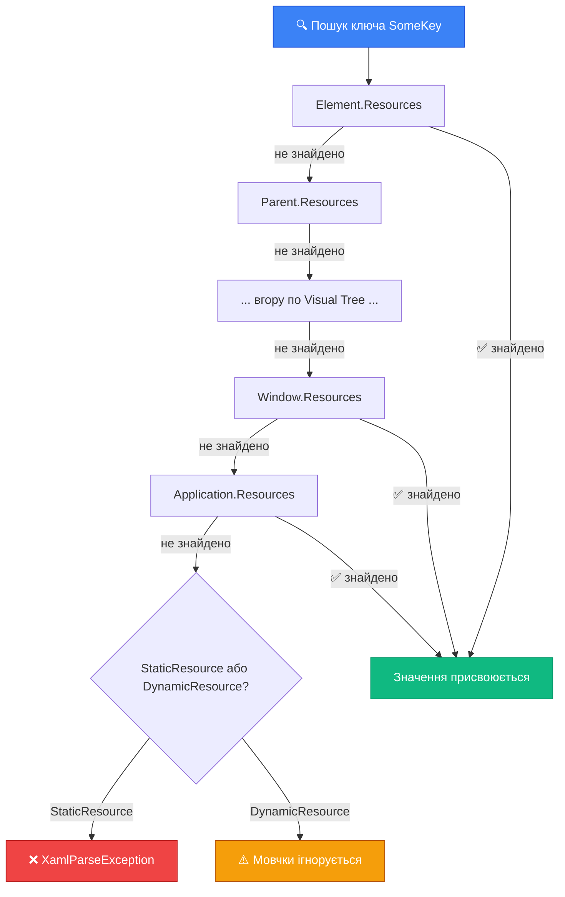

# Простори імен та ресурси XAML

Відкрийте будь-який XAML-файл і подивіться на перші кілька рядків:

```xml
<Window xmlns="http://schemas.microsoft.com/winfx/2006/xaml/presentation"
        xmlns:x="http://schemas.microsoft.com/winfx/2006/xaml"
        xmlns:local="clr-namespace:MyApp"
        x:Class="MyApp.MainWindow"
        Title="Мій застосунок">
```

Ці рядки з `xmlns` є на кожному XAML-файлі, але більшість розробників-початківців сприймають їх як "магічний шаблон, що генерується автоматично" і не читають. Це помилка. Без розуміння просторів імен ви не зможете підключити власні класи до XAML, не зрозумієте звідки беруться контроли, і вам доведеться гуглити кожного разу, коли IDE скаже "Type not found".

::note
**Словник теми:** **xmlns** (XML Namespace) — ідентифікатор простору імен у XML, усуває конфлікти назв тегів. **CLR Namespace** — простір імен C# (наприклад, `MyApp.Models`). **ResourceDictionary** — словник XAML-об'єктів, де ключ — рядок (`x:Key`), значення — довільний об'єкт. **StaticResource** — пошук ресурсу один раз при ініціалізації. **DynamicResource** — реактивна прив'язка до ресурсу, яка оновлюється при зміні. **MergedDictionaries** — об'єднання кількох ResourceDictionary в один.
::

---

## Простори імен XAML: що таке `xmlns`

XML-простір імен (`xmlns` від XML Namespace) — це механізм, що вирішує просту задачу: **уникнути конфліктів назв тегів**.

Уявіть: і WPF, і якась стороння бібліотека мають клас `Button`. Як XAML-парсер зрозуміє, який `<Button>` ви маєте на увазі? Через простори імен — prefix перед тегом вказує, з якого namespace береться клас.

У WPF XAML-файлі є два обов'язкових простори імен, і обидва відіграють різну роль.

### `xmlns` — простір імен WPF-контролів

```xml
xmlns="http://schemas.microsoft.com/winfx/2006/xaml/presentation"
```

Це **default namespace** — для нього не потрібен prefix. Тому ви пишете просто `<Button>`, а не `<wpf:Button>`. Цей URL виглядає як веб-адреса, але насправді нічого не завантажує з інтернету. Це лише **унікальний ідентифікатор-рядок**, що зареєстрований у WPF SDK.

Що саме він маппує? Десятки CLR-namespace'ів одночасно. Коли WPF SDK встановлюється — у сборці `PresentationFramework.dll` є атрибути рівня assembly, що реєструють цей маппінг:

```csharp
// В PresentationFramework.dll (спрощено)
[assembly: XmlnsDefinition(
    "http://schemas.microsoft.com/winfx/2006/xaml/presentation",
    "System.Windows.Controls")]

[assembly: XmlnsDefinition(
    "http://schemas.microsoft.com/winfx/2006/xaml/presentation",
    "System.Windows")]

[assembly: XmlnsDefinition(
    "http://schemas.microsoft.com/winfx/2006/xaml/presentation",
    "System.Windows.Shapes")]

[assembly: XmlnsDefinition(
    "http://schemas.microsoft.com/winfx/2006/xaml/presentation",
    "System.Windows.Media")]

// ... і ще десятки інших namespace'ів
```

Тобто один `xmlns` URL охоплює `Button` (з `System.Windows.Controls`), `Grid` (з `System.Windows.Controls`), `Window` (з `System.Windows`), `Rectangle` (з `System.Windows.Shapes`), `SolidColorBrush` (з `System.Windows.Media`) — і це все без жодного prefix'а.

### `xmlns:x` — директиви XAML

```xml
xmlns:x="http://schemas.microsoft.com/winfx/2006/xaml"
```

Prefix `x:` дає доступ до **XAML-директив** — спеціальних конструкцій, що керують самим парсером, а не об'єктами WPF. Ви вже знаєте кілька:

| Директива | Значення |
|-----------|----------|
| `x:Class` | Прив'язує XAML до C#-класу |
| `x:Name` | Генерує поле у `*.g.cs` |
| `x:Key` | Ключ у ResourceDictionary |
| `x:Type` | Посилання на тип (`typeof(Button)` у XAML) |
| `x:Null` | Значення `null` у XAML |
| `x:Static` | Посилання на static-поле/властивість |
| `x:Array` | Масив значень |

Ці директиви не є WPF-об'єктами — вони інструкції для XAML-парсера. Саме тому вони живуть у окремому namespace'і.

### `xmlns:d` та `xmlns:mc` — design-time namespaces

Часто у згенерованому XAML є ще:

```xml
xmlns:d="http://schemas.microsoft.com/expression/blend/2008"
xmlns:mc="http://schemas.openxmlformats.org/markup-compatibility/2006"
mc:Ignorable="d"
```

`xmlns:d` — namespace для **design-time атрибутів**: `d:DesignWidth`, `d:DesignHeight`, `d:DataContext`. Ці атрибути читає тільки дизайнер (Visual Studio Designer, Blend), при реальному запуску вони ігноруються.

`mc:Ignorable="d"` саме і означає: "Ігноруй все з prefix'ом `d:` при реальному виконанні". Це дозволяє задавати розміри і фіктивні дані тільки для дизайнера, не впливаючи на runtime.

```xml
<Window ...
        mc:Ignorable="d"
        d:DesignWidth="800"       <!-- Ширина у дизайнері, ігнорується при запуску -->
        d:DesignHeight="600"      <!-- Висота у дизайнері, ігнорується при запуску -->
        d:DataContext="{d:DesignInstance local:MainViewModel}">
        <!-- Фіктивний DataContext для preview дизайнера -->
```

---

## Підключення власних класів до XAML

Найчастіша потреба — використати у XAML власний C#-клас. Наприклад, конвертер, ViewModel, кастомний контрол або навіть просто клас зі статичними константами.

### Синтаксис: `clr-namespace`

```xml
xmlns:local="clr-namespace:MyApp"
xmlns:models="clr-namespace:MyApp.Models"
xmlns:converters="clr-namespace:MyApp.Converters"
xmlns:controls="clr-namespace:MyApp.Controls"
```

Після цього ви можете використовувати будь-який `public` клас з цього namespace напряму в XAML:

```xml
<!-- converters:BoolToVisibilityConverter — це клас з MyApp.Converters -->
<Window.Resources>
    <converters:BoolToVisibilityConverter x:Key="BoolToVisibility"/>
</Window.Resources>

<!-- controls:UserCard — це кастомний UserControl з MyApp.Controls -->
<controls:UserCard Name="Іванко" Age="25"/>
```

### Підключення класів з іншої збірки

Якщо клас знаходиться в окремій DLL (наприклад, NuGet-пакет або окремий проєкт у Solution), треба вказати `assembly`:

```xml
<!-- Клас з іншої збірки -->
xmlns:ext="clr-namespace:SomeLibrary.Extensions;assembly=SomeLibrary"

<!-- Якщо збірка підключена через PackageReference — можна опустити assembly= -->
xmlns:material="clr-namespace:MaterialDesignThemes.Wpf;assembly=MaterialDesignThemes.Wpf"
```

Після цього — використовуєте як звичайно:

```xml
<material:Card Padding="16" UniformCornerRadius="8">
    <TextBlock Text="Матеріал дизайн картка"/>
</material:Card>
```

::tip
Prefix `local` — це лише конвенція, та сама що Rider і Visual Studio додають за замовчуванням. Ви можете назвати prefix будь-яким словом: `xmlns:myapp`, `xmlns:ctrl`, `xmlns:vm` — головне, щоб він не конфліктував з іншими prefix'ами у файлі.
::

### Приклад: клас із статичними константами

Один зручний патерн — тримати константи (кольори, рядки, числа) у статичному C#-класі та посилатися на них з XAML через `x:Static`:

```csharp
// AppConstants.cs
namespace MyApp;

public static class AppConstants
{
    public const string AppName = "Мій застосунок";
    public const double DefaultFontSize = 14.0;
    public static readonly string Version = "1.0.0";
}
```

```xml
<Window xmlns:app="clr-namespace:MyApp" ...>
    <StackPanel>
        <!-- x:Static звертається до static-поля/константи -->
        <TextBlock Text="{x:Static app:AppConstants.AppName}"
                   FontSize="{x:Static app:AppConstants.DefaultFontSize}"/>
    </StackPanel>
</Window>
```

`x:Static` — XAML-директива, що читає значення статичної властивості або поля під час ініціалізації. Зміни після ініціалізації не відстежуються.

---

## ResourceDictionary: спільні ресурси для UI

Уявіть звичайну ситуацію: у вас є десять кнопок, і у всіх має бути однаковий синій колір фону `#2563eb`. Зараз ви пишете:

```xml
<Button Background="#2563eb" .../>
<Button Background="#2563eb" .../>
<!-- ... ще 8 кнопок ... -->
```

Дизайнер змінює рішення: "Зробіть синій трошки темнішим, `#1d4ed8`". Вам треба знайти і замінити 10 місць вручну. Забудете одне — маєте баг. Це апостроф технічного боргу, що накопичується з кожною зміною.

**ResourceDictionary** вирішує цю проблему: визначте ресурс один раз і посилайтеся на нього скрізь. Зміна в одному місці — оновлюється скрізь автоматично.

### Оголошення ресурсів через `x:Key`

Ресурси оголошуються в секції `<FrameworkElement.Resources>`. Кожен ресурс отримує ключ через атрибут `x:Key`:

```xml
<Window ...>
    <Window.Resources>
        <!-- Brush-ресурс -->
        <SolidColorBrush x:Key="PrimaryBrush" Color="#2563eb"/>
        <SolidColorBrush x:Key="DangerBrush" Color="#dc2626"/>
        <SolidColorBrush x:Key="SuccessBrush" Color="#16a34a"/>

        <!-- Числовий ресурс -->
        <sys:Double x:Key="DefaultFontSize">14</sys:Double>

        <!-- Рядковий ресурс -->
        <sys:String x:Key="AppTitle">Мій застосунок</sys:String>

        <!-- Thickness-ресурс -->
        <Thickness x:Key="CardPadding">16,12,16,12</Thickness>
    </Window.Resources>

    <StackPanel Margin="20">
        <TextBlock Text="{StaticResource AppTitle}" FontSize="20"/>
        <Button Background="{StaticResource PrimaryBrush}" Content="Підтвердити"/>
        <Button Background="{StaticResource DangerBrush}" Content="Видалити"/>
    </StackPanel>
</Window>
```

Де `xmlns:sys="clr-namespace:System;assembly=mscorlib"` треба додати у декларацію Window для використання `sys:Double` та `sys:String`.

::note
Тип ресурсу не обмежений нічим — у ResourceDictionary можна зберігати будь-який об'єкт: `Brush`, `Style`, `ControlTemplate`, `DataTemplate`, `Geometry`, власні класи. Все що XAML може інстанціювати — можна зберегти як ресурс.
::

### Рівні ресурсів: де декларувати

ResourceDictionary є у кожного `FrameworkElement`. Де ви оголошуєте ресурс — визначає, хто до нього матиме доступ:

```xml
<!-- Ресурси конкретного елемента: доступні тільки йому та нащадкам -->
<StackPanel>
    <StackPanel.Resources>
        <SolidColorBrush x:Key="LocalBrush" Color="Coral"/>
    </StackPanel.Resources>
    <!-- LocalBrush доступний тут -->
    <Button Background="{StaticResource LocalBrush}"/>
</StackPanel>
<!-- LocalBrush НЕ доступний тут — поза StackPanel -->

<!-- Ресурси вікна: доступні всьому у цьому вікні -->
<Window.Resources>
    <SolidColorBrush x:Key="WindowBrush" Color="SteelBlue"/>
</Window.Resources>

<!-- Ресурси застосунку: доступні у ВСІХ вікнах -->
<!-- App.xaml -->
<Application.Resources>
    <SolidColorBrush x:Key="AppBrush" Color="DarkSlateBlue"/>
</Application.Resources>
```

---

## StaticResource vs DynamicResource

Ось одне з питань, де частіше за все плутаються. Обидва є **Markup Extension** (їх видно через фігурні дужки `{...}`), обидва звертаються до ResourceDictionary. Але механізм принципово різний.

### StaticResource: одноразовий пошук

`StaticResource` шукає ресурс **один раз** — під час парсингу XAML при запуску застосунку. Знайдений об'єкт присвоюється властивості та більше не оновлюється.

```xml
<Button Background="{StaticResource PrimaryBrush}"/>
```

Що відбувається під капотом:
1. При ініціалізації вікна XAML-парсер зустрічає `{StaticResource PrimaryBrush}`
2. Шукає ресурс з ключем `"PrimaryBrush"` у ланцюжку (елемент → батько → ... → Window → Application)
3. Знаходить об'єкт `SolidColorBrush` і присвоює його у `Background`
4. Більше до словника не звертається — навіть якщо ресурс зміниться

**Переваги**: Швидше. Ніяких підписок на зміни. Менше пам'яті.

**Недолік**: Якщо ресурс зміниться після ініціалізації — UI не оновиться.

**Що буде, якщо ресурс не знайдено**: `XamlParseException` при завантаженні — одразу видно проблему.

### DynamicResource: реактивне посилання

`DynamicResource` створює **підписку**: якщо ресурс у словнику зміниться — властивість оновиться автоматично.

```xml
<Button Background="{DynamicResource PrimaryBrush}"/>
```

Що відбувається під капотом:
1. При ініціалізації — знаходить ресурс і присвоює значення (так само як Static)
2. Додатково: підписується на зміни в ResourceDictionary
3. Якщо ресурс `"PrimaryBrush"` буде замінений у runtime — `Background` оновиться автоматично

Це ключова можливість для **перемикання тем**. Щоб увімкнути темну тему — достатньо замінити ресурси у словнику:

```csharp
// C#: Переключення теми через зміну ресурсів
private void SwitchToDarkTheme()
{
    Application.Current.Resources["PrimaryBrush"] =
        new SolidColorBrush(Color.FromRgb(30, 30, 30));

    Application.Current.Resources["TextBrush"] =
        new SolidColorBrush(Colors.White);
}
```

Всі елементи, що використовують `{DynamicResource PrimaryBrush}` — миттєво оновляться з новим кольором. Без перезапуску. Без ручного обходу елементів.

**Недолік**: Трохи повільніше за StaticResource через механізм підписок. Якщо ресурс не знайдено при першій ініціалізації — мовчки ігнорується (без помилок).

### Коли що обирати

| Ситуація | Рекомендація |
|----------|:---:|
| Константи (кольори, відступи, що не змінюються) | `StaticResource` |
| Стилі та шаблони (як правило, незмінні) | `StaticResource` |
| Ресурси для перемикання тем | `DynamicResource` |
| Ресурси, що можуть змінюватися при роботі | `DynamicResource` |
| Системні ресурси (`SystemColors`, `SystemFonts`) | `DynamicResource` (змінюються при зміні теми ОС) |

::wpf-preview{title="StaticResource: палітра кольорів з ресурсів"}

```xml
<StackPanel Margin="20" Spacing="10">
    <StackPanel.Resources>
        <SolidColorBrush x:Key="PrimaryBrush" Color="#2563eb"/>
        <SolidColorBrush x:Key="SuccessBrush" Color="#16a34a"/>
        <SolidColorBrush x:Key="DangerBrush"  Color="#dc2626"/>
        <SolidColorBrush x:Key="WarnBrush"    Color="#d97706"/>
    </StackPanel.Resources>

    <TextBlock Text="Кнопки з ресурсів палітри"
               FontSize="16" FontWeight="Bold"/>

    <StackPanel Orientation="Horizontal" Spacing="8">
        <Button Content="Підтвердити" Background="{StaticResource SuccessBrush}" Foreground="White" Padding="12,6"/>
        <Button Content="Скасувати"   Background="{StaticResource DangerBrush}"  Foreground="White" Padding="12,6"/>
        <Button Content="Зберегти"    Background="{StaticResource PrimaryBrush}" Foreground="White" Padding="12,6"/>
        <Button Content="Попередження" Background="{StaticResource WarnBrush}"   Foreground="White" Padding="12,6"/>
    </StackPanel>
</StackPanel>
```

::

---

## Ланцюжок пошуку ресурсів

Коли XAML зустрічає `{StaticResource SomeKey}` або `{DynamicResource SomeKey}` — він шукає ресурс не лише в одному місці. Пошук відбувається по **ланцюжку вгору** по дереву елементів і зупиняється на першому знайденому.

::mermaid



::

### Локальне перевизначення ресурсів

Ланцюжок зупиняється на першому знайденому ключі. Тому ресурс у нащадку "перекриє" глобальний з таким самим ім'ям:

```xml
<!-- App.xaml: глобальний синій акцент -->
<Application.Resources>
    <SolidColorBrush x:Key="AccentBrush" Color="#2563eb"/>
</Application.Resources>

<Window ...>
    <StackPanel>
        <!-- Ця кнопка — синя (глобальний AccentBrush) -->
        <Button Background="{StaticResource AccentBrush}" Content="Синя"/>

        <StackPanel>
            <StackPanel.Resources>
                <!-- Локальне перевизначення: тут AccentBrush — зелений -->
                <SolidColorBrush x:Key="AccentBrush" Color="#16a34a"/>
            </StackPanel.Resources>
            <!-- Тут знайде локальний зелений першим -->
            <Button Background="{StaticResource AccentBrush}" Content="Зелена"/>
        </StackPanel>

        <!-- Знову синя — поза локальним StackPanel -->
        <Button Background="{StaticResource AccentBrush}" Content="Знову синя"/>
    </StackPanel>
</Window>
```

---

## Зовнішні ResourceDictionary та MergedDictionaries

У реальних проєктах ресурси не тримають усередині `MainWindow.xaml` — їх виносять у окремі XAML-файли і підключають там, де потрібно.

### Файл зовнішнього словника

Файл `Resources/Colors.xaml` — це самостійний XAML з `ResourceDictionary` як коренем (без `Window`, без `UserControl`):

```xml
<!-- Resources/Colors.xaml -->
<ResourceDictionary xmlns="http://schemas.microsoft.com/winfx/2006/xaml/presentation"
                    xmlns:x="http://schemas.microsoft.com/winfx/2006/xaml">

    <SolidColorBrush x:Key="PrimaryBrush"   Color="#2563eb"/>
    <SolidColorBrush x:Key="SecondaryBrush" Color="#7c3aed"/>
    <SolidColorBrush x:Key="SuccessBrush"   Color="#16a34a"/>
    <SolidColorBrush x:Key="DangerBrush"    Color="#dc2626"/>

</ResourceDictionary>
```

### Підключення через `MergedDictionaries` у `App.xaml`

```xml
<!-- App.xaml -->
<Application ...>
    <Application.Resources>
        <ResourceDictionary>
            <ResourceDictionary.MergedDictionaries>
                <ResourceDictionary Source="Resources/Colors.xaml"/>
                <ResourceDictionary Source="Resources/Typography.xaml"/>
                <ResourceDictionary Source="Resources/Spacing.xaml"/>
            </ResourceDictionary.MergedDictionaries>
        </ResourceDictionary>
    </Application.Resources>
</Application>
```

Ресурси з усіх підключених файлів стають доступними у всіх вікнах застосунку.

### Організація за принципом "один файл — одна відповідальність"

```
Resources/
├── Colors.xaml       ← Кольорова палітра
├── Typography.xaml   ← Розміри та ваги шрифтів
├── Spacing.xaml      ← Margin/Padding константи (Thickness)
├── Styles.xaml       ← Стилі контролів (буде детально у Блоці 8)
└── Templates.xaml    ← DataTemplate / ControlTemplate
```

::tip
Цей підхід аналогічний CSS Design Tokens або Tailwind CSS config: єдине місце для всіх "магічних значень" інтерфейсу. Зміна у файлі `Colors.xaml` автоматично поширюється на весь UI — жодного пошуку-заміни по файлам.
::

---

## Підсумок

::card-group

::card{title="XAML Namespaces" icon="i-heroicons-globe-alt"}

- `xmlns` → default namespace, WPF-контроли без prefix'а
- `xmlns:x` → XAML-директиви: `x:Class`, `x:Name`, `x:Key`
- `xmlns:local="clr-namespace:MyApp"` → власні класи у XAML
- `xmlns:d`, `mc:Ignorable="d"` → атрибути лише для design-time

::

::card{title="ResourceDictionary" icon="i-heroicons-archive-box"}

- Ресурс = будь-який об'єкт з ключем `x:Key`
- Рівні доступу: Element → Window → Application → System
- Ресурс у нащадку перекриває той самий ключ з батька
- Зберігаємо: Brush, Color, Double, String, Thickness, Style...

::

::card{title="Static vs Dynamic" icon="i-heroicons-arrows-right-left"}

- `StaticResource` — one-shot при старті, швидко, кидає виняток без ключа
- `DynamicResource` — підписка, для тем, мовчить якщо ресурс відсутній
- Незмінні константи → `StaticResource`
- Теми та дані що змінюються → `DynamicResource`

::

::card{title="MergedDictionaries" icon="i-heroicons-document-duplicate"}

- Виносити ресурси у `Resources/*.xaml` з окремими файлами
- Підключати в `App.xaml` — доступно у всіх вікнах
- Один файл = одна відповідальність (кольори окремо, шрифти окремо)
- Для тем: замінити словник у `MergedDictionaries[0]` за кнопкою

::

::

---

## Практичні завдання

::accordion

::accordion-item{label="🟢 Рівень 1: Палітра кольорів у Window.Resources" icon="i-lucide-circle-help"}

**Завдання**: Створіть WPF-застосунок з власною палітрою кольорів у `Window.Resources` та використайте ресурси на кількох контролах.

**Вимоги**:
1. У `Window.Resources` оголосіть 4 `SolidColorBrush`: `PrimaryBrush`, `SecondaryBrush`, `SuccessBrush`, `DangerBrush`
2. Створіть `StackPanel` із 4 кнопками — кожна з іншим `Background` через `{StaticResource ...}`
3. Заголовок (`TextBlock`) з `Foreground` також через `StaticResource`

**Перевірка**: Змініть `Color` у `PrimaryBrush` в одному місці (Resources) — зміниться у всіх елементах що його використовують.

**Що треба знати**: `Window.Resources`, `SolidColorBrush`, `x:Key`, `{StaticResource}`.

::

::accordion-item{label="🟡 Рівень 2: Перемикач Light/Dark теми через DynamicResource" icon="i-lucide-circle-help"}

**Завдання**: Реалізуйте перемикач теми у runtime через `DynamicResource`.

**Кроки**:
1. У `Application.Resources` (App.xaml) оголосіть `AppBackground`, `AppForeground`, `AppAccent` — початкові значення для світлої теми
2. Прив'яжіть `Window.Background`, кілька `TextBlock.Foreground` та `Button.Background` через `{DynamicResource ...}`
3. Кнопки "Світла" / "Темна" у code-behind замінюють ресурси:

```csharp
Application.Current.Resources["AppBackground"] =
    new SolidColorBrush(Color.FromRgb(18, 18, 18));
```

**Перевірка**: Натискання миттєво перефарбовує увесь UI без перезапуску застосунку.

::

::accordion-item{label="🔴 Рівень 3: MergedDictionaries та багатовіконний застосунок" icon="i-lucide-circle-help"}

**Завдання**: Організуйте ресурси у проєкті з двома вікнами та зовнішніми словниками.

1. Створіть три зовнішніх файли: `Resources/Colors.xaml`, `Resources/Typography.xaml`, `Resources/Spacing.xaml`
2. Підключіть усі три через `MergedDictionaries` у `App.xaml`
3. Створіть `MainWindow` та `SettingsWindow` — обидва використовують ресурси з зовнішніх файлів
4. **Додатково**: Додайте `Resources/DarkTheme.xaml` з тими ж ключами але темними значеннями. Кнопка перемикання теми замінює перший словник у `MergedDictionaries`:

```csharp
var dark = new ResourceDictionary
{
    Source = new Uri("Resources/DarkTheme.xaml", UriKind.Relative)
};
Application.Current.Resources.MergedDictionaries[0] = dark;
```

**Що треба знати**: `ResourceDictionary Source=`, `MergedDictionaries`, `Application.Current.Resources.MergedDictionaries`, показ другого вікна через `new SettingsWindow().Show()`.

::

::

