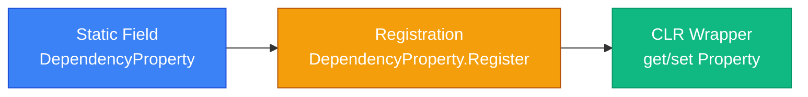
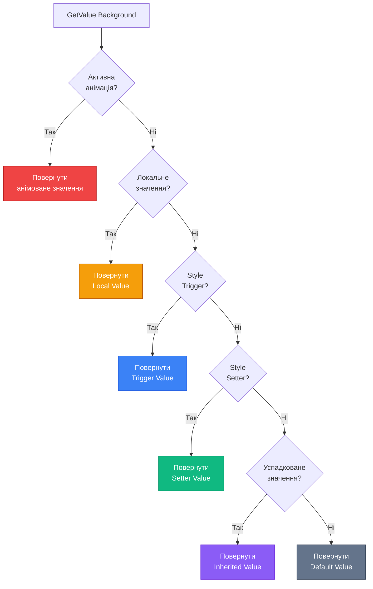

# Dependency Properties: Концепція та Value Resolution

## Вступ

Уявіть собі кнопку у вашому WPF-застосунку. Її колір фону (`Background`) може бути заданий у кількох місцях одночасно:

- У **стилі** додатку (синій колір для всіх кнопок)
- У **темі** операційної системи (сірий за замовчуванням)
- **Локально** у XAML (`Background="Red"`)
- Через **анімацію** (плавна зміна кольору при наведенні)
- Через **прив'язку даних** (`{Binding UserPreferredColor}`)

Яке значення "виграє"? Як WPF вирішує цей конфлікт? Чому `Button.Background` — це не просто звичайна C#-властивість з getter/setter?

Відповідь криється у **Dependency Property System** — одній з найважливіших архітектурних особливостей WPF. Це система, що робить можливими прив'язку даних, стилізацію, анімації та успадкування значень по дереву елементів.

::note
**Для кого ця стаття?** Якщо ви вже знайомі з базовими контролами WPF, XAML-синтаксисом та створювали прості інтерфейси — ця стаття відкриє вам "внутрішню кухню" платформи. Розуміння DependencyProperty критично важливе для просунутої роботи з WPF.
::

---

## Проблема: Чому CLR-властивості недостатньо?

Перш ніж зануритися у DependencyProperty, розберемося, чому звичайні C#-властивості (CLR properties) не підходять для UI-фреймворку.

### Обмеження CLR-властивостей

Розглянемо типову CLR-властивість:

```csharp
public class SimpleButton
{
    private Brush _background = Brushes.Gray;
    
    public Brush Background
    {
        get => _background;
        set => _background = value;
    }
}
```

Що не так з цим підходом у контексті UI?

::card-group

::card{title="❌ Немає прив'язки даних" icon="i-lucide-link-2-off"}
Setter не може автоматично повідомити UI про зміну значення. Потрібна ручна реалізація `INotifyPropertyChanged` для кожної властивості.
::

::card{title="❌ Немає стилізації" icon="i-lucide-palette"}
Неможливо задати значення через Style — setter перезапише будь-яке зовнішнє значення.
::

::card{title="❌ Немає анімацій" icon="i-lucide-film"}
Анімаційний движок не може "втрутитися" у процес зміни значення — він не знає, коли і як оновлювати властивість.
::

::card{title="❌ Немає успадкування" icon="i-lucide-git-branch"}
Значення `FontSize`, задане на `Window`, не може автоматично "стекти" до всіх дочірніх елементів.
::

::card{title="❌ Неефективне зберігання" icon="i-lucide-database"}
Кожен контрол має ~100 властивостей. Якщо зберігати кожну як поле — це 100 полів × тисячі контролів = гігантська витрата пам'яті, навіть якщо більшість властивостей мають значення за замовчуванням.
::

::

### Реальний приклад проблеми

Припустимо, ми хочемо створити систему тем для додатку:

```csharp
// ❌ Неправильний підхід з CLR-властивостями
public class ThemedButton
{
    private Brush _background;
    
    public Brush Background
    {
        get => _background ?? ThemeManager.Current.ButtonBackground; // Fallback до теми
        set => _background = value;
    }
}
```

Проблеми цього коду:

1. **Жорстка прив'язка до ThemeManager** — порушення принципу інверсії залежностей
2. **Немає пріоритетів** — якщо задати локальне значення, тема ігнорується назавжди
3. **Немає реакції на зміну теми** — якщо `ThemeManager.Current` змінився, кнопка не оновиться
4. **Дублювання логіки** — цей код треба повторити для кожної властивості кожного контролу

::warning
У реальному WPF-проєкті може бути **тисячі контролів** і **сотні властивостей**. Ручне управління пріоритетами, fallback-значеннями та сповіщеннями про зміни перетворилося б на кошмар підтримки.
::

---

## Рішення: Dependency Property System

WPF вирішує всі ці проблеми через **централізовану систему властивостей**, де:

- Значення зберігаються не у полях класу, а у **спеціальному сховищі** (`EffectiveValueEntry[]`)
- Кожна властивість має **метадані** (default value, callbacks, прапорці поведінки)
- Система автоматично вирішує **конфлікти** між різними джерелами значень
- Підтримується **успадкування** значень по Logical Tree
- Вбудована інтеграція з **Binding Engine**, **Animation System** та **Style System**

### Анатомія Dependency Property

Dependency Property складається з трьох частин:

::mermaid

::

Розглянемо реальний приклад з WPF:

```csharp
public class Button : ButtonBase
{
    // 1️⃣ Статичне поле — ідентифікатор властивості
    public static readonly DependencyProperty BackgroundProperty =
        DependencyProperty.Register(
            name: "Background",              // Назва властивості
            propertyType: typeof(Brush),     // Тип значення
            ownerType: typeof(Button),       // Клас-власник
            typeMetadata: new FrameworkPropertyMetadata(
                defaultValue: null,          // Значення за замовчуванням
                flags: FrameworkPropertyMetadataOptions.AffectsRender
            )
        );
    
    // 2️⃣ CLR-обгортка для зручності
    public Brush Background
    {
        get => (Brush)GetValue(BackgroundProperty);
        set => SetValue(BackgroundProperty, value);
    }
}
```

::tip
**Naming Convention:** Статичне поле завжди називається `{PropertyName}Property`. Це дозволяє легко знаходити DependencyProperty через рефлексію та забезпечує консистентність API.
::

### Чому "Dependency"?

Назва "Dependency Property" означає, що **значення властивості залежить від багатьох джерел**. WPF автоматично визначає, яке джерело має найвищий пріоритет, і повертає відповідне значення.

```csharp
// Коли ви пишете:
myButton.Background = Brushes.Red;

// Насправді відбувається:
myButton.SetValue(Button.BackgroundProperty, Brushes.Red);

// А коли читаєте:
var color = myButton.Background;

// WPF виконує складну логіку:
// 1. Перевіряє, чи є активна анімація
// 2. Перевіряє локальне значення
// 3. Перевіряє Style Triggers
// 4. Перевіряє Style Setters
// 5. Перевіряє успадковане значення
// 6. Повертає default value
```

---

## Value Resolution: Система пріоритетів

Коли WPF потрібно отримати значення Dependency Property, він проходить через **ланцюжок пріоритетів** (Property Value Precedence). Це впорядкований список джерел значень — від найвищого пріоритету до найнижчого.

### Таблиця пріоритетів

::note
**Важливо:** Чим вище у таблиці — тим вищий пріоритет. Якщо знайдено значення на певному рівні, нижчі рівні ігноруються.
::

| Пріоритет | Джерело                     | Опис                                                                 | Приклад                                    |
| --------- | --------------------------- | -------------------------------------------------------------------- | ------------------------------------------ |
| **1**     | Animation (Active)          | Активна анімація змінює значення                                     | `DoubleAnimation` для `Opacity`            |
| **2**     | Local Value                 | Значення, задане напряму через код або XAML                          | `Background="Red"` або `SetValue()`        |
| **3**     | Style Triggers              | Тригери у стилі елемента                                             | `<Trigger Property="IsMouseOver">`         |
| **4**     | Template Triggers           | Тригери у ControlTemplate                                            | Зміна кольору кнопки при натисканні        |
| **5**     | Style Setters               | Setter'и у стилі елемента                                            | `<Setter Property="Background">`           |
| **6**     | Theme Style                 | Стиль з теми WPF (Aero, Luna)                                        | Стандартний вигляд `Button`                |
| **7**     | Property Value Inheritance  | Успадковане значення від батьківського елемента                      | `FontSize` від `Window` до `TextBlock`     |
| **8**     | Default Value               | Значення з `PropertyMetadata.DefaultValue`                           | `null` для `Background`                    |

### Візуалізація процесу

::mermaid

::

---

## Практичні приклади Value Resolution

Розберемо кілька реальних сценаріїв, щоб зрозуміти, як працює система пріоритетів.

### Приклад 1: Конфлікт Style vs Local Value

```xml
<Window.Resources>
    <Style TargetType="Button">
        <Setter Property="Background" Value="Blue"/>
        <Setter Property="Foreground" Value="White"/>
    </Style>
</Window.Resources>

<StackPanel Margin="20">
    <Button Content="Кнопка 1"/>
    <Button Content="Кнопка 2" Background="Red"/>
</StackPanel>
```

**Що відбувається:**

- **Кнопка 1**: Немає локального значення → використовується Style Setter → `Background = Blue`
- **Кнопка 2**: Є локальне значення `Background="Red"` → воно має вищий пріоритет → `Background = Red`

::wpf-preview{title="Style vs Local Value"}
```xml
<StackPanel Margin="20" Spacing="10">
  <Button Content="Кнопка зі стилем (синя)"/>
  <Button Content="Кнопка з локальним значенням (червона)" Background="Red"/>
</StackPanel>
```
::

::tip
**Ключовий момент:** Локальне значення завжди "перемагає" стиль. Це дозволяє перевизначати стилі для окремих елементів без створення нових стилів.
::

### Приклад 2: ClearValue() — скидання локального значення

Що робити, якщо ми хочемо повернутися до стилю після встановлення локального значення?

```csharp
// Встановлюємо локальне значення
myButton.Background = Brushes.Red;

// Тепер Background = Red (Local Value, пріоритет 2)

// Скидаємо локальне значення
myButton.ClearValue(Button.BackgroundProperty);

// Тепер Background = Blue (Style Setter, пріоритет 5)
```

::note
`ClearValue()` **не встановлює** значення у `null`. Він видаляє локальне значення зі сховища, дозволяючи системі пріоритетів "провалитися" на наступний рівень (Style, Theme, Default).
::

### Приклад 3: Property Value Inheritance

Деякі властивості автоматично "стікають" по дереву елементів від батька до дітей. Це називається **Property Value Inheritance**.

```xml
<Window FontSize="16" FontFamily="Segoe UI">
    <StackPanel>
        <TextBlock Text="Цей текст успадковує FontSize=16"/>
        <TextBlock Text="І цей теж" FontWeight="Bold"/>
        <Button Content="Кнопка теж успадковує шрифт"/>
    </StackPanel>
</Window>
```

**Які властивості підтримують Inheritance?**

| Властивість       | Успадковується? | Чому?                                                      |
| ----------------- | --------------- | ---------------------------------------------------------- |
| `FontSize`        | ✅ Так          | Логічно, щоб весь текст у вікні мав однаковий розмір       |
| `FontFamily`      | ✅ Так          | Консистентність типографіки                                |
| `Foreground`      | ✅ Так          | Колір тексту має бути єдиним для всього інтерфейсу         |
| `Background`      | ❌ Ні           | Кожен контрол має свій фон                                 |
| `Width` / `Height`| ❌ Ні           | Розміри індивідуальні для кожного елемента                 |

::wpf-preview{title="Property Value Inheritance"}
```xml
<StackPanel Margin="20" Spacing="10" FontSize="18" Foreground="DarkBlue">
  <TextBlock Text="Успадкований FontSize=18 та Foreground=DarkBlue"/>
  <TextBlock Text="Теж успадкований" FontWeight="Bold"/>
  <Button Content="Кнопка з успадкованим шрифтом"/>
</StackPanel>
```
::

::tip
**Оптимізація пам'яті:** Inheritance дозволяє не зберігати `FontSize` у кожному `TextBlock` окремо. Якщо значення не задане локально — WPF піднімається по дереву до батька, потім до батька батька, і так далі, поки не знайде значення або не досягне кореня.
::

---

## Як це працює під капотом?

Розберемо внутрішню реалізацію Dependency Property System (спрощено).

### Сховище значень: EffectiveValueEntry

Кожен `DependencyObject` (базовий клас для всіх UI-елементів) містить масив `EffectiveValueEntry[]`:

```csharp
public class DependencyObject
{
    // Спрощена версія
    private EffectiveValueEntry[] _effectiveValues;
    
    public object GetValue(DependencyProperty dp)
    {
        // 1. Знайти entry для цієї властивості
        int index = dp.GlobalIndex;
        EffectiveValueEntry entry = _effectiveValues[index];
        
        // 2. Якщо є локальне значення — повернути його
        if (entry.HasLocalValue)
            return entry.LocalValue;
        
        // 3. Якщо є Style Setter — повернути його
        if (entry.HasStyleValue)
            return entry.StyleValue;
        
        // 4. Перевірити Inheritance
        if (dp.IsInherited)
        {
            DependencyObject parent = GetParent();
            if (parent != null)
                return parent.GetValue(dp);
        }
        
        // 5. Повернути Default Value
        return dp.DefaultMetadata.DefaultValue;
    }
}
```

::note
**Реальна реалізація** значно складніша — вона враховує анімації, coercion, validation, thread-safety та багато інших аспектів. Але основна ідея залишається тією ж: **централізоване сховище + система пріоритетів**.
::

### Чому це ефективно?

::card-group

::card{title="🚀 Економія пам'яті" icon="i-lucide-hard-drive"}
Якщо властивість має значення за замовчуванням — вона не займає місця у `_effectiveValues`. Масив розширюється динамічно лише для властивостей з non-default значеннями.
::

::card{title="⚡ Швидкий доступ" icon="i-lucide-zap"}
`GlobalIndex` дозволяє отримати значення за O(1) — прямий доступ до масиву без хешування чи пошуку.
::

::card{title="🔄 Автоматична інвалідація" icon="i-lucide-refresh-cw"}
Коли значення змінюється — WPF автоматично повідомляє Binding Engine, Layout System та Rendering Engine. Не потрібно ручних `PropertyChanged` подій.
::

::

---

## Метадані Dependency Property

Кожна Dependency Property має **метадані** (`PropertyMetadata`), що визначають її поведінку.

### FrameworkPropertyMetadata

Найчастіше використовується `FrameworkPropertyMetadata` — розширена версія з прапорцями для WPF:

```csharp
public static readonly DependencyProperty MyProperty =
    DependencyProperty.Register(
        "MyProperty",
        typeof(string),
        typeof(MyControl),
        new FrameworkPropertyMetadata(
            defaultValue: "Default",
            flags: FrameworkPropertyMetadataOptions.AffectsRender |
                   FrameworkPropertyMetadataOptions.AffectsMeasure,
            propertyChangedCallback: OnMyPropertyChanged
        )
    );

private static void OnMyPropertyChanged(DependencyObject d, DependencyPropertyChangedEventArgs e)
{
    var control = (MyControl)d;
    // Реакція на зміну значення
    Console.WriteLine($"MyProperty змінилася: {e.OldValue} → {e.NewValue}");
}
```

### Прапорці метаданих

| Прапорець                  | Опис                                                                 |
| -------------------------- | -------------------------------------------------------------------- |
| `AffectsRender`            | Зміна властивості вимагає перемалювання (re-render)                  |
| `AffectsMeasure`           | Зміна властивості вимагає перерахунку розмірів (measure pass)        |
| `AffectsArrange`           | Зміна властивості вимагає перерахунку позиції (arrange pass)         |
| `AffectsParentMeasure`     | Зміна властивості вимагає перерахунку розмірів батьківського елемента|
| `BindsTwoWayByDefault`     | Binding за замовчуванням має режим `TwoWay` (наприклад, `TextBox.Text`)|
| `Inherits`                 | Властивість підтримує Property Value Inheritance                     |
| `Journal`                  | Значення зберігається в історії навігації                            |

::warning
**Performance tip:** Не використовуйте `AffectsMeasure` без необхідності. Measure pass — дорога операція, що може викликати каскадний перерахунок всього Layout Tree.
::

---

## Практичні завдання

Закріпимо знання через практику.

### Рівень 1: Дослідження Value Precedence

**Завдання:** Створіть WPF-застосунок, що демонструє конфлікт між Style та Local Value.

::steps

### Крок 1: Створіть стиль для кнопок

```xml
<Window.Resources>
    <Style TargetType="Button">
        <Setter Property="Background" Value="LightBlue"/>
        <Setter Property="Padding" Value="10"/>
    </Style>
</Window.Resources>
```

### Крок 2: Додайте кнопки з різними значеннями

```xml
<StackPanel Margin="20">
    <Button Content="Кнопка зі стилем" Margin="0,0,0,10"/>
    <Button Content="Кнопка з локальним значенням" Background="Red" Margin="0,0,0,10"/>
    <Button x:Name="DynamicButton" Content="Кнопка для експериментів"/>
</StackPanel>
```

### Крок 3: Експериментуйте з ClearValue()

```csharp
// У code-behind
private void Window_Loaded(object sender, RoutedEventArgs e)
{
    // Встановлюємо локальне значення
    DynamicButton.Background = Brushes.Green;
    
    // Через 2 секунди скидаємо його
    Task.Delay(2000).ContinueWith(_ =>
    {
        Dispatcher.Invoke(() =>
        {
            DynamicButton.ClearValue(Button.BackgroundProperty);
        });
    });
}
```

::

**Очікуваний результат:** Кнопка спочатку зелена, потім стає світло-синьою (повертається до стилю).

---

### Рівень 2: Дослідження Inheritance

**Завдання:** Визначте, які властивості підтримують Property Value Inheritance.

::steps

### Крок 1: Створіть тестове вікно

```xml
<Window x:Class="InheritanceTest.MainWindow"
        FontSize="20"
        FontFamily="Arial"
        Foreground="DarkGreen"
        Background="LightYellow">
    <StackPanel Margin="20">
        <TextBlock Text="Текст 1"/>
        <TextBlock Text="Текст 2" FontSize="14"/>
        <Button Content="Кнопка"/>
        <Border BorderBrush="Black" BorderThickness="1" Padding="10">
            <TextBlock Text="Текст у Border"/>
        </Border>
    </StackPanel>
</Window>
```

### Крок 2: Запустіть та проаналізуйте

Відповідайте на питання:

- Чи успадковується `FontSize` у `TextBlock`?
- Чи успадковується `Background` у `StackPanel`?
- Чи успадковується `Foreground` у `Button.Content`?

### Крок 3: Перевірте через код

```csharp
private void Window_Loaded(object sender, RoutedEventArgs e)
{
    var textBlock = (TextBlock)((StackPanel)Content).Children[0];
    
    // Отримуємо джерело значення
    var valueSource = DependencyPropertyHelper.GetValueSource(textBlock, TextBlock.FontSizeProperty);
    
    Console.WriteLine($"FontSize джерело: {valueSource.BaseValueSource}");
    // Очікуваний вивід: Inherited
}
```

::

---

### Рівень 3: Візуалізація пріоритетів

**Завдання:** Створіть інтерактивний демонстратор системи пріоритетів.

**Вимоги:**

- Кнопка з можливістю встановлення значення на різних рівнях (Style, Local, Animation)
- Відображення поточного джерела значення (`DependencyPropertyHelper.GetValueSource`)
- Кнопки для `ClearValue()` та запуску анімації

**Підказка:** Використовуйте `DoubleAnimation` для демонстрації найвищого пріоритету:

```csharp
var animation = new DoubleAnimation
{
    From = 1.0,
    To = 0.3,
    Duration = TimeSpan.FromSeconds(2),
    AutoReverse = true,
    RepeatBehavior = RepeatBehavior.Forever
};

myButton.BeginAnimation(UIElement.OpacityProperty, animation);
```

---

## Резюме

У цій статті ми розібрали фундаментальну концепцію WPF — **Dependency Property System**:

- **Проблема CLR-властивостей**: Неможливість підтримки прив'язки даних, стилів, анімацій та успадкування
- **Рішення через DependencyProperty**: Централізоване сховище значень з системою пріоритетів
- **Value Resolution**: 8 рівнів пріоритету від Animation до Default Value
- **Property Value Inheritance**: Автоматичне "стікання" значень по дереву елементів
- **Метадані**: Прапорці, що визначають поведінку властивості (AffectsRender, Inherits, тощо)

::tip
**Наступний крок:** У [наступній статті](15.dependency-properties-part2) ми навчимося **створювати власні Dependency Properties** з метаданими, валідацією та coercion callbacks. Це критично важливо для розробки custom контролів та UserControls.
::

---

## Додаткові ресурси

::card-group

::card{title="📖 Microsoft Docs" icon="i-simple-icons-microsoftazure" to="https://learn.microsoft.com/en-us/dotnet/desktop/wpf/properties/dependency-properties-overview" target="_blank"}
Офіційна документація Dependency Properties
::

::card{title="🎥 Pluralsight Course" icon="i-lucide-video" to="https://www.pluralsight.com/courses/wpf-internals" target="_blank"}
WPF Internals — глибоке занурення у архітектуру
::

::card{title="📚 Pro WPF in C#" icon="i-lucide-book-open"}
Книга Adam Nathan — розділ 4 "Dependency Properties"
::

::
