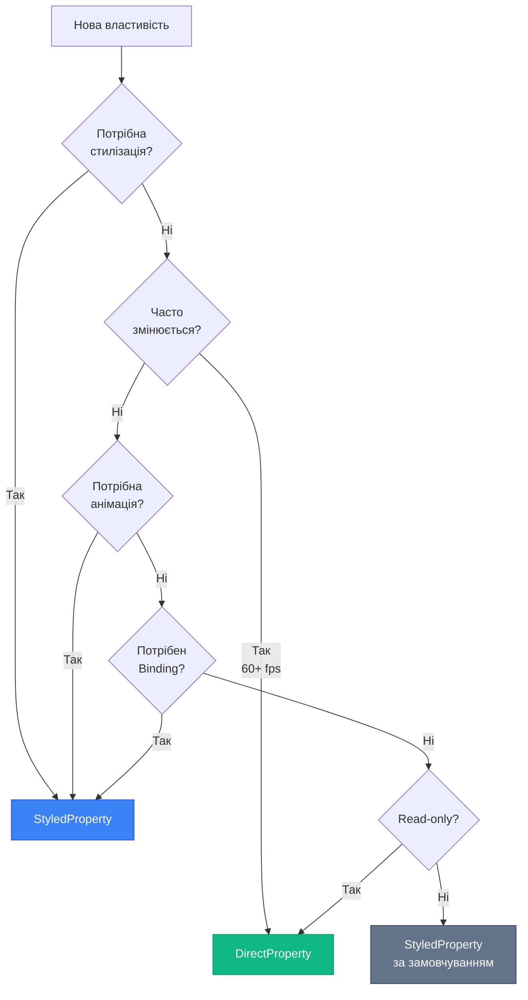
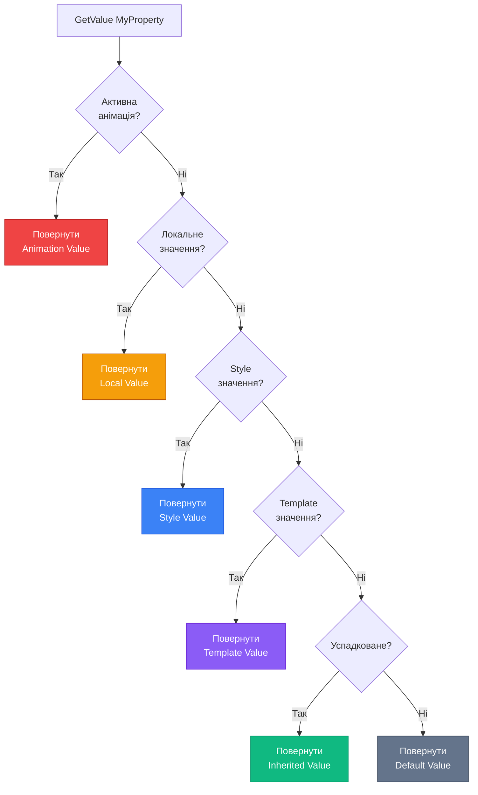

# Avalonia Property System: StyledProperty та DirectProperty

## Вступ

Якщо ви щойно опанували [Dependency Properties у WPF](14.dependency-properties-part1), у вас може виникнути питання: "Чи працює це так само в Avalonia?" Відповідь — **майже так само, але краще**.

Avalonia успадкувала концепцію системи властивостей від WPF, але переосмислила її з урахуванням сучасних вимог:

- **Кросплатформність** — система має працювати однаково на Windows, Linux, macOS, iOS, Android та WebAssembly
- **Продуктивність** — мобільні пристрої та браузери вимагають ефективнішого використання пам'яті
- **Типобезпека** — compile-time перевірки замість runtime помилок
- **Гнучкість** — різні типи властивостей для різних сценаріїв

::note
**Для кого ця стаття?** Якщо ви вже знайомі з WPF DependencyProperty (стаття 14), ця стаття покаже вам відмінності та покращення в Avalonia. Якщо ви пропустили WPF — рекомендую спочатку прочитати попередню статтю для розуміння базових концепцій.
::

---

## Еволюція: від DependencyProperty до AvaloniaProperty

### Що залишилось з WPF?

Avalonia зберегла фундаментальні концепції WPF:

::card-group

::card{title="✅ Централізоване сховище" icon="i-lucide-database"}
Значення зберігаються не у полях класу, а у спеціальному сховищі — як у WPF.
::

::card{title="✅ Система пріоритетів" icon="i-lucide-layers"}
Value Precedence: Animation → Local → Style → Default (з деякими відмінностями).
::

::card{title="✅ Метадані та callbacks" icon="i-lucide-settings"}
PropertyChanged, Coercion, Validation — всі ці механізми присутні.
::

::card{title="✅ Attached Properties" icon="i-lucide-paperclip"}
`Grid.Row`, `Canvas.Left` — працюють так само.
::

::

### Що змінилось?

::card-group

::card{title="🆕 Два типи властивостей" icon="i-lucide-git-branch"}
**StyledProperty** (аналог DP) та **DirectProperty** (нова концепція для продуктивності).
::

::card{title="🆕 Generic API" icon="i-lucide-code"}
`AvaloniaProperty.Register<TOwner, TValue>()` — типобезпечна реєстрація без boxing.
::

::card{title="🆕 Compile-time перевірки" icon="i-lucide-check-circle"}
Помилки у назвах властивостей виявляються на етапі компіляції, а не runtime.
::

::card{title="🆕 Оптимізація пам'яті" icon="i-lucide-zap"}
DirectProperty для часто змінюваних значень — без overhead сховища.
::

::

---

## StyledProperty: Аналог DependencyProperty

`StyledProperty` — це основний тип властивостей в Avalonia, що підтримує стилізацію, binding, анімації та всі інші можливості системи властивостей.

### Анатомія StyledProperty

Порівняємо синтаксис WPF та Avalonia:

::code-group

```csharp [WPF DependencyProperty]
public class MyButton : Button
{
    // Статичне поле
    public static readonly DependencyProperty TitleProperty =
        DependencyProperty.Register(
            "Title",                    // Назва як рядок ⚠️
            typeof(string),             // Тип як Type
            typeof(MyButton),           // Owner як Type
            new PropertyMetadata("Default")
        );
    
    // CLR wrapper
    public string Title
    {
        get => (string)GetValue(TitleProperty);  // Casting ⚠️
        set => SetValue(TitleProperty, value);
    }
}
```

```csharp [Avalonia StyledProperty]
public class MyButton : Button
{
    // Статичне поле з generic API
    public static readonly StyledProperty<string> TitleProperty =
        AvaloniaProperty.Register<MyButton, string>(
            nameof(Title),              // nameof — безпечно ✅
            defaultValue: "Default"
        );
    
    // CLR wrapper
    public string Title
    {
        get => GetValue(TitleProperty);     // Без casting ✅
        set => SetValue(TitleProperty, value);
    }
}
```

::

### Ключові відмінності

| Аспект                  | WPF DependencyProperty          | Avalonia StyledProperty           |
| ----------------------- | ------------------------------- | --------------------------------- |
| **Реєстрація**          | `DependencyProperty.Register()` | `AvaloniaProperty.Register<>()`   |
| **Типобезпека**         | ❌ Runtime casting              | ✅ Compile-time generics          |
| **Назва властивості**   | Рядок (помилки в runtime)       | `nameof()` (помилки в compile-time)|
| **Повернення значення** | `object` → потрібен cast        | `T` → без casting                 |
| **Метадані**            | `PropertyMetadata`              | Inline параметри або `StyledPropertyMetadata<T>` |

::tip
**Чому це важливо?** У WPF помилка у назві властивості (`"Titel"` замість `"Title"`) виявиться лише при запуску програми. В Avalonia компілятор відразу покаже помилку завдяки `nameof(Title)`.
::

---

## DirectProperty: Нова концепція

`DirectProperty` — унікальна особливість Avalonia, якої немає у WPF. Це "легка" властивість без централізованого сховища значень.

### Навіщо потрібен DirectProperty?

Розглянемо проблему:

```csharp
// У WPF/Avalonia StyledProperty:
public static readonly StyledProperty<Point> MousePositionProperty = ...

public Point MousePosition
{
    get => GetValue(MousePositionProperty);  // Читання зі сховища
    set => SetValue(MousePositionProperty, value);  // Запис у сховище
}

// Проблема: MousePosition змінюється 60+ разів на секунду (при русі миші)
// Кожна зміна = запис у сховище + PropertyChanged event + можлива інвалідація Layout/Render
```

**Overhead StyledProperty для часто змінюваних значень:**

- Запис у централізоване сховище (dictionary lookup)
- Виклик PropertyChanged callbacks
- Можлива інвалідація Layout/Render (якщо є прапорці `AffectsMeasure`)
- Підтримка системи пріоритетів (навіть якщо вона не потрібна)

### Рішення: DirectProperty

`DirectProperty` — це "пряме" звернення до backing field, без сховища:

```csharp
public class MyControl : Control
{
    // Backing field — звичайне поле класу
    private Point _mousePosition;
    
    // DirectProperty — без сховища
    public static readonly DirectProperty<MyControl, Point> MousePositionProperty =
        AvaloniaProperty.RegisterDirect<MyControl, Point>(
            nameof(MousePosition),
            o => o._mousePosition,           // Getter delegate
            (o, v) => o._mousePosition = v   // Setter delegate
        );
    
    public Point MousePosition
    {
        get => _mousePosition;
        set => SetAndRaise(MousePositionProperty, ref _mousePosition, value);
    }
}
```

### StyledProperty vs DirectProperty

::card-group

::card{title="StyledProperty" icon="i-lucide-layers"}
**Використання:**
- Властивості, що стилізуються (Background, Foreground)
- Властивості з анімаціями
- Властивості з Binding
- Рідко змінювані значення

**Переваги:**
- Повна підтримка стилів
- Система пріоритетів
- Property Value Inheritance
- Coercion та Validation

**Недоліки:**
- Overhead сховища
- Повільніше для частих змін
::

::card{title="DirectProperty" icon="i-lucide-zap"}
**Використання:**
- Часто змінювані значення (MousePosition, IsPointerOver)
- Read-only властивості (Bounds, ActualWidth)
- Властивості без стилізації
- Performance-critical код

**Переваги:**
- Прямий доступ до поля
- Мінімальний overhead
- Швидше для частих змін

**Недоліки:**
- ❌ Не підтримує стилі
- ❌ Не підтримує анімації
- ❌ Не підтримує Inheritance
::

::

### Коли що обирати?

::mermaid

::

::tip
**Правило великого пальця:** Якщо сумніваєтесь — використовуйте `StyledProperty`. `DirectProperty` — це оптимізація для специфічних випадків, коли ви точно знаєте, що стилізація та анімації не потрібні.
::

---

## Приклади з реального Avalonia

Розглянемо, як Avalonia використовує обидва типи властивостей у своїх контролах.

### Приклад 1: Button.Content — StyledProperty

```csharp
// Avalonia.Controls.Button
public class Button : ContentControl
{
    public static readonly StyledProperty<object?> ContentProperty =
        ContentControl.ContentProperty.AddOwner<Button>();
    
    public object? Content
    {
        get => GetValue(ContentProperty);
        set => SetValue(ContentProperty, value);
    }
}
```

**Чому StyledProperty?**
- `Content` може бути стилізований через `<Style Selector="Button">`
- Підтримує Binding: `Content="{Binding Title}"`
- Може анімуватися (fade in/out)

### Приклад 2: Control.Bounds — DirectProperty

```csharp
// Avalonia.Controls.Control
public class Control : InputElement
{
    private Rect _bounds;
    
    public static readonly DirectProperty<Control, Rect> BoundsProperty =
        AvaloniaProperty.RegisterDirect<Control, Rect>(
            nameof(Bounds),
            o => o._bounds
        );
    
    public Rect Bounds
    {
        get => _bounds;
        private set => SetAndRaise(BoundsProperty, ref _bounds, value);
    }
}
```

**Чому DirectProperty?**
- `Bounds` змінюється при кожному Layout pass (часто)
- Read-only — користувач не може встановити значення
- Не потребує стилізації чи анімації
- Performance-critical — Layout викликається дуже часто

---

## Порівняльна таблиця: WPF vs Avalonia

| Аспект                     | WPF DependencyProperty | Avalonia StyledProperty | Avalonia DirectProperty |
| -------------------------- | ---------------------- | ----------------------- | ----------------------- |
| **Стилізація**             | ✅ Так                 | ✅ Так                  | ❌ Ні                   |
| **Binding**                | ✅ Так                 | ✅ Так                  | ✅ Так (обмежено)       |
| **Анімації**               | ✅ Так                 | ✅ Так                  | ❌ Ні                   |
| **Property Inheritance**   | ✅ Так                 | ✅ Так                  | ❌ Ні                   |
| **Типобезпека**            | ❌ Runtime             | ✅ Compile-time         | ✅ Compile-time         |
| **Продуктивність**         | Середня                | Середня                 | Висока                  |
| **Overhead пам'яті**       | Середній               | Середній                | Мінімальний             |
| **Використання**           | Універсальне           | Універсальне            | Специфічне              |

---

Це перша доза матеріалу. Наступна доза буде про:
- Value Precedence в Avalonia (відмінності від WPF)
- AttachedProperty в Avalonia
- Практичні приклади реєстрації

Продовжити?


## Value Precedence в Avalonia

Avalonia успадкувала концепцію системи пріоритетів від WPF, але спростила її для кращої передбачуваності та продуктивності.

### Порівняння з WPF

У WPF система пріоритетів має 11 рівнів. Avalonia скоротила це до **6 основних рівнів**:

| Пріоритет | Avalonia                    | WPF Еквівалент              | Відмінності                          |
| --------- | --------------------------- | --------------------------- | ------------------------------------ |
| **1**     | Animation                   | Animation                   | ✅ Ідентично                         |
| **2**     | Local Value                 | Local Value                 | ✅ Ідентично                         |
| **3**     | Style (Triggers + Setters)  | Style Triggers → Setters    | 🔄 Об'єднано в один рівень           |
| **4**     | Template                    | Template Triggers → Setters | 🔄 Об'єднано в один рівень           |
| **5**     | Inherited                   | Inherited                   | ✅ Ідентично                         |
| **6**     | Default                     | Default                     | ✅ Ідентично                         |

::note
**Ключова відмінність:** У WPF Style Triggers мають вищий пріоритет за Style Setters. В Avalonia вони на одному рівні — це спрощує розуміння та зменшує кількість edge cases.
::

### Візуалізація процесу

::mermaid

::

### Практичний приклад

```xml
<!-- Avalonia XAML -->
<Window xmlns="https://github.com/avaloniaui"
        FontSize="16">  <!-- Inherited value -->
    
    <Window.Styles>
        <Style Selector="Button">
            <Setter Property="Background" Value="Blue"/>  <!-- Style value -->
        </Style>
    </Window.Styles>
    
    <StackPanel Spacing="10" Margin="20">
        <!-- Кнопка 1: Style value (Blue) -->
        <Button Content="Стиль"/>
        
        <!-- Кнопка 2: Local value (Red) перемагає Style -->
        <Button Content="Локальне" Background="Red"/>
        
        <!-- Кнопка 3: FontSize успадковується від Window (16) -->
        <Button Content="Успадкований шрифт"/>
    </StackPanel>
</Window>
```

::tip
**Debugging tip:** У Avalonia DevTools (F12) можна побачити джерело кожного значення властивості. Це неоцінна можливість для розуміння, чому елемент виглядає саме так.
::

---

## AttachedProperty в Avalonia

Attached Properties працюють в Avalonia майже ідентично до WPF, але з типобезпечним API.

### Реєстрація AttachedProperty

::code-group

```csharp [WPF]
public class Grid : Panel
{
    public static readonly DependencyProperty RowProperty =
        DependencyProperty.RegisterAttached(
            "Row",
            typeof(int),
            typeof(Grid),
            new PropertyMetadata(0)
        );
    
    public static void SetRow(DependencyObject obj, int value)
    {
        obj.SetValue(RowProperty, value);
    }
    
    public static int GetRow(DependencyObject obj)
    {
        return (int)obj.GetValue(RowProperty);
    }
}
```

```csharp [Avalonia]
public class Grid : Panel
{
    public static readonly AttachedProperty<int> RowProperty =
        AvaloniaProperty.RegisterAttached<Grid, Control, int>(
            "Row",
            defaultValue: 0
        );
    
    public static void SetRow(Control element, int value)
    {
        element.SetValue(RowProperty, value);
    }
    
    public static int GetRow(Control element)
    {
        return element.GetValue(RowProperty);
    }
}
```

::

### Ключові відмінності

| Аспект              | WPF                          | Avalonia                        |
| ------------------- | ---------------------------- | ------------------------------- |
| **Тип повернення**  | `DependencyProperty`         | `AttachedProperty<T>`           |
| **Реєстрація**      | `RegisterAttached()`         | `RegisterAttached<TOwner, THost, TValue>()` |
| **Типобезпека**     | ❌ Casting у Get/Set         | ✅ Generic параметри            |
| **Параметр методів**| `DependencyObject` (базовий) | `Control` (конкретний тип)      |

::note
**THost vs DependencyObject:** В Avalonia ви можете вказати конкретний тип елемента, до якого застосовується attached property. Наприклад, `Grid.Row` має сенс тільки для `Control`, а не для будь-якого `AvaloniaObject`.
::

### Використання у XAML

Синтаксис ідентичний:

```xml
<!-- WPF та Avalonia — однаковий XAML -->
<Grid>
    <Button Grid.Row="0" Grid.Column="1" Content="Кнопка"/>
    <TextBlock Grid.Row="1" Grid.Column="0" Text="Текст"/>
</Grid>
```

---

## AddOwner: Перевикористання властивостей

`AddOwner` дозволяє одному класу "перевикористати" властивість іншого класу, змінивши метадані або default value.

### Приклад з Avalonia

```csharp
// ContentControl визначає ContentProperty
public class ContentControl : TemplatedControl
{
    public static readonly StyledProperty<object?> ContentProperty =
        AvaloniaProperty.Register<ContentControl, object?>(
            nameof(Content)
        );
    
    public object? Content
    {
        get => GetValue(ContentProperty);
        set => SetValue(ContentProperty, value);
    }
}

// Button "додає себе як власника" ContentProperty
public class Button : ContentControl
{
    // AddOwner створює нову StyledProperty<object?> для Button
    public static readonly StyledProperty<object?> ContentProperty =
        ContentControl.ContentProperty.AddOwner<Button>();
    
    // Тепер Button.ContentProperty та ContentControl.ContentProperty
    // вказують на ту саму властивість у системі
}
```

### Навіщо це потрібно?

::card-group

::card{title="🔄 Перевикористання логіки" icon="i-lucide-recycle"}
Не потрібно дублювати реєстрацію — `Button` автоматично отримує всю логіку `ContentProperty` від `ContentControl`.
::

::card{title="🎨 Зміна метаданих" icon="i-lucide-palette"}
Можна змінити default value або callbacks для конкретного класу, не впливаючи на базовий клас.
::

::card{title="📦 Організація коду" icon="i-lucide-package"}
Дозволяє створювати ієрархії контролів з успадкованими властивостями.
::

::

### AddOwner з новими метаданими

```csharp
public class MyButton : Button
{
    // Перевизначаємо default value для Content
    public static readonly StyledProperty<object?> ContentProperty =
        Button.ContentProperty.AddOwner<MyButton>(
            new StyledPropertyMetadata<object?>(
                defaultValue: "Click Me!"  // Новий default
            )
        );
}
```

---

## Практичні приклади

Закріпимо знання через код.

### Приклад 1: Створення StyledProperty

Створимо простий контрол з кастомною властивістю:

```csharp
using Avalonia;
using Avalonia.Controls;
using Avalonia.Media;

public class RatingControl : Control
{
    // StyledProperty для рейтингу (0-5)
    public static readonly StyledProperty<int> RatingProperty =
        AvaloniaProperty.Register<RatingControl, int>(
            nameof(Rating),
            defaultValue: 0,
            validate: ValidateRating,
            coerce: CoerceRating
        );
    
    public int Rating
    {
        get => GetValue(RatingProperty);
        set => SetValue(RatingProperty, value);
    }
    
    // Validation: рейтинг має бути від 0 до 5
    private static bool ValidateRating(int value)
    {
        return value >= 0 && value <= 5;
    }
    
    // Coercion: обмежуємо значення діапазоном
    private static int CoerceRating(AvaloniaObject sender, int value)
    {
        return Math.Clamp(value, 0, 5);
    }
    
    // PropertyChanged callback
    static RatingControl()
    {
        RatingProperty.Changed.AddClassHandler<RatingControl>(
            (control, args) =>
            {
                // Реакція на зміну рейтингу
                control.InvalidateVisual(); // Перемалювати контрол
            }
        );
    }
}
```

::tip
**Відмінність від WPF:** У WPF callbacks передаються у `PropertyMetadata`. В Avalonia вони реєструються окремо через `Property.Changed.AddClassHandler<>()` — це дає більше гнучкості.
::

### Приклад 2: Створення DirectProperty

Створимо властивість для відстеження стану наведення миші:

```csharp
public class InteractiveControl : Control
{
    // Backing field
    private bool _isHovered;
    
    // DirectProperty — без сховища
    public static readonly DirectProperty<InteractiveControl, bool> IsHoveredProperty =
        AvaloniaProperty.RegisterDirect<InteractiveControl, bool>(
            nameof(IsHovered),
            o => o._isHovered
        );
    
    public bool IsHovered
    {
        get => _isHovered;
        private set => SetAndRaise(IsHoveredProperty, ref _isHovered, value);
    }
    
    protected override void OnPointerEntered(PointerEventArgs e)
    {
        base.OnPointerEntered(e);
        IsHovered = true;  // Часта зміна — DirectProperty ефективніший
    }
    
    protected override void OnPointerExited(PointerEventArgs e)
    {
        base.OnPointerExited(e);
        IsHovered = false;
    }
}
```

### Приклад 3: AttachedProperty для анотацій

Створимо attached property для додавання підказок до елементів:

```csharp
public class Annotations
{
    // AttachedProperty для тексту підказки
    public static readonly AttachedProperty<string?> HintProperty =
        AvaloniaProperty.RegisterAttached<Annotations, Control, string?>(
            "Hint",
            defaultValue: null
        );
    
    public static void SetHint(Control element, string? value)
    {
        element.SetValue(HintProperty, value);
    }
    
    public static string? GetHint(Control element)
    {
        return element.GetValue(HintProperty);
    }
}
```

Використання у XAML:

```xml
<Window xmlns:local="using:MyApp">
    <StackPanel Spacing="10" Margin="20">
        <TextBox local:Annotations.Hint="Введіть ваше ім'я"/>
        <Button local:Annotations.Hint="Натисніть для відправки" Content="Відправити"/>
    </StackPanel>
</Window>
```

---

## Практичні завдання

### Рівень 1: Конвертація з WPF

**Завдання:** Портуйте наступний WPF DependencyProperty на Avalonia StyledProperty.

::code-group

```csharp [WPF (вихідний код)]
public class ProgressButton : Button
{
    public static readonly DependencyProperty ProgressProperty =
        DependencyProperty.Register(
            "Progress",
            typeof(double),
            typeof(ProgressButton),
            new PropertyMetadata(0.0, OnProgressChanged)
        );
    
    public double Progress
    {
        get => (double)GetValue(ProgressProperty);
        set => SetValue(ProgressProperty, value);
    }
    
    private static void OnProgressChanged(DependencyObject d, DependencyPropertyChangedEventArgs e)
    {
        var button = (ProgressButton)d;
        // Логіка оновлення
    }
}
```

```csharp [Avalonia (ваше рішення)]
// TODO: Портуйте код на Avalonia
```

::

**Підказки:**
- Використайте `AvaloniaProperty.Register<TOwner, TValue>()`
- Замініть `PropertyMetadata` на inline параметри
- Callback реєструйте через `Property.Changed.AddClassHandler<>()`

---

### Рівень 2: StyledProperty vs DirectProperty

**Завдання:** Визначте, який тип властивості використати для кожного сценарію.

| Властивість                  | StyledProperty | DirectProperty | Обґрунтування |
| ---------------------------- | -------------- | -------------- | ------------- |
| `Button.Background`          | ?              | ?              | ?             |
| `Control.ActualWidth`        | ?              | ?              | ?             |
| `TextBox.Text`               | ?              | ?              | ?             |
| `Slider.Value`               | ?              | ?              | ?             |
| `Control.IsPointerOver`      | ?              | ?              | ?             |
| `Window.Title`               | ?              | ?              | ?             |

::collapsible{title="Показати відповіді"}

| Властивість                  | Тип            | Обґрунтування                                    |
| ---------------------------- | -------------- | ------------------------------------------------ |
| `Button.Background`          | StyledProperty | Потребує стилізації та binding                   |
| `Control.ActualWidth`        | DirectProperty | Read-only, часто змінюється (Layout)             |
| `TextBox.Text`               | StyledProperty | Потребує TwoWay binding                          |
| `Slider.Value`               | StyledProperty | Потребує binding та анімації                     |
| `Control.IsPointerOver`      | DirectProperty | Часто змінюється (pointer events), read-only     |
| `Window.Title`               | StyledProperty | Потребує binding, рідко змінюється               |

::

---

### Рівень 3: Повний RatingControl

**Завдання:** Створіть повноцінний `RatingControl` з наступними вимогами:

::steps

### Крок 1: Властивості

Створіть три StyledProperty:
- `Rating` (int, 0-5) — поточний рейтинг
- `MaxRating` (int, default 5) — максимальний рейтинг
- `StarColor` (IBrush, default Gold) — колір зірочок

### Крок 2: Validation та Coercion

- `Rating` не може бути більше за `MaxRating`
- `MaxRating` не може бути менше 1
- При зміні `MaxRating` — перевірити `Rating`

### Крок 3: Rendering

Перевизначте `Render()` для малювання зірочок:

```csharp
public override void Render(DrawingContext context)
{
    base.Render(context);
    
    for (int i = 0; i < MaxRating; i++)
    {
        var brush = i < Rating ? StarColor : Brushes.Gray;
        // Малювання зірочки
    }
}
```

### Крок 4: Інтерактивність

Додайте можливість змінювати рейтинг кліком:

```csharp
protected override void OnPointerPressed(PointerPressedEventArgs e)
{
    var position = e.GetPosition(this);
    var starWidth = Bounds.Width / MaxRating;
    var clickedStar = (int)(position.X / starWidth) + 1;
    
    Rating = Math.Clamp(clickedStar, 0, MaxRating);
}
```

::

---

## Резюме

У цій статті ми розібрали систему властивостей Avalonia:

- **StyledProperty** — аналог WPF DependencyProperty з типобезпечним API
- **DirectProperty** — нова концепція для оптимізації часто змінюваних властивостей
- **Value Precedence** — спрощена система пріоритетів (6 рівнів замість 11)
- **AttachedProperty** — ідентична концепція з WPF, але з generic API
- **AddOwner** — механізм перевикористання властивостей між класами

::tip
**Наступний крок:** Тепер, коли ви розумієте систему властивостей, можна переходити до [Attached Properties](15.attached-properties) для глибшого розуміння механізму `Grid.Row`, `Canvas.Left` та створення власних attached properties.
::

---

## Додаткові ресурси

::card-group

::card{title="📖 Avalonia Docs" icon="i-simple-icons-avaloniaui" to="https://docs.avaloniaui.net/docs/concepts/property-system" target="_blank"}
Офіційна документація Property System
::

::card{title="💻 GitHub Source" icon="i-simple-icons-github" to="https://github.com/AvaloniaUI/Avalonia/tree/master/src/Avalonia.Base" target="_blank"}
Вихідний код AvaloniaProperty
::

::card{title="🎓 Avalonia University" icon="i-lucide-graduation-cap" to="https://docs.avaloniaui.net/docs/guides/custom-controls" target="_blank"}
Гайд по створенню Custom Controls
::

::
