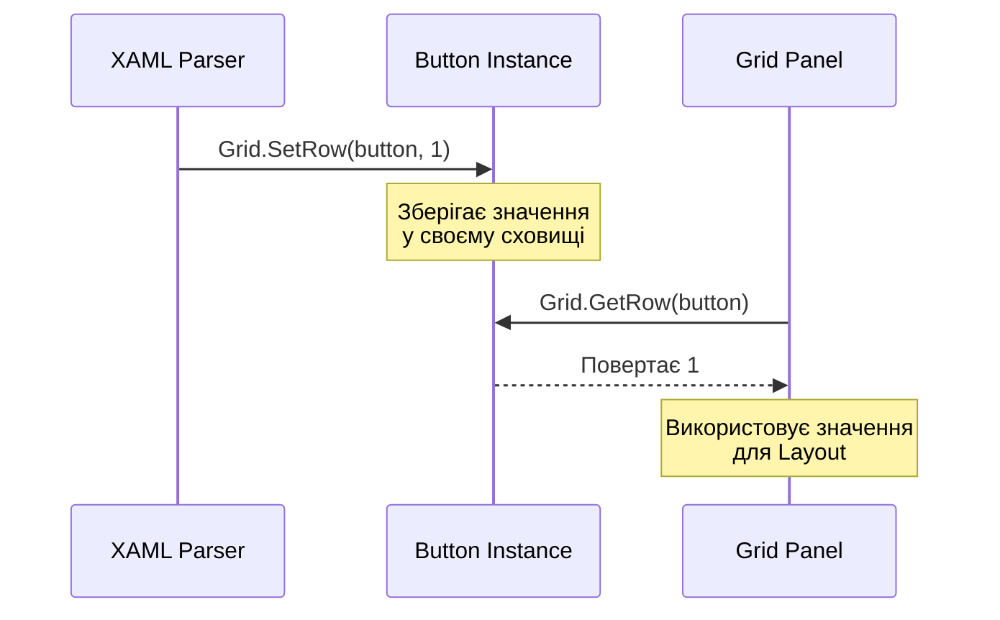

# Attached Properties: Властивості без меж

## Вступ

Погляньте на цей XAML-код:

```xml
<Grid>
    <Button Grid.Row="0" Grid.Column="1" Content="Натисни мене"/>
</Grid>
```

Виникає логічне питання: **як `Button` може мати властивість `Grid.Row`, якщо `Button` нічого не знає про `Grid`?**

Якщо ви подивитесь на визначення класу `Button`, ви не знайдете там властивості `Row` чи `Column`. Більше того, `Button` успадковується від `ButtonBase`, потім від `ContentControl`, `Control`, `FrameworkElement` — і жоден з цих класів не має властивості `Row`.

Так як же це працює? Відповідь — **Attached Properties** (прикріплені властивості).

::note
**Для кого ця стаття?** Якщо ви вже знайомі з [Dependency Properties](14.dependency-properties-part1) та розумієте систему властивостей WPF, ця стаття покаже вам, як одна властивість може "належати" одному класу, але "встановлюватися" на іншому.
::

---

## Концепція: Властивість без власника

Attached Property — це спеціальний тип Dependency Property, що має унікальну характеристику:

::card-group

::card{title="🏷️ Належить одному класу" icon="i-lucide-tag"}
`Grid.RowProperty` визначена у класі `Grid` — це її "власник" (owner).
::

::card{title="📌 Встановлюється на іншому" icon="i-lucide-pin"}
`Grid.Row="0"` встановлюється на `Button`, `TextBlock`, або будь-якому іншому `DependencyObject`.
::

::card{title="💾 Зберігається у дочірньому" icon="i-lucide-database"}
Значення зберігається у сховищі властивостей `Button`, а не `Grid`.
::

::card{title="📖 Читається батьком" icon="i-lucide-book-open"}
`Grid` читає це значення під час Layout pass, щоб визначити позицію дочірнього елемента.
::

::

### Аналогія з реального світу

Уявіть бібліотеку (Grid) та книги (Button, TextBlock). Кожна книга має **наклейку з номером полиці** (Grid.Row). Наклейка:

- **Належить бібліотеці** — вона визначає систему нумерації
- **Прикріплена до книги** — фізично знаходиться на книзі
- **Читається бібліотекарем** — щоб розмістити книгу на правильній полиці

Книга не "знає", що таке полиця — вона просто носить наклейку. Бібліотека читає наклейку і діє відповідно.

---

## Як це працює під капотом

Розберемо механізм на прикладі `Grid.Row`.

### Крок 1: Реєстрація Attached Property

```csharp
public class Grid : Panel
{
    // Реєстрація через RegisterAttached (не Register!)
    public static readonly DependencyProperty RowProperty =
        DependencyProperty.RegisterAttached(
            "Row",                      // Назва властивості
            typeof(int),                // Тип значення
            typeof(Grid),               // Клас-власник
            new PropertyMetadata(0)     // Default value = 0
        );
    
    // CLR wrapper для встановлення значення
    public static void SetRow(DependencyObject element, int value)
    {
        element.SetValue(RowProperty, value);
    }
    
    // CLR wrapper для читання значення
    public static int GetRow(DependencyObject element)
    {
        return (int)element.GetValue(RowProperty);
    }
}
```

::tip
**Naming Convention:** Методи завжди називаються `Set{PropertyName}` та `Get{PropertyName}`. Це дозволяє XAML-парсеру автоматично розпізнавати attached properties.
::

### Крок 2: Встановлення у XAML

```xml
<Grid>
    <!-- XAML-парсер перетворює це: -->
    <Button Grid.Row="1" Content="Кнопка"/>
    
    <!-- На це: -->
    <!-- Grid.SetRow(button, 1); -->
</Grid>
```

Під капотом відбувається:

```csharp
var button = new Button { Content = "Кнопка" };
Grid.SetRow(button, 1);  // Викликає button.SetValue(Grid.RowProperty, 1)
```

### Крок 3: Читання батьківським елементом

```csharp
public class Grid : Panel
{
    protected override Size ArrangeOverride(Size finalSize)
    {
        foreach (UIElement child in Children)
        {
            // Читаємо attached property з дочірнього елемента
            int row = GetRow(child);
            int column = GetColumn(child);
            
            // Обчислюємо позицію на основі row/column
            Rect cellRect = CalculateCellRect(row, column);
            
            // Розміщуємо дочірній елемент
            child.Arrange(cellRect);
        }
        
        return finalSize;
    }
}
```

::mermaid

::


---

## Існуючі Attached Properties у WPF

WPF має десятки вбудованих attached properties. Розглянемо найважливіші.

### Layout Panels

| Attached Property              | Власник        | Призначення                                    | Приклад                    |
| ------------------------------ | -------------- | ---------------------------------------------- | -------------------------- |
| `Grid.Row`                     | Grid           | Номер рядка (0-based)                          | `Grid.Row="1"`             |
| `Grid.Column`                  | Grid           | Номер колонки (0-based)                        | `Grid.Column="2"`          |
| `Grid.RowSpan`                 | Grid           | Кількість рядків для об'єднання                | `Grid.RowSpan="2"`         |
| `Grid.ColumnSpan`              | Grid           | Кількість колонок для об'єднання               | `Grid.ColumnSpan="3"`      |
| `DockPanel.Dock`               | DockPanel      | Сторона прикріплення (Top/Bottom/Left/Right)   | `DockPanel.Dock="Top"`     |
| `Canvas.Left`                  | Canvas         | Відстань від лівого краю                       | `Canvas.Left="50"`         |
| `Canvas.Top`                   | Canvas         | Відстань від верхнього краю                    | `Canvas.Top="100"`         |
| `Canvas.Right`                 | Canvas         | Відстань від правого краю                      | `Canvas.Right="20"`        |
| `Canvas.Bottom`                | Canvas         | Відстань від нижнього краю                     | `Canvas.Bottom="30"`       |

### Інші корисні Attached Properties

| Attached Property                        | Власник        | Призначення                                    |
| ---------------------------------------- | -------------- | ---------------------------------------------- |
| `Panel.ZIndex`                           | Panel          | Порядок накладання елементів (z-order)         |
| `ScrollViewer.HorizontalScrollBarVisibility` | ScrollViewer | Видимість горизонтального скролбару        |
| `ScrollViewer.VerticalScrollBarVisibility`   | ScrollViewer | Видимість вертикального скролбару          |
| `ToolTipService.ToolTip`                 | ToolTipService | Текст підказки                                 |
| `Validation.ErrorTemplate`               | Validation     | Шаблон відображення помилок валідації          |

### Практичний приклад

```xml
<Grid>
    <Grid.RowDefinitions>
        <RowDefinition Height="Auto"/>
        <RowDefinition Height="*"/>
        <RowDefinition Height="Auto"/>
    </Grid.RowDefinitions>
    
    <!-- Header: займає 2 колонки -->
    <TextBlock Grid.Row="0" Grid.ColumnSpan="2" 
               Text="Заголовок" 
               FontSize="24"/>
    
    <!-- Sidebar: DockPanel всередині Grid -->
    <DockPanel Grid.Row="1" Grid.Column="0">
        <Button DockPanel.Dock="Top" Content="Меню"/>
        <ListBox DockPanel.Dock="Left"/>
    </DockPanel>
    
    <!-- Content: Canvas з абсолютним позиціонуванням -->
    <Canvas Grid.Row="1" Grid.Column="1">
        <Ellipse Canvas.Left="50" Canvas.Top="50" 
                 Width="100" Height="100" 
                 Fill="Blue"
                 Panel.ZIndex="1"/>
        <Rectangle Canvas.Left="75" Canvas.Top="75" 
                   Width="100" Height="100" 
                   Fill="Red"
                   Panel.ZIndex="2"/>
    </Canvas>
    
    <!-- Footer -->
    <StatusBar Grid.Row="2" Grid.ColumnSpan="2"/>
</Grid>
```

::wpf-preview{title="Комбінація Attached Properties"}
```xml
<Grid>
  <Grid.RowDefinitions>
    <RowDefinition Height="Auto"/>
    <RowDefinition Height="*"/>
  </Grid.RowDefinitions>
  <Grid.ColumnDefinitions>
    <ColumnDefinition Width="*"/>
    <ColumnDefinition Width="*"/>
  </Grid.ColumnDefinitions>
  
  <TextBlock Grid.Row="0" Grid.ColumnSpan="2" 
             Text="Заголовок" 
             FontSize="20" 
             Margin="10"
             HorizontalAlignment="Center"/>
  
  <Border Grid.Row="1" Grid.Column="0" 
          Background="LightBlue" 
          Margin="5">
    <TextBlock Text="Ліва колонка" 
               VerticalAlignment="Center" 
               HorizontalAlignment="Center"/>
  </Border>
  
  <Border Grid.Row="1" Grid.Column="1" 
          Background="LightGreen" 
          Margin="5">
    <TextBlock Text="Права колонка" 
               VerticalAlignment="Center" 
               HorizontalAlignment="Center"/>
  </Border>
</Grid>
```
::

---

## Створення власних Attached Properties

Тепер створимо власні attached properties для розширення функціональності WPF.

### Приклад 1: Watermark для TextBox

Створимо attached property, що додає placeholder text до `TextBox`.

```csharp
using System.Windows;
using System.Windows.Controls;
using System.Windows.Media;

public static class TextBoxHelper
{
    // Реєстрація Attached Property
    public static readonly DependencyProperty WatermarkProperty =
        DependencyProperty.RegisterAttached(
            "Watermark",
            typeof(string),
            typeof(TextBoxHelper),
            new PropertyMetadata(null, OnWatermarkChanged)
        );
    
    // CLR wrapper для встановлення
    public static void SetWatermark(DependencyObject obj, string value)
    {
        obj.SetValue(WatermarkProperty, value);
    }
    
    // CLR wrapper для читання
    public static string GetWatermark(DependencyObject obj)
    {
        return (string)obj.GetValue(WatermarkProperty);
    }
    
    // Callback при зміні значення
    private static void OnWatermarkChanged(DependencyObject d, DependencyPropertyChangedEventArgs e)
    {
        if (d is TextBox textBox)
        {
            textBox.GotFocus -= RemoveWatermark;
            textBox.LostFocus -= ShowWatermark;
            
            if (e.NewValue != null)
            {
                textBox.GotFocus += RemoveWatermark;
                textBox.LostFocus += ShowWatermark;
                
                // Показати watermark, якщо TextBox порожній
                if (string.IsNullOrEmpty(textBox.Text))
                {
                    ShowWatermark(textBox, null);
                }
            }
        }
    }
    
    private static void ShowWatermark(object sender, RoutedEventArgs e)
    {
        var textBox = (TextBox)sender;
        if (string.IsNullOrEmpty(textBox.Text))
        {
            textBox.Foreground = Brushes.Gray;
            textBox.Text = GetWatermark(textBox);
        }
    }
    
    private static void RemoveWatermark(object sender, RoutedEventArgs e)
    {
        var textBox = (TextBox)sender;
        if (textBox.Text == GetWatermark(textBox))
        {
            textBox.Foreground = Brushes.Black;
            textBox.Text = string.Empty;
        }
    }
}
```

Використання у XAML:

```xml
<Window xmlns:local="clr-namespace:MyApp">
    <StackPanel Margin="20">
        <TextBox local:TextBoxHelper.Watermark="Введіть ваше ім'я" Margin="0,0,0,10"/>
        <TextBox local:TextBoxHelper.Watermark="Введіть email" Margin="0,0,0,10"/>
        <TextBox local:TextBoxHelper.Watermark="Введіть пароль"/>
    </StackPanel>
</Window>
```

::note
**Альтернативний підхід:** У реальних проєктах для watermark краще використовувати `AdornerLayer` або `ControlTemplate`, щоб уникнути конфліктів з реальним текстом. Цей приклад демонструє концепцію attached properties.
::

---

### Приклад 2: FocusOnLoad

Створимо attached property, що автоматично фокусує елемент при завантаженні вікна.

```csharp
using System.Windows;

public static class FocusHelper
{
    public static readonly DependencyProperty FocusOnLoadProperty =
        DependencyProperty.RegisterAttached(
            "FocusOnLoad",
            typeof(bool),
            typeof(FocusHelper),
            new PropertyMetadata(false, OnFocusOnLoadChanged)
        );
    
    public static void SetFocusOnLoad(DependencyObject obj, bool value)
    {
        obj.SetValue(FocusOnLoadProperty, value);
    }
    
    public static bool GetFocusOnLoad(DependencyObject obj)
    {
        return (bool)obj.GetValue(FocusOnLoadProperty);
    }
    
    private static void OnFocusOnLoadChanged(DependencyObject d, DependencyPropertyChangedEventArgs e)
    {
        if (d is FrameworkElement element && (bool)e.NewValue)
        {
            element.Loaded += (sender, args) =>
            {
                element.Focus();
            };
        }
    }
}
```

Використання:

```xml
<Window xmlns:local="clr-namespace:MyApp">
    <StackPanel Margin="20">
        <TextBox Text="Звичайний TextBox" Margin="0,0,0,10"/>
        <TextBox local:FocusHelper.FocusOnLoad="True" 
                 Text="Цей TextBox отримає фокус при завантаженні"/>
    </StackPanel>
</Window>
```

---

### Приклад 3: CornerRadius для будь-якого елемента

WPF дозволяє задати `CornerRadius` тільки для `Border`. Створимо attached property для будь-якого `UIElement`.

```csharp
using System.Windows;
using System.Windows.Media;

public static class ElementHelper
{
    public static readonly DependencyProperty CornerRadiusProperty =
        DependencyProperty.RegisterAttached(
            "CornerRadius",
            typeof(CornerRadius),
            typeof(ElementHelper),
            new FrameworkPropertyMetadata(
                new CornerRadius(0),
                FrameworkPropertyMetadataOptions.AffectsRender,
                OnCornerRadiusChanged
            )
        );
    
    public static void SetCornerRadius(DependencyObject obj, CornerRadius value)
    {
        obj.SetValue(CornerRadiusProperty, value);
    }
    
    public static CornerRadius GetCornerRadius(DependencyObject obj)
    {
        return (CornerRadius)obj.GetValue(CornerRadiusProperty);
    }
    
    private static void OnCornerRadiusChanged(DependencyObject d, DependencyPropertyChangedEventArgs e)
    {
        if (d is UIElement element)
        {
            var radius = (CornerRadius)e.NewValue;
            
            // Застосовуємо OpacityMask з закругленими кутами
            element.OpacityMask = new VisualBrush
            {
                Visual = new Border
                {
                    Background = Brushes.Black,
                    CornerRadius = radius,
                    Width = element.RenderSize.Width,
                    Height = element.RenderSize.Height
                }
            };
        }
    }
}
```

::warning
**Обмеження:** Цей підхід працює через `OpacityMask`, що може вплинути на продуктивність. Для production-коду краще використовувати `Border` як wrapper або створювати custom `ControlTemplate`.
::

---

## RegisterAttached vs Register: Відмінності

Порівняємо два типи реєстрації:

::code-group

```csharp [Regular DependencyProperty]
public class MyControl : Control
{
    // Звичайна властивість — належить класу
    public static readonly DependencyProperty TitleProperty =
        DependencyProperty.Register(
            "Title",
            typeof(string),
            typeof(MyControl)
        );
    
    // Instance property
    public string Title
    {
        get => (string)GetValue(TitleProperty);
        set => SetValue(TitleProperty, value);
    }
}

// Використання:
// <MyControl Title="Заголовок"/>
```

```csharp [Attached DependencyProperty]
public static class MyHelper
{
    // Attached property — належить класу, встановлюється на іншому
    public static readonly DependencyProperty TagProperty =
        DependencyProperty.RegisterAttached(
            "Tag",
            typeof(string),
            typeof(MyHelper)
        );
    
    // Static methods
    public static void SetTag(DependencyObject obj, string value)
    {
        obj.SetValue(TagProperty, value);
    }
    
    public static string GetTag(DependencyObject obj)
    {
        return (string)obj.GetValue(TagProperty);
    }
}

// Використання:
// <Button local:MyHelper.Tag="Мітка"/>
```

::

| Аспект                  | Regular Property              | Attached Property                |
| ----------------------- | ----------------------------- | -------------------------------- |
| **Реєстрація**          | `Register()`                  | `RegisterAttached()`             |
| **Wrapper**             | Instance property (get/set)   | Static methods (Get/Set)         |
| **Власник**             | Клас, де визначена            | Клас, де визначена               |
| **Встановлюється на**   | Екземплярі того ж класу       | Будь-якому `DependencyObject`    |
| **XAML синтаксис**      | `<MyControl Title="..."/>`    | `<Button local:MyHelper.Tag="..."/>` |
| **Призначення**         | Властивість контролу          | Розширення функціональності      |

---

## Коли використовувати Attached Properties?

::card-group

::card{title="✅ Layout системи" icon="i-lucide-layout-grid"}
Коли батьківський елемент потребує інформації про розташування дочірніх елементів (`Grid.Row`, `Canvas.Left`).
::

::card{title="✅ Поведінкові розширення" icon="i-lucide-zap"}
Додавання функціональності до існуючих контролів без успадкування (`FocusOnLoad`, `Watermark`).
::

::card{title="✅ Метадані" icon="i-lucide-tag"}
Прикріплення додаткової інформації до елементів (`ToolTipService.ToolTip`, `AutomationProperties.Name`).
::

::card{title="✅ Кросплатформні бібліотеки" icon="i-lucide-package"}
Створення переиспользовуваних компонентів, що працюють з будь-якими контролами.
::

::

::card-group

::card{title="❌ Не використовуйте для" icon="i-lucide-x-circle"}
**Властивостей контролу** — якщо властивість логічно належить контролу, використовуйте звичайну DependencyProperty.

**Складної логіки** — attached properties мають бути простими. Для складної поведінки використовуйте Behaviors (Blend SDK).

**Заміни успадкування** — якщо ви створюєте custom контрол, використовуйте звичайні властивості.
::

::

---

## Практичні завдання

### Рівень 1: Використання існуючих Attached Properties

**Завдання:** Створіть складний layout з використанням кількох типів attached properties.

::steps

### Крок 1: Створіть Grid з 3×3 комірками

```xml
<Grid ShowGridLines="True">
    <Grid.RowDefinitions>
        <RowDefinition Height="Auto"/>
        <RowDefinition Height="*"/>
        <RowDefinition Height="Auto"/>
    </Grid.RowDefinitions>
    <Grid.ColumnDefinitions>
        <ColumnDefinition Width="200"/>
        <ColumnDefinition Width="*"/>
        <ColumnDefinition Width="200"/>
    </Grid.ColumnDefinitions>
    
    <!-- TODO: Додайте елементи -->
</Grid>
```

### Крок 2: Додайте елементи з різними attached properties

- Header (Grid.Row="0", Grid.ColumnSpan="3")
- Sidebar (Grid.Row="1", Grid.Column="0")
- Content з Canvas всередині (Grid.Row="1", Grid.Column="1")
- Використайте Panel.ZIndex для накладання елементів у Canvas

### Крок 3: Експериментуйте

Змініть значення `Grid.Row`, `Grid.ColumnSpan`, `Panel.ZIndex` та подивіться, як змінюється layout.

::

---

### Рівень 2: Створення простого Attached Property

**Завдання:** Створіть `AnimateOnHover` attached property, що додає анімацію при наведенні миші.

**Вимоги:**
- Attached property типу `bool`
- При `true` — елемент збільшується на 10% при наведенні
- При `false` — анімація відключена

**Підказка:**

```csharp
private static void OnAnimateOnHoverChanged(DependencyObject d, DependencyPropertyChangedEventArgs e)
{
    if (d is UIElement element && (bool)e.NewValue)
    {
        element.MouseEnter += (s, args) =>
        {
            var scaleTransform = new ScaleTransform(1.1, 1.1);
            element.RenderTransform = scaleTransform;
            element.RenderTransformOrigin = new Point(0.5, 0.5);
        };
        
        element.MouseLeave += (s, args) =>
        {
            element.RenderTransform = null;
        };
    }
}
```

---

### Рівень 3: Повноцінний Attached Property з валідацією

**Завдання:** Створіть `NumericOnly` attached property для `TextBox`, що дозволяє вводити тільки цифри.

**Вимоги:**

::steps

### Крок 1: Реєстрація

```csharp
public static class TextBoxValidation
{
    public static readonly DependencyProperty NumericOnlyProperty =
        DependencyProperty.RegisterAttached(
            "NumericOnly",
            typeof(bool),
            typeof(TextBoxValidation),
            new PropertyMetadata(false, OnNumericOnlyChanged)
        );
    
    // TODO: Get/Set методи
}
```

### Крок 2: Обробка події PreviewTextInput

```csharp
private static void OnNumericOnlyChanged(DependencyObject d, DependencyPropertyChangedEventArgs e)
{
    if (d is TextBox textBox)
    {
        if ((bool)e.NewValue)
        {
            textBox.PreviewTextInput += OnPreviewTextInput;
        }
        else
        {
            textBox.PreviewTextInput -= OnPreviewTextInput;
        }
    }
}

private static void OnPreviewTextInput(object sender, TextCompositionEventArgs e)
{
    // TODO: Перевірити, чи e.Text містить тільки цифри
    // Якщо ні — встановити e.Handled = true
}
```

### Крок 3: Обробка Paste

Додайте обробку `DataObject.Pasting` для блокування вставки нецифрових символів.

::

---

## Резюме

У цій статті ми розібрали Attached Properties:

- **Концепція** — властивість належить одному класу, встановлюється на іншому
- **Механізм** — зберігається у дочірньому елементі, читається батьківським
- **Існуючі AP** — Grid.Row, Canvas.Left, Panel.ZIndex та інші
- **Створення власних** — через `RegisterAttached()` + static Get/Set методи
- **Use cases** — Layout системи, поведінкові розширення, метадані

::tip
**Наступний крок:** Тепер, коли ви розумієте Attached Properties, можна переходити до [Routed Events](16.routed-events) — системи подій WPF, що дозволяє подіям "подорожувати" по дереву елементів (Tunneling та Bubbling).
::

---

## Додаткові ресурси

::card-group

::card{title="📖 Microsoft Docs" icon="i-simple-icons-microsoftazure" to="https://learn.microsoft.com/en-us/dotnet/desktop/wpf/properties/attached-properties-overview" target="_blank"}
Офіційна документація Attached Properties
::

::card{title="🎓 WPF Tutorial" icon="i-lucide-graduation-cap" to="https://wpf-tutorial.com/xaml/attached-properties/" target="_blank"}
Інтерактивний туторіал з прикладами
::

::card{title="📚 Pro WPF in C#" icon="i-lucide-book-open"}
Книга Adam Nathan — розділ 4.3 "Attached Properties"
::

::
