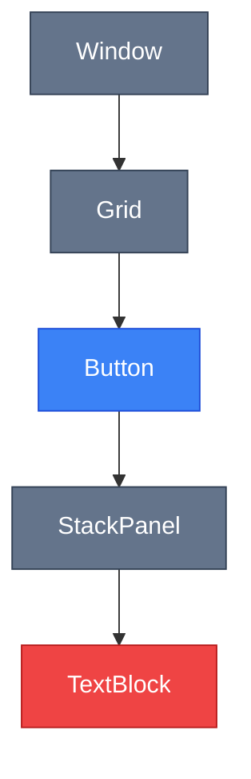
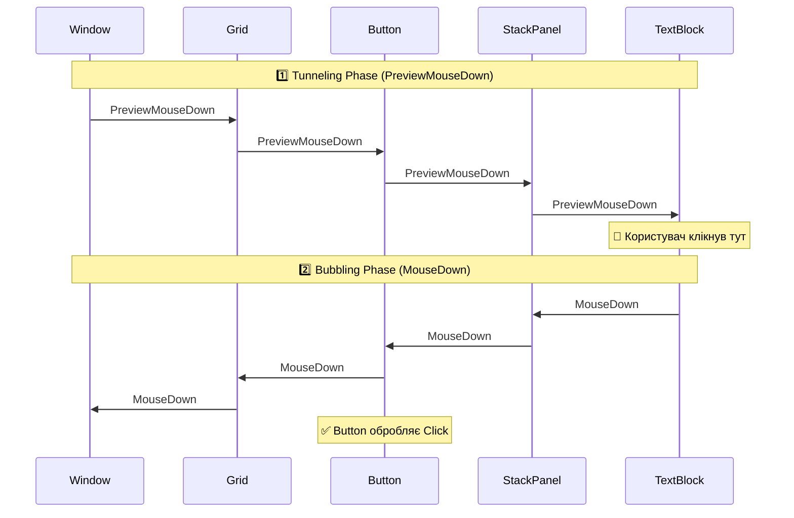
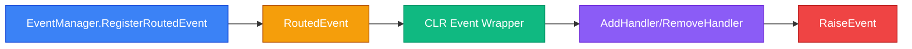

# Routed Events: Маршрутизація подій

## Вступ

Уявіть собі кнопку з іконкою та текстом:

```xml
<Button Width="200" Height="50">
    <StackPanel Orientation="Horizontal">
        <Image Source="icon.png" Width="24" Height="24"/>
        <TextBlock Text="Натисни мене" VerticalAlignment="Center" Margin="10,0,0,0"/>
    </StackPanel>
</Button>
```

Тепер питання: **коли користувач клікає на текст "Натисни мене", хто отримає подію `Click`?**

- `TextBlock`, на який безпосередньо клікнули?
- `StackPanel`, що містить текст?
- `Button`, який є логічним контролом?
- Всі троє? У якій послідовності?

У WinForms відповідь проста — подія приходить тільки до `TextBlock`. Але у WPF елементи організовані у **дерево** (Visual Tree), і події можуть **подорожувати** по цьому дереву. Це називається **Event Routing** (маршрутизація подій).

::note
**Для кого ця стаття?** Якщо ви вже знайомі з [Dependency Properties](14.dependency-properties-part1) та [Attached Properties](15.attached-properties), ця стаття завершить вашу картину розуміння WPF Property System. Routed Events — це третій стовп архітектури WPF.
::

---

## Проблема: Плоскі події у WinForms

У традиційних UI-фреймворках (WinForms, Windows API) події працюють просто:

```csharp
// WinForms
button.Click += (sender, e) =>
{
    MessageBox.Show("Кнопку натиснуто!");
};
```

Подія `Click` приходить **тільки** до `button`. Якщо всередині кнопки є інші контроли (Label, PictureBox), вони не отримують цю подію.

### Проблеми цього підходу

::card-group

::card{title="❌ Складність композиції" icon="i-lucide-layers"}
Якщо кнопка складається з кількох елементів (іконка + текст), потрібно вручну обробляти кліки на кожному елементі та "пробрасывати" їх до батьківського контролу.
::

::card{title="❌ Дублювання коду" icon="i-lucide-copy"}
Той самий обробник треба прикріпити до кожного дочірнього елемента: `icon.Click += handler; label.Click += handler;`.
::

::card{title="❌ Немає перехоплення" icon="i-lucide-shield-off"}
Неможливо "перехопити" подію до того, як вона досягне цільового контролу. Наприклад, заборонити введення певних символів у TextBox на рівні форми.
::

::card{title="❌ Складна ієрархія" icon="i-lucide-git-branch"}
У складних UI (DataGrid з кнопками у комірках) важко визначити, який саме елемент отримав подію та як реагувати на різних рівнях ієрархії.
::

::

---

## Рішення: Routed Events у WPF

WPF вирішує ці проблеми через **маршрутизацію подій** — події "подорожують" по Visual Tree, даючи можливість кожному елементу на шляху обробити їх.

### Три стратегії маршрутизації

::mermaid

::

WPF підтримує три типи маршрутизації:

| Стратегія       | Напрямок                        | Naming Convention | Приклади                          |
| --------------- | ------------------------------- | ----------------- | --------------------------------- |
| **Tunneling**   | Від кореня до джерела (↓)       | `Preview*`        | `PreviewMouseDown`, `PreviewKeyDown` |
| **Bubbling**    | Від джерела до кореня (↑)       | Без префіксу      | `MouseDown`, `Click`, `KeyDown`   |
| **Direct**      | Тільки джерело (без руху)       | Різні             | `MouseEnter`, `MouseLeave`        |

### Візуалізація маршрутизації

Розглянемо, що відбувається при кліку на `TextBlock` всередині `Button`:

::mermaid

::

::tip
**Ключовий момент:** Для кожної події існує **пара** — Tunneling (`Preview*`) та Bubbling (без префіксу). Спочатку спрацьовує Tunneling (зверху вниз), потім Bubbling (знизу вгору).
::

---

## Tunneling: Перехоплення подій

**Tunneling** (тунелювання) — це маршрутизація **від кореня до джерела**. Події з префіксом `Preview*` спрацьовують **до** того, як подія досягне цільового елемента.

### Навіщо потрібен Tunneling?

Tunneling дозволяє **перехопити** подію на вищому рівні та:

- Заборонити подальшу обробку (`e.Handled = true`)
- Змінити поведінку до того, як подія досягне елемента
- Логувати або валідувати input на рівні форми/вікна

### Приклад: Заборона введення цифр

Створимо TextBox, що не дозволяє вводити цифри:

```xml
<Window x:Class="RoutedEventsDemo.MainWindow"
        xmlns="http://schemas.microsoft.com/winfx/2006/xaml/presentation"
        PreviewTextInput="Window_PreviewTextInput">
    <StackPanel Margin="20">
        <TextBlock Text="Введіть текст (без цифр):" Margin="0,0,0,5"/>
        <TextBox x:Name="myTextBox"/>
    </StackPanel>
</Window>
```

Code-behind:

```csharp
private void Window_PreviewTextInput(object sender, TextCompositionEventArgs e)
{
    // Перевіряємо, чи введений текст містить цифри
    if (e.Text.Any(char.IsDigit))
    {
        e.Handled = true;  // Зупиняємо подію — TextBox не отримає її
    }
}
```

**Що відбувається:**

1. Користувач натискає клавішу "5"
2. WPF генерує `PreviewTextInput` на `Window` (Tunneling)
3. Обробник на `Window` перевіряє текст
4. Якщо це цифра — встановлює `e.Handled = true`
5. Подія **не досягає** `TextBox` — символ не вводиться

::wpf-preview{title="Tunneling: Заборона цифр"}
```xml
<StackPanel Margin="20" Spacing="10">
  <TextBlock Text="Спробуйте ввести цифри — вони не з'являться"/>
  <TextBox Text="Тільки текст"/>
  <TextBlock Text="(У реальному WPF це працює через PreviewTextInput)" 
             FontSize="10" 
             Foreground="Gray"/>
</StackPanel>
```
::

::note
**Обмеження превью:** `PreviewTextInput` не працює у Avalonia WASM, тому превью показує лише візуальний результат. У реальному WPF-проєкті цей код працює повністю.
::

### Naming Convention

Всі Tunneling події мають префікс `Preview`:

| Bubbling Event    | Tunneling Event       | Опис                          |
| ----------------- | --------------------- | ----------------------------- |
| `MouseDown`       | `PreviewMouseDown`    | Натискання кнопки миші        |
| `MouseUp`         | `PreviewMouseUp`      | Відпускання кнопки миші       |
| `KeyDown`         | `PreviewKeyDown`      | Натискання клавіші            |
| `KeyUp`           | `PreviewKeyUp`        | Відпускання клавіші           |
| `TextInput`       | `PreviewTextInput`    | Введення тексту               |
| `DragEnter`       | `PreviewDragEnter`    | Початок drag-and-drop         |

---

## Bubbling: Делегування подій

**Bubbling** (спливання) — це маршрутизація **від джерела до кореня**. Це найчастіший тип подій у WPF.

### Навіщо потрібен Bubbling?

Bubbling дозволяє:

- Обробляти події на **батьківському рівні** замість кожного дочірнього елемента
- Створювати **композитні контроли** (кнопка з іконкою + текстом), де клік на будь-якій частині спрацьовує як клік на кнопці
- Реалізувати **делегування подій** — один обробник для багатьох елементів

### Приклад: Делегування подій

Замість прикріплення обробника до кожної кнопки, прикріпимо один обробник до батьківського `StackPanel`:

```xml
<StackPanel Margin="20" Button.Click="StackPanel_ButtonClick">
    <Button Content="Кнопка 1" Tag="1" Margin="0,0,0,5"/>
    <Button Content="Кнопка 2" Tag="2" Margin="0,0,0,5"/>
    <Button Content="Кнопка 3" Tag="3"/>
</StackPanel>
```

Code-behind:

```csharp
private void StackPanel_ButtonClick(object sender, RoutedEventArgs e)
{
    // e.Source — елемент, що ініціював подію (Button)
    if (e.Source is Button button)
    {
        MessageBox.Show($"Натиснуто кнопку {button.Tag}");
    }
}
```

**Що відбувається:**

1. Користувач клікає на "Кнопка 2"
2. `Button` генерує подію `Click`
3. Подія "спливає" до `StackPanel` (Bubbling)
4. Обробник на `StackPanel` отримує подію
5. Через `e.Source` визначаємо, яка саме кнопка була натиснута

::wpf-preview{title="Bubbling: Делегування подій"}
```xml
<StackPanel Margin="20" Spacing="10">
  <Button Content="Кнопка 1" Command="{Binding ShowMessageCommand}" CommandParameter="Натиснуто кнопку 1"/>
  <Button Content="Кнопка 2" Command="{Binding ShowMessageCommand}" CommandParameter="Натиснуто кнопку 2"/>
  <Button Content="Кнопка 3" Command="{Binding ShowMessageCommand}" CommandParameter="Натиснуто кнопку 3"/>
  <TextBlock Text="Результат з'явиться у вкладці Output" 
             FontSize="10" 
             Foreground="Gray" 
             Margin="0,10,0,0"/>
</StackPanel>
```
::

### Переваги Bubbling

::card-group

::card{title="🎯 Менше коду" icon="i-lucide-code"}
Один обробник замість N обробників для N елементів.
::

::card{title="🔄 Динамічні елементи" icon="i-lucide-refresh-cw"}
Якщо додаєте нові кнопки динамічно — вони автоматично працюють з існуючим обробником.
::

::card{title="🧩 Композитні контроли" icon="i-lucide-puzzle"}
Кнопка з іконкою + текстом працює як єдине ціле — клік на будь-якій частині спрацьовує.
::

::

---

## Direct Events: Без маршрутизації

**Direct Events** — це події, що **не подорожують** по дереву. Вони спрацьовують тільки на елементі, де сталася подія.

### Приклади Direct Events

| Подія           | Опис                                      | Чому Direct?                          |
| --------------- | ----------------------------------------- | ------------------------------------- |
| `MouseEnter`    | Миша увійшла в межі елемента              | Специфічна для конкретного елемента   |
| `MouseLeave`    | Миша покинула межі елемента               | Специфічна для конкретного елемента   |
| `GotFocus`      | Елемент отримав фокус                     | Фокус може бути тільки на одному      |
| `LostFocus`     | Елемент втратив фокус                     | Фокус може бути тільки на одному      |
| `Loaded`        | Елемент завантажений та готовий до рендерингу | Lifecycle event конкретного елемента |

### Чому не всі події маршрутизуються?

Деякі події логічно не мають сенсу маршрутизувати:

- `MouseEnter` / `MouseLeave` — якщо миша увійшла в `Button`, вона автоматично увійшла у всі батьківські елементи. Bubbling створив би дублювання.
- `GotFocus` / `LostFocus` — фокус може бути тільки на одному елементі одночасно.

::tip
**Як визначити тип події?** Подивіться на документацію або використайте рефлексію: `Button.ClickEvent.RoutingStrategy` поверне `Bubble`, `Direct` або `Tunnel`.
::


---

## RoutedEventArgs: Деталі події

Кожна Routed Event передає об'єкт `RoutedEventArgs` (або його підклас), що містить інформацію про подію.

### Ключові властивості

```csharp
public class RoutedEventArgs : EventArgs
{
    // Елемент, що ініціював подію (логічний)
    public object Source { get; set; }
    
    // Елемент, де фізично сталася подія (візуальний)
    public object OriginalSource { get; }
    
    // Чи була подія оброблена (зупинка маршрутизації)
    public bool Handled { get; set; }
    
    // Сама подія (RoutedEvent)
    public RoutedEvent RoutedEvent { get; }
}
```

### Source vs OriginalSource

Це одна з найбільш заплутаних концепцій для початківців. Розберемо різницю:

::code-group

```xml [XAML]
<Button Width="200" Height="50" Click="Button_Click">
    <StackPanel Orientation="Horizontal">
        <Image Source="icon.png" Width="24" Height="24"/>
        <TextBlock Text="Натисни мене"/>
    </StackPanel>
</Button>
```

```csharp [Code-behind]
private void Button_Click(object sender, RoutedEventArgs e)
{
    // sender — завжди елемент, до якого прикріплений обробник
    Console.WriteLine($"sender: {sender.GetType().Name}");  // Button
    
    // Source — логічний елемент, що ініціював подію
    Console.WriteLine($"Source: {e.Source.GetType().Name}");  // Button
    
    // OriginalSource — візуальний елемент, де фізично клікнули
    Console.WriteLine($"OriginalSource: {e.OriginalSource.GetType().Name}");  // TextBlock або Image
}
```

::

**Результат при кліку на текст:**

```
sender: Button
Source: Button
OriginalSource: TextBlock
```

::note
**Правило:** `Source` — це **логічний** елемент (той, хто "відповідає" за подію). `OriginalSource` — це **візуальний** елемент (той, на який фізично клікнули). У більшості випадків використовуйте `Source`.
::

### Handled: Зупинка маршрутизації

Властивість `Handled` дозволяє **зупинити** подальшу маршрутизацію події:

```csharp
private void Button_Click(object sender, RoutedEventArgs e)
{
    MessageBox.Show("Кнопку натиснуто!");
    
    // Зупиняємо подію — батьківські елементи не отримають її
    e.Handled = true;
}
```

**Коли використовувати `Handled = true`:**

- Ви повністю обробили подію і не хочете, щоб батьківські елементи реагували
- Потрібно заборонити стандартну поведінку (наприклад, заборонити введення символу у TextBox)

### handledEventsToo: Обробка "зупинених" подій

Іноді потрібно отримати подію **навіть якщо** вона була зупинена (`Handled = true`). Для цього використовуйте перевантаження `AddHandler`:

```csharp
public MainWindow()
{
    InitializeComponent();
    
    // Третій параметр = true — отримувати навіть Handled події
    myButton.AddHandler(Button.ClickEvent, new RoutedEventHandler(Button_Click), handledEventsToo: true);
}

private void Button_Click(object sender, RoutedEventArgs e)
{
    // Цей обробник спрацює навіть якщо інший обробник встановив e.Handled = true
    Console.WriteLine("Отримав подію, незважаючи на Handled!");
}
```

::warning
**Використовуйте обережно:** `handledEventsToo = true` порушує очікувану поведінку маршрутизації. Використовуйте тільки для діагностики або специфічних сценаріїв (наприклад, глобальне логування подій).
::

---

## Створення власних Routed Events

Тепер створимо власну Routed Event для custom контролу.

### Приклад: ItemSelected Event

Створимо контрол `CustomListBox` з власною подією `ItemSelected`:

```csharp
using System.Windows;
using System.Windows.Controls;

public class CustomListBox : ListBox
{
    // 1️⃣ Реєстрація Routed Event
    public static readonly RoutedEvent ItemSelectedEvent =
        EventManager.RegisterRoutedEvent(
            name: "ItemSelected",                    // Назва події
            routingStrategy: RoutingStrategy.Bubble, // Стратегія маршрутизації
            handlerType: typeof(RoutedEventHandler), // Тип делегата
            ownerType: typeof(CustomListBox)         // Клас-власник
        );
    
    // 2️⃣ CLR event wrapper
    public event RoutedEventHandler ItemSelected
    {
        add { AddHandler(ItemSelectedEvent, value); }
        remove { RemoveHandler(ItemSelectedEvent, value); }
    }
    
    // 3️⃣ Генерація події
    protected override void OnSelectionChanged(SelectionChangedEventArgs e)
    {
        base.OnSelectionChanged(e);
        
        if (e.AddedItems.Count > 0)
        {
            // Створюємо RoutedEventArgs
            var args = new RoutedEventArgs(ItemSelectedEvent, this);
            
            // Генеруємо подію
            RaiseEvent(args);
        }
    }
}
```

Використання у XAML:

```xml
<local:CustomListBox ItemSelected="CustomListBox_ItemSelected">
    <ListBoxItem Content="Елемент 1"/>
    <ListBoxItem Content="Елемент 2"/>
    <ListBoxItem Content="Елемент 3"/>
</local:CustomListBox>
```

Code-behind:

```csharp
private void CustomListBox_ItemSelected(object sender, RoutedEventArgs e)
{
    var listBox = (CustomListBox)sender;
    MessageBox.Show($"Обрано: {listBox.SelectedItem}");
}
```

### Анатомія реєстрації

::mermaid

::

### Параметри RegisterRoutedEvent

| Параметр          | Тип                | Опис                                                    |
| ----------------- | ------------------ | ------------------------------------------------------- |
| `name`            | string             | Назва події (convention: без префіксу "Event")         |
| `routingStrategy` | RoutingStrategy    | `Bubble`, `Tunnel`, або `Direct`                        |
| `handlerType`     | Type               | Тип делегата (зазвичай `RoutedEventHandler`)            |
| `ownerType`       | Type               | Клас, що володіє подією                                 |

::tip
**Naming Convention:** Статичне поле називається `{EventName}Event` (наприклад, `ItemSelectedEvent`), а CLR wrapper — `{EventName}` (наприклад, `ItemSelected`).
::

---

## Class Handlers: Обробка на рівні класу

**Class Handlers** — це обробники подій, що реєструються на рівні **класу**, а не екземпляра. Вони спрацьовують **до** instance handlers.

### Навіщо потрібні Class Handlers?

Class Handlers дозволяють:

- Реалізувати **стандартну поведінку** контролу (наприклад, Button реагує на Enter через Class Handler)
- Обробляти події **до** того, як їх отримають користувацькі обробники
- Додавати поведінку до всіх екземплярів класу одночасно

### Приклад: Button та Enter

`Button` має властивість `IsDefault` — якщо вона `true`, натискання Enter активує кнопку. Це реалізовано через Class Handler:

```csharp
// Спрощена версія з WPF
static Button()
{
    // Реєстрація Class Handler для KeyDown
    EventManager.RegisterClassHandler(
        typeof(Button),
        Keyboard.KeyDownEvent,
        new KeyEventHandler(OnKeyDown)
    );
}

private static void OnKeyDown(object sender, KeyEventArgs e)
{
    var button = (Button)sender;
    
    // Якщо натиснуто Enter і IsDefault = true
    if (e.Key == Key.Enter && button.IsDefault)
    {
        // Активуємо кнопку
        button.OnClick();
        e.Handled = true;
    }
}
```

### Створення власного Class Handler

```csharp
public class MyTextBox : TextBox
{
    static MyTextBox()
    {
        // Реєстрація Class Handler для PreviewKeyDown
        EventManager.RegisterClassHandler(
            typeof(MyTextBox),
            PreviewKeyDownEvent,
            new KeyEventHandler(OnPreviewKeyDown)
        );
    }
    
    private static void OnPreviewKeyDown(object sender, KeyEventArgs e)
    {
        // Заборона Ctrl+V (вставка)
        if (e.Key == Key.V && Keyboard.Modifiers == ModifierKeys.Control)
        {
            e.Handled = true;
        }
    }
}
```

::note
**Порядок виконання:** Class Handler → Instance Handler. Якщо Class Handler встановить `e.Handled = true`, Instance Handler все одно спрацює (на відміну від звичайної маршрутизації).
::

---

## Практичні завдання

### Рівень 1: Дослідження Bubbling

**Завдання:** Створіть вкладену структуру контролів та дослідіть порядок спрацювання обробників.

::steps

### Крок 1: Створіть XAML

```xml
<Window x:Class="RoutedEventsDemo.MainWindow"
        MouseDown="Window_MouseDown">
    <Grid MouseDown="Grid_MouseDown" Background="LightGray">
        <StackPanel MouseDown="StackPanel_MouseDown" 
                    Background="LightBlue" 
                    Width="300" 
                    Height="200">
            <Button Content="Натисни мене" 
                    MouseDown="Button_MouseDown" 
                    Margin="20"/>
        </StackPanel>
    </Grid>
</Window>
```

### Крок 2: Додайте обробники

```csharp
private void Button_MouseDown(object sender, MouseButtonEventArgs e)
{
    Debug.WriteLine("1. Button_MouseDown");
}

private void StackPanel_MouseDown(object sender, MouseButtonEventArgs e)
{
    Debug.WriteLine("2. StackPanel_MouseDown");
}

private void Grid_MouseDown(object sender, MouseButtonEventArgs e)
{
    Debug.WriteLine("3. Grid_MouseDown");
}

private void Window_MouseDown(object sender, MouseButtonEventArgs e)
{
    Debug.WriteLine("4. Window_MouseDown");
}
```

### Крок 3: Експериментуйте

- Клікніть на кнопку — подивіться порядок у Output
- Додайте `e.Handled = true` у `StackPanel_MouseDown` — що зміниться?
- Додайте `PreviewMouseDown` обробники — як зміниться порядок?

::

**Очікуваний результат (без Handled):**

```
1. Button_MouseDown
2. StackPanel_MouseDown
3. Grid_MouseDown
4. Window_MouseDown
```

---

### Рівень 2: Tunneling для валідації

**Завдання:** Створіть форму, де на рівні `Window` заборонено вводити спеціальні символи у всі TextBox.

**Вимоги:**

- Використайте `PreviewTextInput` на `Window`
- Заборонені символи: `@`, `#`, `$`, `%`, `&`
- Покажіть повідомлення користувачу при спробі ввести заборонений символ

**Підказка:**

```csharp
private void Window_PreviewTextInput(object sender, TextCompositionEventArgs e)
{
    char[] forbiddenChars = { '@', '#', '$', '%', '&' };
    
    if (e.Text.Any(c => forbiddenChars.Contains(c)))
    {
        e.Handled = true;
        MessageBox.Show("Спеціальні символи заборонені!");
    }
}
```

---

### Рівень 3: Власна Routed Event

**Завдання:** Створіть `RatingControl` з власною подією `RatingChanged`.

**Вимоги:**

::steps

### Крок 1: Створіть контрол

```csharp
public class RatingControl : Control
{
    // DependencyProperty для рейтингу
    public static readonly DependencyProperty RatingProperty =
        DependencyProperty.Register(
            nameof(Rating),
            typeof(int),
            typeof(RatingControl),
            new PropertyMetadata(0, OnRatingChanged)
        );
    
    public int Rating
    {
        get => (int)GetValue(RatingProperty);
        set => SetValue(RatingProperty, value);
    }
    
    // TODO: Реєстрація RatingChangedEvent
    // TODO: CLR event wrapper
    // TODO: Генерація події у OnRatingChanged callback
}
```

### Крок 2: Реєстрація події

```csharp
public static readonly RoutedEvent RatingChangedEvent =
    EventManager.RegisterRoutedEvent(
        "RatingChanged",
        RoutingStrategy.Bubble,
        typeof(RoutedPropertyChangedEventHandler<int>),
        typeof(RatingControl)
    );

public event RoutedPropertyChangedEventHandler<int> RatingChanged
{
    add { AddHandler(RatingChangedEvent, value); }
    remove { RemoveHandler(RatingChangedEvent, value); }
}
```

### Крок 3: Генерація події

```csharp
private static void OnRatingChanged(DependencyObject d, DependencyPropertyChangedEventArgs e)
{
    var control = (RatingControl)d;
    int oldValue = (int)e.OldValue;
    int newValue = (int)e.NewValue;
    
    var args = new RoutedPropertyChangedEventArgs<int>(oldValue, newValue, RatingChangedEvent);
    control.RaiseEvent(args);
}
```

### Крок 4: Використання

```xml
<local:RatingControl Rating="3" RatingChanged="RatingControl_RatingChanged"/>
```

::

---

## Резюме

У цій статті ми розібрали систему подій WPF:

- **Три стратегії маршрутизації** — Tunneling (Preview*), Bubbling, Direct
- **RoutedEventArgs** — Source vs OriginalSource, Handled для зупинки маршрутизації
- **Створення власних Routed Events** — через `EventManager.RegisterRoutedEvent()`
- **Class Handlers** — обробка подій на рівні класу для стандартної поведінки
- **Практичні сценарії** — делегування подій, валідація input, композитні контроли

::tip
**Наступний крок:** Тепер, коли ви розумієте Property System (Dependency Properties, Attached Properties, Routed Events), можна переходити до [Data Binding](17.data-binding-basics-part1) — механізму, що з'єднує UI з даними декларативно.
::

---

## Додаткові ресурси

::card-group

::card{title="📖 Microsoft Docs" icon="i-simple-icons-microsoftazure" to="https://learn.microsoft.com/en-us/dotnet/desktop/wpf/events/routed-events-overview" target="_blank"}
Офіційна документація Routed Events
::

::card{title="🎓 WPF Tutorial" icon="i-lucide-graduation-cap" to="https://wpf-tutorial.com/xaml/routed-events/" target="_blank"}
Інтерактивний туторіал з прикладами
::

::card{title="📚 Pro WPF in C#" icon="i-lucide-book-open"}
Книга Adam Nathan — розділ 5 "Routed Events"
::

::
