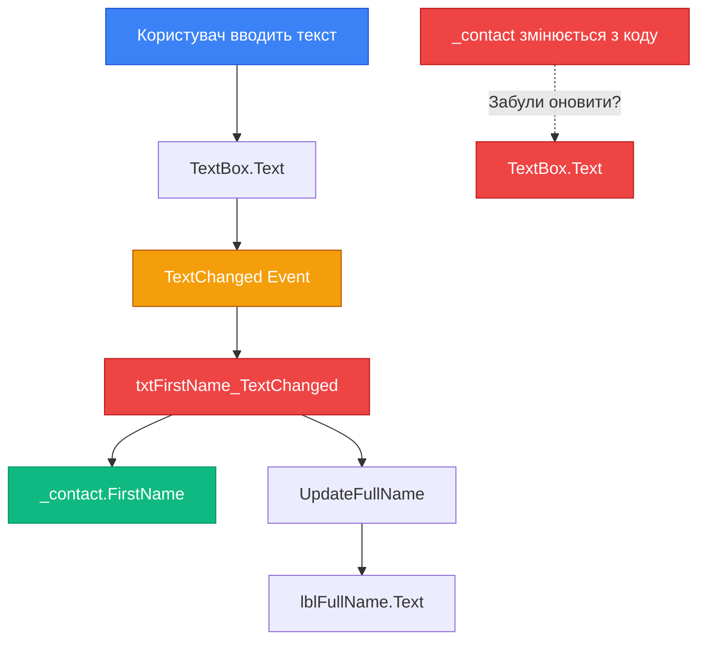
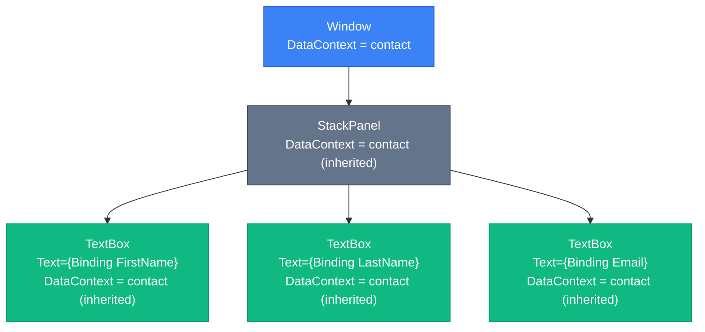

# Data Binding: Від Code-Behind до Декларативності

## Вступ

Уявіть, що вам потрібно створити форму редагування профілю користувача з 50 полями: ім'я, прізвище, email, телефон, адреса, дата народження, біографія, налаштування приватності, і так далі. Традиційний підхід виглядає так:

```csharp
// Завантаження даних у форму
private void LoadUser(User user)
{
    txtFirstName.Text = user.FirstName;
    txtLastName.Text = user.LastName;
    txtEmail.Text = user.Email;
    txtPhone.Text = user.Phone;
    // ... ще 46 рядків
}

// Збереження даних з форми
private void SaveUser()
{
    user.FirstName = txtFirstName.Text;
    user.LastName = txtLastName.Text;
    user.Email = txtEmail.Text;
    user.Phone = txtPhone.Phone;
    // ... ще 46 рядків
}

// Обробка змін для кожного поля
private void txtFirstName_TextChanged(object sender, TextChangedEventArgs e)
{
    user.FirstName = txtFirstName.Text;
    UpdateUI();
}

private void txtLastName_TextChanged(object sender, TextChangedEventArgs e)
{
    user.LastName = txtLastName.Text;
    UpdateUI();
}

// ... ще 48 обробників
```

**Підрахунок:** 50 полів × 3 методи (Load, Save, TextChanged) = **150+ рядків коду** тільки для синхронізації UI з даними. І це без валідації, форматування, обробки помилок!

А тепер уявіть, що весь цей код можна замінити на:

```xml
<TextBox Text="{Binding FirstName}"/>
<TextBox Text="{Binding LastName}"/>
<TextBox Text="{Binding Email}"/>
<!-- ... ще 47 рядків XAML -->
```

**Підрахунок:** 50 рядків XAML. Без жодного рядка C#-коду для синхронізації. Це — **Data Binding**.

::note
**Для кого ця стаття?** Якщо ви вже знайомі з [Dependency Properties](14.dependency-properties-part1), [XAML](04.xaml-basics) та базовими контролами WPF, ця стаття відкриє вам найпотужнішу можливість платформи — декларативне зв'язування даних.
::

---

## Проблема: "Spaghetti UI" у Code-Behind

Перш ніж зануритися у Data Binding, розберемо детально, чому традиційний підхід через code-behind стає неконтрольованим у реальних проєктах.

### Анатомія проблеми

Розглянемо просту форму редагування контакту:

```xml
<StackPanel Margin="20">
    <TextBlock Text="Ім'я:"/>
    <TextBox x:Name="txtFirstName"/>
    
    <TextBlock Text="Прізвище:"/>
    <TextBox x:Name="txtLastName"/>
    
    <TextBlock Text="Email:"/>
    <TextBox x:Name="txtEmail"/>
    
    <TextBlock Text="Повне ім'я:"/>
    <TextBlock x:Name="lblFullName" FontWeight="Bold"/>
    
    <Button Content="Зберегти" Click="SaveButton_Click"/>
</StackPanel>
```

Code-behind для цієї форми:

```csharp
public partial class ContactForm : Window
{
    private Contact _contact;
    
    public ContactForm(Contact contact)
    {
        InitializeComponent();
        _contact = contact;
        LoadContact();
    }
    
    // 1️⃣ Завантаження даних у UI
    private void LoadContact()
    {
        txtFirstName.Text = _contact.FirstName ?? string.Empty;
        txtLastName.Text = _contact.LastName ?? string.Empty;
        txtEmail.Text = _contact.Email ?? string.Empty;
        UpdateFullName();
    }
    
    // 2️⃣ Оновлення обчислюваних полів
    private void UpdateFullName()
    {
        lblFullName.Text = $"{txtFirstName.Text} {txtLastName.Text}";
    }
    
    // 3️⃣ Обробка змін для кожного поля
    private void txtFirstName_TextChanged(object sender, TextChangedEventArgs e)
    {
        _contact.FirstName = txtFirstName.Text;
        UpdateFullName();
    }
    
    private void txtLastName_TextChanged(object sender, TextChangedEventArgs e)
    {
        _contact.LastName = txtLastName.Text;
        UpdateFullName();
    }
    
    private void txtEmail_TextChanged(object sender, TextChangedEventArgs e)
    {
        _contact.Email = txtEmail.Text;
    }
    
    // 4️⃣ Збереження
    private void SaveButton_Click(object sender, RoutedEventArgs e)
    {
        // Дані вже в _contact завдяки TextChanged
        _contactRepository.Save(_contact);
        Close();
    }
}
```

**Підрахунок:** Для 3 полів — **~40 рядків коду**. Для 50 полів — **~600+ рядків**.

### Проблеми цього підходу

::card-group

::card{title="🍝 Spaghetti Code" icon="i-lucide-git-branch"}
Логіка розкидана між `LoadContact()`, `UpdateFullName()`, `TextChanged` обробниками та `SaveButton_Click`. Важко зрозуміти потік даних.
::

::card{title="🔗 Тісна зв'язність" icon="i-lucide-link"}
UI-код (`txtFirstName.Text`) змішаний з бізнес-логікою (`_contact.FirstName`). Неможливо тестувати логіку без UI.
::

::card{title="📝 Дублювання" icon="i-lucide-copy"}
Той самий паттерн повторюється для кожного поля: `TextChanged` → оновити модель → оновити залежні поля.
::

::card{title="🐛 Помилки синхронізації" icon="i-lucide-bug"}
Легко забути викликати `UpdateFullName()` після зміни `FirstName`. Або забути оновити UI після зміни моделі з коду.
::

::card{title="🧪 Нетестовність" icon="i-lucide-flask-conical"}
Як протестувати `UpdateFullName()` без створення `Window`? Як перевірити, що `FirstName` правильно оновлюється?
::

::card{title="🔄 Складність підтримки" icon="i-lucide-wrench"}
Додавання нового поля = 3 нові методи + оновлення існуючих. Видалення поля = пошук всіх місць, де воно використовується.
::

::

### Візуалізація потоку даних

::mermaid

::

::warning
**Реальна статистика:** У великих WinForms-проєктах до 60% коду складається з синхронізації UI з даними. Це код, який не додає бізнес-цінності, але створює 80% багів.
::

---

## Рішення: Data Binding

Data Binding у WPF — це **декларативний механізм автоматичної синхронізації** між UI-властивостями (Target) та властивостями об'єктів даних (Source).

### Концепція

Замість імперативного коду:

```csharp
txtFirstName.Text = contact.FirstName;  // UI ← Дані
contact.FirstName = txtFirstName.Text;  // Дані ← UI
```

Ви пишете декларативний XAML:

```xml
<TextBox Text="{Binding FirstName}"/>
```

І WPF **автоматично** синхронізує `TextBox.Text` з `contact.FirstName` в обох напрямках.

### Анатомія Binding Expression

```xml
<TextBox Text="{Binding Path=FirstName, Mode=TwoWay}"/>
```

Розберемо по частинах:

| Частина          | Опис                                                                 | Обов'язкова? |
| ---------------- | -------------------------------------------------------------------- | ------------ |
| `{Binding ...}`  | Markup Extension — синтаксис для створення об'єкта `Binding`         | ✅ Так       |
| `Path=FirstName` | Шлях до властивості у джерелі даних (Source)                         | ✅ Так       |
| `Mode=TwoWay`    | Режим синхронізації (OneWay, TwoWay, OneTime, OneWayToSource)       | ❌ Ні (є default) |

::tip
**Скорочений синтаксис:** `{Binding FirstName}` еквівалентний `{Binding Path=FirstName}`. Якщо `Path` — перший параметр, його можна опустити.
::

### Ключові компоненти

::mermaid

::

1. **Source** — джерело даних (C#-об'єкт, властивість якого прив'язується)
2. **Target** — ціль прив'язки (завжди `DependencyProperty` UI-елемента)
3. **Path** — шлях до властивості у Source
4. **DataContext** — контекст даних, що визначає Source за замовчуванням

---

## DataContext: Контекст даних

`DataContext` — це властивість кожного `FrameworkElement`, що визначає **джерело даних за замовчуванням** для всіх Binding-виразів у цьому елементі та його дочірніх елементах.

### Успадкування DataContext

Ключова особливість `DataContext` — він **успадковується** по Logical Tree. Якщо елемент не має власного `DataContext`, він використовує `DataContext` батьківського елемента.

::mermaid

::

### Встановлення DataContext

Найпростіший спосіб — у code-behind конструктора:

```csharp
public partial class ContactForm : Window
{
    public ContactForm()
    {
        InitializeComponent();
        
        // Створюємо об'єкт даних
        var contact = new Contact
        {
            FirstName = "Іван",
            LastName = "Петренко",
            Email = "ivan@example.com"
        };
        
        // Встановлюємо DataContext для всього вікна
        DataContext = contact;
    }
}
```

Тепер **всі** Binding-вирази у цьому вікні будуть використовувати `contact` як Source:

```xml
<StackPanel Margin="20">
    <!-- Binding шукає FirstName у DataContext (contact) -->
    <TextBox Text="{Binding FirstName}"/>
    
    <!-- Binding шукає LastName у DataContext (contact) -->
    <TextBox Text="{Binding LastName}"/>
    
    <!-- Binding шукає Email у DataContext (contact) -->
    <TextBox Text="{Binding Email}"/>
</StackPanel>
```

### Пошук DataContext

Коли WPF зустрічає `{Binding FirstName}`, він виконує наступний алгоритм:

::steps

### Крок 1: Перевірка локального DataContext

Чи має `TextBox` власний `DataContext`? Якщо так — використати його.

### Крок 2: Підйом по дереву

Якщо ні — піднятися до батьківського елемента (`StackPanel`) та перевірити його `DataContext`.

### Крок 3: Рекурсивний пошук

Продовжувати підйом до `Window`, потім до `Application`.

### Крок 4: Fallback

Якщо `DataContext` не знайдено на жодному рівні — Binding не працює (помилка у Output Window).

::

::note
**Аналогія:** `DataContext` — це як "контекст, що тече по трубах". Ви наливаєте воду (дані) у верхню трубу (`Window.DataContext`), і вона автоматично тече до всіх нижчих труб (дочірніх елементів).
::

---

## Binding Modes: Режими синхронізації

Binding підтримує кілька режимів синхронізації між Source та Target.

### Таблиця режимів

| Mode              | Напрямок          | Коли оновлюється Target? | Коли оновлюється Source? | Use Case                          |
| ----------------- | ----------------- | ------------------------ | ------------------------ | --------------------------------- |
| `OneWay`          | Source → Target   | При зміні Source         | Ніколи                   | Відображення даних (Label, TextBlock) |
| `TwoWay`          | Source ↔ Target   | При зміні Source         | При зміні Target         | Редагування даних (TextBox, CheckBox) |
| `OneTime`         | Source → Target   | Один раз при ініціалізації | Ніколи                 | Статичні дані (константи)         |
| `OneWayToSource`  | Target → Source   | Ніколи                   | При зміні Target         | Рідкісний (наприклад, Slider → ViewModel) |
| `Default`         | Залежить від Target | Залежить від Target    | Залежить від Target      | Автоматичний вибір                |

### Візуалізація режимів

::mermaid
```mermaid
graph LR
    subgraph OneWay
        S1[Source] -->|Update| T1[Target]
    end
    
    subgraph TwoWay
        S2[Source] <-->|Update| T2[Target]
    end
    
    subgraph OneTime
        S3[Source] -.->|Once| T3[Target]
    end
    
    subgraph OneWayToSource
        S4[Source] <--|Update| T4[Target]
    end
    
    style S1 fill:#10b981,stroke:#059669,color:#ffffff
    style T1 fill:#3b82f6,stroke:#1d4ed8,color:#ffffff
    style S2 fill:#10b981,stroke:#059669,color:#ffffff
    style T2 fill:#3b82f6,stroke:#1d4ed8,color:#ffffff
    style S3 fill:#10b981,stroke:#059669,color:#ffffff
    style T3 fill:#3b82f6,stroke:#1d4ed8,color:#ffffff
    style S4 fill:#10b981,stroke:#059669,color:#ffffff
    style T4 fill:#3b82f6,stroke:#1d4ed8,color:#ffffff
```
::

### OneWay: Тільки читання

Найпростіший режим — дані течуть **тільки від Source до Target**.

```xml
<!-- TextBlock завжди показує актуальне значення FirstName -->
<TextBlock Text="{Binding FirstName, Mode=OneWay}"/>
```

**Коли використовувати:**
- Відображення даних, що не редагуються користувачем
- Labels, TextBlocks, ProgressBars
- Обчислювані властивості (FullName = FirstName + LastName)

### TwoWay: Двостороння синхронізація

Дані течуть **в обох напрямках** — зміни у Source оновлюють Target, зміни у Target оновлюють Source.

```xml
<!-- Користувач редагує → оновлюється Source -->
<!-- Source змінюється з коду → оновлюється TextBox -->
<TextBox Text="{Binding FirstName, Mode=TwoWay}"/>
```

**Коли використовувати:**
- Поля введення (TextBox, CheckBox, ComboBox)
- Будь-які контроли, де користувач змінює дані

::tip
**Default Mode:** Більшість контролів мають розумний default. `TextBox.Text` за замовчуванням `TwoWay`, `TextBlock.Text` — `OneWay`. Тому часто `Mode` можна опустити.
::

### OneTime: Одноразове завантаження

Дані завантажуються **один раз** при ініціалізації та більше не оновлюються.

```xml
<!-- Завантажується один раз при створенні вікна -->
<TextBlock Text="{Binding CreatedDate, Mode=OneTime}"/>
```

**Коли використовувати:**
- Статичні дані (дата створення, версія додатку)
- Оптимізація продуктивності (якщо точно знаєте, що дані не зміняться)

### OneWayToSource: Зворотний напрямок

Рідкісний режим — дані течуть **тільки від Target до Source**.

```xml
<!-- Slider оновлює Source, але Source не оновлює Slider -->
<Slider Value="{Binding Volume, Mode=OneWayToSource}"/>
```

**Коли використовувати:**
- Специфічні сценарії (наприклад, Slider керує гучністю, але гучність не змінюється ззовні)
- Зазвичай `TwoWay` кращий вибір

---

## Перший робочий приклад

Створимо повноцінний приклад з Data Binding.

### Крок 1: Модель даних (POCO)

```csharp
// POCO = Plain Old CLR Object (звичайний C#-клас)
public class Contact
{
    public string FirstName { get; set; }
    public string LastName { get; set; }
    public string Email { get; set; }
    public string Phone { get; set; }
}
```

::note
**POCO:** На цьому етапі ми використовуємо звичайний клас без `INotifyPropertyChanged`. Це означає, що Binding працює **тільки в один бік** — від UI до моделі. Зміни моделі з коду не оновлять UI. Це виправимо у [Part 2](17.data-binding-basics-part2).
::

### Крок 2: XAML з Binding

```xml
<Window x:Class="DataBindingDemo.MainWindow"
        xmlns="http://schemas.microsoft.com/winfx/2006/xaml/presentation"
        xmlns:x="http://schemas.microsoft.com/winfx/2006/xaml"
        Title="Контакт" Width="400" Height="300">
    <StackPanel Margin="20">
        <TextBlock Text="Ім'я:" Margin="0,0,0,5"/>
        <TextBox Text="{Binding FirstName}" Margin="0,0,0,10"/>
        
        <TextBlock Text="Прізвище:" Margin="0,0,0,5"/>
        <TextBox Text="{Binding LastName}" Margin="0,0,0,10"/>
        
        <TextBlock Text="Email:" Margin="0,0,0,5"/>
        <TextBox Text="{Binding Email}" Margin="0,0,0,10"/>
        
        <TextBlock Text="Телефон:" Margin="0,0,0,5"/>
        <TextBox Text="{Binding Phone}" Margin="0,0,0,10"/>
        
        <Button Content="Показати дані" Click="ShowData_Click"/>
    </StackPanel>
</Window>
```

### Крок 3: Code-Behind

```csharp
public partial class MainWindow : Window
{
    private Contact _contact;
    
    public MainWindow()
    {
        InitializeComponent();
        
        // Створюємо контакт з початковими даними
        _contact = new Contact
        {
            FirstName = "Іван",
            LastName = "Петренко",
            Email = "ivan@example.com",
            Phone = "+380501234567"
        };
        
        // Встановлюємо DataContext
        DataContext = _contact;
    }
    
    private void ShowData_Click(object sender, RoutedEventArgs e)
    {
        // Дані автоматично оновлені завдяки TwoWay Binding!
        string message = $"Ім'я: {_contact.FirstName}\n" +
                        $"Прізвище: {_contact.LastName}\n" +
                        $"Email: {_contact.Email}\n" +
                        $"Телефон: {_contact.Phone}";
        
        MessageBox.Show(message, "Дані контакту");
    }
}
```

### Що відбувається?

::steps

### При запуску

1. Створюється `Contact` з початковими даними
2. `DataContext = _contact` — всі Binding тепер "бачать" цей об'єкт
3. WPF читає `FirstName`, `LastName`, `Email`, `Phone` з `_contact`
4. TextBox-и відображають ці значення

### При редагуванні

1. Користувач змінює текст у `TextBox`
2. Завдяки `TwoWay` Binding (default для `TextBox.Text`)
3. WPF автоматично оновлює `_contact.FirstName`, `_contact.LastName`, тощо

### При натисканні кнопки

1. Читаємо `_contact.FirstName` — він вже оновлений!
2. Жодного ручного коду синхронізації

::

::wpf-preview{title="Data Binding: Перший приклад"}
```xml
<StackPanel Margin="20" Spacing="10">
  <TextBlock Text="Ім'я:"/>
  <TextBox Text="Іван"/>
  
  <TextBlock Text="Прізвище:"/>
  <TextBox Text="Петренко"/>
  
  <TextBlock Text="Email:"/>
  <TextBox Text="ivan@example.com"/>
  
  <Button Content="Показати дані" Command="{Binding ShowMessageCommand}" CommandParameter="Дані оновлені через Binding!"/>
</StackPanel>
```
::

---

## Порівняння: Code-Behind vs Data Binding

Порівняємо обсяг коду для тієї ж форми.

### Code-Behind підхід

```csharp
// Завантаження: 4 рядки
txtFirstName.Text = _contact.FirstName;
txtLastName.Text = _contact.LastName;
txtEmail.Text = _contact.Email;
txtPhone.Text = _contact.Phone;

// Збереження: 4 рядки
_contact.FirstName = txtFirstName.Text;
_contact.LastName = txtLastName.Text;
_contact.Email = txtEmail.Text;
_contact.Phone = txtPhone.Text;

// TextChanged обробники: 4 × 3 = 12 рядків
private void txtFirstName_TextChanged(object sender, TextChangedEventArgs e)
{
    _contact.FirstName = txtFirstName.Text;
}
// ... ще 3 обробники

// Підсумок: ~20 рядків C# для 4 полів
```

### Data Binding підхід

```csharp
// Встановлення DataContext: 1 рядок
DataContext = _contact;

// Підсумок: 1 рядок C# для 4 полів (і для 50 полів теж 1 рядок!)
```

```xml
<!-- XAML: 4 рядки -->
<TextBox Text="{Binding FirstName}"/>
<TextBox Text="{Binding LastName}"/>
<TextBox Text="{Binding Email}"/>
<TextBox Text="{Binding Phone}"/>
```

### Статистика

| Метрика                  | Code-Behind | Data Binding | Економія    |
| ------------------------ | ----------- | ------------ | ----------- |
| Рядків C#                | ~20         | 1            | **95%**     |
| Рядків XAML              | 4           | 4            | 0%          |
| Обробників подій         | 4           | 0            | **100%**    |
| Ручна синхронізація      | Так         | Ні           | ✅          |
| Ризик помилок            | Високий     | Низький      | ✅          |
| Тестовність              | Низька      | Висока       | ✅          |

::tip
**Масштабування:** Для 50 полів Code-Behind = **~250 рядків**, Data Binding = **1 рядок C# + 50 рядків XAML**. Економія **80%** коду!
::


---

## Практичні приклади

Закріпимо знання через реальні сценарії.

### Приклад 1: Форма реєстрації

Створимо форму реєстрації користувача з валідацією довжини пароля.

**Модель:**

```csharp
public class RegistrationData
{
    public string Username { get; set; }
    public string Email { get; set; }
    public string Password { get; set; }
    public bool AcceptTerms { get; set; }
}
```

**XAML:**

```xml
<Window x:Class="BindingDemo.RegistrationWindow"
        Title="Реєстрація" Width="400" Height="350">
    <StackPanel Margin="20">
        <TextBlock Text="Реєстрація нового користувача" 
                   FontSize="18" 
                   FontWeight="Bold" 
                   Margin="0,0,0,20"/>
        
        <TextBlock Text="Ім'я користувача:" Margin="0,0,0,5"/>
        <TextBox Text="{Binding Username}" Margin="0,0,0,10"/>
        
        <TextBlock Text="Email:" Margin="0,0,0,5"/>
        <TextBox Text="{Binding Email}" Margin="0,0,0,10"/>
        
        <TextBlock Text="Пароль:" Margin="0,0,0,5"/>
        <PasswordBox x:Name="passwordBox" Margin="0,0,0,10"/>
        
        <CheckBox Content="Я приймаю умови використання" 
                  IsChecked="{Binding AcceptTerms}" 
                  Margin="0,0,0,20"/>
        
        <Button Content="Зареєструватися" 
                Click="Register_Click" 
                IsEnabled="{Binding AcceptTerms}"/>
    </StackPanel>
</Window>
```

**Code-Behind:**

```csharp
public partial class RegistrationWindow : Window
{
    private RegistrationData _data;
    
    public RegistrationWindow()
    {
        InitializeComponent();
        
        _data = new RegistrationData();
        DataContext = _data;
    }
    
    private void Register_Click(object sender, RoutedEventArgs e)
    {
        // Дані вже в _data завдяки Binding
        if (string.IsNullOrWhiteSpace(_data.Username))
        {
            MessageBox.Show("Введіть ім'я користувача!");
            return;
        }
        
        if (passwordBox.Password.Length < 6)
        {
            MessageBox.Show("Пароль має бути не менше 6 символів!");
            return;
        }
        
        MessageBox.Show($"Користувач {_data.Username} зареєстрований!");
        Close();
    }
}
```

::note
**PasswordBox особливість:** `PasswordBox.Password` **не є** DependencyProperty з міркувань безпеки, тому не підтримує Binding. Доступ тільки через code-behind або через Attached Property (просунута техніка).
::

::wpf-preview{title="Форма реєстрації з Binding"}
```xml
<StackPanel Margin="20" Spacing="10">
  <TextBlock Text="Реєстрація" FontSize="18" FontWeight="Bold"/>
  
  <TextBlock Text="Ім'я користувача:"/>
  <TextBox Text="john_doe"/>
  
  <TextBlock Text="Email:"/>
  <TextBox Text="john@example.com"/>
  
  <CheckBox Content="Я приймаю умови використання" IsChecked="True"/>
  
  <Button Content="Зареєструватися" Command="{Binding ShowMessageCommand}" CommandParameter="Реєстрація успішна!"/>
</StackPanel>
```
::

---

### Приклад 2: Калькулятор з Binding

Створимо простий калькулятор, де результат автоматично оновлюється при зміні операндів.

**Модель:**

```csharp
public class CalculatorData
{
    public double Number1 { get; set; }
    public double Number2 { get; set; }
    
    // Обчислювана властивість (поки без INPC — не оновлюється автоматично)
    public double Result => Number1 + Number2;
}
```

**XAML:**

```xml
<StackPanel Margin="20">
    <TextBlock Text="Простий калькулятор" FontSize="18" FontWeight="Bold" Margin="0,0,0,20"/>
    
    <Grid>
        <Grid.ColumnDefinitions>
            <ColumnDefinition Width="Auto"/>
            <ColumnDefinition Width="*"/>
        </Grid.ColumnDefinitions>
        <Grid.RowDefinitions>
            <RowDefinition Height="Auto"/>
            <RowDefinition Height="Auto"/>
            <RowDefinition Height="Auto"/>
        </Grid.RowDefinitions>
        
        <TextBlock Text="Число 1:" Grid.Row="0" Grid.Column="0" Margin="0,0,10,10" VerticalAlignment="Center"/>
        <TextBox Text="{Binding Number1}" Grid.Row="0" Grid.Column="1" Margin="0,0,0,10"/>
        
        <TextBlock Text="Число 2:" Grid.Row="1" Grid.Column="0" Margin="0,0,10,10" VerticalAlignment="Center"/>
        <TextBox Text="{Binding Number2}" Grid.Row="1" Grid.Column="1" Margin="0,0,0,10"/>
        
        <TextBlock Text="Результат:" Grid.Row="2" Grid.Column="0" Margin="0,0,10,0" VerticalAlignment="Center"/>
        <TextBlock Text="{Binding Result}" Grid.Row="2" Grid.Column="1" FontWeight="Bold" FontSize="16"/>
    </Grid>
    
    <Button Content="Оновити результат" Click="Update_Click" Margin="0,20,0,0"/>
</StackPanel>
```

**Code-Behind:**

```csharp
public partial class CalculatorWindow : Window
{
    private CalculatorData _data;
    
    public CalculatorWindow()
    {
        InitializeComponent();
        
        _data = new CalculatorData { Number1 = 5, Number2 = 3 };
        DataContext = _data;
    }
    
    private void Update_Click(object sender, RoutedEventArgs e)
    {
        // Примусово оновлюємо DataContext, щоб Result перерахувався
        // (У Part 2 з INPC це буде автоматично)
        DataContext = null;
        DataContext = _data;
    }
}
```

::warning
**Обмеження POCO:** Обчислювана властивість `Result` не оновлюється автоматично при зміні `Number1` або `Number2`. Потрібна кнопка "Оновити". У [Part 2](17.data-binding-basics-part2) з `INotifyPropertyChanged` це буде працювати автоматично.
::

---

### Приклад 3: Список завдань (Todo List)

Створимо простий список завдань з можливістю позначати виконані.

**Модель:**

```csharp
public class TodoItem
{
    public string Title { get; set; }
    public bool IsCompleted { get; set; }
}
```

**XAML:**

```xml
<Window x:Class="BindingDemo.TodoWindow"
        Title="Список завдань" Width="400" Height="400">
    <DockPanel Margin="20">
        <StackPanel DockPanel.Dock="Top" Margin="0,0,0,10">
            <TextBlock Text="Нове завдання:" Margin="0,0,0,5"/>
            <DockPanel>
                <Button Content="Додати" 
                        DockPanel.Dock="Right" 
                        Click="Add_Click" 
                        Margin="10,0,0,0" 
                        Padding="10,5"/>
                <TextBox x:Name="txtNewTask"/>
            </DockPanel>
        </StackPanel>
        
        <ListBox x:Name="lstTasks" DockPanel.Dock="Top">
            <ListBox.ItemTemplate>
                <DataTemplate>
                    <CheckBox Content="{Binding Title}" 
                              IsChecked="{Binding IsCompleted}"/>
                </DataTemplate>
            </ListBox.ItemTemplate>
        </ListBox>
    </DockPanel>
</Window>
```

**Code-Behind:**

```csharp
using System.Collections.ObjectModel;

public partial class TodoWindow : Window
{
    private ObservableCollection<TodoItem> _tasks;
    
    public TodoWindow()
    {
        InitializeComponent();
        
        // ObservableCollection автоматично повідомляє UI про додавання/видалення
        _tasks = new ObservableCollection<TodoItem>
        {
            new TodoItem { Title = "Вивчити Data Binding", IsCompleted = true },
            new TodoItem { Title = "Створити проєкт", IsCompleted = false },
            new TodoItem { Title = "Написати тести", IsCompleted = false }
        };
        
        lstTasks.ItemsSource = _tasks;
    }
    
    private void Add_Click(object sender, RoutedEventArgs e)
    {
        if (!string.IsNullOrWhiteSpace(txtNewTask.Text))
        {
            _tasks.Add(new TodoItem { Title = txtNewTask.Text, IsCompleted = false });
            txtNewTask.Clear();
        }
    }
}
```

::note
**ObservableCollection:** Це спеціальна колекція, що автоматично повідомляє UI про зміни (додавання/видалення елементів). Детально розглянемо у статті [Collections Binding](21.collections-binding-part1).
::

::wpf-preview{title="Todo List з Binding"}
```xml
<DockPanel Margin="20">
  <StackPanel DockPanel.Dock="Top" Spacing="10" Margin="0,0,0,20">
    <TextBlock Text="Список завдань" FontSize="18" FontWeight="Bold"/>
  </StackPanel>
  
  <StackPanel Spacing="5">
    <CheckBox Content="Вивчити Data Binding" IsChecked="True"/>
    <CheckBox Content="Створити проєкт" IsChecked="False"/>
    <CheckBox Content="Написати тести" IsChecked="False"/>
  </StackPanel>
</DockPanel>
```
::

---

## Практичні завдання

### Рівень 1: Перший Binding

**Завдання:** Створіть форму профілю користувача з Data Binding.

::steps

### Крок 1: Створіть модель

```csharp
public class UserProfile
{
    public string FirstName { get; set; }
    public string LastName { get; set; }
    public int Age { get; set; }
    public string City { get; set; }
}
```

### Крок 2: Створіть XAML

```xml
<StackPanel Margin="20">
    <TextBlock Text="Ім'я:"/>
    <TextBox Text="{Binding FirstName}"/>
    
    <!-- TODO: Додайте поля для LastName, Age, City -->
    
    <Button Content="Показати профіль" Click="Show_Click"/>
</StackPanel>
```

### Крок 3: Встановіть DataContext

```csharp
public MainWindow()
{
    InitializeComponent();
    
    var profile = new UserProfile
    {
        FirstName = "Олена",
        LastName = "Коваленко",
        Age = 25,
        City = "Київ"
    };
    
    DataContext = profile;
}
```

::

**Очікуваний результат:** При запуску форма заповнена даними. При редагуванні та натисканні кнопки — MessageBox показує оновлені дані.

---

### Рівень 2: Різні Binding Modes

**Завдання:** Створіть форму, що демонструє різницю між `OneWay` та `TwoWay`.

**Вимоги:**

- Два TextBox для одного поля (`FirstName`)
- Перший TextBox: `Mode=OneWay` (тільки читання з моделі)
- Другий TextBox: `Mode=TwoWay` (редагування)
- Кнопка "Змінити з коду" — змінює `FirstName` у моделі
- Кнопка "Оновити UI" — примусово оновлює DataContext

**Підказка:**

```xml
<StackPanel Margin="20">
    <TextBlock Text="OneWay (тільки читання):"/>
    <TextBox Text="{Binding FirstName, Mode=OneWay}" IsReadOnly="True" Background="LightGray"/>
    
    <TextBlock Text="TwoWay (редагування):"/>
    <TextBox Text="{Binding FirstName, Mode=TwoWay}"/>
    
    <Button Content="Змінити з коду" Click="ChangeFromCode_Click"/>
    <Button Content="Оновити UI" Click="RefreshUI_Click"/>
</StackPanel>
```

**Очікувана поведінка:**

- Редагування у TwoWay TextBox → оновлюється модель → оновлюється OneWay TextBox (після RefreshUI)
- "Змінити з коду" → оновлюється тільки OneWay TextBox (TwoWay не оновлюється, бо модель не має INPC)

---

### Рівень 3: Порівняння Code-Behind vs Binding

**Завдання:** Створіть **дві** ідентичні форми — одну через Code-Behind, іншу через Data Binding. Порахуйте рядки коду.

**Вимоги:**

- Форма з 10 полями (FirstName, LastName, Email, Phone, Address, City, ZipCode, Country, DateOfBirth, Notes)
- Кнопка "Зберегти" — показує всі дані у MessageBox
- Кнопка "Очистити" — очищає всі поля

**Форма 1 (Code-Behind):**

```csharp
// Завантаження
private void LoadData()
{
    txtFirstName.Text = user.FirstName;
    txtLastName.Text = user.LastName;
    // ... ще 8 полів
}

// Збереження
private void SaveData()
{
    user.FirstName = txtFirstName.Text;
    user.LastName = txtLastName.Text;
    // ... ще 8 полів
}

// Очищення
private void ClearData()
{
    txtFirstName.Clear();
    txtLastName.Clear();
    // ... ще 8 полів
}
```

**Форма 2 (Data Binding):**

```csharp
// Завантаження
DataContext = user;

// Збереження
// Дані вже в user!

// Очищення
DataContext = new User();
```

**Підрахунок:**

| Метрика          | Code-Behind | Data Binding |
| ---------------- | ----------- | ------------ |
| Рядків C#        | ?           | ?            |
| Рядків XAML      | ?           | ?            |
| Обробників подій | ?           | ?            |

---

## Обмеження POCO-підходу

На цьому етапі ми використовували звичайні C#-класи (POCO) без `INotifyPropertyChanged`. Це створює кілька обмежень:

::card-group

::card{title="❌ Односторонній зв'язок" icon="i-lucide-arrow-right"}
Зміни у моделі з коду **не оновлюють** UI автоматично. Потрібно вручну оновлювати `DataContext`.
::

::card{title="❌ Обчислювані властивості" icon="i-lucide-calculator"}
`FullName = FirstName + LastName` не оновлюється при зміні `FirstName`. Потрібна кнопка "Оновити".
::

::card{title="❌ Складні сценарії" icon="i-lucide-git-branch"}
Неможливо реалізувати валідацію, команди, складну логіку без code-behind.
::

::

::tip
**Наступний крок:** У [Part 2](17.data-binding-basics-part2) ми вирішимо всі ці проблеми через `INotifyPropertyChanged` — інтерфейс, що дозволяє моделі повідомляти UI про зміни. Це відкриє двері до повноцінного MVVM.
::

---

## Резюме

У цій статті ми розібрали основи Data Binding:

- **Проблема Code-Behind** — "Spaghetti UI", тісна зв'язність, дублювання коду
- **Концепція Binding** — декларативна синхронізація Source ↔ Target
- **DataContext** — контекст даних, що успадковується по дереву
- **Binding Modes** — OneWay, TwoWay, OneTime, OneWayToSource
- **Практичні приклади** — форми, калькулятор, Todo List
- **Обмеження POCO** — односторонній зв'язок, потреба у `INotifyPropertyChanged`

::note
**Ключовий takeaway:** Data Binding зменшує обсяг коду на **80-95%** для синхронізації UI з даними. Це не просто зручність — це фундаментальна зміна підходу до розробки UI.
::

---

## Додаткові ресурси

::card-group

::card{title="📖 Microsoft Docs" icon="i-simple-icons-microsoftazure" to="https://learn.microsoft.com/en-us/dotnet/desktop/wpf/data/data-binding-overview" target="_blank"}
Офіційна документація Data Binding
::

::card{title="🎓 WPF Tutorial" icon="i-lucide-graduation-cap" to="https://wpf-tutorial.com/data-binding/introduction/" target="_blank"}
Інтерактивний туторіал з прикладами
::

::card{title="📚 Pro WPF in C#" icon="i-lucide-book-open"}
Книга Adam Nathan — розділ 8 "Data Binding"
::

::card{title="🎥 Pluralsight Course" icon="i-lucide-video" to="https://www.pluralsight.com/courses/wpf-data-binding-in-depth" target="_blank"}
WPF Data Binding In-Depth
::

::
